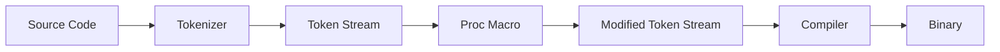
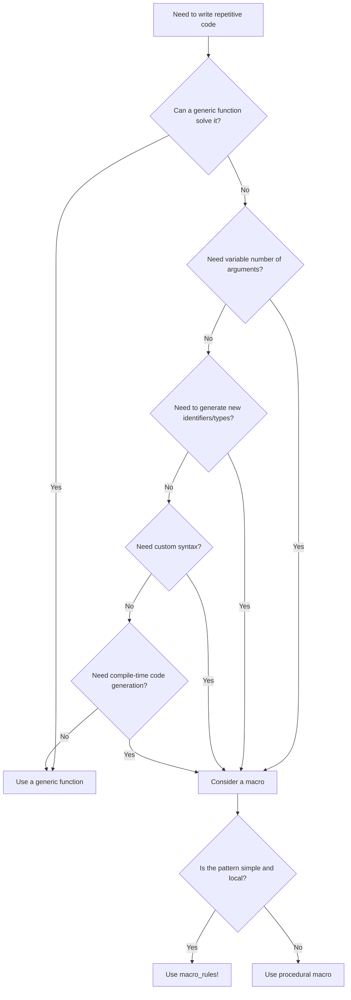

# How to Use Rust Macros Effectively

Author: [nawazdhandala](https://www.github.com/nawazdhandala)

Tags: Rust, Macros, Metaprogramming, Programming, Systems Programming

Description: A practical guide to mastering Rust macros - from declarative macro_rules! to procedural macros and derive macros - with real-world patterns and debugging techniques.

---

Macros in Rust let you write code that writes code. They're not the same as functions - macros operate at compile time on the abstract syntax tree (AST), expanding into valid Rust code before the compiler type-checks anything. This gives you power that functions simply cannot provide: generating repetitive code, building domain-specific syntax, and enforcing patterns at compile time.

This guide covers the practical side of Rust macros: when to use them, how to write them well, and how to debug them when things go wrong.

---

## Table of Contents

1. When Macros Make Sense (and When They Don't)
2. Declarative Macros with macro_rules!
3. Pattern Matching Fundamentals
4. Repetition Patterns
5. Hygiene and Scope
6. Procedural Macros Overview
7. Derive Macros
8. Attribute and Function-like Procedural Macros
9. Common Macro Use Cases
10. Debugging Macros
11. Macros vs Functions - The Decision Framework

---

## 1. When Macros Make Sense (and When They Don't)

Macros shine when you need:

- **Variadic arguments**: Functions have fixed parameters; macros accept any number of inputs.
- **Code generation**: Reducing boilerplate across similar struct implementations.
- **DSLs**: Custom syntax for configuration, testing, or routing.
- **Compile-time guarantees**: Errors caught before runtime.

Macros add complexity when:

- A generic function would work just as well.
- The logic requires runtime values (macros only see tokens).
- Readability matters more than brevity.

The general rule: reach for functions first. Use macros when you hit a wall that only metaprogramming can solve.

---

## 2. Declarative Macros with macro_rules!

Declarative macros use pattern matching to transform input tokens into output code. They're the most common type and live in the same file as your regular Rust code.

Here's the basic structure:

```rust
// A simple macro that prints a debug message with the variable name and value.
// The stringify! macro converts the identifier to a string literal at compile time.
macro_rules! debug_print {
    ($val:expr) => {
        println!("{} = {:?}", stringify!($val), $val);
    };
}

fn main() {
    let x = 42;
    let name = "Rust";

    debug_print!(x);      // prints: x = 42
    debug_print!(name);   // prints: name = "Rust"
    debug_print!(2 + 2);  // prints: 2 + 2 = 4
}
```

The `$val:expr` part is a **fragment specifier** - it tells the macro what kind of syntax to expect. Common specifiers include:

| Specifier | Matches | Example |
|-----------|---------|---------|
| `expr` | Any expression | `2 + 2`, `foo()`, `vec![1,2,3]` |
| `ident` | An identifier | `my_var`, `SomeType` |
| `ty` | A type | `i32`, `Vec<String>` |
| `stmt` | A statement | `let x = 5;` |
| `block` | A block expression | `{ println!("hi"); 42 }` |
| `pat` | A pattern | `Some(x)`, `_`, `1..=5` |
| `path` | A path | `std::collections::HashMap` |
| `tt` | A single token tree | Any token or `(...)`, `[...]`, `{...}` |
| `literal` | A literal value | `42`, `"hello"`, `true` |

---

## 3. Pattern Matching Fundamentals

Macros can have multiple arms, similar to `match` expressions. The macro tries each pattern in order and uses the first one that matches.

```rust
// A macro with multiple matching arms for different input patterns.
// This handles both single values and key-value pairs.
macro_rules! config {
    // Match a single identifier
    ($key:ident) => {
        println!("Config key: {}", stringify!($key));
    };

    // Match an identifier followed by => and an expression
    ($key:ident => $value:expr) => {
        println!("Config {} = {:?}", stringify!($key), $value);
    };

    // Match identifier, type annotation, and value
    ($key:ident : $ty:ty => $value:expr) => {
        let $key: $ty = $value;
        println!("Typed config {} : {} = {:?}",
                 stringify!($key), stringify!($ty), $key);
    };
}

fn main() {
    config!(debug);                    // Config key: debug
    config!(timeout => 30);            // Config timeout = 30
    config!(port: u16 => 8080);        // Typed config port : u16 = 8080
}
```

Order matters. More specific patterns should come before general ones, or they'll never match.

---

## 4. Repetition Patterns

Repetition is where macros really pull ahead of functions. The syntax uses `$(...)*` for zero or more, `$(...)+` for one or more, and `$(...)? ` for zero or one.

```rust
// A macro that creates a HashMap from key-value pairs.
// The $(...)* syntax repeats for each comma-separated pair.
macro_rules! hashmap {
    // Match zero or more key => value pairs separated by commas
    ($($key:expr => $value:expr),* $(,)?) => {
        {
            let mut map = std::collections::HashMap::new();
            $(
                map.insert($key, $value);
            )*
            map
        }
    };
}

fn main() {
    let scores = hashmap! {
        "Alice" => 100,
        "Bob" => 85,
        "Charlie" => 92,
    };

    println!("{:?}", scores);
}
```

The trailing `$(,)?` makes the final comma optional - a quality-of-life detail that matters when people use your macro.

Here's a more complex example with nested repetition:

```rust
// A macro for defining multiple structs with fields in one declaration.
// Uses nested repetition: outer loop for structs, inner loop for fields.
macro_rules! define_structs {
    (
        $(
            struct $name:ident {
                $($field:ident : $ty:ty),* $(,)?
            }
        )*
    ) => {
        $(
            #[derive(Debug)]
            struct $name {
                $($field: $ty),*
            }
        )*
    };
}

define_structs! {
    struct Point {
        x: f64,
        y: f64,
    }

    struct Rectangle {
        width: u32,
        height: u32,
        label: String,
    }
}

fn main() {
    let p = Point { x: 1.0, y: 2.0 };
    let r = Rectangle {
        width: 10,
        height: 20,
        label: "box".into()
    };
    println!("{:?}", p);
    println!("{:?}", r);
}
```

---

## 5. Hygiene and Scope

Rust macros are "hygienic" - variables inside the macro don't accidentally clash with variables outside. Each expansion gets its own scope for locally-defined names.

```rust
// Demonstrating macro hygiene - the internal 'temp' variable
// doesn't conflict with any 'temp' in the calling code.
macro_rules! swap {
    ($a:expr, $b:expr) => {
        {
            let temp = $a;
            $a = $b;
            $b = temp;
        }
    };
}

fn main() {
    let mut x = 1;
    let mut y = 2;
    let temp = 999;  // This temp is separate from the macro's temp

    swap!(x, y);

    println!("x = {}, y = {}, temp = {}", x, y, temp);
    // Output: x = 2, y = 1, temp = 999
}
```

If you need to intentionally break hygiene and reference external items, use `$crate` for paths within your crate.

---

## 6. Procedural Macros Overview

Procedural macros are more powerful but require more setup. They're compiled as separate crates and operate on token streams directly using the `proc-macro` API.



There are three types of procedural macros:

1. **Function-like**: `my_macro!(...)` - similar syntax to declarative macros
2. **Derive**: `#[derive(MyTrait)]` - generates trait implementations
3. **Attribute**: `#[my_attr]` - transforms annotated items

Setting up a procedural macro crate requires specific Cargo.toml configuration:

```toml
[package]
name = "my_macros"
version = "0.1.0"
edition = "2021"

[lib]
proc-macro = true

[dependencies]
syn = { version = "2.0", features = ["full"] }
quote = "1.0"
proc-macro2 = "1.0"
```

The ecosystem standard is to use `syn` for parsing and `quote` for generating code.

---

## 7. Derive Macros

Derive macros automatically implement traits for structs and enums. They're the most common type of procedural macro.

```rust
// In the proc-macro crate (my_macros/src/lib.rs)
use proc_macro::TokenStream;
use quote::quote;
use syn::{parse_macro_input, DeriveInput};

// This derive macro generates a describe() method that returns
// the struct name and field count as a string.
#[proc_macro_derive(Describe)]
pub fn derive_describe(input: TokenStream) -> TokenStream {
    let input = parse_macro_input!(input as DeriveInput);
    let name = &input.ident;

    // Count fields if it's a struct with named fields
    let field_count = match &input.data {
        syn::Data::Struct(data) => match &data.fields {
            syn::Fields::Named(fields) => fields.named.len(),
            syn::Fields::Unnamed(fields) => fields.unnamed.len(),
            syn::Fields::Unit => 0,
        },
        _ => 0,
    };

    let expanded = quote! {
        impl #name {
            pub fn describe() -> String {
                format!(
                    "{} has {} field(s)",
                    stringify!(#name),
                    #field_count
                )
            }
        }
    };

    TokenStream::from(expanded)
}
```

Using the derive macro in application code:

```rust
// In the application crate
use my_macros::Describe;

#[derive(Describe)]
struct User {
    id: u64,
    name: String,
    email: String,
}

fn main() {
    println!("{}", User::describe());
    // Output: User has 3 field(s)
}
```

Derive macros can also accept helper attributes for customization:

```rust
// Declare that our derive macro uses a helper attribute called "describe"
#[proc_macro_derive(Describe, attributes(describe))]
pub fn derive_describe(input: TokenStream) -> TokenStream {
    // ... parse and look for #[describe(skip)] on fields
}
```

---

## 8. Attribute and Function-like Procedural Macros

Attribute macros transform the item they're attached to:

```rust
// An attribute macro that wraps a function with timing instrumentation.
// Usage: #[timed] fn my_function() { ... }
#[proc_macro_attribute]
pub fn timed(attr: TokenStream, item: TokenStream) -> TokenStream {
    let input = parse_macro_input!(item as syn::ItemFn);
    let fn_name = &input.sig.ident;
    let fn_block = &input.block;
    let fn_sig = &input.sig;
    let fn_vis = &input.vis;

    let expanded = quote! {
        #fn_vis #fn_sig {
            let start = std::time::Instant::now();
            let result = (|| #fn_block)();
            println!("{} took {:?}", stringify!(#fn_name), start.elapsed());
            result
        }
    };

    TokenStream::from(expanded)
}
```

Function-like procedural macros look like declarative macros but have full procedural power:

```rust
// A function-like macro that generates SQL query builders.
// Usage: sql!(SELECT * FROM users WHERE id = ?)
#[proc_macro]
pub fn sql(input: TokenStream) -> TokenStream {
    let input_string = input.to_string();

    let expanded = quote! {
        {
            let query = #input_string;
            SqlQuery::new(query)
        }
    };

    TokenStream::from(expanded)
}
```

---

## 9. Common Macro Use Cases

Here are patterns you'll encounter repeatedly in production Rust code:

**Builder pattern generation:**

```rust
// Generates builder methods for each field of a struct.
// Reduces boilerplate when structs have many optional fields.
macro_rules! builder {
    ($name:ident { $($field:ident : $ty:ty),* $(,)? }) => {
        #[derive(Default)]
        struct $name {
            $($field: Option<$ty>),*
        }

        impl $name {
            fn new() -> Self {
                Self::default()
            }

            $(
                fn $field(mut self, value: $ty) -> Self {
                    self.$field = Some(value);
                    self
                }
            )*
        }
    };
}

builder!(RequestBuilder {
    url: String,
    timeout: u64,
    retries: u32,
});
```

**Enum dispatch:**

```rust
// Generates match arms that delegate to inner types.
// Useful for enum wrappers around trait objects.
macro_rules! dispatch {
    ($self:expr, $method:ident $(, $arg:expr)*) => {
        match $self {
            Self::Http(inner) => inner.$method($($arg),*),
            Self::Grpc(inner) => inner.$method($($arg),*),
            Self::WebSocket(inner) => inner.$method($($arg),*),
        }
    };
}

enum Transport {
    Http(HttpClient),
    Grpc(GrpcClient),
    WebSocket(WsClient),
}

impl Transport {
    fn send(&self, data: &[u8]) -> Result<(), Error> {
        dispatch!(self, send, data)
    }

    fn close(&mut self) {
        dispatch!(self, close)
    }
}
```

**Test case generation:**

```rust
// Generates multiple test functions from a table of inputs and expected outputs.
// Keeps tests readable while avoiding copy-paste.
macro_rules! test_cases {
    ($name:ident, $func:expr, [$(($input:expr, $expected:expr)),* $(,)?]) => {
        mod $name {
            use super::*;

            $(
                #[test]
                fn $input() {
                    let input = stringify!($input);
                    assert_eq!($func($input), $expected);
                }
            )*
        }
    };
}

fn parse_bool(s: &str) -> bool {
    matches!(s, "true" | "yes" | "1")
}

test_cases!(parse_bool_tests, parse_bool, [
    (true, true),
    (yes, true),
    (false, false),
    (no, false),
]);
```

---

## 10. Debugging Macros

Macros can be frustrating to debug because errors point to generated code you can't see directly. Here are techniques that help:

**Expand macros to see generated code:**

```bash
# Using cargo-expand (install with: cargo install cargo-expand)
cargo expand

# Expand a specific module
cargo expand module_name

# Expand and save to file for inspection
cargo expand > expanded.rs
```

**Use the trace_macros feature for recursive expansion:**

```rust
#![feature(trace_macros)]

trace_macros!(true);
my_macro!(some input);
trace_macros!(false);
```

**Compile-time debugging with compile_error:**

```rust
// Use compile_error! to verify macro branches during development
macro_rules! debug_macro {
    (number $n:expr) => {
        compile_error!("matched number branch");
    };
    (string $s:expr) => {
        compile_error!("matched string branch");
    };
    ($other:tt) => {
        compile_error!(concat!("matched other branch with: ", stringify!($other)));
    };
}
```

**Incremental development pattern:**

```rust
// Start with a minimal macro that just echoes input
macro_rules! my_macro {
    ($($input:tt)*) => {
        compile_error!(stringify!($($input)*));
    };
}

// Then gradually build up the transformation
macro_rules! my_macro {
    ($name:ident { $($field:ident),* }) => {
        compile_error!(concat!(
            "name: ", stringify!($name),
            " fields: ", stringify!($($field),*)
        ));
    };
}
```

**The log-and-panic pattern for proc macros:**

```rust
#[proc_macro_derive(MyDerive)]
pub fn my_derive(input: TokenStream) -> TokenStream {
    let input = parse_macro_input!(input as DeriveInput);

    // During development, dump the parsed structure
    eprintln!("Parsed input: {:#?}", input);

    // Or panic with the generated code to inspect it
    let expanded = quote! { /* ... */ };
    panic!("Generated: {}", expanded);

    TokenStream::from(expanded)
}
```

---

## 11. Macros vs Functions - The Decision Framework

Use this flowchart to decide whether a macro is the right tool:



**Choose functions when:**

- The logic depends on runtime values
- Type inference and generics cover your use case
- Error messages need to be clear and actionable
- Other developers will read the code frequently

**Choose macros when:**

- You need variadic inputs (`println!`, `vec!`)
- You're generating boilerplate across many similar types
- You want compile-time validation of patterns
- You're building a DSL for a specific domain

**Comparison at a glance:**

| Aspect | Functions | Macros |
|--------|-----------|--------|
| Evaluation time | Runtime | Compile time |
| Type checking | On function signature | On expanded code |
| Arguments | Fixed count and types | Any tokens |
| Debugging | Standard tools | Requires expansion |
| Error messages | Points to call site | Points to generated code |
| IDE support | Full | Limited |
| Learning curve | Standard Rust | Separate syntax |

---

## Summary

Macros are a sharp tool in the Rust toolbox. Used well, they eliminate boilerplate, enforce patterns, and let you build expressive APIs. Used poorly, they create debugging nightmares and confuse everyone who reads your code.

The key principles:

1. Start with functions. Only reach for macros when you hit limits.
2. Keep macros small and focused. Compose them rather than building monoliths.
3. Test macro expansion explicitly. Don't assume the output is what you expect.
4. Document the input patterns. Users need to know what syntax works.
5. Use `cargo-expand` liberally. Seeing generated code removes mystery.

Declarative macros handle most needs. Procedural macros unlock the rest but require separate crates and more complexity. Pick the simplest tool that solves your problem.

---

**Related Reading:**

- [The Rust Reference - Macros](https://doc.rust-lang.org/reference/macros.html)
- [The Little Book of Rust Macros](https://veykril.github.io/tlborm/)
- [Procedural Macros Workshop](https://github.com/dtolnay/proc-macro-workshop)
