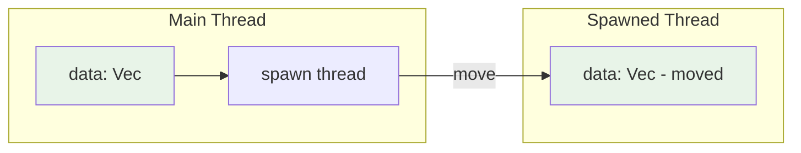
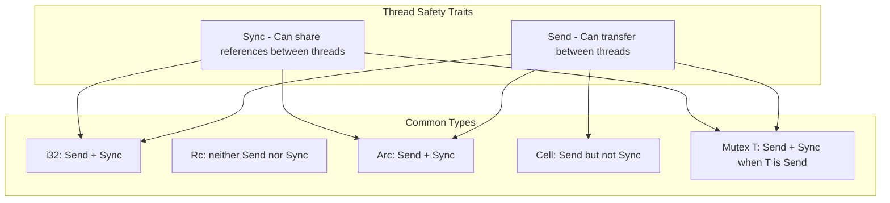
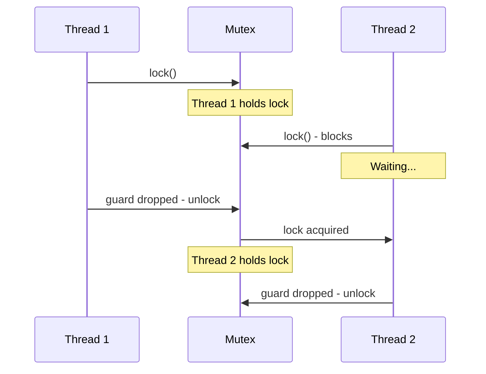
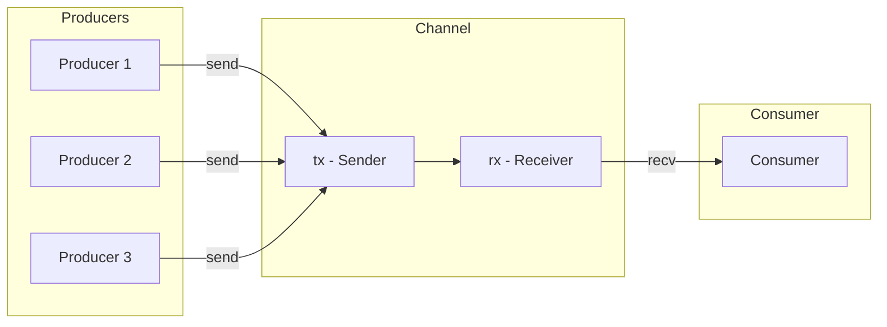
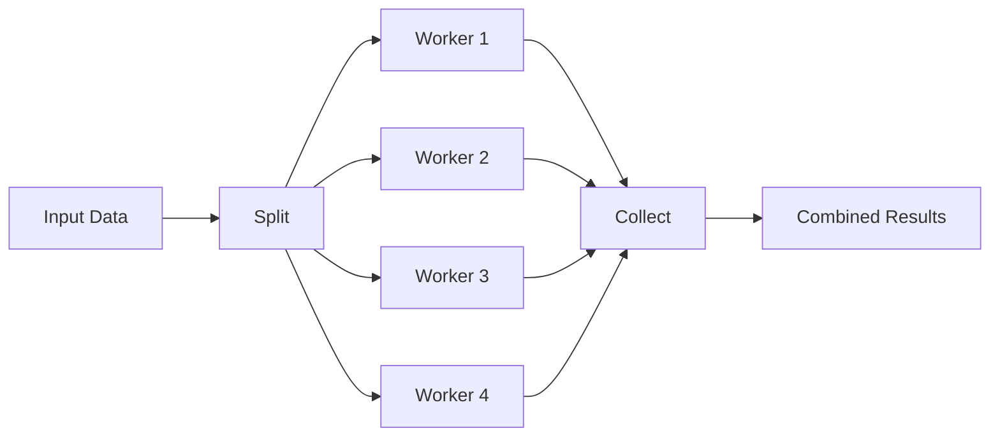

# How to Implement Memory-Safe Concurrency in Rust

Author: [nawazdhandala](https://www.github.com/nawazdhandala)

Tags: Rust, Concurrency, Memory Safety, Performance, Systems Programming

Description: A practical guide to writing concurrent Rust code that is guaranteed free of data races at compile time, covering ownership, threads, synchronization primitives, and common patterns.

---

Concurrency is hard. Data races, deadlocks, and memory corruption have plagued systems programmers for decades. Rust takes a different approach - it uses its ownership system to prevent data races at compile time. If your code compiles, it cannot have data races. This is not a runtime guarantee or a best practice. It is enforced by the compiler.

This guide walks through how to write concurrent Rust code, from basic thread spawning to advanced patterns using channels and shared state.

## Ownership and Threads

Before diving into threads, you need to understand how Rust's ownership rules apply to concurrent code. Every value in Rust has a single owner, and values can be borrowed either as many immutable references or one mutable reference - never both simultaneously.

When you spawn a thread, you are creating a new execution context that outlives the current scope. This means any data the thread accesses must either be moved into the thread or have a static lifetime.

The following diagram shows how ownership transfers when spawning threads:



## Thread Spawning

The standard library provides `std::thread::spawn` for creating new threads. By default, you must move data into the closure because Rust cannot guarantee the spawned thread will finish before the data goes out of scope.

This example spawns a thread that takes ownership of the vector. The `move` keyword transfers ownership into the closure, making the data available inside the spawned thread.

```rust
use std::thread;

fn main() {
    let data = vec![1, 2, 3, 4, 5];

    // The move keyword transfers ownership of data into the thread.
    // Without move, this would not compile because data might be
    // dropped while the thread is still running.
    let handle = thread::spawn(move || {
        let sum: i32 = data.iter().sum();
        println!("Sum calculated in thread: {}", sum);
        sum
    });

    // Wait for the thread to finish and get its result.
    // join() returns a Result because the thread might panic.
    let result = handle.join().expect("Thread panicked");
    println!("Thread returned: {}", result);
}
```

### Spawning Multiple Threads

When processing independent work items, spawn a thread for each chunk. Each thread gets its own copy of any data it needs through the move closure.

```rust
use std::thread;

fn main() {
    let mut handles = vec![];

    // Spawn 5 threads, each processing a different chunk of work.
    for thread_id in 0..5 {
        let handle = thread::spawn(move || {
            // thread_id is moved into each closure.
            let result = expensive_computation(thread_id);
            println!("Thread {} computed: {}", thread_id, result);
            result
        });
        handles.push(handle);
    }

    // Collect results from all threads.
    let results: Vec<u64> = handles
        .into_iter()
        .map(|h| h.join().expect("Thread panicked"))
        .collect();

    println!("All results: {:?}", results);
    println!("Total: {}", results.iter().sum::<u64>());
}

fn expensive_computation(id: usize) -> u64 {
    // Simulate work.
    let base = (id as u64 + 1) * 1000;
    (0..base).sum()
}
```

## The Send and Sync Traits

Rust uses two marker traits to determine what types can be used across threads:

- **Send**: A type is Send if it can be transferred to another thread. Most types are Send.
- **Sync**: A type is Sync if it can be shared between threads via references. A type T is Sync if &T is Send.

These traits are automatically implemented by the compiler for types that satisfy the requirements. You rarely implement them manually.



Types that are not Send or Sync include:

- `Rc<T>` - reference counting is not thread-safe
- `RefCell<T>` - interior mutability without synchronization
- Raw pointers - the compiler cannot verify their safety

This example demonstrates that the compiler catches thread safety violations at compile time, not runtime.

```rust
use std::rc::Rc;
use std::sync::Arc;
use std::thread;

fn main() {
    let rc = Rc::new(42);

    // This will NOT compile - Rc is not Send.
    // thread::spawn(move || {
    //     println!("Value: {}", rc);
    // });

    // Use Arc instead for thread-safe reference counting.
    let arc = Arc::new(42);
    let arc_clone = Arc::clone(&arc);

    let handle = thread::spawn(move || {
        println!("Value from thread: {}", arc_clone);
    });

    handle.join().unwrap();
    println!("Value in main: {}", arc);
}
```

## Shared State with Arc and Mutex

When multiple threads need to access the same data, you need two things: a way to share ownership (Arc) and a way to synchronize access (Mutex).

**Arc** (Atomic Reference Counting) provides shared ownership across threads. Unlike Rc, its reference counting is thread-safe.

**Mutex** provides mutual exclusion - only one thread can access the data at a time. When a thread wants to access the data, it locks the mutex and receives a guard. The guard automatically unlocks the mutex when dropped.



This example shows the standard pattern for sharing mutable state between threads. Each thread gets its own Arc that points to the same Mutex-protected data.

```rust
use std::sync::{Arc, Mutex};
use std::thread;

fn main() {
    // Arc allows multiple ownership across threads.
    // Mutex allows mutable access with synchronization.
    let counter = Arc::new(Mutex::new(0));
    let mut handles = vec![];

    for i in 0..10 {
        // Clone the Arc to give this thread its own reference.
        // This increments the reference count, not the data.
        let counter_clone = Arc::clone(&counter);

        let handle = thread::spawn(move || {
            // lock() blocks until we can acquire the mutex.
            // It returns a MutexGuard that auto-unlocks on drop.
            let mut num = counter_clone.lock().unwrap();
            *num += 1;
            println!("Thread {} incremented counter to {}", i, *num);
            // MutexGuard is dropped here, releasing the lock.
        });

        handles.push(handle);
    }

    // Wait for all threads to complete.
    for handle in handles {
        handle.join().unwrap();
    }

    // Final value - all 10 threads have incremented.
    println!("Final counter value: {}", *counter.lock().unwrap());
}
```

### Minimizing Lock Contention

Hold locks for the shortest time possible. Compute values outside the critical section and only lock when you need to access the shared data.

```rust
use std::sync::{Arc, Mutex};
use std::thread;
use std::time::Duration;

fn main() {
    let results = Arc::new(Mutex::new(Vec::new()));
    let mut handles = vec![];

    for i in 0..4 {
        let results_clone = Arc::clone(&results);

        let handle = thread::spawn(move || {
            // Do expensive computation OUTSIDE the lock.
            let computed = expensive_computation(i);

            // Only hold lock for the push operation.
            {
                let mut guard = results_clone.lock().unwrap();
                guard.push(computed);
            }
            // Lock released immediately after the block.

            println!("Thread {} finished", i);
        });
        handles.push(handle);
    }

    for handle in handles {
        handle.join().unwrap();
    }

    let final_results = results.lock().unwrap();
    println!("Results: {:?}", *final_results);
}

fn expensive_computation(id: usize) -> u64 {
    // Simulate expensive work that should not hold a lock.
    thread::sleep(Duration::from_millis(100));
    (id as u64 + 1) * 1000
}
```

## RwLock for Read-Heavy Workloads

Mutex only allows one thread to access data at a time, even for reads. When you have many readers and few writers, this is inefficient. RwLock allows multiple simultaneous readers OR one exclusive writer.

Use RwLock when:
- Reads are much more frequent than writes
- Read operations take significant time
- You can tolerate slightly higher overhead per operation

```rust
use std::sync::{Arc, RwLock};
use std::thread;
use std::time::Duration;

fn main() {
    // RwLock allows multiple readers OR one writer.
    let config = Arc::new(RwLock::new(Config {
        max_connections: 100,
        timeout_seconds: 30,
        debug_mode: false,
    }));

    let mut handles = vec![];

    // Spawn several reader threads.
    for i in 0..5 {
        let config_clone = Arc::clone(&config);
        handles.push(thread::spawn(move || {
            for _ in 0..3 {
                // read() allows multiple threads to read simultaneously.
                // This only blocks if a writer holds the lock.
                let cfg = config_clone.read().unwrap();
                println!(
                    "Reader {}: max_connections={}, timeout={}s",
                    i, cfg.max_connections, cfg.timeout_seconds
                );
                drop(cfg); // Release read lock explicitly.
                thread::sleep(Duration::from_millis(50));
            }
        }));
    }

    // Spawn a writer thread.
    let config_writer = Arc::clone(&config);
    handles.push(thread::spawn(move || {
        thread::sleep(Duration::from_millis(100));

        // write() requires exclusive access.
        // Blocks until all readers and writers release their locks.
        let mut cfg = config_writer.write().unwrap();
        cfg.max_connections = 200;
        cfg.timeout_seconds = 60;
        println!("Writer: updated config");
        // Write lock released here.
    }));

    for handle in handles {
        handle.join().unwrap();
    }

    println!("Final config: {:?}", *config.read().unwrap());
}

#[derive(Debug)]
struct Config {
    max_connections: u32,
    timeout_seconds: u32,
    debug_mode: bool,
}
```

### RwLock vs Mutex Decision Guide

| Scenario | Recommendation |
|----------|----------------|
| Mostly reads, rare writes | RwLock |
| Balanced reads and writes | Mutex |
| Very short critical sections | Mutex (lower overhead) |
| Long-running read operations | RwLock |
| Simple counters | Atomic types |

## Message Passing with Channels (mpsc)

Channels provide a way to send data between threads without shared memory. Rust's standard library offers `mpsc` (multiple producer, single consumer) channels. The idea is simple: instead of sharing memory, threads communicate by sending messages.



### Basic Channel Usage

The transmitter (tx) sends messages, and the receiver (rx) receives them. The channel takes ownership of sent values.

```rust
use std::sync::mpsc;
use std::thread;
use std::time::Duration;

fn main() {
    // Create a channel: tx (transmitter) sends, rx (receiver) receives.
    let (tx, rx) = mpsc::channel();

    // Spawn a thread that sends messages.
    thread::spawn(move || {
        let messages = vec!["hello", "from", "the", "thread"];

        for msg in messages {
            // send() transfers ownership of the value.
            tx.send(msg).unwrap();
            thread::sleep(Duration::from_millis(100));
        }
        // tx is dropped here, closing the channel.
    });

    // Receive messages in the main thread.
    // The iterator ends when the channel closes.
    for received in rx {
        println!("Got: {}", received);
    }

    println!("Channel closed");
}
```

### Multiple Producers

Clone the transmitter to send from multiple threads. All clones share the same channel.

```rust
use std::sync::mpsc;
use std::thread;
use std::time::Duration;

fn main() {
    let (tx, rx) = mpsc::channel();
    let mut handles = vec![];

    // Spawn multiple producer threads.
    for producer_id in 0..3 {
        // Clone transmitter for each producer.
        let tx_clone = tx.clone();

        let handle = thread::spawn(move || {
            for i in 0..5 {
                let message = format!("Producer {} message {}", producer_id, i);
                tx_clone.send(message).unwrap();
                thread::sleep(Duration::from_millis(50 + (producer_id * 20) as u64));
            }
            println!("Producer {} done", producer_id);
        });
        handles.push(handle);
    }

    // Drop the original tx so the channel closes when all clones are done.
    drop(tx);

    // Receive all messages.
    let mut count = 0;
    for message in rx {
        println!("Received: {}", message);
        count += 1;
    }

    println!("Total messages received: {}", count);

    for handle in handles {
        handle.join().unwrap();
    }
}
```

### Structured Messages with Enums

Use enums to send different types of messages through the same channel. This is a common pattern for worker threads that need to handle multiple message types.

```rust
use std::sync::mpsc;
use std::thread;

// Define message types using an enum.
enum WorkerMessage {
    Task { id: u32, data: String },
    Status { worker_id: u32, tasks_completed: u32 },
    Shutdown,
}

enum ControlMessage {
    NewTask(String),
    RequestStatus,
    Stop,
}

fn main() {
    // Channel for worker to send results.
    let (result_tx, result_rx) = mpsc::channel();

    // Channel for main to send commands.
    let (control_tx, control_rx) = mpsc::channel::<ControlMessage>();

    // Spawn worker thread.
    let worker = thread::spawn(move || {
        let mut tasks_completed = 0u32;
        let worker_id = 1;

        loop {
            match control_rx.recv() {
                Ok(ControlMessage::NewTask(data)) => {
                    tasks_completed += 1;
                    let result = format!("Processed: {}", data.to_uppercase());
                    result_tx
                        .send(WorkerMessage::Task {
                            id: tasks_completed,
                            data: result,
                        })
                        .unwrap();
                }
                Ok(ControlMessage::RequestStatus) => {
                    result_tx
                        .send(WorkerMessage::Status {
                            worker_id,
                            tasks_completed,
                        })
                        .unwrap();
                }
                Ok(ControlMessage::Stop) => {
                    result_tx.send(WorkerMessage::Shutdown).unwrap();
                    break;
                }
                Err(_) => break,
            }
        }
        println!("Worker shutting down");
    });

    // Send tasks to the worker.
    control_tx
        .send(ControlMessage::NewTask("first task".to_string()))
        .unwrap();
    control_tx
        .send(ControlMessage::NewTask("second task".to_string()))
        .unwrap();
    control_tx.send(ControlMessage::RequestStatus).unwrap();
    control_tx
        .send(ControlMessage::NewTask("third task".to_string()))
        .unwrap();
    control_tx.send(ControlMessage::Stop).unwrap();

    // Receive results.
    for msg in result_rx {
        match msg {
            WorkerMessage::Task { id, data } => {
                println!("Task {} result: {}", id, data);
            }
            WorkerMessage::Status {
                worker_id,
                tasks_completed,
            } => {
                println!(
                    "Worker {} status: {} tasks completed",
                    worker_id, tasks_completed
                );
            }
            WorkerMessage::Shutdown => {
                println!("Received shutdown confirmation");
                break;
            }
        }
    }

    worker.join().unwrap();
}
```

### Synchronous Channels with Backpressure

The default channel is unbounded - sends never block. For bounded channels that block when full, use `sync_channel`. This provides backpressure to prevent producers from overwhelming consumers.

```rust
use std::sync::mpsc;
use std::thread;
use std::time::Duration;

fn main() {
    // Create channel with capacity 2.
    // Sends block when buffer is full.
    let (tx, rx) = mpsc::sync_channel(2);

    let producer = thread::spawn(move || {
        for i in 0..10 {
            println!("Sending {}", i);
            tx.send(i).unwrap(); // Blocks if buffer full.
            println!("Sent {}", i);
        }
    });

    let consumer = thread::spawn(move || {
        for received in rx {
            println!("Processing {}", received);
            // Slow consumer creates backpressure.
            thread::sleep(Duration::from_millis(200));
            println!("Finished processing {}", received);
        }
    });

    producer.join().unwrap();
    consumer.join().unwrap();
}
```

## Scoped Threads

Standard spawned threads can outlive the function that created them, which is why you need `move`. But sometimes you want threads that borrow data and are guaranteed to finish before the current scope ends. Scoped threads solve this problem.

Scoped threads are created within a `thread::scope` block. The compiler guarantees all spawned threads complete before the scope exits, which means they can safely borrow data from the enclosing scope.

```rust
use std::thread;

fn main() {
    let mut numbers = vec![1, 2, 3, 4, 5];
    let multiplier = 2;

    // thread::scope creates a scope where all spawned threads must
    // complete before the scope exits. This allows borrowing from
    // the enclosing scope without move.
    thread::scope(|s| {
        // This thread can borrow numbers immutably.
        s.spawn(|| {
            let sum: i32 = numbers.iter().sum();
            println!("Sum: {}", sum);
        });

        // Another thread can also borrow numbers immutably.
        // Multiple immutable borrows are allowed.
        s.spawn(|| {
            let product: i32 = numbers.iter()
                .map(|n| n * multiplier)
                .product();
            println!("Product after multiplying by {}: {}", multiplier, product);
        });
    });
    // All threads have completed here - scope guarantees this.

    // We can now use numbers again since all borrows have ended.
    numbers.push(6);
    println!("Numbers after threads: {:?}", numbers);
}
```

### Parallel Processing with Scoped Threads

Scoped threads shine when you need to process data in parallel and collect results. No Arc or Mutex needed because lifetimes are guaranteed.

```rust
use std::thread;

fn main() {
    let mut data = vec![1, 2, 3, 4, 5, 6, 7, 8];

    thread::scope(|s| {
        // Split data into two mutable slices.
        let (left, right) = data.split_at_mut(4);

        // Each thread can mutably borrow its slice.
        s.spawn(|| {
            for item in left.iter_mut() {
                *item *= 2;
            }
            println!("Left processed: {:?}", left);
        });

        s.spawn(|| {
            for item in right.iter_mut() {
                *item *= 3;
            }
            println!("Right processed: {:?}", right);
        });
    });

    // Safe to use data here - all threads finished.
    println!("Final data: {:?}", data);
}
```

## Common Concurrency Patterns

### Worker Pool

A worker pool manages a fixed number of threads that process tasks from a shared queue. This is useful when you want to limit concurrency or reuse threads across many tasks.

```rust
use std::sync::mpsc;
use std::sync::{Arc, Mutex};
use std::thread;

type Job = Box<dyn FnOnce() + Send + 'static>;

struct ThreadPool {
    workers: Vec<Worker>,
    sender: Option<mpsc::Sender<Job>>,
}

struct Worker {
    id: usize,
    handle: Option<thread::JoinHandle<()>>,
}

impl ThreadPool {
    fn new(size: usize) -> ThreadPool {
        assert!(size > 0);

        let (sender, receiver) = mpsc::channel();
        // Wrap receiver in Arc and Mutex so workers can share it.
        let receiver = Arc::new(Mutex::new(receiver));

        let mut workers = Vec::with_capacity(size);

        for id in 0..size {
            workers.push(Worker::new(id, Arc::clone(&receiver)));
        }

        ThreadPool {
            workers,
            sender: Some(sender),
        }
    }

    fn execute<F>(&self, f: F)
    where
        F: FnOnce() + Send + 'static,
    {
        let job = Box::new(f);
        self.sender.as_ref().unwrap().send(job).unwrap();
    }
}

impl Drop for ThreadPool {
    fn drop(&mut self) {
        // Drop sender to close the channel.
        drop(self.sender.take());

        // Wait for all workers to finish.
        for worker in &mut self.workers {
            println!("Shutting down worker {}", worker.id);
            if let Some(handle) = worker.handle.take() {
                handle.join().unwrap();
            }
        }
    }
}

impl Worker {
    fn new(id: usize, receiver: Arc<Mutex<mpsc::Receiver<Job>>>) -> Worker {
        let handle = thread::spawn(move || loop {
            // Lock the receiver, get a job, then release the lock.
            let job = {
                let lock = receiver.lock().unwrap();
                lock.recv()
            };

            match job {
                Ok(job) => {
                    println!("Worker {} got a job; executing.", id);
                    job();
                }
                Err(_) => {
                    println!("Worker {} disconnected; shutting down.", id);
                    break;
                }
            }
        });

        Worker {
            id,
            handle: Some(handle),
        }
    }
}

fn main() {
    let pool = ThreadPool::new(4);

    for i in 0..8 {
        pool.execute(move || {
            println!("Task {} starting", i);
            thread::sleep(std::time::Duration::from_millis(100));
            println!("Task {} complete", i);
        });
    }

    println!("All tasks submitted");
    // Pool is dropped here, waiting for all tasks to complete.
}
```

### Fan-Out Fan-In

This pattern distributes work across multiple threads (fan-out) and collects results back (fan-in). It is useful for parallel processing of independent items.



```rust
use std::sync::mpsc;
use std::thread;

fn main() {
    let items: Vec<i32> = (1..=100).collect();
    let num_workers = 4;

    // Split work among workers.
    let chunk_size = (items.len() + num_workers - 1) / num_workers;
    let chunks: Vec<Vec<i32>> = items
        .chunks(chunk_size)
        .map(|c| c.to_vec())
        .collect();

    let (tx, rx) = mpsc::channel();

    // Fan-out: spawn workers for each chunk.
    for (id, chunk) in chunks.into_iter().enumerate() {
        let tx = tx.clone();

        thread::spawn(move || {
            let partial_sum: i32 = chunk.iter().sum();
            println!("Worker {} computed partial sum: {}", id, partial_sum);
            tx.send(partial_sum).unwrap();
        });
    }

    drop(tx); // Close sender so rx iterator terminates.

    // Fan-in: collect results.
    let total: i32 = rx.iter().sum();
    println!("Total sum: {}", total);
}
```

### Pipeline Pattern

Pipelines connect stages where each stage processes and forwards data to the next. Each stage runs in its own thread, allowing all stages to execute concurrently.


```rust
use std::sync::mpsc;
use std::thread;

fn main() {
    // Create channels connecting pipeline stages.
    let (gen_tx, filter_rx) = mpsc::channel();
    let (filter_tx, transform_rx) = mpsc::channel();
    let (transform_tx, collect_rx) = mpsc::channel();

    // Stage 1: Generator - produces raw data.
    thread::spawn(move || {
        for i in 1..=20 {
            gen_tx.send(i).unwrap();
        }
    });

    // Stage 2: Filter - keeps only even numbers.
    thread::spawn(move || {
        for n in filter_rx {
            if n % 2 == 0 {
                filter_tx.send(n).unwrap();
            }
        }
    });

    // Stage 3: Transform - squares the numbers.
    thread::spawn(move || {
        for n in transform_rx {
            transform_tx.send(n * n).unwrap();
        }
    });

    // Stage 4: Collector - gathers results in main thread.
    let results: Vec<i32> = collect_rx.iter().collect();
    println!("Pipeline results: {:?}", results);
    // Output: [4, 16, 36, 64, 100, 144, 196, 256, 324, 400]
}
```

### Producer-Consumer with Graceful Shutdown

A robust producer-consumer pattern that handles shutdown gracefully using sentinel values.

```rust
use std::sync::mpsc;
use std::thread;
use std::time::Duration;

enum Task {
    Work(String),
    Shutdown,
}

fn main() {
    let (tx, rx) = mpsc::channel();
    let num_workers = 3;

    // Spawn workers.
    let mut handles = vec![];
    for worker_id in 0..num_workers {
        let rx_clone = {
            // Each worker needs its own receiver clone.
            // We use Arc and Mutex for shared access.
            use std::sync::{Arc, Mutex};
            Arc::new(Mutex::new(rx))
        };

        // For simplicity, let workers share a single receiver.
        // In production, consider using crossbeam channels.
        break;
    }

    // Simpler approach: single consumer with internal dispatch.
    let worker = thread::spawn(move || {
        loop {
            match rx.recv() {
                Ok(Task::Work(data)) => {
                    println!("Processing: {}", data);
                    thread::sleep(Duration::from_millis(50));
                }
                Ok(Task::Shutdown) => {
                    println!("Worker received shutdown signal");
                    break;
                }
                Err(_) => {
                    println!("Channel closed");
                    break;
                }
            }
        }
    });

    // Send work.
    for i in 0..10 {
        tx.send(Task::Work(format!("Task {}", i))).unwrap();
    }

    // Send shutdown signal.
    tx.send(Task::Shutdown).unwrap();

    worker.join().unwrap();
    println!("All done");
}
```

## Avoiding Deadlocks

Rust prevents data races at compile time, but deadlocks are still possible. A deadlock occurs when threads wait for each other indefinitely. The compiler cannot detect this because it requires runtime knowledge of execution order.

Common deadlock scenarios:
1. Two threads each holding a lock the other needs
2. A thread trying to acquire a lock it already holds
3. Circular dependencies in lock acquisition order

### Lock Ordering

Always acquire locks in the same order across all threads.

```rust
use std::sync::{Arc, Mutex};
use std::thread;
use std::time::Duration;

fn main() {
    let resource_a = Arc::new(Mutex::new("Resource A".to_string()));
    let resource_b = Arc::new(Mutex::new("Resource B".to_string()));

    let a1 = Arc::clone(&resource_a);
    let b1 = Arc::clone(&resource_b);

    let a2 = Arc::clone(&resource_a);
    let b2 = Arc::clone(&resource_b);

    // Both threads lock in the same order: A then B.
    // This prevents deadlock.
    let t1 = thread::spawn(move || {
        let _a = a1.lock().unwrap();
        println!("Thread 1 has A");
        thread::sleep(Duration::from_millis(10));
        let _b = b1.lock().unwrap();
        println!("Thread 1 has A and B");
    });

    let t2 = thread::spawn(move || {
        let _a = a2.lock().unwrap();
        println!("Thread 2 has A");
        thread::sleep(Duration::from_millis(10));
        let _b = b2.lock().unwrap();
        println!("Thread 2 has A and B");
    });

    t1.join().unwrap();
    t2.join().unwrap();

    println!("No deadlock!");
}
```

### Using try_lock

Use `try_lock` to avoid blocking indefinitely. If the lock is not available, you can retry or take alternative action.

```rust
use std::sync::{Arc, Mutex};
use std::thread;
use std::time::Duration;

fn main() {
    let resource = Arc::new(Mutex::new(0));

    let r1 = Arc::clone(&resource);
    let t1 = thread::spawn(move || {
        let guard = r1.lock().unwrap();
        println!("Thread 1 holding lock");
        thread::sleep(Duration::from_millis(500));
        println!("Thread 1 releasing, value: {}", *guard);
    });

    // Give t1 time to acquire the lock.
    thread::sleep(Duration::from_millis(50));

    let r2 = Arc::clone(&resource);
    let t2 = thread::spawn(move || {
        // Try to acquire without blocking indefinitely.
        for attempt in 1..=5 {
            match r2.try_lock() {
                Ok(mut guard) => {
                    *guard += 1;
                    println!("Thread 2 acquired lock on attempt {}", attempt);
                    return;
                }
                Err(_) => {
                    println!("Thread 2 attempt {} failed, retrying...", attempt);
                    thread::sleep(Duration::from_millis(100));
                }
            }
        }
        println!("Thread 2 gave up");
    });

    t1.join().unwrap();
    t2.join().unwrap();
}
```

## Practical Tips

**Start with channels.** Message passing is easier to reason about than shared state. Only use Mutex or RwLock when you need multiple threads to access the same data and channels would be awkward.

**Minimize lock scope.** Hold locks for the shortest time possible. Extract values from the lock guard and drop it before doing expensive computation.

**Prefer Arc and Mutex over static mut.** Global mutable state with `static mut` is unsafe and requires manual synchronization. Arc and Mutex handle this safely.

**Use scoped threads when possible.** They let you borrow from the enclosing scope, avoiding unnecessary clones and Arc overhead.

**Test with thread sanitizers.** While Rust prevents data races, logic bugs can still occur. Run tests with MIRI or ThreadSanitizer during development.

## Summary

| Primitive | Use Case |
|-----------|----------|
| `thread::spawn` | Fire-and-forget threads or when you need to return handles |
| `thread::scope` | Threads that borrow from enclosing scope |
| `Arc<T>` | Shared ownership across threads |
| `Mutex<T>` | Exclusive mutable access to shared data |
| `RwLock<T>` | Many readers, few writers |
| `mpsc::channel` | Message passing between threads |
| `mpsc::sync_channel` | Bounded message passing with backpressure |
| `Send` | Type can be transferred to another thread |
| `Sync` | Type can be referenced from multiple threads |

Rust's ownership system makes concurrent programming safer than in any mainstream language. Data races are caught at compile time, not discovered in production at 3 AM. The primitives may seem restrictive at first, but they encode the same patterns you would use in any language - Rust just makes them explicit and verified by the compiler.

Once you internalize the model, writing concurrent Rust becomes second nature. The compiler is not fighting you - it is teaching you which patterns are sound and which hide subtle bugs.
