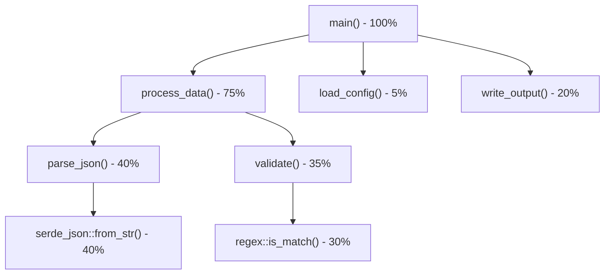
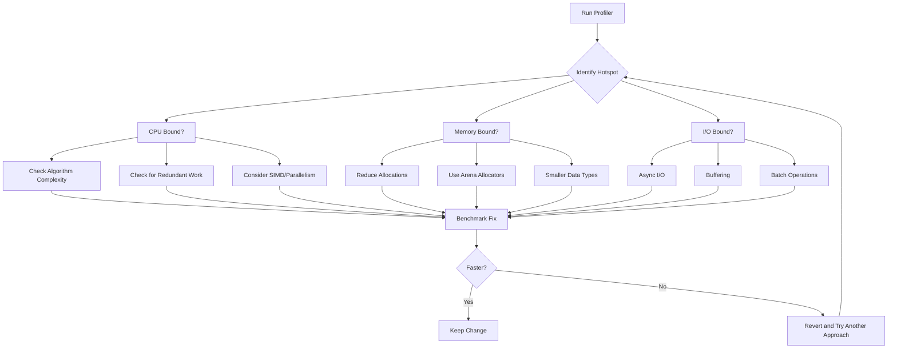

# How to Profile Rust Applications for Performance

Author: [nawazdhandala](https://www.github.com/nawazdhandala)

Tags: Rust, Performance, Profiling, Optimization, DevOps, Observability

Description: A hands-on guide to profiling Rust applications using perf, flamegraph, criterion benchmarks, and memory profilers to find and fix performance bottlenecks.

---

Rust promises zero-cost abstractions and blazing performance. But even Rust code can be slow. Maybe you're doing unnecessary allocations in a hot loop. Maybe your hash function is getting hammered. Maybe that innocent-looking iterator chain is doing more work than you expected. Profiling tells you where your assumptions about performance don't match reality.

## Release vs Debug Builds: The First Thing You Need to Know

Before profiling anything, make sure you're profiling the right build. Rust's debug builds include bounds checking, no inlining, and zero optimizations. The difference can be 10-100x slower than release builds.

```bash
# Debug build - DO NOT profile this for performance
cargo build

# Release build - profile this one
cargo build --release

# Release with debug symbols - best of both worlds for profiling
cargo build --release
```

To keep debug symbols in release builds, add this to your `Cargo.toml`:

```toml
[profile.release]
debug = true
```

This lets profilers show you function names and line numbers without sacrificing optimizations. The binary gets larger, but you can strip symbols for production deployment.

| Build Type | Optimizations | Debug Symbols | Use For |
|------------|---------------|---------------|---------|
| `cargo build` | None | Yes | Development |
| `cargo build --release` | Full | No (default) | Production |
| `cargo build --release` + debug=true | Full | Yes | Profiling |

## CPU Profiling with perf

`perf` is the standard Linux profiler. It samples the CPU at regular intervals to show where your program spends time.

### Recording a Profile

Run your program under perf to collect samples:

```bash
# Record CPU samples for 30 seconds
perf record -g --call-graph dwarf ./target/release/my_app

# Or record for a specific duration while running benchmarks
perf record -g --call-graph dwarf -- cargo bench
```

The `-g` flag captures call graphs so you can see the full stack trace. The `--call-graph dwarf` option uses DWARF debug info for accurate stack unwinding in Rust.

### Viewing Results

```bash
# Interactive terminal UI
perf report

# Show top functions by CPU time
perf report --stdio --sort=dso,symbol
```

In `perf report`, look for:

- **Self time** - time spent in the function itself
- **Children time** - time in the function plus everything it calls
- Hot functions with high self time are your optimization targets

### Common perf Gotchas with Rust

Rust's name mangling makes reading perf output painful. Use `rustfilt` to demangle:

```bash
perf report | rustfilt
```

Or set the environment variable:

```bash
export RUSTFLAGS="-C symbol-mangling-version=v0"
cargo build --release
```

## Flame Graphs with cargo-flamegraph

Flame graphs turn profiling data into visual gold. Wide boxes mean functions that consume lots of time. Tall stacks show deep call chains.

### Installation

```bash
# Install cargo-flamegraph
cargo install flamegraph

# On Linux, you may need to allow perf for non-root users
echo 1 | sudo tee /proc/sys/kernel/perf_event_paranoid
```

### Generating Flame Graphs

```bash
# Profile your binary and generate flamegraph.svg
cargo flamegraph --bin my_app

# Profile with specific arguments
cargo flamegraph --bin my_app -- --input data.json

# Profile a specific benchmark
cargo flamegraph --bench my_benchmark
```

This produces an interactive SVG file. Open it in a browser - you can click to zoom into specific call stacks.

### Reading Flame Graphs



In this example:

- `process_data` dominates at 75% of total time
- Within that, `parse_json` and `validate` split the work
- The real CPU consumers are `serde_json` and `regex` at the leaves

Look for wide plateaus at the top of the flame graph - these are your optimization targets.

## Benchmarking with Criterion

Profiling finds bottlenecks. Benchmarking measures whether your fixes actually help. Criterion is the standard Rust benchmarking framework - it handles warmup, statistical analysis, and regression detection.

### Setting Up Criterion

Add to your `Cargo.toml`:

```toml
[dev-dependencies]
criterion = { version = "0.5", features = ["html_reports"] }

[[bench]]
name = "my_benchmarks"
harness = false
```

Create `benches/my_benchmarks.rs`:

```rust
use criterion::{black_box, criterion_group, criterion_main, Criterion};

// The function we want to benchmark
fn fibonacci(n: u64) -> u64 {
    match n {
        0 => 0,
        1 => 1,
        _ => fibonacci(n - 1) + fibonacci(n - 2),
    }
}

fn criterion_benchmark(c: &mut Criterion) {
    // black_box prevents the compiler from optimizing away the computation
    c.bench_function("fib 20", |b| b.iter(|| fibonacci(black_box(20))));
}

criterion_group!(benches, criterion_benchmark);
criterion_main!(benches);
```

### Running Benchmarks

```bash
# Run all benchmarks
cargo bench

# Run specific benchmark
cargo bench -- "fib 20"

# Generate HTML report
cargo bench -- --verbose
```

Criterion outputs look like this:

```
fib 20                  time:   [24.892 us 25.034 us 25.189 us]
                        change: [-2.1234% -0.8412% +0.5765%] (p = 0.23 > 0.05)
                        No change in performance detected.
```

### Comparing Implementations

```rust
use criterion::{black_box, criterion_group, criterion_main, BenchmarkId, Criterion};

fn fibonacci_recursive(n: u64) -> u64 {
    match n {
        0 => 0,
        1 => 1,
        _ => fibonacci_recursive(n - 1) + fibonacci_recursive(n - 2),
    }
}

fn fibonacci_iterative(n: u64) -> u64 {
    if n < 2 {
        return n;
    }
    let mut prev = 0;
    let mut curr = 1;
    for _ in 2..=n {
        let next = prev + curr;
        prev = curr;
        curr = next;
    }
    curr
}

fn benchmark_comparison(c: &mut Criterion) {
    let mut group = c.benchmark_group("Fibonacci");

    for n in [10, 20, 30].iter() {
        group.bench_with_input(BenchmarkId::new("recursive", n), n, |b, &n| {
            b.iter(|| fibonacci_recursive(black_box(n)))
        });
        group.bench_with_input(BenchmarkId::new("iterative", n), n, |b, &n| {
            b.iter(|| fibonacci_iterative(black_box(n)))
        });
    }

    group.finish();
}

criterion_group!(benches, benchmark_comparison);
criterion_main!(benches);
```

This produces comparison charts showing how each implementation scales:

| n | Recursive | Iterative | Speedup |
|---|-----------|-----------|---------|
| 10 | 1.2 us | 8 ns | 150x |
| 20 | 25 us | 12 ns | 2000x |
| 30 | 3.1 ms | 15 ns | 200000x |

The iterative version is O(n) while recursive is O(2^n). Benchmarks make this difference impossible to ignore.

## Memory Profiling

Rust's ownership model prevents many memory issues, but you can still have problems: excessive allocations, large memory footprints, or data structures that don't fit your access patterns.

### Tracking Allocations with DHAT

DHAT (Dynamic Heap Analysis Tool) shows where your program allocates memory and how those allocations are used.

Add to `Cargo.toml`:

```toml
[dependencies]
dhat = "0.3"

[features]
dhat-heap = []
```

Instrument your code:

```rust
#[cfg(feature = "dhat-heap")]
#[global_allocator]
static ALLOC: dhat::Alloc = dhat::Alloc;

fn main() {
    #[cfg(feature = "dhat-heap")]
    let _profiler = dhat::Profiler::new_heap();

    // Your application code here
    run_app();
}
```

Run with the feature enabled:

```bash
cargo run --release --features dhat-heap
```

DHAT outputs allocation statistics showing:

- Total bytes allocated
- Total allocations
- Peak memory usage
- Allocation sites ranked by total bytes

### Using Valgrind's Massif

Massif creates memory usage snapshots over time:

```bash
valgrind --tool=massif ./target/release/my_app
ms_print massif.out.* > massif_report.txt
```

The output shows memory usage at different points in execution. Look for unexpected growth or allocations that never get freed (in long-running applications).

### Heap Profiling with heaptrack

On Linux, heaptrack provides detailed heap analysis:

```bash
# Install heaptrack (Ubuntu/Debian)
sudo apt install heaptrack heaptrack-gui

# Run with heap tracking
heaptrack ./target/release/my_app

# Analyze results
heaptrack_gui heaptrack.my_app.*.gz
```

heaptrack shows:

- Memory over time graph
- Allocation flamegraph
- Leaked memory
- Temporary allocations (allocated and freed quickly)

## Analyzing Bottlenecks: A Systematic Approach

Once you have profiling data, here's how to turn it into optimizations:



### Common Rust Performance Issues

**1. Unnecessary Cloning**

```rust
// Slow: cloning on every iteration
fn process_items(items: Vec<String>) {
    for item in items.clone() {  // Unnecessary clone
        println!("{}", item);
    }
}

// Fast: take ownership or borrow
fn process_items(items: Vec<String>) {
    for item in &items {  // Borrow instead
        println!("{}", item);
    }
}
```

**2. String Concatenation in Loops**

```rust
// Slow: O(n^2) string building
fn build_string_slow(parts: &[&str]) -> String {
    let mut result = String::new();
    for part in parts {
        result = result + part;  // Creates new String each time
    }
    result
}

// Fast: pre-allocate and push
fn build_string_fast(parts: &[&str]) -> String {
    let total_len: usize = parts.iter().map(|s| s.len()).sum();
    let mut result = String::with_capacity(total_len);
    for part in parts {
        result.push_str(part);
    }
    result
}
```

**3. Boxing Small Values**

```rust
// Slow: heap allocation for small data
struct Config {
    values: Vec<Box<u64>>,
}

// Fast: store values inline
struct Config {
    values: Vec<u64>,
}
```

**4. Hash Map with Bad Keys**

```rust
use std::collections::HashMap;
use std::hash::{BuildHasherDefault, Hasher};

// Default hasher is cryptographically secure but slow for non-adversarial data
let slow_map: HashMap<u64, String> = HashMap::new();

// FxHash is faster for integer keys when you don't need DOS protection
use rustc_hash::FxHashMap;
let fast_map: FxHashMap<u64, String> = FxHashMap::default();
```

## Optimization Techniques

### Use Iterators Instead of Indexing

```rust
// Bounds checking on every access
fn sum_indexed(data: &[i32]) -> i32 {
    let mut sum = 0;
    for i in 0..data.len() {
        sum += data[i];
    }
    sum
}

// No bounds checking, potentially vectorized
fn sum_iterator(data: &[i32]) -> i32 {
    data.iter().sum()
}
```

### Enable LTO and Codegen Units

For maximum performance, tweak your release profile:

```toml
[profile.release]
lto = true           # Link-time optimization
codegen-units = 1    # Better optimization at cost of compile time
panic = "abort"      # Smaller binary, no unwinding overhead
```

### Profile-Guided Optimization (PGO)

PGO uses runtime data to optimize hot paths:

```bash
# Step 1: Build with instrumentation
RUSTFLAGS="-Cprofile-generate=/tmp/pgo-data" cargo build --release

# Step 2: Run with representative workload
./target/release/my_app < typical_input.txt

# Step 3: Build with profile data
RUSTFLAGS="-Cprofile-use=/tmp/pgo-data" cargo build --release
```

PGO typically gives 10-20% improvement for CPU-bound applications.

### Parallel Iteration with Rayon

```rust
use rayon::prelude::*;

// Sequential
let sum: i64 = data.iter().map(|x| expensive_computation(x)).sum();

// Parallel - just change iter() to par_iter()
let sum: i64 = data.par_iter().map(|x| expensive_computation(x)).sum();
```

Rayon handles work stealing and thread pool management. For CPU-bound work on large datasets, parallel iteration can use all cores with minimal code changes.

## Profiling Workflow Summary

| Step | Tool | Output |
|------|------|--------|
| 1. Identify slow code | perf, flamegraph | Hotspot functions |
| 2. Measure baseline | criterion | Benchmark numbers |
| 3. Analyze allocations | DHAT, heaptrack | Allocation sites |
| 4. Make change | - | New code |
| 5. Verify improvement | criterion | Before/after comparison |
| 6. Check for regressions | cargo bench | CI integration |

## Quick Reference: Profiling Commands

```bash
# Generate flame graph
cargo flamegraph --bin my_app

# Run benchmarks
cargo bench

# Profile with perf
perf record -g --call-graph dwarf ./target/release/my_app
perf report

# Memory profiling with DHAT
cargo run --release --features dhat-heap

# Heap analysis with heaptrack
heaptrack ./target/release/my_app

# Check binary size
cargo bloat --release

# Profile-guided optimization
RUSTFLAGS="-Cprofile-generate=/tmp/pgo" cargo build --release
./target/release/my_app # run workload
RUSTFLAGS="-Cprofile-use=/tmp/pgo" cargo build --release
```

## Summary

Performance optimization follows a simple loop: measure, change, measure again. Without profiling, you're guessing. With profiling, you know exactly where time and memory go.

Start with release builds that have debug symbols. Use flamegraph to visualize CPU hotspots. Use criterion to measure whether changes help. Use DHAT or heaptrack to find allocation issues. Then optimize systematically - the widest bars on your flame graph first.

Rust gives you the tools to write fast code. Profilers show you whether you actually did.
