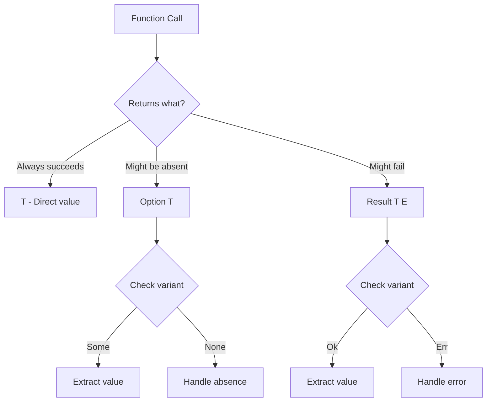
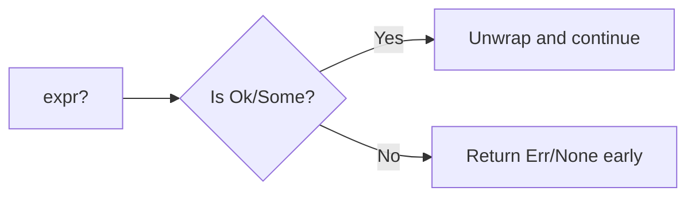

# How to Handle Errors with Result and Option in Rust

Author: [nawazdhandala](https://www.github.com/nawazdhandala)

Tags: Rust, Error Handling, Programming, Software Development, Backend

Description: A practical guide to Rust's error handling primitives - Result and Option - covering pattern matching, combinators, the ? operator, and building robust error handling strategies.

---

Rust takes a different approach to error handling than most languages. There are no exceptions, no null pointers, and no implicit error states. Instead, Rust uses two enum types - `Result<T, E>` and `Option<T>` - to explicitly represent operations that can fail or return nothing. This forces you to handle every possible outcome at compile time, eliminating entire categories of runtime bugs.

This guide walks through how these types work, how to compose them elegantly, and how to build production-grade error handling in Rust.

## Table of Contents

1. The Philosophy Behind Rust's Error Handling
2. Option<T> - Handling Absence
3. Result<T, E> - Handling Failures
4. Pattern Matching
5. The ? Operator
6. Combinators - map, and_then, unwrap_or
7. Converting Between Types
8. Custom Error Types
9. Best Practices

---

## 1. The Philosophy Behind Rust's Error Handling

Most languages treat errors as exceptional events that interrupt normal control flow. Rust treats errors as expected outcomes that must be explicitly handled. The compiler enforces this - you cannot ignore a `Result` or `Option` without explicitly choosing to do so.

This approach has real benefits:

| Traditional (Exceptions) | Rust (Result/Option) |
|--------------------------|----------------------|
| Errors can be silently ignored | Compiler forces you to handle errors |
| Null pointer exceptions at runtime | No null - Option makes absence explicit |
| Stack traces point to symptoms | Types guide you to the source |
| Error handling is optional | Error handling is mandatory |

The following diagram shows how Rust's type system makes error states visible.



---

## 2. Option<T> - Handling Absence

`Option<T>` represents a value that might not exist. It has exactly two variants:

```rust
// Option is defined in the standard library like this:
enum Option<T> {
    Some(T),  // Contains a value of type T
    None,     // Contains nothing
}
```

Use `Option` when:
- A value might legitimately not exist (finding an item in a collection)
- A field is optional (user's middle name)
- An operation has no meaningful error condition but might return nothing

### Basic Usage

Looking up a value in a HashMap returns an Option because the key might not exist.

```rust
use std::collections::HashMap;

fn main() {
    let mut scores: HashMap<String, i32> = HashMap::new();
    scores.insert("Alice".to_string(), 95);
    scores.insert("Bob".to_string(), 87);

    // get() returns Option<&V> because the key might not exist
    let alice_score: Option<&i32> = scores.get("Alice");
    let charlie_score: Option<&i32> = scores.get("Charlie");

    // You must handle both cases - the compiler enforces this
    match alice_score {
        Some(score) => println!("Alice scored: {}", score),
        None => println!("Alice not found"),
    }

    // if let is a concise alternative when you only care about one variant
    if let Some(score) = charlie_score {
        println!("Charlie scored: {}", score);
    } else {
        println!("Charlie not found");
    }
}
```

### Creating Option Values

```rust
fn find_user_by_email(email: &str) -> Option<User> {
    // Simulated database lookup
    let users = vec![
        User { id: 1, email: "alice@example.com".to_string() },
        User { id: 2, email: "bob@example.com".to_string() },
    ];

    // iter().find() returns Option - None if no match found
    users.into_iter().find(|u| u.email == email)
}

struct User {
    id: i32,
    email: String,
}

fn main() {
    // Some wraps an existing value
    let maybe_number: Option<i32> = Some(42);

    // None represents absence - type annotation needed for inference
    let nothing: Option<i32> = None;

    // From a function that might not find anything
    let user = find_user_by_email("alice@example.com");
}
```

---

## 3. Result<T, E> - Handling Failures

`Result<T, E>` represents an operation that can succeed with a value of type `T` or fail with an error of type `E`.

```rust
// Result is defined in the standard library like this:
enum Result<T, E> {
    Ok(T),   // Success - contains the successful value
    Err(E),  // Failure - contains error information
}
```

Use `Result` when:
- An operation can fail in a way the caller should know about
- You need to communicate why something failed (not just that it failed)
- The failure is recoverable or should be propagated

### Basic Usage

File operations can fail for many reasons - the file might not exist, permissions might be wrong, or the disk might be full.

```rust
use std::fs::File;
use std::io::{self, Read};

fn read_file_contents(path: &str) -> Result<String, io::Error> {
    // File::open returns Result<File, io::Error>
    let mut file = match File::open(path) {
        Ok(f) => f,
        Err(e) => return Err(e),  // Early return on error
    };

    let mut contents = String::new();

    // read_to_string also returns Result
    match file.read_to_string(&mut contents) {
        Ok(_) => Ok(contents),
        Err(e) => Err(e),
    }
}

fn main() {
    match read_file_contents("config.txt") {
        Ok(contents) => println!("File contents: {}", contents),
        Err(e) => eprintln!("Failed to read file: {}", e),
    }
}
```

### Creating Result Values

```rust
fn divide(numerator: f64, denominator: f64) -> Result<f64, String> {
    if denominator == 0.0 {
        // Err wraps the error value
        Err("Cannot divide by zero".to_string())
    } else {
        // Ok wraps the success value
        Ok(numerator / denominator)
    }
}

fn parse_port(input: &str) -> Result<u16, String> {
    // str::parse() returns Result<T, ParseIntError>
    // We convert the error to String for this example
    input
        .parse::<u16>()
        .map_err(|e| format!("Invalid port number: {}", e))
}

fn main() {
    let result = divide(10.0, 2.0);
    println!("10 / 2 = {:?}", result);  // Ok(5.0)

    let result = divide(10.0, 0.0);
    println!("10 / 0 = {:?}", result);  // Err("Cannot divide by zero")
}
```

---

## 4. Pattern Matching

Pattern matching is the most explicit way to handle `Option` and `Result`. It forces you to consider every case.

### Exhaustive Matching with match

The match expression must cover all variants - the compiler will reject incomplete matches.

```rust
fn describe_option(opt: Option<i32>) -> String {
    // Every possible variant must be handled
    match opt {
        Some(n) if n > 0 => format!("Positive number: {}", n),
        Some(n) if n < 0 => format!("Negative number: {}", n),
        Some(0) => "Zero".to_string(),
        Some(_) => unreachable!(),  // Guards above cover all i32 cases
        None => "No value".to_string(),
    }
}

fn describe_result(res: Result<i32, String>) -> String {
    match res {
        Ok(value) => format!("Success: {}", value),
        Err(msg) => format!("Error: {}", msg),
    }
}

fn main() {
    println!("{}", describe_option(Some(42)));   // Positive number: 42
    println!("{}", describe_option(Some(-5)));   // Negative number: -5
    println!("{}", describe_option(None));       // No value

    println!("{}", describe_result(Ok(100)));    // Success: 100
    println!("{}", describe_result(Err("oops".to_string()))); // Error: oops
}
```

### Concise Matching with if let and let else

When you only care about one variant, use `if let` to avoid boilerplate.

```rust
fn process_user(user_id: Option<i32>) {
    // if let extracts the value only if it matches
    if let Some(id) = user_id {
        println!("Processing user {}", id);
        // ... do work with id
    }
    // Implicitly does nothing for None
}

fn require_config(config: Option<Config>) -> Config {
    // let else provides a default/early return for the non-matching case
    let Some(cfg) = config else {
        panic!("Configuration is required");
    };
    cfg
}

struct Config {
    debug: bool,
}

fn main() {
    process_user(Some(42));  // Processing user 42
    process_user(None);      // No output

    let cfg = require_config(Some(Config { debug: true }));
    println!("Debug mode: {}", cfg.debug);
}
```

### Nested Pattern Matching

Patterns can be nested to destructure complex data in one step.

```rust
struct Response {
    status: u16,
    body: Option<String>,
}

fn handle_response(resp: Result<Response, String>) {
    match resp {
        // Nested pattern: Ok containing a Response with Some body
        Ok(Response { status: 200, body: Some(content) }) => {
            println!("Success with body: {}", content);
        }
        // Ok with 200 but no body
        Ok(Response { status: 200, body: None }) => {
            println!("Success with empty body");
        }
        // Any other successful status
        Ok(Response { status, .. }) => {
            println!("Unexpected status: {}", status);
        }
        // Error case
        Err(e) => {
            println!("Request failed: {}", e);
        }
    }
}
```

---

## 5. The ? Operator

The `?` operator is syntactic sugar for propagating errors up the call stack. It makes error handling code much cleaner.



### Basic Usage

Without the `?` operator, error propagation requires verbose match statements.

```rust
use std::fs::File;
use std::io::{self, Read};

// Without ? operator - verbose and repetitive
fn read_username_verbose(path: &str) -> Result<String, io::Error> {
    let file_result = File::open(path);
    let mut file = match file_result {
        Ok(f) => f,
        Err(e) => return Err(e),
    };

    let mut username = String::new();
    match file.read_to_string(&mut username) {
        Ok(_) => Ok(username),
        Err(e) => Err(e),
    }
}

// With ? operator - clean and readable
fn read_username(path: &str) -> Result<String, io::Error> {
    let mut file = File::open(path)?;  // Returns early if Err
    let mut username = String::new();
    file.read_to_string(&mut username)?;  // Returns early if Err
    Ok(username)
}

// Even more concise with method chaining
fn read_username_chained(path: &str) -> Result<String, io::Error> {
    let mut username = String::new();
    File::open(path)?.read_to_string(&mut username)?;
    Ok(username)
}
```

### Using ? with Option

The `?` operator also works with `Option`, returning `None` early if the value is `None`.

```rust
fn get_user_city(users: &[User], id: i32) -> Option<String> {
    // Each ? returns None early if the lookup fails
    let user = users.iter().find(|u| u.id == id)?;
    let address = user.address.as_ref()?;
    let city = address.city.clone()?;
    Some(city)
}

struct User {
    id: i32,
    address: Option<Address>,
}

struct Address {
    city: Option<String>,
    street: String,
}

fn main() {
    let users = vec![
        User {
            id: 1,
            address: Some(Address {
                city: Some("Seattle".to_string()),
                street: "123 Main St".to_string(),
            }),
        },
        User {
            id: 2,
            address: None,
        },
    ];

    println!("{:?}", get_user_city(&users, 1));  // Some("Seattle")
    println!("{:?}", get_user_city(&users, 2));  // None - no address
    println!("{:?}", get_user_city(&users, 3));  // None - user not found
}
```

### Error Type Conversion with ?

When error types do not match, the `?` operator can automatically convert them using the `From` trait.

```rust
use std::fs;
use std::num::ParseIntError;

// Custom error type that can hold different error kinds
#[derive(Debug)]
enum ConfigError {
    IoError(std::io::Error),
    ParseError(ParseIntError),
}

// Implement From to enable automatic conversion with ?
impl From<std::io::Error> for ConfigError {
    fn from(err: std::io::Error) -> Self {
        ConfigError::IoError(err)
    }
}

impl From<ParseIntError> for ConfigError {
    fn from(err: ParseIntError) -> Self {
        ConfigError::ParseError(err)
    }
}

fn read_port_from_file(path: &str) -> Result<u16, ConfigError> {
    // fs::read_to_string returns io::Error
    // ? automatically converts it to ConfigError via From
    let contents = fs::read_to_string(path)?;

    // str::parse returns ParseIntError
    // ? automatically converts it to ConfigError via From
    let port: u16 = contents.trim().parse()?;

    Ok(port)
}
```

---

## 6. Combinators - map, and_then, unwrap_or

Combinators are methods that transform `Option` and `Result` values without explicit pattern matching. They enable a functional programming style that is often more readable.

### map - Transform the Inner Value

`map` applies a function to the contained value if present, leaving errors/absence unchanged.

```rust
fn main() {
    let maybe_string: Option<String> = Some("42".to_string());

    // map transforms Some(x) to Some(f(x)), leaves None as None
    let maybe_length: Option<usize> = maybe_string.map(|s| s.len());
    println!("{:?}", maybe_length);  // Some(2)

    let nothing: Option<String> = None;
    let still_nothing: Option<usize> = nothing.map(|s| s.len());
    println!("{:?}", still_nothing);  // None

    // Works the same way with Result
    let result: Result<i32, &str> = Ok(5);
    let doubled: Result<i32, &str> = result.map(|n| n * 2);
    println!("{:?}", doubled);  // Ok(10)

    let error: Result<i32, &str> = Err("failed");
    let still_error: Result<i32, &str> = error.map(|n| n * 2);
    println!("{:?}", still_error);  // Err("failed")
}
```

### and_then - Chain Fallible Operations

`and_then` (also called `flat_map` in other languages) chains operations that themselves return `Option` or `Result`.

```rust
fn parse_int(s: &str) -> Option<i32> {
    s.parse().ok()  // Convert Result to Option, discarding error details
}

fn double_if_positive(n: i32) -> Option<i32> {
    if n > 0 {
        Some(n * 2)
    } else {
        None
    }
}

fn main() {
    let input = "21";

    // and_then chains operations that return Option
    // If any step returns None, the whole chain returns None
    let result = parse_int(input)
        .and_then(double_if_positive);

    println!("{:?}", result);  // Some(42)

    // With Result: chain operations that can fail
    let result: Result<i32, String> = Ok("10")
        .and_then(|s| s.parse::<i32>().map_err(|e| e.to_string()))
        .and_then(|n| {
            if n > 0 {
                Ok(n * 2)
            } else {
                Err("must be positive".to_string())
            }
        });

    println!("{:?}", result);  // Ok(20)
}
```

### unwrap_or Family - Provide Defaults

These methods extract the value with a fallback when the value is absent or an error occurred.

```rust
fn main() {
    let some_value: Option<i32> = Some(42);
    let no_value: Option<i32> = None;

    // unwrap_or: provide a default value
    println!("{}", some_value.unwrap_or(0));  // 42
    println!("{}", no_value.unwrap_or(0));    // 0

    // unwrap_or_else: compute default lazily (only if needed)
    let expensive_default = || {
        println!("Computing default...");
        calculate_default()
    };
    println!("{}", some_value.unwrap_or_else(expensive_default));  // 42, no print
    println!("{}", no_value.unwrap_or_else(expensive_default));    // prints, then 100

    // unwrap_or_default: use Default trait implementation
    let empty: Option<String> = None;
    println!("'{}'", empty.unwrap_or_default());  // '' (empty string)

    // For Result: unwrap_or provides default on Err
    let ok_result: Result<i32, &str> = Ok(42);
    let err_result: Result<i32, &str> = Err("failed");
    println!("{}", ok_result.unwrap_or(-1));   // 42
    println!("{}", err_result.unwrap_or(-1));  // -1
}

fn calculate_default() -> i32 {
    100
}
```

### Chaining Combinators

Combinators can be chained to build complex transformations in a readable pipeline.

```rust
fn process_user_input(input: Option<String>) -> String {
    input
        .map(|s| s.trim().to_string())           // Trim whitespace
        .filter(|s| !s.is_empty())               // Reject empty strings
        .map(|s| s.to_uppercase())               // Convert to uppercase
        .unwrap_or_else(|| "DEFAULT".to_string()) // Provide fallback
}

fn main() {
    println!("{}", process_user_input(Some("  hello  ".to_string()))); // HELLO
    println!("{}", process_user_input(Some("   ".to_string())));       // DEFAULT
    println!("{}", process_user_input(None));                          // DEFAULT
}
```

---

## 7. Converting Between Types

### Option to Result

When you need to convert an `Option` to a `Result`, use `ok_or` or `ok_or_else` to provide the error value.

```rust
fn find_user(id: i32) -> Option<String> {
    if id == 1 {
        Some("Alice".to_string())
    } else {
        None
    }
}

fn get_user_or_error(id: i32) -> Result<String, String> {
    // ok_or converts None to Err with the provided value
    find_user(id).ok_or(format!("User {} not found", id))
}

fn get_user_lazy_error(id: i32) -> Result<String, String> {
    // ok_or_else only computes the error if needed
    find_user(id).ok_or_else(|| {
        log_missing_user(id);
        format!("User {} not found", id)
    })
}

fn log_missing_user(id: i32) {
    eprintln!("Warning: attempted to access missing user {}", id);
}

fn main() {
    println!("{:?}", get_user_or_error(1));  // Ok("Alice")
    println!("{:?}", get_user_or_error(2));  // Err("User 2 not found")
}
```

### Result to Option

Use `ok()` to discard the error information, or `err()` to discard the success value.

```rust
fn parse_number(s: &str) -> Result<i32, std::num::ParseIntError> {
    s.parse()
}

fn main() {
    let result = parse_number("42");

    // ok() converts Ok(v) to Some(v), Err(_) to None
    let maybe_num: Option<i32> = result.ok();
    println!("{:?}", maybe_num);  // Some(42)

    let bad_result = parse_number("not a number");
    let maybe_num: Option<i32> = bad_result.ok();
    println!("{:?}", maybe_num);  // None

    // err() is the opposite - extracts the error as Option
    let result = parse_number("bad");
    let maybe_err = result.err();
    println!("{:?}", maybe_err);  // Some(ParseIntError)
}
```

### transpose - Swap Option and Result

`transpose` converts between `Option<Result<T, E>>` and `Result<Option<T>, E>`.

```rust
fn maybe_parse(input: Option<&str>) -> Result<Option<i32>, std::num::ParseIntError> {
    // We have Option<&str> and want Result<Option<i32>, E>
    // First map to Option<Result<i32, E>>
    let option_of_result: Option<Result<i32, _>> = input.map(|s| s.parse());

    // transpose converts Option<Result<T, E>> to Result<Option<T>, E>
    option_of_result.transpose()
}

fn main() {
    // None input becomes Ok(None)
    println!("{:?}", maybe_parse(None));           // Ok(None)

    // Valid input becomes Ok(Some(value))
    println!("{:?}", maybe_parse(Some("42")));     // Ok(Some(42))

    // Invalid input becomes Err
    println!("{:?}", maybe_parse(Some("bad")));    // Err(ParseIntError)
}
```

---

## 8. Custom Error Types

For production code, define custom error types that capture all the ways your code can fail.

### Simple Custom Error

```rust
use std::fmt;

#[derive(Debug)]
pub enum ValidationError {
    TooShort { min_length: usize, actual: usize },
    TooLong { max_length: usize, actual: usize },
    InvalidCharacter { position: usize, character: char },
    Empty,
}

// Implement Display for user-friendly error messages
impl fmt::Display for ValidationError {
    fn fmt(&self, f: &mut fmt::Formatter<'_>) -> fmt::Result {
        match self {
            Self::TooShort { min_length, actual } => {
                write!(f, "Input too short: need {} chars, got {}", min_length, actual)
            }
            Self::TooLong { max_length, actual } => {
                write!(f, "Input too long: max {} chars, got {}", max_length, actual)
            }
            Self::InvalidCharacter { position, character } => {
                write!(f, "Invalid character '{}' at position {}", character, position)
            }
            Self::Empty => write!(f, "Input cannot be empty"),
        }
    }
}

// Implement std::error::Error for compatibility with error handling libraries
impl std::error::Error for ValidationError {}

fn validate_username(input: &str) -> Result<String, ValidationError> {
    if input.is_empty() {
        return Err(ValidationError::Empty);
    }
    if input.len() < 3 {
        return Err(ValidationError::TooShort {
            min_length: 3,
            actual: input.len(),
        });
    }
    if input.len() > 20 {
        return Err(ValidationError::TooLong {
            max_length: 20,
            actual: input.len(),
        });
    }
    for (i, c) in input.chars().enumerate() {
        if !c.is_alphanumeric() && c != '_' {
            return Err(ValidationError::InvalidCharacter {
                position: i,
                character: c,
            });
        }
    }
    Ok(input.to_string())
}
```

### Using thiserror Crate

The `thiserror` crate reduces boilerplate for custom error types.

```rust
use thiserror::Error;

#[derive(Error, Debug)]
pub enum ServiceError {
    #[error("Database error: {0}")]
    Database(#[from] DatabaseError),

    #[error("Network timeout after {duration_ms}ms")]
    Timeout { duration_ms: u64 },

    #[error("Authentication failed for user {username}")]
    AuthFailed { username: String },

    #[error("Resource not found: {resource_type}/{resource_id}")]
    NotFound {
        resource_type: String,
        resource_id: String,
    },

    #[error(transparent)]  // Forwards Display to the source error
    Unexpected(#[from] anyhow::Error),
}

#[derive(Error, Debug)]
#[error("Database query failed: {message}")]
pub struct DatabaseError {
    message: String,
}

fn fetch_user(id: &str) -> Result<User, ServiceError> {
    // Database errors automatically convert via #[from]
    let user = query_database(id)?;

    match user {
        Some(u) => Ok(u),
        None => Err(ServiceError::NotFound {
            resource_type: "user".to_string(),
            resource_id: id.to_string(),
        }),
    }
}

fn query_database(id: &str) -> Result<Option<User>, DatabaseError> {
    // Simulated database query
    Ok(Some(User { id: id.to_string() }))
}

struct User {
    id: String,
}
```

### Using anyhow for Application Code

For application code (not libraries), the `anyhow` crate provides a convenient catch-all error type.

```rust
use anyhow::{Context, Result, bail, ensure};

fn process_config_file(path: &str) -> Result<Config> {
    // context() adds information to errors for better debugging
    let contents = std::fs::read_to_string(path)
        .context(format!("Failed to read config file: {}", path))?;

    let config: Config = serde_json::from_str(&contents)
        .context("Failed to parse config as JSON")?;

    // ensure! is like assert! but returns Err instead of panicking
    ensure!(config.port > 0, "Port must be positive, got {}", config.port);

    // bail! is a shorthand for return Err(anyhow!(...))
    if config.host.is_empty() {
        bail!("Host cannot be empty");
    }

    Ok(config)
}

#[derive(serde::Deserialize)]
struct Config {
    host: String,
    port: i32,
}

fn main() -> Result<()> {
    let config = process_config_file("config.json")?;
    println!("Loaded config for {}:{}", config.host, config.port);
    Ok(())
}
```

---

## 9. Best Practices

### Do Not Panic in Library Code

Library code should return `Result` or `Option` to let callers decide how to handle failures. Reserve `panic!`, `unwrap()`, and `expect()` for truly unrecoverable situations or places where you have proven the error cannot occur.

```rust
// BAD: Library function that panics
pub fn get_user_bad(id: i32) -> User {
    USERS.get(&id).unwrap().clone()  // Panics if not found
}

// GOOD: Library function that returns Result
pub fn get_user(id: i32) -> Result<User, UserError> {
    USERS.get(&id)
        .cloned()
        .ok_or(UserError::NotFound(id))
}

// ACCEPTABLE: unwrap when you have proven it cannot fail
fn known_valid_regex() -> Regex {
    // This regex is a compile-time constant - if it is invalid,
    // that is a programmer error that should fail at startup
    Regex::new(r"^\d{4}-\d{2}-\d{2}$").expect("Invalid date regex - this is a bug")
}
```

### Use expect() Over unwrap()

When you must unwrap, use `expect()` with a message explaining why it should never fail.

```rust
// BAD: Silent panic with no context
let config = load_config().unwrap();

// GOOD: Clear message if it fails
let config = load_config().expect("Config file must exist and be valid at startup");
```

### Handle Errors at the Right Level

Propagate errors up until you reach a level that has enough context to handle them meaningfully.

```rust
// Low-level function: propagate errors, do not handle
fn read_file(path: &str) -> Result<String, std::io::Error> {
    std::fs::read_to_string(path)
}

// Mid-level function: add context, propagate
fn load_config(path: &str) -> Result<Config, ConfigError> {
    let contents = read_file(path)
        .map_err(|e| ConfigError::Io { path: path.to_string(), source: e })?;
    parse_config(&contents)
}

// High-level function: handle errors appropriately
fn main() {
    match load_config("app.toml") {
        Ok(config) => run_app(config),
        Err(e) => {
            eprintln!("Failed to start: {}", e);
            std::process::exit(1);
        }
    }
}

#[derive(Debug)]
enum ConfigError {
    Io { path: String, source: std::io::Error },
    Parse(String),
}

fn parse_config(contents: &str) -> Result<Config, ConfigError> {
    // Parse logic here
    Ok(Config {})
}

struct Config {}

fn run_app(config: Config) {
    // App logic here
}
```

### Use Type Aliases for Complex Result Types

When a module uses the same error type everywhere, a type alias reduces noise.

```rust
pub type Result<T> = std::result::Result<T, DatabaseError>;

pub struct DatabaseError {
    message: String,
}

// Now functions can use the shorter signature
pub fn query(sql: &str) -> Result<Vec<Row>> {
    // ...
    Ok(vec![])
}

pub fn execute(sql: &str) -> Result<usize> {
    // ...
    Ok(0)
}

struct Row {}
```

### Log Errors When Discarding Them

If you intentionally ignore an error, log it for debugging.

```rust
fn cleanup_temp_files() {
    // We do not want cleanup failures to stop the program,
    // but we should log them for debugging
    if let Err(e) = std::fs::remove_dir_all("/tmp/myapp") {
        log::warn!("Failed to clean up temp files: {}", e);
    }
}
```

---

## Summary

| Concept | When to Use | Key Methods |
|---------|-------------|-------------|
| `Option<T>` | Value might not exist | `map`, `and_then`, `unwrap_or`, `ok_or` |
| `Result<T, E>` | Operation can fail | `map`, `and_then`, `map_err`, `?` |
| `?` operator | Propagate errors up | Works with both Option and Result |
| Pattern matching | Full control over handling | `match`, `if let`, `let else` |
| Custom errors | Production code | `thiserror` for libs, `anyhow` for apps |

Rust's approach to error handling feels different at first. The compiler insists you handle every case, which can seem tedious. But this strictness pays off - entire categories of bugs disappear. There are no null pointer exceptions. No unhandled exceptions crashing production. No silent failures corrupting data.

Once you internalize these patterns, error handling becomes just another part of your type signatures - a contract that makes your code's behavior explicit and predictable.
