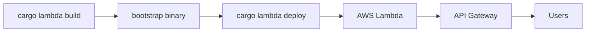
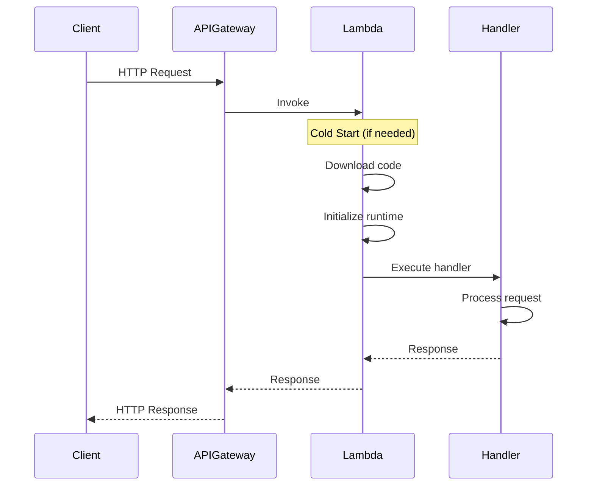

# How to Build Serverless Functions in Rust

Author: [nawazdhandala](https://www.github.com/nawazdhandala)

Tags: Rust, Serverless, AWS Lambda, Performance, DevOps

Description: A practical guide to building, deploying, and optimizing serverless functions in Rust for AWS Lambda with cargo-lambda.

---

Rust and serverless make a compelling combination. You get the memory safety and performance of a systems language without managing servers. Cold starts that plague other runtimes become barely noticeable. Your Lambda bills shrink because functions execute faster and use less memory.

This guide walks through building production-ready serverless functions in Rust - from project setup to deployment and optimization.

## Why Rust for Serverless?

Before diving into code, here's why Rust stands out for Lambda:

| Factor | Rust | Node.js/Python |
|--------|------|----------------|
| Cold start | 10-50ms | 100-500ms |
| Memory usage | 128MB often sufficient | 256MB+ typical |
| Execution speed | Near-native | 10-100x slower |
| Binary size | 5-15MB (stripped) | Runtime + dependencies |
| Type safety | Compile-time guarantees | Runtime errors |

The tradeoff is development speed - Rust has a steeper learning curve. But for high-traffic functions or latency-sensitive workloads, the performance gains justify the investment.

## Setting Up Your Environment

You need Rust and cargo-lambda installed. cargo-lambda is a Cargo subcommand that simplifies building and deploying Lambda functions.

Install Rust via rustup if you haven't already:

```bash
# Install Rust toolchain
curl --proto '=https' --tlsv1.2 -sSf https://sh.rustup.rs | sh

# Install cargo-lambda for Lambda development
cargo install cargo-lambda
```

cargo-lambda handles cross-compilation to Amazon Linux 2, local testing with a Lambda-compatible runtime, and deployment to AWS.

## Creating Your First Lambda Function

cargo-lambda provides a project generator that sets up the correct dependencies and project structure:

```bash
# Create a new Lambda project with HTTP API template
cargo lambda new my-rust-function --http

# Navigate into the project
cd my-rust-function
```

This generates a project with the following structure:

```
my-rust-function/
├── Cargo.toml
└── src/
    └── main.rs
```

The generated Cargo.toml includes the essential dependencies:

```toml
[package]
name = "my-rust-function"
version = "0.1.0"
edition = "2021"

[dependencies]
# Core Lambda runtime - handles the Lambda execution environment
lambda_http = "0.13"
# Async runtime - Lambda functions are async by nature
tokio = { version = "1", features = ["macros"] }
# Tracing for structured logging (integrates with CloudWatch)
tracing = "0.1"
tracing-subscriber = { version = "0.3", features = ["env-filter"] }
```

## Understanding Handler Functions

Lambda invokes your handler function for each request. The handler receives an event, processes it, and returns a response. Here's a basic HTTP handler:

```rust
use lambda_http::{run, service_fn, Body, Error, Request, Response};
use tracing::info;

// The handler function processes each incoming request
// - Request contains HTTP method, path, headers, and body
// - Returns a Response or an Error
async fn handler(event: Request) -> Result<Response<Body>, Error> {
    // Extract path from the request for routing
    let path = event.uri().path();

    // Log the request for debugging - shows in CloudWatch
    info!(path = %path, method = %event.method(), "Processing request");

    // Build and return the HTTP response
    let response = Response::builder()
        .status(200)
        .header("Content-Type", "application/json")
        .body(Body::from(r#"{"message": "Hello from Rust!"}"#))
        .map_err(Box::new)?;

    Ok(response)
}

#[tokio::main]
async fn main() -> Result<(), Error> {
    // Initialize tracing subscriber for CloudWatch logging
    tracing_subscriber::fmt()
        .with_max_level(tracing::Level::INFO)
        .with_target(false)  // Exclude target from logs for cleaner output
        .without_time()       // Lambda adds timestamps automatically
        .init();

    // Start the Lambda runtime, wrapping our handler with service_fn
    run(service_fn(handler)).await
}
```

The key components:

- `lambda_http::Request` - Wraps API Gateway events into a familiar HTTP request type
- `lambda_http::Response` - Standard HTTP response that Lambda serializes for API Gateway
- `service_fn` - Converts an async function into a Lambda-compatible service
- `run` - Starts the Lambda runtime loop, processing events until shutdown

## Working with Request and Response Types

Real handlers need to parse request bodies and return structured responses. Use serde for JSON serialization:

```toml
# Add to Cargo.toml
[dependencies]
serde = { version = "1.0", features = ["derive"] }
serde_json = "1.0"
```

This example demonstrates parsing a JSON request body, validating the input, and returning a structured JSON response:

```rust
use lambda_http::{run, service_fn, Body, Error, Request, Response};
use serde::{Deserialize, Serialize};
use tracing::{error, info};

// Define request structure - serde handles JSON parsing
#[derive(Deserialize)]
struct CreateUserRequest {
    email: String,
    name: String,
}

// Define response structure - serde handles JSON serialization
#[derive(Serialize)]
struct CreateUserResponse {
    id: String,
    email: String,
    name: String,
    created_at: String,
}

// Error response for consistent error handling
#[derive(Serialize)]
struct ErrorResponse {
    error: String,
    code: String,
}

async fn handler(event: Request) -> Result<Response<Body>, Error> {
    // Parse the request body as JSON
    // body() returns a reference to Body, which implements AsRef<[u8]>
    let body = event.body();
    let user_request: CreateUserRequest = match serde_json::from_slice(body) {
        Ok(req) => req,
        Err(e) => {
            error!(error = %e, "Failed to parse request body");
            return error_response(400, "Invalid JSON", "INVALID_REQUEST");
        }
    };

    // Validate email format (simple check for demonstration)
    if !user_request.email.contains('@') {
        return error_response(400, "Invalid email format", "INVALID_EMAIL");
    }

    info!(email = %user_request.email, "Creating user");

    // Generate a unique ID (in production, use UUID or database-generated ID)
    let user_id = format!("user_{}", uuid_v4());

    // Build the response
    let response = CreateUserResponse {
        id: user_id,
        email: user_request.email,
        name: user_request.name,
        created_at: chrono::Utc::now().to_rfc3339(),
    };

    // Serialize to JSON and return with appropriate headers
    let body = serde_json::to_string(&response)?;

    Ok(Response::builder()
        .status(201)
        .header("Content-Type", "application/json")
        .body(Body::from(body))
        .map_err(Box::new)?)
}

// Helper function for consistent error responses
fn error_response(status: u16, message: &str, code: &str) -> Result<Response<Body>, Error> {
    let error = ErrorResponse {
        error: message.to_string(),
        code: code.to_string(),
    };

    let body = serde_json::to_string(&error)?;

    Ok(Response::builder()
        .status(status)
        .header("Content-Type", "application/json")
        .body(Body::from(body))
        .map_err(Box::new)?)
}

// Simple UUID v4 generator (in production, use the uuid crate)
fn uuid_v4() -> String {
    use std::time::{SystemTime, UNIX_EPOCH};
    let timestamp = SystemTime::now()
        .duration_since(UNIX_EPOCH)
        .unwrap()
        .as_nanos();
    format!("{:x}", timestamp)
}

#[tokio::main]
async fn main() -> Result<(), Error> {
    tracing_subscriber::fmt()
        .with_max_level(tracing::Level::INFO)
        .without_time()
        .init();

    run(service_fn(handler)).await
}
```

## Routing Multiple Endpoints

A single Lambda can handle multiple routes. Pattern matching on path and method keeps the code clean:

```rust
use lambda_http::{run, service_fn, Body, Error, Request, Response};
use http::Method;

async fn handler(event: Request) -> Result<Response<Body>, Error> {
    // Extract routing information from the request
    let path = event.uri().path();
    let method = event.method();

    // Route based on method and path combination
    // Pattern matching makes adding new routes straightforward
    match (method, path) {
        // User endpoints
        (&Method::GET, "/users") => list_users().await,
        (&Method::POST, "/users") => create_user(event).await,
        (&Method::GET, path) if path.starts_with("/users/") => {
            let user_id = path.strip_prefix("/users/").unwrap();
            get_user(user_id).await
        }

        // Health check endpoint
        (&Method::GET, "/health") => health_check().await,

        // Catch-all for unknown routes
        _ => not_found(),
    }
}

async fn list_users() -> Result<Response<Body>, Error> {
    // Implementation: Query database, return user list
    json_response(200, r#"{"users": []}"#)
}

async fn create_user(event: Request) -> Result<Response<Body>, Error> {
    // Implementation: Parse body, validate, insert to database
    json_response(201, r#"{"id": "user_123"}"#)
}

async fn get_user(user_id: &str) -> Result<Response<Body>, Error> {
    // Implementation: Query database by ID
    json_response(200, &format!(r#"{{"id": "{}"}}"#, user_id))
}

async fn health_check() -> Result<Response<Body>, Error> {
    json_response(200, r#"{"status": "healthy"}"#)
}

fn not_found() -> Result<Response<Body>, Error> {
    json_response(404, r#"{"error": "Not found"}"#)
}

// Helper for consistent JSON responses
fn json_response(status: u16, body: &str) -> Result<Response<Body>, Error> {
    Ok(Response::builder()
        .status(status)
        .header("Content-Type", "application/json")
        .body(Body::from(body.to_string()))
        .map_err(Box::new)?)
}

#[tokio::main]
async fn main() -> Result<(), Error> {
    tracing_subscriber::fmt().without_time().init();
    run(service_fn(handler)).await
}
```

## Local Development and Testing

cargo-lambda includes a local development server that emulates the Lambda environment:

```bash
# Start the local development server
cargo lambda watch

# In another terminal, test with curl
curl http://localhost:9000/health
curl -X POST http://localhost:9000/users \
  -H "Content-Type: application/json" \
  -d '{"email": "test@example.com", "name": "Test User"}'
```

The watch command rebuilds and restarts your function automatically when source files change - similar to nodemon for Node.js.

For unit testing, test your handler logic directly:

```rust
#[cfg(test)]
mod tests {
    use super::*;
    use lambda_http::RequestExt;

    #[tokio::test]
    async fn test_health_check() {
        // Build a mock request for the health endpoint
        let request = Request::default();

        // Call the health_check function directly
        let response = health_check().await.unwrap();

        // Verify the response
        assert_eq!(response.status(), 200);
    }

    #[tokio::test]
    async fn test_create_user_validation() {
        // Test that invalid email returns 400
        let body = r#"{"email": "invalid", "name": "Test"}"#;
        let request = Request::builder()
            .method("POST")
            .uri("/users")
            .body(Body::from(body))
            .unwrap();

        let response = handler(request).await.unwrap();
        assert_eq!(response.status(), 400);
    }
}
```

## Building and Deploying

Build the release binary targeting the Lambda runtime:

```bash
# Build for Lambda (cross-compiles to Amazon Linux 2)
cargo lambda build --release

# This creates a bootstrap binary in target/lambda/my-rust-function/
```

The flow from local development to production deployment looks like this:



Deploy using cargo-lambda or your preferred IaC tool:

```bash
# Deploy directly with cargo-lambda
# Requires AWS credentials configured
cargo lambda deploy my-rust-function \
  --region us-east-1 \
  --memory 128 \
  --timeout 30
```

For infrastructure as code, here's a Terraform configuration:

```hcl
# Lambda function resource
resource "aws_lambda_function" "rust_function" {
  function_name = "my-rust-function"
  role          = aws_iam_role.lambda_role.arn
  handler       = "bootstrap"
  runtime       = "provided.al2023"

  # Point to the built binary
  filename         = "target/lambda/my-rust-function/bootstrap.zip"
  source_code_hash = filebase64sha256("target/lambda/my-rust-function/bootstrap.zip")

  # Rust functions can run lean
  memory_size = 128
  timeout     = 30

  environment {
    variables = {
      RUST_LOG = "info"
    }
  }
}

# API Gateway for HTTP access
resource "aws_apigatewayv2_api" "api" {
  name          = "my-rust-api"
  protocol_type = "HTTP"
}

resource "aws_apigatewayv2_integration" "lambda" {
  api_id             = aws_apigatewayv2_api.api.id
  integration_type   = "AWS_PROXY"
  integration_uri    = aws_lambda_function.rust_function.invoke_arn
  integration_method = "POST"
}

resource "aws_apigatewayv2_route" "default" {
  api_id    = aws_apigatewayv2_api.api.id
  route_key = "$default"
  target    = "integrations/${aws_apigatewayv2_integration.lambda.id}"
}
```

## Cold Start Optimization

Cold starts happen when Lambda spins up a new execution environment. Rust already has faster cold starts than interpreted languages, but you can optimize further.

The Lambda lifecycle has distinct phases:



Key optimization strategies:

Minimize binary size - smaller binaries download and initialize faster:

```toml
# Cargo.toml - release profile optimizations
[profile.release]
# Optimize for size instead of speed
opt-level = "z"
# Enable link-time optimization for smaller binaries
lto = true
# Single codegen unit improves LTO effectiveness
codegen-units = 1
# Strip debug symbols
strip = true
# Abort on panic instead of unwinding (smaller binary)
panic = "abort"
```

Initialize expensive resources outside the handler - the init phase runs once per cold start:

```rust
use aws_sdk_dynamodb::Client;
use once_cell::sync::Lazy;
use std::sync::Arc;
use tokio::sync::OnceCell;

// Initialize DynamoDB client once, reuse across invocations
// Lazy ensures initialization happens on first access
static DB_CLIENT: Lazy<Arc<OnceCell<Client>>> = Lazy::new(|| Arc::new(OnceCell::new()));

async fn get_db_client() -> &'static Client {
    DB_CLIENT.get_or_init(|| async {
        // This runs once per cold start, not per request
        let config = aws_config::load_defaults(aws_config::BehaviorVersion::latest()).await;
        Client::new(&config)
    }).await
}

async fn handler(event: Request) -> Result<Response<Body>, Error> {
    // Reuses the existing client - no initialization overhead
    let client = get_db_client().await;

    // Use client for database operations
    // ...

    Ok(Response::builder()
        .status(200)
        .body(Body::empty())
        .map_err(Box::new)?)
}
```

Use provisioned concurrency for latency-critical functions - keeps instances warm:

```bash
# Configure provisioned concurrency via AWS CLI
aws lambda put-provisioned-concurrency-config \
  --function-name my-rust-function \
  --qualifier production \
  --provisioned-concurrent-executions 5
```

## Integrating with API Gateway

API Gateway adds features like authentication, rate limiting, and custom domains. Configure path parameters and query strings:

```rust
use lambda_http::{Request, RequestExt};

async fn handler(event: Request) -> Result<Response<Body>, Error> {
    // Path parameters from API Gateway (e.g., /users/{id})
    // RequestExt provides path_parameters() method
    let path_params = event.path_parameters();
    let user_id = path_params
        .first("id")
        .unwrap_or("unknown");

    // Query string parameters (e.g., ?limit=10&offset=0)
    let query_params = event.query_string_parameters();
    let limit: usize = query_params
        .first("limit")
        .and_then(|v| v.parse().ok())
        .unwrap_or(10);

    // Headers for authentication, content negotiation, etc.
    let auth_header = event.headers()
        .get("Authorization")
        .and_then(|v| v.to_str().ok());

    // Stage variables for environment-specific configuration
    let stage_vars = event.stage_variables();
    let api_version = stage_vars
        .get("api_version")
        .map(|s| s.as_str())
        .unwrap_or("v1");

    // Use extracted values in your handler logic
    // ...

    json_response(200, &format!(r#"{{"user_id": "{}", "limit": {}}}"#, user_id, limit))
}
```

## Connecting to DynamoDB

Most Lambda functions need persistent storage. Here's a complete example with DynamoDB:

```toml
# Add AWS SDK dependencies
[dependencies]
aws-config = "1.1"
aws-sdk-dynamodb = "1.15"
```

This pattern initializes the DynamoDB client once and reuses it across invocations for better performance:

```rust
use aws_sdk_dynamodb::Client;
use aws_sdk_dynamodb::types::AttributeValue;
use lambda_http::{run, service_fn, Body, Error, Request, Response};
use once_cell::sync::Lazy;
use serde::{Deserialize, Serialize};
use std::collections::HashMap;
use tokio::sync::OnceCell;

// Table name from environment variable
static TABLE_NAME: Lazy<String> = Lazy::new(|| {
    std::env::var("TABLE_NAME").unwrap_or_else(|_| "users".to_string())
});

// Singleton DynamoDB client
static CLIENT: OnceCell<Client> = OnceCell::const_new();

async fn get_client() -> &'static Client {
    CLIENT.get_or_init(|| async {
        let config = aws_config::load_defaults(aws_config::BehaviorVersion::latest()).await;
        Client::new(&config)
    }).await
}

#[derive(Serialize, Deserialize)]
struct User {
    id: String,
    email: String,
    name: String,
}

async fn get_user(user_id: &str) -> Result<Option<User>, Error> {
    let client = get_client().await;

    // Query DynamoDB by primary key
    let result = client
        .get_item()
        .table_name(TABLE_NAME.as_str())
        .key("id", AttributeValue::S(user_id.to_string()))
        .send()
        .await?;

    // Map DynamoDB item to User struct
    match result.item {
        Some(item) => {
            let user = User {
                id: item.get("id")
                    .and_then(|v| v.as_s().ok())
                    .map(|s| s.to_string())
                    .unwrap_or_default(),
                email: item.get("email")
                    .and_then(|v| v.as_s().ok())
                    .map(|s| s.to_string())
                    .unwrap_or_default(),
                name: item.get("name")
                    .and_then(|v| v.as_s().ok())
                    .map(|s| s.to_string())
                    .unwrap_or_default(),
            };
            Ok(Some(user))
        }
        None => Ok(None),
    }
}

async fn create_user(user: User) -> Result<(), Error> {
    let client = get_client().await;

    // Build the item to insert
    let mut item = HashMap::new();
    item.insert("id".to_string(), AttributeValue::S(user.id));
    item.insert("email".to_string(), AttributeValue::S(user.email));
    item.insert("name".to_string(), AttributeValue::S(user.name));

    // Insert into DynamoDB
    client
        .put_item()
        .table_name(TABLE_NAME.as_str())
        .set_item(Some(item))
        .send()
        .await?;

    Ok(())
}

async fn handler(event: Request) -> Result<Response<Body>, Error> {
    let path = event.uri().path();

    // Simple routing for user CRUD
    if path.starts_with("/users/") {
        let user_id = path.strip_prefix("/users/").unwrap();
        match get_user(user_id).await? {
            Some(user) => {
                let body = serde_json::to_string(&user)?;
                json_response(200, &body)
            }
            None => json_response(404, r#"{"error": "User not found"}"#),
        }
    } else {
        json_response(404, r#"{"error": "Not found"}"#)
    }
}

fn json_response(status: u16, body: &str) -> Result<Response<Body>, Error> {
    Ok(Response::builder()
        .status(status)
        .header("Content-Type", "application/json")
        .body(Body::from(body.to_string()))
        .map_err(Box::new)?)
}

#[tokio::main]
async fn main() -> Result<(), Error> {
    tracing_subscriber::fmt().without_time().init();
    run(service_fn(handler)).await
}
```

## Error Handling Best Practices

Rust's Result type makes error handling explicit. Use thiserror for custom error types that map cleanly to HTTP responses:

```toml
[dependencies]
thiserror = "1.0"
```

Define domain-specific errors that carry both the error details and the appropriate HTTP status:

```rust
use thiserror::Error;

// Custom error type with HTTP status mapping
#[derive(Error, Debug)]
pub enum AppError {
    #[error("User not found: {0}")]
    NotFound(String),

    #[error("Invalid input: {0}")]
    BadRequest(String),

    #[error("Unauthorized")]
    Unauthorized,

    #[error("Database error: {0}")]
    DatabaseError(#[from] aws_sdk_dynamodb::Error),

    #[error("Serialization error: {0}")]
    SerializationError(#[from] serde_json::Error),
}

impl AppError {
    // Map errors to HTTP status codes
    fn status_code(&self) -> u16 {
        match self {
            AppError::NotFound(_) => 404,
            AppError::BadRequest(_) => 400,
            AppError::Unauthorized => 401,
            AppError::DatabaseError(_) => 500,
            AppError::SerializationError(_) => 500,
        }
    }

    // Map errors to error codes for API consumers
    fn error_code(&self) -> &str {
        match self {
            AppError::NotFound(_) => "NOT_FOUND",
            AppError::BadRequest(_) => "BAD_REQUEST",
            AppError::Unauthorized => "UNAUTHORIZED",
            AppError::DatabaseError(_) => "DATABASE_ERROR",
            AppError::SerializationError(_) => "SERIALIZATION_ERROR",
        }
    }
}

// Convert AppError to HTTP response
impl From<AppError> for Response<Body> {
    fn from(error: AppError) -> Self {
        let body = serde_json::json!({
            "error": error.to_string(),
            "code": error.error_code()
        });

        Response::builder()
            .status(error.status_code())
            .header("Content-Type", "application/json")
            .body(Body::from(body.to_string()))
            .unwrap()
    }
}

// Handler can now use ? operator and return clean errors
async fn handler(event: Request) -> Result<Response<Body>, Error> {
    match process_request(event).await {
        Ok(response) => Ok(response),
        Err(app_error) => Ok(app_error.into()),
    }
}

async fn process_request(event: Request) -> Result<Response<Body>, AppError> {
    let user_id = extract_user_id(&event)
        .ok_or_else(|| AppError::BadRequest("Missing user ID".to_string()))?;

    let user = get_user(&user_id).await?
        .ok_or_else(|| AppError::NotFound(user_id.clone()))?;

    let body = serde_json::to_string(&user)?;

    Ok(Response::builder()
        .status(200)
        .header("Content-Type", "application/json")
        .body(Body::from(body))
        .unwrap())
}
```

## Observability and Logging

Structured logging with tracing integrates well with CloudWatch:

```rust
use tracing::{info, warn, error, instrument, Span};
use tracing_subscriber::fmt::format::FmtSpan;

// The instrument macro automatically creates a span for this function
// It logs entry, exit, and any fields you specify
#[instrument(skip(event), fields(request_id = %extract_request_id(&event)))]
async fn handler(event: Request) -> Result<Response<Body>, Error> {
    let path = event.uri().path();
    let method = event.method().to_string();

    // Structured log with fields - appears as JSON in CloudWatch
    info!(
        path = %path,
        method = %method,
        "Processing request"
    );

    // Add dynamic fields to the current span
    Span::current().record("path", path);

    let start = std::time::Instant::now();

    let result = process_request(event).await;

    let duration_ms = start.elapsed().as_millis();

    // Log request completion with timing
    match &result {
        Ok(response) => {
            info!(
                status = %response.status().as_u16(),
                duration_ms = %duration_ms,
                "Request completed"
            );
        }
        Err(e) => {
            error!(
                error = %e,
                duration_ms = %duration_ms,
                "Request failed"
            );
        }
    }

    result
}

fn extract_request_id(event: &Request) -> String {
    event.headers()
        .get("x-request-id")
        .and_then(|v| v.to_str().ok())
        .map(|s| s.to_string())
        .unwrap_or_else(|| "unknown".to_string())
}

#[tokio::main]
async fn main() -> Result<(), Error> {
    // Configure tracing with JSON output for CloudWatch
    tracing_subscriber::fmt()
        .json()  // Output as JSON for CloudWatch Logs Insights queries
        .with_max_level(tracing::Level::INFO)
        .with_span_events(FmtSpan::CLOSE)  // Log when spans close
        .with_target(false)
        .without_time()  // Lambda adds timestamps
        .init();

    run(service_fn(handler)).await
}
```

## Summary

Rust brings systems-level performance to serverless without the operational burden of managing servers. The combination of cargo-lambda for development and AWS Lambda for deployment gives you a productive workflow with production-grade results.

Key takeaways:

| Aspect | Recommendation |
|--------|----------------|
| Project setup | Use `cargo lambda new` for correct scaffolding |
| Handler pattern | Parse requests with serde, return typed responses |
| Client initialization | Use OnceCell for singleton clients outside handler |
| Binary optimization | Enable LTO, strip symbols, opt-level "z" |
| Cold starts | Keep binaries small, init resources once |
| Error handling | Use thiserror with HTTP status mapping |
| Logging | Structured tracing with JSON output |

The initial investment in learning Rust pays dividends in reliability, performance, and reduced cloud costs. For high-traffic serverless workloads, Rust should be at the top of your list.
