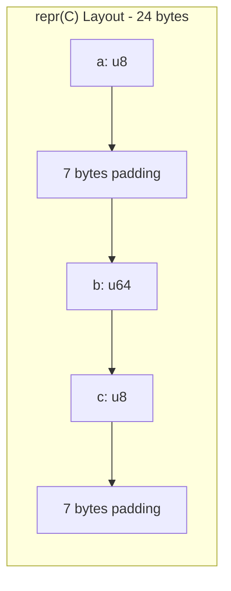
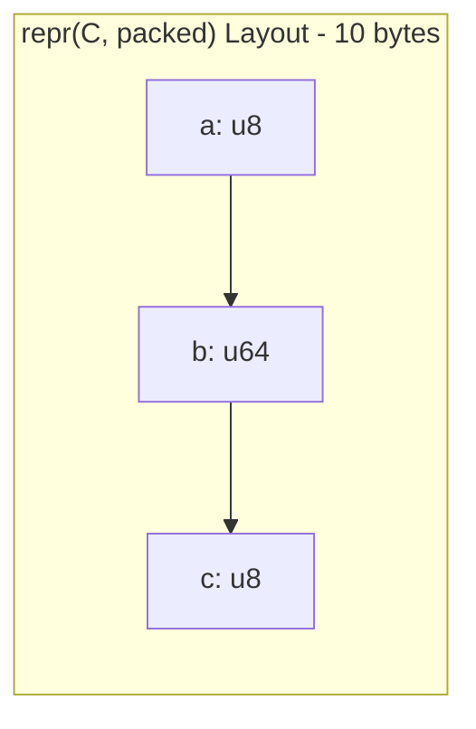
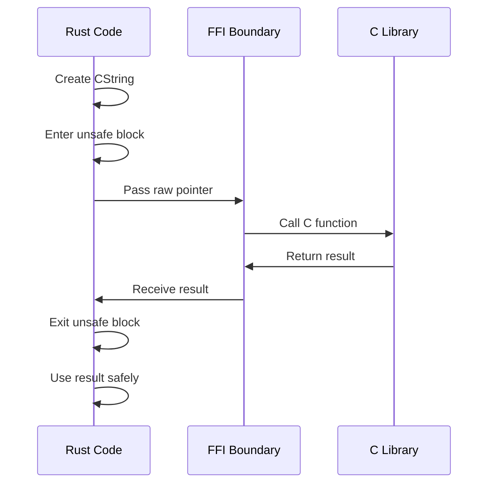
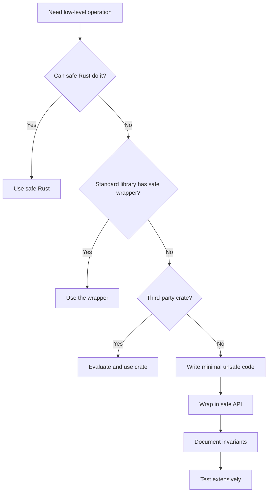

# How to Use Rust for Systems Programming

Author: [nawazdhandala](https://www.github.com/nawazdhandala)

Tags: Rust, Systems Programming, Memory Safety, FFI, Unsafe Rust, Low-Level Programming

Description: A practical guide to using Rust for systems programming - covering memory layout, raw pointers, unsafe blocks, FFI with C, and inline assembly.

---

Rust sits in a unique spot. It gives you the control of C and C++ while catching entire classes of bugs at compile time. For systems programming - where you need to manage memory directly, call into C libraries, or write performance-critical code - Rust is becoming the go-to choice.

This guide covers the low-level features that make Rust powerful for systems work: understanding memory layout, working with raw pointers, using unsafe code responsibly, calling C from Rust, and even dropping into inline assembly when you need it.

## Memory Layout in Rust

Before diving into unsafe territory, you need to understand how Rust lays out data in memory. The compiler is free to reorder struct fields for better alignment and padding, unless you tell it otherwise.

The `repr` attribute controls memory layout. Here are the options you will use most often:

```rust
// Default layout - compiler can reorder fields
struct DefaultLayout {
    a: u8,
    b: u64,
    c: u8,
}

// C-compatible layout - fields in declaration order, C padding rules
#[repr(C)]
struct CLayout {
    a: u8,
    b: u64,
    c: u8,
}

// Packed layout - no padding between fields (can cause unaligned access)
#[repr(C, packed)]
struct PackedLayout {
    a: u8,
    b: u64,
    c: u8,
}

// Transparent - single-field struct has same layout as the field
#[repr(transparent)]
struct Wrapper(u64);
```

You can inspect sizes and alignments at compile time:

```rust
use std::mem::{size_of, align_of};

fn main() {
    // DefaultLayout might be 16 bytes (compiler reorders for alignment)
    println!("DefaultLayout: size={}, align={}",
        size_of::<DefaultLayout>(),
        align_of::<DefaultLayout>());

    // CLayout is 24 bytes: 1 + 7 padding + 8 + 1 + 7 padding
    println!("CLayout: size={}, align={}",
        size_of::<CLayout>(),
        align_of::<CLayout>());

    // PackedLayout is 10 bytes: no padding
    println!("PackedLayout: size={}, align={}",
        size_of::<PackedLayout>(),
        align_of::<PackedLayout>());
}
```

Here is how the memory layout differs visually:





## Raw Pointers: The Foundation of Unsafe Rust

Rust has two raw pointer types: `*const T` for immutable access and `*mut T` for mutable access. Unlike references, raw pointers can be null, can alias, and do not have lifetime tracking.

Creating raw pointers is safe. Dereferencing them is not.

```rust
fn main() {
    let x = 42;
    let y = &x as *const i32;  // Safe: creating a raw pointer

    // Dereferencing requires unsafe
    unsafe {
        println!("Value: {}", *y);  // Unsafe: dereferencing
    }

    // Mutable raw pointers
    let mut value = 100;
    let ptr = &mut value as *mut i32;

    unsafe {
        *ptr = 200;  // Modify through raw pointer
        println!("Modified: {}", *ptr);
    }
}
```

Raw pointers enable pointer arithmetic, which is essential for systems programming:

```rust
fn main() {
    let array = [10, 20, 30, 40, 50];
    let ptr = array.as_ptr();

    unsafe {
        // Pointer arithmetic - offset is in elements, not bytes
        println!("First: {}", *ptr);
        println!("Third: {}", *ptr.add(2));

        // Iterate using pointer arithmetic
        for i in 0..array.len() {
            println!("array[{}] = {}", i, *ptr.add(i));
        }
    }
}
```

## The Unsafe Keyword: What It Actually Means

`unsafe` does not turn off the borrow checker or disable Rust's safety guarantees. It simply tells the compiler: "I am taking responsibility for upholding memory safety here."

There are exactly five things you can do in an unsafe block that you cannot do in safe Rust:

1. Dereference raw pointers
2. Call unsafe functions
3. Access or modify mutable static variables
4. Implement unsafe traits
5. Access fields of unions

```rust
// Unsafe function - caller must ensure preconditions
unsafe fn dangerous_operation(ptr: *mut i32, len: usize) {
    // The caller guarantees ptr is valid for len elements
    for i in 0..len {
        *ptr.add(i) = i as i32;
    }
}

// Mutable static - requires unsafe to access
static mut COUNTER: u32 = 0;

fn increment_counter() {
    unsafe {
        COUNTER += 1;
    }
}

// Union - accessing fields is unsafe because Rust cannot
// guarantee type safety
union IntOrFloat {
    i: i32,
    f: f32,
}

fn main() {
    let mut data = [0i32; 5];

    // Safe to get the pointer
    let ptr = data.as_mut_ptr();

    // Unsafe to use it
    unsafe {
        dangerous_operation(ptr, data.len());
    }

    println!("Data: {:?}", data);  // [0, 1, 2, 3, 4]

    // Union example
    let u = IntOrFloat { i: 42 };
    unsafe {
        println!("As int: {}", u.i);
        println!("As float: {}", u.f);  // Reinterprets the bits
    }
}
```

## FFI: Calling C from Rust

Rust's Foreign Function Interface lets you call C code directly. This is essential when you need to use existing C libraries or interface with the operating system.

First, declare the C functions you want to call using an `extern` block:

```rust
use std::ffi::{CStr, CString};
use std::os::raw::{c_char, c_int};

// Declare external C functions
extern "C" {
    fn strlen(s: *const c_char) -> usize;
    fn printf(format: *const c_char, ...) -> c_int;
    fn getenv(name: *const c_char) -> *mut c_char;
}

fn main() {
    // Create a C-compatible string
    let rust_string = CString::new("Hello from Rust!").unwrap();

    unsafe {
        // Call C's strlen
        let len = strlen(rust_string.as_ptr());
        println!("C strlen reports: {} bytes", len);

        // Call printf with format string
        let format = CString::new("Printf says: %s\n").unwrap();
        printf(format.as_ptr(), rust_string.as_ptr());

        // Read an environment variable
        let var_name = CString::new("HOME").unwrap();
        let home = getenv(var_name.as_ptr());

        if !home.is_null() {
            let home_str = CStr::from_ptr(home);
            println!("HOME = {}", home_str.to_string_lossy());
        }
    }
}
```

For more complex FFI, you often link against specific libraries:

```rust
// Link against the math library
#[link(name = "m")]
extern "C" {
    fn sin(x: f64) -> f64;
    fn cos(x: f64) -> f64;
    fn sqrt(x: f64) -> f64;
}

fn main() {
    let angle = std::f64::consts::PI / 4.0;

    unsafe {
        println!("sin(pi/4) = {}", sin(angle));
        println!("cos(pi/4) = {}", cos(angle));
        println!("sqrt(2) = {}", sqrt(2.0));
    }
}
```

The flow of an FFI call looks like this:



## Wrapping C Libraries Safely

The real power of Rust FFI comes from wrapping unsafe C APIs in safe Rust abstractions. Here is an example wrapping a hypothetical C library:

```rust
use std::ffi::CString;
use std::os::raw::{c_char, c_int, c_void};

// Raw C bindings (usually generated by bindgen)
mod ffi {
    use super::*;

    #[repr(C)]
    pub struct Handle {
        _private: [u8; 0],  // Opaque type
    }

    extern "C" {
        pub fn lib_open(path: *const c_char) -> *mut Handle;
        pub fn lib_read(handle: *mut Handle, buf: *mut c_void, len: usize) -> c_int;
        pub fn lib_close(handle: *mut Handle);
    }
}

// Safe Rust wrapper
pub struct SafeHandle {
    ptr: *mut ffi::Handle,
}

impl SafeHandle {
    pub fn open(path: &str) -> Option<Self> {
        let c_path = CString::new(path).ok()?;

        let ptr = unsafe { ffi::lib_open(c_path.as_ptr()) };

        if ptr.is_null() {
            None
        } else {
            Some(SafeHandle { ptr })
        }
    }

    pub fn read(&mut self, buf: &mut [u8]) -> Result<usize, i32> {
        let result = unsafe {
            ffi::lib_read(
                self.ptr,
                buf.as_mut_ptr() as *mut c_void,
                buf.len()
            )
        };

        if result < 0 {
            Err(result)
        } else {
            Ok(result as usize)
        }
    }
}

// Automatic cleanup using Drop
impl Drop for SafeHandle {
    fn drop(&mut self) {
        unsafe {
            ffi::lib_close(self.ptr);
        }
    }
}

// Now users can use the library safely
fn example_usage() {
    if let Some(mut handle) = SafeHandle::open("/some/path") {
        let mut buffer = [0u8; 1024];
        match handle.read(&mut buffer) {
            Ok(bytes_read) => println!("Read {} bytes", bytes_read),
            Err(e) => println!("Error: {}", e),
        }
    }  // Handle automatically closed here
}
```

## Inline Assembly

When you need maximum control, Rust's `asm!` macro lets you write inline assembly. This is useful for accessing CPU-specific instructions, implementing synchronization primitives, or squeezing out the last drops of performance.

```rust
use std::arch::asm;

// Read the CPU timestamp counter (x86_64)
fn rdtsc() -> u64 {
    let lo: u32;
    let hi: u32;

    unsafe {
        asm!(
            "rdtsc",
            out("eax") lo,
            out("edx") hi,
            options(nomem, nostack)
        );
    }

    ((hi as u64) << 32) | (lo as u64)
}

// Atomic compare-and-swap using inline assembly
fn cas(ptr: *mut u64, old: u64, new: u64) -> bool {
    let success: u8;

    unsafe {
        asm!(
            "lock cmpxchg [{ptr}], {new}",
            "sete {success}",
            ptr = in(reg) ptr,
            new = in(reg) new,
            inout("rax") old => _,
            success = out(reg_byte) success,
            options(nostack)
        );
    }

    success != 0
}

// CPU pause instruction for spin loops
#[inline(always)]
fn cpu_pause() {
    unsafe {
        asm!("pause", options(nomem, nostack));
    }
}

fn main() {
    let start = rdtsc();

    // Do some work
    let mut sum = 0u64;
    for i in 0..1000 {
        sum += i;
    }

    let end = rdtsc();
    println!("Loop took {} cycles, sum = {}", end - start, sum);

    // Test compare-and-swap
    let mut value: u64 = 10;
    let ptr = &mut value as *mut u64;

    let swapped = cas(ptr, 10, 20);
    println!("CAS succeeded: {}, value is now: {}", swapped, value);
}
```

The `asm!` macro has several constraint options:

| Option | Meaning |
|--------|---------|
| `nomem` | The assembly does not read or write memory |
| `nostack` | The assembly does not use the stack |
| `pure` | The assembly has no side effects (output depends only on inputs) |
| `readonly` | The assembly only reads memory, does not write |
| `preserves_flags` | The assembly does not modify CPU flags |

## When to Use Unsafe

Here is the decision framework for when to reach for unsafe code:



Legitimate uses of unsafe:

- **FFI with C libraries** - There is no other way to call C code
- **Performance-critical inner loops** - When bounds checks measurably hurt performance
- **Implementing low-level abstractions** - Like `Vec`, `Rc`, or synchronization primitives
- **Hardware access** - Memory-mapped I/O, DMA buffers, device registers
- **Inline assembly** - For CPU-specific instructions

Bad reasons to use unsafe:

- "The borrow checker is annoying" - Fix your design instead
- "I think this is faster" - Measure first, unsafe is rarely the bottleneck
- "I know what I am doing" - That is what everyone says before the memory corruption bug

## Writing Safe Abstractions Over Unsafe Code

The pattern to follow: minimal unsafe surface, maximum safe API. Here is a more complete example implementing a simple bump allocator:

```rust
use std::alloc::{alloc, dealloc, Layout};
use std::cell::Cell;
use std::ptr::NonNull;

pub struct BumpAllocator {
    start: NonNull<u8>,
    end: *mut u8,
    current: Cell<*mut u8>,
    layout: Layout,
}

impl BumpAllocator {
    // Safe constructor
    pub fn new(size: usize) -> Option<Self> {
        let layout = Layout::from_size_align(size, 8).ok()?;

        // Single unsafe block for allocation
        let ptr = unsafe { alloc(layout) };
        let start = NonNull::new(ptr)?;

        Some(BumpAllocator {
            start,
            end: unsafe { ptr.add(size) },
            current: Cell::new(ptr),
            layout,
        })
    }

    // Safe allocation method
    pub fn alloc<T>(&self) -> Option<&mut T> {
        let layout = Layout::new::<T>();
        let current = self.current.get();

        // Align the current pointer
        let aligned = (current as usize + layout.align() - 1) & !(layout.align() - 1);
        let aligned_ptr = aligned as *mut u8;

        // Check if we have space
        let new_current = unsafe { aligned_ptr.add(layout.size()) };
        if new_current > self.end {
            return None;
        }

        self.current.set(new_current);

        // Cast and return - unsafe but we verified alignment and bounds
        unsafe {
            let typed_ptr = aligned_ptr as *mut T;
            typed_ptr.write(std::mem::zeroed());
            Some(&mut *typed_ptr)
        }
    }

    // Reset the allocator (safe - no references can outlive the allocator)
    pub fn reset(&mut self) {
        self.current.set(self.start.as_ptr());
    }
}

impl Drop for BumpAllocator {
    fn drop(&mut self) {
        unsafe {
            dealloc(self.start.as_ptr(), self.layout);
        }
    }
}

fn main() {
    let mut allocator = BumpAllocator::new(4096).unwrap();

    // Allocate some values
    if let Some(x) = allocator.alloc::<u64>() {
        *x = 42;
        println!("Allocated u64: {}", x);
    }

    if let Some(point) = allocator.alloc::<(f64, f64)>() {
        *point = (1.0, 2.0);
        println!("Allocated point: {:?}", point);
    }

    // Reset and reuse
    allocator.reset();
}
```

## Common Pitfalls and How to Avoid Them

A few mistakes that trip up even experienced Rust developers when writing unsafe code:

**1. Forgetting that references have aliasing rules even in unsafe**

```rust
// WRONG - undefined behavior!
fn bad_aliasing() {
    let mut x = 42;
    let r1 = &mut x as *mut i32;
    let r2 = &mut x as *mut i32;  // Two mutable raw pointers are fine

    unsafe {
        let ref1 = &mut *r1;
        let ref2 = &mut *r2;  // UB! Two &mut to same location
        *ref1 = 1;
        *ref2 = 2;  // Compiler might optimize incorrectly
    }
}
```

**2. Assuming packed structs can be referenced**

```rust
#[repr(C, packed)]
struct Packed {
    a: u8,
    b: u32,  // Unaligned!
}

fn bad_packed() {
    let p = Packed { a: 1, b: 2 };
    // WRONG - creating a reference to unaligned field is UB
    // let b_ref = &p.b;  // This would be undefined behavior

    // CORRECT - use read_unaligned or addr_of!
    let b_value = unsafe {
        std::ptr::addr_of!(p.b).read_unaligned()
    };
}
```

**3. Ignoring drop order with raw pointers**

```rust
// If you manually manage memory, you must handle drop
struct ManualVec<T> {
    ptr: *mut T,
    len: usize,
    cap: usize,
}

impl<T> Drop for ManualVec<T> {
    fn drop(&mut self) {
        unsafe {
            // Must drop each element first!
            for i in 0..self.len {
                std::ptr::drop_in_place(self.ptr.add(i));
            }
            // Then free the memory
            if self.cap > 0 {
                let layout = Layout::array::<T>(self.cap).unwrap();
                dealloc(self.ptr as *mut u8, layout);
            }
        }
    }
}
```

## Summary

Rust gives you the tools for systems programming without giving up safety entirely. The key principles:

1. **Understand memory layout** - Use `repr(C)` when interfacing with C, know the difference between packed and aligned
2. **Raw pointers are tools, not escape hatches** - Creating them is safe, dereferencing requires care
3. **Unsafe is a contract** - You are promising to uphold invariants the compiler cannot check
4. **FFI requires C-compatible types** - Use `CString`, `CStr`, and the types from `std::os::raw`
5. **Inline assembly is the last resort** - But when you need it, Rust has solid support
6. **Wrap unsafe in safe APIs** - Minimize the unsafe surface area, maximize usability

Systems programming in Rust is not about avoiding unsafe code entirely. It is about containing it, documenting it, and building safe abstractions on top. When you do that well, you get the performance of C with the reliability of a much higher-level language.

---

**Further Reading:**

- The Rustonomicon: The Dark Arts of Advanced and Unsafe Rust Programming
- The Rust FFI Guide for working with C libraries
- The Rust Reference section on inline assembly
