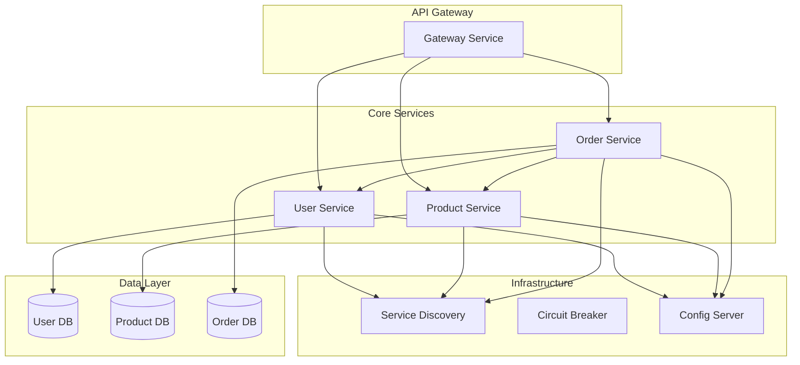
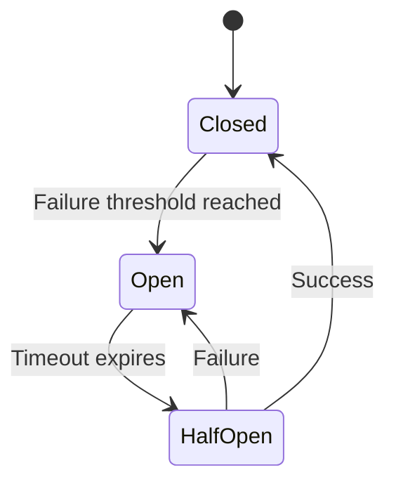
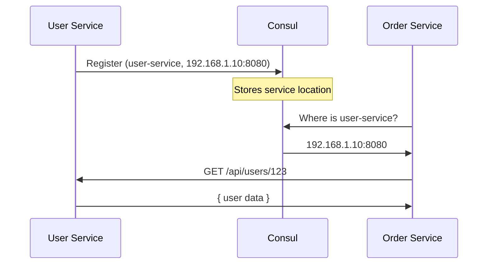
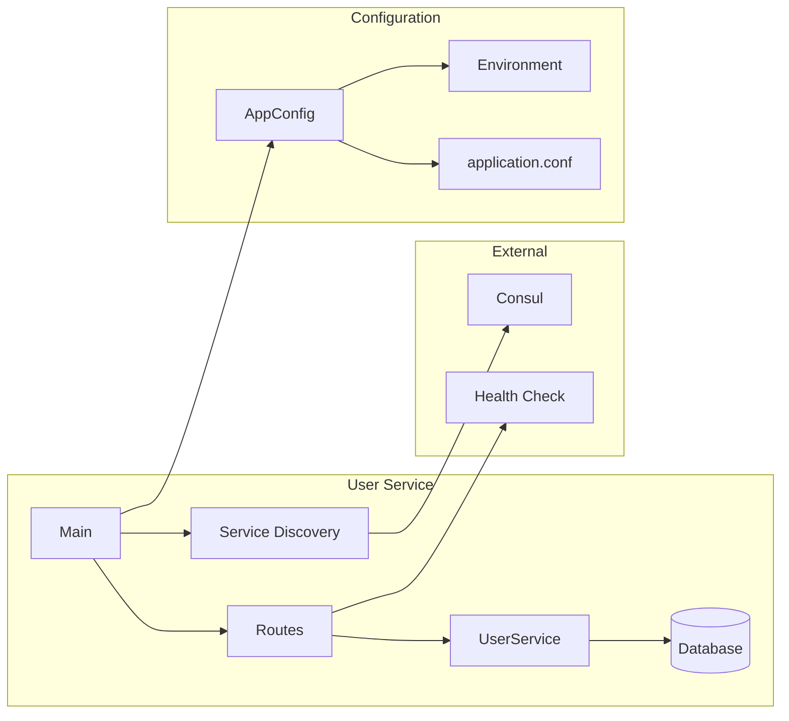

# How to Build Microservices with Scala

Author: [nawazdhandala](https://www.github.com/nawazdhandala)

Tags: Scala, Microservices, Akka HTTP, Docker, Service Discovery, Circuit Breaker, Distributed Systems

Description: A hands-on guide to building production-ready microservices in Scala using Akka HTTP, with patterns for resilience, service discovery, and containerization.

---

Scala has quietly become one of the most practical choices for building microservices. It gives you strong typing without the verbosity, functional programming without abandoning object-oriented patterns when they make sense, and an ecosystem that takes concurrency seriously. If you have worked with the JVM before, Scala feels like a natural progression - you get all the battle-tested libraries and tooling, but with a language that actually helps you write correct code.

This guide walks through building microservices with Akka HTTP, one of the more mature and performant options in the Scala ecosystem. We will cover everything from basic HTTP routing to circuit breakers, service discovery, configuration management, and Docker deployment.

---

## Table of Contents

1. Microservices Architecture Overview
2. Setting Up a Scala Project with Akka HTTP
3. Building Your First HTTP Service
4. Service Communication Patterns
5. Circuit Breakers for Resilience
6. Service Discovery with Consul
7. Configuration Management with Typesafe Config
8. Docker Deployment
9. Putting It All Together

---

## 1. Microservices Architecture Overview

Before diving into code, let's establish what we are building. A typical microservices architecture looks something like this:



Each service owns its data, communicates over HTTP or messaging, and registers itself with service discovery. When one service calls another, circuit breakers prevent cascading failures. Configuration comes from a central source but can be overridden locally.

The key principles:

- **Single Responsibility**: Each service does one thing well
- **Loose Coupling**: Services communicate through well-defined APIs
- **Independent Deployment**: You can deploy any service without touching others
- **Failure Isolation**: Problems in one service do not bring down the entire system

---

## 2. Setting Up a Scala Project with Akka HTTP

We will use sbt (Scala Build Tool) to manage our project. Here is the project structure:

```
user-service/
  src/
    main/
      scala/
        com/example/
          Main.scala
          routes/
            UserRoutes.scala
          models/
            User.scala
          services/
            UserService.scala
      resources/
        application.conf
  build.sbt
  project/
    build.properties
```

The build.sbt file defines dependencies. Akka HTTP needs akka-actor, akka-stream, and akka-http-core as its foundation.

```scala
// build.sbt
// Project metadata and Scala version
name := "user-service"
version := "1.0.0"
scalaVersion := "2.13.12"

// Dependency versions - keep these in sync across services
val akkaVersion = "2.8.5"
val akkaHttpVersion = "10.5.3"

libraryDependencies ++= Seq(
  // Akka core - actor system and streams for reactive processing
  "com.typesafe.akka" %% "akka-actor-typed" % akkaVersion,
  "com.typesafe.akka" %% "akka-stream" % akkaVersion,

  // Akka HTTP - the web framework
  "com.typesafe.akka" %% "akka-http" % akkaHttpVersion,
  "com.typesafe.akka" %% "akka-http-spray-json" % akkaHttpVersion,

  // Configuration library - type-safe config loading
  "com.typesafe" % "config" % "1.4.3",

  // Logging
  "ch.qos.logback" % "logback-classic" % "1.4.14",

  // Testing
  "com.typesafe.akka" %% "akka-http-testkit" % akkaHttpVersion % Test,
  "org.scalatest" %% "scalatest" % "3.2.17" % Test
)
```

Set the sbt version in project/build.properties:

```
sbt.version=1.9.7
```

---

## 3. Building Your First HTTP Service

Let's build a simple user service. We start with the data model.

Scala case classes work great for domain models - they give you immutability, equals/hashCode, and pattern matching for free.

```scala
// src/main/scala/com/example/models/User.scala
package com.example.models

// Case class provides immutability and automatic JSON serialization support
final case class User(
  id: String,
  email: String,
  name: String,
  createdAt: Long
)

// Request model for creating users - separate from the domain model
final case class CreateUserRequest(
  email: String,
  name: String
)
```

Next, the service layer handles business logic. Keep this separate from HTTP concerns.

```scala
// src/main/scala/com/example/services/UserService.scala
package com.example.services

import com.example.models.{User, CreateUserRequest}
import java.util.UUID
import scala.collection.concurrent.TrieMap
import scala.concurrent.{ExecutionContext, Future}

// Service layer - handles business logic independent of HTTP
class UserService(implicit ec: ExecutionContext) {

  // In-memory storage for demo purposes
  // In production, this would be a database client
  private val users = TrieMap.empty[String, User]

  def createUser(request: CreateUserRequest): Future[User] = Future {
    val user = User(
      id = UUID.randomUUID().toString,
      email = request.email,
      name = request.name,
      createdAt = System.currentTimeMillis()
    )
    users.put(user.id, user)
    user
  }

  def getUser(id: String): Future[Option[User]] = Future {
    users.get(id)
  }

  def getAllUsers(): Future[Seq[User]] = Future {
    users.values.toSeq
  }

  def deleteUser(id: String): Future[Boolean] = Future {
    users.remove(id).isDefined
  }
}
```

Now the HTTP routes. Akka HTTP uses a DSL that reads almost like plain English.

```scala
// src/main/scala/com/example/routes/UserRoutes.scala
package com.example.routes

import akka.http.scaladsl.server.Directives._
import akka.http.scaladsl.server.Route
import akka.http.scaladsl.model.StatusCodes
import akka.http.scaladsl.marshallers.sprayjson.SprayJsonSupport._
import spray.json.DefaultJsonProtocol._
import spray.json.RootJsonFormat
import com.example.models.{User, CreateUserRequest}
import com.example.services.UserService
import scala.concurrent.ExecutionContext

class UserRoutes(userService: UserService)(implicit ec: ExecutionContext) {

  // JSON serialization - Spray JSON needs these implicit formats
  implicit val userFormat: RootJsonFormat[User] = jsonFormat4(User)
  implicit val createUserFormat: RootJsonFormat[CreateUserRequest] = jsonFormat2(CreateUserRequest)

  // Route definition using Akka HTTP DSL
  // The ~ operator combines routes - first match wins
  val routes: Route = pathPrefix("api" / "users") {
    concat(
      // GET /api/users - list all users
      pathEnd {
        get {
          onSuccess(userService.getAllUsers()) { users =>
            complete(users)
          }
        } ~
        // POST /api/users - create a new user
        post {
          entity(as[CreateUserRequest]) { request =>
            onSuccess(userService.createUser(request)) { user =>
              complete(StatusCodes.Created, user)
            }
          }
        }
      },
      // GET /api/users/{id} - get single user
      path(Segment) { userId =>
        get {
          onSuccess(userService.getUser(userId)) {
            case Some(user) => complete(user)
            case None => complete(StatusCodes.NotFound, "User not found")
          }
        } ~
        // DELETE /api/users/{id} - delete user
        delete {
          onSuccess(userService.deleteUser(userId)) { deleted =>
            if (deleted) complete(StatusCodes.NoContent)
            else complete(StatusCodes.NotFound, "User not found")
          }
        }
      }
    )
  }
}
```

The main entry point wires everything together.

```scala
// src/main/scala/com/example/Main.scala
package com.example

import akka.actor.typed.ActorSystem
import akka.actor.typed.scaladsl.Behaviors
import akka.http.scaladsl.Http
import com.example.routes.UserRoutes
import com.example.services.UserService
import com.typesafe.config.ConfigFactory
import scala.concurrent.ExecutionContext
import scala.util.{Failure, Success}

object Main extends App {

  // Actor system is the foundation - manages threads and lifecycle
  implicit val system: ActorSystem[Nothing] = ActorSystem(Behaviors.empty, "user-service")
  implicit val ec: ExecutionContext = system.executionContext

  val config = ConfigFactory.load()
  val host = config.getString("http.host")
  val port = config.getInt("http.port")

  // Dependency injection - create service and pass to routes
  val userService = new UserService()
  val userRoutes = new UserRoutes(userService)

  // Start the HTTP server
  val bindingFuture = Http().newServerAt(host, port).bind(userRoutes.routes)

  bindingFuture.onComplete {
    case Success(binding) =>
      val address = binding.localAddress
      system.log.info(s"Server online at http://${address.getHostString}:${address.getPort}/")
    case Failure(ex) =>
      system.log.error(s"Failed to bind HTTP server: ${ex.getMessage}")
      system.terminate()
  }
}
```

---

## 4. Service Communication Patterns

Microservices need to talk to each other. Here is how to build a type-safe HTTP client for inter-service communication.

The client wraps Akka HTTP's client API and handles JSON serialization automatically.

```scala
// src/main/scala/com/example/clients/HttpClient.scala
package com.example.clients

import akka.actor.typed.ActorSystem
import akka.http.scaladsl.Http
import akka.http.scaladsl.model._
import akka.http.scaladsl.unmarshalling.Unmarshal
import akka.http.scaladsl.marshallers.sprayjson.SprayJsonSupport._
import spray.json.RootJsonFormat
import scala.concurrent.{ExecutionContext, Future}
import scala.concurrent.duration._

// Generic HTTP client for service-to-service communication
class ServiceClient(baseUrl: String)(implicit system: ActorSystem[_], ec: ExecutionContext) {

  private val http = Http()

  // GET request with automatic JSON deserialization
  def get[T](path: String)(implicit format: RootJsonFormat[T]): Future[T] = {
    val request = HttpRequest(
      method = HttpMethods.GET,
      uri = s"$baseUrl$path"
    )

    http.singleRequest(request).flatMap { response =>
      response.status match {
        case StatusCodes.OK => Unmarshal(response.entity).to[T]
        case status =>
          response.discardEntityBytes()
          Future.failed(new RuntimeException(s"Request failed with status: $status"))
      }
    }
  }

  // POST request with JSON body
  def post[Req, Res](path: String, body: Req)(
    implicit reqFormat: RootJsonFormat[Req], resFormat: RootJsonFormat[Res]
  ): Future[Res] = {
    import akka.http.scaladsl.marshalling.Marshal

    Marshal(body).to[RequestEntity].flatMap { entity =>
      val request = HttpRequest(
        method = HttpMethods.POST,
        uri = s"$baseUrl$path",
        entity = entity.withContentType(ContentTypes.`application/json`)
      )

      http.singleRequest(request).flatMap { response =>
        response.status match {
          case StatusCodes.OK | StatusCodes.Created =>
            Unmarshal(response.entity).to[Res]
          case status =>
            response.discardEntityBytes()
            Future.failed(new RuntimeException(s"Request failed with status: $status"))
        }
      }
    }
  }
}
```

Here is how the order service might call the user service to validate a user exists before creating an order:

```scala
// src/main/scala/com/example/services/OrderService.scala
package com.example.services

import com.example.clients.ServiceClient
import com.example.models.{Order, User, CreateOrderRequest}
import spray.json.DefaultJsonProtocol._
import spray.json.RootJsonFormat
import scala.concurrent.{ExecutionContext, Future}

class OrderService(userClient: ServiceClient)(implicit ec: ExecutionContext) {

  implicit val userFormat: RootJsonFormat[User] = jsonFormat4(User)

  def createOrder(request: CreateOrderRequest): Future[Order] = {
    // First, verify the user exists by calling user-service
    userClient.get[User](s"/api/users/${request.userId}").flatMap { user =>
      // User exists, proceed with order creation
      val order = Order(
        id = java.util.UUID.randomUUID().toString,
        userId = user.id,
        items = request.items,
        total = request.items.map(_.price).sum,
        status = "pending",
        createdAt = System.currentTimeMillis()
      )
      // Save order to database...
      Future.successful(order)
    }.recoverWith {
      case ex: RuntimeException if ex.getMessage.contains("404") =>
        Future.failed(new RuntimeException(s"User ${request.userId} not found"))
    }
  }
}
```

---

## 5. Circuit Breakers for Resilience

When a downstream service fails, you do not want to keep hammering it with requests. Circuit breakers detect failures and stop making requests temporarily, giving the failing service time to recover.



Akka provides a circuit breaker out of the box. Here is how to wrap service calls with it.

```scala
// src/main/scala/com/example/clients/ResilientClient.scala
package com.example.clients

import akka.actor.typed.ActorSystem
import akka.pattern.CircuitBreaker
import spray.json.RootJsonFormat
import scala.concurrent.{ExecutionContext, Future}
import scala.concurrent.duration._

// Wraps ServiceClient with circuit breaker for fault tolerance
class ResilientClient(
  baseUrl: String,
  maxFailures: Int = 5,
  callTimeout: FiniteDuration = 10.seconds,
  resetTimeout: FiniteDuration = 30.seconds
)(implicit system: ActorSystem[_], ec: ExecutionContext) {

  private val client = new ServiceClient(baseUrl)

  // Circuit breaker configuration:
  // - maxFailures: how many failures before opening the circuit
  // - callTimeout: max time to wait for a response
  // - resetTimeout: how long to wait before trying again
  private val breaker = CircuitBreaker(
    scheduler = system.classicSystem.scheduler,
    maxFailures = maxFailures,
    callTimeout = callTimeout,
    resetTimeout = resetTimeout
  ).onOpen {
    system.log.warn(s"Circuit breaker OPEN for $baseUrl - requests will fail fast")
  }.onClose {
    system.log.info(s"Circuit breaker CLOSED for $baseUrl - normal operation resumed")
  }.onHalfOpen {
    system.log.info(s"Circuit breaker HALF-OPEN for $baseUrl - testing with single request")
  }

  // Wrap the actual HTTP call with circuit breaker protection
  def get[T](path: String)(implicit format: RootJsonFormat[T]): Future[T] = {
    breaker.withCircuitBreaker(client.get[T](path))
  }

  def post[Req, Res](path: String, body: Req)(
    implicit reqFormat: RootJsonFormat[Req], resFormat: RootJsonFormat[Res]
  ): Future[Res] = {
    breaker.withCircuitBreaker(client.post[Req, Res](path, body))
  }

  // Provide fallback values when circuit is open
  def getWithFallback[T](path: String, fallback: => T)(
    implicit format: RootJsonFormat[T]
  ): Future[T] = {
    breaker.withCircuitBreaker(client.get[T](path)).recover {
      case _: akka.pattern.CircuitBreakerOpenException =>
        system.log.warn(s"Circuit open, returning fallback for $path")
        fallback
    }
  }
}
```

Use the resilient client in your services:

```scala
// Using circuit breaker in OrderService
class OrderService(userClient: ResilientClient)(implicit ec: ExecutionContext) {

  def createOrder(request: CreateOrderRequest): Future[Order] = {
    // If user-service is down, the circuit will open and fail fast
    // instead of waiting for timeout on every request
    userClient.get[User](s"/api/users/${request.userId}").flatMap { user =>
      // ... create order
      Future.successful(order)
    }
  }
}
```

---

## 6. Service Discovery with Consul

Hard-coding service URLs breaks the whole point of microservices. Service discovery lets services find each other dynamically. Consul is a popular choice.

Here is the flow:



First, add the Consul client dependency to build.sbt:

```scala
// Add to libraryDependencies
"com.orbitz.consul" % "consul-client" % "1.5.3"
```

Create a service registry abstraction:

```scala
// src/main/scala/com/example/discovery/ServiceRegistry.scala
package com.example.discovery

import com.orbitz.consul.Consul
import com.orbitz.consul.model.agent.{ImmutableRegistration, Registration}
import com.orbitz.consul.model.health.ServiceHealth
import scala.jdk.CollectionConverters._
import scala.util.Random

// Abstracts service registration and discovery
class ServiceRegistry(consulHost: String, consulPort: Int) {

  private val consul = Consul.builder()
    .withUrl(s"http://$consulHost:$consulPort")
    .build()

  private val agentClient = consul.agentClient()
  private val healthClient = consul.healthClient()

  // Register this service instance with Consul
  def register(
    serviceName: String,
    serviceId: String,
    host: String,
    port: Int,
    healthCheckPath: String = "/health"
  ): Unit = {
    val registration = ImmutableRegistration.builder()
      .id(serviceId)
      .name(serviceName)
      .address(host)
      .port(port)
      .check(Registration.RegCheck.http(
        s"http://$host:$port$healthCheckPath",
        10 // check interval in seconds
      ))
      .build()

    agentClient.register(registration)
    println(s"Registered $serviceName ($serviceId) at $host:$port")
  }

  // Deregister on shutdown
  def deregister(serviceId: String): Unit = {
    agentClient.deregister(serviceId)
    println(s"Deregistered $serviceId")
  }

  // Find healthy instances of a service
  def discover(serviceName: String): Option[ServiceInstance] = {
    val healthyServices = healthClient
      .getHealthyServiceInstances(serviceName)
      .getResponse
      .asScala
      .toList

    // Simple random load balancing
    if (healthyServices.nonEmpty) {
      val selected = healthyServices(Random.nextInt(healthyServices.size))
      val service = selected.getService
      Some(ServiceInstance(
        host = service.getAddress,
        port = service.getPort
      ))
    } else {
      None
    }
  }
}

case class ServiceInstance(host: String, port: Int) {
  def baseUrl: String = s"http://$host:$port"
}
```

Integrate with your main application:

```scala
// Updated Main.scala with service discovery
object Main extends App {

  implicit val system: ActorSystem[Nothing] = ActorSystem(Behaviors.empty, "user-service")
  implicit val ec: ExecutionContext = system.executionContext

  val config = ConfigFactory.load()
  val host = config.getString("http.host")
  val port = config.getInt("http.port")
  val serviceName = config.getString("service.name")
  val serviceId = s"$serviceName-${java.util.UUID.randomUUID().toString.take(8)}"

  // Service discovery setup
  val registry = new ServiceRegistry(
    config.getString("consul.host"),
    config.getInt("consul.port")
  )

  val userService = new UserService()
  val healthRoutes = new HealthRoutes()
  val userRoutes = new UserRoutes(userService)

  // Combine routes
  val allRoutes = healthRoutes.routes ~ userRoutes.routes

  val bindingFuture = Http().newServerAt(host, port).bind(allRoutes)

  bindingFuture.onComplete {
    case Success(binding) =>
      // Register with Consul after successful binding
      registry.register(serviceName, serviceId, host, port)

      // Deregister on shutdown
      sys.addShutdownHook {
        registry.deregister(serviceId)
        system.terminate()
      }

    case Failure(ex) =>
      system.log.error(s"Failed to bind: ${ex.getMessage}")
      system.terminate()
  }
}
```

Add a health check endpoint that Consul will poll:

```scala
// src/main/scala/com/example/routes/HealthRoutes.scala
package com.example.routes

import akka.http.scaladsl.server.Directives._
import akka.http.scaladsl.server.Route
import akka.http.scaladsl.model.StatusCodes

class HealthRoutes {

  val routes: Route = path("health") {
    get {
      // Add actual health checks here - database connectivity, etc.
      complete(StatusCodes.OK, "healthy")
    }
  }
}
```

Now create a discovery-aware client that looks up services dynamically:

```scala
// src/main/scala/com/example/clients/DiscoveryClient.scala
package com.example.clients

import akka.actor.typed.ActorSystem
import com.example.discovery.ServiceRegistry
import spray.json.RootJsonFormat
import scala.concurrent.{ExecutionContext, Future}

// HTTP client that resolves service addresses via Consul
class DiscoveryClient(
  serviceName: String,
  registry: ServiceRegistry
)(implicit system: ActorSystem[_], ec: ExecutionContext) {

  private def withClient[T](f: ServiceClient => Future[T]): Future[T] = {
    registry.discover(serviceName) match {
      case Some(instance) =>
        val client = new ServiceClient(instance.baseUrl)
        f(client)
      case None =>
        Future.failed(new RuntimeException(s"No healthy instances of $serviceName"))
    }
  }

  def get[T](path: String)(implicit format: RootJsonFormat[T]): Future[T] = {
    withClient(_.get[T](path))
  }

  def post[Req, Res](path: String, body: Req)(
    implicit reqFormat: RootJsonFormat[Req], resFormat: RootJsonFormat[Res]
  ): Future[Res] = {
    withClient(_.post[Req, Res](path, body))
  }
}
```

---

## 7. Configuration Management with Typesafe Config

Typesafe Config (HOCON format) is the standard for Scala applications. It supports environment variable overrides, includes, and substitution.

```hocon
# src/main/resources/application.conf

# Service identity
service {
  name = "user-service"
  version = "1.0.0"
}

# HTTP server settings
http {
  host = "0.0.0.0"
  host = ${?HTTP_HOST}  # Override with env var if set
  port = 8080
  port = ${?HTTP_PORT}
}

# Consul for service discovery
consul {
  host = "localhost"
  host = ${?CONSUL_HOST}
  port = 8500
  port = ${?CONSUL_PORT}
}

# Database connection
database {
  url = "jdbc:postgresql://localhost:5432/users"
  url = ${?DATABASE_URL}
  user = "postgres"
  user = ${?DATABASE_USER}
  password = "secret"
  password = ${?DATABASE_PASSWORD}
  pool-size = 10
  pool-size = ${?DATABASE_POOL_SIZE}
}

# Circuit breaker settings
circuit-breaker {
  max-failures = 5
  call-timeout = 10s
  reset-timeout = 30s
}

# Akka configuration
akka {
  loglevel = "INFO"
  loglevel = ${?LOG_LEVEL}

  http {
    server {
      idle-timeout = 60s
      request-timeout = 30s
    }
  }
}
```

Load config in a type-safe way:

```scala
// src/main/scala/com/example/config/AppConfig.scala
package com.example.config

import com.typesafe.config.{Config, ConfigFactory}
import scala.concurrent.duration._

// Type-safe configuration wrapper
// Fails fast on startup if required config is missing
case class AppConfig(
  service: ServiceConfig,
  http: HttpConfig,
  consul: ConsulConfig,
  database: DatabaseConfig,
  circuitBreaker: CircuitBreakerConfig
)

case class ServiceConfig(name: String, version: String)
case class HttpConfig(host: String, port: Int)
case class ConsulConfig(host: String, port: Int)
case class DatabaseConfig(url: String, user: String, password: String, poolSize: Int)
case class CircuitBreakerConfig(maxFailures: Int, callTimeout: FiniteDuration, resetTimeout: FiniteDuration)

object AppConfig {

  def load(): AppConfig = {
    val config = ConfigFactory.load()

    AppConfig(
      service = ServiceConfig(
        name = config.getString("service.name"),
        version = config.getString("service.version")
      ),
      http = HttpConfig(
        host = config.getString("http.host"),
        port = config.getInt("http.port")
      ),
      consul = ConsulConfig(
        host = config.getString("consul.host"),
        port = config.getInt("consul.port")
      ),
      database = DatabaseConfig(
        url = config.getString("database.url"),
        user = config.getString("database.user"),
        password = config.getString("database.password"),
        poolSize = config.getInt("database.pool-size")
      ),
      circuitBreaker = CircuitBreakerConfig(
        maxFailures = config.getInt("circuit-breaker.max-failures"),
        callTimeout = config.getDuration("circuit-breaker.call-timeout").toMillis.millis,
        resetTimeout = config.getDuration("circuit-breaker.reset-timeout").toMillis.millis
      )
    )
  }
}
```

---

## 8. Docker Deployment

Containerizing Scala services requires some care. The JVM needs proper memory settings, and multi-stage builds keep images small.

Here is a production-ready Dockerfile:

```dockerfile
# Dockerfile
# Multi-stage build - first stage compiles, second stage runs

# Build stage - use full JDK with sbt
FROM hseeberger/scala-sbt:17.0.2_1.6.2_2.13.8 AS builder

WORKDIR /app

# Cache dependencies - copy build files first
COPY build.sbt .
COPY project/build.properties project/
RUN sbt update

# Copy source and build
COPY src/ src/
RUN sbt assembly

# Runtime stage - minimal JRE image
FROM eclipse-temurin:17-jre-alpine

WORKDIR /app

# Create non-root user for security
RUN addgroup -S appgroup && adduser -S appuser -G appgroup
USER appuser

# Copy the fat JAR from builder
COPY --from=builder /app/target/scala-2.13/user-service-assembly-1.0.0.jar app.jar

# JVM memory settings - adjust based on container limits
# Use container-aware memory settings with -XX:+UseContainerSupport
ENV JAVA_OPTS="-XX:+UseContainerSupport -XX:MaxRAMPercentage=75.0 -XX:InitialRAMPercentage=50.0"

EXPOSE 8080

HEALTHCHECK --interval=30s --timeout=3s --start-period=10s --retries=3 \
  CMD wget --no-verbose --tries=1 --spider http://localhost:8080/health || exit 1

ENTRYPOINT ["sh", "-c", "java $JAVA_OPTS -jar app.jar"]
```

Add the sbt-assembly plugin for creating fat JARs:

```scala
// project/plugins.sbt
addSbtPlugin("com.eed3si9n" % "sbt-assembly" % "2.1.5")
```

Configure assembly to handle duplicate files:

```scala
// Add to build.sbt
assembly / assemblyMergeStrategy := {
  case PathList("META-INF", xs @ _*) => MergeStrategy.discard
  case "reference.conf" => MergeStrategy.concat
  case x => MergeStrategy.first
}

assembly / assemblyJarName := s"${name.value}-assembly-${version.value}.jar"
```

Docker Compose for local development:

```yaml
# docker-compose.yml
version: '3.8'

services:
  consul:
    image: consul:1.15
    ports:
      - "8500:8500"
    command: agent -server -bootstrap -ui -client=0.0.0.0

  user-service:
    build:
      context: ./user-service
      dockerfile: Dockerfile
    ports:
      - "8081:8080"
    environment:
      - HTTP_PORT=8080
      - CONSUL_HOST=consul
      - CONSUL_PORT=8500
      - DATABASE_URL=jdbc:postgresql://postgres:5432/users
    depends_on:
      - consul
      - postgres

  order-service:
    build:
      context: ./order-service
      dockerfile: Dockerfile
    ports:
      - "8082:8080"
    environment:
      - HTTP_PORT=8080
      - CONSUL_HOST=consul
      - CONSUL_PORT=8500
      - DATABASE_URL=jdbc:postgresql://postgres:5432/orders
    depends_on:
      - consul
      - postgres
      - user-service

  postgres:
    image: postgres:15-alpine
    environment:
      - POSTGRES_USER=postgres
      - POSTGRES_PASSWORD=secret
    volumes:
      - postgres-data:/var/lib/postgresql/data
      - ./init-db.sql:/docker-entrypoint-initdb.d/init.sql

volumes:
  postgres-data:
```

---

## 9. Putting It All Together

Here is how all the pieces fit in a complete service:



Final Main.scala bringing everything together:

```scala
// src/main/scala/com/example/Main.scala
package com.example

import akka.actor.typed.ActorSystem
import akka.actor.typed.scaladsl.Behaviors
import akka.http.scaladsl.Http
import akka.http.scaladsl.server.Directives._
import com.example.config.AppConfig
import com.example.discovery.ServiceRegistry
import com.example.routes.{HealthRoutes, UserRoutes}
import com.example.services.UserService
import scala.concurrent.ExecutionContext
import scala.util.{Failure, Success}

object Main extends App {

  // Load configuration - fails fast if misconfigured
  val config = AppConfig.load()

  // Actor system - the foundation of Akka
  implicit val system: ActorSystem[Nothing] =
    ActorSystem(Behaviors.empty, config.service.name)
  implicit val ec: ExecutionContext = system.executionContext

  // Generate unique instance ID for this container
  val serviceId = s"${config.service.name}-${java.util.UUID.randomUUID().toString.take(8)}"

  // Initialize components
  val registry = new ServiceRegistry(config.consul.host, config.consul.port)
  val userService = new UserService()

  // Combine all routes
  val routes = concat(
    new HealthRoutes().routes,
    new UserRoutes(userService).routes
  )

  // Start HTTP server
  val binding = Http()
    .newServerAt(config.http.host, config.http.port)
    .bind(routes)

  binding.onComplete {
    case Success(b) =>
      val addr = b.localAddress
      system.log.info(
        s"${config.service.name} v${config.service.version} " +
        s"started at http://${addr.getHostString}:${addr.getPort}"
      )

      // Register with Consul
      registry.register(
        config.service.name,
        serviceId,
        addr.getHostString,
        addr.getPort
      )

      // Graceful shutdown hook
      sys.addShutdownHook {
        system.log.info("Shutting down...")
        registry.deregister(serviceId)
        b.unbind().onComplete(_ => system.terminate())
      }

    case Failure(ex) =>
      system.log.error(s"Failed to start server: ${ex.getMessage}")
      system.terminate()
  }
}
```

Build and run with Docker:

```bash
# Build the image
docker build -t user-service:1.0.0 .

# Run with environment variables
docker run -d \
  --name user-service \
  -p 8080:8080 \
  -e CONSUL_HOST=consul.local \
  -e DATABASE_URL=jdbc:postgresql://db.local:5432/users \
  user-service:1.0.0

# Or use docker-compose for the full stack
docker-compose up -d
```

Test the service:

```bash
# Create a user
curl -X POST http://localhost:8080/api/users \
  -H "Content-Type: application/json" \
  -d '{"email": "alice@example.com", "name": "Alice"}'

# Get all users
curl http://localhost:8080/api/users

# Health check
curl http://localhost:8080/health
```

---

## Summary

Building microservices with Scala and Akka HTTP gives you a solid foundation:

| Component | What We Used | Why |
|-----------|--------------|-----|
| HTTP Framework | Akka HTTP | Non-blocking, DSL for routes, built-in marshalling |
| Resilience | Akka Circuit Breaker | Prevents cascade failures, fail-fast behavior |
| Discovery | Consul | Dynamic service location, health checking |
| Configuration | Typesafe Config | Environment overrides, type-safe loading |
| Containerization | Docker multi-stage | Small images, proper JVM settings |

The patterns we covered - circuit breakers, service discovery, health checks, graceful shutdown - are not Scala-specific. They apply to any microservices architecture. Scala just makes them pleasant to implement with its type system catching errors at compile time rather than in production.

Start with a single service, get it running in Docker with health checks, then add more services as your domain requires. Resist the urge to split too early - microservices add operational complexity that you should only accept when the benefits outweigh the costs.

---

**Related Reading:**

- [Akka HTTP Documentation](https://doc.akka.io/docs/akka-http/current/)
- [Consul Service Discovery Guide](https://developer.hashicorp.com/consul/docs/concepts/service-discovery)
- [The Twelve-Factor App](https://12factor.net/)
