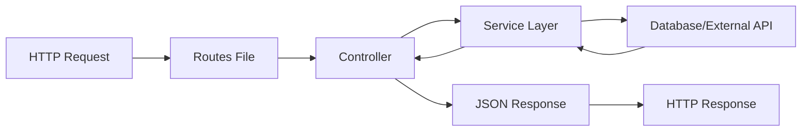

# How to Build REST APIs with Play Framework

Author: [nawazdhandala](https://www.github.com/nawazdhandala)

Tags: Scala, Play Framework, REST API, JSON, Dependency Injection, Async, Web Development

Description: A practical guide to building REST APIs with Play Framework, covering controllers, routing, JSON handling, validation, dependency injection, async actions, and error handling.

---

Play Framework is a reactive web framework for building scalable applications in Scala and Java. Its non-blocking architecture makes it well-suited for APIs that need to handle high concurrency. This guide walks through building a production-ready REST API from scratch.

## Setting Up a Play Project

Start by creating a new Play project using sbt. The framework provides a seed template that includes all the essentials.

```bash
# Create a new Play project using the official seed
sbt new playframework/play-scala-seed.g8

# Enter project details when prompted
# name: my-api
# organization: com.example

cd my-api
sbt run
```

Your project structure will look like this:

```
my-api/
  app/
    controllers/    # Request handlers
    models/         # Domain models
    services/       # Business logic
  conf/
    application.conf  # Configuration
    routes            # URL routing
  build.sbt           # Dependencies
  test/               # Unit tests
```

### Essential Dependencies

Add these to your `build.sbt` for a complete REST API setup:

```scala
// build.sbt
name := "my-api"
version := "1.0.0"
scalaVersion := "2.13.12"

lazy val root = (project in file("."))
  .enablePlugins(PlayScala)

libraryDependencies ++= Seq(
  guice,                                    // Dependency injection
  "org.scalatestplus.play" %% "scalatestplus-play" % "5.1.0" % Test,
  "org.postgresql" % "postgresql" % "42.6.0",
  "org.playframework.anorm" %% "anorm" % "2.7.0"
)
```

---

## Request Flow in Play

Understanding how requests flow through Play helps you structure your code effectively.



---

## Defining Routes

Play uses a dedicated routes file to map URLs to controller actions. The syntax is straightforward - HTTP method, URL pattern, and controller method.

```
# conf/routes

# Health check endpoint
GET     /health                     controllers.HealthController.check()

# User CRUD operations
GET     /api/users                  controllers.UserController.list()
GET     /api/users/:id              controllers.UserController.get(id: Long)
POST    /api/users                  controllers.UserController.create()
PUT     /api/users/:id              controllers.UserController.update(id: Long)
DELETE  /api/users/:id              controllers.UserController.delete(id: Long)

# Query parameters example - filter users by status
GET     /api/users/search           controllers.UserController.search(status: Option[String], limit: Int ?= 20)
```

### Path Parameters vs Query Parameters

Path parameters are part of the URL pattern (`:id`), while query parameters are defined in the method signature with optional defaults.

```
# Path parameter - required, part of the resource identity
GET     /api/orders/:orderId/items/:itemId    controllers.OrderController.getItem(orderId: Long, itemId: Long)

# Query parameters - optional filters
GET     /api/orders                           controllers.OrderController.list(status: Option[String], page: Int ?= 1, size: Int ?= 10)
```

---

## Building Controllers

Controllers handle HTTP requests and return responses. In Play, actions are functions that take a `Request` and return a `Result`.

### Basic Controller Structure

```scala
// app/controllers/UserController.scala
package controllers

import javax.inject._
import play.api.mvc._
import play.api.libs.json._
import scala.concurrent.{ExecutionContext, Future}
import services.UserService
import models.User

@Singleton
class UserController @Inject()(
  val controllerComponents: ControllerComponents,
  userService: UserService
)(implicit ec: ExecutionContext) extends BaseController {

  // GET /api/users
  def list(): Action[AnyContent] = Action.async { implicit request =>
    userService.findAll().map { users =>
      Ok(Json.toJson(users))
    }
  }

  // GET /api/users/:id
  def get(id: Long): Action[AnyContent] = Action.async { implicit request =>
    userService.findById(id).map {
      case Some(user) => Ok(Json.toJson(user))
      case None       => NotFound(Json.obj("error" -> s"User $id not found"))
    }
  }

  // POST /api/users
  def create(): Action[JsValue] = Action.async(parse.json) { implicit request =>
    request.body.validate[User].fold(
      errors => Future.successful(
        BadRequest(Json.obj("error" -> "Invalid JSON", "details" -> JsError.toJson(errors)))
      ),
      user => userService.create(user).map { created =>
        Created(Json.toJson(created))
      }
    )
  }

  // PUT /api/users/:id
  def update(id: Long): Action[JsValue] = Action.async(parse.json) { implicit request =>
    request.body.validate[User].fold(
      errors => Future.successful(
        BadRequest(Json.obj("error" -> "Invalid JSON"))
      ),
      user => userService.update(id, user).map {
        case Some(updated) => Ok(Json.toJson(updated))
        case None          => NotFound(Json.obj("error" -> s"User $id not found"))
      }
    )
  }

  // DELETE /api/users/:id
  def delete(id: Long): Action[AnyContent] = Action.async { implicit request =>
    userService.delete(id).map {
      case true  => NoContent
      case false => NotFound(Json.obj("error" -> s"User $id not found"))
    }
  }
}
```

---

## JSON Handling with Play JSON

Play JSON is the built-in library for JSON serialization. It uses type classes (Reads, Writes, Format) to convert between Scala objects and JSON.

### Defining Models with JSON Support

```scala
// app/models/User.scala
package models

import play.api.libs.json._
import play.api.libs.functional.syntax._

case class User(
  id: Option[Long],
  email: String,
  name: String,
  role: String,
  createdAt: Option[java.time.Instant]
)

object User {
  // Automatic JSON format derivation - works for simple case classes
  implicit val format: Format[User] = Json.format[User]
}

// For more control over serialization, define explicit Reads and Writes
case class UserProfile(
  userId: Long,
  displayName: String,
  bio: Option[String],
  avatarUrl: Option[String]
)

object UserProfile {
  // Custom Reads - how JSON is parsed into the case class
  implicit val reads: Reads[UserProfile] = (
    (JsPath \ "user_id").read[Long] and
    (JsPath \ "display_name").read[String] and
    (JsPath \ "bio").readNullable[String] and
    (JsPath \ "avatar_url").readNullable[String]
  )(UserProfile.apply _)

  // Custom Writes - how the case class is serialized to JSON
  implicit val writes: Writes[UserProfile] = (
    (JsPath \ "user_id").write[Long] and
    (JsPath \ "display_name").write[String] and
    (JsPath \ "bio").writeNullable[String] and
    (JsPath \ "avatar_url").writeNullable[String]
  )(unlift(UserProfile.unapply))
}
```

### Working with Nested JSON

```scala
// app/models/Order.scala
package models

import play.api.libs.json._

case class OrderItem(
  productId: Long,
  quantity: Int,
  price: BigDecimal
)

object OrderItem {
  implicit val format: Format[OrderItem] = Json.format[OrderItem]
}

case class Order(
  id: Option[Long],
  customerId: Long,
  items: Seq[OrderItem],
  status: String,
  total: BigDecimal
)

object Order {
  implicit val format: Format[Order] = Json.format[Order]
}

// Controller handling nested JSON
class OrderController @Inject()(
  val controllerComponents: ControllerComponents,
  orderService: OrderService
)(implicit ec: ExecutionContext) extends BaseController {

  def create(): Action[JsValue] = Action.async(parse.json) { implicit request =>
    request.body.validate[Order].fold(
      errors => Future.successful(BadRequest(JsError.toJson(errors))),
      order => orderService.create(order).map(created => Created(Json.toJson(created)))
    )
  }
}
```

---

## Request Validation

Validation is crucial for API robustness. Play JSON provides validation through the Reads type class.

### Built-in Validators

```scala
// app/models/CreateUserRequest.scala
package models

import play.api.libs.json._
import play.api.libs.functional.syntax._

case class CreateUserRequest(
  email: String,
  name: String,
  password: String,
  age: Option[Int]
)

object CreateUserRequest {
  implicit val reads: Reads[CreateUserRequest] = (
    // Email must match pattern
    (JsPath \ "email").read[String](Reads.email) and
    // Name must be between 2 and 100 characters
    (JsPath \ "name").read[String](Reads.minLength[String](2) keepAnd Reads.maxLength[String](100)) and
    // Password must be at least 8 characters
    (JsPath \ "password").read[String](Reads.minLength[String](8)) and
    // Age is optional but must be between 13 and 120 if provided
    (JsPath \ "age").readNullable[Int](Reads.min(13) keepAnd Reads.max(120))
  )(CreateUserRequest.apply _)
}
```

### Custom Validators

```scala
// app/validators/CustomValidators.scala
package validators

import play.api.libs.json._

object CustomValidators {
  // Validate that a string matches a specific pattern
  def pattern(regex: String, error: String = "Invalid format"): Reads[String] =
    Reads.StringReads.filter(JsonValidationError(error))(_.matches(regex))

  // Validate phone number format
  val phoneNumber: Reads[String] = pattern(
    "^\\+?[1-9]\\d{1,14}$",
    "Invalid phone number format"
  )

  // Validate URL format
  val url: Reads[String] = pattern(
    "^https?://.*",
    "Must be a valid URL starting with http:// or https://"
  )

  // Validate enum values
  def enum[E <: Enumeration](e: E): Reads[E#Value] = Reads[E#Value] { json =>
    json.validate[String].flatMap { str =>
      e.values.find(_.toString == str) match {
        case Some(value) => JsSuccess(value)
        case None        => JsError(s"Invalid value. Allowed: ${e.values.mkString(", ")}")
      }
    }
  }
}

// Using custom validators
object UserStatus extends Enumeration {
  val Active, Inactive, Suspended = Value
}

case class UpdateStatusRequest(status: UserStatus.Value)

object UpdateStatusRequest {
  import validators.CustomValidators._

  implicit val reads: Reads[UpdateStatusRequest] =
    (JsPath \ "status").read[UserStatus.Value](enum(UserStatus)).map(UpdateStatusRequest.apply)
}
```

### Validation in Controllers

```scala
// Comprehensive validation with detailed error responses
def create(): Action[JsValue] = Action.async(parse.json) { implicit request =>
  request.body.validate[CreateUserRequest] match {
    case JsSuccess(req, _) =>
      // Check for business rule violations
      userService.emailExists(req.email).flatMap {
        case true =>
          Future.successful(Conflict(Json.obj(
            "error" -> "Email already registered",
            "field" -> "email"
          )))
        case false =>
          userService.create(req).map(user => Created(Json.toJson(user)))
      }

    case JsError(errors) =>
      // Format validation errors for client
      val formattedErrors = errors.map { case (path, validationErrors) =>
        Json.obj(
          "field" -> path.toString(),
          "errors" -> validationErrors.map(_.message)
        )
      }
      Future.successful(BadRequest(Json.obj(
        "error" -> "Validation failed",
        "details" -> formattedErrors
      )))
  }
}
```

---

## Dependency Injection

Play uses Guice for dependency injection by default. This keeps your code testable and loosely coupled.

### Defining Services

```scala
// app/services/UserService.scala
package services

import javax.inject._
import scala.concurrent.{ExecutionContext, Future}
import models.{User, CreateUserRequest}

// Define the interface
trait UserService {
  def findAll(): Future[Seq[User]]
  def findById(id: Long): Future[Option[User]]
  def create(request: CreateUserRequest): Future[User]
  def update(id: Long, user: User): Future[Option[User]]
  def delete(id: Long): Future[Boolean]
  def emailExists(email: String): Future[Boolean]
}

// Implementation
@Singleton
class UserServiceImpl @Inject()(
  userRepository: UserRepository
)(implicit ec: ExecutionContext) extends UserService {

  override def findAll(): Future[Seq[User]] =
    userRepository.findAll()

  override def findById(id: Long): Future[Option[User]] =
    userRepository.findById(id)

  override def create(request: CreateUserRequest): Future[User] = {
    val user = User(
      id = None,
      email = request.email,
      name = request.name,
      role = "user",
      createdAt = Some(java.time.Instant.now())
    )
    userRepository.insert(user)
  }

  override def update(id: Long, user: User): Future[Option[User]] =
    userRepository.update(id, user)

  override def delete(id: Long): Future[Boolean] =
    userRepository.delete(id)

  override def emailExists(email: String): Future[Boolean] =
    userRepository.findByEmail(email).map(_.isDefined)
}
```

### Binding Interfaces to Implementations

```scala
// app/modules/AppModule.scala
package modules

import com.google.inject.AbstractModule
import services._

class AppModule extends AbstractModule {
  override def configure(): Unit = {
    // Bind interface to implementation
    bind(classOf[UserService]).to(classOf[UserServiceImpl])
    bind(classOf[OrderService]).to(classOf[OrderServiceImpl])
    bind(classOf[NotificationService]).to(classOf[EmailNotificationService])
  }
}
```

Enable the module in your configuration:

```
# conf/application.conf
play.modules.enabled += "modules.AppModule"
```

### Multiple Implementations

```scala
// When you need different implementations in different contexts
import com.google.inject.name.Names

class AppModule extends AbstractModule {
  override def configure(): Unit = {
    // Named bindings
    bind(classOf[NotificationService])
      .annotatedWith(Names.named("email"))
      .to(classOf[EmailNotificationService])

    bind(classOf[NotificationService])
      .annotatedWith(Names.named("sms"))
      .to(classOf[SmsNotificationService])
  }
}

// Inject specific implementation
class OrderController @Inject()(
  @Named("email") emailNotifier: NotificationService,
  @Named("sms") smsNotifier: NotificationService
) extends BaseController {
  // ...
}
```

---

## Async Actions

Play is built on Akka and is inherently asynchronous. Every action should return a `Future[Result]` to avoid blocking threads.

### Basic Async Pattern

```scala
// Non-blocking database call
def getUser(id: Long): Action[AnyContent] = Action.async { implicit request =>
  userService.findById(id).map {
    case Some(user) => Ok(Json.toJson(user))
    case None       => NotFound
  }
}

// Chaining multiple async operations
def createOrderWithNotification(): Action[JsValue] = Action.async(parse.json) { implicit request =>
  request.body.validate[CreateOrderRequest].fold(
    errors => Future.successful(BadRequest(JsError.toJson(errors))),
    orderRequest =>
      for {
        order <- orderService.create(orderRequest)
        _     <- notificationService.sendOrderConfirmation(order)
        _     <- inventoryService.reserve(order.items)
      } yield Created(Json.toJson(order))
  )
}
```

### Parallel Execution

```scala
// Execute independent operations in parallel
def getDashboard(userId: Long): Action[AnyContent] = Action.async { implicit request =>
  val userFuture = userService.findById(userId)
  val ordersFuture = orderService.findByUser(userId)
  val statsFuture = analyticsService.getUserStats(userId)

  for {
    userOpt <- userFuture
    orders  <- ordersFuture
    stats   <- statsFuture
  } yield userOpt match {
    case Some(user) =>
      Ok(Json.obj(
        "user" -> user,
        "recentOrders" -> orders.take(5),
        "stats" -> stats
      ))
    case None =>
      NotFound(Json.obj("error" -> "User not found"))
  }
}
```

### Timeout Handling

```scala
import scala.concurrent.duration._
import akka.pattern.after
import akka.actor.ActorSystem

class ExternalApiController @Inject()(
  val controllerComponents: ControllerComponents,
  actorSystem: ActorSystem,
  externalApi: ExternalApiClient
)(implicit ec: ExecutionContext) extends BaseController {

  def fetchData(): Action[AnyContent] = Action.async { implicit request =>
    val timeout = after(5.seconds, actorSystem.scheduler)(
      Future.failed(new java.util.concurrent.TimeoutException("Request timed out"))
    )

    val apiCall = externalApi.fetchData()

    Future.firstCompletedOf(Seq(apiCall, timeout))
      .map(data => Ok(Json.toJson(data)))
      .recover {
        case _: java.util.concurrent.TimeoutException =>
          GatewayTimeout(Json.obj("error" -> "External service timeout"))
        case ex: Exception =>
          InternalServerError(Json.obj("error" -> ex.getMessage))
      }
  }
}
```

---

## Error Handling

Consistent error handling improves API usability. Play provides several mechanisms for handling errors gracefully.

### Custom Error Handler

```scala
// app/handlers/ErrorHandler.scala
package handlers

import javax.inject._
import play.api.http.HttpErrorHandler
import play.api.mvc._
import play.api.mvc.Results._
import play.api.libs.json.Json
import scala.concurrent.Future
import play.api.Logging

@Singleton
class ErrorHandler @Inject()() extends HttpErrorHandler with Logging {

  override def onClientError(
    request: RequestHeader,
    statusCode: Int,
    message: String
  ): Future[Result] = {
    val response = statusCode match {
      case 400 => BadRequest(Json.obj(
        "error" -> "Bad Request",
        "message" -> message,
        "path" -> request.path
      ))
      case 401 => Unauthorized(Json.obj(
        "error" -> "Unauthorized",
        "message" -> "Authentication required"
      ))
      case 403 => Forbidden(Json.obj(
        "error" -> "Forbidden",
        "message" -> "You don't have permission to access this resource"
      ))
      case 404 => NotFound(Json.obj(
        "error" -> "Not Found",
        "message" -> s"Resource not found: ${request.path}"
      ))
      case _ => Status(statusCode)(Json.obj(
        "error" -> s"Client Error",
        "status" -> statusCode,
        "message" -> message
      ))
    }
    Future.successful(response)
  }

  override def onServerError(
    request: RequestHeader,
    exception: Throwable
  ): Future[Result] = {
    logger.error(s"Server error on ${request.method} ${request.path}", exception)

    val response = InternalServerError(Json.obj(
      "error" -> "Internal Server Error",
      "message" -> "An unexpected error occurred",
      "requestId" -> java.util.UUID.randomUUID().toString
    ))
    Future.successful(response)
  }
}
```

Register the error handler:

```
# conf/application.conf
play.http.errorHandler = "handlers.ErrorHandler"
```

### Domain-Specific Exceptions

```scala
// app/exceptions/ApiExceptions.scala
package exceptions

sealed abstract class ApiException(
  val message: String,
  val statusCode: Int
) extends Exception(message)

case class NotFoundException(resource: String, id: Any)
  extends ApiException(s"$resource with id $id not found", 404)

case class ConflictException(message: String)
  extends ApiException(message, 409)

case class ValidationException(errors: Seq[String])
  extends ApiException(errors.mkString(", "), 400)

case class UnauthorizedException(message: String = "Authentication required")
  extends ApiException(message, 401)

case class ForbiddenException(message: String = "Access denied")
  extends ApiException(message, 403)
```

### Action Composition for Error Handling

```scala
// app/actions/ApiAction.scala
package actions

import javax.inject._
import play.api.mvc._
import play.api.libs.json.Json
import scala.concurrent.{ExecutionContext, Future}
import exceptions._

class ApiAction @Inject()(
  parser: BodyParsers.Default
)(implicit ec: ExecutionContext) extends ActionBuilderImpl(parser) {

  override def invokeBlock[A](
    request: Request[A],
    block: Request[A] => Future[Result]
  ): Future[Result] = {
    block(request).recover {
      case e: NotFoundException =>
        Results.NotFound(Json.obj("error" -> e.message))

      case e: ConflictException =>
        Results.Conflict(Json.obj("error" -> e.message))

      case e: ValidationException =>
        Results.BadRequest(Json.obj("error" -> "Validation failed", "details" -> e.errors))

      case e: UnauthorizedException =>
        Results.Unauthorized(Json.obj("error" -> e.message))

      case e: ForbiddenException =>
        Results.Forbidden(Json.obj("error" -> e.message))

      case e: Exception =>
        Results.InternalServerError(Json.obj(
          "error" -> "Internal server error",
          "requestId" -> java.util.UUID.randomUUID().toString
        ))
    }
  }
}

// Using the custom action in controllers
class UserController @Inject()(
  val controllerComponents: ControllerComponents,
  apiAction: ApiAction,
  userService: UserService
)(implicit ec: ExecutionContext) extends BaseController {

  def get(id: Long): Action[AnyContent] = apiAction.async { implicit request =>
    userService.findById(id).map {
      case Some(user) => Ok(Json.toJson(user))
      case None       => throw NotFoundException("User", id)
    }
  }
}
```

---

## Putting It All Together

Here is a complete example combining all the patterns covered:

```scala
// app/controllers/ProductController.scala
package controllers

import javax.inject._
import play.api.mvc._
import play.api.libs.json._
import scala.concurrent.{ExecutionContext, Future}
import services.ProductService
import models._
import actions.ApiAction
import exceptions._

@Singleton
class ProductController @Inject()(
  val controllerComponents: ControllerComponents,
  apiAction: ApiAction,
  productService: ProductService
)(implicit ec: ExecutionContext) extends BaseController {

  // List products with pagination and filtering
  def list(
    category: Option[String],
    minPrice: Option[BigDecimal],
    maxPrice: Option[BigDecimal],
    page: Int,
    size: Int
  ): Action[AnyContent] = apiAction.async { implicit request =>
    val filters = ProductFilters(category, minPrice, maxPrice)
    val pagination = Pagination(page, size)

    for {
      products   <- productService.find(filters, pagination)
      totalCount <- productService.count(filters)
    } yield Ok(Json.obj(
      "data" -> products,
      "pagination" -> Json.obj(
        "page" -> page,
        "size" -> size,
        "totalPages" -> ((totalCount + size - 1) / size),
        "totalItems" -> totalCount
      )
    ))
  }

  // Get single product
  def get(id: Long): Action[AnyContent] = apiAction.async { implicit request =>
    productService.findById(id).map {
      case Some(product) => Ok(Json.toJson(product))
      case None          => throw NotFoundException("Product", id)
    }
  }

  // Create product with validation
  def create(): Action[JsValue] = apiAction.async(parse.json) { implicit request =>
    request.body.validate[CreateProductRequest] match {
      case JsSuccess(req, _) =>
        productService.create(req).map(product => Created(Json.toJson(product)))
      case JsError(errors) =>
        val messages = errors.flatMap(_._2.map(_.message)).toSeq
        throw ValidationException(messages)
    }
  }

  // Update product
  def update(id: Long): Action[JsValue] = apiAction.async(parse.json) { implicit request =>
    request.body.validate[UpdateProductRequest] match {
      case JsSuccess(req, _) =>
        productService.update(id, req).map {
          case Some(product) => Ok(Json.toJson(product))
          case None          => throw NotFoundException("Product", id)
        }
      case JsError(errors) =>
        val messages = errors.flatMap(_._2.map(_.message)).toSeq
        throw ValidationException(messages)
    }
  }

  // Delete product
  def delete(id: Long): Action[AnyContent] = apiAction.async { implicit request =>
    productService.delete(id).map {
      case true  => NoContent
      case false => throw NotFoundException("Product", id)
    }
  }
}
```

---

## Summary

| Component | Play Framework Approach |
|-----------|------------------------|
| **Routing** | Type-safe routes file with path and query parameters |
| **Controllers** | Action builders with async support |
| **JSON** | Play JSON with Reads/Writes type classes |
| **Validation** | Composable validators in Reads definitions |
| **DI** | Guice-based injection with interface bindings |
| **Async** | Future-based non-blocking operations |
| **Errors** | Custom error handlers and action composition |

Play Framework provides a solid foundation for building REST APIs that scale. Its functional approach to request handling, combined with type-safe routing and JSON processing, helps catch errors at compile time rather than runtime. The async-first architecture ensures your API can handle high concurrency without thread exhaustion.

---

*Want to monitor your Play Framework APIs in production? [OneUptime](https://oneuptime.com) provides comprehensive API monitoring with latency tracking, error alerting, and performance insights.*
