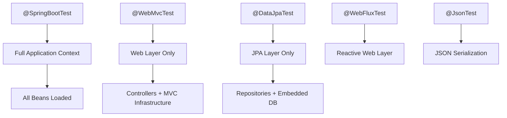
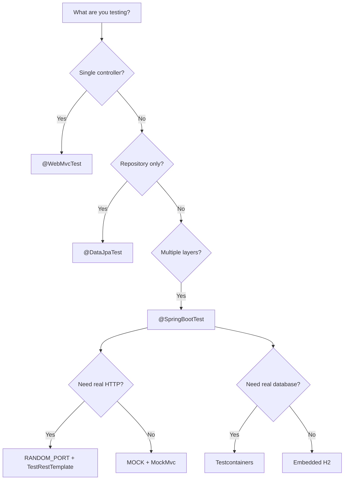

# How to Use Spring Boot Test for Integration Testing

Author: [nawazdhandala](https://www.github.com/nawazdhandala)

Tags: Spring Boot, Java, Testing, Integration Testing, DevOps

Description: A practical guide to writing integration tests in Spring Boot using @SpringBootTest, MockMvc, test slices, and Testcontainers for reliable, production-like test environments.

---

Integration tests verify that the different layers of your application work together correctly. Unlike unit tests that mock dependencies, integration tests exercise the real stack - controllers, services, repositories, and databases. Spring Boot provides excellent tooling for this, but knowing which annotation to use and when is the difference between tests that catch bugs and tests that slow you down.

## The Spring Boot Test Hierarchy

Before diving into code, it helps to understand how Spring Boot's testing annotations relate to each other:



Each annotation loads a different slice of the application context. Pick the smallest slice that covers what you need to test.

## @SpringBootTest - Full Application Context

Use `@SpringBootTest` when you need to test multiple layers together or verify end-to-end behavior. It loads the complete application context, which makes tests slower but more realistic.

This example shows a basic integration test that starts the full application and makes HTTP requests against it:

```java
// src/test/java/com/example/OrderServiceIntegrationTest.java
package com.example;

import org.junit.jupiter.api.Test;
import org.springframework.beans.factory.annotation.Autowired;
import org.springframework.boot.test.context.SpringBootTest;
import org.springframework.boot.test.web.client.TestRestTemplate;
import org.springframework.boot.test.web.server.LocalServerPort;
import org.springframework.http.HttpStatus;
import org.springframework.http.ResponseEntity;

import static org.assertj.core.api.Assertions.assertThat;

// Start the full application on a random port
// RANDOM_PORT avoids conflicts when running tests in parallel
@SpringBootTest(webEnvironment = SpringBootTest.WebEnvironment.RANDOM_PORT)
class OrderServiceIntegrationTest {

    // Spring injects the actual port assigned at runtime
    @LocalServerPort
    private int port;

    // TestRestTemplate is auto-configured for integration tests
    // It handles JSON serialization and error handling
    @Autowired
    private TestRestTemplate restTemplate;

    @Test
    void shouldCreateAndRetrieveOrder() {
        // Create a new order via POST request
        OrderRequest request = new OrderRequest("PROD-001", 2);
        ResponseEntity<Order> createResponse = restTemplate.postForEntity(
            "http://localhost:" + port + "/api/orders",
            request,
            Order.class
        );

        // Verify the order was created successfully
        assertThat(createResponse.getStatusCode()).isEqualTo(HttpStatus.CREATED);
        assertThat(createResponse.getBody()).isNotNull();
        assertThat(createResponse.getBody().getProductId()).isEqualTo("PROD-001");

        // Retrieve the order and verify persistence
        Long orderId = createResponse.getBody().getId();
        ResponseEntity<Order> getResponse = restTemplate.getForEntity(
            "http://localhost:" + port + "/api/orders/" + orderId,
            Order.class
        );

        assertThat(getResponse.getStatusCode()).isEqualTo(HttpStatus.OK);
        assertThat(getResponse.getBody().getQuantity()).isEqualTo(2);
    }
}
```

### WebEnvironment Options

| Option | Description | Use Case |
|--------|-------------|----------|
| `MOCK` | No server started, mock servlet environment | Testing with MockMvc |
| `RANDOM_PORT` | Real server on random port | TestRestTemplate tests |
| `DEFINED_PORT` | Real server on configured port | When port matters |
| `NONE` | No web environment | Non-web tests |

## MockMvc - Testing the Web Layer

MockMvc simulates HTTP requests without starting a real server. It is faster than TestRestTemplate and gives you more control over request construction and response verification.

This test demonstrates MockMvc's fluent API for building requests and asserting on responses:

```java
// src/test/java/com/example/UserControllerTest.java
package com.example;

import com.fasterxml.jackson.databind.ObjectMapper;
import org.junit.jupiter.api.Test;
import org.springframework.beans.factory.annotation.Autowired;
import org.springframework.boot.test.autoconfigure.web.servlet.AutoConfigureMockMvc;
import org.springframework.boot.test.context.SpringBootTest;
import org.springframework.http.MediaType;
import org.springframework.test.web.servlet.MockMvc;

import static org.springframework.test.web.servlet.request.MockMvcRequestBuilders.*;
import static org.springframework.test.web.servlet.result.MockMvcResultMatchers.*;

// AutoConfigureMockMvc adds MockMvc to the application context
@SpringBootTest
@AutoConfigureMockMvc
class UserControllerTest {

    @Autowired
    private MockMvc mockMvc;

    @Autowired
    private ObjectMapper objectMapper;

    @Test
    void shouldReturnUserById() throws Exception {
        // MockMvc simulates the full MVC pipeline without HTTP overhead
        mockMvc.perform(get("/api/users/1")
                .accept(MediaType.APPLICATION_JSON))
            // Verify HTTP status
            .andExpect(status().isOk())
            // Verify JSON response structure using JSONPath
            .andExpect(jsonPath("$.id").value(1))
            .andExpect(jsonPath("$.email").exists())
            .andExpect(jsonPath("$.createdAt").isNotEmpty());
    }

    @Test
    void shouldCreateUser() throws Exception {
        UserRequest request = new UserRequest("jane@example.com", "Jane Doe");

        mockMvc.perform(post("/api/users")
                .contentType(MediaType.APPLICATION_JSON)
                // Convert request object to JSON string
                .content(objectMapper.writeValueAsString(request)))
            .andExpect(status().isCreated())
            // Verify the response contains the assigned ID
            .andExpect(jsonPath("$.id").isNumber())
            .andExpect(jsonPath("$.email").value("jane@example.com"));
    }

    @Test
    void shouldReturnValidationError() throws Exception {
        // Test validation by sending invalid data
        UserRequest invalidRequest = new UserRequest("not-an-email", "");

        mockMvc.perform(post("/api/users")
                .contentType(MediaType.APPLICATION_JSON)
                .content(objectMapper.writeValueAsString(invalidRequest)))
            .andExpect(status().isBadRequest())
            // Verify validation error messages are returned
            .andExpect(jsonPath("$.errors").isArray())
            .andExpect(jsonPath("$.errors[0].field").exists());
    }
}
```

## Test Slices - Loading Only What You Need

Spring Boot's test slices load a minimal application context for specific layers. They run faster than `@SpringBootTest` and force better separation of concerns.

### @WebMvcTest - Controller Layer Only

Use `@WebMvcTest` to test controllers in isolation. It loads only the web layer and requires you to mock service dependencies.

```java
// src/test/java/com/example/ProductControllerSliceTest.java
package com.example;

import org.junit.jupiter.api.Test;
import org.springframework.beans.factory.annotation.Autowired;
import org.springframework.boot.test.autoconfigure.web.servlet.WebMvcTest;
import org.springframework.boot.test.mock.mockito.MockBean;
import org.springframework.test.web.servlet.MockMvc;

import java.math.BigDecimal;
import java.util.Optional;

import static org.mockito.Mockito.when;
import static org.springframework.test.web.servlet.request.MockMvcRequestBuilders.get;
import static org.springframework.test.web.servlet.result.MockMvcResultMatchers.*;

// Load only ProductController and its MVC dependencies
// Services, repositories, and other controllers are NOT loaded
@WebMvcTest(ProductController.class)
class ProductControllerSliceTest {

    @Autowired
    private MockMvc mockMvc;

    // Mock the service dependency - it is not loaded by @WebMvcTest
    @MockBean
    private ProductService productService;

    @Test
    void shouldReturnProduct() throws Exception {
        // Set up mock behavior
        Product product = new Product(1L, "Widget", new BigDecimal("29.99"));
        when(productService.findById(1L)).thenReturn(Optional.of(product));

        // Test the controller's behavior with mocked service
        mockMvc.perform(get("/api/products/1"))
            .andExpect(status().isOk())
            .andExpect(jsonPath("$.name").value("Widget"))
            .andExpect(jsonPath("$.price").value(29.99));
    }

    @Test
    void shouldReturn404WhenProductNotFound() throws Exception {
        // Mock the "not found" case
        when(productService.findById(999L)).thenReturn(Optional.empty());

        mockMvc.perform(get("/api/products/999"))
            .andExpect(status().isNotFound());
    }
}
```

### @DataJpaTest - Repository Layer Only

Use `@DataJpaTest` to test JPA repositories. It configures an embedded database, scans for `@Entity` classes, and enables transaction rollback after each test.

```java
// src/test/java/com/example/CustomerRepositoryTest.java
package com.example;

import org.junit.jupiter.api.Test;
import org.springframework.beans.factory.annotation.Autowired;
import org.springframework.boot.test.autoconfigure.orm.jpa.DataJpaTest;
import org.springframework.boot.test.autoconfigure.orm.jpa.TestEntityManager;

import java.util.List;

import static org.assertj.core.api.Assertions.assertThat;

// Configures an in-memory database and JPA infrastructure
// Each test runs in a transaction that rolls back automatically
@DataJpaTest
class CustomerRepositoryTest {

    // TestEntityManager is a JPA EntityManager designed for tests
    // Use it to set up test data before calling repository methods
    @Autowired
    private TestEntityManager entityManager;

    @Autowired
    private CustomerRepository customerRepository;

    @Test
    void shouldFindCustomersByStatus() {
        // Set up test data using TestEntityManager
        Customer active1 = new Customer("alice@example.com", CustomerStatus.ACTIVE);
        Customer active2 = new Customer("bob@example.com", CustomerStatus.ACTIVE);
        Customer inactive = new Customer("charlie@example.com", CustomerStatus.INACTIVE);

        // persist() adds entities to the persistence context
        // flush() forces immediate SQL execution
        entityManager.persist(active1);
        entityManager.persist(active2);
        entityManager.persist(inactive);
        entityManager.flush();

        // Test the custom query method
        List<Customer> activeCustomers = customerRepository
            .findByStatus(CustomerStatus.ACTIVE);

        assertThat(activeCustomers).hasSize(2);
        assertThat(activeCustomers)
            .extracting(Customer::getEmail)
            .containsExactlyInAnyOrder("alice@example.com", "bob@example.com");
    }

    @Test
    void shouldSaveAndRetrieveCustomer() {
        Customer customer = new Customer("dave@example.com", CustomerStatus.ACTIVE);

        Customer saved = customerRepository.save(customer);

        // Clear the persistence context to force a database read
        entityManager.clear();

        Customer found = customerRepository.findById(saved.getId()).orElseThrow();
        assertThat(found.getEmail()).isEqualTo("dave@example.com");
    }
}
```

## Testcontainers - Real Databases in Tests

Embedded databases like H2 are convenient but can hide bugs. Testcontainers lets you run real databases (PostgreSQL, MySQL, Redis) in Docker during tests.

Add the Testcontainers dependency to your project:

```xml
<!-- pom.xml -->
<dependency>
    <groupId>org.testcontainers</groupId>
    <artifactId>postgresql</artifactId>
    <version>1.19.0</version>
    <scope>test</scope>
</dependency>
<dependency>
    <groupId>org.testcontainers</groupId>
    <artifactId>junit-jupiter</artifactId>
    <version>1.19.0</version>
    <scope>test</scope>
</dependency>
```

This test uses a real PostgreSQL instance running in Docker:

```java
// src/test/java/com/example/OrderRepositoryContainerTest.java
package com.example;

import org.junit.jupiter.api.Test;
import org.springframework.beans.factory.annotation.Autowired;
import org.springframework.boot.test.context.SpringBootTest;
import org.springframework.test.context.DynamicPropertyRegistry;
import org.springframework.test.context.DynamicPropertySource;
import org.testcontainers.containers.PostgreSQLContainer;
import org.testcontainers.junit.jupiter.Container;
import org.testcontainers.junit.jupiter.Testcontainers;

import static org.assertj.core.api.Assertions.assertThat;

// Enable Testcontainers JUnit 5 integration
@Testcontainers
@SpringBootTest
class OrderRepositoryContainerTest {

    // Declare a PostgreSQL container
    // The container is shared across all tests in this class
    @Container
    static PostgreSQLContainer<?> postgres = new PostgreSQLContainer<>("postgres:15")
        .withDatabaseName("testdb")
        .withUsername("test")
        .withPassword("test");

    // Dynamically configure Spring to use the container's connection details
    // This runs before the application context is created
    @DynamicPropertySource
    static void configureProperties(DynamicPropertyRegistry registry) {
        registry.add("spring.datasource.url", postgres::getJdbcUrl);
        registry.add("spring.datasource.username", postgres::getUsername);
        registry.add("spring.datasource.password", postgres::getPassword);
    }

    @Autowired
    private OrderRepository orderRepository;

    @Test
    void shouldPersistOrderToPostgres() {
        // This test runs against real PostgreSQL, not H2
        Order order = new Order("PROD-001", 5, OrderStatus.PENDING);

        Order saved = orderRepository.save(order);

        assertThat(saved.getId()).isNotNull();
        assertThat(orderRepository.findById(saved.getId()))
            .isPresent()
            .hasValueSatisfying(o -> {
                assertThat(o.getProductId()).isEqualTo("PROD-001");
                assertThat(o.getQuantity()).isEqualTo(5);
            });
    }
}
```

### Sharing Containers Across Tests

Starting a new container for each test class is slow. Use a singleton pattern to share containers:

```java
// src/test/java/com/example/TestContainerConfig.java
package com.example;

import org.testcontainers.containers.PostgreSQLContainer;

// Singleton container shared across all test classes
public class TestContainerConfig {

    // Static instance started once when the class is loaded
    public static final PostgreSQLContainer<?> POSTGRES;

    static {
        POSTGRES = new PostgreSQLContainer<>("postgres:15")
            .withDatabaseName("testdb")
            .withUsername("test")
            .withPassword("test")
            // Reuse container across test runs (requires ~/.testcontainers.properties)
            .withReuse(true);
        POSTGRES.start();
    }
}
```

Then reference it in your tests:

```java
// src/test/java/com/example/AnotherRepositoryTest.java
@SpringBootTest
class AnotherRepositoryTest {

    @DynamicPropertySource
    static void configureProperties(DynamicPropertyRegistry registry) {
        // Reference the shared container
        registry.add("spring.datasource.url",
            TestContainerConfig.POSTGRES::getJdbcUrl);
        registry.add("spring.datasource.username",
            TestContainerConfig.POSTGRES::getUsername);
        registry.add("spring.datasource.password",
            TestContainerConfig.POSTGRES::getPassword);
    }

    // ... tests use the same container
}
```

## Test Configuration and Profiles

### Using Test-Specific Configuration

Create test-specific configuration by defining beans that override production ones:

```java
// src/test/java/com/example/TestConfig.java
package com.example;

import org.springframework.boot.test.context.TestConfiguration;
import org.springframework.context.annotation.Bean;
import org.springframework.context.annotation.Primary;

// @TestConfiguration beans are only loaded for tests
@TestConfiguration
public class TestConfig {

    // @Primary ensures this bean is used instead of the production one
    @Primary
    @Bean
    public EmailService emailService() {
        // Return a mock or stub that does not send real emails
        return new FakeEmailService();
    }

    @Primary
    @Bean
    public PaymentGateway paymentGateway() {
        // Return a test double that simulates payment processing
        return new StubPaymentGateway();
    }
}
```

Import the configuration in your test:

```java
// Import test configuration explicitly
@SpringBootTest
@Import(TestConfig.class)
class OrderProcessingTest {

    @Autowired
    private OrderService orderService;

    @Test
    void shouldProcessOrderWithoutRealPayment() {
        // This test uses StubPaymentGateway from TestConfig
        Order order = orderService.processOrder(new OrderRequest("PROD-001", 1));

        assertThat(order.getStatus()).isEqualTo(OrderStatus.COMPLETED);
    }
}
```

### Using Test Profiles

Define test-specific properties in `application-test.properties`:

```properties
# src/test/resources/application-test.properties

# Use embedded database
spring.datasource.url=jdbc:h2:mem:testdb
spring.datasource.driver-class-name=org.h2.Driver

# Disable external services
app.email.enabled=false
app.payment.sandbox=true

# Faster startup - skip unnecessary initialization
spring.jpa.hibernate.ddl-auto=create-drop
spring.main.lazy-initialization=true
```

Activate the profile in tests:

```java
// Activate the "test" profile for this test class
@SpringBootTest
@ActiveProfiles("test")
class IntegrationTestWithProfile {
    // Tests run with application-test.properties settings
}
```

## Testing Async Operations

Async methods require special handling. Use `Awaitility` to wait for asynchronous operations to complete:

```java
// src/test/java/com/example/AsyncProcessingTest.java
package com.example;

import org.awaitility.Awaitility;
import org.junit.jupiter.api.Test;
import org.springframework.beans.factory.annotation.Autowired;
import org.springframework.boot.test.context.SpringBootTest;

import java.time.Duration;

import static org.assertj.core.api.Assertions.assertThat;

@SpringBootTest
class AsyncProcessingTest {

    @Autowired
    private OrderService orderService;

    @Autowired
    private OrderRepository orderRepository;

    @Test
    void shouldProcessOrderAsynchronously() {
        // Start async order processing
        Long orderId = orderService.submitOrderAsync(new OrderRequest("PROD-001", 1));

        // Wait for the async operation to complete
        // Awaitility polls the condition until it passes or times out
        Awaitility.await()
            .atMost(Duration.ofSeconds(10))    // Maximum wait time
            .pollInterval(Duration.ofMillis(500)) // Check every 500ms
            .untilAsserted(() -> {
                Order order = orderRepository.findById(orderId).orElseThrow();
                assertThat(order.getStatus()).isEqualTo(OrderStatus.COMPLETED);
            });
    }
}
```

## Testing Best Practices

Here is a summary of when to use each testing approach:



| Practice | Why It Matters |
|----------|----------------|
| **Use the smallest slice possible** | Faster tests, clearer failures |
| **Avoid `@SpringBootTest` for unit tests** | Full context startup is slow |
| **Name tests descriptively** | `shouldReturnOrderWhenIdExists` not `testOrder1` |
| **Test behavior, not implementation** | Refactoring should not break tests |
| **Clean up test data** | Use `@Transactional` or explicit cleanup |
| **Parallelize carefully** | Shared databases cause flaky tests |

### Common Pitfalls

Things that trip up most teams when writing integration tests:

1. **Forgetting `@Transactional` rollback** - Tests pollute each other's data
2. **Hardcoding ports** - Tests fail when run in parallel
3. **Slow test suites** - Using `@SpringBootTest` everywhere
4. **Flaky tests** - Not waiting for async operations properly
5. **H2 vs production differences** - SQL syntax varies between databases

## Summary

| Tool | Purpose | Speed |
|------|---------|-------|
| `@SpringBootTest` | Full application context | Slow |
| `@WebMvcTest` | Controller layer only | Fast |
| `@DataJpaTest` | JPA repositories | Fast |
| `TestRestTemplate` | Real HTTP requests | Slow |
| `MockMvc` | Simulated HTTP | Fast |
| `Testcontainers` | Real databases in Docker | Medium |

Start with test slices for fast feedback during development. Use full integration tests to verify the system works end-to-end before deployment. Testcontainers bridges the gap between speed and realism when database compatibility matters. The goal is a test suite that catches real bugs quickly, not one that gives you false confidence with mocked-out dependencies.
