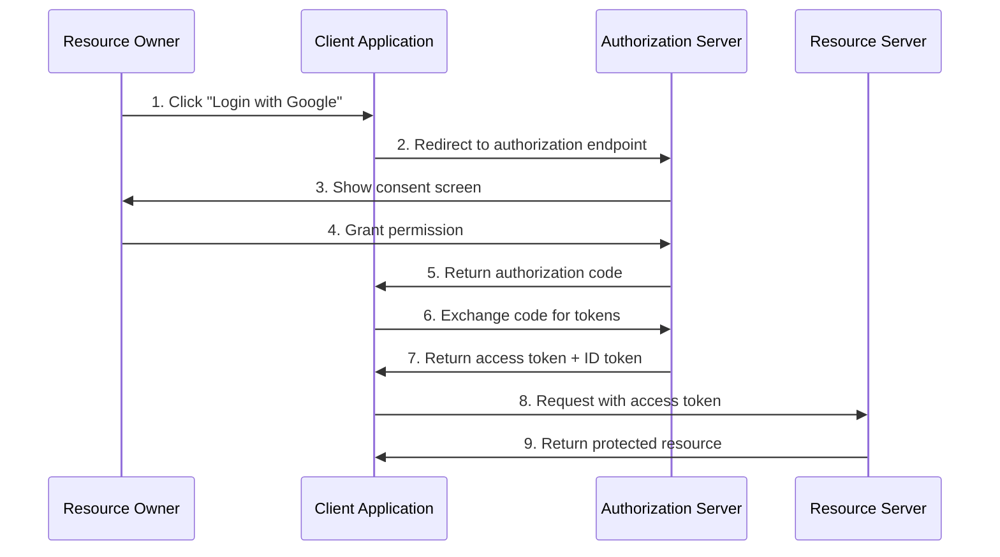
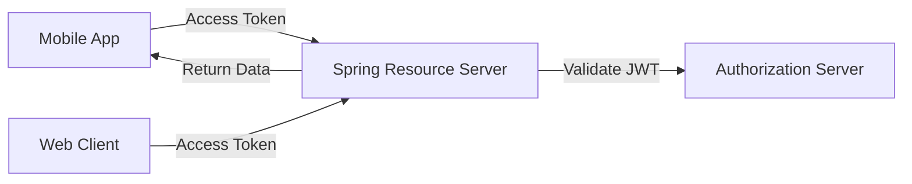
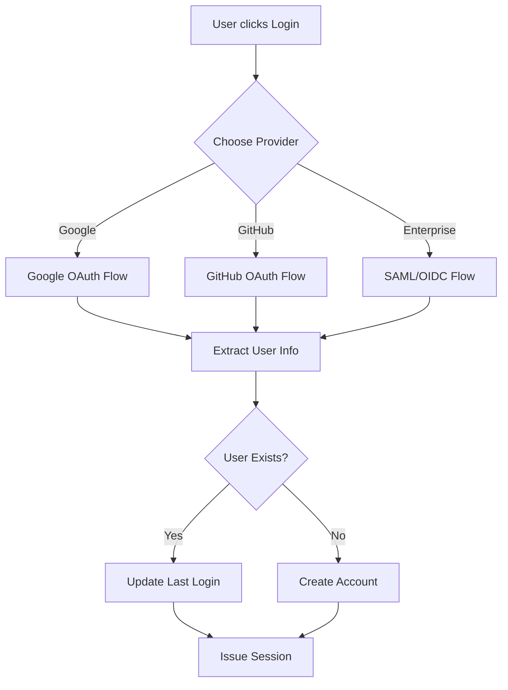

# How to Implement OAuth2 with Spring Security

Author: [nawazdhandala](https://www.github.com/nawazdhandala)

Tags: Spring Security, OAuth2, Java, Authentication, JWT, Social Login, Security

Description: A practical guide to implementing OAuth2 authentication in Spring Boot applications, covering client configuration, resource server setup, JWT validation, and social login with Google and GitHub.

---

OAuth2 has become the standard for securing modern web applications. Instead of managing passwords yourself, you delegate authentication to trusted providers and receive tokens that prove a user's identity. Spring Security makes this surprisingly straightforward once you understand the moving parts.

This guide walks through implementing OAuth2 in a Spring Boot application - from basic concepts to production-ready configurations with social login providers.

---

## Understanding OAuth2 Roles

Before writing code, you need to understand the four players in every OAuth2 interaction:



- **Resource Owner**: The user who owns the data
- **Client**: Your Spring Boot application requesting access
- **Authorization Server**: Google, GitHub, or your own server that issues tokens
- **Resource Server**: The API that validates tokens and serves protected resources

---

## Project Setup

Start with the necessary dependencies. Spring Boot's OAuth2 client and resource server starters handle most of the heavy lifting.

```xml
<!-- pom.xml -->
<dependencies>
    <!-- OAuth2 Client for login flows -->
    <dependency>
        <groupId>org.springframework.boot</groupId>
        <artifactId>spring-boot-starter-oauth2-client</artifactId>
    </dependency>

    <!-- OAuth2 Resource Server for API protection -->
    <dependency>
        <groupId>org.springframework.boot</groupId>
        <artifactId>spring-boot-starter-oauth2-resource-server</artifactId>
    </dependency>

    <!-- Web and Security foundations -->
    <dependency>
        <groupId>org.springframework.boot</groupId>
        <artifactId>spring-boot-starter-web</artifactId>
    </dependency>
    <dependency>
        <groupId>org.springframework.boot</groupId>
        <artifactId>spring-boot-starter-security</artifactId>
    </dependency>
</dependencies>
```

---

## OAuth2 Client Configuration

The OAuth2 client handles the login flow - redirecting users to providers, receiving callbacks, and managing tokens.

### Google Login Setup

Register your application in the Google Cloud Console first, then configure Spring to use those credentials.

```yaml
# application.yml
spring:
  security:
    oauth2:
      client:
        registration:
          google:
            client-id: ${GOOGLE_CLIENT_ID}
            client-secret: ${GOOGLE_CLIENT_SECRET}
            scope:
              - openid
              - profile
              - email
            redirect-uri: "{baseUrl}/login/oauth2/code/{registrationId}"
```

Spring auto-configures Google's endpoints because it is a well-known provider. The `redirect-uri` template variables are resolved automatically.

### GitHub Login Setup

GitHub requires explicit endpoint configuration since it uses a slightly different OAuth2 flow.

```yaml
spring:
  security:
    oauth2:
      client:
        registration:
          github:
            client-id: ${GITHUB_CLIENT_ID}
            client-secret: ${GITHUB_CLIENT_SECRET}
            scope:
              - user:email
              - read:user
        provider:
          github:
            authorization-uri: https://github.com/login/oauth/authorize
            token-uri: https://github.com/login/oauth/access_token
            user-info-uri: https://api.github.com/user
            user-name-attribute: login
```

---

## Security Configuration

Wire everything together with a security filter chain that defines which endpoints require authentication.

```java
@Configuration
@EnableWebSecurity
public class SecurityConfig {

    @Bean
    public SecurityFilterChain filterChain(HttpSecurity http) throws Exception {
        return http
            .authorizeHttpRequests(auth -> auth
                // Public endpoints
                .requestMatchers("/", "/public/**", "/error").permitAll()
                // API endpoints require authentication
                .requestMatchers("/api/**").authenticated()
                // Everything else requires login
                .anyRequest().authenticated()
            )
            // Enable OAuth2 login with default settings
            .oauth2Login(oauth2 -> oauth2
                .loginPage("/login")
                .defaultSuccessUrl("/dashboard", true)
                .failureUrl("/login?error=true")
            )
            // Enable logout
            .logout(logout -> logout
                .logoutSuccessUrl("/")
                .invalidateHttpSession(true)
                .clearAuthentication(true)
            )
            .build();
    }
}
```

This configuration creates a login page at `/login` that shows buttons for each configured provider (Google, GitHub). After successful authentication, users land on `/dashboard`.

---

## Custom User Info Handling

OAuth2 providers return different user attributes. Google sends `sub`, `email`, and `name`. GitHub sends `login`, `id`, and `avatar_url`. You need to normalize these into your application's user model.

### OAuth2 User Service

Override the default user service to map provider data to your domain model.

```java
@Service
public class CustomOAuth2UserService extends DefaultOAuth2UserService {

    private final UserRepository userRepository;

    public CustomOAuth2UserService(UserRepository userRepository) {
        this.userRepository = userRepository;
    }

    @Override
    public OAuth2User loadUser(OAuth2UserRequest request) throws OAuth2AuthenticationException {
        OAuth2User oauth2User = super.loadUser(request);

        String registrationId = request.getClientRegistration().getRegistrationId();
        String email = extractEmail(oauth2User, registrationId);
        String name = extractName(oauth2User, registrationId);

        // Find or create user in your database
        User user = userRepository.findByEmail(email)
            .orElseGet(() -> createNewUser(email, name, registrationId));

        // Update last login timestamp
        user.setLastLoginAt(Instant.now());
        user.setProvider(registrationId);
        userRepository.save(user);

        // Return wrapped user with authorities
        return new CustomOAuth2User(oauth2User, user);
    }

    private String extractEmail(OAuth2User oauth2User, String registrationId) {
        return switch (registrationId) {
            case "google" -> oauth2User.getAttribute("email");
            case "github" -> oauth2User.getAttribute("email");
            default -> throw new OAuth2AuthenticationException("Unknown provider");
        };
    }

    private String extractName(OAuth2User oauth2User, String registrationId) {
        return switch (registrationId) {
            case "google" -> oauth2User.getAttribute("name");
            case "github" -> oauth2User.getAttribute("login");
            default -> "Unknown";
        };
    }

    private User createNewUser(String email, String name, String provider) {
        User user = new User();
        user.setEmail(email);
        user.setName(name);
        user.setProvider(provider);
        user.setCreatedAt(Instant.now());
        user.setRoles(Set.of("ROLE_USER"));
        return user;
    }
}
```

### Custom OAuth2 User Wrapper

Wrap the provider's user object with your application's user data for easy access in controllers.

```java
public class CustomOAuth2User implements OAuth2User {

    private final OAuth2User oauth2User;
    private final User user;

    public CustomOAuth2User(OAuth2User oauth2User, User user) {
        this.oauth2User = oauth2User;
        this.user = user;
    }

    @Override
    public Map<String, Object> getAttributes() {
        return oauth2User.getAttributes();
    }

    @Override
    public Collection<? extends GrantedAuthority> getAuthorities() {
        return user.getRoles().stream()
            .map(SimpleGrantedAuthority::new)
            .collect(Collectors.toList());
    }

    @Override
    public String getName() {
        return user.getEmail();
    }

    public User getUser() {
        return user;
    }

    public Long getUserId() {
        return user.getId();
    }
}
```

Register the custom user service in your security configuration.

```java
@Bean
public SecurityFilterChain filterChain(HttpSecurity http) throws Exception {
    return http
        .authorizeHttpRequests(auth -> auth
            .requestMatchers("/", "/public/**").permitAll()
            .anyRequest().authenticated()
        )
        .oauth2Login(oauth2 -> oauth2
            .userInfoEndpoint(userInfo -> userInfo
                .userService(customOAuth2UserService)
            )
        )
        .build();
}
```

---

## Resource Server Configuration

When your Spring Boot application serves as an API, it acts as a resource server that validates incoming tokens. This is separate from the client role.



### JWT Validation Setup

Configure Spring to validate JWTs issued by your authorization server.

```yaml
spring:
  security:
    oauth2:
      resourceserver:
        jwt:
          issuer-uri: https://accounts.google.com
          # Or for custom auth servers:
          # jwk-set-uri: https://your-auth-server/.well-known/jwks.json
```

### Resource Server Security Config

Separate the resource server config from the client config if your app serves both roles.

```java
@Configuration
@EnableWebSecurity
public class ResourceServerConfig {

    @Bean
    @Order(1)
    public SecurityFilterChain apiSecurityFilterChain(HttpSecurity http) throws Exception {
        return http
            // Only apply to /api/** paths
            .securityMatcher("/api/**")
            .authorizeHttpRequests(auth -> auth
                .requestMatchers("/api/public/**").permitAll()
                .requestMatchers("/api/admin/**").hasRole("ADMIN")
                .anyRequest().authenticated()
            )
            // Validate JWTs for API requests
            .oauth2ResourceServer(oauth2 -> oauth2
                .jwt(jwt -> jwt
                    .jwtAuthenticationConverter(jwtAuthenticationConverter())
                )
            )
            // APIs are stateless
            .sessionManagement(session -> session
                .sessionCreationPolicy(SessionCreationPolicy.STATELESS)
            )
            // Disable CSRF for stateless APIs
            .csrf(csrf -> csrf.disable())
            .build();
    }

    // Extract roles from JWT claims
    private JwtAuthenticationConverter jwtAuthenticationConverter() {
        JwtGrantedAuthoritiesConverter grantedAuthoritiesConverter =
            new JwtGrantedAuthoritiesConverter();
        grantedAuthoritiesConverter.setAuthoritiesClaimName("roles");
        grantedAuthoritiesConverter.setAuthorityPrefix("ROLE_");

        JwtAuthenticationConverter converter = new JwtAuthenticationConverter();
        converter.setJwtGrantedAuthoritiesConverter(grantedAuthoritiesConverter);
        return converter;
    }
}
```

---

## Custom JWT Validation

For production systems, you often need custom validation logic beyond signature verification.

```java
@Component
public class CustomJwtValidator implements OAuth2TokenValidator<Jwt> {

    private final List<String> allowedAudiences;

    public CustomJwtValidator(@Value("${app.jwt.allowed-audiences}") List<String> audiences) {
        this.allowedAudiences = audiences;
    }

    @Override
    public OAuth2TokenValidatorResult validate(Jwt jwt) {
        List<String> errors = new ArrayList<>();

        // Validate audience claim
        List<String> audiences = jwt.getAudience();
        if (audiences == null || audiences.stream().noneMatch(allowedAudiences::contains)) {
            errors.add("Invalid audience");
        }

        // Validate issuer
        if (jwt.getIssuer() == null) {
            errors.add("Missing issuer");
        }

        // Validate expiration with clock skew tolerance
        Instant expiration = jwt.getExpiresAt();
        if (expiration != null && expiration.isBefore(Instant.now().minusSeconds(30))) {
            errors.add("Token expired");
        }

        // Check for required custom claims
        if (jwt.getClaim("tenant_id") == null) {
            errors.add("Missing tenant_id claim");
        }

        if (errors.isEmpty()) {
            return OAuth2TokenValidatorResult.success();
        }

        return OAuth2TokenValidatorResult.failure(
            errors.stream()
                .map(OAuth2Error::new)
                .toList()
        );
    }
}
```

Wire the custom validator into your JWT decoder bean.

```java
@Bean
public JwtDecoder jwtDecoder(CustomJwtValidator customValidator) {
    NimbusJwtDecoder decoder = JwtDecoders.fromIssuerLocation(issuerUri);

    // Chain validators: timestamp, signature, then custom rules
    OAuth2TokenValidator<Jwt> validator = new DelegatingOAuth2TokenValidator<>(
        new JwtTimestampValidator(),
        JwtValidators.createDefaultWithIssuer(issuerUri),
        customValidator
    );

    decoder.setJwtValidator(validator);
    return decoder;
}
```

---

## Token Customization

When running your own authorization server (using Spring Authorization Server, for example), you can customize the tokens issued.

### Custom Claims in Access Tokens

Add application-specific claims to issued tokens.

```java
@Configuration
public class TokenCustomizerConfig {

    @Bean
    public OAuth2TokenCustomizer<JwtEncodingContext> tokenCustomizer(
            UserRepository userRepository) {

        return context -> {
            if (context.getTokenType().equals(OAuth2TokenType.ACCESS_TOKEN)) {
                Authentication principal = context.getPrincipal();

                // Add user roles to the token
                Set<String> roles = principal.getAuthorities().stream()
                    .map(GrantedAuthority::getAuthority)
                    .collect(Collectors.toSet());
                context.getClaims().claim("roles", roles);

                // Add tenant information for multi-tenant apps
                if (principal.getPrincipal() instanceof CustomOAuth2User customUser) {
                    context.getClaims().claim("tenant_id", customUser.getUser().getTenantId());
                    context.getClaims().claim("user_id", customUser.getUserId());
                }
            }
        };
    }
}
```

### ID Token Customization

Customize ID tokens for OpenID Connect flows.

```java
@Bean
public OAuth2TokenCustomizer<JwtEncodingContext> idTokenCustomizer() {
    return context -> {
        if (context.getTokenType().getValue().equals("id_token")) {
            Authentication principal = context.getPrincipal();

            // Add profile information to ID token
            if (principal.getPrincipal() instanceof CustomOAuth2User customUser) {
                User user = customUser.getUser();
                context.getClaims()
                    .claim("name", user.getName())
                    .claim("picture", user.getAvatarUrl())
                    .claim("email_verified", user.isEmailVerified());
            }
        }
    };
}
```

---

## Handling Multiple Providers



### Account Linking

Users might sign up with Google, then later try to log in with GitHub using the same email. Handle this gracefully.

```java
@Service
public class AccountLinkingService {

    private final UserRepository userRepository;
    private final LinkedAccountRepository linkedAccountRepository;

    public User findOrLinkAccount(String email, String provider, String providerId) {
        // Check if user exists with this email
        Optional<User> existingUser = userRepository.findByEmail(email);

        if (existingUser.isPresent()) {
            User user = existingUser.get();

            // Link this provider to existing account if not already linked
            if (!linkedAccountRepository.existsByUserAndProvider(user, provider)) {
                LinkedAccount link = new LinkedAccount();
                link.setUser(user);
                link.setProvider(provider);
                link.setProviderId(providerId);
                link.setLinkedAt(Instant.now());
                linkedAccountRepository.save(link);
            }

            return user;
        }

        // Create new user
        return createNewUser(email, provider, providerId);
    }

    public List<LinkedAccount> getLinkedAccounts(User user) {
        return linkedAccountRepository.findByUser(user);
    }

    public void unlinkAccount(User user, String provider) {
        // Ensure user has at least one other login method
        long linkedCount = linkedAccountRepository.countByUser(user);
        if (linkedCount <= 1 && user.getPassword() == null) {
            throw new IllegalStateException("Cannot unlink the only login method");
        }

        linkedAccountRepository.deleteByUserAndProvider(user, provider);
    }
}
```

---

## Refresh Token Handling

Access tokens expire quickly for security. Refresh tokens let you get new access tokens without user interaction.

```java
@Service
public class TokenRefreshService {

    private final OAuth2AuthorizedClientService authorizedClientService;
    private final ClientRegistrationRepository clientRegistrationRepository;

    public OAuth2AccessToken refreshAccessToken(String clientRegistrationId, String principalName) {
        OAuth2AuthorizedClient authorizedClient = authorizedClientService
            .loadAuthorizedClient(clientRegistrationId, principalName);

        if (authorizedClient == null) {
            throw new OAuth2AuthenticationException("No authorized client found");
        }

        OAuth2RefreshToken refreshToken = authorizedClient.getRefreshToken();
        if (refreshToken == null) {
            throw new OAuth2AuthenticationException("No refresh token available");
        }

        ClientRegistration clientRegistration = clientRegistrationRepository
            .findByRegistrationId(clientRegistrationId);

        // Exchange refresh token for new access token
        OAuth2RefreshTokenGrantRequest refreshRequest = new OAuth2RefreshTokenGrantRequest(
            clientRegistration,
            authorizedClient.getAccessToken(),
            refreshToken
        );

        DefaultRefreshTokenTokenResponseClient tokenResponseClient =
            new DefaultRefreshTokenTokenResponseClient();
        OAuth2AccessTokenResponse response = tokenResponseClient.getTokenResponse(refreshRequest);

        // Update stored authorized client
        OAuth2AuthorizedClient updatedClient = new OAuth2AuthorizedClient(
            clientRegistration,
            principalName,
            response.getAccessToken(),
            response.getRefreshToken()
        );
        authorizedClientService.saveAuthorizedClient(updatedClient,
            SecurityContextHolder.getContext().getAuthentication());

        return response.getAccessToken();
    }
}
```

---

## Error Handling

OAuth2 flows can fail for many reasons. Handle errors gracefully with informative messages.

```java
@Component
public class OAuth2AuthenticationFailureHandler
        implements AuthenticationFailureHandler {

    @Override
    public void onAuthenticationFailure(
            HttpServletRequest request,
            HttpServletResponse response,
            AuthenticationException exception) throws IOException {

        String errorMessage = "Authentication failed";

        if (exception instanceof OAuth2AuthenticationException oauth2Exception) {
            OAuth2Error error = oauth2Exception.getError();

            errorMessage = switch (error.getErrorCode()) {
                case "invalid_token" -> "Your session has expired. Please log in again.";
                case "access_denied" -> "Access was denied. Please check your permissions.";
                case "invalid_client" -> "Application configuration error. Please contact support.";
                case "server_error" -> "The login provider is experiencing issues. Try again later.";
                default -> "Login failed: " + error.getDescription();
            };
        }

        // URL encode the error message
        String encodedMessage = URLEncoder.encode(errorMessage, StandardCharsets.UTF_8);
        response.sendRedirect("/login?error=" + encodedMessage);
    }
}
```

Register the handler in your security configuration.

```java
.oauth2Login(oauth2 -> oauth2
    .failureHandler(oauth2AuthenticationFailureHandler)
)
```

---

## Testing OAuth2 Security

Spring Security Test provides utilities for testing OAuth2-secured endpoints.

```java
@SpringBootTest
@AutoConfigureMockMvc
class OAuth2ControllerTest {

    @Autowired
    private MockMvc mockMvc;

    @Test
    void publicEndpoint_shouldBeAccessible() throws Exception {
        mockMvc.perform(get("/public/health"))
            .andExpect(status().isOk());
    }

    @Test
    void protectedEndpoint_withoutAuth_shouldReturn401() throws Exception {
        mockMvc.perform(get("/api/users/me"))
            .andExpect(status().isUnauthorized());
    }

    @Test
    @WithMockUser(roles = "USER")
    void protectedEndpoint_withAuth_shouldReturn200() throws Exception {
        mockMvc.perform(get("/api/users/me"))
            .andExpect(status().isOk());
    }

    @Test
    void protectedEndpoint_withJwt_shouldReturn200() throws Exception {
        mockMvc.perform(get("/api/users/me")
            .with(jwt()
                .jwt(jwt -> jwt
                    .claim("sub", "user@example.com")
                    .claim("roles", List.of("ROLE_USER"))
                    .claim("tenant_id", "tenant-123")
                )
            ))
            .andExpect(status().isOk())
            .andExpect(jsonPath("$.email").value("user@example.com"));
    }

    @Test
    void adminEndpoint_withUserRole_shouldReturn403() throws Exception {
        mockMvc.perform(get("/api/admin/settings")
            .with(jwt()
                .jwt(jwt -> jwt.claim("roles", List.of("ROLE_USER")))
            ))
            .andExpect(status().isForbidden());
    }
}
```

---

## Production Checklist

Before deploying OAuth2 authentication to production, verify these items:

| Area | Check |
|------|-------|
| **Secrets** | Client secrets stored in environment variables or secret manager |
| **HTTPS** | All OAuth2 endpoints served over TLS |
| **Redirect URIs** | Exact match configured - no wildcards in production |
| **Token Storage** | Refresh tokens encrypted at rest |
| **Session** | Secure, HttpOnly, SameSite cookies enabled |
| **CORS** | Allowed origins explicitly listed |
| **Logging** | Authentication events logged without exposing tokens |
| **Rate Limiting** | Login endpoints protected from brute force |

---

## Summary

OAuth2 with Spring Security provides a solid foundation for modern authentication:

- **OAuth2 Client** handles login flows with social providers like Google and GitHub
- **Resource Server** validates JWTs for API protection
- **Custom User Services** map provider data to your domain model
- **Token Customization** adds application-specific claims when running your own auth server

The key is understanding which role your application plays. A full-stack web app typically acts as both client and resource server. A pure API acts only as a resource server. Configure accordingly and test thoroughly before going to production.
