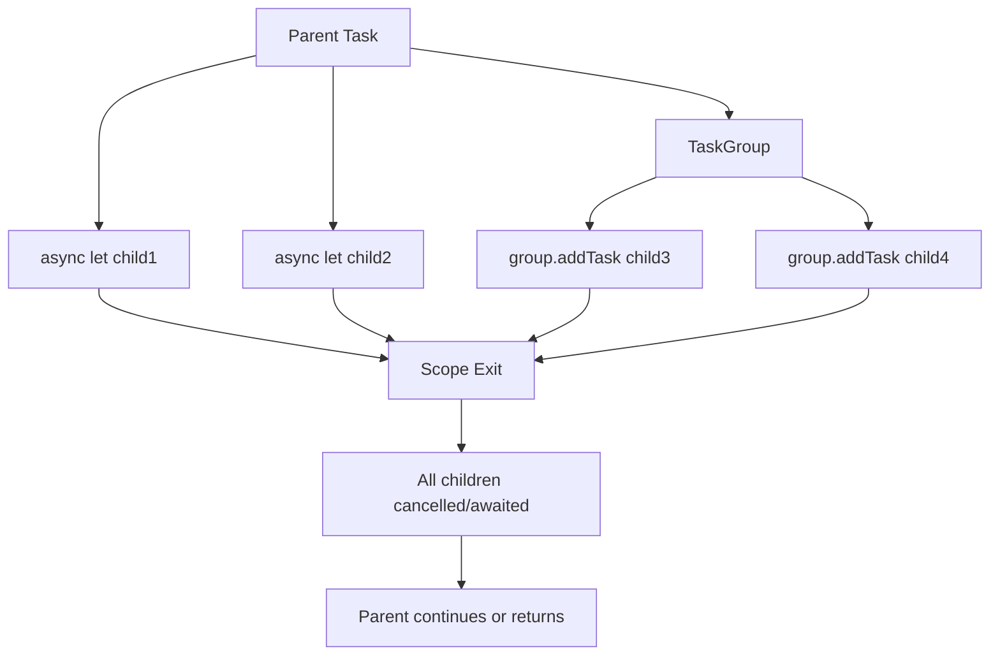

# How to Use Swift Concurrency with async/await

Author: [nawazdhandala](https://www.github.com/nawazdhandala)

Tags: Swift, iOS, Concurrency, async/await, Actors

Description: Master Swift's modern concurrency model with async/await, actors, task groups, and structured concurrency for writing safe, readable asynchronous code.

---

Swift 5.5 introduced a complete overhaul of how we write asynchronous code. Gone are the days of callback pyramids and completion handler chains. The new concurrency model brings async/await syntax, actors for safe state management, and structured concurrency that makes reasoning about concurrent code much simpler.

This guide walks through the practical aspects of Swift concurrency - from basic async functions to advanced patterns like task groups and continuations for bridging legacy APIs.

## The Basics: async and await

### Declaring Async Functions

Any function that performs asynchronous work should be marked with `async`. The compiler then ensures you handle it correctly at call sites. Unlike completion handlers, the return value comes back directly.

```swift
// An async function that fetches user data from a remote API
// The 'async' keyword indicates this function suspends while waiting for I/O
// The 'throws' keyword means it can throw errors that must be handled
func fetchUser(id: String) async throws -> User {
    let url = URL(string: "https://api.example.com/users/\(id)")!

    // URLSession.data is an async method - execution suspends here
    // until the network request completes
    let (data, response) = try await URLSession.shared.data(from: url)

    guard let httpResponse = response as? HTTPURLResponse,
          httpResponse.statusCode == 200 else {
        throw NetworkError.invalidResponse
    }

    // JSONDecoder.decode is synchronous, no await needed
    return try JSONDecoder().decode(User.self, from: data)
}
```

### Calling Async Functions

You call async functions with `await`. The current function suspends at that point, freeing the thread to do other work. When the async operation completes, execution resumes.

```swift
// Calling async functions requires an async context
// Use 'try' for throwing functions, 'await' for async functions
func loadUserProfile() async throws {
    // Execution suspends at each await point
    let user = try await fetchUser(id: "12345")
    let posts = try await fetchPosts(for: user)
    let followers = try await fetchFollowers(for: user)

    // All data is available here after the awaits complete
    updateUI(user: user, posts: posts, followers: followers)
}
```

### Sequential vs Concurrent Execution

The example above runs sequentially - each request waits for the previous one. When operations are independent, run them concurrently with `async let`.

```swift
// Sequential execution - total time is sum of all request times
// Each await blocks until that specific request completes
func loadProfileSequential() async throws -> Profile {
    let user = try await fetchUser(id: "12345")      // Wait for user
    let posts = try await fetchPosts(for: user)      // Then wait for posts
    let followers = try await fetchFollowers(for: user) // Then wait for followers
    return Profile(user: user, posts: posts, followers: followers)
}

// Concurrent execution using async let - total time is the slowest request
// All three requests start immediately and run in parallel
func loadProfileConcurrent() async throws -> Profile {
    // async let starts the task immediately without waiting
    async let user = fetchUser(id: "12345")
    async let posts = fetchUserPosts(userId: "12345")
    async let followers = fetchUserFollowers(userId: "12345")

    // await collects results - all three run concurrently
    // The function suspends until ALL async let values are ready
    return try await Profile(user: user, posts: posts, followers: followers)
}
```

## Task and TaskGroup

### Creating Tasks

`Task` creates a new unit of asynchronous work. Use it to call async code from synchronous contexts like button handlers or view lifecycle methods.

```swift
// Task creates an async context from synchronous code
// This is how you bridge from UIKit/AppKit to async/await
class ProfileViewController: UIViewController {
    private var loadTask: Task<Void, Never>?

    override func viewDidLoad() {
        super.viewDidLoad()

        // Task runs asynchronously - viewDidLoad returns immediately
        // The closure body is the async work to perform
        loadTask = Task {
            do {
                let profile = try await loadProfile()
                // Update UI with loaded data
                self.displayProfile(profile)
            } catch {
                self.showError(error)
            }
        }
    }

    override func viewDidDisappear(_ animated: Bool) {
        super.viewDidDisappear(animated)
        // Cancel the task if the view disappears before loading completes
        // Cancellation is cooperative - the task must check for it
        loadTask?.cancel()
    }
}
```

### Task Priority and Cancellation

Tasks can have priorities and support cooperative cancellation. Check `Task.isCancelled` or call `Task.checkCancellation()` at appropriate points.

```swift
// Task with explicit priority - affects scheduling but not guaranteed timing
// .userInitiated is for user-triggered actions that need quick response
let highPriorityTask = Task(priority: .userInitiated) {
    try await performImportantWork()
}

// Long-running tasks should check for cancellation periodically
// This enables responsive cancellation without leaving work half-done
func processLargeDataset(_ items: [Item]) async throws -> [ProcessedItem] {
    var results: [ProcessedItem] = []

    for item in items {
        // Check if cancellation was requested before processing each item
        // Throws CancellationError if the task was cancelled
        try Task.checkCancellation()

        let processed = await process(item)
        results.append(processed)
    }

    return results
}

// Alternative: check without throwing for custom cleanup
func processWithCleanup(_ items: [Item]) async -> [ProcessedItem] {
    var results: [ProcessedItem] = []

    for item in items {
        // Task.isCancelled is a boolean check - doesn't throw
        // Use this when you need to do cleanup before returning
        if Task.isCancelled {
            await cleanupPartialWork(results)
            return results  // Return partial results instead of throwing
        }

        let processed = await process(item)
        results.append(processed)
    }

    return results
}
```

### TaskGroup for Dynamic Concurrency

When you need to run a variable number of concurrent tasks and collect results, use `TaskGroup`. It manages child tasks and ensures all complete before continuing.

```swift
// TaskGroup runs multiple tasks concurrently and collects results
// Useful when the number of tasks is determined at runtime
func fetchAllUsers(ids: [String]) async throws -> [User] {
    // withThrowingTaskGroup creates a group that can throw errors
    // ChildTaskResult specifies the return type of each child task
    try await withThrowingTaskGroup(of: User.self) { group in
        // Add a child task for each user ID
        for id in ids {
            // addTask starts a new concurrent child task
            // All added tasks run in parallel automatically
            group.addTask {
                try await self.fetchUser(id: id)
            }
        }

        // Collect results as they complete (order not guaranteed)
        // for await iterates over completed tasks
        var users: [User] = []
        for try await user in group {
            users.append(user)
        }

        return users
    }
}
```

### Limiting Concurrency in TaskGroups

Running unlimited concurrent tasks can overwhelm resources. Limit concurrency by controlling how many tasks are active simultaneously.

```swift
// Limit concurrent tasks to avoid overwhelming the network or system
// This pattern processes items in batches of maxConcurrency
func downloadImages(urls: [URL], maxConcurrency: Int = 4) async throws -> [UIImage] {
    try await withThrowingTaskGroup(of: (Int, UIImage).self) { group in
        var results = [UIImage?](repeating: nil, count: urls.count)
        var nextIndex = 0

        // Start initial batch up to maxConcurrency
        // This seeds the group with the first N tasks
        for _ in 0..<min(maxConcurrency, urls.count) {
            let index = nextIndex
            group.addTask {
                let image = try await self.downloadImage(from: urls[index])
                return (index, image)  // Return index to maintain order
            }
            nextIndex += 1
        }

        // As each task completes, start the next one
        // This maintains constant concurrency until all URLs are processed
        for try await (index, image) in group {
            results[index] = image

            // Add next task if there are more URLs to process
            if nextIndex < urls.count {
                let newIndex = nextIndex
                group.addTask {
                    let image = try await self.downloadImage(from: urls[newIndex])
                    return (newIndex, image)
                }
                nextIndex += 1
            }
        }

        // compactMap removes any nil values (shouldn't be any in this case)
        return results.compactMap { $0 }
    }
}
```

## How Structured Concurrency Works

Swift's structured concurrency ties the lifetime of child tasks to their parent scope. When a scope exits, all child tasks are automatically cancelled and awaited. This prevents resource leaks and ensures predictable behavior.

This diagram shows how task lifetimes are scoped:



The key rules are:

1. Child tasks cannot outlive their parent scope
2. If a parent is cancelled, all children are automatically cancelled
3. A scope waits for all child tasks before exiting
4. Errors in children propagate to the parent

```swift
// Structured concurrency ensures cleanup even when errors occur
// If any fetch fails, the other tasks are cancelled automatically
func loadDashboard() async throws -> Dashboard {
    // These child tasks are bound to this function's scope
    async let stats = fetchStats()
    async let notifications = fetchNotifications()
    async let recentActivity = fetchRecentActivity()

    // If fetchStats throws, the other two are cancelled immediately
    // The function won't return until all three are resolved
    return try await Dashboard(
        stats: stats,
        notifications: notifications,
        recentActivity: recentActivity
    )
}
```

### Unstructured Tasks with Task.detached

Sometimes you need a task that outlives its creation scope. Use `Task.detached` for truly independent work, but use it sparingly since it opts out of structured concurrency benefits.

```swift
// Task.detached creates an independent task not bound to the current scope
// Use sparingly - you lose automatic cancellation propagation
func startBackgroundSync() {
    // This task runs independently of the calling function
    // It won't be cancelled when the calling function returns
    Task.detached(priority: .background) {
        await self.syncDataWithServer()
    }
}

// Prefer regular Task when possible - it inherits actor context and priority
// Regular tasks are still tied to structured concurrency
func startSync() {
    Task {
        // Inherits the current actor context (e.g., MainActor)
        // Inherits task priority from parent
        await self.syncDataWithServer()
    }
}
```

## Actors: Safe Concurrent State

Actors protect mutable state from data races. Only one task can execute actor code at a time, preventing concurrent access to the actor's properties.

```swift
// Actor protects its internal state from concurrent access
// All access is serialized - only one caller executes at a time
actor BankAccount {
    private var balance: Decimal
    private var transactionHistory: [Transaction] = []

    init(initialBalance: Decimal) {
        self.balance = initialBalance
    }

    // Methods are implicitly isolated to the actor
    // Callers must await since access may need to wait
    func deposit(_ amount: Decimal) {
        balance += amount
        transactionHistory.append(Transaction(type: .deposit, amount: amount))
    }

    func withdraw(_ amount: Decimal) throws {
        guard balance >= amount else {
            throw BankError.insufficientFunds
        }
        balance -= amount
        transactionHistory.append(Transaction(type: .withdrawal, amount: amount))
    }

    // Read-only computed property - still requires await from outside
    var currentBalance: Decimal {
        balance
    }

    // nonisolated functions don't access actor state
    // Can be called without await - useful for pure computations
    nonisolated func formatCurrency(_ amount: Decimal) -> String {
        return "$\(amount)"
    }
}

// Using the actor from outside requires await
func performTransaction() async throws {
    let account = BankAccount(initialBalance: 1000)

    // Each call awaits because the actor serializes access
    await account.deposit(500)
    try await account.withdraw(200)

    let balance = await account.currentBalance
    print("Balance: \(balance)")  // Balance: 1300
}
```

### Actor Reentrancy

Actor methods can suspend (at await points), and during suspension another task might run on the actor. This is called reentrancy and can lead to unexpected state changes.

```swift
actor ImageCache {
    private var cache: [URL: UIImage] = [:]
    private var inProgress: [URL: Task<UIImage, Error>] = [:]

    // This method handles reentrancy correctly
    // Multiple calls with the same URL share one download
    func image(for url: URL) async throws -> UIImage {
        // Check cache first - no suspension point here
        if let cached = cache[url] {
            return cached
        }

        // If already downloading, wait for that task instead of starting another
        // This prevents duplicate downloads for the same URL
        if let existingTask = inProgress[url] {
            return try await existingTask.value
        }

        // Start new download and track it
        let task = Task {
            try await downloadImage(from: url)
        }
        inProgress[url] = task

        // REENTRANCY POINT: While awaiting, other calls can enter this method
        // That's why we check inProgress above
        let image = try await task.value

        // Clean up tracking and cache the result
        // State may have changed during await - that's okay here
        inProgress[url] = nil
        cache[url] = image

        return image
    }

    private func downloadImage(from url: URL) async throws -> UIImage {
        let (data, _) = try await URLSession.shared.data(from: url)
        guard let image = UIImage(data: data) else {
            throw ImageError.invalidData
        }
        return image
    }
}
```

## MainActor: UI Thread Safety

`MainActor` is a special actor that runs on the main thread. Use it for UI updates and any code that must run on the main thread.

```swift
// @MainActor ensures all methods run on the main thread
// Perfect for view controllers and UI-related classes
@MainActor
class ProfileViewModel: ObservableObject {
    @Published var user: User?
    @Published var isLoading = false
    @Published var errorMessage: String?

    // This method runs on the main thread automatically
    // UI updates happen safely without dispatch calls
    func loadUser(id: String) async {
        isLoading = true
        errorMessage = nil

        do {
            // Network call runs on background thread
            // The result is automatically marshalled back to main thread
            user = try await fetchUser(id: id)
        } catch {
            errorMessage = error.localizedDescription
        }

        isLoading = false
    }
}

// Mark individual functions to run on main thread
// Useful when only specific methods need main thread
class DataProcessor {
    // This specific method runs on main thread
    @MainActor
    func updateUI(with results: [ProcessedItem]) {
        // Safe to update UI here
        tableView.reloadData()
    }

    func processData(_ items: [Item]) async -> [ProcessedItem] {
        // Runs on background thread
        let results = await heavyProcessing(items)

        // Explicitly switch to main thread for UI update
        await updateUI(with: results)

        return results
    }
}
```

### Isolating Properties

You can isolate specific properties to MainActor while keeping the rest of the class non-isolated.

```swift
class ImageLoader {
    // Only this property is main-actor isolated
    // Access from background requires await
    @MainActor var loadedImages: [UIImage] = []

    func loadImages(urls: [URL]) async throws {
        for url in urls {
            let image = try await downloadImage(from: url)

            // Accessing MainActor property requires await
            await MainActor.run {
                loadedImages.append(image)
            }
        }
    }
}
```

## Continuations: Bridging Callback APIs

Legacy APIs use completion handlers. Continuations bridge these to async/await, letting you wrap callback-based code in async functions.

### Basic Continuation

```swift
// Wrap a callback-based API in an async function
// withCheckedThrowingContinuation converts callbacks to async/await
func fetchUserLegacy(id: String) async throws -> User {
    // withCheckedThrowingContinuation pauses until resume is called
    // 'checked' means runtime checks catch misuse (resume called twice, etc)
    try await withCheckedThrowingContinuation { continuation in
        // Call the legacy callback-based API
        LegacyAPI.fetchUser(id: id) { result in
            switch result {
            case .success(let user):
                // Resume the async function with the success value
                continuation.resume(returning: user)
            case .failure(let error):
                // Resume the async function by throwing an error
                continuation.resume(throwing: error)
            }
        }
    }
}

// Non-throwing version for APIs that don't fail
func getCurrentLocation() async -> CLLocation {
    await withCheckedContinuation { continuation in
        locationManager.requestLocation { location in
            // resume(returning:) for successful completion
            continuation.resume(returning: location)
        }
    }
}
```

### Handling Delegate Patterns

Delegate-based APIs need more setup. Store the continuation and resume it when the delegate method fires.

```swift
// Wrapping delegate-based APIs requires storing the continuation
// Resume it when the delegate callback fires
class LocationFetcher: NSObject, CLLocationManagerDelegate {
    private var locationManager = CLLocationManager()
    private var continuation: CheckedContinuation<CLLocation, Error>?

    override init() {
        super.init()
        locationManager.delegate = self
    }

    // Async wrapper for delegate-based location API
    func fetchCurrentLocation() async throws -> CLLocation {
        try await withCheckedThrowingContinuation { continuation in
            // Store continuation to resume later in delegate method
            self.continuation = continuation
            locationManager.requestLocation()
        }
    }

    // CLLocationManagerDelegate method - called asynchronously by system
    func locationManager(_ manager: CLLocationManager, didUpdateLocations locations: [CLLocation]) {
        // Resume the waiting async function with the location
        continuation?.resume(returning: locations.first!)
        continuation = nil  // Clear to prevent accidental reuse
    }

    func locationManager(_ manager: CLLocationManager, didFailWithError error: Error) {
        // Resume by throwing the error
        continuation?.resume(throwing: error)
        continuation = nil
    }
}
```

### Unsafe Continuations

For performance-critical code where you guarantee correct usage, use unsafe continuations. They skip runtime checks but crash if misused.

```swift
// withUnsafeContinuation skips runtime safety checks
// Only use when you're certain about correct usage
// Faster than checked variants but crashes on misuse
func fastFetch() async -> Data {
    await withUnsafeContinuation { continuation in
        // CRITICAL: Must call resume exactly once
        // No call = hang forever
        // Multiple calls = undefined behavior / crash
        performFastOperation { data in
            continuation.resume(returning: data)
        }
    }
}
```

## Error Handling in Async Code

Async functions use standard Swift error handling with `try/catch`. Errors propagate naturally through the call chain.

```swift
// Define domain-specific errors with context
enum APIError: Error {
    case invalidURL
    case networkFailure(underlying: Error)
    case invalidResponse(statusCode: Int)
    case decodingFailed(underlying: Error)
}

// Async functions throw errors like any other Swift function
// Use Result type when you want to handle errors without try/catch
func fetchData(from endpoint: String) async throws -> Data {
    guard let url = URL(string: endpoint) else {
        throw APIError.invalidURL
    }

    let data: Data
    let response: URLResponse

    do {
        (data, response) = try await URLSession.shared.data(from: url)
    } catch {
        // Wrap underlying network errors with context
        throw APIError.networkFailure(underlying: error)
    }

    guard let httpResponse = response as? HTTPURLResponse else {
        throw APIError.invalidResponse(statusCode: 0)
    }

    guard (200...299).contains(httpResponse.statusCode) else {
        throw APIError.invalidResponse(statusCode: httpResponse.statusCode)
    }

    return data
}

// Handle errors at the appropriate level
func loadUserData() async {
    do {
        let data = try await fetchData(from: "https://api.example.com/user")
        let user = try JSONDecoder().decode(User.self, from: data)
        await displayUser(user)
    } catch let error as APIError {
        // Handle API-specific errors
        switch error {
        case .invalidURL:
            await showError("Invalid URL configuration")
        case .networkFailure(let underlying):
            await showError("Network error: \(underlying.localizedDescription)")
        case .invalidResponse(let code):
            await showError("Server error: \(code)")
        case .decodingFailed(let underlying):
            await showError("Data error: \(underlying.localizedDescription)")
        }
    } catch {
        // Handle unexpected errors
        await showError("Unexpected error: \(error.localizedDescription)")
    }
}
```

### Error Handling in Task Groups

In task groups, the first error cancels remaining tasks by default. Use `withThrowingTaskGroup` when errors should propagate, or handle errors within tasks to continue processing.

```swift
// First error cancels all tasks and propagates immediately
func fetchAllOrFail(ids: [String]) async throws -> [User] {
    try await withThrowingTaskGroup(of: User.self) { group in
        for id in ids {
            group.addTask {
                try await fetchUser(id: id)  // First failure cancels all
            }
        }

        var users: [User] = []
        for try await user in group {
            users.append(user)
        }
        return users
    }
}

// Handle errors per-task to get partial results
// Useful when some failures are acceptable
func fetchAllWithPartialResults(ids: [String]) async -> [Result<User, Error>] {
    await withTaskGroup(of: Result<User, Error>.self) { group in
        for id in ids {
            group.addTask {
                do {
                    let user = try await self.fetchUser(id: id)
                    return .success(user)
                } catch {
                    return .failure(error)  // Capture error, don't throw
                }
            }
        }

        var results: [Result<User, Error>] = []
        for await result in group {
            results.append(result)
        }
        return results
    }
}
```

## Common Patterns and Best Practices

### Debouncing Async Operations

Prevent rapid repeated calls from triggering multiple network requests.

```swift
actor SearchDebouncer {
    private var currentTask: Task<[SearchResult], Error>?
    private let delay: Duration

    init(delay: Duration = .milliseconds(300)) {
        self.delay = delay
    }

    // Cancel previous search and start new one after delay
    // Only the last search in a rapid series actually executes
    func search(query: String, using searcher: (String) async throws -> [SearchResult]) async throws -> [SearchResult] {
        // Cancel any in-flight search
        currentTask?.cancel()

        // Create new task with delay
        let task = Task {
            // Wait for debounce period
            try await Task.sleep(for: delay)

            // Check if we were cancelled during the delay
            try Task.checkCancellation()

            // Perform actual search
            return try await searcher(query)
        }

        currentTask = task
        return try await task.value
    }
}
```

### Retry with Exponential Backoff

Network requests can fail transiently. Retry with increasing delays.

```swift
// Retry failed operations with exponential backoff
// Useful for handling transient network failures
func fetchWithRetry<T>(
    maxAttempts: Int = 3,
    initialDelay: Duration = .seconds(1),
    operation: () async throws -> T
) async throws -> T {
    var lastError: Error?
    var currentDelay = initialDelay

    for attempt in 1...maxAttempts {
        do {
            return try await operation()
        } catch {
            lastError = error

            // Don't retry if cancelled
            if error is CancellationError {
                throw error
            }

            // Don't delay after the last attempt
            if attempt < maxAttempts {
                // Wait before retrying - delay doubles each time
                try await Task.sleep(for: currentDelay)
                currentDelay *= 2  // Exponential backoff: 1s, 2s, 4s, ...
            }
        }
    }

    throw lastError!
}

// Usage
let user = try await fetchWithRetry {
    try await fetchUser(id: "12345")
}
```

### AsyncSequence for Streaming Data

Use `AsyncSequence` for data that arrives over time.

```swift
// Custom AsyncSequence for paginated API results
// Fetches pages lazily as you iterate
struct PaginatedUsers: AsyncSequence {
    typealias Element = User
    let pageSize: Int

    struct AsyncIterator: AsyncIteratorProtocol {
        var currentPage = 0
        var currentIndex = 0
        var currentBatch: [User] = []
        var hasMore = true
        let pageSize: Int

        mutating func next() async throws -> User? {
            // Return next user from current batch if available
            if currentIndex < currentBatch.count {
                let user = currentBatch[currentIndex]
                currentIndex += 1
                return user
            }

            // No more pages to fetch
            guard hasMore else { return nil }

            // Fetch next page
            currentBatch = try await fetchUsersPage(page: currentPage, size: pageSize)
            hasMore = currentBatch.count == pageSize
            currentPage += 1
            currentIndex = 0

            return currentBatch.isEmpty ? nil : {
                let user = currentBatch[currentIndex]
                currentIndex += 1
                return user
            }()
        }
    }

    func makeAsyncIterator() -> AsyncIterator {
        AsyncIterator(pageSize: pageSize)
    }
}

// Usage - pages are fetched lazily as you iterate
for try await user in PaginatedUsers(pageSize: 20) {
    print(user.name)

    // Can break early - remaining pages aren't fetched
    if user.name == "Target User" {
        break
    }
}
```

## Summary

| Concept | Use When |
|---------|----------|
| **async/await** | Any asynchronous operation |
| **async let** | Running independent operations concurrently |
| **Task** | Starting async work from sync context |
| **TaskGroup** | Dynamic number of concurrent operations |
| **Actor** | Protecting shared mutable state |
| **MainActor** | UI updates and main-thread work |
| **Continuation** | Wrapping callback-based APIs |

Swift's concurrency model makes asynchronous code look and behave like synchronous code while providing compile-time safety guarantees. Actors eliminate data races, structured concurrency prevents resource leaks, and the whole system works together to help you write concurrent code that is both correct and easy to understand.

Start with basic async/await and gradually adopt actors and task groups as your needs grow. The compiler guides you toward correct usage, making Swift concurrency approachable even for complex concurrent systems.
