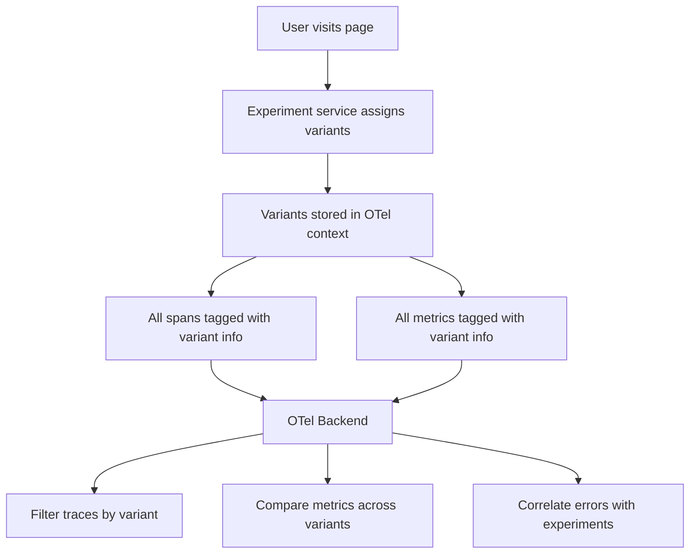

# How to Implement A/B Test Tracking with OpenTelemetry Browser SDK

Author: [nawazdhandala](https://www.github.com/nawazdhandala)

Tags: OpenTelemetry, A/B Testing, Browser SDK, Experimentation, Analytics, Frontend

Description: Learn how to use OpenTelemetry Browser SDK to instrument A/B tests with variant assignments, conversion tracking, and performance comparison across experiment groups.

---

A/B testing tools typically live in their own silo. They track variant assignments and conversions, but they have no connection to your application's performance data. When variant B increases conversion by 5% but also increases page load time by 300ms, you would never know unless you manually correlate data from two separate systems.

OpenTelemetry changes this. By attaching experiment variant information to your existing traces and metrics, you get a unified view of both user behavior and application performance. You can answer questions like: Does the new checkout flow (variant B) cause more API errors? Is the redesigned dashboard (variant C) slower to render? Do users in the control group experience fewer JavaScript exceptions?

This post walks through building A/B test instrumentation on top of the OpenTelemetry Browser SDK.

## The Architecture

The basic idea is straightforward. When a user is assigned to an experiment variant, that information gets attached to every span and metric as attributes. Your observability backend can then filter and group data by variant.



## Setting Up Experiment Management

Start with a simple experiment manager that handles variant assignment and integrates with OpenTelemetry:

```javascript
// src/experiments/experiment-manager.js
import { trace, context } from '@opentelemetry/api';
import { tracer } from '../tracing';

class ExperimentManager {
  constructor() {
    this.assignments = new Map();
    this.storageKey = 'otel_experiments';
    this._loadPersistedAssignments();
  }

  // Load previously assigned variants from localStorage
  // so users see the same variant across sessions
  _loadPersistedAssignments() {
    try {
      const stored = localStorage.getItem(this.storageKey);
      if (stored) {
        const parsed = JSON.parse(stored);
        Object.entries(parsed).forEach(([key, value]) => {
          this.assignments.set(key, value);
        });
      }
    } catch (e) {
      // localStorage might be unavailable in some contexts
    }
  }

  // Persist assignments so they survive page reloads
  _persistAssignments() {
    try {
      const obj = Object.fromEntries(this.assignments);
      localStorage.setItem(this.storageKey, JSON.stringify(obj));
    } catch (e) {
      // Silently fail if storage is full or unavailable
    }
  }

  // Assign a user to a variant using deterministic hashing
  assign(experimentId, variants, userId) {
    // Return existing assignment if already assigned
    if (this.assignments.has(experimentId)) {
      return this.assignments.get(experimentId);
    }

    // Simple hash-based assignment for consistent bucketing
    const hash = this._hashCode(`${userId}-${experimentId}`);
    const index = Math.abs(hash) % variants.length;
    const variant = variants[index];

    // Store the assignment
    this.assignments.set(experimentId, variant);
    this._persistAssignments();

    // Record the assignment as a span event
    const span = tracer.startSpan('experiment.assign', {
      attributes: {
        'experiment.id': experimentId,
        'experiment.variant': variant,
        'experiment.variant_count': variants.length,
        'user.id': userId,
      },
    });
    span.end();

    return variant;
  }

  // Get all current assignments as span attributes
  getAssignmentAttributes() {
    const attributes = {};
    this.assignments.forEach((variant, experimentId) => {
      attributes[`experiment.${experimentId}`] = variant;
    });
    return attributes;
  }

  // Simple string hash function
  _hashCode(str) {
    let hash = 0;
    for (let i = 0; i < str.length; i++) {
      const char = str.charCodeAt(i);
      hash = ((hash << 5) - hash) + char;
      hash = hash & hash; // Convert to 32-bit integer
    }
    return hash;
  }
}

// Export a singleton instance
export const experiments = new ExperimentManager();
```

The hash-based assignment ensures that the same user always gets the same variant for a given experiment. This is important for consistency. You do not want users bouncing between variants on every page load.

## Creating a Span Processor for Experiment Context

Instead of manually adding experiment attributes to every span, create a custom span processor that does it automatically:

```javascript
// src/experiments/experiment-span-processor.js
import { experiments } from './experiment-manager';

export class ExperimentSpanProcessor {
  constructor(innerProcessor) {
    this.innerProcessor = innerProcessor;
  }

  // Called when a span starts - add experiment attributes
  onStart(span, parentContext) {
    const attributes = experiments.getAssignmentAttributes();
    Object.entries(attributes).forEach(([key, value]) => {
      span.setAttribute(key, value);
    });

    this.innerProcessor.onStart(span, parentContext);
  }

  // Delegate all other methods to the inner processor
  onEnd(span) {
    this.innerProcessor.onEnd(span);
  }

  shutdown() {
    return this.innerProcessor.shutdown();
  }

  forceFlush() {
    return this.innerProcessor.forceFlush();
  }
}
```

Wire this processor into your tracer provider setup:

```javascript
// src/tracing.js
import { WebTracerProvider } from '@opentelemetry/sdk-trace-web';
import { OTLPTraceExporter } from '@opentelemetry/exporter-trace-otlp-http';
import { BatchSpanProcessor } from '@opentelemetry/sdk-trace-web';
import { ExperimentSpanProcessor } from './experiments/experiment-span-processor';
import { Resource } from '@opentelemetry/resources';
import { ATTR_SERVICE_NAME } from '@opentelemetry/semantic-conventions';
import { trace } from '@opentelemetry/api';

const provider = new WebTracerProvider({
  resource: new Resource({
    [ATTR_SERVICE_NAME]: 'my-frontend-app',
  }),
});

// Wrap the batch processor with the experiment processor
// Every span will automatically get experiment variant attributes
const batchProcessor = new BatchSpanProcessor(
  new OTLPTraceExporter({
    url: 'https://otel-collector.example.com/v1/traces',
  })
);

provider.addSpanProcessor(new ExperimentSpanProcessor(batchProcessor));
provider.register();

export const tracer = trace.getTracer('app', '1.0.0');
```

Now every span emitted by your application will carry experiment variant attributes. When you look at a trace in your backend, you can immediately see which variants the user was assigned to.

## Tracking Conversions

Conversions are the core of A/B testing. A conversion is any user action that you want to optimize for, like completing a purchase, signing up for a newsletter, or clicking a call-to-action button. Track them as spans with specific attributes:

```javascript
// src/experiments/conversion-tracker.js
import { SpanStatusCode } from '@opentelemetry/api';
import { tracer } from '../tracing';
import { experiments } from './experiment-manager';

export function trackConversion(conversionType, metadata = {}) {
  // Get the experiment assignments relevant to this conversion
  const assignments = experiments.getAssignmentAttributes();

  const span = tracer.startSpan('experiment.conversion', {
    attributes: {
      'conversion.type': conversionType,
      'conversion.timestamp': Date.now(),
      ...assignments,
      ...metadata,
    },
  });

  span.setStatus({ code: SpanStatusCode.OK });
  span.end();
}

// Track revenue-related conversions with monetary value
export function trackRevenueConversion(experimentId, amount, currency = 'USD') {
  const variant = experiments.assignments.get(experimentId);
  if (!variant) return;

  const span = tracer.startSpan('experiment.revenue', {
    attributes: {
      'experiment.id': experimentId,
      'experiment.variant': variant,
      'conversion.type': 'purchase',
      'conversion.revenue': amount,
      'conversion.currency': currency,
    },
  });
  span.end();
}
```

Use these in your application wherever conversion events happen:

```javascript
// src/pages/Checkout.jsx
import { trackConversion, trackRevenueConversion } from '../experiments/conversion-tracker';

function handlePurchaseComplete(order) {
  // Track the general conversion
  trackConversion('purchase_complete', {
    'order.item_count': order.items.length,
    'order.total': order.total,
  });

  // Track revenue specifically tied to the checkout experiment
  trackRevenueConversion('checkout-flow-v2', order.total, 'USD');
}

function handleAddToCart(product) {
  trackConversion('add_to_cart', {
    'product.id': product.id,
    'product.category': product.category,
  });
}
```

## Building Experiment-Aware Components

For React applications, create a component that handles variant rendering and automatically tracks impressions:

```javascript
// src/components/Experiment.jsx
import { useEffect, useMemo } from 'react';
import { experiments } from '../experiments/experiment-manager';
import { tracer } from '../tracing';

export function Experiment({ id, variants, userId, children }) {
  // Assign the variant once and memoize it
  const variant = useMemo(() => {
    return experiments.assign(id, Object.keys(variants), userId);
  }, [id, userId]);

  // Track an impression when the experiment renders
  useEffect(() => {
    const span = tracer.startSpan('experiment.impression', {
      attributes: {
        'experiment.id': id,
        'experiment.variant': variant,
        'experiment.page': window.location.pathname,
      },
    });
    span.end();
  }, [id, variant]);

  // Render the component for the assigned variant
  const VariantComponent = variants[variant];
  if (!VariantComponent) return null;

  return <VariantComponent />;
}
```

Use it in your pages like this:

```javascript
// src/pages/Landing.jsx
import { Experiment } from '../components/Experiment';
import { useAuth } from '../hooks/useAuth';

function HeroVariantA() {
  return <h1>Welcome to Our Platform</h1>;
}

function HeroVariantB() {
  return <h1>Start Building Today</h1>;
}

function HeroVariantC() {
  return <h1>Join 10,000+ Teams</h1>;
}

export function Landing() {
  const { user } = useAuth();

  return (
    <div>
      <Experiment
        id="landing-hero-text"
        userId={user.id}
        variants={{
          control: HeroVariantA,
          action_oriented: HeroVariantB,
          social_proof: HeroVariantC,
        }}
      />
    </div>
  );
}
```

## Comparing Performance Across Variants

One of the biggest advantages of using OpenTelemetry for A/B testing is the ability to compare performance metrics across variants. Add performance tracking to your variant components:

```javascript
// src/experiments/performance-comparison.js
import { tracer } from '../tracing';
import { experiments } from './experiment-manager';

export function measureVariantPerformance(experimentId, metricName) {
  const variant = experiments.assignments.get(experimentId);
  const startTime = performance.now();

  // Return a function to call when the measured operation completes
  return function end(additionalAttributes = {}) {
    const duration = performance.now() - startTime;

    const span = tracer.startSpan('experiment.performance', {
      attributes: {
        'experiment.id': experimentId,
        'experiment.variant': variant,
        'performance.metric': metricName,
        'performance.duration_ms': duration,
        ...additionalAttributes,
      },
    });
    span.end();
  };
}
```

Use this to measure how different variants affect specific performance characteristics:

```javascript
// src/pages/CheckoutVariantB.jsx
import { useEffect } from 'react';
import { measureVariantPerformance } from '../experiments/performance-comparison';

export function CheckoutVariantB() {
  useEffect(() => {
    // Start measuring when the component mounts
    const endMeasure = measureVariantPerformance(
      'checkout-flow-v2',
      'time_to_interactive'
    );

    // End measurement when all interactive elements are ready
    requestAnimationFrame(() => {
      requestAnimationFrame(() => {
        endMeasure({ 'component.name': 'CheckoutVariantB' });
      });
    });
  }, []);

  return (
    <div>
      {/* New streamlined checkout UI */}
    </div>
  );
}
```

## Analyzing Results in Your Backend

With all spans tagged with experiment attributes, you can run queries against your observability backend to answer key questions:

**Conversion rate by variant**: Count `experiment.conversion` spans grouped by `experiment.variant` for a specific `experiment.id`. Divide by `experiment.impression` count to get the conversion rate.

**Performance comparison**: Average the `performance.duration_ms` from `experiment.performance` spans, grouped by variant. This tells you if one variant is significantly faster or slower than others.

**Error rate by variant**: Count spans with error status, grouped by experiment variant. If variant B has a higher error rate, the new code might have a bug.

**Revenue per variant**: Sum the `conversion.revenue` attribute from `experiment.revenue` spans, grouped by variant. This is the ultimate metric for e-commerce experiments.

## Controlling Sample Size and Statistical Significance

OpenTelemetry gives you the raw data, but you still need to apply proper statistical methods to draw conclusions. Here is a utility that tracks whether an experiment has enough data:

```javascript
// src/experiments/sample-tracker.js
import { tracer } from '../tracing';

export function checkSampleSize(experimentId, minSamplesPerVariant = 1000) {
  const span = tracer.startSpan('experiment.sample_check', {
    attributes: {
      'experiment.id': experimentId,
      'experiment.min_samples_required': minSamplesPerVariant,
    },
  });

  // This would normally query your analytics backend
  // Here we track the check itself as an event
  span.addEvent('sample_size_check', {
    'experiment.id': experimentId,
    'check.timestamp': Date.now(),
  });

  span.end();
}
```

Do not call an experiment based on a few hundred impressions. Statistical significance requires enough samples in each variant group. The exact number depends on your expected effect size and baseline conversion rate, but 1,000 per variant is a reasonable starting point for most web experiments.

## Wrapping Up

Using OpenTelemetry for A/B test tracking gives you something that standalone experimentation platforms cannot: a direct connection between experiment variants and application performance. Every trace, every error, and every metric carries the experiment context.

This approach does not replace your statistics engine. You still need proper hypothesis testing and significance calculations. What it does is enrich your experiment data with the full depth of your observability stack. When variant B wins on conversions but causes 20% more JavaScript errors, you will catch it before rolling out to all users. That combination of experimentation and observability is what makes shipping with confidence possible.
