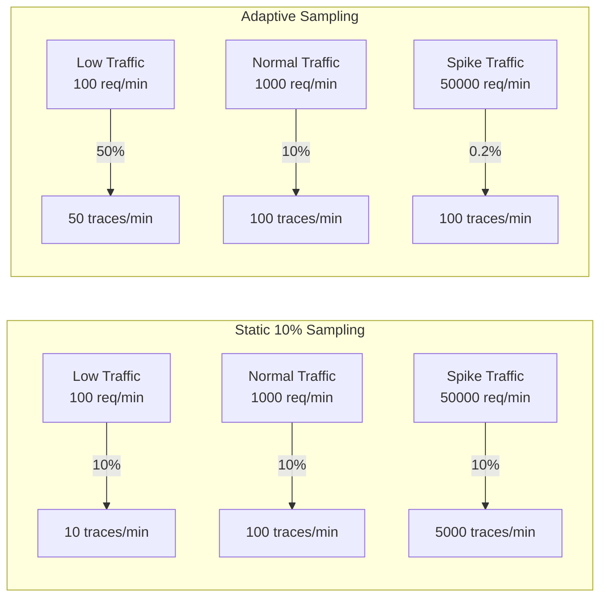

# How to Set Up Adaptive Sampling That Adjusts to Traffic Volume

Author: [nawazdhandala](https://www.github.com/nawazdhandala)

Tags: OpenTelemetry, Adaptive Sampling, Tracing, Traffic Management, Observability, Auto-Scaling

Description: Learn how to implement adaptive sampling in OpenTelemetry that automatically adjusts trace sampling rates based on real-time traffic volume.

---

Static sampling rates break down when traffic patterns change. A 10% sampling rate that works perfectly during normal business hours becomes a fire hose during a traffic spike and a trickle during off-peak hours. During a Black Friday surge, 10% of a million requests per minute still sends 100,000 traces per minute to your backend. During a quiet Sunday morning, 10% of 100 requests per minute gives you just 10 traces, barely enough to notice if something goes wrong. Adaptive sampling solves this by automatically adjusting the sampling rate to maintain a consistent volume of trace data regardless of traffic fluctuations.

## The Core Idea Behind Adaptive Sampling

Adaptive sampling targets a fixed number of traces per time window rather than a fixed percentage. If you want roughly 100 traces per minute, the system calculates the appropriate sampling rate based on current traffic. High traffic means a lower percentage. Low traffic means a higher percentage. The trace volume your backend receives stays roughly constant.



The adaptive approach keeps your tracing costs predictable and ensures you always have enough data for meaningful analysis, whether you are handling ten requests or ten thousand.

## Implementing an Adaptive Sampler in Python

The OpenTelemetry SDK does not include a built-in adaptive sampler, but building one is straightforward. The core mechanism is a feedback loop that counts recent requests and adjusts the sampling probability accordingly.

```python
import threading
import time
from opentelemetry import trace
from opentelemetry.sdk.trace import TracerProvider
from opentelemetry.sdk.trace.sampling import (
    Sampler,
    SamplingResult,
    Decision,
)
from opentelemetry.sdk.trace.export import BatchSpanProcessor
from opentelemetry.exporter.otlp.proto.grpc.trace_exporter import (
    OTLPSpanExporter,
)

class AdaptiveSampler(Sampler):
    """
    Adjusts sampling rate to maintain a target number
    of traces per second.
    """

    def __init__(self, target_traces_per_second=50,
                 adjustment_interval=10,
                 min_rate=0.001, max_rate=1.0):
        self.target_tps = target_traces_per_second
        self.adjustment_interval = adjustment_interval
        self.min_rate = min_rate
        self.max_rate = max_rate

        # Current sampling probability
        self.current_rate = 0.5
        # Request counter for the current window
        self.request_count = 0
        self.lock = threading.Lock()

        # Start the background adjustment thread
        self._start_adjuster()

    def _start_adjuster(self):
        def adjust_loop():
            while True:
                time.sleep(self.adjustment_interval)
                with self.lock:
                    if self.request_count > 0:
                        # Calculate actual requests per second
                        actual_rps = (
                            self.request_count
                            / self.adjustment_interval
                        )
                        # Calculate the rate needed to hit
                        # our target traces per second
                        desired_rate = (
                            self.target_tps / actual_rps
                        )
                        # Clamp to min/max bounds
                        self.current_rate = max(
                            self.min_rate,
                            min(self.max_rate, desired_rate),
                        )
                    # Reset counter for next window
                    self.request_count = 0

        thread = threading.Thread(
            target=adjust_loop, daemon=True
        )
        thread.start()

    def should_sample(self, parent_context, trace_id,
                      name, kind=None, attributes=None,
                      links=None):
        import random

        with self.lock:
            self.request_count += 1
            rate = self.current_rate

        if random.random() < rate:
            return SamplingResult(
                Decision.RECORD_AND_SAMPLE,
                attributes=attributes,
            )
        return SamplingResult(Decision.DROP)

    def get_description(self):
        return (
            f"AdaptiveSampler(target={self.target_tps}/s, "
            f"current_rate={self.current_rate:.4f})"
        )

# Target 50 traces per second regardless of traffic
sampler = AdaptiveSampler(
    target_traces_per_second=50,
    adjustment_interval=10,
    min_rate=0.001,
    max_rate=1.0,
)

provider = TracerProvider(sampler=sampler)
exporter = OTLPSpanExporter(endpoint="http://localhost:4317")
provider.add_span_processor(BatchSpanProcessor(exporter))
trace.set_tracer_provider(provider)
```

The sampler counts requests over a 10-second window, then calculates what sampling rate would have produced the target number of traces. It applies that rate for the next window. The `min_rate` prevents the sampler from dropping to zero during extreme spikes, and the `max_rate` caps it at 100% during quiet periods.

The adjustment is intentionally lagged by one window. This means the first window after a traffic change will be slightly off-target, but the system converges quickly. For most workloads, this lag is insignificant.

## Adaptive Sampling with Exponential Moving Average

The simple windowed approach can oscillate when traffic is bursty. A smoother alternative uses an exponential moving average (EMA) to estimate traffic volume, which dampens sudden fluctuations.

```python
import threading
import time
import random
from opentelemetry.sdk.trace.sampling import (
    Sampler,
    SamplingResult,
    Decision,
)

class SmoothAdaptiveSampler(Sampler):
    """
    Uses an exponential moving average for smoother
    rate adjustments during bursty traffic.
    """

    def __init__(self, target_tps=50, alpha=0.3,
                 min_rate=0.001, max_rate=1.0):
        self.target_tps = target_tps
        # EMA smoothing factor (0-1)
        # Lower values mean smoother but slower adaptation
        self.alpha = alpha
        self.min_rate = min_rate
        self.max_rate = max_rate

        self.current_rate = 0.5
        self.ema_rps = None
        self.request_count = 0
        self.last_update = time.monotonic()
        self.lock = threading.Lock()

        self._start_adjuster()

    def _start_adjuster(self):
        def adjust_loop():
            while True:
                time.sleep(5)
                with self.lock:
                    now = time.monotonic()
                    elapsed = now - self.last_update
                    if elapsed > 0 and self.request_count > 0:
                        # Calculate current requests per second
                        current_rps = (
                            self.request_count / elapsed
                        )
                        # Update exponential moving average
                        if self.ema_rps is None:
                            self.ema_rps = current_rps
                        else:
                            self.ema_rps = (
                                self.alpha * current_rps
                                + (1 - self.alpha) * self.ema_rps
                            )
                        # Calculate rate from smoothed estimate
                        desired = self.target_tps / self.ema_rps
                        self.current_rate = max(
                            self.min_rate,
                            min(self.max_rate, desired),
                        )
                    self.request_count = 0
                    self.last_update = now

        thread = threading.Thread(
            target=adjust_loop, daemon=True
        )
        thread.start()

    def should_sample(self, parent_context, trace_id,
                      name, kind=None, attributes=None,
                      links=None):
        with self.lock:
            self.request_count += 1
            rate = self.current_rate

        if random.random() < rate:
            return SamplingResult(
                Decision.RECORD_AND_SAMPLE,
                attributes=attributes,
            )
        return SamplingResult(Decision.DROP)

    def get_description(self):
        return (
            f"SmoothAdaptiveSampler(target={self.target_tps}/s, "
            f"ema_rps={self.ema_rps}, "
            f"current_rate={self.current_rate:.4f})"
        )
```

The `alpha` parameter controls how quickly the EMA responds to traffic changes. An alpha of 0.3 means 30% of the estimate comes from the current measurement and 70% from the historical average. For traffic that changes gradually (like daily patterns), use a lower alpha around 0.1. For traffic that spikes suddenly (like flash sales), use a higher alpha around 0.5.

## Collector-Based Adaptive Sampling

If you prefer to keep sampling logic out of your application code, you can implement adaptive behavior in the OpenTelemetry Collector. While there is no built-in adaptive sampler processor, you can approximate it by combining the probabilistic sampler with the collector's metrics and a configuration management system.

```yaml
# collector-config.yaml
# Base configuration with externalized sampling rate

receivers:
  otlp:
    protocols:
      grpc:
        endpoint: 0.0.0.0:4317

processors:
  # The sampling rate is read from an environment variable
  # which can be updated by an external controller
  probabilistic_sampler:
    sampling_percentage: ${SAMPLING_RATE}

  batch:
    timeout: 5s
    send_batch_size: 512

exporters:
  otlp:
    endpoint: https://otel.oneuptime.com:4317

service:
  pipelines:
    traces:
      receivers: [otlp]
      processors: [probabilistic_sampler, batch]
      exporters: [otlp]
```

An external controller script monitors traffic and updates the sampling rate:

```python
#!/usr/bin/env python3
"""
External controller that monitors collector metrics
and adjusts the sampling rate by reloading config.
"""

import requests
import time
import subprocess
import json

TARGET_TRACES_PER_SECOND = 100
COLLECTOR_METRICS_URL = "http://localhost:8888/metrics"
CONFIG_PATH = "/etc/otel/collector-config.yaml"
MIN_RATE = 0.1
MAX_RATE = 100.0

def get_current_throughput():
    """Query the collector's Prometheus metrics endpoint
    to get the current span receive rate."""
    resp = requests.get(COLLECTOR_METRICS_URL)
    # Parse the otelcol_receiver_accepted_spans metric
    for line in resp.text.split("\n"):
        if "otelcol_receiver_accepted_spans" in line:
            if not line.startswith("#"):
                # Extract the counter value
                parts = line.split()
                if len(parts) >= 2:
                    return float(parts[1])
    return 0

def calculate_sampling_rate(current_tps):
    """Calculate the sampling percentage to hit
    our target traces per second."""
    if current_tps == 0:
        return MAX_RATE
    desired = (TARGET_TRACES_PER_SECOND / current_tps) * 100
    return max(MIN_RATE, min(MAX_RATE, desired))

def update_collector_config(new_rate):
    """Update the environment variable and signal
    the collector to reload its configuration."""
    # Write the new rate to an env file
    with open("/etc/otel/sampling.env", "w") as f:
        f.write(f"SAMPLING_RATE={new_rate:.2f}\n")
    # Signal the collector to reload config
    subprocess.run(
        ["kill", "-SIGHUP", "$(pidof otelcol)"],
        shell=True,
    )

prev_total = 0
while True:
    time.sleep(30)
    current_total = get_current_throughput()
    # Calculate per-second rate from counter delta
    spans_per_second = (current_total - prev_total) / 30
    prev_total = current_total

    new_rate = calculate_sampling_rate(spans_per_second)
    update_collector_config(new_rate)
    print(
        f"Traffic: {spans_per_second:.0f} spans/s, "
        f"New rate: {new_rate:.2f}%"
    )
```

This controller queries the collector's metrics every 30 seconds, calculates what sampling percentage would hit the target, and updates the configuration. The collector picks up the new rate on config reload.

## Kubernetes-Native Adaptive Sampling

In Kubernetes environments, you can use a more elegant approach with a ConfigMap and a sidecar that adjusts the sampling configuration dynamically.

```yaml
# configmap.yaml
apiVersion: v1
kind: ConfigMap
metadata:
  name: otel-sampling-config
  namespace: monitoring
data:
  sampling-rate: "10"
---
# deployment.yaml with adaptive controller sidecar
apiVersion: apps/v1
kind: Deployment
metadata:
  name: otel-collector
  namespace: monitoring
spec:
  replicas: 3
  template:
    spec:
      containers:
        # Main collector container
        - name: collector
          image: otel/opentelemetry-collector-contrib:latest
          args: ["--config=/etc/otel/config.yaml"]
          volumeMounts:
            - name: config
              mountPath: /etc/otel
          env:
            - name: SAMPLING_RATE
              valueFrom:
                configMapKeyRef:
                  name: otel-sampling-config
                  key: sampling-rate
          ports:
            - containerPort: 4317
            - containerPort: 8888

        # Sidecar that monitors and adjusts sampling
        - name: sampling-controller
          image: python:3.12-slim
          command: ["python", "/scripts/adaptive.py"]
          volumeMounts:
            - name: scripts
              mountPath: /scripts
          env:
            - name: TARGET_TPS
              value: "100"
            - name: METRICS_URL
              value: "http://localhost:8888/metrics"
      volumes:
        - name: config
          configMap:
            name: otel-collector-config
        - name: scripts
          configMap:
            name: sampling-controller-scripts
```

The sidecar container runs alongside the collector, monitoring its metrics endpoint and patching the ConfigMap when rates need adjustment. This keeps the adaptive logic decoupled from both the application and the collector.

## Parent-Based Adaptive Sampling

Adaptive sampling works best when combined with parent-based sampling. The adaptive rate applies only to root spans (new traces), while child spans follow the parent decision. This prevents trace fragmentation that would occur if each service independently adapted its rate.

```python
from opentelemetry.sdk.trace.sampling import ParentBased

# Wrap the adaptive sampler with parent-based logic
# Root spans get adaptive sampling
# Child spans follow the parent decision
adaptive_root = AdaptiveSampler(
    target_traces_per_second=50,
    adjustment_interval=10,
)

sampler = ParentBased(root=adaptive_root)
```

This is a critical detail. Without the `ParentBased` wrapper, each service in a call chain independently adjusts its rate, and they will almost certainly disagree, producing fragmented traces. With the wrapper, only the entry-point service's adaptive rate matters, and all downstream services honor its decision.

## Monitoring Your Adaptive Sampler

Expose the adaptive sampler's internal state as metrics so you can observe how it responds to traffic changes over time.

```python
from opentelemetry import metrics

meter = metrics.get_meter("adaptive-sampling-monitor")

# Gauge for the current sampling rate
sampling_rate_gauge = meter.create_observable_gauge(
    "sampling.adaptive.current_rate",
    description="Current adaptive sampling rate",
)

# Counter for total sampling decisions
sampling_decisions = meter.create_counter(
    "sampling.adaptive.decisions",
    description="Sampling decisions by outcome",
)

def observe_rate(options):
    # Report the current rate so you can graph it
    yield metrics.Observation(
        value=sampler.current_rate,
        attributes={"sampler": "adaptive"},
    )

sampling_rate_gauge = meter.create_observable_gauge(
    "sampling.adaptive.current_rate",
    callbacks=[observe_rate],
    description="Current adaptive sampling rate",
)
```

Graphing the `sampling.adaptive.current_rate` metric alongside your request volume creates a clear picture of how the sampler responds to traffic changes. You should see the rate decrease when traffic spikes and increase when traffic drops, with the overall trace volume remaining relatively flat.

## Wrapping Up

Adaptive sampling gives you predictable tracing costs and consistent observability regardless of traffic volume. The core mechanism is simple: count requests, calculate the rate that would produce your target trace volume, and apply it. Whether you implement this in application code with a custom sampler, at the collector level with an external controller, or through Kubernetes-native tooling, the result is the same. You always have enough traces to debug problems without drowning in data during traffic spikes. Start with the in-process Python sampler for development, and move to the collector-based approach for production where you want centralized control across multiple services.
