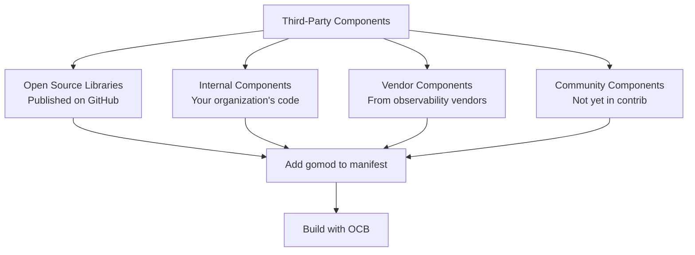
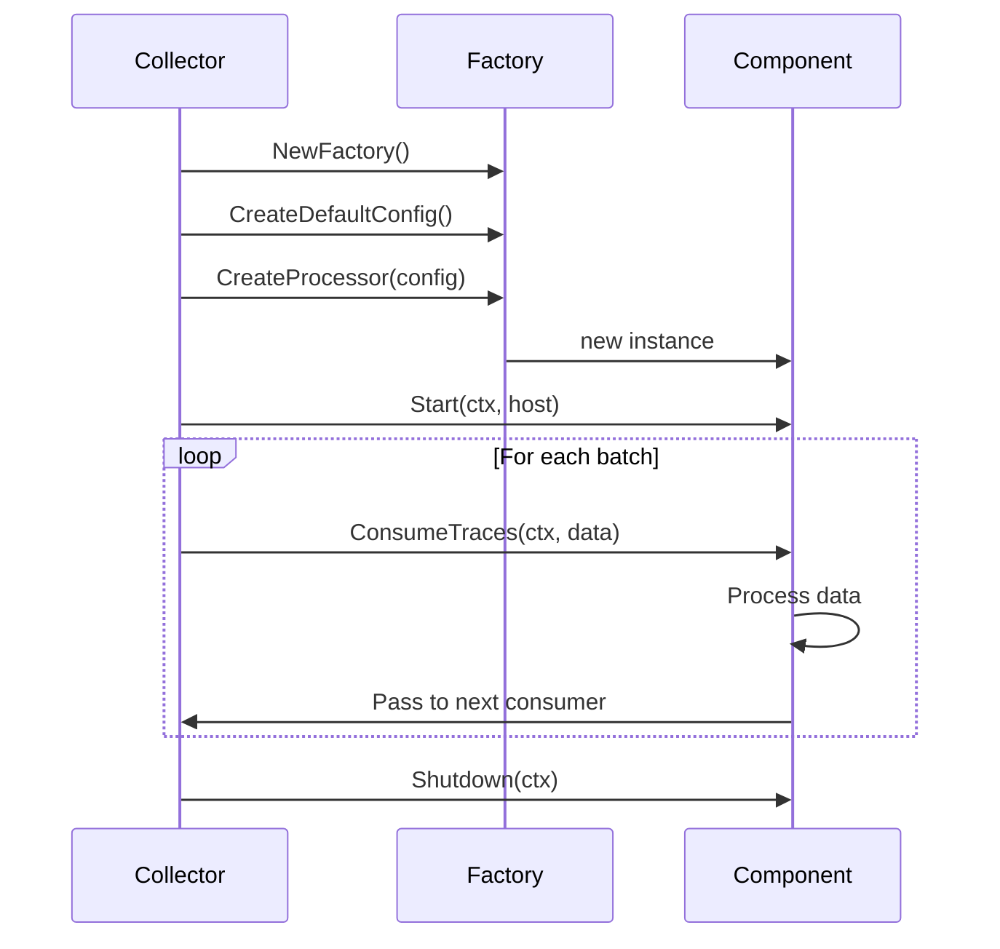

# How to Add Third-Party Components to Your Custom Collector Build

Author: [nawazdhandala](https://www.github.com/nawazdhandala)

Tags: OpenTelemetry, Collector, Third-Party, Custom Components, Go

Description: Step-by-step guide to integrating third-party and custom-built components into your OpenTelemetry Collector distribution using the builder tool.

---

The official OpenTelemetry Collector repositories cover a lot of ground, but sometimes you need something they do not offer. Maybe you need a receiver for a proprietary protocol, an exporter for an internal system, or a processor that applies your company's specific data transformation rules. This post walks through adding third-party and custom components to your collector build.

## Where Third-Party Components Come From

Third-party components can come from several sources:



## Adding a Published Third-Party Component

The simplest case is adding a component that is already published as a Go module. You just add it to your manifest.

Here is an example adding a hypothetical third-party S3 exporter:

```yaml
# manifest.yaml
dist:
  name: otelcol-custom
  output_path: ./dist
  otelcol_version: "0.96.0"
  module: github.com/myorg/otelcol-custom

receivers:
  - gomod: go.opentelemetry.io/collector/receiver/otlpreceiver v0.96.0

processors:
  - gomod: go.opentelemetry.io/collector/processor/batchprocessor v0.96.0

exporters:
  - gomod: go.opentelemetry.io/collector/exporter/otlpexporter v0.96.0
  # Third-party S3 exporter from an external repository
  - gomod: github.com/somevendor/otel-s3-exporter v1.2.0

extensions:
  - gomod: github.com/open-telemetry/opentelemetry-collector-contrib/extension/healthcheckextension v0.96.0
```

Build as usual:

```bash
# Build the collector with the third-party component included
builder --config manifest.yaml
```

## Building a Custom Component from Scratch

When no existing component fits your needs, you can write your own. Let's build a simple custom processor that adds a timestamp attribute to every span.

### Project Structure

```
my-collector/
  manifest.yaml
  config.yaml
  custom-processor/
    go.mod
    go.sum
    factory.go
    processor.go
    config.go
```

### Step 1: Initialize the Go Module

```bash
# Create the custom processor directory and initialize the Go module
mkdir -p custom-processor
cd custom-processor
go mod init github.com/myorg/custom-processor
```

### Step 2: Define the Configuration

The config struct defines what users can set in their collector config:

```go
// config.go
// Defines the configuration options for our custom processor.
package customprocessor

// Config holds the configuration for the custom timestamp processor.
// Users set these fields in the collector's config.yaml file.
type Config struct {
	// AttributeName is the name of the attribute that will hold the timestamp.
	// Defaults to "processing.timestamp" if not specified.
	AttributeName string `mapstructure:"attribute_name"`

	// Format is the time format string for the timestamp.
	// Uses Go time formatting. Defaults to RFC3339.
	Format string `mapstructure:"format"`
}

// Validate checks that the configuration is valid.
func (cfg *Config) Validate() error {
	if cfg.AttributeName == "" {
		cfg.AttributeName = "processing.timestamp"
	}
	if cfg.Format == "" {
		cfg.Format = "2006-01-02T15:04:05Z07:00"
	}
	return nil
}
```

### Step 3: Implement the Factory

The factory creates instances of the processor:

```go
// factory.go
// Factory creates new instances of the custom timestamp processor.
package customprocessor

import (
	"context"

	"go.opentelemetry.io/collector/component"
	"go.opentelemetry.io/collector/consumer"
	"go.opentelemetry.io/collector/processor"
)

const (
	// typeStr is the identifier for this processor in config files
	typeStr = "custom_timestamp"
)

// NewFactory creates a new factory for the custom timestamp processor.
// This is the entry point that OCB uses to register the component.
func NewFactory() processor.Factory {
	return processor.NewFactory(
		component.MustNewType(typeStr),
		createDefaultConfig,
		processor.WithTraces(createTracesProcessor, component.StabilityLevelAlpha),
		processor.WithMetrics(createMetricsProcessor, component.StabilityLevelAlpha),
		processor.WithLogs(createLogsProcessor, component.StabilityLevelAlpha),
	)
}

// createDefaultConfig returns a Config struct with sensible defaults.
func createDefaultConfig() component.Config {
	return &Config{
		AttributeName: "processing.timestamp",
		Format:        "2006-01-02T15:04:05Z07:00",
	}
}

// createTracesProcessor creates the processor for trace data.
func createTracesProcessor(
	ctx context.Context,
	set processor.Settings,
	cfg component.Config,
	nextConsumer consumer.Traces,
) (processor.Traces, error) {
	processorCfg := cfg.(*Config)
	return newTimestampProcessor(set.Logger, processorCfg, nextConsumer), nil
}

// createMetricsProcessor creates the processor for metric data.
func createMetricsProcessor(
	ctx context.Context,
	set processor.Settings,
	cfg component.Config,
	nextConsumer consumer.Metrics,
) (processor.Metrics, error) {
	processorCfg := cfg.(*Config)
	return newTimestampMetricsProcessor(set.Logger, processorCfg, nextConsumer), nil
}

// createLogsProcessor creates the processor for log data.
func createLogsProcessor(
	ctx context.Context,
	set processor.Settings,
	cfg component.Config,
	nextConsumer consumer.Logs,
) (processor.Logs, error) {
	processorCfg := cfg.(*Config)
	return newTimestampLogsProcessor(set.Logger, processorCfg, nextConsumer), nil
}
```

### Step 4: Implement the Processor Logic

```go
// processor.go
// The actual processing logic that adds timestamps to telemetry data.
package customprocessor

import (
	"context"
	"time"

	"go.opentelemetry.io/collector/consumer"
	"go.opentelemetry.io/collector/pdata/pcommon"
	"go.opentelemetry.io/collector/pdata/plog"
	"go.opentelemetry.io/collector/pdata/pmetric"
	"go.opentelemetry.io/collector/pdata/ptrace"
	"go.uber.org/zap"
)

// timestampProcessor adds a processing timestamp to trace spans.
type timestampProcessor struct {
	logger        *zap.Logger
	config        *Config
	nextConsumer  consumer.Traces
}

// newTimestampProcessor creates a new instance of the processor.
func newTimestampProcessor(
	logger *zap.Logger,
	config *Config,
	next consumer.Traces,
) *timestampProcessor {
	return &timestampProcessor{
		logger:       logger,
		config:       config,
		nextConsumer: next,
	}
}

// Capabilities returns the consumer capabilities.
// We mutate data by adding attributes.
func (p *timestampProcessor) Capabilities() consumer.Capabilities {
	return consumer.Capabilities{MutatesData: true}
}

// Start is called when the collector starts. Nothing to do for this processor.
func (p *timestampProcessor) Start(_ context.Context, _ component.Host) error {
	return nil
}

// Shutdown is called when the collector stops. Nothing to clean up.
func (p *timestampProcessor) Shutdown(_ context.Context) error {
	return nil
}

// ConsumeTraces processes trace data by adding a timestamp attribute to every span.
func (p *timestampProcessor) ConsumeTraces(ctx context.Context, td ptrace.Traces) error {
	// Get the current timestamp formatted according to the config
	timestamp := time.Now().UTC().Format(p.config.Format)

	// Walk through all spans and add the timestamp attribute
	resourceSpans := td.ResourceSpans()
	for i := 0; i < resourceSpans.Len(); i++ {
		scopeSpans := resourceSpans.At(i).ScopeSpans()
		for j := 0; j < scopeSpans.Len(); j++ {
			spans := scopeSpans.At(j).Spans()
			for k := 0; k < spans.Len(); k++ {
				span := spans.At(k)
				span.Attributes().PutStr(p.config.AttributeName, timestamp)
			}
		}
	}

	// Pass the modified data to the next consumer in the pipeline
	return p.nextConsumer.ConsumeTraces(ctx, td)
}

// timestampMetricsProcessor handles metric data.
type timestampMetricsProcessor struct {
	logger       *zap.Logger
	config       *Config
	nextConsumer consumer.Metrics
}

func newTimestampMetricsProcessor(
	logger *zap.Logger,
	config *Config,
	next consumer.Metrics,
) *timestampMetricsProcessor {
	return &timestampMetricsProcessor{
		logger:       logger,
		config:       config,
		nextConsumer: next,
	}
}

func (p *timestampMetricsProcessor) Capabilities() consumer.Capabilities {
	return consumer.Capabilities{MutatesData: true}
}

func (p *timestampMetricsProcessor) Start(_ context.Context, _ component.Host) error {
	return nil
}

func (p *timestampMetricsProcessor) Shutdown(_ context.Context) error {
	return nil
}

func (p *timestampMetricsProcessor) ConsumeMetrics(ctx context.Context, md pmetric.Metrics) error {
	// Add timestamp to resource attributes for metrics
	timestamp := time.Now().UTC().Format(p.config.Format)
	resourceMetrics := md.ResourceMetrics()
	for i := 0; i < resourceMetrics.Len(); i++ {
		resourceMetrics.At(i).Resource().Attributes().PutStr(p.config.AttributeName, timestamp)
	}
	return p.nextConsumer.ConsumeMetrics(ctx, md)
}

// timestampLogsProcessor handles log data.
type timestampLogsProcessor struct {
	logger       *zap.Logger
	config       *Config
	nextConsumer consumer.Logs
}

func newTimestampLogsProcessor(
	logger *zap.Logger,
	config *Config,
	next consumer.Logs,
) *timestampLogsProcessor {
	return &timestampLogsProcessor{
		logger:       logger,
		config:       config,
		nextConsumer: next,
	}
}

func (p *timestampLogsProcessor) Capabilities() consumer.Capabilities {
	return consumer.Capabilities{MutatesData: true}
}

func (p *timestampLogsProcessor) Start(_ context.Context, _ component.Host) error {
	return nil
}

func (p *timestampLogsProcessor) Shutdown(_ context.Context) error {
	return nil
}

func (p *timestampLogsProcessor) ConsumeLogs(ctx context.Context, ld plog.Logs) error {
	timestamp := time.Now().UTC().Format(p.config.Format)
	resourceLogs := ld.ResourceLogs()
	for i := 0; i < resourceLogs.Len(); i++ {
		scopeLogs := resourceLogs.At(i).ScopeLogs()
		for j := 0; j < scopeLogs.Len(); j++ {
			logs := scopeLogs.At(j).LogRecords()
			for k := 0; k < logs.Len(); k++ {
				logs.At(k).Attributes().PutStr(p.config.AttributeName, timestamp)
			}
		}
	}
	return p.nextConsumer.ConsumeLogs(ctx, ld)
}
```

### Step 5: Add the Custom Component to the Manifest

Use the `replaces` directive to point to your local source:

```yaml
# manifest.yaml
dist:
  name: otelcol-custom
  output_path: ./dist
  otelcol_version: "0.96.0"
  module: github.com/myorg/otelcol-custom

receivers:
  - gomod: go.opentelemetry.io/collector/receiver/otlpreceiver v0.96.0

processors:
  - gomod: go.opentelemetry.io/collector/processor/batchprocessor v0.96.0
  # Our custom timestamp processor
  - gomod: github.com/myorg/custom-processor v0.0.0

exporters:
  - gomod: go.opentelemetry.io/collector/exporter/otlpexporter v0.96.0
  - gomod: go.opentelemetry.io/collector/exporter/debugexporter v0.96.0

# Tell the Go module system to use the local directory
# instead of fetching from a remote registry
replaces:
  - github.com/myorg/custom-processor => ./custom-processor
```

### Step 6: Use It in Your Collector Config

```yaml
# config.yaml
receivers:
  otlp:
    protocols:
      grpc:
        endpoint: "0.0.0.0:4317"

processors:
  batch:
    timeout: 5s

  # Use our custom processor with its configuration options
  custom_timestamp:
    attribute_name: "collector.processed_at"
    format: "2006-01-02T15:04:05.000Z"

exporters:
  debug:
    verbosity: detailed

service:
  pipelines:
    traces:
      receivers: [otlp]
      processors: [custom_timestamp, batch]
      exporters: [debug]
```

## Component Lifecycle

Understanding the component lifecycle helps when building third-party components:



## Mixing Multiple Third-Party Sources

You can combine components from different sources in a single manifest:

```yaml
# manifest.yaml
# Combining components from core, contrib, vendor, and internal sources
dist:
  name: otelcol-enterprise
  output_path: ./dist
  otelcol_version: "0.96.0"
  module: github.com/myorg/otelcol-enterprise

receivers:
  # Core component
  - gomod: go.opentelemetry.io/collector/receiver/otlpreceiver v0.96.0
  # Contrib component
  - gomod: github.com/open-telemetry/opentelemetry-collector-contrib/receiver/kafkareceiver v0.96.0
  # Internal custom receiver for a proprietary protocol
  - gomod: github.com/myorg/proprietary-receiver v0.0.0

processors:
  - gomod: go.opentelemetry.io/collector/processor/batchprocessor v0.96.0
  # Third-party vendor processor
  - gomod: github.com/somevendor/otel-enrichment-processor v2.1.0
  # Internal custom processor
  - gomod: github.com/myorg/custom-processor v0.0.0

exporters:
  - gomod: go.opentelemetry.io/collector/exporter/otlpexporter v0.96.0
  # Third-party vendor exporter
  - gomod: github.com/somevendor/otel-s3-exporter v1.2.0

# Local replacements for internal components
replaces:
  - github.com/myorg/proprietary-receiver => ./components/proprietary-receiver
  - github.com/myorg/custom-processor => ./components/custom-processor
```

## Validating Third-Party Components

Before adding any third-party component, verify it is compatible:

```bash
#!/bin/bash
# validate-component.sh
# Checks that a third-party component is compatible with your collector version

COMPONENT_MODULE="${1:?Usage: $0 <module-path> <version>}"
COMPONENT_VERSION="${2:?Usage: $0 <module-path> <version>}"
OTEL_VERSION="0.96.0"

echo "Checking ${COMPONENT_MODULE}@${COMPONENT_VERSION}..."

# Create a temporary Go module to test dependency resolution
TMPDIR=$(mktemp -d)
cd "${TMPDIR}"

go mod init test-component
go get "${COMPONENT_MODULE}@v${COMPONENT_VERSION}"

# Check if it pulls in a compatible version of the collector core
CORE_VERSION=$(go list -m go.opentelemetry.io/collector | awk '{print $2}')
echo "Component requires collector core: ${CORE_VERSION}"
echo "Your target collector version: v${OTEL_VERSION}"

if [ "${CORE_VERSION}" = "v${OTEL_VERSION}" ]; then
  echo "Versions match. Component is compatible."
else
  echo "WARNING: Version mismatch. You may need to use a replace directive."
fi

# Clean up
rm -rf "${TMPDIR}"
```

## Publishing Your Custom Component

When your custom component is stable and you want to share it:

```bash
# Tag and publish your component as a Go module
cd custom-processor

# Make sure go.mod is clean
go mod tidy

# Tag the release
git tag custom-processor/v1.0.0
git push origin custom-processor/v1.0.0

# Verify it is accessible
go list -m github.com/myorg/custom-processor@v1.0.0
```

After publishing, you can remove the `replaces` directive from your manifest and reference the published version directly:

```yaml
processors:
  # Now using the published version instead of a local replace
  - gomod: github.com/myorg/custom-processor v1.0.0
```

## Wrapping Up

Adding third-party components to your custom collector is straightforward whether the component comes from an open-source library, a vendor, or your own team. The OCB manifest's `replaces` directive makes local development smooth, and publishing components as Go modules makes them easy to share. Start with published components when they exist, and build custom ones when they do not. The component interfaces in OpenTelemetry are well-defined, so writing your own is less daunting than it might seem.
