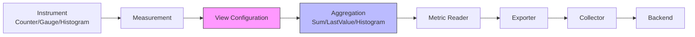

# How to Aggregate Metrics at the Source to Reduce Data Volume

Author: [nawazdhandala](https://www.github.com/nawazdhandala)

Tags: OpenTelemetry, Metrics, Aggregation, Performance, Data Volume, Optimization

Description: Reduce metric data volume and costs by implementing source-level aggregation strategies in OpenTelemetry SDKs and collectors with practical configuration examples.

Metrics are the lifeblood of observability, but raw metric data can quickly overwhelm systems. A single Kubernetes cluster with 100 pods, each emitting 50 metrics every 10 seconds, generates 30,000 data points per minute or 43 million per month.

Source-level aggregation reduces this volume by processing metrics before they leave the application or collector, lowering network bandwidth, storage costs, and query latency.

## Understanding Metric Aggregation

OpenTelemetry metrics follow a structured aggregation pipeline:



Aggregation occurs at multiple stages:
1. **SDK aggregation**: In the application using Views
2. **Collector aggregation**: In the OpenTelemetry Collector
3. **Backend aggregation**: In the observability backend

Source-level aggregation (SDK and Collector) provides the greatest cost reduction by minimizing data transmission and storage.

## Metric Types and Default Aggregation

OpenTelemetry defines three core metric instruments, each with default aggregation behavior:

**Counter**: Monotonically increasing values (requests, bytes sent)
- Default aggregation: Sum
- Example: `http.server.request_count`

**Gauge**: Current value that goes up and down (CPU usage, queue depth)
- Default aggregation: LastValue
- Example: `system.cpu.utilization`

**Histogram**: Distribution of values (request duration, response size)
- Default aggregation: ExplicitBucketHistogram
- Example: `http.server.request.duration`

```python
# Example: Creating metrics with default aggregation
from opentelemetry import metrics
from opentelemetry.sdk.metrics import MeterProvider
from opentelemetry.sdk.metrics.export import PeriodicExportingMetricReader

# Initialize meter provider
meter_provider = MeterProvider(
    metric_readers=[
        PeriodicExportingMetricReader(exporter, export_interval_millis=60000)
    ]
)
metrics.set_meter_provider(meter_provider)

meter = metrics.get_meter(__name__)

# Counter: aggregates as sum
request_counter = meter.create_counter(
    name="http.server.request.count",
    description="Total HTTP requests",
    unit="1"
)

# Gauge: aggregates as last value
queue_gauge = meter.create_gauge(
    name="queue.depth",
    description="Current queue depth",
    unit="1"
)

# Histogram: aggregates into buckets
duration_histogram = meter.create_histogram(
    name="http.server.request.duration",
    description="HTTP request duration",
    unit="ms"
)
```

## Configuring Views for SDK-Level Aggregation

Views allow you to customize metric aggregation before export, reducing cardinality and data volume.

### Reducing Histogram Buckets

Histograms generate one data point per bucket. Reducing bucket count dramatically lowers volume.

```python
# views_config.py
from opentelemetry.sdk.metrics import MeterProvider
from opentelemetry.sdk.metrics.view import View
from opentelemetry.sdk.metrics.aggregation import (
    ExplicitBucketHistogramAggregation,
    DropAggregation,
)

# Define custom histogram buckets
# Default: [0, 5, 10, 25, 50, 75, 100, 250, 500, 750, 1000, 2500, 5000, 7500, 10000]
# Custom: [0, 10, 50, 100, 500, 1000, 5000] (15 buckets -> 7 buckets)
custom_buckets = [0, 10, 50, 100, 500, 1000, 5000]

# Create view with custom aggregation
duration_view = View(
    instrument_type=Histogram,
    instrument_name="http.server.request.duration",
    aggregation=ExplicitBucketHistogramAggregation(
        boundaries=custom_buckets
    )
)

# Initialize meter provider with views
meter_provider = MeterProvider(
    metric_readers=[reader],
    views=[duration_view]
)

# This reduces histogram data points by ~53%
# Before: 15 buckets + count + sum = 17 data points
# After: 7 buckets + count + sum = 9 data points
```

### Filtering High-Cardinality Attributes

Attributes multiply metric cardinality. Remove or aggregate high-cardinality attributes to reduce volume.

```python
# Filter out user_id (high cardinality) but keep endpoint (low cardinality)
from opentelemetry.sdk.metrics.view import View

filtered_view = View(
    instrument_type=Counter,
    instrument_name="http.server.request.count",
    # Keep only specific attributes
    attribute_keys={"http.method", "http.route", "http.status_code"},
    # Drop user_id, request_id, session_id
)

meter_provider = MeterProvider(
    metric_readers=[reader],
    views=[filtered_view]
)

# Example impact:
# Before: 10 routes * 5 methods * 10 status codes * 1000 users = 500,000 time series
# After: 10 routes * 5 methods * 10 status codes = 500 time series
# Reduction: 99.9%
```

### Converting Histograms to Summaries

For some use cases, summaries (percentiles) provide better compression than histograms.

```python
# Convert histogram to summary with specific percentiles
from opentelemetry.sdk.metrics.aggregation import (
    LastValueAggregation,
    SumAggregation,
)

# Custom aggregation for specific percentiles
# Note: OpenTelemetry doesn't have built-in summary aggregation
# Use histogram with post-processing or exponential histogram

# Use exponential histogram for better compression
from opentelemetry.sdk.metrics.aggregation import (
    ExponentialBucketHistogramAggregation,
)

exponential_view = View(
    instrument_type=Histogram,
    instrument_name="http.server.request.duration",
    aggregation=ExponentialBucketHistogramAggregation(
        max_scale=20,
        max_size=160
    )
)

# Exponential histograms provide better resolution with fewer buckets
# Automatically adjusts bucket boundaries based on data distribution
```

## Aggregating Metrics in the Collector

The OpenTelemetry Collector's metrics transform processor provides powerful aggregation capabilities.

### Basic Metric Aggregation

```yaml
# collector-config.yaml
receivers:
  otlp:
    protocols:
      grpc:
        endpoint: 0.0.0.0:4317

processors:
  # Transform processor for metric aggregation
  transform:
    metric_statements:
      # Remove high-cardinality labels
      - context: datapoint
        statements:
          - delete_key(attributes, "user.id")
          - delete_key(attributes, "request.id")
          - delete_key(attributes, "trace.id")
          - delete_key(attributes, "span.id")

      # Aggregate HTTP status codes into classes
      - context: datapoint
        statements:
          # Replace individual status codes with status class
          - set(attributes["http.status_class"], "2xx") where Int(attributes["http.status_code"]) >= 200 and Int(attributes["http.status_code"]) < 300
          - set(attributes["http.status_class"], "3xx") where Int(attributes["http.status_code"]) >= 300 and Int(attributes["http.status_code"]) < 400
          - set(attributes["http.status_class"], "4xx") where Int(attributes["http.status_code"]) >= 400 and Int(attributes["http.status_code"]) < 500
          - set(attributes["http.status_class"], "5xx") where Int(attributes["http.status_code"]) >= 500
          # Remove the original status code
          - delete_key(attributes, "http.status_code")

      # Aggregate routes with dynamic parameters
      - context: datapoint
        statements:
          # Replace /users/123 with /users/{id}
          - replace_pattern(attributes["http.route"], "/users/\\d+", "/users/{id}")
          - replace_pattern(attributes["http.route"], "/orders/[a-f0-9-]+", "/orders/{uuid}")
          - replace_pattern(attributes["http.route"], "/api/v\\d+/", "/api/{version}/")

  # Batch processor for efficiency
  batch:
    timeout: 10s
    send_batch_size: 1024

exporters:
  otlp:
    endpoint: backend:4317

service:
  pipelines:
    metrics:
      receivers: [otlp]
      processors: [transform, batch]
      exporters: [otlp]
```

This configuration reduces cardinality from potentially thousands of unique combinations to dozens.

### Delta to Cumulative Aggregation

Some backends prefer cumulative metrics while SDKs emit delta metrics. Convert at the collector level.

```yaml
processors:
  # Cumulative sum processor
  cumulativetosum:
    # Convert cumulative metrics to delta
    max_stale: 5m

  # Sum connector to aggregate
  metricstransform:
    transforms:
      - include: http.server.request.count
        action: update
        aggregation_type: cumulative
```

### Time-Based Aggregation Windows

Aggregate metrics into larger time windows to reduce data points.

```yaml
processors:
  # Group metrics into 5-minute windows
  groupbyattrs:
    keys:
      - http.method
      - http.route
      - service.name

  transform:
    metric_statements:
      # Only export metrics at 5-minute intervals
      - context: metric
        statements:
          # Add time bucket attribute
          - set(attributes["time.bucket"], Int(time_unix_nano() / 300000000000) * 300000000000)

  # Batch by time window
  batch:
    timeout: 5m
    send_batch_size: 10000
```

## Implementing Application-Level Aggregation

For maximum efficiency, aggregate metrics in the application before SDK export.

### Pre-Aggregation in Go

```go
// metrics_aggregator.go
package main

import (
    "context"
    "sync"
    "time"

    "go.opentelemetry.io/otel/metric"
)

// MetricAggregator aggregates metrics in memory before export
type MetricAggregator struct {
    meter  metric.Meter
    mu     sync.RWMutex

    // Aggregated counters
    counters map[string]int64

    // Flush interval
    flushInterval time.Duration
}

func NewMetricAggregator(meter metric.Meter, flushInterval time.Duration) *MetricAggregator {
    agg := &MetricAggregator{
        meter:         meter,
        counters:      make(map[string]int64),
        flushInterval: flushInterval,
    }

    // Start background flusher
    go agg.flusher()

    return agg
}

// Increment counter in memory
func (a *MetricAggregator) IncrementCounter(name string, value int64, attributes map[string]string) {
    // Create key from name and attributes
    key := name
    for k, v := range attributes {
        key += ":" + k + "=" + v
    }

    a.mu.Lock()
    a.counters[key] += value
    a.mu.Unlock()
}

// Flush aggregated metrics to OpenTelemetry
func (a *MetricAggregator) flush() {
    a.mu.Lock()
    counters := a.counters
    a.counters = make(map[string]int64)
    a.mu.Unlock()

    // Export aggregated values
    for key, value := range counters {
        // Parse key back to name and attributes
        // Simplified: in production, use proper serialization
        counter, _ := a.meter.Int64Counter(key)
        counter.Add(context.Background(), value)
    }
}

// Background flusher
func (a *MetricAggregator) flusher() {
    ticker := time.NewTicker(a.flushInterval)
    defer ticker.Stop()

    for range ticker.C {
        a.flush()
    }
}

// Usage example
func main() {
    meter := otel.Meter("example")
    agg := NewMetricAggregator(meter, 60*time.Second)

    // Record thousands of increments in memory
    for i := 0; i < 10000; i++ {
        agg.IncrementCounter("http.requests", 1, map[string]string{
            "method": "GET",
            "route":  "/api/users",
        })
    }

    // Only one metric data point is exported after flush
    // Instead of 10,000 individual increments
}
```

### Pre-Aggregation in Python

```python
# metrics_aggregator.py
from typing import Dict, Tuple
import threading
import time
from collections import defaultdict
from opentelemetry import metrics

class MetricAggregator:
    """Aggregate metrics in memory before exporting to OpenTelemetry"""

    def __init__(self, meter: metrics.Meter, flush_interval: int = 60):
        self.meter = meter
        self.flush_interval = flush_interval
        self.lock = threading.Lock()

        # In-memory aggregation storage
        self.counters: Dict[Tuple[str, frozenset], int] = defaultdict(int)
        self.gauges: Dict[Tuple[str, frozenset], float] = {}
        self.histograms: Dict[Tuple[str, frozenset], list] = defaultdict(list)

        # Start background flusher
        self.running = True
        self.flush_thread = threading.Thread(target=self._flusher, daemon=True)
        self.flush_thread.start()

    def increment_counter(self, name: str, value: int = 1, attributes: dict = None):
        """Increment counter in memory"""
        attrs = frozenset(attributes.items()) if attributes else frozenset()
        key = (name, attrs)

        with self.lock:
            self.counters[key] += value

    def set_gauge(self, name: str, value: float, attributes: dict = None):
        """Set gauge value (keeps latest)"""
        attrs = frozenset(attributes.items()) if attributes else frozenset()
        key = (name, attrs)

        with self.lock:
            self.gauges[key] = value

    def record_histogram(self, name: str, value: float, attributes: dict = None):
        """Record histogram value"""
        attrs = frozenset(attributes.items()) if attributes else frozenset()
        key = (name, attrs)

        with self.lock:
            self.histograms[key].append(value)

    def flush(self):
        """Flush aggregated metrics to OpenTelemetry"""
        with self.lock:
            # Copy and clear counters
            counters = dict(self.counters)
            self.counters.clear()

            # Copy and clear gauges
            gauges = dict(self.gauges)
            self.gauges.clear()

            # Copy and clear histograms
            histograms = dict(self.histograms)
            self.histograms.clear()

        # Export counters
        for (name, attrs), value in counters.items():
            counter = self.meter.create_counter(name)
            counter.add(value, dict(attrs))

        # Export gauges
        for (name, attrs), value in gauges.items():
            gauge = self.meter.create_gauge(name)
            gauge.set(value, dict(attrs))

        # Export histogram aggregates
        for (name, attrs), values in histograms.items():
            histogram = self.meter.create_histogram(name)
            # Record aggregated statistics instead of all values
            if values:
                count = len(values)
                total = sum(values)
                avg = total / count

                # Record summary statistics
                histogram.record(avg, dict(attrs))

                # Optionally record min/max/p50/p95/p99
                # This reduces 1000s of data points to 5-7 data points

    def _flusher(self):
        """Background thread that flushes metrics periodically"""
        while self.running:
            time.sleep(self.flush_interval)
            self.flush()

# Usage example
meter = metrics.get_meter(__name__)
aggregator = MetricAggregator(meter, flush_interval=60)

# Record thousands of metrics in memory
for i in range(10000):
    aggregator.increment_counter(
        "http.server.request.count",
        value=1,
        attributes={"method": "GET", "route": "/api/users"}
    )

# Only aggregated value exported after 60 seconds
# Volume reduced from 10,000 data points to 1 data point
```

### Pre-Aggregation in Java

```java
// MetricAggregator.java
package com.example.metrics;

import io.opentelemetry.api.metrics.Meter;
import io.opentelemetry.api.metrics.LongCounter;
import java.util.Map;
import java.util.concurrent.*;
import java.util.concurrent.atomic.LongAdder;

public class MetricAggregator {
    private final Meter meter;
    private final int flushIntervalSeconds;
    private final ScheduledExecutorService scheduler;

    // In-memory aggregation storage
    private final ConcurrentMap<String, LongAdder> counters;

    public MetricAggregator(Meter meter, int flushIntervalSeconds) {
        this.meter = meter;
        this.flushIntervalSeconds = flushIntervalSeconds;
        this.counters = new ConcurrentHashMap<>();
        this.scheduler = Executors.newSingleThreadScheduledExecutor();

        // Start periodic flush
        scheduler.scheduleAtFixedRate(
            this::flush,
            flushIntervalSeconds,
            flushIntervalSeconds,
            TimeUnit.SECONDS
        );
    }

    /**
     * Increment counter in memory
     */
    public void incrementCounter(String name, long value, Map<String, String> attributes) {
        // Create key from name and attributes
        String key = buildKey(name, attributes);

        // Increment in memory using LongAdder for thread safety
        counters.computeIfAbsent(key, k -> new LongAdder()).add(value);
    }

    /**
     * Flush aggregated metrics to OpenTelemetry
     */
    private void flush() {
        // Snapshot and clear counters atomically
        Map<String, Long> snapshot = new HashMap<>();
        counters.forEach((key, adder) -> {
            long value = adder.sumThenReset();
            if (value > 0) {
                snapshot.put(key, value);
            }
        });

        // Export aggregated values
        snapshot.forEach((key, value) -> {
            // Parse key back to name and attributes
            // Simplified: use proper serialization in production
            LongCounter counter = meter.counterBuilder(key).build();
            counter.add(value);
        });
    }

    private String buildKey(String name, Map<String, String> attributes) {
        StringBuilder key = new StringBuilder(name);
        if (attributes != null) {
            attributes.forEach((k, v) ->
                key.append(":").append(k).append("=").append(v)
            );
        }
        return key.toString();
    }

    public void shutdown() {
        flush(); // Final flush
        scheduler.shutdown();
    }
}

// Usage example
Meter meter = openTelemetry.getMeter("example");
MetricAggregator aggregator = new MetricAggregator(meter, 60);

// Record thousands of increments in memory
for (int i = 0; i < 10000; i++) {
    aggregator.incrementCounter(
        "http.server.request.count",
        1,
        Map.of("method", "GET", "route", "/api/users")
    );
}

// Only one aggregated value exported after 60 seconds
```

## Cardinality Management Strategies

High cardinality kills metric systems. Apply these strategies to control cardinality:

```yaml
# Cardinality reduction configuration
processors:
  transform:
    metric_statements:
      # Strategy 1: Remove high-cardinality attributes
      - context: datapoint
        statements:
          - delete_key(attributes, "user.id")
          - delete_key(attributes, "session.id")
          - delete_key(attributes, "request.id")

      # Strategy 2: Aggregate into buckets
      - context: datapoint
        statements:
          # Bucket response sizes
          - set(attributes["response.size.bucket"], "small") where Int(attributes["response.size"]) < 1024
          - set(attributes["response.size.bucket"], "medium") where Int(attributes["response.size"]) >= 1024 and Int(attributes["response.size"]) < 1048576
          - set(attributes["response.size.bucket"], "large") where Int(attributes["response.size"]) >= 1048576
          - delete_key(attributes, "response.size")

      # Strategy 3: Limit distinct values
      - context: datapoint
        statements:
          # Keep only top endpoints, group rest as "other"
          - set(attributes["http.route"], "other") where attributes["http.route"] != "/api/users" and attributes["http.route"] != "/api/orders" and attributes["http.route"] != "/api/products"

      # Strategy 4: Sample high-cardinality metrics
      - context: metric
        statements:
          # Drop 90% of detailed metrics
          - drop() where metric.name == "http.server.request.duration.detailed" and Int(time_unix_nano()) % 10 != 0
```

## Monitoring Aggregation Impact

Track the impact of aggregation on data volume:

```python
# aggregation_metrics.py
from dataclasses import dataclass
from datetime import datetime

@dataclass
class AggregationMetrics:
    """Track aggregation effectiveness"""
    pre_aggregation_points: int
    post_aggregation_points: int
    compression_ratio: float
    timestamp: datetime

    @classmethod
    def calculate(cls, before: int, after: int):
        """Calculate aggregation metrics"""
        ratio = before / after if after > 0 else 0
        reduction_pct = (1 - after / before) * 100 if before > 0 else 0

        print(f"Aggregation Impact:")
        print(f"  Before: {before:,} data points")
        print(f"  After:  {after:,} data points")
        print(f"  Compression ratio: {ratio:.1f}x")
        print(f"  Reduction: {reduction_pct:.1f}%")

        return cls(
            pre_aggregation_points=before,
            post_aggregation_points=after,
            compression_ratio=ratio,
            timestamp=datetime.now()
        )

# Example usage
metrics = AggregationMetrics.calculate(
    before=1000000,  # 1M raw data points
    after=50000      # 50K aggregated data points
)
# Output: Compression ratio: 20.0x, Reduction: 95.0%
```

## Best Practices

1. **Aggregate early**: Reduce volume at the source before network transmission
2. **Remove high-cardinality attributes**: User IDs, request IDs, trace IDs don't belong in metrics
3. **Use appropriate time windows**: Longer windows = more aggregation = less volume
4. **Bucket continuous values**: Convert precise values to ranges
5. **Monitor cardinality**: Track unique time series counts over time
6. **Test aggregation impact**: Ensure aggregation doesn't hide important patterns

For additional optimization techniques, see [How to Implement Cardinality Limits to Prevent Metric Explosions](https://oneuptime.com/blog/post/2026-02-06-cardinality-limits-prevent-metric-explosions/view) and [How to Benchmark OpenTelemetry SDK Overhead in Go, Java, and Python](https://oneuptime.com/blog/post/2026-02-06-benchmark-opentelemetry-sdk-overhead-go-java-python/view).

Source-level aggregation dramatically reduces metric data volume while preserving observability, making it a critical optimization for production OpenTelemetry deployments.
