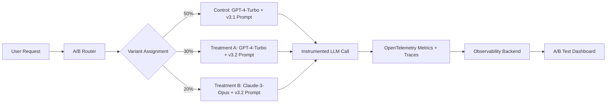
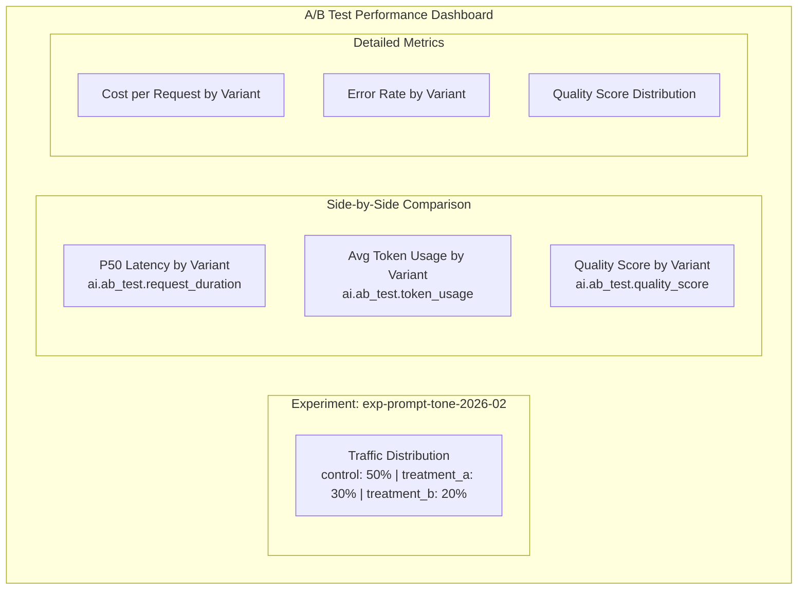

# How to Track AI Model Versioning and A/B Test Performance with OpenTelemetry

Author: [nawazdhandala](https://www.github.com/nawazdhandala)

Tags: OpenTelemetry, AI, A/B Testing, Model Versioning, LLM, MLOps, Observability

Description: Learn how to use OpenTelemetry to track AI model versions and measure A/B test performance with custom metrics, traces, and structured experiment attributes.

---

Swapping out an AI model or changing a prompt template shouldn't feel like a leap of faith. But without proper versioning and performance tracking, that's exactly what it is. You deploy a new model version, cross your fingers, and wait to see if support tickets go up. There's a better way: use OpenTelemetry to tag every AI request with the model version and experiment variant, then compare performance metrics side by side.

This guide covers how to build a model versioning system, set up A/B test routing, and use OpenTelemetry traces and metrics to measure the actual impact of model changes.

## Why Model Versioning Matters

AI models aren't like traditional software deployments. A new version of a REST API either works or it doesn't - you'll know pretty quickly. But a new model version (or prompt revision) can subtly degrade quality in ways that take days to surface. Maybe it's slightly more verbose, slightly less accurate, or slightly more expensive. Without versioned telemetry, you'll never connect those symptoms back to the change you made.

Here's what you need to track for every model interaction:

- **Model identifier** - Which model are you calling? (gpt-4, claude-3-opus, etc.)
- **Model version** - What specific version or snapshot?
- **Prompt template version** - Your system prompt and template change independently from the model.
- **Experiment ID** - Which A/B test is this request part of?
- **Variant** - Is this the control group or the treatment group?

## Designing the Versioning Schema

Let's define a clear schema for tracking model versions and experiments as OpenTelemetry attributes. Consistency here is critical since these attributes are what you'll filter and group by in your dashboard.

```python
# model_version.py - Define the model version configuration
from dataclasses import dataclass

@dataclass
class ModelConfig:
    """Represents a specific model configuration used in production."""

    # The LLM provider and model name
    provider: str          # e.g., "openai", "anthropic"
    model_name: str        # e.g., "gpt-4-turbo"

    # Version tracking
    model_version: str     # e.g., "2024-01-25" (provider's version)
    prompt_version: str    # e.g., "v3.2" (your prompt template version)
    config_hash: str       # Hash of the full config for exact reproducibility

    # Experiment tracking
    experiment_id: str     # e.g., "exp-prompt-tone-2026-02"
    variant: str           # e.g., "control", "treatment_a", "treatment_b"

    def to_otel_attributes(self) -> dict:
        """Convert this config to OpenTelemetry span attributes."""
        return {
            "ai.provider": self.provider,
            "ai.model.name": self.model_name,
            "ai.model.version": self.model_version,
            "ai.prompt.version": self.prompt_version,
            "ai.config.hash": self.config_hash,
            "ai.experiment.id": self.experiment_id,
            "ai.experiment.variant": self.variant,
        }
```

## Setting Up A/B Test Routing

The A/B test router decides which model configuration each request gets. This should be deterministic for a given user (so the same user always sees the same variant) but random across the population.

```python
# ab_router.py - Route requests to model variants based on user ID
import hashlib
from model_version import ModelConfig

# Define your experiment variants
EXPERIMENT_VARIANTS = {
    "exp-prompt-tone-2026-02": {
        "control": ModelConfig(
            provider="openai",
            model_name="gpt-4-turbo",
            model_version="2024-01-25",
            prompt_version="v3.1",
            config_hash="abc123",
            experiment_id="exp-prompt-tone-2026-02",
            variant="control",
        ),
        "treatment_a": ModelConfig(
            provider="openai",
            model_name="gpt-4-turbo",
            model_version="2024-01-25",
            prompt_version="v3.2",  # New prompt version being tested
            config_hash="def456",
            experiment_id="exp-prompt-tone-2026-02",
            variant="treatment_a",
        ),
        "treatment_b": ModelConfig(
            provider="anthropic",
            model_name="claude-3-opus",
            model_version="2024-02-29",
            prompt_version="v3.2",  # Same prompt, different model
            config_hash="ghi789",
            experiment_id="exp-prompt-tone-2026-02",
            variant="treatment_b",
        ),
    }
}

# Traffic split percentages (must add up to 100)
TRAFFIC_SPLIT = {
    "control": 50,        # 50% of traffic
    "treatment_a": 30,    # 30% of traffic
    "treatment_b": 20,    # 20% of traffic
}

def get_variant_for_user(user_id: str, experiment_id: str) -> ModelConfig:
    """Deterministically assign a user to an experiment variant.

    Uses consistent hashing so the same user always gets the same variant,
    but the distribution across all users matches the traffic split.
    """
    # Create a deterministic hash from user_id + experiment_id
    hash_input = f"{user_id}:{experiment_id}"
    hash_value = int(hashlib.sha256(hash_input.encode()).hexdigest(), 16)

    # Map the hash to a percentage (0-99)
    bucket = hash_value % 100

    # Assign variant based on traffic split
    cumulative = 0
    for variant_name, percentage in TRAFFIC_SPLIT.items():
        cumulative += percentage
        if bucket < cumulative:
            return EXPERIMENT_VARIANTS[experiment_id][variant_name]

    # Fallback to control
    return EXPERIMENT_VARIANTS[experiment_id]["control"]
```

## Instrumenting A/B Test Requests

Now let's wire the A/B router into an instrumented LLM call. Every request gets tagged with both the model version and the experiment variant, so you can slice metrics by either dimension.

```python
# instrumented_ab.py - LLM calls with full A/B test and version tracking
import time
import openai
import anthropic
from opentelemetry import trace, metrics
from model_version import ModelConfig
from ab_router import get_variant_for_user

tracer = trace.get_tracer("ai-service")
meter = metrics.get_meter("ai-service")

# Metrics for A/B comparison
request_duration = meter.create_histogram(
    name="ai.ab_test.request_duration",
    description="LLM request duration by experiment variant",
    unit="ms",
)

token_usage = meter.create_histogram(
    name="ai.ab_test.token_usage",
    description="Total token usage by experiment variant",
    unit="tokens",
)

request_counter = meter.create_counter(
    name="ai.ab_test.requests",
    description="Total requests by experiment variant",
)

quality_score = meter.create_histogram(
    name="ai.ab_test.quality_score",
    description="Quality score by experiment variant (if evaluated)",
    unit="score",
)

# Prompt templates for different versions
PROMPT_TEMPLATES = {
    "v3.1": "You are a helpful assistant. Answer the user's question clearly and concisely.",
    "v3.2": "You are a knowledgeable expert. Provide detailed, well-structured answers with examples when helpful.",
}

def call_llm_with_ab_test(
    user_id: str,
    user_message: str,
    experiment_id: str = "exp-prompt-tone-2026-02",
):
    """Make an LLM call routed through the A/B test framework."""

    # Get the variant for this user
    config = get_variant_for_user(user_id, experiment_id)

    # Build the common metric attributes from the model config
    metric_attrs = {
        "experiment_id": config.experiment_id,
        "variant": config.variant,
        "model": config.model_name,
        "prompt_version": config.prompt_version,
    }

    with tracer.start_as_current_span("ai.ab_test.request") as span:
        # Tag the span with all version and experiment attributes
        for key, value in config.to_otel_attributes().items():
            span.set_attribute(key, value)

        span.set_attribute("user.id", user_id)

        # Select the prompt template based on version
        system_prompt = PROMPT_TEMPLATES[config.prompt_version]

        start_time = time.perf_counter()

        # Route to the correct provider
        if config.provider == "openai":
            result, tokens = _call_openai(config, system_prompt, user_message)
        elif config.provider == "anthropic":
            result, tokens = _call_anthropic(config, system_prompt, user_message)
        else:
            raise ValueError(f"Unknown provider: {config.provider}")

        duration_ms = (time.perf_counter() - start_time) * 1000

        # Record metrics with experiment labels
        request_duration.record(duration_ms, attributes=metric_attrs)
        token_usage.record(tokens, attributes=metric_attrs)
        request_counter.add(1, attributes={**metric_attrs, "status": "success"})

        # Record span attributes for trace-level analysis
        span.set_attribute("ai.duration_ms", duration_ms)
        span.set_attribute("ai.total_tokens", tokens)

        return result


def _call_openai(config: ModelConfig, system_prompt: str, user_message: str):
    """Call OpenAI and return the response text and token count."""
    client = openai.OpenAI()
    response = client.chat.completions.create(
        model=config.model_name,
        messages=[
            {"role": "system", "content": system_prompt},
            {"role": "user", "content": user_message},
        ],
    )
    text = response.choices[0].message.content
    tokens = response.usage.prompt_tokens + response.usage.completion_tokens
    return text, tokens


def _call_anthropic(config: ModelConfig, system_prompt: str, user_message: str):
    """Call Anthropic and return the response text and token count."""
    client = anthropic.Anthropic()
    response = client.messages.create(
        model=config.model_name,
        max_tokens=1024,
        system=system_prompt,
        messages=[{"role": "user", "content": user_message}],
    )
    text = response.content[0].text
    tokens = response.usage.input_tokens + response.usage.output_tokens
    return text, tokens
```

## Experiment Data Flow

Here's how data flows through the system from request to analysis.



## Adding Quality Evaluation

Latency and cost are easy to measure, but quality is what matters most. You can add automated quality evaluation using a separate LLM call (or a simpler heuristic) and record the score as a metric tied to the experiment variant.

```python
# quality_eval.py - Evaluate response quality and record it as an experiment metric
from opentelemetry import trace
from instrumented_ab import quality_score

tracer = trace.get_tracer("ai-service")

def evaluate_and_record_quality(
    question: str,
    response: str,
    variant: str,
    experiment_id: str,
    model: str,
):
    """Evaluate response quality and record it as an OpenTelemetry metric."""

    with tracer.start_as_current_span("ai.quality_eval") as span:
        # Simple heuristic evaluation (replace with LLM-as-judge in production)
        scores = {}

        # Check if the response is a reasonable length
        word_count = len(response.split())
        scores["length_appropriate"] = 1.0 if 20 < word_count < 500 else 0.5

        # Check if the response addresses the question
        question_keywords = set(question.lower().split())
        response_keywords = set(response.lower().split())
        keyword_overlap = len(question_keywords & response_keywords) / max(len(question_keywords), 1)
        scores["relevance"] = min(keyword_overlap * 2, 1.0)

        # Check for common quality issues
        scores["no_hallucination_markers"] = 0.0 if "I don't know" in response and "but" in response else 1.0

        # Calculate composite score
        composite = sum(scores.values()) / len(scores)

        # Record the quality score with experiment labels
        quality_score.record(
            composite,
            attributes={
                "experiment_id": experiment_id,
                "variant": variant,
                "model": model,
            },
        )

        # Add detailed scores to the span for debugging
        span.set_attribute("quality.composite_score", composite)
        for metric_name, score in scores.items():
            span.set_attribute(f"quality.{metric_name}", score)

        return composite
```

## The A/B Test Dashboard

With all the metrics labeled by experiment variant, you can build a comparison dashboard. Here's what it should look like.



The key queries for comparison:

```yaml
# ab_test_dashboard.yaml - Panel definitions for A/B test comparison

# Compare P95 latency across variants
- title: "P95 Latency by Variant"
  query: "histogram_quantile(0.95, rate(ai_ab_test_request_duration_bucket{experiment_id='exp-prompt-tone-2026-02'}[5m]))"
  group_by: ["variant"]

# Compare average quality scores
- title: "Average Quality Score by Variant"
  query: "rate(ai_ab_test_quality_score_sum[1h]) / rate(ai_ab_test_quality_score_count[1h])"
  group_by: ["variant"]

# Compare cost efficiency (tokens per request)
- title: "Avg Tokens per Request by Variant"
  query: "rate(ai_ab_test_token_usage_sum[1h]) / rate(ai_ab_test_token_usage_count[1h])"
  group_by: ["variant"]

# Error rates by variant
- title: "Error Rate by Variant"
  query: "rate(ai_ab_test_requests{status='error'}[5m]) / rate(ai_ab_test_requests[5m]) * 100"
  group_by: ["variant"]
```

## Making Rollout Decisions

After running the experiment for a statistically meaningful period, you'll have data like this:

| Metric | Control (v3.1 + GPT-4T) | Treatment A (v3.2 + GPT-4T) | Treatment B (v3.2 + Claude) |
|--------|--------------------------|------------------------------|------------------------------|
| P95 Latency | 3,200ms | 3,400ms | 2,800ms |
| Avg Tokens | 420 | 580 | 510 |
| Quality Score | 0.78 | 0.85 | 0.82 |
| Error Rate | 0.3% | 0.3% | 0.5% |
| Cost/Request | $0.031 | $0.042 | $0.028 |

From this data, you can see that Treatment A (the new prompt) improves quality but costs more. Treatment B gives a nice latency improvement at lower cost, but has a higher error rate. These are the kinds of decisions you can't make without version-tagged telemetry.

## Tracking Prompt Template Changes

Model versions aren't the only thing that changes. Prompt templates evolve constantly, and they have just as much impact on output quality. Here's a pattern for versioning your prompts and tracking them independently.

```python
# prompt_registry.py - Version and track prompt templates
import hashlib
from opentelemetry import trace

tracer = trace.get_tracer("ai-service")

class PromptRegistry:
    """Registry for versioned prompt templates with OpenTelemetry tracking."""

    def __init__(self):
        self._templates = {}

    def register(self, name: str, version: str, template: str):
        """Register a prompt template with a name and version."""
        # Auto-generate a hash for exact change detection
        content_hash = hashlib.sha256(template.encode()).hexdigest()[:12]
        self._templates[(name, version)] = {
            "template": template,
            "hash": content_hash,
        }

    def get(self, name: str, version: str) -> tuple[str, dict]:
        """Retrieve a prompt template and its tracking metadata."""
        entry = self._templates[(name, version)]
        metadata = {
            "ai.prompt.name": name,
            "ai.prompt.version": version,
            "ai.prompt.hash": entry["hash"],
        }
        return entry["template"], metadata

# Usage
registry = PromptRegistry()
registry.register("customer-support", "v1.0", "You are a helpful support agent...")
registry.register("customer-support", "v1.1", "You are an expert support agent. Be concise...")

# When making an LLM call
template, prompt_attrs = registry.get("customer-support", "v1.1")

with tracer.start_as_current_span("ai.request") as span:
    # Attach prompt version metadata to the span
    for key, value in prompt_attrs.items():
        span.set_attribute(key, value)
    # ... make the LLM call
```

## Conclusion

Tracking AI model versions and A/B test performance with OpenTelemetry turns model updates from guesswork into data-driven decisions. By tagging every request with the model version, prompt version, and experiment variant, you get side-by-side comparisons of latency, cost, quality, and reliability across different configurations. The key is consistency: define your attribute schema upfront, use deterministic routing for your experiments, and make sure every metric carries the experiment labels. With this foundation, you can confidently roll out model changes, knowing exactly how they compare to what you had before.
