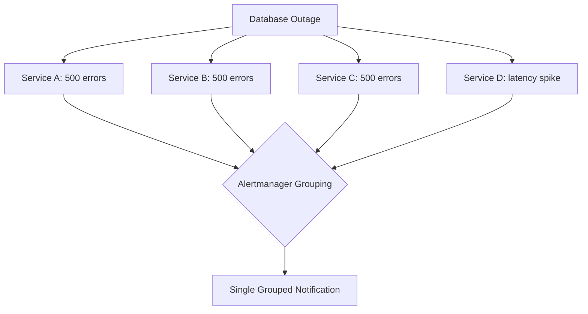

# How to Set Up Alert Deduplication and Grouping for High-Volume OpenTelemetry Metric Alerts

Author: [nawazdhandala](https://www.github.com/nawazdhandala)

Tags: OpenTelemetry, Alerting, Deduplication, Prometheus, Alert Fatigue

Description: Set up alert deduplication and grouping strategies to reduce noise from high-volume OpenTelemetry metric alerts.

A single infrastructure issue can generate hundreds of individual alerts. When your database goes down, every service that depends on it fires its own error rate alert, latency alert, and connection timeout alert. Without deduplication and grouping, your on-call engineer gets buried under a flood of notifications that all point to the same root cause.

This post covers how to configure alert deduplication and grouping when working with OpenTelemetry metrics, using Prometheus Alertmanager as the alert routing layer.

## Why Grouping Matters

Consider a microservices architecture with 20 services, each reporting HTTP error metrics via OpenTelemetry. If the shared database goes down, you might see:

- 20 alerts for increased HTTP 500 rates
- 20 alerts for increased latency
- 5 alerts for connection pool exhaustion

That is 45 alerts for one incident. Grouping reduces this to a single notification that includes all affected services.



## Step 1: Structure Your OpenTelemetry Resource Attributes

Effective grouping starts at the instrumentation layer. Your OpenTelemetry SDK configuration should include resource attributes that identify the service, environment, and infrastructure tier.

This SDK configuration adds resource attributes that Alertmanager can use for grouping:

```python
# Python OpenTelemetry SDK setup with resource attributes
from opentelemetry import metrics
from opentelemetry.sdk.metrics import MeterProvider
from opentelemetry.sdk.resources import Resource
from opentelemetry.exporter.otlp.proto.grpc.metric_exporter import OTLPMetricExporter
from opentelemetry.sdk.metrics.export import PeriodicExportingMetricReader

# Resource attributes that become Prometheus labels
resource = Resource.create({
    "service.name": "checkout-service",
    "service.namespace": "payments",      # used for group_by
    "deployment.environment": "production",
    "infrastructure.tier": "tier-1",      # used for severity routing
    "team.owner": "payments-team",        # used for team routing
})

exporter = OTLPMetricExporter(endpoint="otel-collector:4317")
reader = PeriodicExportingMetricReader(exporter, export_interval_millis=15000)
provider = MeterProvider(resource=resource, metric_readers=[reader])
metrics.set_meter_provider(provider)
```

## Step 2: Configure Alertmanager Grouping

The `group_by` parameter in Alertmanager determines which labels are used to bucket alerts together. Alerts that share the same values for all `group_by` labels get merged into a single notification.

This configuration groups alerts by alert name and service namespace, so all services in the "payments" namespace that fire the same alert type get grouped:

```yaml
# alertmanager.yaml
route:
  receiver: default
  # Group alerts by these labels
  # All alerts with the same alertname + namespace = one notification
  group_by: ["alertname", "service_namespace"]

  # Wait 30 seconds to collect related alerts before sending
  group_wait: 30s

  # After first notification, wait 5 minutes before sending updates
  group_interval: 5m

  # Do not re-send the same group for 4 hours
  repeat_interval: 4h

  routes:
    # Critical alerts get tighter grouping windows
    - match:
        severity: critical
      receiver: pagerduty
      group_by: ["alertname", "service_namespace", "deployment_environment"]
      group_wait: 15s      # shorter wait for critical alerts
      group_interval: 1m
      repeat_interval: 1h

    # Warning alerts can afford wider grouping windows
    - match:
        severity: warning
      receiver: slack
      group_by: ["alertname", "service_namespace"]
      group_wait: 60s
      group_interval: 10m
      repeat_interval: 6h
```

## Step 3: Use Inhibition Rules for Deduplication

Inhibition rules prevent redundant alerts from firing when a higher-priority alert already covers the same issue. If a critical error rate alert fires, there is no reason to also send the warning-level version of the same alert.

These inhibition rules suppress lower-severity alerts when a critical alert is already active:

```yaml
# alertmanager.yaml - inhibition rules section
inhibit_rules:
  # If critical fires, suppress warning for the same alert on the same service
  - source_match:
      severity: critical
    target_match:
      severity: warning
    equal: ["alertname", "service_name"]

  # If critical fires, suppress info for the same alert on the same service
  - source_match:
      severity: critical
    target_match:
      severity: info
    equal: ["alertname", "service_name"]

  # If warning fires, suppress info
  - source_match:
      severity: warning
    target_match:
      severity: info
    equal: ["alertname", "service_name"]

  # Suppress downstream service alerts when the upstream dependency is down
  - source_match:
      alertname: DatabaseDown
    target_match:
      alertname: HighErrorRate
    equal: ["deployment_environment"]
```

## Step 4: Implement Recording Rules for Aggregated Metrics

High-cardinality OpenTelemetry metrics can generate a large number of individual time series, each capable of producing its own alert. Recording rules pre-aggregate these metrics to reduce the number of alert evaluations.

These recording rules aggregate per-instance metrics into namespace-level summaries:

```yaml
# prometheus-recording-rules.yaml
groups:
  - name: aggregated_otel_metrics
    interval: 30s
    rules:
      # Aggregate error rate across all services in a namespace
      - record: namespace:http_error_rate:5m
        expr: |
          sum by (service_namespace, deployment_environment) (
            rate(otel_http_server_request_duration_seconds_count{http_status_code=~"5.."}[5m])
          )
          /
          sum by (service_namespace, deployment_environment) (
            rate(otel_http_server_request_duration_seconds_count[5m])
          )

      # Aggregate latency p99 across a namespace
      - record: namespace:http_latency_p99:5m
        expr: |
          histogram_quantile(0.99,
            sum by (service_namespace, le) (
              rate(otel_http_server_request_duration_seconds_bucket[5m])
            )
          )
```

Then alert on the aggregated metric instead of individual service metrics:

```yaml
# Alert on the pre-aggregated recording rule
- alert: NamespaceHighErrorRate
  expr: namespace:http_error_rate:5m > 0.05
  for: 3m
  labels:
    severity: critical
```

## Tuning Your Group Windows

The `group_wait`, `group_interval`, and `repeat_interval` values directly impact how many notifications your team receives. Here is a practical starting point:

| Parameter | Critical | Warning | Info |
|-----------|----------|---------|------|
| group_wait | 15s | 60s | 120s |
| group_interval | 1m | 10m | 30m |
| repeat_interval | 1h | 6h | 24h |

Start with these values and adjust based on your team's feedback. If on-call engineers report getting repeated alerts for the same issue, increase `repeat_interval`. If related alerts arrive as separate notifications, increase `group_wait`.

## Summary

Effective alert deduplication requires work at multiple layers: resource attributes in your OpenTelemetry SDK, recording rules in Prometheus for pre-aggregation, grouping configuration in Alertmanager, and inhibition rules to suppress redundant notifications. The goal is always the same - one incident should produce one notification with enough context to start investigation.
