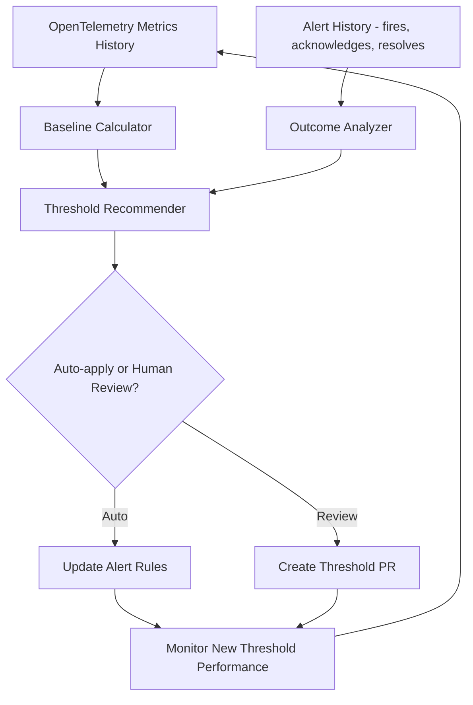

# How to Build an Alert Feedback Loop That Tunes Thresholds Based on OpenTelemetry Historical Data

Author: [nawazdhandala](https://www.github.com/nawazdhandala)

Tags: OpenTelemetry, Alerting, Threshold Tuning, Machine Learning

Description: Build a feedback loop system that analyzes historical OpenTelemetry metrics and past alert outcomes to automatically recommend and adjust alert thresholds over time.

Static alert thresholds rot. You set `error_rate > 1%` as a threshold during launch, traffic patterns shift over the next six months, and now that threshold fires every Friday afternoon during a predictable traffic spike. The team starts ignoring it. Meanwhile, a real 0.8% error rate during off-peak hours goes unnoticed because it falls below the threshold - even though it represents a genuine problem at low traffic volumes.

A feedback loop uses your historical OpenTelemetry data and alert outcomes to recommend threshold adjustments that match actual system behavior.

## How the Feedback Loop Works



## Step 1: Collect Alert Outcome Data

Before you can tune thresholds, you need data about how alerts actually perform. Track three categories:

- **True positives**: Alerts that led to real incidents.
- **False positives**: Alerts that were acknowledged and dismissed without action.
- **Missed incidents**: Real problems discovered through other means (customer reports, manual checks).

Store alert outcomes alongside the OpenTelemetry metric values at the time of firing:

```python
# alert_outcome_tracker.py
# Records alert outcomes with the metric context from when the alert fired
from dataclasses import dataclass
from datetime import datetime
from enum import Enum
import json

class AlertOutcome(Enum):
    TRUE_POSITIVE = "true_positive"
    FALSE_POSITIVE = "false_positive"
    ACKNOWLEDGED_NO_ACTION = "acknowledged_no_action"
    AUTO_RESOLVED = "auto_resolved"

@dataclass
class AlertRecord:
    alert_name: str
    fired_at: datetime
    resolved_at: datetime
    outcome: AlertOutcome
    threshold_value: float
    actual_value: float
    metric_name: str
    service_name: str
    labels: dict

    def to_dict(self) -> dict:
        return {
            "alert_name": self.alert_name,
            "fired_at": self.fired_at.isoformat(),
            "resolved_at": self.resolved_at.isoformat(),
            "outcome": self.outcome.value,
            "threshold_value": self.threshold_value,
            "actual_value": self.actual_value,
            "metric_name": self.metric_name,
            "service_name": self.service_name,
            "labels": self.labels,
            "duration_seconds": (self.resolved_at - self.fired_at).total_seconds()
        }
```

## Step 2: Calculate Dynamic Baselines from Historical Metrics

Query your OpenTelemetry metrics history to understand normal behavior patterns. This function calculates percentile-based baselines that account for time-of-day and day-of-week variation:

```python
# baseline_calculator.py
# Computes dynamic baselines from historical OpenTelemetry metric data
import numpy as np
from datetime import datetime, timedelta
import httpx

class BaselineCalculator:
    def __init__(self, prometheus_url: str):
        self.prom_url = prometheus_url

    def calculate_baseline(
        self,
        metric_query: str,
        lookback_days: int = 14,
        percentile: float = 99.0
    ) -> dict:
        """
        Calculate baseline statistics for a metric over the lookback period.
        Returns per-hour-of-day baselines to account for daily patterns.
        """
        # Query hourly averages over the lookback period
        query = f'avg_over_time(({metric_query})[1h:])'
        end = datetime.utcnow()
        start = end - timedelta(days=lookback_days)

        resp = httpx.get(
            f"{self.prom_url}/api/v1/query_range",
            params={
                "query": query,
                "start": start.isoformat() + "Z",
                "end": end.isoformat() + "Z",
                "step": "1h"
            }
        )
        data = resp.json()["data"]["result"]

        if not data:
            return {"error": "no data found for query"}

        # Group values by hour-of-day
        hourly_buckets = {h: [] for h in range(24)}
        for series in data:
            for timestamp, value in series["values"]:
                hour = datetime.fromtimestamp(float(timestamp)).hour
                hourly_buckets[hour].append(float(value))

        # Calculate per-hour statistics
        baselines = {}
        for hour, values in hourly_buckets.items():
            if values:
                arr = np.array(values)
                baselines[hour] = {
                    "mean": float(np.mean(arr)),
                    "median": float(np.median(arr)),
                    "p95": float(np.percentile(arr, 95)),
                    "p99": float(np.percentile(arr, 99)),
                    "std_dev": float(np.std(arr)),
                    "recommended_threshold": float(
                        np.percentile(arr, percentile) + 2 * np.std(arr)
                    )
                }

        return baselines
```

## Step 3: Analyze Alert Performance

Combine alert outcome data with baselines to identify which thresholds need adjustment:

```python
# threshold_analyzer.py
# Analyzes alert history to recommend threshold changes
from collections import Counter

class ThresholdAnalyzer:
    def __init__(self, alert_records: list, baselines: dict):
        self.records = alert_records
        self.baselines = baselines

    def analyze(self) -> dict:
        """Produce a recommendation for each alert rule."""
        outcomes = Counter(r.outcome for r in self.records)
        total = len(self.records)

        if total == 0:
            return {"status": "insufficient_data"}

        false_positive_rate = outcomes[AlertOutcome.FALSE_POSITIVE] / total
        auto_resolved_rate = outcomes[AlertOutcome.AUTO_RESOLVED] / total

        recommendation = {
            "total_alerts": total,
            "true_positives": outcomes[AlertOutcome.TRUE_POSITIVE],
            "false_positives": outcomes[AlertOutcome.FALSE_POSITIVE],
            "false_positive_rate": round(false_positive_rate, 3),
            "auto_resolved_rate": round(auto_resolved_rate, 3),
        }

        # High false positive rate means the threshold is too sensitive
        if false_positive_rate > 0.3:
            current_threshold = self.records[0].threshold_value
            actual_values = [r.actual_value for r in self.records
                          if r.outcome == AlertOutcome.TRUE_POSITIVE]
            if actual_values:
                # Set new threshold between the false positive values
                # and the true positive values
                tp_min = min(actual_values)
                recommendation["action"] = "raise_threshold"
                recommendation["current_threshold"] = current_threshold
                recommendation["suggested_threshold"] = round(tp_min * 0.9, 4)
                recommendation["reason"] = (
                    f"False positive rate is {false_positive_rate:.0%}. "
                    f"True incidents start at {tp_min}."
                )

        # Very low fire rate with no false positives might mean threshold is too loose
        elif total < 3 and false_positive_rate == 0:
            recommendation["action"] = "review_manually"
            recommendation["reason"] = "Very few alerts fired - threshold may be too high"

        else:
            recommendation["action"] = "keep_current"
            recommendation["reason"] = "Threshold is performing well"

        return recommendation
```

## Step 4: Generate Threshold Update Proposals

Rather than auto-applying changes, generate proposals that can be reviewed. Output them as updated Prometheus alert rule files:

```python
# threshold_proposer.py
# Generates updated alert rule files with recommended thresholds
import yaml

def generate_threshold_proposal(alert_name: str, analysis: dict, baselines: dict) -> str:
    """Create a YAML alert rule with the recommended threshold."""
    if analysis.get("action") != "raise_threshold":
        return None

    new_threshold = analysis["suggested_threshold"]

    rule = {
        "alert": alert_name,
        "expr": f'rate(http_server_request_duration_seconds_count{{status_code=~"5.."}}[5m]) '
                f'/ rate(http_server_request_duration_seconds_count[5m]) > {new_threshold}',
        "for": "5m",
        "labels": {"severity": "warning"},
        "annotations": {
            "summary": f"Error rate above {new_threshold:.2%}",
            "threshold_updated": datetime.utcnow().isoformat(),
            "previous_threshold": str(analysis["current_threshold"]),
            "update_reason": analysis["reason"]
        }
    }

    return yaml.dump({"rules": [rule]}, default_flow_style=False)
```

## Step 5: Schedule Regular Threshold Reviews

Run the analysis on a weekly schedule. A cron job or CI pipeline step works well:

```yaml
# .github/workflows/threshold-review.yaml
# Weekly workflow that analyzes alert performance and proposes threshold updates
name: Alert Threshold Review
on:
  schedule:
    - cron: '0 9 * * 1'  # Every Monday at 9 AM

jobs:
  review-thresholds:
    runs-on: ubuntu-latest
    steps:
      - uses: actions/checkout@v4
      - name: Run threshold analysis
        run: |
          python scripts/analyze_thresholds.py \
            --prometheus-url ${{ secrets.PROMETHEUS_URL }} \
            --alert-history-url ${{ secrets.ALERT_HISTORY_URL }} \
            --lookback-days 14 \
            --output proposals/
      - name: Create PR if changes proposed
        run: |
          if [ -n "$(ls proposals/)" ]; then
            git checkout -b threshold-updates/$(date +%Y-%m-%d)
            cp proposals/*.yaml alert-rules/
            git add alert-rules/
            git commit -m "Update alert thresholds based on 14-day analysis"
            gh pr create \
              --title "Weekly alert threshold review" \
              --body "Automated threshold recommendations based on alert performance data."
          fi
```

## Guardrails

Automated threshold tuning is powerful but needs safety limits. Never let the system raise a threshold above a hard maximum that represents your SLO boundary. Never let it lower a threshold below a floor that would create alert floods. Keep a human in the loop for critical alerts - auto-apply only works well for informational or warning-level thresholds where false positives are annoying but not dangerous to suppress.

The feedback loop gets smarter over time. Each iteration improves the signal-to-noise ratio of your alerts, which means your on-call team spends less time on false positives and more time on real incidents.
