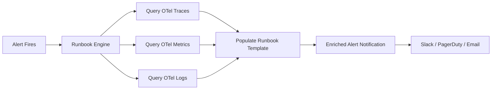

# How to Build Alert Runbooks That Auto-Populate with OpenTelemetry Diagnostic Data

Author: [nawazdhandala](https://www.github.com/nawazdhandala)

Tags: OpenTelemetry, Alerting, Runbooks, Incident Response

Description: Build automated alert runbooks that pull live diagnostic data from OpenTelemetry traces, metrics, and logs to give responders immediate context when an alert fires.

An alert fires at 3 AM. The on-call engineer opens it, sees "high error rate on checkout-service," and then spends 15 minutes gathering context. Which endpoints are affected? What do the traces show? Are there related log entries? All of that context already exists in your OpenTelemetry data. The runbook just needs to pull it automatically.

## Static Runbooks vs. Auto-Populated Runbooks

Static runbooks say things like "check the database connection pool" or "look at the Grafana dashboard." They go stale quickly and assume the responder knows where to look. Auto-populated runbooks attach live data - the actual error traces, the specific metrics that breached the threshold, the log lines from the moment of failure - directly to the alert notification.

## Architecture Overview



## Step 1: Define the Runbook Template

Each alert rule gets a runbook template that specifies which diagnostic queries to run. Store these alongside your alert definitions:

```yaml
# runbooks/checkout-error-rate.yaml
# Runbook template for checkout service error rate alerts
alert: CheckoutHighErrorRate
template:
  title: "Checkout Service Error Rate Above {{ .threshold }}%"

  sections:
    - name: "Error Breakdown"
      description: "Top errors by type in the alert window"
      query_type: metrics
      query: |
        topk(5,
          sum by (http_status_code, http_route) (
            rate(http_server_request_duration_seconds_count{
              service_name="checkout-service",
              http_status_code=~"5.."
            }[5m])
          )
        )

    - name: "Sample Error Traces"
      description: "Recent traces with error status"
      query_type: traces
      filters:
        service.name: "checkout-service"
        status: "ERROR"
      limit: 5
      time_range: "last_10m"

    - name: "Error Logs"
      description: "Recent error-level log entries"
      query_type: logs
      filters:
        service.name: "checkout-service"
        severity: "ERROR"
      limit: 20
      time_range: "last_10m"

    - name: "Dependency Health"
      description: "Downstream service latency and error rates"
      query_type: metrics
      query: |
        avg by (rpc_service) (
          rate(rpc_client_duration_seconds_sum{
            service_name="checkout-service"
          }[5m])
          /
          rate(rpc_client_duration_seconds_count{
            service_name="checkout-service"
          }[5m])
        )

    - name: "Recent Deployments"
      description: "Deployments in the last 2 hours"
      query_type: metrics
      query: |
        changes(deployment_timestamp{
          service_name="checkout-service"
        }[2h])
```

## Step 2: Build the Runbook Engine

The runbook engine receives alert webhooks and executes the diagnostic queries before forwarding the enriched alert. Here is a Python implementation:

```python
# runbook_engine.py
# Receives alerts, executes diagnostic queries, and sends enriched notifications
import yaml
import httpx
from pathlib import Path
from datetime import datetime, timedelta

class RunbookEngine:
    def __init__(self, runbook_dir: str, tempo_url: str, prom_url: str, loki_url: str):
        self.runbook_dir = Path(runbook_dir)
        self.tempo_url = tempo_url
        self.prom_url = prom_url
        self.loki_url = loki_url
        self.runbooks = self._load_runbooks()

    def _load_runbooks(self) -> dict:
        """Load all runbook templates from the directory."""
        runbooks = {}
        for path in self.runbook_dir.glob("*.yaml"):
            with open(path) as f:
                rb = yaml.safe_load(f)
                runbooks[rb["alert"]] = rb["template"]
        return runbooks

    def process_alert(self, alert: dict) -> dict:
        """Take a raw alert and return an enriched version with diagnostic data."""
        alert_name = alert["labels"]["alertname"]
        runbook = self.runbooks.get(alert_name)
        if not runbook:
            return alert

        diagnostics = []
        for section in runbook["sections"]:
            result = self._execute_section(section, alert)
            diagnostics.append({
                "name": section["name"],
                "description": section["description"],
                "data": result
            })

        alert["runbook_diagnostics"] = diagnostics
        return alert

    def _execute_section(self, section: dict, alert: dict) -> dict:
        """Execute a single diagnostic section against the appropriate backend."""
        if section["query_type"] == "metrics":
            return self._query_prometheus(section["query"])
        elif section["query_type"] == "traces":
            return self._query_tempo(section["filters"], section.get("limit", 5))
        elif section["query_type"] == "logs":
            return self._query_loki(section["filters"], section.get("limit", 20))

    def _query_prometheus(self, query: str) -> dict:
        """Execute a PromQL query and return results."""
        resp = httpx.get(
            f"{self.prom_url}/api/v1/query",
            params={"query": query, "time": datetime.utcnow().isoformat()}
        )
        return resp.json().get("data", {}).get("result", [])

    def _query_tempo(self, filters: dict, limit: int) -> list:
        """Search Tempo for traces matching the filters."""
        search_tags = "&".join(f"{k}={v}" for k, v in filters.items())
        resp = httpx.get(
            f"{self.tempo_url}/api/search",
            params={"tags": search_tags, "limit": limit}
        )
        return resp.json().get("traces", [])

    def _query_loki(self, filters: dict, limit: int) -> list:
        """Query Loki for log lines matching the filters."""
        label_selectors = ",".join(f'{k}="{v}"' for k, v in filters.items())
        query = '{' + label_selectors + '}'
        resp = httpx.get(
            f"{self.loki_url}/loki/api/v1/query_range",
            params={"query": query, "limit": limit}
        )
        return resp.json().get("data", {}).get("result", [])
```

## Step 3: Format the Output for Notifications

The enriched alert needs to be formatted into something readable. Here is how to render it as a Slack message:

```python
# format_slack_message.py
# Converts enriched alert data into a structured Slack notification
def format_runbook_slack(alert: dict) -> dict:
    blocks = [
        {
            "type": "header",
            "text": {"type": "plain_text", "text": alert["labels"]["alertname"]}
        },
        {
            "type": "section",
            "text": {
                "type": "mrkdwn",
                "text": f"*Service:* {alert['labels'].get('service_name', 'unknown')}\n"
                        f"*Severity:* {alert['labels'].get('severity', 'warning')}\n"
                        f"*Started:* {alert['startsAt']}"
            }
        }
    ]

    for diag in alert.get("runbook_diagnostics", []):
        blocks.append({"type": "divider"})
        blocks.append({
            "type": "section",
            "text": {
                "type": "mrkdwn",
                "text": f"*{diag['name']}*\n{diag['description']}"
            }
        })

        # Render the data as a compact summary
        if isinstance(diag["data"], list):
            summary_lines = []
            for item in diag["data"][:5]:
                if "metric" in item:
                    labels = item["metric"]
                    value = item["value"][1] if "value" in item else "N/A"
                    summary_lines.append(f"  {labels} = {value}")
                elif "traceID" in item:
                    summary_lines.append(f"  Trace: `{item['traceID']}` - {item.get('rootServiceName', '')}")
            if summary_lines:
                blocks.append({
                    "type": "section",
                    "text": {"type": "mrkdwn", "text": "\n".join(summary_lines)}
                })

    return {"blocks": blocks}
```

## Step 4: Wire It Into Your Alert Pipeline

Connect the runbook engine as a webhook receiver in Alertmanager:

```yaml
# alertmanager.yaml
# Route alerts through the runbook engine before delivering to Slack
receivers:
  - name: 'runbook-enriched'
    webhook_configs:
      - url: 'http://runbook-engine:8080/process'
        send_resolved: true

route:
  receiver: 'runbook-enriched'
  group_by: ['alertname', 'service_name']
  group_wait: 30s
```

## Keeping Runbooks Current

The advantage of auto-populated runbooks is that they never go stale in the way static documents do. The queries always pull live data. However, the query definitions themselves need maintenance. A good practice is to store runbook templates in the same repository as your alert rules and review them together. When an alert rule changes its labels or thresholds, update the corresponding runbook template in the same pull request.

The result is that every alert arrives with the diagnostic context already attached. Your on-call engineer sees the error traces, the failing endpoints, and the dependency health data right in the notification - no dashboard hunting required.
