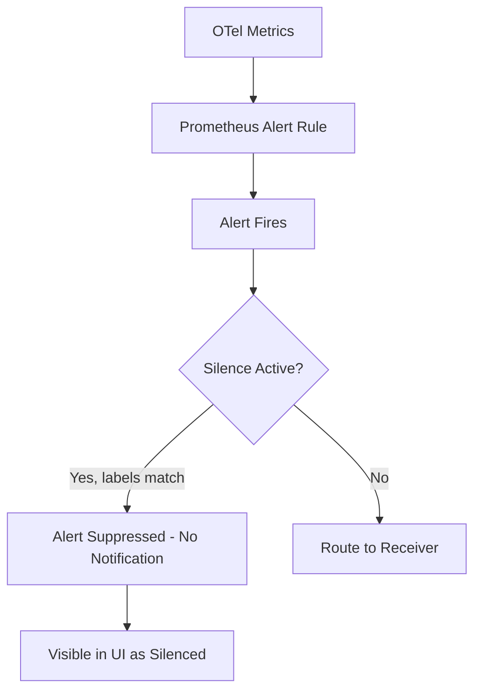

# How to Implement Alert Suppression Windows and Maintenance Schedules for OpenTelemetry Alerts

Author: [nawazdhandala](https://www.github.com/nawazdhandala)

Tags: OpenTelemetry, Alert Suppression, Maintenance Windows, Prometheus, Alertmanager

Description: Configure alert suppression windows and scheduled maintenance silences for OpenTelemetry-based alerting pipelines.

Deployments, database migrations, and planned infrastructure work all cause temporary metric anomalies. If your alerting system fires during these known maintenance windows, your on-call engineer wastes time investigating non-issues. Alert suppression lets you silence specific alerts during scheduled maintenance without disabling the entire alerting pipeline.

This post covers how to set up maintenance windows and alert suppression for OpenTelemetry metrics flowing through Prometheus and Alertmanager.

## How Silences Work in Alertmanager

Alertmanager silences are time-bounded rules that match alerts by label and prevent them from being dispatched to receivers. The alert still evaluates and appears in the Alertmanager UI, but no notification is sent. This is important because you can still see suppressed alerts after the maintenance window closes.



## Step 1: Create a Manual Silence via the API

Before automating, understand how to create a silence directly. Alertmanager exposes a REST API for silence management.

This curl command creates a silence that suppresses all alerts for the `checkout-service` for two hours:

```bash
# Create a 2-hour silence for checkout-service alerts
curl -X POST http://alertmanager:9093/api/v2/silences \
  -H "Content-Type: application/json" \
  -d '{
    "matchers": [
      {
        "name": "service_name",
        "value": "checkout-service",
        "isRegex": false,
        "isEqual": true
      }
    ],
    "startsAt": "2026-02-06T10:00:00Z",
    "endsAt": "2026-02-06T12:00:00Z",
    "createdBy": "deploy-pipeline",
    "comment": "Scheduled deployment of checkout-service v2.4.1"
  }'
```

The response includes a silence ID you can use to expire the silence early if the maintenance finishes ahead of schedule:

```bash
# Expire a silence early by ID
curl -X DELETE http://alertmanager:9093/api/v2/silence/SILENCE_ID
```

## Step 2: Automate Silences in CI/CD Pipelines

The most practical use of alert suppression is during deployments. Your CI/CD pipeline should create a silence before deploying and optionally expire it after health checks pass.

This GitHub Actions workflow step creates and manages silences around a deployment:

```yaml
# .github/workflows/deploy.yaml
jobs:
  deploy:
    runs-on: ubuntu-latest
    steps:
      - name: Create alert silence for deployment
        id: silence
        run: |
          # Calculate end time: 30 minutes from now
          END_TIME=$(date -u -d "+30 minutes" +%Y-%m-%dT%H:%M:%SZ)
          START_TIME=$(date -u +%Y-%m-%dT%H:%M:%SZ)

          # Create silence and capture the ID
          SILENCE_ID=$(curl -s -X POST \
            http://alertmanager.internal:9093/api/v2/silences \
            -H "Content-Type: application/json" \
            -d "{
              \"matchers\": [
                {\"name\": \"service_name\", \"value\": \"${{ env.SERVICE_NAME }}\", \"isRegex\": false, \"isEqual\": true},
                {\"name\": \"alertname\", \"value\": \".*\", \"isRegex\": true, \"isEqual\": true}
              ],
              \"startsAt\": \"${START_TIME}\",
              \"endsAt\": \"${END_TIME}\",
              \"createdBy\": \"github-actions\",
              \"comment\": \"Deploy ${{ github.sha }} by ${{ github.actor }}\"
            }" | jq -r '.silenceID')

          echo "silence_id=${SILENCE_ID}" >> $GITHUB_OUTPUT

      - name: Deploy service
        run: kubectl rollout restart deployment/${{ env.SERVICE_NAME }}

      - name: Wait for rollout
        run: kubectl rollout status deployment/${{ env.SERVICE_NAME }} --timeout=300s

      - name: Run health checks
        run: ./scripts/health-check.sh

      - name: Expire silence after successful deploy
        if: success()
        run: |
          curl -X DELETE \
            "http://alertmanager.internal:9093/api/v2/silence/${{ steps.silence.outputs.silence_id }}"
```

## Step 3: Set Up Recurring Maintenance Windows

Some maintenance happens on a schedule - weekly database backups, nightly batch jobs, or monthly infrastructure patching. Use a cron job to create silences on a recurring basis.

This script runs on a cron schedule to create silences for known maintenance periods:

```python
#!/usr/bin/env python3
# create_recurring_silences.py
# Run via cron: 0 2 * * 0  (every Sunday at 2 AM)

import requests
from datetime import datetime, timedelta, timezone

ALERTMANAGER_URL = "http://alertmanager:9093/api/v2/silences"

# Define recurring maintenance windows
MAINTENANCE_WINDOWS = [
    {
        "name": "Weekly database backup",
        "matchers": [
            {"name": "service_namespace", "value": "database", "isRegex": False, "isEqual": True},
        ],
        "duration_minutes": 60,
    },
    {
        "name": "Nightly batch processing",
        "matchers": [
            {"name": "alertname", "value": "HighLatency.*", "isRegex": True, "isEqual": True},
            {"name": "service_name", "value": "batch-processor", "isRegex": False, "isEqual": True},
        ],
        "duration_minutes": 120,
    },
]

def create_silence(window):
    now = datetime.now(timezone.utc)
    end = now + timedelta(minutes=window["duration_minutes"])

    payload = {
        "matchers": window["matchers"],
        "startsAt": now.isoformat(),
        "endsAt": end.isoformat(),
        "createdBy": "maintenance-scheduler",
        "comment": window["name"],
    }

    response = requests.post(ALERTMANAGER_URL, json=payload)
    if response.status_code == 200:
        silence_id = response.json().get("silenceID")
        print(f"Created silence {silence_id} for: {window['name']}")
    else:
        print(f"Failed to create silence for {window['name']}: {response.text}")

for window in MAINTENANCE_WINDOWS:
    create_silence(window)
```

## Step 4: Use Label-Based Suppression in OTel Collector

For situations where you want to prevent metrics from even reaching the alerting pipeline during maintenance, you can use the OpenTelemetry Collector's filter processor.

This Collector configuration drops metrics from services tagged as being in maintenance mode:

```yaml
# otel-collector-config.yaml
processors:
  filter/maintenance:
    metrics:
      exclude:
        match_type: strict
        resource_attributes:
          - key: maintenance.mode
            value: "true"

service:
  pipelines:
    metrics:
      receivers: [otlp]
      processors: [filter/maintenance, batch]
      exporters: [prometheus]
```

Your deployment script sets the resource attribute before deploying:

```bash
# Set maintenance mode on the service's OTel SDK config
export OTEL_RESOURCE_ATTRIBUTES="service.name=checkout-service,maintenance.mode=true"
# Deploy...
# After deploy, remove the attribute
export OTEL_RESOURCE_ATTRIBUTES="service.name=checkout-service"
```

## Choosing Between Silences and Filtering

Use Alertmanager silences when you want alerts to still be evaluated and visible in the UI but not dispatched. Use Collector-level filtering when you want to completely exclude metrics from a maintenance period - this avoids polluting your metric data with anomalous values that could affect baseline calculations. Both approaches work; the right choice depends on whether you need post-maintenance visibility into what happened during the window.
