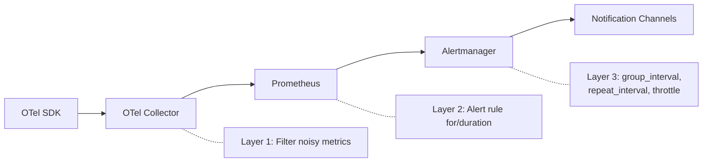

# How to Configure Alert Throttling and Rate Limiting for Noisy OpenTelemetry Metric Sources

Author: [nawazdhandala](https://www.github.com/nawazdhandala)

Tags: OpenTelemetry, Alert Throttling, Rate Limiting, Alert Fatigue, Prometheus

Description: Configure alert throttling and rate limiting to prevent noisy OpenTelemetry metric sources from overwhelming your team.

A misconfigured service, a flapping health check, or a high-cardinality metric can generate thousands of alerts per hour. Without throttling, your on-call engineer's phone buzzes constantly, they start ignoring alerts, and the one real incident gets buried in noise. Alert throttling and rate limiting ensure that even the noisiest metric sources cannot overwhelm your notification channels.

This post covers throttling techniques at every layer of the OpenTelemetry alerting pipeline - from the Collector through Prometheus to Alertmanager.

## Where Throttling Applies

Noise can originate at multiple points. Each layer has its own throttling mechanism.



## Layer 1: Filter Noisy Metrics at the Collector

The OpenTelemetry Collector can drop or aggregate noisy metrics before they reach your alerting backend. This is the first line of defense against high-cardinality metric sources.

This Collector configuration filters out metrics from known noisy sources and limits cardinality:

```yaml
# otel-collector-config.yaml
processors:
  # Drop specific noisy metrics entirely
  filter/drop_noisy:
    metrics:
      exclude:
        match_type: regexp
        metric_names:
          # Drop overly granular internal metrics
          - "runtime\\..*\\.gc\\..*"
          - "process\\.runtime\\..*"

  # Limit attribute cardinality to prevent label explosion
  transform/limit_cardinality:
    metric_statements:
      - context: datapoint
        statements:
          # Remove high-cardinality attributes that cause alert storms
          - delete_key(attributes, "http.url")
          - delete_key(attributes, "http.target")
          # Keep only the path template, not the full URL
          - keep_keys(attributes, ["http.method", "http.status_code", "http.route", "service.name"])

  # Aggregate metrics to reduce volume
  metricstransform/aggregate:
    transforms:
      - include: otel_http_server_request_duration_seconds
        action: update
        operations:
          - action: aggregate_labels
            label_set: ["service_name", "http_method", "http_status_code"]
            aggregation_type: sum

service:
  pipelines:
    metrics:
      receivers: [otlp]
      processors: [filter/drop_noisy, transform/limit_cardinality, batch]
      exporters: [prometheus]
```

## Layer 2: Use `for` Duration to Suppress Transient Alerts

The `for` clause in Prometheus alert rules requires the condition to be true for a sustained period before firing. This is the simplest form of throttling - it filters out transient spikes.

These alert rules use different `for` durations based on the expected stability of the metric:

```yaml
# prometheus-alert-rules.yaml
groups:
  - name: throttled_alerts
    rules:
      # Stable metric - short for duration is fine
      - alert: HighErrorRate
        expr: |
          sum by (service_name) (
            rate(otel_http_server_request_duration_seconds_count{http_status_code=~"5.."}[5m])
          )
          /
          sum by (service_name) (
            rate(otel_http_server_request_duration_seconds_count[5m])
          ) > 0.05
        for: 3m  # Must be true for 3 consecutive minutes
        labels:
          severity: warning

      # Noisy metric - longer for duration filters out flapping
      - alert: HighMemoryUsage
        expr: |
          otel_process_runtime_memory_usage_bytes{type="heap"}
          /
          otel_process_runtime_memory_limit_bytes > 0.85
        for: 10m  # Must be true for 10 minutes to suppress GC noise
        labels:
          severity: warning

      # Very noisy metric - require sustained condition
      - alert: ConnectionPoolExhaustion
        expr: |
          otel_db_client_connections_usage{state="used"}
          /
          otel_db_client_connections_max > 0.9
        for: 15m  # Connection pools fluctuate; require 15 min sustained
        labels:
          severity: critical
```

## Layer 3: Configure Alertmanager Repeat and Group Intervals

Alertmanager controls how often a firing alert re-sends its notification. The `repeat_interval` is the most effective throttling control for persistent alerts.

This configuration sets aggressive throttling for known noisy alert sources:

```yaml
# alertmanager.yaml
route:
  receiver: default
  group_by: ["alertname", "service_name"]
  group_wait: 30s
  group_interval: 5m
  repeat_interval: 4h

  routes:
    # Critical alerts: moderate throttling
    - match:
        severity: critical
      receiver: pagerduty
      repeat_interval: 1h  # re-page every hour at most

    # Warning alerts: heavy throttling
    - match:
        severity: warning
      receiver: slack-warnings
      repeat_interval: 6h  # repeat at most every 6 hours

    # Known noisy alerts: maximum throttling
    - match_re:
        alertname: "(HighMemoryUsage|ConnectionPoolFluctuation|GCPressure)"
      receiver: slack-noisy
      group_wait: 120s      # wait longer to collect related alerts
      group_interval: 30m   # batch updates every 30 minutes
      repeat_interval: 24h  # only repeat once per day
```

## Layer 4: Implement Per-Service Rate Limiting

For services that consistently generate too many alerts, implement a rate limiting pattern using Alertmanager's routing and a webhook receiver that enforces limits.

This webhook receiver wraps your notification logic with rate limiting:

```python
#!/usr/bin/env python3
# alert_rate_limiter.py
# Webhook receiver that rate-limits alerts per service

from flask import Flask, request, jsonify
import time
import requests

app = Flask(__name__)

# Track last notification time per service
last_notified = {}

# Rate limit: one notification per service per 30 minutes
RATE_LIMIT_SECONDS = 1800

@app.route("/webhook", methods=["POST"])
def receive_alert():
    data = request.json
    alerts = data.get("alerts", [])

    for alert in alerts:
        service = alert.get("labels", {}).get("service_name", "unknown")
        alert_name = alert.get("labels", {}).get("alertname", "unknown")
        key = f"{service}:{alert_name}"

        now = time.time()
        last_time = last_notified.get(key, 0)

        if now - last_time < RATE_LIMIT_SECONDS:
            # Rate limited - skip this notification
            app.logger.info(f"Rate limited: {key} (last sent {int(now - last_time)}s ago)")
            continue

        # Forward to actual notification channel
        forward_to_slack(alert)
        last_notified[key] = now

    return jsonify({"status": "ok"}), 200

def forward_to_slack(alert):
    slack_webhook = "https://hooks.slack.com/services/YOUR/WEBHOOK/URL"
    payload = {
        "text": f"[{alert['labels'].get('severity', 'unknown').upper()}] "
                f"{alert['labels'].get('alertname')}: "
                f"{alert.get('annotations', {}).get('summary', 'No summary')}",
    }
    requests.post(slack_webhook, json=payload)

if __name__ == "__main__":
    app.run(host="0.0.0.0", port=5001)
```

Configure Alertmanager to use this webhook:

```yaml
receivers:
  - name: rate-limited-slack
    webhook_configs:
      - url: "http://alert-rate-limiter:5001/webhook"
        send_resolved: true
```

## Monitoring Your Throttling

Track how many alerts are being throttled so you can tune your configuration. Add these Prometheus queries to a dashboard:

```promql
# Number of currently firing alerts (should stay manageable)
count(ALERTS{alertstate="firing"})

# Alerts per service (identify noisy services)
count by (service_name) (ALERTS{alertstate="firing"})

# Notification rate from Alertmanager
rate(alertmanager_notifications_total[1h])

# Failed notifications (throttled or errored)
rate(alertmanager_notifications_failed_total[1h])
```

## Summary

Effective throttling is a layered approach. Filter noisy metrics at the Collector before they generate alerts. Use `for` durations to suppress transient spikes. Configure Alertmanager's `repeat_interval` to control re-notification frequency. For persistently noisy sources, add a rate-limiting webhook receiver. Monitor your alert volume continuously and adjust thresholds when you see alert fatigue setting in.
