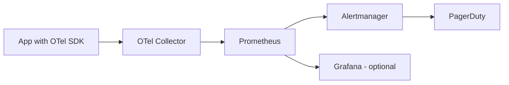

# How to Build an End-to-End Alerting Pipeline from OpenTelemetry Metrics to PagerDuty

Author: [nawazdhandala](https://www.github.com/nawazdhandala)

Tags: OpenTelemetry, PagerDuty, Alerting, Prometheus

Description: Build a complete alerting pipeline that takes OpenTelemetry metrics through Prometheus and Alertmanager to trigger PagerDuty incidents automatically.

Getting metrics into a dashboard is only half the job. The other half is making sure the right person gets woken up when something goes wrong. This post walks through building a complete alerting pipeline that starts with OpenTelemetry-instrumented applications and ends with a PagerDuty incident on the on-call engineer's phone.

## Pipeline Architecture

The pipeline has four components: your applications emit metrics via OpenTelemetry, the Collector exports them to Prometheus, Prometheus evaluates alert rules, and Alertmanager routes firing alerts to PagerDuty.



## Step 1: Instrument Your Application

First, make sure your application emits the metrics you want to alert on. Here is a Go example that records HTTP request duration and error counts:

```go
// main.go
// Set up OpenTelemetry metrics for HTTP request monitoring

package main

import (
    "net/http"
    "time"

    "go.opentelemetry.io/otel"
    "go.opentelemetry.io/otel/metric"
    "go.opentelemetry.io/otel/exporters/otlp/otlpmetric/otlpmetricgrpc"
    sdkmetric "go.opentelemetry.io/otel/sdk/metric"
)

var (
    requestDuration metric.Float64Histogram
    requestErrors   metric.Int64Counter
)

func initMetrics() {
    exporter, _ := otlpmetricgrpc.New(context.Background())
    provider := sdkmetric.NewMeterProvider(
        sdkmetric.WithReader(sdkmetric.NewPeriodicReader(exporter,
            sdkmetric.WithInterval(15*time.Second))),
    )
    otel.SetMeterProvider(provider)

    meter := provider.Meter("api-server")

    // Histogram for request latency - used for P99 alerting
    requestDuration, _ = meter.Float64Histogram(
        "http.server.request.duration",
        metric.WithUnit("s"),
        metric.WithDescription("HTTP request duration in seconds"),
    )

    // Counter for errors - used for error rate alerting
    requestErrors, _ = meter.Int64Counter(
        "http.server.errors.total",
        metric.WithDescription("Total HTTP 5xx errors"),
    )
}
```

## Step 2: Configure the OpenTelemetry Collector

The Collector receives OTLP metrics and exports them in Prometheus format. Use the `prometheusremotewrite` exporter to push metrics directly to Prometheus, or the `prometheus` exporter to let Prometheus scrape the Collector.

```yaml
# otel-collector-config.yaml
# Receive OTLP metrics and expose them for Prometheus scraping

receivers:
  otlp:
    protocols:
      grpc:
        endpoint: 0.0.0.0:4317

processors:
  batch:
    send_batch_size: 4096
    timeout: 5s

  # Add useful resource attributes as metric labels
  resource:
    attributes:
      - key: environment
        value: production
        action: upsert

exporters:
  # Expose metrics on port 8889 for Prometheus to scrape
  prometheus:
    endpoint: 0.0.0.0:8889
    # Map OTel resource attributes to Prometheus labels
    resource_to_telemetry_conversion:
      enabled: true

service:
  pipelines:
    metrics:
      receivers: [otlp]
      processors: [resource, batch]
      exporters: [prometheus]
```

## Step 3: Set Up Prometheus Alert Rules

Create Prometheus alert rules that define when to fire alerts. These rules evaluate against the metrics exposed by the Collector.

```yaml
# prometheus-alerts.yaml
# Alert rules for API server health

groups:
  - name: api-server-alerts
    rules:
      # Fire when error rate exceeds 5% for 5 minutes
      - alert: HighErrorRate
        expr: |
          (
            sum(rate(http_server_errors_total[5m])) by (service_name)
            /
            sum(rate(http_server_request_duration_count[5m])) by (service_name)
          ) > 0.05
        for: 5m
        labels:
          severity: critical
          team: platform
        annotations:
          summary: "High error rate on {{ $labels.service_name }}"
          description: "Error rate is {{ $value | humanizePercentage }} for service {{ $labels.service_name }}"
          runbook_url: "https://wiki.example.com/runbooks/high-error-rate"

      # Fire when P99 latency exceeds 2 seconds for 10 minutes
      - alert: HighLatencyP99
        expr: |
          histogram_quantile(0.99,
            sum(rate(http_server_request_duration_bucket[5m])) by (le, service_name)
          ) > 2.0
        for: 10m
        labels:
          severity: warning
          team: platform
        annotations:
          summary: "High P99 latency on {{ $labels.service_name }}"
          description: "P99 latency is {{ $value | humanizeDuration }} for service {{ $labels.service_name }}"

      # Fire when a service stops reporting metrics (possible crash)
      - alert: ServiceDown
        expr: |
          absent_over_time(http_server_request_duration_count{service_name!=""}[5m])
        for: 3m
        labels:
          severity: critical
          team: platform
        annotations:
          summary: "Service {{ $labels.service_name }} is not reporting metrics"
```

Add the rules file to your Prometheus configuration:

```yaml
# prometheus.yaml
# Main Prometheus config with Collector scrape target and alert rules

global:
  scrape_interval: 15s
  evaluation_interval: 15s

# Point Prometheus at Alertmanager
alerting:
  alertmanagers:
    - static_configs:
        - targets:
            - alertmanager:9093

# Load alert rules
rule_files:
  - "prometheus-alerts.yaml"

# Scrape the OTel Collector's Prometheus exporter
scrape_configs:
  - job_name: "otel-collector"
    static_configs:
      - targets: ["otel-collector:8889"]
```

## Step 4: Configure Alertmanager for PagerDuty

Alertmanager handles deduplication, grouping, and routing of alerts to notification receivers. Configure it to send critical alerts to PagerDuty.

```yaml
# alertmanager.yaml
# Route alerts to PagerDuty based on severity

global:
  resolve_timeout: 5m

route:
  # Default receiver for unmatched alerts
  receiver: slack-warnings
  # Group alerts by service to reduce noise
  group_by: [alertname, service_name]
  group_wait: 30s
  group_interval: 5m
  repeat_interval: 4h

  routes:
    # Critical alerts go to PagerDuty
    - match:
        severity: critical
      receiver: pagerduty-critical
      # Shorter repeat for critical alerts
      repeat_interval: 1h

    # Warning alerts go to Slack only
    - match:
        severity: warning
      receiver: slack-warnings

receivers:
  - name: pagerduty-critical
    pagerduty_configs:
      # Use your PagerDuty Events API v2 integration key
      - routing_key: "YOUR_PAGERDUTY_INTEGRATION_KEY"
        severity: critical
        # Include useful context in the PagerDuty incident
        description: '{{ .CommonAnnotations.summary }}'
        details:
          description: '{{ .CommonAnnotations.description }}'
          runbook: '{{ .CommonAnnotations.runbook_url }}'
          firing_alerts: '{{ .Alerts.Firing | len }}'
          services: '{{ .GroupLabels.service_name }}'

  - name: slack-warnings
    slack_configs:
      - api_url: "https://hooks.slack.com/services/YOUR/SLACK/WEBHOOK"
        channel: "#alerts-warning"
        title: '{{ .CommonAnnotations.summary }}'
        text: '{{ .CommonAnnotations.description }}'
```

## Step 5: Deploy with Docker Compose

Here is a Docker Compose file to run the entire pipeline locally:

```yaml
# docker-compose.yaml
# Full alerting pipeline: Collector, Prometheus, Alertmanager

version: "3.8"
services:
  otel-collector:
    image: otel/opentelemetry-collector-contrib:latest
    volumes:
      - ./otel-collector-config.yaml:/etc/otelcol-contrib/config.yaml
    ports:
      - "4317:4317"
      - "8889:8889"

  prometheus:
    image: prom/prometheus:latest
    volumes:
      - ./prometheus.yaml:/etc/prometheus/prometheus.yml
      - ./prometheus-alerts.yaml:/etc/prometheus/prometheus-alerts.yaml
    ports:
      - "9090:9090"

  alertmanager:
    image: prom/alertmanager:latest
    volumes:
      - ./alertmanager.yaml:/etc/alertmanager/alertmanager.yml
    ports:
      - "9093:9093"
```

## Testing the Pipeline

To verify the pipeline works end-to-end, you can use the Alertmanager API to manually fire a test alert:

```bash
# Send a test alert to Alertmanager to verify PagerDuty integration
curl -X POST http://localhost:9093/api/v2/alerts \
  -H "Content-Type: application/json" \
  -d '[{
    "labels": {
      "alertname": "HighErrorRate",
      "severity": "critical",
      "service_name": "test-service",
      "team": "platform"
    },
    "annotations": {
      "summary": "Test alert - high error rate on test-service",
      "description": "This is a test alert. Error rate is 15%."
    }
  }]'
```

Check PagerDuty to confirm the incident was created. Then resolve it by sending the same alert with an `endsAt` timestamp in the past.

This pipeline gives you a complete path from application metrics to on-call engineer. Every component is open source and runs on standard infrastructure. The OpenTelemetry Collector handles ingestion and format conversion, Prometheus handles evaluation, and Alertmanager handles routing - each doing what it does best.
