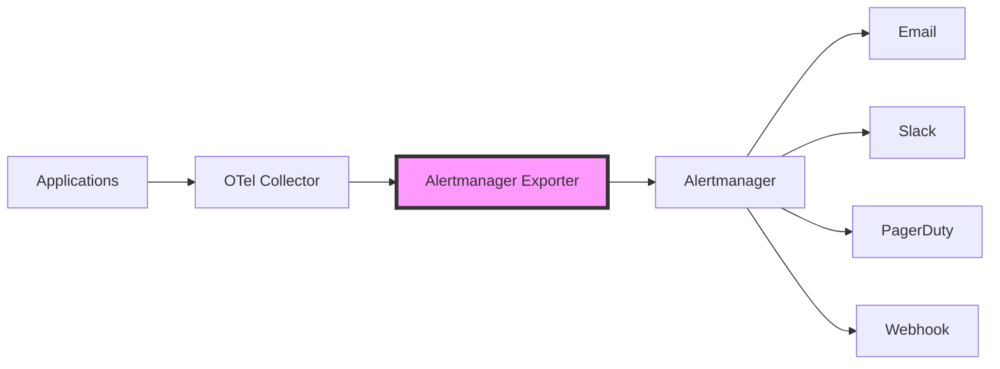

# How to Configure the Alertmanager Exporter in the OpenTelemetry Collector

Author: [nawazdhandala](https://www.github.com/nawazdhandala)

Tags: OpenTelemetry, Collector, Exporters, Alertmanager, Prometheus, Monitoring, Alerting

Description: Learn how to configure the Alertmanager exporter in the OpenTelemetry Collector to send alerts from your telemetry data to Prometheus Alertmanager for centralized alert routing and management.

The Alertmanager exporter enables the OpenTelemetry Collector to send alerts to Prometheus Alertmanager, which provides sophisticated alert routing, grouping, silencing, and notification capabilities. This integration allows you to leverage Alertmanager's powerful alert management features while using OpenTelemetry for data collection and processing.

## Understanding the Alertmanager Exporter

Prometheus Alertmanager is a standalone component that handles alerts sent by client applications such as the Prometheus server or, in this case, the OpenTelemetry Collector. It takes care of deduplicating, grouping, and routing alerts to the correct receiver integrations such as email, PagerDuty, Slack, or webhook endpoints.

The Alertmanager exporter converts OpenTelemetry log records into Alertmanager-compatible alerts. This allows you to define alert conditions using OpenTelemetry's processing capabilities and then route those alerts through Alertmanager's mature notification infrastructure.



## Why Use Alertmanager with OpenTelemetry

Integrating Alertmanager with OpenTelemetry provides several benefits:

**Unified Alert Management**: Centralize alert handling from both Prometheus and OpenTelemetry sources in a single system.

**Advanced Routing**: Use Alertmanager's sophisticated routing rules to send alerts to different teams or systems based on labels and metadata.

**Alert Grouping**: Automatically group related alerts to reduce notification fatigue during incidents.

**Silencing and Inhibition**: Temporarily silence alerts during maintenance windows or use inhibition rules to suppress secondary alerts.

**Multiple Notification Channels**: Configure multiple receivers for different alert types, severity levels, or teams.

## Basic Configuration

Here is a basic configuration for sending alerts from the OpenTelemetry Collector to Alertmanager:

```yaml
receivers:
  # Receive logs that may contain alert conditions
  otlp:
    protocols:
      grpc:
        endpoint: 0.0.0.0:4317

processors:
  # Filter logs to identify alert conditions
  filter:
    logs:
      include:
        match_type: strict
        attributes:
          - key: severity
            value: ERROR

  # Transform logs into alert format
  transform:
    log_statements:
      - context: log
        statements:
          # Set alert labels
          - set(attributes["alertname"], "ApplicationError")
          - set(attributes["service"], resource.attributes["service.name"])
          - set(attributes["severity"], "critical")
          # Set alert annotations
          - set(attributes["summary"], body)
          - set(attributes["description"], Concat([body, " from ", resource.attributes["service.name"]], ""))

  batch:
    timeout: 10s

exporters:
  # Configure Alertmanager exporter
  alertmanager:
    # Alertmanager endpoint
    endpoint: http://alertmanager.example.com:9093/api/v2/alerts
    # Timeout for sending alerts
    timeout: 30s
    # Retry configuration
    retry_on_failure:
      enabled: true
      initial_interval: 5s
      max_interval: 30s
      max_elapsed_time: 300s

service:
  pipelines:
    logs:
      receivers: [otlp]
      processors: [filter, transform, batch]
      exporters: [alertmanager]
```

This configuration receives logs via OTLP, filters for error-level logs, transforms them into alerts with appropriate labels and annotations, and sends them to Alertmanager. The alert labels help Alertmanager route alerts to the correct receivers.

## Alert Labels and Annotations

Alertmanager uses labels to identify and route alerts, while annotations provide additional context. Configure your transform processor to set meaningful labels and annotations:

```yaml
receivers:
  otlp:
    protocols:
      grpc:
        endpoint: 0.0.0.0:4317

processors:
  transform:
    log_statements:
      - context: log
        statements:
          # Required labels for Alertmanager
          - set(attributes["alertname"], "HighErrorRate")

          # Routing labels
          - set(attributes["service"], resource.attributes["service.name"])
          - set(attributes["environment"], resource.attributes["deployment.environment"])
          - set(attributes["cluster"], resource.attributes["k8s.cluster.name"])
          - set(attributes["namespace"], resource.attributes["k8s.namespace.name"])

          # Severity label for prioritization
          - set(attributes["severity"], "critical")

          # Team label for routing
          - set(attributes["team"], "platform")

          # Annotations for alert context
          - set(attributes["summary"], "High error rate detected")
          - set(attributes["description"], Concat(["Error count: ", body], ""))
          - set(attributes["runbook_url"], "https://wiki.example.com/runbooks/high-error-rate")
          - set(attributes["dashboard_url"], "https://grafana.example.com/d/errors")

  batch:
    timeout: 10s

exporters:
  alertmanager:
    endpoint: http://alertmanager.example.com:9093/api/v2/alerts
    timeout: 30s

service:
  pipelines:
    logs:
      receivers: [otlp]
      processors: [transform, batch]
      exporters: [alertmanager]
```

Labels should be used for routing and grouping (service, environment, severity), while annotations provide human-readable context (summary, description, runbook links). The alertname label is required and should describe the alert condition.

## Secure Configuration with Authentication

For production deployments, secure the connection to Alertmanager using TLS and authentication:

```yaml
receivers:
  otlp:
    protocols:
      grpc:
        endpoint: 0.0.0.0:4317

processors:
  transform:
    log_statements:
      - context: log
        statements:
          - set(attributes["alertname"], "ServiceAlert")
          - set(attributes["service"], resource.attributes["service.name"])
          - set(attributes["severity"], "warning")

  batch:
    timeout: 10s

exporters:
  alertmanager:
    # Use HTTPS endpoint
    endpoint: https://alertmanager.example.com:9093/api/v2/alerts
    timeout: 30s

    # TLS configuration
    tls:
      insecure: false
      ca_file: /etc/ssl/certs/ca.crt
      cert_file: /etc/ssl/certs/client.crt
      key_file: /etc/ssl/private/client.key
      server_name_override: alertmanager.example.com

    # Authentication headers
    headers:
      Authorization: "Bearer ${ALERTMANAGER_API_TOKEN}"

    # Retry configuration
    retry_on_failure:
      enabled: true
      initial_interval: 5s
      max_interval: 30s
      max_elapsed_time: 300s

service:
  pipelines:
    logs:
      receivers: [otlp]
      processors: [transform, batch]
      exporters: [alertmanager]
```

TLS encryption protects alert data in transit, while authentication ensures that only authorized collectors can send alerts. Store sensitive credentials like API tokens in environment variables rather than hardcoding them in configuration files.

## Multiple Alert Types

Configure different processors and routing to handle various alert types:

```yaml
receivers:
  otlp:
    protocols:
      grpc:
        endpoint: 0.0.0.0:4317

processors:
  # Route different log types
  routing:
    from_attribute: log.severity
    table:
      - value: ERROR
        exporters: [alertmanager/critical]
      - value: WARN
        exporters: [alertmanager/warning]
    default_exporters: [alertmanager/info]

  # Transform for critical alerts
  transform/critical:
    log_statements:
      - context: log
        statements:
          - set(attributes["alertname"], "CriticalError")
          - set(attributes["severity"], "critical")
          - set(attributes["service"], resource.attributes["service.name"])
          - set(attributes["summary"], "Critical error detected")

  # Transform for warning alerts
  transform/warning:
    log_statements:
      - context: log
        statements:
          - set(attributes["alertname"], "WarningCondition")
          - set(attributes["severity"], "warning")
          - set(attributes["service"], resource.attributes["service.name"])
          - set(attributes["summary"], "Warning condition detected")

  # Transform for info alerts
  transform/info:
    log_statements:
      - context: log
        statements:
          - set(attributes["alertname"], "InfoNotification")
          - set(attributes["severity"], "info")
          - set(attributes["service"], resource.attributes["service.name"])
          - set(attributes["summary"], "Informational notification")

  batch:
    timeout: 10s

exporters:
  # Critical alerts exporter
  alertmanager/critical:
    endpoint: http://alertmanager.example.com:9093/api/v2/alerts
    timeout: 30s

  # Warning alerts exporter
  alertmanager/warning:
    endpoint: http://alertmanager.example.com:9093/api/v2/alerts
    timeout: 30s

  # Info alerts exporter
  alertmanager/info:
    endpoint: http://alertmanager.example.com:9093/api/v2/alerts
    timeout: 30s

service:
  pipelines:
    logs/critical:
      receivers: [otlp]
      processors: [transform/critical, batch]
      exporters: [alertmanager/critical]

    logs/warning:
      receivers: [otlp]
      processors: [transform/warning, batch]
      exporters: [alertmanager/warning]

    logs/info:
      receivers: [otlp]
      processors: [transform/info, batch]
      exporters: [alertmanager/info]
```

Multiple pipelines with different transformations allow you to create various alert types based on log characteristics. Each pipeline can set different labels and annotations appropriate for the alert severity.

## Alert Deduplication

Configure the collector to perform basic deduplication before sending alerts to Alertmanager:

```yaml
receivers:
  otlp:
    protocols:
      grpc:
        endpoint: 0.0.0.0:4317

processors:
  # Group similar logs to reduce duplicate alerts
  groupbyattrs:
    keys:
      - service.name
      - log.severity
      - error.type

  # Transform to alert format
  transform:
    log_statements:
      - context: log
        statements:
          - set(attributes["alertname"], "ServiceError")
          - set(attributes["service"], resource.attributes["service.name"])
          - set(attributes["severity"], "critical")
          - set(attributes["fingerprint"], SHA256(Concat([resource.attributes["service.name"], attributes["error.type"]], ":")))

  batch:
    timeout: 30s
    send_batch_size: 100

exporters:
  alertmanager:
    endpoint: http://alertmanager.example.com:9093/api/v2/alerts
    timeout: 30s

service:
  pipelines:
    logs:
      receivers: [otlp]
      processors: [groupbyattrs, transform, batch]
      exporters: [alertmanager]
```

The groupbyattrs processor groups similar logs together, and batching reduces the number of alert messages sent. Alertmanager itself performs sophisticated deduplication based on alert fingerprints, but reducing duplicate alerts at the collector level improves efficiency.

## Integrating with Metrics-Based Alerting

You can also create alerts based on metric values using the metrics transform processor:

```yaml
receivers:
  # Receive metrics
  otlp:
    protocols:
      grpc:
        endpoint: 0.0.0.0:4317

processors:
  # Filter metrics that exceed thresholds
  filter/metrics:
    metrics:
      include:
        match_type: expr
        expressions:
          - 'value > 100'

  # Convert metrics to logs for alerting
  metricstransform:
    transforms:
      - include: http_requests_total
        match_type: strict
        action: insert
        new_name: high_request_rate_alert
        operations:
          - action: add_label
            new_label: alertname
            new_value: HighRequestRate

  # Transform to alert format
  transform:
    log_statements:
      - context: log
        statements:
          - set(attributes["alertname"], "HighRequestRate")
          - set(attributes["service"], resource.attributes["service.name"])
          - set(attributes["severity"], "warning")
          - set(attributes["summary"], "Request rate exceeded threshold")
          - set(attributes["description"], Concat(["Current rate: ", attributes["value"], " requests/sec"], ""))

  batch:
    timeout: 10s

exporters:
  alertmanager:
    endpoint: http://alertmanager.example.com:9093/api/v2/alerts
    timeout: 30s

service:
  pipelines:
    metrics:
      receivers: [otlp]
      processors: [filter/metrics, metricstransform, transform, batch]
      exporters: [alertmanager]
```

This configuration monitors metrics and creates alerts when values exceed thresholds. The metrics transform processor converts metric data points into log records that can be transformed into alerts.

## High Availability Setup

For production environments, configure multiple Alertmanager instances for high availability:

```yaml
receivers:
  otlp:
    protocols:
      grpc:
        endpoint: 0.0.0.0:4317

processors:
  transform:
    log_statements:
      - context: log
        statements:
          - set(attributes["alertname"], "ServiceAlert")
          - set(attributes["service"], resource.attributes["service.name"])
          - set(attributes["severity"], "critical")

  batch:
    timeout: 10s

exporters:
  # Primary Alertmanager instance
  alertmanager/primary:
    endpoint: http://alertmanager-1.example.com:9093/api/v2/alerts
    timeout: 30s
    retry_on_failure:
      enabled: true
      initial_interval: 5s
      max_interval: 30s

  # Secondary Alertmanager instance
  alertmanager/secondary:
    endpoint: http://alertmanager-2.example.com:9093/api/v2/alerts
    timeout: 30s
    retry_on_failure:
      enabled: true
      initial_interval: 5s
      max_interval: 30s

  # Tertiary Alertmanager instance
  alertmanager/tertiary:
    endpoint: http://alertmanager-3.example.com:9093/api/v2/alerts
    timeout: 30s
    retry_on_failure:
      enabled: true
      initial_interval: 5s
      max_interval: 30s

service:
  pipelines:
    logs:
      receivers: [otlp]
      processors: [transform, batch]
      # Send alerts to all Alertmanager instances
      exporters: [alertmanager/primary, alertmanager/secondary, alertmanager/tertiary]
```

Sending alerts to multiple Alertmanager instances ensures that alerts are not lost if one instance fails. Alertmanager instances communicate with each other to deduplicate alerts, so sending to multiple instances does not result in duplicate notifications.

## Kubernetes Deployment

When deploying in Kubernetes, use service discovery to find Alertmanager instances:

```yaml
receivers:
  otlp:
    protocols:
      grpc:
        endpoint: 0.0.0.0:4317

processors:
  transform:
    log_statements:
      - context: log
        statements:
          - set(attributes["alertname"], "K8sAlert")
          - set(attributes["service"], resource.attributes["service.name"])
          - set(attributes["namespace"], resource.attributes["k8s.namespace.name"])
          - set(attributes["pod"], resource.attributes["k8s.pod.name"])
          - set(attributes["severity"], "warning")

  batch:
    timeout: 10s

exporters:
  alertmanager:
    # Use Kubernetes service DNS name
    endpoint: http://alertmanager.monitoring.svc.cluster.local:9093/api/v2/alerts
    timeout: 30s
    retry_on_failure:
      enabled: true
      initial_interval: 5s
      max_interval: 30s

service:
  pipelines:
    logs:
      receivers: [otlp]
      processors: [transform, batch]
      exporters: [alertmanager]
```

Kubernetes service DNS provides automatic service discovery and load balancing across Alertmanager pods. Include Kubernetes-specific labels like namespace and pod name in alerts for better context.

## Alertmanager Configuration

Configure Alertmanager to receive and route alerts from the OpenTelemetry Collector. Here is an example Alertmanager configuration:

```yaml
# alertmanager.yml
global:
  resolve_timeout: 5m

route:
  # Default receiver for all alerts
  receiver: 'default'
  # Group alerts by these labels
  group_by: ['alertname', 'service', 'severity']
  # Wait before sending initial notification
  group_wait: 10s
  # Wait before sending notification about new alerts in group
  group_interval: 10s
  # Wait before sending notification about resolved alerts
  repeat_interval: 12h

  # Child routes for specific alert types
  routes:
    # Critical alerts go to PagerDuty
    - match:
        severity: critical
      receiver: 'pagerduty'
      continue: true

    # Warning alerts go to Slack
    - match:
        severity: warning
      receiver: 'slack'

    # Team-specific routing
    - match:
        team: platform
      receiver: 'platform-team'

receivers:
  - name: 'default'
    email_configs:
      - to: 'team@example.com'
        from: 'alertmanager@example.com'
        smarthost: 'smtp.example.com:587'
        auth_username: 'alertmanager@example.com'
        auth_password: '${SMTP_PASSWORD}'

  - name: 'pagerduty'
    pagerduty_configs:
      - service_key: '${PAGERDUTY_SERVICE_KEY}'
        description: '{{ .CommonAnnotations.summary }}'

  - name: 'slack'
    slack_configs:
      - api_url: '${SLACK_WEBHOOK_URL}'
        channel: '#alerts'
        title: '{{ .CommonAnnotations.summary }}'
        text: '{{ .CommonAnnotations.description }}'

  - name: 'platform-team'
    slack_configs:
      - api_url: '${SLACK_WEBHOOK_URL}'
        channel: '#platform-alerts'

inhibit_rules:
  # Suppress warning alerts if critical alert is firing
  - source_match:
      severity: 'critical'
    target_match:
      severity: 'warning'
    equal: ['alertname', 'service']
```

This Alertmanager configuration demonstrates routing alerts to different receivers based on severity and team labels, grouping related alerts, and suppressing lower-severity alerts when higher-severity alerts are active.

## Monitoring and Troubleshooting

Monitor the Alertmanager exporter to ensure alerts are being sent successfully:

```yaml
receivers:
  otlp:
    protocols:
      grpc:
        endpoint: 0.0.0.0:4317

processors:
  transform:
    log_statements:
      - context: log
        statements:
          - set(attributes["alertname"], "ServiceAlert")
          - set(attributes["service"], resource.attributes["service.name"])

  batch:
    timeout: 10s

exporters:
  alertmanager:
    endpoint: http://alertmanager.example.com:9093/api/v2/alerts
    timeout: 30s

  # Export collector metrics
  prometheus:
    endpoint: "0.0.0.0:8888"

service:
  pipelines:
    logs:
      receivers: [otlp]
      processors: [transform, batch]
      exporters: [alertmanager]

  telemetry:
    logs:
      level: info
    metrics:
      level: detailed
      address: ":8888"
```

Monitor these key metrics:

- Alerts sent and failed counts
- Alert export latency
- Connection errors to Alertmanager
- Retry attempts and backoff

For more information on OpenTelemetry Collector monitoring, see our guide on [monitoring the OpenTelemetry Collector](https://oneuptime.com/blog/post/monitoring-opentelemetry-collector/view).

## Best Practices

Follow these best practices when using the Alertmanager exporter:

**Use Meaningful Alert Labels**: Include labels that help Alertmanager route alerts to the correct teams and systems.

**Add Rich Annotations**: Provide context through annotations including summaries, descriptions, runbook links, and dashboard URLs.

**Configure Alert Deduplication**: Use fingerprints or grouping to prevent duplicate alerts from overwhelming recipients.

**Set Appropriate Timeouts**: Balance responsiveness with reliability when configuring timeouts and retry behavior.

**Secure Alert Transmission**: Use TLS and authentication to protect alert data and prevent unauthorized alert submission.

**Test Alert Routing**: Verify that alerts flow correctly through Alertmanager routing rules to the intended receivers.

**Monitor Export Success**: Track metrics to ensure alerts are being sent successfully and troubleshoot delivery issues.

## Conclusion

The Alertmanager exporter enables powerful integration between OpenTelemetry's data collection capabilities and Prometheus Alertmanager's sophisticated alert management features. By configuring the exporter with appropriate labels, annotations, and routing, you can build a robust alerting system that detects conditions in your telemetry data and delivers notifications through Alertmanager's proven infrastructure.

Use the Alertmanager exporter to centralize alert management across your observability stack, leverage advanced routing and notification features, and ensure that critical alerts reach the right people at the right time. Combined with proper monitoring and security configuration, the Alertmanager exporter becomes a key component of production observability systems.
