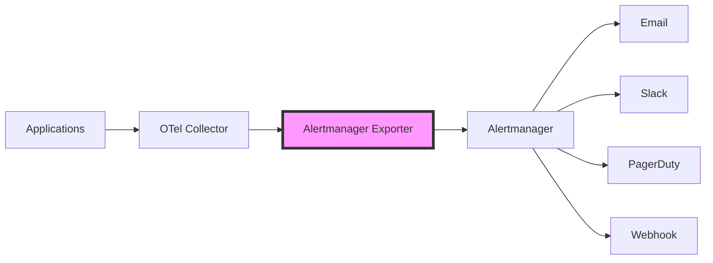

# How to Configure the Alertmanager Exporter in the OpenTelemetry Collector

Author: [nawazdhandala](https://www.github.com/nawazdhandala)

Tags: OpenTelemetry, Collector, Exporter, Alertmanager, Prometheus, Monitoring, Alerting

Description: Learn how to configure the Alertmanager exporter in the OpenTelemetry Collector to send alerts from your telemetry data to Prometheus Alertmanager for centralized alert routing and management.

The Alertmanager exporter enables the OpenTelemetry Collector to send span events and log records to Prometheus Alertmanager, which provides sophisticated alert routing, grouping, silencing, and notification capabilities. This integration allows you to leverage Alertmanager's powerful alert management features while using OpenTelemetry for data collection and processing.

The exporter is a development-status OpenTelemetry Collector contrib component and is not included in the standard Collector distributions. To use these examples, build a custom Collector distribution that includes `github.com/open-telemetry/opentelemetry-collector-contrib/exporter/alertmanagerexporter`.

## Understanding the Alertmanager Exporter

Prometheus Alertmanager is a standalone component that handles alerts sent by client applications such as the Prometheus server or, in this case, the OpenTelemetry Collector. It takes care of deduplicating, grouping, and routing alerts to the correct receiver integrations such as email, PagerDuty, Slack, or webhook endpoints.

The Alertmanager exporter converts OpenTelemetry span events and log records into Alertmanager-compatible alerts. This allows you to turn selected telemetry events into Alertmanager notifications and route those alerts through Alertmanager's mature notification infrastructure.


```mermaid
graph LR
    A[Applications] --> B[OTel Collector]
    B --> C[Alertmanager Exporter]
    C --> D[Alertmanager]
    D --> E[Email]
    D --> F[Slack]
    D --> G[PagerDuty]
    D --> H[Webhook]
    style C fill:#f9f,stroke:#333,stroke-width:4px
```

## Why Use Alertmanager with OpenTelemetry

Integrating Alertmanager with OpenTelemetry provides several benefits:

**Unified Alert Management**: Centralize alert handling from both Prometheus and OpenTelemetry event sources in a single system.

**Advanced Routing**: Use Alertmanager's sophisticated routing rules to send alerts to different teams or systems based on labels and metadata.

**Alert Grouping**: Automatically group related alerts to reduce notification fatigue during incidents.

**Silencing and Inhibition**: Temporarily silence alerts during maintenance windows or use inhibition rules to suppress secondary alerts.

**Multiple Notification Channels**: Configure multiple receivers for different alert types, severity levels, or teams.

## Basic Configuration

Here is a basic configuration for sending selected log records from the OpenTelemetry Collector to Alertmanager:

```yaml
receivers:
  # Receive logs that may contain alert conditions
  otlp:
    protocols:
      grpc:
        endpoint: 0.0.0.0:4317

processors:
  # Drop logs below ERROR severity
  filter:
    error_mode: ignore
    log_conditions:
      - log.severity_number < SEVERITY_NUMBER_ERROR

  # Add attributes that the exporter will use for labels and annotations
  transform:
    error_mode: ignore
    log_statements:
      - context: log
        statements:
          # The exporter maps event.name to the Alertmanager event_name label
          - set(attributes["event.name"], "ApplicationError")
          - set(attributes["service"], resource.attributes["service.name"])
          - set(attributes["alert.severity"], "critical")
          # All log attributes are included as alert annotations
          - set(attributes["summary"], body)
          - 'set(attributes["description"], Concat([body, " from ", resource.attributes["service.name"]], ""))'

  batch:
    timeout: 10s

exporters:
  # Configure Alertmanager exporter
  alertmanager:
    # Alertmanager base endpoint. The exporter appends /api/v2/alerts.
    endpoint: http://alertmanager.example.com:9093
    # Required default severity for alerts
    severity: warning
    # Use this attribute when present instead of the default severity
    severity_attribute: alert.severity
    # Copy these log attributes into Alertmanager labels
    event_labels: [service]
    # Timeout for sending alerts
    timeout: 30s
    # Retry configuration
    retry_on_failure:
      enabled: true
      initial_interval: 5s
      max_interval: 30s
      max_elapsed_time: 300s

service:
  pipelines:
    logs:
      receivers: [otlp]
      processors: [filter, transform, batch]
      exporters: [alertmanager]
```

This configuration receives logs via OTLP, drops logs below error severity, adds alert-related attributes, and sends the remaining logs to Alertmanager. The exporter creates Alertmanager labels such as `event_name`, `severity`, and any configured `event_labels`; the log attributes are included as annotations.

## Alert Labels and Annotations

Alertmanager uses labels to identify, group, and route alerts, while annotations provide additional context. The Alertmanager exporter always sets `event_name` and `severity` labels. Configure `event_labels` to copy selected span event or log record attributes into Alertmanager labels:

```yaml
receivers:
  otlp:
    protocols:
      grpc:
        endpoint: 0.0.0.0:4317

processors:
  transform:
    error_mode: ignore
    log_statements:
      - context: log
        statements:
          # The event_name label in Alertmanager
          - set(attributes["event.name"], "HighErrorRate")

          # Routing labels copied by event_labels
          - set(attributes["service"], resource.attributes["service.name"])
          - set(attributes["environment"], resource.attributes["deployment.environment"])
          - set(attributes["cluster"], resource.attributes["k8s.cluster.name"])
          - set(attributes["namespace"], resource.attributes["k8s.namespace.name"])

          # Severity label for prioritization
          - set(attributes["alert.severity"], "critical")

          # Team label for routing
          - set(attributes["team"], "platform")

          # Annotations for alert context
          - set(attributes["summary"], "High error rate detected")
          - 'set(attributes["description"], Concat(["Error count: ", body], ""))'
          - set(attributes["runbook_url"], "https://wiki.example.com/runbooks/high-error-rate")
          - set(attributes["dashboard_url"], "https://grafana.example.com/d/errors")

  batch:
    timeout: 10s

exporters:
  alertmanager:
    endpoint: http://alertmanager.example.com:9093
    severity: warning
    severity_attribute: alert.severity
    event_labels: [service, environment, cluster, namespace, team]
    timeout: 30s

service:
  pipelines:
    logs:
      receivers: [otlp]
      processors: [transform, batch]
      exporters: [alertmanager]
```

Labels should be used for routing and grouping (service, environment, severity), while annotations provide human-readable context (summary, description, runbook links). Use `event.name` to control the exporter's `event_name` label, and use `event_labels` to choose which attributes should also become labels.

## Secure Configuration with Authentication

For production deployments, secure the connection to Alertmanager using TLS and authentication:

```yaml
receivers:
  otlp:
    protocols:
      grpc:
        endpoint: 0.0.0.0:4317

processors:
  transform:
    error_mode: ignore
    log_statements:
      - context: log
        statements:
          - set(attributes["event.name"], "ServiceAlert")
          - set(attributes["service"], resource.attributes["service.name"])
          - set(attributes["alert.severity"], "warning")

  batch:
    timeout: 10s

exporters:
  alertmanager:
    # Use HTTPS endpoint. The exporter appends /api/v2/alerts.
    endpoint: https://alertmanager.example.com:9093
    severity: warning
    severity_attribute: alert.severity
    event_labels: [service]
    timeout: 30s

    # TLS configuration
    tls:
      insecure: false
      ca_file: /etc/ssl/certs/ca.crt
      cert_file: /etc/ssl/certs/client.crt
      key_file: /etc/ssl/private/client.key
      server_name_override: alertmanager.example.com

    # Authentication headers
    headers:
      Authorization: "Bearer ${ALERTMANAGER_API_TOKEN}"

    # Retry configuration
    retry_on_failure:
      enabled: true
      initial_interval: 5s
      max_interval: 30s
      max_elapsed_time: 300s

service:
  pipelines:
    logs:
      receivers: [otlp]
      processors: [transform, batch]
      exporters: [alertmanager]
```

TLS encryption protects alert data in transit, while authentication ensures that only authorized collectors can send alerts. Store sensitive credentials like API tokens in environment variables rather than hardcoding them in configuration files.

## Multiple Alert Types

Configure different pipelines with filters and transformations to handle various alert types:

```yaml
receivers:
  otlp:
    protocols:
      grpc:
        endpoint: 0.0.0.0:4317

processors:
  # Keep only error-and-above logs in this pipeline
  filter/critical:
    error_mode: ignore
    log_conditions:
      - log.severity_number < SEVERITY_NUMBER_ERROR

  # Keep only warning-range logs in this pipeline
  filter/warning:
    error_mode: ignore
    log_conditions:
      - log.severity_number < SEVERITY_NUMBER_WARN or log.severity_number >= SEVERITY_NUMBER_ERROR

  # Keep only informational-range logs in this pipeline
  filter/info:
    error_mode: ignore
    log_conditions:
      - log.severity_number < SEVERITY_NUMBER_INFO or log.severity_number >= SEVERITY_NUMBER_WARN

  # Transform for critical alerts
  transform/critical:
    error_mode: ignore
    log_statements:
      - context: log
        statements:
          - set(attributes["event.name"], "CriticalError")
          - set(attributes["alert.severity"], "critical")
          - set(attributes["service"], resource.attributes["service.name"])
          - set(attributes["summary"], "Critical error detected")

  # Transform for warning alerts
  transform/warning:
    error_mode: ignore
    log_statements:
      - context: log
        statements:
          - set(attributes["event.name"], "WarningCondition")
          - set(attributes["alert.severity"], "warning")
          - set(attributes["service"], resource.attributes["service.name"])
          - set(attributes["summary"], "Warning condition detected")

  # Transform for info alerts
  transform/info:
    error_mode: ignore
    log_statements:
      - context: log
        statements:
          - set(attributes["event.name"], "InfoNotification")
          - set(attributes["alert.severity"], "info")
          - set(attributes["service"], resource.attributes["service.name"])
          - set(attributes["summary"], "Informational notification")

  batch:
    timeout: 10s

exporters:
  # Critical alerts exporter
  alertmanager/critical:
    endpoint: http://alertmanager.example.com:9093
    severity: warning
    severity_attribute: alert.severity
    event_labels: [service]
    timeout: 30s

  # Warning alerts exporter
  alertmanager/warning:
    endpoint: http://alertmanager.example.com:9093
    severity: warning
    severity_attribute: alert.severity
    event_labels: [service]
    timeout: 30s

  # Info alerts exporter
  alertmanager/info:
    endpoint: http://alertmanager.example.com:9093
    severity: info
    severity_attribute: alert.severity
    event_labels: [service]
    timeout: 30s

service:
  pipelines:
    logs/critical:
      receivers: [otlp]
      processors: [filter/critical, transform/critical, batch]
      exporters: [alertmanager/critical]

    logs/warning:
      receivers: [otlp]
      processors: [filter/warning, transform/warning, batch]
      exporters: [alertmanager/warning]

    logs/info:
      receivers: [otlp]
      processors: [filter/info, transform/info, batch]
      exporters: [alertmanager/info]
```

Multiple pipelines with different filters and transformations allow you to create various alert types based on log characteristics. Each pipeline can set different labels and annotations appropriate for the alert severity.

## Alert Deduplication

Configure stable labels so Alertmanager can deduplicate related alerts:

```yaml
receivers:
  otlp:
    protocols:
      grpc:
        endpoint: 0.0.0.0:4317

processors:
  # Transform to alert format
  transform:
    error_mode: ignore
    log_statements:
      - context: log
        statements:
          - set(attributes["event.name"], "ServiceError")
          - set(attributes["service"], resource.attributes["service.name"])
          - set(attributes["error_type"], attributes["error.type"])
          - set(attributes["alert.severity"], "critical")

  batch:
    timeout: 30s
    send_batch_size: 100

exporters:
  alertmanager:
    endpoint: http://alertmanager.example.com:9093
    severity: warning
    severity_attribute: alert.severity
    event_labels: [service, error_type]
    timeout: 30s

service:
  pipelines:
    logs:
      receivers: [otlp]
      processors: [transform, batch]
      exporters: [alertmanager]
```

Alertmanager deduplicates alerts based on their label set. Keep labels stable and avoid putting high-cardinality values such as request IDs or full error messages in `event_labels`; leave those values as annotations instead.

## Integrating with Metrics-Based Alerting

The Alertmanager exporter supports traces and logs, not metrics pipelines. For metrics-based alerting, export metrics to Prometheus and define Prometheus alerting rules that send alerts to Alertmanager:

```yaml
receivers:
  # Receive metrics
  otlp:
    protocols:
      grpc:
        endpoint: 0.0.0.0:4317

exporters:
  # Expose collected metrics for Prometheus to scrape
  prometheus:
    endpoint: "0.0.0.0:8889"

service:
  pipelines:
    metrics:
      receivers: [otlp]
      exporters: [prometheus]
```

Example Prometheus alerting rule:

```yaml
groups:
  - name: otel-metric-alerts
    rules:
      - alert: HighRequestRate
        expr: rate(http_requests_total[5m]) > 100
        labels:
          severity: warning
        annotations:
          summary: Request rate exceeded threshold
          description: Request rate is above 100 requests per second for 5 minutes.
```

This approach keeps metrics alert evaluation in Prometheus, which is the recommended path for time-series alerting, while Alertmanager handles routing, grouping, silencing, and notification delivery.

## High Availability Setup

For production environments, configure multiple Alertmanager instances for high availability:

```yaml
receivers:
  otlp:
    protocols:
      grpc:
        endpoint: 0.0.0.0:4317

processors:
  transform:
    error_mode: ignore
    log_statements:
      - context: log
        statements:
          - set(attributes["event.name"], "ServiceAlert")
          - set(attributes["service"], resource.attributes["service.name"])
          - set(attributes["alert.severity"], "critical")

  batch:
    timeout: 10s

exporters:
  # Primary Alertmanager instance
  alertmanager/primary:
    endpoint: http://alertmanager-1.example.com:9093
    severity: warning
    severity_attribute: alert.severity
    event_labels: [service]
    timeout: 30s
    retry_on_failure:
      enabled: true
      initial_interval: 5s
      max_interval: 30s

  # Secondary Alertmanager instance
  alertmanager/secondary:
    endpoint: http://alertmanager-2.example.com:9093
    severity: warning
    severity_attribute: alert.severity
    event_labels: [service]
    timeout: 30s
    retry_on_failure:
      enabled: true
      initial_interval: 5s
      max_interval: 30s

  # Tertiary Alertmanager instance
  alertmanager/tertiary:
    endpoint: http://alertmanager-3.example.com:9093
    severity: warning
    severity_attribute: alert.severity
    event_labels: [service]
    timeout: 30s
    retry_on_failure:
      enabled: true
      initial_interval: 5s
      max_interval: 30s

service:
  pipelines:
    logs:
      receivers: [otlp]
      processors: [transform, batch]
      # Send alerts to all Alertmanager instances
      exporters: [alertmanager/primary, alertmanager/secondary, alertmanager/tertiary]
```

Sending alerts to multiple Alertmanager instances ensures that alerts are not lost if one instance fails. Alertmanager instances in the same cluster communicate with each other to deduplicate alerts, so sending the same alerts to all instances does not result in duplicate notifications.

## Kubernetes Deployment

When deploying in Kubernetes, use service discovery to find Alertmanager instances:

```yaml
receivers:
  otlp:
    protocols:
      grpc:
        endpoint: 0.0.0.0:4317

processors:
  transform:
    error_mode: ignore
    log_statements:
      - context: log
        statements:
          - set(attributes["event.name"], "K8sAlert")
          - set(attributes["service"], resource.attributes["service.name"])
          - set(attributes["namespace"], resource.attributes["k8s.namespace.name"])
          - set(attributes["pod"], resource.attributes["k8s.pod.name"])
          - set(attributes["alert.severity"], "warning")

  batch:
    timeout: 10s

exporters:
  alertmanager:
    # Use Kubernetes service DNS name. The exporter appends /api/v2/alerts.
    endpoint: http://alertmanager.monitoring.svc.cluster.local:9093
    severity: warning
    severity_attribute: alert.severity
    event_labels: [service, namespace, pod]
    timeout: 30s
    retry_on_failure:
      enabled: true
      initial_interval: 5s
      max_interval: 30s

service:
  pipelines:
    logs:
      receivers: [otlp]
      processors: [transform, batch]
      exporters: [alertmanager]
```

Kubernetes service DNS provides automatic service discovery and load balancing across Alertmanager pods. Include Kubernetes-specific labels like namespace and pod name in alerts for better context.

## Alertmanager Configuration

Configure Alertmanager to receive and route alerts from the OpenTelemetry Collector. Here is an example Alertmanager configuration:

```yaml
# alertmanager.yml

global:
  resolve_timeout: 5m

route:
  # Default receiver for all alerts
  receiver: 'default'
  # Group alerts by these labels
  group_by: ['event_name', 'service', 'severity']
  # Wait before sending initial notification
  group_wait: 10s
  # Wait before sending notification about new alerts in group
  group_interval: 10s
  # Wait before repeating notifications for an unchanged group
  repeat_interval: 12h

  # Child routes for specific alert types
  routes:
    # Critical alerts go to PagerDuty
    - matchers:
        - severity="critical"
      receiver: 'pagerduty'
      continue: true

    # Warning alerts go to Slack
    - matchers:
        - severity="warning"
      receiver: 'slack'

    # Team-specific routing
    - matchers:
        - team="platform"
      receiver: 'platform-team'

receivers:
  - name: 'default'
    email_configs:
      - to: 'team@example.com'
        from: 'alertmanager@example.com'
        smarthost: 'smtp.example.com:587'
        auth_username: 'alertmanager@example.com'
        auth_password_file: '/etc/alertmanager/secrets/smtp-password'

  - name: 'pagerduty'
    pagerduty_configs:
      - routing_key_file: '/etc/alertmanager/secrets/pagerduty-routing-key'
        description: '{{ .CommonAnnotations.summary }}'

  - name: 'slack'
    slack_configs:
      - api_url_file: '/etc/alertmanager/secrets/slack-webhook-url'
        channel: '#alerts'
        title: '{{ .CommonAnnotations.summary }}'
        text: '{{ .CommonAnnotations.description }}'

  - name: 'platform-team'
    slack_configs:
      - api_url_file: '/etc/alertmanager/secrets/slack-webhook-url'
        channel: '#platform-alerts'

inhibit_rules:
  # Suppress warning alerts if critical alert is firing
  - source_matchers:
      - severity="critical"
    target_matchers:
      - severity="warning"
    equal: ['event_name', 'service']
```

This Alertmanager configuration demonstrates routing alerts to different receivers based on severity and team labels, grouping related alerts, and suppressing lower-severity alerts when higher-severity alerts are active.

## Monitoring and Troubleshooting

Monitor the Alertmanager exporter to ensure alerts are being sent successfully:

```yaml
receivers:
  otlp:
    protocols:
      grpc:
        endpoint: 0.0.0.0:4317

processors:
  transform:
    error_mode: ignore
    log_statements:
      - context: log
        statements:
          - set(attributes["event.name"], "ServiceAlert")
          - set(attributes["service"], resource.attributes["service.name"])

  batch:
    timeout: 10s

exporters:
  alertmanager:
    endpoint: http://alertmanager.example.com:9093
    severity: warning
    event_labels: [service]
    timeout: 30s

service:
  pipelines:
    logs:
      receivers: [otlp]
      processors: [transform, batch]
      exporters: [alertmanager]

  telemetry:
    logs:
      level: info
    metrics:
      readers:
        - pull:
            exporter:
              prometheus:
                host: 0.0.0.0
                port: 8888
```

Monitor these key metrics:

- Exporter send and failure counts
- Alert export latency
- Connection errors to Alertmanager
- Retry attempts and queue behavior

For more information on OpenTelemetry Collector monitoring, see our guide on [monitoring the OpenTelemetry Collector](https://oneuptime.com/blog/post/2026-02-06-google-cloud-monitoring-receiver-opentelemetry-collector/view).

## Best Practices

Follow these best practices when using the Alertmanager exporter:

**Use Meaningful Alert Labels**: Include labels that help Alertmanager route alerts to the correct teams and systems.

**Add Rich Annotations**: Provide context through annotations including summaries, descriptions, runbook links, and dashboard URLs.

**Configure Alert Deduplication**: Use stable labels to prevent duplicate alerts from overwhelming recipients.

**Set Appropriate Timeouts**: Balance responsiveness with reliability when configuring timeouts and retry behavior.

**Secure Alert Transmission**: Use TLS and authentication to protect alert data and prevent unauthorized alert submission.

**Test Alert Routing**: Verify that alerts flow correctly through Alertmanager routing rules to the intended receivers.

**Monitor Export Success**: Track metrics to ensure alerts are being sent successfully and troubleshoot delivery issues.

## Conclusion

The Alertmanager exporter enables powerful integration between OpenTelemetry's event collection capabilities and Prometheus Alertmanager's sophisticated alert management features. By configuring the exporter with appropriate labels, annotations, and routing, you can build a robust alerting system that detects conditions in your telemetry data and delivers notifications through Alertmanager's proven infrastructure.

Use the Alertmanager exporter to centralize alert management across your observability stack, leverage advanced routing and notification features, and ensure that critical alerts reach the right people at the right time. Combined with proper monitoring and security configuration, the Alertmanager exporter becomes a key component of production observability systems.
