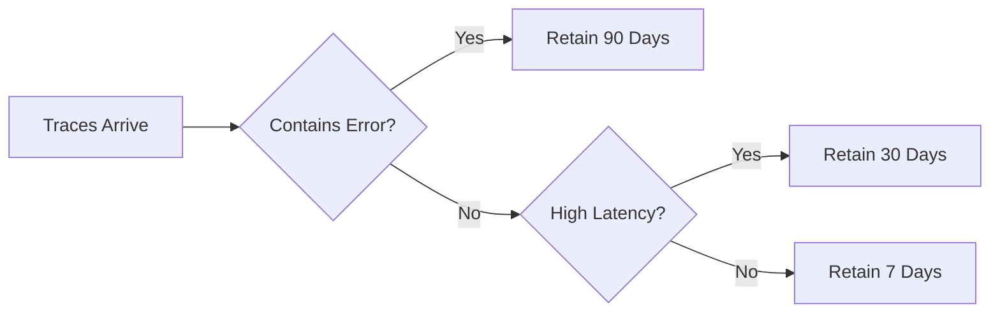

# How to Configure Always-On Sampling for Critical Services

Author: [nawazdhandala](https://www.github.com/nawazdhandala)

Tags: OpenTelemetry, Sampling, Always-On, Tracing, Critical Services, Observability, Production, SRE

Description: Learn how to configure always-on sampling for critical services in OpenTelemetry while keeping costs under control with selective strategies.

---

Some services are too important to sample. When your payment processor handles a transaction, you want a trace of every single request. When your authentication service rejects a login, you want to know exactly what happened. When your order fulfillment pipeline processes a shipment, you need complete visibility.

Always-on sampling means keeping 100% of traces for specific services or operations. This sounds expensive, and it can be if applied carelessly. The key is being surgical about where you apply it. This post covers how to configure always-on sampling in the OpenTelemetry SDK and Collector, how to limit its scope to what actually matters, and how to manage the cost implications.

---

## When Always-On Sampling Makes Sense

Always-on sampling is justified when a service meets one or more of these criteria:

- **Low volume, high value.** A payment service that handles 50 requests per second generates a manageable number of traces, and every one has direct revenue impact.
- **Regulatory or compliance requirements.** Some industries require audit trails for every transaction. Traces can serve as part of that audit trail.
- **Active incident investigation.** You are debugging an intermittent issue and need to capture every occurrence.
- **New service rollout.** During the first few weeks of a new service in production, 100% sampling helps catch issues early.

Always-on sampling does not make sense for high-volume, low-value traffic like health checks, static asset serving, or internal polling loops.

---

## SDK-Level Configuration

The simplest way to enable always-on sampling is in the SDK configuration of the service itself.

### Python

```python
# tracing.py
from opentelemetry import trace
from opentelemetry.sdk.trace import TracerProvider
from opentelemetry.sdk.trace.sampling import ALWAYS_ON
from opentelemetry.sdk.trace.export import BatchSpanProcessor
from opentelemetry.exporter.otlp.proto.grpc.trace_exporter import OTLPSpanExporter
from opentelemetry.sdk.resources import Resource

resource = Resource.create({
    "service.name": "payment-service",
    "service.version": "2.8.1",
    "deployment.environment": "production",
})

# ALWAYS_ON is a built-in sampler that records and exports
# every single span. No traces are dropped.
provider = TracerProvider(
    resource=resource,
    sampler=ALWAYS_ON,
)

exporter = OTLPSpanExporter(endpoint="http://localhost:4317")

# Increase batch size for always-on sampling since you
# will be exporting more spans. The default batch size of
# 512 might cause frequent small exports.
processor = BatchSpanProcessor(
    exporter,
    max_queue_size=8192,
    max_export_batch_size=2048,
    schedule_delay_millis=3000,
)

provider.add_span_processor(processor)
trace.set_tracer_provider(provider)
```

The `BatchSpanProcessor` tuning matters when you are exporting every span. The defaults are designed for sampled workloads. With always-on sampling, you should increase the queue size and batch size to reduce the overhead of frequent small exports.

### Node.js

```javascript
// tracing.js
const { NodeSDK } = require('@opentelemetry/sdk-node');
const { getNodeAutoInstrumentations } = require('@opentelemetry/auto-instrumentations-node');
const { OTLPTraceExporter } = require('@opentelemetry/exporter-trace-otlp-http');
const { Resource } = require('@opentelemetry/resources');
const { AlwaysOnSampler } = require('@opentelemetry/sdk-trace-base');
const { BatchSpanProcessor } = require('@opentelemetry/sdk-trace-base');

const exporter = new OTLPTraceExporter({
  url: 'http://localhost:4318/v1/traces',
});

// Configure a BatchSpanProcessor with larger buffers
// to handle the higher volume from always-on sampling.
const spanProcessor = new BatchSpanProcessor(exporter, {
  maxQueueSize: 8192,
  maxExportBatchSize: 2048,
  scheduledDelayMillis: 3000,
});

const sdk = new NodeSDK({
  resource: new Resource({
    'service.name': 'auth-service',
    'deployment.environment': 'production',
  }),
  // AlwaysOnSampler records every span
  sampler: new AlwaysOnSampler(),
  spanProcessors: [spanProcessor],
  instrumentations: [getNodeAutoInstrumentations()],
});

sdk.start();
```

### Java

```java
// TracingConfig.java
import io.opentelemetry.sdk.trace.SdkTracerProvider;
import io.opentelemetry.sdk.trace.samplers.Sampler;
import io.opentelemetry.sdk.trace.export.BatchSpanProcessor;
import io.opentelemetry.exporter.otlp.trace.OtlpGrpcSpanExporter;
import io.opentelemetry.sdk.resources.Resource;
import io.opentelemetry.api.common.Attributes;
import io.opentelemetry.semconv.ResourceAttributes;

public class TracingConfig {

    public static SdkTracerProvider createProvider() {
        Resource resource = Resource.getDefault().merge(
            Resource.create(Attributes.of(
                ResourceAttributes.SERVICE_NAME, "order-service",
                ResourceAttributes.DEPLOYMENT_ENVIRONMENT, "production"
            ))
        );

        OtlpGrpcSpanExporter exporter = OtlpGrpcSpanExporter.builder()
            .setEndpoint("http://localhost:4317")
            .build();

        // Configure the batch processor for higher throughput.
        // maxQueueSize controls the in-memory buffer before
        // spans are dropped. maxExportBatchSize controls how
        // many spans are sent in a single export call.
        BatchSpanProcessor processor = BatchSpanProcessor.builder(exporter)
            .setMaxQueueSize(8192)
            .setMaxExportBatchSize(2048)
            .setScheduleDelay(java.time.Duration.ofSeconds(3))
            .build();

        // Sampler.alwaysOn() ensures every span is recorded and exported
        return SdkTracerProvider.builder()
            .setResource(resource)
            .setSampler(Sampler.alwaysOn())
            .addSpanProcessor(processor)
            .build();
    }
}
```

### Go

```go
// tracing.go
package tracing

import (
	"context"
	"log"
	"time"

	"go.opentelemetry.io/otel"
	"go.opentelemetry.io/otel/exporters/otlp/otlptrace/otlptracegrpc"
	"go.opentelemetry.io/otel/sdk/resource"
	sdktrace "go.opentelemetry.io/otel/sdk/trace"
	semconv "go.opentelemetry.io/otel/semconv/v1.24.0"
)

func InitTracing(ctx context.Context) func() {
	exporter, err := otlptracegrpc.New(ctx,
		otlptracegrpc.WithEndpoint("localhost:4317"),
		otlptracegrpc.WithInsecure(),
	)
	if err != nil {
		log.Fatalf("failed to create exporter: %v", err)
	}

	res, _ := resource.Merge(
		resource.Default(),
		resource.NewWithAttributes(
			semconv.SchemaURL,
			semconv.ServiceName("fulfillment-service"),
			semconv.DeploymentEnvironment("production"),
		),
	)

	// AlwaysSample returns a sampler that always records spans.
	// Combined with WithBatcher, spans are buffered and exported
	// in batches for efficiency.
	tp := sdktrace.NewTracerProvider(
		sdktrace.WithBatcher(exporter,
			// Increase batch size and timeout for always-on workloads
			sdktrace.WithMaxExportBatchSize(2048),
			sdktrace.WithBatchTimeout(3*time.Second),
			sdktrace.WithMaxQueueSize(8192),
		),
		sdktrace.WithResource(res),
		sdktrace.WithSampler(sdktrace.AlwaysSample()),
	)

	otel.SetTracerProvider(tp)

	return func() {
		if err := tp.Shutdown(ctx); err != nil {
			log.Printf("error shutting down tracer provider: %v", err)
		}
	}
}
```

### Environment Variable Approach

For containerized deployments, you can enable always-on sampling without code changes.

```bash
# Set these in your Kubernetes deployment manifest or Docker Compose file.
# OTEL_TRACES_SAMPLER=always_on means every trace is recorded.
# No OTEL_TRACES_SAMPLER_ARG is needed for always_on.
export OTEL_TRACES_SAMPLER=always_on
export OTEL_SERVICE_NAME=payment-service
export OTEL_EXPORTER_OTLP_ENDPOINT=http://otel-collector:4317
```

This is particularly useful when you want to temporarily enable full sampling during an incident without redeploying the service.

---

## Selective Always-On with a Hybrid Sampler

Running always-on for an entire service is the simplest approach, but sometimes you only need 100% sampling for specific operations within a service. A hybrid sampler lets you do this.

```python
# hybrid_sampler.py
from opentelemetry.sdk.trace.sampling import (
    Sampler,
    SamplingResult,
    Decision,
)
from opentelemetry.context import Context
from opentelemetry.trace import SpanKind


class SelectiveAlwaysOnSampler(Sampler):
    """Always-on for specific operations, probabilistic for the rest.

    This sampler is useful when a service handles both critical
    and non-critical traffic. For example, a gateway service
    that routes payment requests alongside static content requests.
    """

    # Operations that get 100% sampling.
    ALWAYS_SAMPLE_OPERATIONS = {
        "/api/v1/payments",
        "/api/v1/refunds",
        "/api/v1/subscriptions",
        "/api/v1/auth/login",
        "/api/v1/auth/token",
    }

    # Operations that should never be sampled.
    NEVER_SAMPLE_OPERATIONS = {
        "/health",
        "/healthz",
        "/ready",
        "/metrics",
    }

    def __init__(self, default_rate=0.1):
        self._default_rate = default_rate

    def should_sample(
        self,
        parent_context: Context,
        trace_id: int,
        name: str,
        kind: SpanKind = None,
        attributes=None,
        links=None,
    ) -> SamplingResult:
        attrs = attributes or {}
        route = attrs.get("http.route", "") or attrs.get("http.target", "")

        # Always-on for critical routes
        if route in self.ALWAYS_SAMPLE_OPERATIONS:
            return SamplingResult(
                Decision.RECORD_AND_SAMPLE,
                {"sampling.strategy": "always_on"},
            )

        # Never sample noise
        if route in self.NEVER_SAMPLE_OPERATIONS:
            return SamplingResult(Decision.DROP, {})

        # Probabilistic for everything else
        bound = int(self._default_rate * (2**64 - 1))
        trace_id_lower = trace_id & 0xFFFFFFFFFFFFFFFF

        if trace_id_lower < bound:
            return SamplingResult(
                Decision.RECORD_AND_SAMPLE,
                {"sampling.strategy": "probabilistic"},
            )

        return SamplingResult(Decision.DROP, {})

    def get_description(self) -> str:
        return f"SelectiveAlwaysOnSampler(default_rate={self._default_rate})"
```

This approach gives you 100% visibility into payment and auth flows while keeping costs low for everything else. The `sampling.strategy` attribute on each span tells you which rule was applied, making it easy to verify the sampler is working correctly.

---

## Collector-Level Always-On for Specific Services

If you cannot modify the SDK configuration (for example, with third-party services that send you traces), you can implement always-on logic at the Collector level using the filter processor.

```yaml
# otel-collector-config.yaml
receivers:
  otlp:
    protocols:
      grpc:
        endpoint: 0.0.0.0:4317

processors:
  # Use tail sampling with a 100% rate for critical services
  # and a lower rate for everything else.
  tail_sampling:
    decision_wait: 15s
    num_traces: 100000
    expected_new_traces_per_sec: 3000

    policies:
      # Always keep traces that touch critical services
      - name: always-on-payment
        type: string_attribute
        string_attribute:
          key: service.name
          values:
            - payment-service
            - auth-service
            - order-service

      # Keep all errors from any service
      - name: keep-errors
        type: status_code
        status_code:
          status_codes: [ERROR]

      # Probabilistic baseline for non-critical services
      - name: baseline
        type: probabilistic
        probabilistic:
          sampling_percentage: 5

  # Batch processor after sampling to optimize export
  batch:
    send_batch_size: 4096
    timeout: 5s

exporters:
  otlp:
    endpoint: "https://backend.example.com:4317"

service:
  pipelines:
    traces:
      receivers: [otlp]
      processors: [tail_sampling, batch]
      exporters: [otlp]
```

This is a good pattern when you have a mix of critical and non-critical services sending traces to the same Collector. The critical services get 100% retention while the rest get sampled.

---

## Managing Cost with Always-On Sampling

Always-on sampling for even a single service can generate significant data volumes. Here is how to keep costs under control.

### Estimate Your Volume

```
Monthly spans = requests_per_second * seconds_per_month * avg_spans_per_trace
             = 100 * 2,592,000 * 6
             = 1,555,200,000 spans/month
```

At roughly 1 KB per span, that is about 1.5 TB per month for a single service handling 100 requests per second. Make sure your backend can handle this before enabling always-on sampling.

### Reduce Span Count Per Trace

You do not need to trace every internal function call. Focus instrumentation on the boundaries that matter.

```python
# Instead of tracing every internal method:
# (generates 20+ spans per trace)

# Focus on external boundaries:
# - HTTP handler entry
# - Database queries
# - External API calls
# - Message queue operations
# This typically generates 4-8 spans per trace

# Disable auto-instrumentation for internal libraries
# that add noise without value.
from opentelemetry.instrumentation.logging import LoggingInstrumentor

# Only instrument what matters
from opentelemetry.instrumentation.flask import FlaskInstrumentor
from opentelemetry.instrumentation.sqlalchemy import SQLAlchemyInstrumentor
from opentelemetry.instrumentation.requests import RequestsInstrumentor

# These three give you HTTP entry, database, and external call visibility.
# That covers 90% of debugging scenarios.
FlaskInstrumentor().instrument()
SQLAlchemyInstrumentor().instrument()
RequestsInstrumentor().instrument()
```

### Use Span Limits

OpenTelemetry SDKs support limits on attributes, events, and links per span. Setting these prevents individual spans from becoming unexpectedly large.

```python
from opentelemetry.sdk.trace import TracerProvider, SpanLimits

# SpanLimits caps the size of individual spans.
# This prevents a single trace from consuming
# disproportionate storage.
limits = SpanLimits(
    max_attributes=64,
    max_events=128,
    max_links=32,
    max_attribute_length=256,
)

provider = TracerProvider(
    resource=resource,
    sampler=ALWAYS_ON,
    span_limits=limits,
)
```

### Set Up Retention Policies

Even with always-on sampling, you do not need to keep traces forever. Configure your backend with tiered retention.



Most observability backends support retention policies based on attributes. Keep error traces for months, keep normal traces for a week, and let the storage costs stay manageable.

---

## Monitoring Your Sampling Pipeline

When you run always-on sampling, monitor the pipeline itself. If spans are being dropped due to queue overflow or export failures, you lose the guarantee that made always-on worth doing.

Key metrics to watch:

- **Dropped spans**: `otelcol_exporter_send_failed_spans` in the Collector
- **Queue utilization**: If your `BatchSpanProcessor` queue is consistently near capacity, increase the queue size or reduce span volume
- **Export latency**: Slow exports cause queue buildup, which causes drops
- **Collector memory**: Tail-based sampling with always-on policies uses more memory

Set up alerts on these metrics. The whole point of always-on sampling is guaranteeing that you have the traces. A silently failing pipeline defeats that purpose.

---

## Conclusion

Always-on sampling is a powerful tool when applied to the right services. The pattern is straightforward: identify your critical, low-volume services, enable `ALWAYS_ON` or `AlwaysSample()` in the SDK, tune the batch processor for higher throughput, and monitor the pipeline to ensure nothing is being dropped.

The mistake most teams make is applying always-on sampling too broadly. Be selective. Use it for the services where a missing trace could mean a missed bug in a payment flow or a security incident that goes undetected. For everything else, probability-based or tail-based sampling will serve you well at a fraction of the cost.
