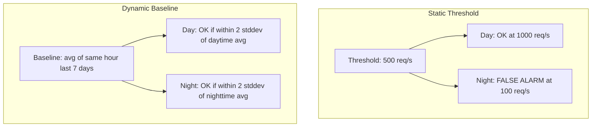

# How to Implement Anomaly-Based Alerting from OpenTelemetry Metrics Using Dynamic Baselines

Author: [nawazdhandala](https://www.github.com/nawazdhandala)

Tags: OpenTelemetry, Anomaly Detection, Dynamic Baselines, Prometheus, Alerting

Description: Implement anomaly-based alerting with dynamic baselines from OpenTelemetry metrics to catch deviations from normal behavior.

Static thresholds break down when your traffic patterns change. An e-commerce site that handles 1,000 requests per second during the day and 100 at night cannot use a single "requests below 500/s" alert without getting false positives every evening. Anomaly-based alerting compares current metric values against a dynamically computed baseline, firing only when behavior deviates significantly from what is normal for that time period.

This post covers how to build dynamic baselines from OpenTelemetry metrics using Prometheus recording rules and statistical methods.

## Static vs. Dynamic Thresholds

Static thresholds are simple but brittle. Dynamic baselines adapt to patterns in your data.



## Step 1: Collect Consistent Metrics via OpenTelemetry

Your OpenTelemetry instrumentation needs to produce stable, consistent metric names. Anomaly detection relies on historical data, so metric names and label sets should not change between deployments.

Standard OTel SDK configuration for request rate metrics:

```python
# Python OpenTelemetry SDK setup
from opentelemetry import metrics
from opentelemetry.sdk.metrics import MeterProvider
from opentelemetry.sdk.metrics.export import PeriodicExportingMetricReader
from opentelemetry.sdk.resources import Resource
from opentelemetry.exporter.otlp.proto.grpc.metric_exporter import OTLPMetricExporter

resource = Resource.create({
    "service.name": "api-gateway",
    "deployment.environment": "production",
})

exporter = OTLPMetricExporter(endpoint="otel-collector:4317")
reader = PeriodicExportingMetricReader(exporter, export_interval_millis=15000)
provider = MeterProvider(resource=resource, metric_readers=[reader])
metrics.set_meter_provider(provider)

meter = provider.get_meter("api-gateway")

# Counter for request rate tracking
request_counter = meter.create_counter(
    name="http.server.requests",
    description="Total HTTP requests",
    unit="1",
)
```

## Step 2: Build Baseline Recording Rules

The baseline represents "normal" behavior. A practical approach is to compute the average and standard deviation over the same time window from previous weeks, accounting for daily and weekly seasonality.

These recording rules compute rolling baselines:

```yaml
# prometheus-recording-rules.yaml
groups:
  - name: dynamic_baselines
    interval: 1m
    rules:
      # Current request rate (5-minute smoothed)
      - record: service:request_rate:5m
        expr: |
          sum by (service_name) (
            rate(otel_http_server_requests_total[5m])
          )

      # Baseline: average of the same hour over the past 7 days
      # Uses offset to look back at the same time each previous day
      - record: service:request_rate:baseline_7d_avg
        expr: |
          (
            service:request_rate:5m offset 1d +
            service:request_rate:5m offset 2d +
            service:request_rate:5m offset 3d +
            service:request_rate:5m offset 4d +
            service:request_rate:5m offset 5d +
            service:request_rate:5m offset 6d +
            service:request_rate:5m offset 7d
          ) / 7

      # Standard deviation across those 7 days
      # Approximation using the range method
      - record: service:request_rate:baseline_7d_stddev
        expr: |
          stddev_over_time(service:request_rate:5m[7d])
```

For a more accurate weekly-seasonal baseline, use recording rules that compare against the same day of the previous weeks:

```yaml
      # Weekly-seasonal baseline (same day of week, past 4 weeks)
      - record: service:request_rate:weekly_baseline
        expr: |
          (
            service:request_rate:5m offset 7d +
            service:request_rate:5m offset 14d +
            service:request_rate:5m offset 21d +
            service:request_rate:5m offset 28d
          ) / 4

      - record: service:request_rate:weekly_stddev
        expr: |
          sqrt(
            (
              (service:request_rate:5m offset 7d - service:request_rate:weekly_baseline) ^ 2 +
              (service:request_rate:5m offset 14d - service:request_rate:weekly_baseline) ^ 2 +
              (service:request_rate:5m offset 21d - service:request_rate:weekly_baseline) ^ 2 +
              (service:request_rate:5m offset 28d - service:request_rate:weekly_baseline) ^ 2
            ) / 4
          )
```

## Step 3: Create Anomaly Alert Rules

An anomaly alert fires when the current value deviates from the baseline by more than a configured number of standard deviations. Two standard deviations catches roughly 95% of normal variation; three catches 99.7%.

These alert rules detect anomalies in both directions:

```yaml
# prometheus-alert-rules.yaml
groups:
  - name: anomaly_alerts
    rules:
      # Traffic drop anomaly - current rate is significantly below baseline
      - alert: TrafficDrop_Anomaly
        expr: |
          service:request_rate:5m
          < (
            service:request_rate:weekly_baseline
            - 3 * service:request_rate:weekly_stddev
          )
          # Require a minimum baseline to avoid alerting on very low traffic services
          and service:request_rate:weekly_baseline > 10
        for: 10m
        labels:
          severity: warning
          alert_type: anomaly
        annotations:
          summary: "Anomalous traffic drop on {{ $labels.service_name }}"
          description: >
            Current rate: {{ $value | humanize }} req/s.
            Expected baseline: {{ printf "service:request_rate:weekly_baseline{service_name='%s'}" $labels.service_name | query | first | value | humanize }} req/s.

      # Traffic spike anomaly - current rate is significantly above baseline
      - alert: TrafficSpike_Anomaly
        expr: |
          service:request_rate:5m
          > (
            service:request_rate:weekly_baseline
            + 3 * service:request_rate:weekly_stddev
          )
          and service:request_rate:weekly_baseline > 10
        for: 10m
        labels:
          severity: warning
          alert_type: anomaly
        annotations:
          summary: "Anomalous traffic spike on {{ $labels.service_name }}"

      # Latency anomaly - P99 deviates from its baseline
      - alert: LatencyAnomaly_P99
        expr: |
          service:http_latency_p99:5m
          > (
            avg_over_time(service:http_latency_p99:5m[7d]) +
            2 * stddev_over_time(service:http_latency_p99:5m[7d])
          )
        for: 5m
        labels:
          severity: critical
          alert_type: anomaly
        annotations:
          summary: "P99 latency anomaly on {{ $labels.service_name }}"
```

## Step 4: Tune Sensitivity

The number of standard deviations controls sensitivity. Start with 3 (very conservative) and decrease to 2 if you are missing real incidents.

```yaml
# Sensitivity tuning parameters as Prometheus variables
# Use different thresholds per service tier

      # Tier-1 services: tighter sensitivity (2 stddev)
      - alert: Tier1_TrafficAnomaly
        expr: |
          service:request_rate:5m{infrastructure_tier="tier-1"}
          < (service:request_rate:weekly_baseline - 2 * service:request_rate:weekly_stddev)
        for: 5m
        labels:
          severity: critical

      # Tier-2 services: standard sensitivity (3 stddev)
      - alert: Tier2_TrafficAnomaly
        expr: |
          service:request_rate:5m{infrastructure_tier="tier-2"}
          < (service:request_rate:weekly_baseline - 3 * service:request_rate:weekly_stddev)
        for: 15m
        labels:
          severity: warning
```

## Limitations to Keep in Mind

Prometheus-based anomaly detection has practical limits. It works well for metrics with predictable seasonal patterns but struggles with irregular traffic. The `offset` approach requires that your Prometheus retention covers the lookback window - 28 days of offset requires at least 28 days of data retention. Services with highly variable traffic or very low volume may produce unreliable baselines. For those cases, consider exporting OpenTelemetry metrics to a dedicated anomaly detection system that uses more sophisticated algorithms.
