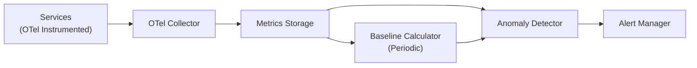

# How to Build Automated Anomaly Detection from OpenTelemetry Metrics

Author: [nawazdhandala](https://www.github.com/nawazdhandala)

Tags: OpenTelemetry, Anomaly Detection, Metrics, Machine Learning, Alerting, Observability, Automation

Description: Learn how to build automated anomaly detection systems using OpenTelemetry metrics, from simple statistical methods to more advanced approaches for catching unusual behavior in production.

---

Static alert thresholds break down as your system grows. Setting a CPU alert at 80% might work when your traffic is steady, but what about services with daily cycles, weekly patterns, or seasonal spikes? A threshold that makes sense on a Tuesday morning will fire false alarms every Friday afternoon when traffic naturally peaks.

Anomaly detection solves this by learning what "normal" looks like for your metrics and flagging deviations from that baseline. When you combine anomaly detection with the rich, structured metrics from OpenTelemetry, you get alerts that adapt to your system's natural behavior patterns.

This guide walks through building anomaly detection on top of OpenTelemetry metrics, starting with simple statistical methods and progressing to more sophisticated approaches.

---

## Architecture



The anomaly detection system has two components: a baseline calculator that periodically recomputes what "normal" looks like, and a detector that compares incoming metrics against those baselines in near-real-time.

---

## Collecting the Right Metrics

Not every metric benefits from anomaly detection. Focus on metrics where the expected value varies naturally over time, making static thresholds impractical.

```python
# anomaly_metrics.py
from opentelemetry import metrics
from opentelemetry.sdk.metrics import MeterProvider
from opentelemetry.sdk.metrics.export import PeriodicExportingMetricReader
from opentelemetry.exporter.otlp.proto.http.metric_exporter import OTLPMetricExporter
from opentelemetry.sdk.resources import Resource, SERVICE_NAME

resource = Resource.create({SERVICE_NAME: "checkout-service"})
reader = PeriodicExportingMetricReader(
    OTLPMetricExporter(endpoint="https://otel.oneuptime.com/v1/metrics"),
    export_interval_millis=10000,
)
provider = MeterProvider(resource=resource, metric_readers=[reader])
metrics.set_meter_provider(provider)
meter = metrics.get_meter("anomaly.detection")

# Request rate is a great candidate for anomaly detection
# because it follows predictable daily/weekly patterns
request_rate = meter.create_counter(
    name="http.requests.total",
    description="Total HTTP requests",
    unit="requests",
)

# Response latency can shift gradually due to data growth
# or suddenly due to infrastructure issues
request_duration = meter.create_histogram(
    name="http.request.duration",
    description="HTTP request duration",
    unit="ms",
)

# Error rate should stay consistently low
# Any significant increase is worth investigating
error_count = meter.create_counter(
    name="http.errors.total",
    description="Total HTTP errors",
    unit="errors",
)
```

These three metrics cover the most important signals for anomaly detection. Request rate captures traffic anomalies, latency captures performance degradation, and error count captures reliability issues.

---

## Building a Statistical Baseline

The simplest approach to anomaly detection uses a rolling window of historical data to establish what is normal. The z-score method works well for metrics that follow a roughly normal distribution.

```python
# baseline.py
import numpy as np
from datetime import datetime, timedelta
from dataclasses import dataclass
from typing import Optional

@dataclass
class MetricBaseline:
    """Statistical baseline for a metric at a specific time window."""
    metric_name: str
    hour_of_day: int
    day_of_week: int
    mean: float
    std_dev: float
    sample_count: int
    last_updated: datetime

class BaselineCalculator:
    """
    Calculates statistical baselines for metrics, segmented by
    hour of day and day of week to account for natural traffic patterns.
    """

    def __init__(self, metrics_client, lookback_weeks=4):
        self.metrics_client = metrics_client
        self.lookback_weeks = lookback_weeks
        self.baselines = {}

    def calculate_baseline(self, metric_name: str, labels: dict) -> dict:
        """
        Calculate baselines for each hour-of-day and day-of-week combination.
        Uses the last N weeks of data to establish normal patterns.
        """
        end_time = datetime.utcnow()
        start_time = end_time - timedelta(weeks=self.lookback_weeks)

        # Query hourly aggregated data for the lookback period
        hourly_data = self.metrics_client.query_range(
            metric=metric_name,
            labels=labels,
            start=start_time,
            end=end_time,
            step="1h",
        )

        # Group by (day_of_week, hour_of_day)
        grouped = {}
        for timestamp, value in hourly_data:
            dt = datetime.fromtimestamp(timestamp)
            key = (dt.weekday(), dt.hour)
            if key not in grouped:
                grouped[key] = []
            grouped[key].append(value)

        # Calculate mean and standard deviation for each group
        baselines = {}
        for (dow, hour), values in grouped.items():
            values_array = np.array(values)
            baselines[(dow, hour)] = MetricBaseline(
                metric_name=metric_name,
                hour_of_day=hour,
                day_of_week=dow,
                mean=float(np.mean(values_array)),
                std_dev=float(np.std(values_array)),
                sample_count=len(values),
                last_updated=end_time,
            )

        self.baselines[metric_name] = baselines
        return baselines
```

The key insight here is segmenting by hour of day and day of week. Without this, your Tuesday 3 AM traffic would be compared against the same baseline as your Friday 2 PM traffic, leading to constant false alarms.

---

## The Anomaly Detector

With baselines established, the detector compares current metric values against the expected range and flags anything that falls outside a configurable number of standard deviations.

```python
# detector.py
from dataclasses import dataclass
from datetime import datetime
from enum import Enum
from typing import Optional

class Severity(Enum):
    WARNING = "warning"
    CRITICAL = "critical"

@dataclass
class Anomaly:
    """Represents a detected anomaly in a metric."""
    metric_name: str
    timestamp: datetime
    actual_value: float
    expected_mean: float
    expected_std: float
    z_score: float
    severity: Severity
    description: str

class AnomalyDetector:
    """
    Detects anomalies by comparing current metric values against
    time-segmented statistical baselines.
    """

    def __init__(
        self,
        baselines: dict,
        warning_threshold: float = 2.5,
        critical_threshold: float = 3.5,
        min_samples: int = 10,
    ):
        self.baselines = baselines
        self.warning_threshold = warning_threshold
        self.critical_threshold = critical_threshold
        self.min_samples = min_samples

    def check(self, metric_name: str, value: float, timestamp: datetime) -> Optional[Anomaly]:
        """
        Check if a metric value is anomalous based on the baseline
        for the corresponding time window.
        """
        dow = timestamp.weekday()
        hour = timestamp.hour
        key = (dow, hour)

        # Look up the baseline for this time slot
        metric_baselines = self.baselines.get(metric_name, {})
        baseline = metric_baselines.get(key)

        if baseline is None or baseline.sample_count < self.min_samples:
            return None  # Not enough data to detect anomalies

        # Avoid division by zero for very stable metrics
        if baseline.std_dev < 0.001:
            baseline.std_dev = 0.001

        # Calculate the z-score
        z_score = abs(value - baseline.mean) / baseline.std_dev

        if z_score >= self.critical_threshold:
            severity = Severity.CRITICAL
        elif z_score >= self.warning_threshold:
            severity = Severity.WARNING
        else:
            return None  # Within normal range

        direction = "above" if value > baseline.mean else "below"

        return Anomaly(
            metric_name=metric_name,
            timestamp=timestamp,
            actual_value=value,
            expected_mean=baseline.mean,
            expected_std=baseline.std_dev,
            z_score=round(z_score, 2),
            severity=severity,
            description=(
                f"{metric_name} is {z_score:.1f} standard deviations {direction} normal. "
                f"Current: {value:.2f}, Expected: {baseline.mean:.2f} "
                f"(+/- {baseline.std_dev:.2f})"
            ),
        )
```

The `min_samples` parameter is important. Without enough historical data points for a given time slot, the baseline is unreliable and you should not use it for alerting. Ten samples means you need at least ten weeks of data for complete coverage of all hour and day-of-week combinations.

---

## Feeding Anomalies Back into OpenTelemetry

When you detect an anomaly, record it as an OpenTelemetry metric so it shows up in your existing dashboards and alerting pipelines.

```python
# anomaly_reporter.py
from opentelemetry import metrics

meter = metrics.get_meter("anomaly.reporting")

# Gauge that reports the current z-score for each monitored metric
anomaly_score = meter.create_gauge(
    name="anomaly.z_score",
    description="Current z-score indicating deviation from baseline",
    unit="score",
)

# Counter for total anomalies detected
anomaly_count = meter.create_counter(
    name="anomaly.detections.total",
    description="Total number of anomalies detected",
    unit="anomalies",
)

def report_anomaly(anomaly: Anomaly):
    """Report a detected anomaly as OpenTelemetry metrics."""
    attributes = {
        "metric.name": anomaly.metric_name,
        "anomaly.severity": anomaly.severity.value,
    }

    anomaly_score.set(anomaly.z_score, attributes)
    anomaly_count.add(1, attributes)
```

By publishing anomaly detection results as OpenTelemetry metrics, you can use your existing alerting rules to act on them. Set up an alert rule that fires when `anomaly.z_score` exceeds your critical threshold for more than two consecutive data points, which helps filter out momentary spikes.

---

## Handling Common Pitfalls

### Dealing with Seasonal Changes

The weekly baseline approach handles daily and weekly patterns, but not longer seasonal changes. If your business has strong monthly or quarterly patterns, extend the baseline window or add a trend component.

### Avoiding Alert Fatigue

Start with a high critical threshold (3.5 or 4 standard deviations) and tune downward only if you are missing real issues. It is better to miss a subtle anomaly than to generate so many false alarms that people start ignoring alerts.

### Cold Start Problem

New services will not have enough historical data for reliable baselines. During the cold start period, fall back to simple static thresholds while the baseline accumulates enough data. After a few weeks, you can switch to anomaly-based alerting.

---

## Summary

Anomaly detection built on OpenTelemetry metrics gives you adaptive alerting that follows your system's natural patterns. Start with the z-score approach described here, which is surprisingly effective for most operational metrics. As you gain experience with the system, you can explore more sophisticated methods like DBSCAN clustering or time series decomposition for metrics with complex seasonal patterns. The most important thing is that your anomaly detection speaks the same language as the rest of your observability stack, because it is all built on OpenTelemetry.
