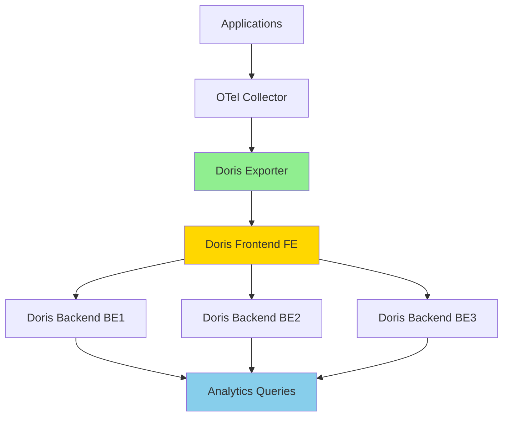

# How to Configure the Apache Doris Exporter in the OpenTelemetry Collector

Author: [nawazdhandala](https://www.github.com/nawazdhandala)

Tags: OpenTelemetry, Collector, Exporters, Apache Doris, Analytics, Data Warehouse, MPP, Real-time

Description: Configure the Apache Doris exporter in OpenTelemetry Collector to send observability data to Apache Doris for high-performance analytics and real-time queries.

Apache Doris is a high-performance, real-time analytical database based on MPP (Massively Parallel Processing) architecture. The Apache Doris exporter for OpenTelemetry Collector enables you to send traces, metrics, and logs to Doris for large-scale analytical processing, making it an excellent choice for organizations that need to perform complex analytics on their observability data or integrate telemetry with business intelligence systems.

## Understanding the Apache Doris Exporter

Apache Doris excels at real-time analytics with sub-second query response times on massive datasets. The OpenTelemetry exporter leverages Doris's Stream Load capability to efficiently ingest telemetry data in real-time. Unlike traditional observability backends, Doris provides a unified platform where you can correlate observability data with business metrics using standard SQL.

Key advantages of using Apache Doris for observability:

- **Real-time Analytics**: Query billions of records with sub-second latency
- **MPP Architecture**: Distributed processing scales horizontally
- **Standard SQL**: Use familiar SQL for complex analytical queries
- **Cost-effective Storage**: Columnar storage with compression reduces costs
- **High Ingestion Rate**: Handle millions of events per second

## Architecture Overview

Understanding how Apache Doris fits into your observability architecture:



## Prerequisites

Before configuring the Apache Doris exporter:

1. Apache Doris cluster deployed and accessible
2. Doris database and tables created for telemetry data
3. User credentials with write permissions
4. OpenTelemetry Collector with the Doris exporter installed
5. Network connectivity to Doris Frontend nodes

## Setting Up Doris Tables

First, create appropriate tables in Apache Doris for your telemetry data. Here's a schema for distributed traces:

```sql
-- Create database for observability data
CREATE DATABASE IF NOT EXISTS observability;

-- Traces table optimized for analytical queries
CREATE TABLE observability.otel_traces (
    trace_id VARCHAR(32),
    span_id VARCHAR(16),
    parent_span_id VARCHAR(16),
    trace_state VARCHAR(256),
    span_name VARCHAR(256),
    span_kind VARCHAR(32),
    start_time_unix_nano BIGINT,
    end_time_unix_nano BIGINT,
    duration_ms BIGINT,
    status_code VARCHAR(32),
    status_message TEXT,
    service_name VARCHAR(128),
    service_namespace VARCHAR(128),
    service_version VARCHAR(32),
    resource_attributes JSON,
    span_attributes JSON,
    events JSON,
    links JSON
)
DUPLICATE KEY(trace_id, span_id)
DISTRIBUTED BY HASH(trace_id) BUCKETS 32
PROPERTIES (
    "replication_num" = "3",
    "storage_medium" = "SSD",
    "compression" = "LZ4"
);

-- Create index for faster queries
CREATE INDEX idx_service_time ON observability.otel_traces(service_name, start_time_unix_nano);
```

Create tables for metrics:

```sql
-- Metrics table for time-series data
CREATE TABLE observability.otel_metrics (
    metric_name VARCHAR(256),
    metric_type VARCHAR(32),
    metric_value DOUBLE,
    timestamp_unix_nano BIGINT,
    service_name VARCHAR(128),
    service_namespace VARCHAR(128),
    resource_attributes JSON,
    metric_attributes JSON,
    exemplars JSON
)
DUPLICATE KEY(metric_name, timestamp_unix_nano)
DISTRIBUTED BY HASH(metric_name) BUCKETS 32
PROPERTIES (
    "replication_num" = "3",
    "storage_medium" = "SSD",
    "compression" = "LZ4"
);
```

Create tables for logs:

```sql
-- Logs table for structured log data
CREATE TABLE observability.otel_logs (
    timestamp_unix_nano BIGINT,
    observed_timestamp_unix_nano BIGINT,
    severity_number INT,
    severity_text VARCHAR(32),
    body TEXT,
    service_name VARCHAR(128),
    service_namespace VARCHAR(128),
    trace_id VARCHAR(32),
    span_id VARCHAR(16),
    resource_attributes JSON,
    log_attributes JSON
)
DUPLICATE KEY(timestamp_unix_nano)
DISTRIBUTED BY HASH(timestamp_unix_nano) BUCKETS 32
PROPERTIES (
    "replication_num" = "3",
    "storage_medium" = "HDD",
    "compression" = "ZSTD"
);

-- Create index for trace correlation
CREATE INDEX idx_trace ON observability.otel_logs(trace_id, span_id);
```

## Basic Configuration

Here's a basic configuration for the Apache Doris exporter:

```yaml
# Basic Apache Doris exporter configuration
exporters:
  doris:
    # Doris Frontend HTTP endpoint
    # Use the HTTP port (default 8030) not MySQL port
    endpoint: http://doris-fe.example.com:8030

    # Database and table information
    database: observability
    table: otel_traces

    # Authentication credentials
    username: ${env:DORIS_USERNAME}
    password: ${env:DORIS_PASSWORD}

    # Timeout for HTTP requests
    timeout: 30s

receivers:
  otlp:
    protocols:
      grpc:
        endpoint: 0.0.0.0:4317

processors:
  batch:
    # Batch data for efficient loading
    timeout: 10s
    send_batch_size: 1000

service:
  pipelines:
    traces:
      receivers: [otlp]
      processors: [batch]
      exporters: [doris]
```

## Advanced Traces Configuration

For production deployments with high throughput:

```yaml
exporters:
  doris/traces:
    # Doris Frontend endpoint with load balancer
    endpoint: http://doris-lb.example.com:8030

    # Database and table configuration
    database: observability
    table: otel_traces

    # Authentication
    username: ${env:DORIS_USERNAME}
    password: ${env:DORIS_PASSWORD}

    # Stream Load parameters for performance tuning
    stream_load:
      # Format for data (json, csv, or parquet)
      format: json

      # Maximum size per Stream Load request (in bytes)
      # Default is 10GB, adjust based on your setup
      max_filter_ratio: 0.1

      # Timeout for each Stream Load
      timeout: 300

      # Enable strict mode for data validation
      strict_mode: false

      # Number of parallel Stream Load channels
      channels: 4

    # HTTP client configuration
    timeout: 60s

    # Retry configuration for failed loads
    retry_on_failure:
      enabled: true
      initial_interval: 5s
      max_interval: 30s
      max_elapsed_time: 300s

    # Queue settings for backpressure handling
    sending_queue:
      enabled: true
      num_consumers: 10
      queue_size: 5000
      storage_type: file_storage

    # Compression for data transfer
    compression: gzip

receivers:
  otlp:
    protocols:
      grpc:
        endpoint: 0.0.0.0:4317
        max_recv_msg_size_mib: 32

processors:
  # Batch processor optimized for Doris
  batch:
    timeout: 15s
    send_batch_size: 5000
    send_batch_max_size: 10000

  # Transform spans to match Doris schema
  transform:
    trace_statements:
      - context: span
        statements:
          # Calculate duration in milliseconds
          - set(attributes["duration_ms"], (end_time_unix_nano() - start_time_unix_nano()) / 1000000)
          # Extract service information
          - set(attributes["service_name"], resource.attributes["service.name"])
          - set(attributes["service_namespace"], resource.attributes["service.namespace"])

  # Add resource detection
  resourcedetection:
    detectors: [env, system, docker]
    timeout: 5s

  # Memory limiter
  memory_limiter:
    check_interval: 1s
    limit_mib: 2048
    spike_limit_mib: 512

service:
  pipelines:
    traces:
      receivers: [otlp]
      processors: [memory_limiter, resourcedetection, transform, batch]
      exporters: [doris/traces]
```

## Configuring Metrics Export

Send metrics to Apache Doris for time-series analytics:

```yaml
exporters:
  doris/metrics:
    endpoint: http://doris-fe.example.com:8030
    database: observability
    table: otel_metrics

    username: ${env:DORIS_USERNAME}
    password: ${env:DORIS_PASSWORD}

    stream_load:
      format: json
      max_filter_ratio: 0.1
      timeout: 300
      channels: 4

    timeout: 60s

    retry_on_failure:
      enabled: true
      initial_interval: 5s
      max_interval: 30s

    sending_queue:
      enabled: true
      num_consumers: 8
      queue_size: 10000

    compression: gzip

receivers:
  otlp:
    protocols:
      grpc:
        endpoint: 0.0.0.0:4317

  # Collect system metrics
  hostmetrics:
    collection_interval: 30s
    scrapers:
      cpu:
        metrics:
          system.cpu.utilization:
            enabled: true
      memory:
        metrics:
          system.memory.utilization:
            enabled: true
      disk:
      network:
      load:

  # Scrape Prometheus metrics
  prometheus:
    config:
      scrape_configs:
        - job_name: 'application'
          scrape_interval: 30s
          static_configs:
            - targets: ['localhost:8080']

processors:
  batch:
    timeout: 10s
    send_batch_size: 2000

  # Transform metrics for Doris schema
  metricstransform:
    transforms:
      - include: .*
        match_type: regexp
        action: update
        operations:
          - action: add_label
            new_label: environment
            new_value: production

  resource:
    attributes:
      - key: service.name
        value: ${env:SERVICE_NAME}
        action: upsert

service:
  pipelines:
    metrics:
      receivers: [otlp, hostmetrics, prometheus]
      processors: [resource, metricstransform, batch]
      exporters: [doris/metrics]
```

## Configuring Logs Export

Configure structured logs export to Apache Doris:

```yaml
exporters:
  doris/logs:
    endpoint: http://doris-fe.example.com:8030
    database: observability
    table: otel_logs

    username: ${env:DORIS_USERNAME}
    password: ${env:DORIS_PASSWORD}

    stream_load:
      format: json
      max_filter_ratio: 0.05
      timeout: 300
      channels: 6

    timeout: 60s

    retry_on_failure:
      enabled: true
      initial_interval: 5s
      max_interval: 60s
      max_elapsed_time: 600s

    sending_queue:
      enabled: true
      num_consumers: 8
      queue_size: 20000

    compression: gzip

receivers:
  otlp:
    protocols:
      grpc:
        endpoint: 0.0.0.0:4317

  # Collect application logs from files
  filelog:
    include:
      - /var/log/app/**/*.log
    exclude:
      - /var/log/app/**/*.gz

    # JSON log parsing
    operators:
      - type: json_parser
        parse_from: body
        timestamp:
          parse_from: attributes.timestamp
          layout: '%Y-%m-%dT%H:%M:%S.%LZ'

      # Severity parsing
      - type: severity_parser
        parse_from: attributes.level
        mapping:
          debug: debug
          info: info
          warning: warn
          error: error
          fatal: fatal

processors:
  batch:
    timeout: 5s
    send_batch_size: 1000

  # Filter unnecessary logs
  filter:
    logs:
      exclude:
        match_type: regexp
        record_attributes:
          - key: message
            value: ".*healthcheck.*"

  # Add resource attributes
  resource:
    attributes:
      - key: service.name
        value: web-app
        action: upsert
      - key: deployment.environment
        value: production
        action: upsert

service:
  pipelines:
    logs:
      receivers: [otlp, filelog]
      processors: [filter, resource, batch]
      exporters: [doris/logs]
```

## Complete Multi-Signal Configuration

Comprehensive configuration handling all telemetry types:

```yaml
receivers:
  # OTLP receiver for all signals
  otlp:
    protocols:
      grpc:
        endpoint: 0.0.0.0:4317
      http:
        endpoint: 0.0.0.0:4318

  # Host metrics
  hostmetrics:
    collection_interval: 30s
    scrapers:
      cpu:
      memory:
      disk:
      network:

  # Application logs
  filelog:
    include:
      - /var/log/app/*.log

processors:
  # Separate batch processors for optimal performance
  batch/traces:
    timeout: 15s
    send_batch_size: 5000

  batch/metrics:
    timeout: 10s
    send_batch_size: 2000

  batch/logs:
    timeout: 5s
    send_batch_size: 1000

  # Resource processor for common attributes
  resource:
    attributes:
      - key: deployment.environment
        value: production
        action: upsert
      - key: cluster.name
        value: ${env:CLUSTER_NAME}
        action: upsert

  # Memory limiter
  memory_limiter:
    check_interval: 1s
    limit_mib: 4096
    spike_limit_mib: 1024

exporters:
  # Traces to Doris
  doris/traces:
    endpoint: http://doris-fe.example.com:8030
    database: observability
    table: otel_traces
    username: ${env:DORIS_USERNAME}
    password: ${env:DORIS_PASSWORD}
    stream_load:
      format: json
      channels: 4
    timeout: 60s
    compression: gzip
    retry_on_failure:
      enabled: true
    sending_queue:
      enabled: true
      num_consumers: 10
      queue_size: 5000

  # Metrics to Doris
  doris/metrics:
    endpoint: http://doris-fe.example.com:8030
    database: observability
    table: otel_metrics
    username: ${env:DORIS_USERNAME}
    password: ${env:DORIS_PASSWORD}
    stream_load:
      format: json
      channels: 4
    timeout: 60s
    compression: gzip
    retry_on_failure:
      enabled: true
    sending_queue:
      enabled: true
      num_consumers: 8
      queue_size: 10000

  # Logs to Doris
  doris/logs:
    endpoint: http://doris-fe.example.com:8030
    database: observability
    table: otel_logs
    username: ${env:DORIS_USERNAME}
    password: ${env:DORIS_PASSWORD}
    stream_load:
      format: json
      channels: 6
    timeout: 60s
    compression: gzip
    retry_on_failure:
      enabled: true
    sending_queue:
      enabled: true
      num_consumers: 8
      queue_size: 20000

service:
  pipelines:
    traces:
      receivers: [otlp]
      processors: [memory_limiter, resource, batch/traces]
      exporters: [doris/traces]

    metrics:
      receivers: [otlp, hostmetrics]
      processors: [memory_limiter, resource, batch/metrics]
      exporters: [doris/metrics]

    logs:
      receivers: [otlp, filelog]
      processors: [memory_limiter, resource, batch/logs]
      exporters: [doris/logs]
```

## Analytical Queries on Doris

Once data is in Apache Doris, you can run powerful analytical queries. Here are some examples:

**Calculate request latency percentiles by service:**

```sql
SELECT
    service_name,
    quantile_state(0.50)(duration_ms) as p50_ms,
    quantile_state(0.95)(duration_ms) as p95_ms,
    quantile_state(0.99)(duration_ms) as p99_ms,
    COUNT(*) as request_count
FROM observability.otel_traces
WHERE start_time_unix_nano >= unix_timestamp(now() - INTERVAL 1 HOUR) * 1000000000
    AND span_kind = 'SPAN_KIND_SERVER'
GROUP BY service_name
ORDER BY p99_ms DESC;
```

**Analyze error rates across services:**

```sql
SELECT
    service_name,
    COUNT(*) as total_spans,
    SUM(CASE WHEN status_code = 'STATUS_CODE_ERROR' THEN 1 ELSE 0 END) as error_count,
    (error_count / total_spans) * 100 as error_rate_pct
FROM observability.otel_traces
WHERE start_time_unix_nano >= unix_timestamp(now() - INTERVAL 1 HOUR) * 1000000000
GROUP BY service_name
HAVING error_count > 0
ORDER BY error_rate_pct DESC;
```

**Trace correlation with logs:**

```sql
SELECT
    t.trace_id,
    t.span_name,
    t.service_name,
    t.duration_ms,
    l.severity_text,
    l.body as log_message
FROM observability.otel_traces t
INNER JOIN observability.otel_logs l
    ON t.trace_id = l.trace_id
WHERE t.start_time_unix_nano >= unix_timestamp(now() - INTERVAL 1 HOUR) * 1000000000
    AND t.status_code = 'STATUS_CODE_ERROR'
ORDER BY t.start_time_unix_nano DESC
LIMIT 100;
```

## Performance Optimization

Optimize Apache Doris for high-volume observability data:

**Use Partitioning:**

```sql
-- Partition traces table by date for efficient querying
CREATE TABLE observability.otel_traces_partitioned (
    -- columns definition same as before
)
DUPLICATE KEY(trace_id, span_id)
PARTITION BY RANGE(FROM_UNIXTIME(start_time_unix_nano / 1000000000)) (
    PARTITION p20260201 VALUES LESS THAN ("2026-02-02"),
    PARTITION p20260202 VALUES LESS THAN ("2026-02-03"),
    PARTITION p20260203 VALUES LESS THAN ("2026-02-04")
)
DISTRIBUTED BY HASH(trace_id) BUCKETS 32
PROPERTIES (
    "replication_num" = "3",
    "dynamic_partition.enable" = "true",
    "dynamic_partition.time_unit" = "DAY",
    "dynamic_partition.start" = "-7",
    "dynamic_partition.end" = "3",
    "dynamic_partition.prefix" = "p",
    "dynamic_partition.buckets" = "32"
);
```

**Create Materialized Views for common queries:**

```sql
-- Materialized view for service latency aggregations
CREATE MATERIALIZED VIEW mv_service_latency AS
SELECT
    service_name,
    FROM_UNIXTIME(start_time_unix_nano / 1000000000, '%Y-%m-%d %H:%i:00') as time_bucket,
    AVG(duration_ms) as avg_duration,
    COUNT(*) as request_count
FROM observability.otel_traces
WHERE span_kind = 'SPAN_KIND_SERVER'
GROUP BY service_name, time_bucket;
```

## High Availability Configuration

Configure multiple Doris Frontend nodes for high availability:

```yaml
exporters:
  doris:
    # Use DNS with multiple A records or load balancer
    endpoint: http://doris-fe-lb.example.com:8030

    # Or specify multiple endpoints
    endpoints:
      - http://doris-fe-1.example.com:8030
      - http://doris-fe-2.example.com:8030
      - http://doris-fe-3.example.com:8030

    # Load balancing strategy
    load_balancing:
      strategy: round_robin

    database: observability
    table: otel_traces
    username: ${env:DORIS_USERNAME}
    password: ${env:DORIS_PASSWORD}
```

## Security Best Practices

1. **Use Strong Authentication**: Always use strong passwords and rotate credentials regularly.

2. **Enable TLS**: Configure HTTPS for Doris Frontend endpoints in production.

3. **Implement Access Control**: Use Doris's role-based access control to limit permissions.

4. **Network Isolation**: Deploy Doris in a private network and restrict access.

5. **Audit Logging**: Enable Doris audit logs to track data access patterns.

## Troubleshooting

Common issues and solutions:

**Stream Load Failures**: Check Doris logs for detailed error messages. Verify table schema matches incoming data structure.

**Performance Degradation**: Monitor Doris BE nodes for resource constraints. Consider adding more BE nodes or adjusting bucket counts.

**Data Quality Issues**: Enable strict mode in Stream Load to reject malformed data and investigate source.

**Connection Timeouts**: Increase timeout settings and verify network connectivity to Doris FE nodes.

**Memory Issues**: Tune batch sizes and queue sizes based on available memory and data volume.

## Best Practices

1. **Design Schema Carefully**: Plan your table schemas based on query patterns before ingesting data.

2. **Use Appropriate Partitioning**: Partition tables by time for efficient query pruning and data lifecycle management.

3. **Implement Data Retention**: Use Doris's dynamic partitioning to automatically manage old data.

4. **Monitor Cluster Health**: Use Doris's built-in monitoring and alerting capabilities.

5. **Optimize Batch Sizes**: Larger batches improve throughput but increase latency. Find the right balance.

## Related Resources

Explore more about OpenTelemetry and data analytics:

- [OpenTelemetry Data Modeling Best Practices](https://oneuptime.com/blog/post/opentelemetry-data-modeling/view)
- [Building Analytics on Observability Data](https://oneuptime.com/blog/post/observability-analytics/view)

## Conclusion

The Apache Doris exporter enables powerful analytical capabilities over your OpenTelemetry data. By combining OpenTelemetry's comprehensive telemetry collection with Doris's high-performance MPP database, you can run complex analytical queries on massive datasets with sub-second response times. This integration is particularly valuable for organizations that need to correlate observability data with business metrics or build custom analytics applications. Start with the basic configuration and gradually optimize based on your data volume and query requirements.
