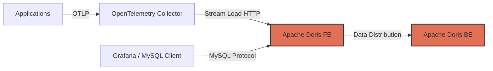

# How to Use Apache Doris as an OpenTelemetry Analytics Backend

Author: [nawazdhandala](https://www.github.com/nawazdhandala)

Tags: OpenTelemetry, Apache Doris, Analytics, Tracing, Metrics, Observability

Description: Learn how to use Apache Doris as a real-time analytics backend for OpenTelemetry traces, metrics, and logs with fast aggregation queries.

---

Apache Doris is a real-time analytical database that has gained significant traction for observability workloads. It combines a MySQL-compatible interface with a modern columnar storage engine optimized for aggregation queries. For OpenTelemetry data, Doris offers an appealing combination: you get fast queries over massive volumes of traces, metrics, and logs, and your team can use standard SQL and existing MySQL tools to work with the data. In this guide, we will build a pipeline that ingests OpenTelemetry telemetry into Doris and show how to run analytical queries against it.

## Why Apache Doris for OpenTelemetry

Observability data has characteristics that make it challenging for traditional databases. Traces generate billions of spans. Metrics produce continuous streams of time-series data points. Logs create enormous volumes of semi-structured text. You need a database that can ingest all of this at high speed while still delivering fast query responses.

Doris handles this well because of its architecture. It uses a massively parallel processing (MPP) engine that distributes queries across multiple nodes. Its columnar storage with smart indexing means queries that filter or aggregate over specific columns only read the data they need. And the MySQL protocol compatibility means you do not need specialized drivers or clients.

Compared to ClickHouse, which is popular for similar workloads, Doris has the advantage of simpler operations. It does not require ZooKeeper for coordination and handles schema changes online without downtime.

## Architecture Overview

The pipeline routes OpenTelemetry data through the Collector, which transforms and exports it to Doris via the Stream Load HTTP API.



Doris has two types of nodes: Frontend (FE) nodes that handle query parsing, planning, and metadata, and Backend (BE) nodes that store data and execute query fragments. The FE exposes both the MySQL protocol for queries and an HTTP API for data loading.

## Deploying Apache Doris

Deploy a minimal Doris cluster using Docker Compose. This configuration runs one FE and one BE node for development.

```yaml
# docker-compose.yml for Apache Doris
version: "3"

services:
  # Frontend node handles queries and metadata
  doris-fe:
    image: apache/doris:2.0.3-fe
    ports:
      # MySQL protocol port for queries
      - "9030:9030"
      # HTTP port for Stream Load and web UI
      - "8030:8030"
    environment:
      FE_SERVERS: "fe1:doris-fe:9010"
      FE_ID: 1
    volumes:
      - fe_data:/opt/apache-doris/fe/doris-meta
    healthcheck:
      test: ["CMD", "curl", "-f", "http://localhost:8030/api/health"]
      interval: 10s
      timeout: 5s
      retries: 30

  # Backend node stores data and executes queries
  doris-be:
    image: apache/doris:2.0.3-be
    ports:
      - "8040:8040"
    environment:
      FE_SERVERS: "fe1:doris-fe:9010"
      BE_ADDR: "doris-be:9050"
    volumes:
      - be_data:/opt/apache-doris/be/storage
    depends_on:
      doris-fe:
        condition: service_healthy

volumes:
  fe_data:
  be_data:
```

Start the cluster:

```bash
# Start Doris FE and BE nodes
docker compose up -d

# Wait for the cluster to be ready
sleep 30

# Verify the cluster is running via MySQL client
mysql -h 127.0.0.1 -P 9030 -u root -e "SHOW BACKENDS;"
```

## Creating Tables for OpenTelemetry Data

Doris supports different table models. For observability data, we will use the Duplicate model for traces and logs (since every span and log entry is unique) and the Aggregate model for metrics (to pre-aggregate data points).

Connect to Doris using a MySQL client and create the database and tables:

```sql
-- Create a database for OpenTelemetry data
CREATE DATABASE IF NOT EXISTS otel_data;
USE otel_data;

-- Table for OpenTelemetry traces/spans
-- Uses the Duplicate model since each span is unique
CREATE TABLE IF NOT EXISTS otel_spans (
    -- Timestamp is the partition key for time-range pruning
    `timestamp` DATETIME NOT NULL,
    -- Trace and span identifiers
    `trace_id` VARCHAR(64) NOT NULL,
    `span_id` VARCHAR(32) NOT NULL,
    `parent_span_id` VARCHAR(32),
    -- Span metadata
    `service_name` VARCHAR(256) NOT NULL,
    `span_name` VARCHAR(512) NOT NULL,
    `span_kind` VARCHAR(32),
    `status_code` VARCHAR(32),
    -- Duration in microseconds
    `duration_us` BIGINT,
    -- Resource and span attributes stored as JSON
    `resource_attributes` JSON,
    `span_attributes` JSON,
    -- Events (logs attached to spans)
    `events` JSON
)
DUPLICATE KEY(`timestamp`, `trace_id`, `span_id`)
PARTITION BY RANGE(`timestamp`) ()
DISTRIBUTED BY HASH(`trace_id`) BUCKETS 16
PROPERTIES (
    -- Enable dynamic partitioning for automatic partition management
    "dynamic_partition.enable" = "true",
    "dynamic_partition.time_unit" = "DAY",
    "dynamic_partition.start" = "-30",
    "dynamic_partition.end" = "3",
    "dynamic_partition.prefix" = "p",
    "replication_num" = "1"
);

-- Table for OpenTelemetry metrics
-- Uses the Aggregate model for automatic pre-aggregation
CREATE TABLE IF NOT EXISTS otel_metrics (
    -- Timestamp truncated to minute granularity
    `timestamp` DATETIME NOT NULL,
    -- Metric identification
    `metric_name` VARCHAR(256) NOT NULL,
    `service_name` VARCHAR(256) NOT NULL,
    `host_name` VARCHAR(256),
    `environment` VARCHAR(64),
    -- Aggregated metric values
    `value_sum` DOUBLE SUM DEFAULT "0",
    `value_min` DOUBLE MIN DEFAULT "999999999",
    `value_max` DOUBLE MAX DEFAULT "0",
    `count` BIGINT SUM DEFAULT "0"
)
AGGREGATE KEY(`timestamp`, `metric_name`, `service_name`, `host_name`, `environment`)
PARTITION BY RANGE(`timestamp`) ()
DISTRIBUTED BY HASH(`metric_name`, `service_name`) BUCKETS 8
PROPERTIES (
    "dynamic_partition.enable" = "true",
    "dynamic_partition.time_unit" = "DAY",
    "dynamic_partition.start" = "-90",
    "dynamic_partition.end" = "3",
    "dynamic_partition.prefix" = "p",
    "replication_num" = "1"
);

-- Table for OpenTelemetry logs
CREATE TABLE IF NOT EXISTS otel_logs (
    `timestamp` DATETIME NOT NULL,
    `trace_id` VARCHAR(64),
    `span_id` VARCHAR(32),
    `service_name` VARCHAR(256) NOT NULL,
    `severity` VARCHAR(32),
    `body` TEXT,
    `resource_attributes` JSON,
    `log_attributes` JSON
)
DUPLICATE KEY(`timestamp`, `service_name`)
PARTITION BY RANGE(`timestamp`) ()
DISTRIBUTED BY HASH(`service_name`) BUCKETS 8
PROPERTIES (
    "dynamic_partition.enable" = "true",
    "dynamic_partition.time_unit" = "DAY",
    "dynamic_partition.start" = "-14",
    "dynamic_partition.end" = "3",
    "dynamic_partition.prefix" = "p",
    "replication_num" = "1"
);
```

The dynamic partitioning feature automatically creates and drops partitions based on the configured time range. The `start` parameter sets how many days of historical partitions to keep, and `end` sets how many future partitions to pre-create.

## Building the Ingestion Pipeline

Doris ingests data through its Stream Load HTTP API. We need a bridge service that receives OTLP data from the OpenTelemetry Collector and converts it into JSON that Doris can consume.

First, configure the Collector to export data via OTLP HTTP to our bridge:

```yaml
# otel-collector-config.yml
receivers:
  otlp:
    protocols:
      grpc:
        endpoint: 0.0.0.0:4317
      http:
        endpoint: 0.0.0.0:4318

processors:
  batch:
    timeout: 5s
    send_batch_size: 5000

  memory_limiter:
    check_interval: 1s
    limit_mib: 512

exporters:
  # Export traces to the Doris bridge service
  otlphttp/doris-traces:
    endpoint: http://localhost:5000
    tls:
      insecure: true

  # Export metrics to the Doris bridge service
  otlphttp/doris-metrics:
    endpoint: http://localhost:5001
    tls:
      insecure: true

service:
  pipelines:
    traces:
      receivers: [otlp]
      processors: [memory_limiter, batch]
      exporters: [otlphttp/doris-traces]

    metrics:
      receivers: [otlp]
      processors: [memory_limiter, batch]
      exporters: [otlphttp/doris-metrics]
```

Here is a Python bridge service that receives OTLP trace data and loads it into Doris:

```python
# doris_bridge.py - Bridge service between OTLP and Apache Doris Stream Load
import json
import requests
from flask import Flask, request, jsonify
from datetime import datetime

app = Flask(__name__)

# Doris connection settings
DORIS_FE_HOST = "localhost"
DORIS_FE_HTTP_PORT = 8030
DORIS_USER = "root"
DORIS_PASSWORD = ""
DORIS_DATABASE = "otel_data"

def stream_load(table, data):
    """Load data into Doris using the Stream Load API."""
    url = f"http://{DORIS_FE_HOST}:{DORIS_FE_HTTP_PORT}/api/{DORIS_DATABASE}/{table}/_stream_load"
    headers = {
        "Content-Type": "application/json",
        # Specify JSON format for the payload
        "format": "json",
        # Strip the outer array wrapper
        "strip_outer_array": "true",
        # Set a unique label to prevent duplicate loads
        "label": f"otel_{table}_{int(datetime.now().timestamp() * 1000)}",
    }
    response = requests.put(
        url,
        headers=headers,
        data=json.dumps(data),
        auth=(DORIS_USER, DORIS_PASSWORD),
    )
    return response.json()

@app.route("/v1/traces", methods=["POST"])
def receive_traces():
    """Receive OTLP trace data and load it into Doris."""
    data = request.get_json()
    rows = []

    for resource_metric in data.get("resourceSpans", []):
        # Extract service name from resource attributes
        resource_attrs = {}
        for attr in resource_metric.get("resource", {}).get("attributes", []):
            key = attr["key"]
            value = attr.get("value", {}).get("stringValue", "")
            resource_attrs[key] = value

        service_name = resource_attrs.get("service.name", "unknown")

        for scope_span in resource_metric.get("scopeSpans", []):
            for span in scope_span.get("spans", []):
                # Convert nanosecond timestamps to datetime
                start_ns = int(span.get("startTimeUnixNano", 0))
                end_ns = int(span.get("endTimeUnixNano", 0))
                duration_us = (end_ns - start_ns) // 1000

                ts = datetime.utcfromtimestamp(start_ns / 1e9)

                row = {
                    "timestamp": ts.strftime("%Y-%m-%d %H:%M:%S"),
                    "trace_id": span.get("traceId", ""),
                    "span_id": span.get("spanId", ""),
                    "parent_span_id": span.get("parentSpanId", ""),
                    "service_name": service_name,
                    "span_name": span.get("name", ""),
                    "span_kind": str(span.get("kind", "")),
                    "status_code": span.get("status", {}).get("code", "UNSET"),
                    "duration_us": duration_us,
                    "resource_attributes": json.dumps(resource_attrs),
                    "span_attributes": json.dumps(
                        {a["key"]: a["value"] for a in span.get("attributes", [])}
                    ),
                    "events": json.dumps(span.get("events", [])),
                }
                rows.append(row)

    if rows:
        result = stream_load("otel_spans", rows)
        return jsonify(result), 200

    return jsonify({}), 200

if __name__ == "__main__":
    app.run(port=5000)
```

## Running Analytical Queries

With data in Doris, you can run powerful SQL queries for trace analysis, metrics aggregation, and cross-signal correlation. Here are practical examples.

```sql
-- Service dependency map based on trace data
-- Shows which services call which other services
SELECT
    parent.service_name AS caller,
    child.service_name AS callee,
    COUNT(*) AS call_count,
    AVG(child.duration_us) AS avg_duration_us,
    MAX(child.duration_us) AS max_duration_us
FROM otel_spans child
JOIN otel_spans parent
    ON child.parent_span_id = parent.span_id
    AND child.trace_id = parent.trace_id
WHERE child.timestamp >= DATE_SUB(NOW(), INTERVAL 1 HOUR)
GROUP BY caller, callee
ORDER BY call_count DESC
LIMIT 50;
```

This query builds a service dependency map by joining spans with their parents. It reveals the communication patterns between services, call frequencies, and latency characteristics.

```sql
-- Slow trace analysis: find the slowest operations
-- and identify which services contribute most to latency
SELECT
    service_name,
    span_name,
    COUNT(*) AS occurrence_count,
    AVG(duration_us) / 1000 AS avg_duration_ms,
    PERCENTILE_APPROX(duration_us / 1000, 0.95) AS p95_duration_ms,
    PERCENTILE_APPROX(duration_us / 1000, 0.99) AS p99_duration_ms
FROM otel_spans
WHERE
    timestamp >= DATE_SUB(NOW(), INTERVAL 6 HOUR)
    AND duration_us > 1000000
GROUP BY service_name, span_name
ORDER BY p99_duration_ms DESC
LIMIT 20;
```

```sql
-- Error rate by service over time
-- Useful for tracking reliability trends
SELECT
    DATE_FORMAT(timestamp, '%Y-%m-%d %H:00:00') AS hour,
    service_name,
    COUNT(*) AS total_spans,
    SUM(CASE WHEN status_code = 'ERROR' THEN 1 ELSE 0 END) AS error_spans,
    ROUND(
        SUM(CASE WHEN status_code = 'ERROR' THEN 1 ELSE 0 END) * 100.0 / COUNT(*),
        2
    ) AS error_rate_pct
FROM otel_spans
WHERE timestamp >= DATE_SUB(NOW(), INTERVAL 24 HOUR)
GROUP BY hour, service_name
ORDER BY hour DESC, error_rate_pct DESC;
```

```sql
-- Metrics aggregation: system resource usage by service
SELECT
    service_name,
    metric_name,
    AVG(value_sum / NULLIF(count, 0)) AS avg_value,
    MAX(value_max) AS peak_value,
    SUM(count) AS data_points
FROM otel_metrics
WHERE
    timestamp >= DATE_SUB(NOW(), INTERVAL 1 HOUR)
    AND metric_name LIKE 'system.%'
GROUP BY service_name, metric_name
ORDER BY service_name, metric_name;
```

## Connecting Grafana

Since Doris speaks the MySQL protocol, connect Grafana using the MySQL data source:

```yaml
# grafana/provisioning/datasources/doris.yml
apiVersion: 1

datasources:
  - name: Apache Doris
    type: mysql
    access: proxy
    # Doris FE MySQL protocol port
    url: doris-fe:9030
    user: root
    database: otel_data
    jsonData:
      maxOpenConns: 10
      connMaxLifetime: 14400
```

## Production Considerations

In production, run multiple FE nodes (at least 3) for high availability. FE nodes use a Raft-based consensus protocol for metadata replication. BE nodes can be added horizontally to increase storage capacity and query throughput.

Enable compaction tuning for observability workloads. Doris continuously merges small data files into larger ones in the background. For high-ingestion scenarios, increase the compaction thread count and memory allocation.

Set up materialized views for common queries. If your team frequently queries error rates by service, create a materialized view that pre-computes this aggregation. Doris will automatically route queries to the materialized view when possible.

Monitor table partition counts and set retention policies. The dynamic partitioning feature handles partition lifecycle automatically, but verify that old partitions are actually being dropped and that storage growth matches your expectations.

## Summary

Apache Doris provides a powerful analytical backend for OpenTelemetry data. Its MySQL compatibility removes the barrier of learning a new query language, while its MPP architecture delivers the performance needed for interactive analysis of large observability datasets. By storing traces, metrics, and logs in Doris, you get a unified analytics layer where you can run cross-signal queries, build service dependency maps, and perform deep dive analysis using familiar SQL. For teams looking for an analytics-first approach to OpenTelemetry data, Doris is a strong contender.
