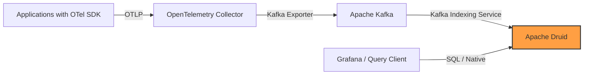

# How to Use Apache Druid for OpenTelemetry Metrics Analytics

Author: [nawazdhandala](https://www.github.com/nawazdhandala)

Tags: OpenTelemetry, Apache Druid, Metrics, Analytics, Time-Series, Observability

Description: Learn how to use Apache Druid as a high-performance analytics engine for OpenTelemetry metrics with real-time ingestion and sub-second query performance.

---

Apache Druid is a real-time analytics database designed for fast aggregations on large datasets. It excels at time-series workloads where you need sub-second query responses over billions of rows. This makes it an excellent fit for OpenTelemetry metrics, which are fundamentally time-series data that require fast slicing and dicing across many dimensions. In this guide, we will set up a pipeline that collects OpenTelemetry metrics, transforms them for Druid ingestion, and runs analytical queries against the stored data.

## Why Apache Druid for Metrics Analytics

OpenTelemetry metrics come with rich dimensional data. A single metric like `http.server.request.duration` might have attributes for service name, HTTP method, route, status code, and deployment environment. Querying across these dimensions at scale is exactly what Druid was built for.

Druid stores data in a columnar format with automatic indexing on every column. This means you can filter, group, and aggregate across any combination of attributes without defining indexes upfront. It also supports real-time ingestion alongside historical queries, so new metrics are queryable within seconds of arrival.

Compared to traditional time-series databases, Druid shines when you need to run ad-hoc analytical queries across many dimensions rather than just retrieving pre-defined metric series.

## Architecture Overview

The pipeline uses the OpenTelemetry Collector to receive metrics from applications, then forwards them to Apache Kafka as an intermediate buffer. Druid ingests from Kafka in real time.



Kafka acts as a buffer between the Collector and Druid. This decouples ingestion from processing, so spikes in metric volume do not overwhelm Druid. It also gives you replay capability if you need to re-ingest data.

## Setting Up Apache Druid

Start by deploying Druid using Docker Compose. This configuration brings up a single-server Druid cluster suitable for development and testing.

```yaml
# docker-compose.yml for Apache Druid single-server deployment
version: "3"

services:
  # ZooKeeper is required for Druid cluster coordination
  zookeeper:
    image: zookeeper:3.9
    ports:
      - "2181:2181"
    environment:
      ZOO_MY_ID: 1

  # Kafka serves as the intermediate message broker
  kafka:
    image: confluentinc/cp-kafka:7.5.0
    ports:
      - "9092:9092"
    environment:
      KAFKA_BROKER_ID: 1
      KAFKA_ZOOKEEPER_CONNECT: zookeeper:2181
      KAFKA_ADVERTISED_LISTENERS: PLAINTEXT://kafka:29092,PLAINTEXT_HOST://localhost:9092
      KAFKA_LISTENER_SECURITY_PROTOCOL_MAP: PLAINTEXT:PLAINTEXT,PLAINTEXT_HOST:PLAINTEXT
      KAFKA_OFFSETS_TOPIC_REPLICATION_FACTOR: 1
    depends_on:
      - zookeeper

  # Druid single-server includes all Druid processes
  druid:
    image: apache/druid:28.0.0
    ports:
      # Router port for the web console and query endpoint
      - "8888:8888"
      # Broker port for direct queries
      - "8082:8082"
    environment:
      # Memory settings for a development deployment
      DRUID_SINGLE_NODE_CONF: micro-quickstart
      druid_extensions_loadList: '["druid-kafka-indexing-service","druid-datasketches"]'
    volumes:
      - druid_data:/opt/druid/var
    depends_on:
      - zookeeper

volumes:
  druid_data:
```

Start the services and wait for Druid to become available:

```bash
# Start all services
docker compose up -d

# Wait for Druid to be ready (check the web console)
# The Druid console is available at http://localhost:8888
```

## Configuring the OpenTelemetry Collector

The Collector needs to receive metrics from applications and export them to Kafka in a format that Druid can ingest. We will use the Kafka exporter to write metrics as JSON messages.

```yaml
# otel-collector-config.yml
receivers:
  # Accept OTLP metrics from instrumented applications
  otlp:
    protocols:
      grpc:
        endpoint: 0.0.0.0:4317
      http:
        endpoint: 0.0.0.0:4318

  # Also collect host metrics from the machine running the Collector
  hostmetrics:
    collection_interval: 30s
    scrapers:
      cpu:
      memory:
      disk:
      network:

processors:
  # Batch metrics for efficient Kafka writes
  batch:
    timeout: 5s
    send_batch_size: 1000

  # Add resource attributes to help with Druid filtering
  resource:
    attributes:
      - key: collector.instance
        value: "collector-01"
        action: upsert

exporters:
  # Kafka exporter writes metrics as JSON messages
  kafka:
    brokers:
      - localhost:9092
    topic: otel-metrics
    # Use JSON encoding for Druid compatibility
    encoding: otlp_json
    # Protocol version for the Kafka client
    protocol_version: "2.0.0"

service:
  pipelines:
    metrics:
      receivers: [otlp, hostmetrics]
      processors: [resource, batch]
      exporters: [kafka]
```

The `otlp_json` encoding writes metrics in the OpenTelemetry JSON format. Druid can parse this during ingestion using a JSON input format with a flattenSpec.

## Creating a Kafka Topic

Before starting the Collector, create the Kafka topic that will hold the metrics:

```bash
# Create the otel-metrics topic with appropriate settings
docker compose exec kafka kafka-topics --create \
  --topic otel-metrics \
  --bootstrap-server localhost:9092 \
  --partitions 3 \
  --replication-factor 1

# Verify the topic was created
docker compose exec kafka kafka-topics --list \
  --bootstrap-server localhost:9092
```

## Configuring Druid Ingestion

Now we need to tell Druid how to ingest data from the Kafka topic. Druid uses a supervisor spec to define Kafka ingestion tasks. Submit this spec through the Druid web console or the API.

```json
{
  "type": "kafka",
  "spec": {
    "ioConfig": {
      "type": "kafka",
      "consumerProperties": {
        "bootstrap.servers": "kafka:29092"
      },
      "topic": "otel-metrics",
      "inputFormat": {
        "type": "json",
        "flattenSpec": {
          "useFieldDiscovery": false,
          "fields": [
            {
              "type": "path",
              "name": "metric_name",
              "expr": "$.resourceMetrics[0].scopeMetrics[0].metrics[0].name"
            },
            {
              "type": "path",
              "name": "service_name",
              "expr": "$.resourceMetrics[0].resource.attributes[?(@.key=='service.name')].value.stringValue"
            },
            {
              "type": "path",
              "name": "value",
              "expr": "$.resourceMetrics[0].scopeMetrics[0].metrics[0].gauge.dataPoints[0].asDouble"
            },
            {
              "type": "path",
              "name": "timestamp",
              "expr": "$.resourceMetrics[0].scopeMetrics[0].metrics[0].gauge.dataPoints[0].timeUnixNano"
            }
          ]
        }
      },
      "useEarliestOffset": true
    },
    "tuningConfig": {
      "type": "kafka",
      "maxRowsPerSegment": 5000000,
      "maxRowsInMemory": 100000
    },
    "dataSchema": {
      "dataSource": "otel_metrics",
      "timestampSpec": {
        "column": "timestamp",
        "format": "nano"
      },
      "dimensionsSpec": {
        "dimensions": [
          "metric_name",
          "service_name"
        ]
      },
      "granularitySpec": {
        "segmentGranularity": "HOUR",
        "queryGranularity": "MINUTE",
        "rollup": true
      },
      "metricsSpec": [
        {
          "type": "doubleSum",
          "name": "value_sum",
          "fieldName": "value"
        },
        {
          "type": "doubleMin",
          "name": "value_min",
          "fieldName": "value"
        },
        {
          "type": "doubleMax",
          "name": "value_max",
          "fieldName": "value"
        },
        {
          "type": "count",
          "name": "count"
        }
      ]
    }
  }
}
```

Submit the supervisor spec to Druid using the API:

```bash
# Submit the Kafka ingestion supervisor spec
curl -X POST http://localhost:8888/druid/indexer/v1/supervisor \
  -H "Content-Type: application/json" \
  -d @druid-supervisor.json
```

The `granularitySpec` with `rollup: true` is important. It tells Druid to pre-aggregate metrics at minute granularity, which dramatically reduces storage requirements and speeds up queries. The `metricsSpec` defines how values are aggregated during rollup: we keep the sum, min, max, and count so we can compute averages and percentiles at query time.

## Running Analytical Queries

Once data is flowing into Druid, you can query it using Druid SQL through the web console at `http://localhost:8888` or via the API.

Here are some useful queries for analyzing OpenTelemetry metrics:

```sql
-- Average metric value by service over the last hour
-- Groups by service_name and metric_name for comparison
SELECT
  service_name,
  metric_name,
  SUM(value_sum) / SUM(count) AS avg_value,
  SUM(count) AS total_points
FROM otel_metrics
WHERE __time >= CURRENT_TIMESTAMP - INTERVAL '1' HOUR
GROUP BY service_name, metric_name
ORDER BY avg_value DESC

-- Time-series aggregation at 5-minute intervals
-- Useful for charting metric trends
SELECT
  TIME_FLOOR(__time, 'PT5M') AS time_bucket,
  metric_name,
  SUM(value_sum) / SUM(count) AS avg_value,
  MAX(value_max) AS peak_value
FROM otel_metrics
WHERE
  __time >= CURRENT_TIMESTAMP - INTERVAL '6' HOUR
  AND metric_name = 'system.cpu.utilization'
GROUP BY 1, 2
ORDER BY time_bucket

-- Top services by metric volume
-- Helps identify which services generate the most data
SELECT
  service_name,
  COUNT(*) AS segment_count,
  SUM(count) AS total_data_points
FROM otel_metrics
WHERE __time >= CURRENT_TIMESTAMP - INTERVAL '24' HOUR
GROUP BY service_name
ORDER BY total_data_points DESC
LIMIT 20
```

## Connecting Grafana to Druid

Grafana can query Druid directly using the Druid data source plugin. Install the plugin and configure it to point at the Druid broker:

```yaml
# Grafana data source provisioning for Druid
# Place this in grafana/provisioning/datasources/
apiVersion: 1

datasources:
  - name: Druid
    type: grafadruid-druid-datasource
    access: proxy
    url: http://druid:8082
    # The Druid broker endpoint for SQL queries
    jsonData:
      connection:
        url: http://druid:8082
      query:
        # Use SQL query type for familiar syntax
        queryType: sql
```

With this setup, you can build Grafana dashboards that query Druid for metric visualizations with sub-second response times, even across billions of data points.

## Performance Tuning

For production workloads, there are several Druid settings that matter for OpenTelemetry metrics.

Segment granularity determines how data is partitioned on disk. Use `HOUR` for high-volume ingestion and `DAY` for lower volumes. Smaller granularity means more segments but faster real-time queries.

Query granularity controls the finest time resolution available in queries. Setting this to `MINUTE` means you cannot query at second-level granularity, but it reduces storage significantly.

Rollup is essential for metrics data. Without rollup, Druid stores every individual data point. With rollup enabled, it pre-aggregates points within each query granularity period, often reducing data volume by 10x or more.

## Summary

Apache Druid provides a powerful analytics engine for OpenTelemetry metrics when you need sub-second query performance across high-cardinality dimensions. By routing metrics through Kafka and into Druid with real-time ingestion, you get a pipeline that handles both high-volume ingestion and fast analytical queries. The combination of rollup, columnar storage, and automatic indexing makes Druid particularly effective for the kind of ad-hoc exploratory analysis that observability teams need when investigating production issues.
