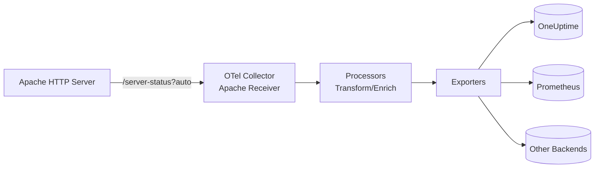

# How to Configure the Apache Receiver in the OpenTelemetry Collector

Author: [nawazdhandala](https://www.github.com/nawazdhandala)

Tags: OpenTelemetry, Collector, Apache, Web Server, Observability, Metrics, HTTP Server

Description: Learn how to configure the Apache HTTP Server receiver in OpenTelemetry Collector with practical YAML examples, mod_status setup, and production deployment patterns.

---

Apache HTTP Server powers a significant portion of the web, serving everything from simple websites to complex enterprise applications. Monitoring Apache performance is essential for maintaining fast, reliable services. The OpenTelemetry Collector's Apache receiver provides standardized metric collection from Apache instances, enabling centralized observability across your infrastructure.

This guide covers everything from enabling Apache's status module through production-ready configurations with authentication, multiple server monitoring, and integration with observability backends.

## Understanding the Apache Receiver

The Apache receiver collects metrics from the Apache HTTP Server using the `mod_status` module. It periodically scrapes the server status endpoint and converts the data into OpenTelemetry metrics that flow through your Collector pipeline.

Key metrics include:

- Current connections and workers
- Request rate and bytes served
- CPU load and uptime
- Worker states (busy, idle, reading, writing)
- Scoreboard statistics
- Traffic and request counters

These metrics help you understand server load, identify bottlenecks, optimize configuration, and detect performance degradation.

## Prerequisites: Enable mod_status

Before configuring the receiver, enable Apache's `mod_status` module and expose a status endpoint.

For Debian/Ubuntu:

```bash
# Enable mod_status module
sudo a2enmod status

# Restart Apache
sudo systemctl restart apache2
```

For RHEL/CentOS:

```bash
# mod_status is usually enabled by default
# Verify with:
httpd -M | grep status

# Restart Apache
sudo systemctl restart httpd
```

Configure the status endpoint. Edit your Apache configuration (typically `/etc/apache2/apache2.conf` or `/etc/httpd/conf/httpd.conf`):

```apache
# Enable ExtendedStatus for detailed metrics
ExtendedStatus On

<Location "/server-status">
    SetHandler server-status
    # Restrict access to localhost for security
    Require ip 127.0.0.1
    # Or allow from monitoring network
    # Require ip 10.0.0.0/8
</Location>
```

Reload Apache to apply changes:

```bash
# Debian/Ubuntu
sudo systemctl reload apache2

# RHEL/CentOS
sudo systemctl reload httpd
```

Verify the status endpoint works:

```bash
curl http://localhost/server-status?auto
```

Expected output shows metrics in plain text format:

```
Total Accesses: 1234
Total kBytes: 5678
CPULoad: 0.123
Uptime: 86400
ReqPerSec: 14.3
BytesPerSec: 65536
BytesPerReq: 4587
BusyWorkers: 5
IdleWorkers: 45
Scoreboard: _____W__W__W__W__W_____................................
```

## Data Flow Architecture

The following diagram illustrates metric flow from Apache through the Collector:



The receiver scrapes the status endpoint, parses the response, and emits OpenTelemetry metrics for processing and export.

## Basic Configuration

Here's a minimal configuration to monitor a local Apache instance:

```yaml
# receivers: Define how telemetry enters the Collector
receivers:
  # Apache receiver scrapes metrics from mod_status
  apache:
    # URL of the Apache status endpoint
    # Must end with ?auto for machine-readable format
    endpoint: http://localhost/server-status?auto
    # How often to scrape metrics
    collection_interval: 30s

# exporters: Define where telemetry is sent
exporters:
  # Export to OneUptime using OTLP over HTTP
  otlphttp:
    endpoint: https://oneuptime.com/otlp
    headers:
      x-oneuptime-token: ${ONEUPTIME_TOKEN}

# service: Wire receivers and exporters into pipelines
service:
  pipelines:
    # Metrics pipeline for Apache data
    metrics:
      receivers: [apache]
      exporters: [otlphttp]
```

This basic setup scrapes the local Apache status endpoint every 30 seconds and exports metrics to OneUptime. The `?auto` parameter is critical - it returns machine-readable output instead of HTML.

## Production Configuration

Production environments require security, reliability, and proper resource management. Here's a comprehensive configuration:

```yaml
receivers:
  # Apache receiver with full production settings
  apache:
    # Production Apache endpoint
    # Use localhost if Collector runs on same host
    # Or remote endpoint for centralized monitoring
    endpoint: http://apache-prod.example.com:8080/server-status?auto

    # Collection interval - balance freshness vs load
    # 10-30s for high-traffic servers
    # 60s for medium-traffic servers
    collection_interval: 10s

    # HTTP client timeout
    timeout: 10s

    # TLS configuration if using HTTPS
    tls:
      # Always verify certificates in production
      insecure_skip_verify: false
      # Path to CA certificate bundle
      ca_file: /etc/ssl/certs/ca-bundle.crt
      # Client certificate authentication (if required)
      cert_file: /etc/ssl/certs/client.crt
      key_file: /etc/ssl/private/client.key

    # Authentication headers if status endpoint is protected
    headers:
      X-Monitoring-Token: ${APACHE_MONITORING_TOKEN}

# processors: Transform and enrich metrics
processors:
  # Add resource attributes for context
  resource:
    attributes:
      - key: service.name
        value: apache-production
        action: upsert
      - key: deployment.environment
        value: production
        action: upsert
      - key: host.name
        value: ${HOSTNAME}
        action: upsert
      - key: apache.instance
        value: web-01
        action: upsert
      - key: apache.role
        value: frontend
        action: upsert

  # Batch metrics to reduce network overhead
  batch:
    # Send batch after timeout or when size reached
    timeout: 10s
    send_batch_size: 512

  # Prevent collector from running out of memory
  memory_limiter:
    check_interval: 5s
    limit_mib: 256
    spike_limit_mib: 64

  # Transform metric names or values if needed
  # metricstransform:
  #   transforms:
  #     - metric_name: apache.workers.busy
  #       action: update
  #       new_name: apache.workers.active

exporters:
  # Export to OneUptime with retry and queuing
  otlphttp:
    endpoint: https://oneuptime.com/otlp
    headers:
      x-oneuptime-token: ${ONEUPTIME_TOKEN}
    timeout: 30s

    # Retry configuration for reliability
    retry_on_failure:
      enabled: true
      initial_interval: 5s
      max_interval: 30s
      max_elapsed_time: 300s

    # Queue metrics during backend outages
    sending_queue:
      enabled: true
      num_consumers: 10
      queue_size: 1000

service:
  pipelines:
    metrics:
      receivers: [apache]
      processors: [memory_limiter, resource, batch]
      exporters: [otlphttp]
```

This production configuration includes resource tagging, batching, memory protection, and reliable export with automatic retries.

## Monitoring Multiple Apache Servers

To monitor multiple Apache instances from a single Collector, define multiple receiver instances:

```yaml
receivers:
  # Frontend web servers
  apache/web-01:
    endpoint: http://10.0.1.10/server-status?auto
    collection_interval: 10s

  apache/web-02:
    endpoint: http://10.0.1.11/server-status?auto
    collection_interval: 10s

  apache/web-03:
    endpoint: http://10.0.1.12/server-status?auto
    collection_interval: 10s

  # API backend servers
  apache/api-01:
    endpoint: http://10.0.2.10:8080/server-status?auto
    collection_interval: 5s  # More frequent for critical services

  apache/api-02:
    endpoint: http://10.0.2.11:8080/server-status?auto
    collection_interval: 5s

  # Staging environment
  apache/staging:
    endpoint: http://staging-apache.example.com/server-status?auto
    collection_interval: 60s  # Less frequent for non-production

processors:
  # Tag web servers
  resource/web-01:
    attributes:
      - key: apache.instance
        value: web-01
        action: upsert
      - key: apache.role
        value: frontend
        action: upsert
      - key: datacenter
        value: us-east-1a
        action: upsert

  resource/web-02:
    attributes:
      - key: apache.instance
        value: web-02
        action: upsert
      - key: apache.role
        value: frontend
        action: upsert
      - key: datacenter
        value: us-east-1b
        action: upsert

  resource/web-03:
    attributes:
      - key: apache.instance
        value: web-03
        action: upsert
      - key: apache.role
        value: frontend
        action: upsert
      - key: datacenter
        value: us-east-1c
        action: upsert

  # Tag API servers
  resource/api-01:
    attributes:
      - key: apache.instance
        value: api-01
        action: upsert
      - key: apache.role
        value: api
        action: upsert

  resource/api-02:
    attributes:
      - key: apache.instance
        value: api-02
        action: upsert
      - key: apache.role
        value: api
        action: upsert

  # Tag staging
  resource/staging:
    attributes:
      - key: apache.instance
        value: staging
        action: upsert
      - key: deployment.environment
        value: staging
        action: upsert

  batch:
    timeout: 10s

exporters:
  otlphttp:
    endpoint: https://oneuptime.com/otlp
    headers:
      x-oneuptime-token: ${ONEUPTIME_TOKEN}

service:
  pipelines:
    # Option 1: Combine all instances in one pipeline
    metrics/all:
      receivers:
        - apache/web-01
        - apache/web-02
        - apache/web-03
        - apache/api-01
        - apache/api-02
        - apache/staging
      processors: [batch]
      exporters: [otlphttp]

    # Option 2: Separate pipelines for granular control
    metrics/web-01:
      receivers: [apache/web-01]
      processors: [resource/web-01, batch]
      exporters: [otlphttp]

    metrics/web-02:
      receivers: [apache/web-02]
      processors: [resource/web-02, batch]
      exporters: [otlphttp]

    # ... repeat for other instances
```

Separate pipelines give you independent control over processing and routing per instance.

## Key Metrics Explained

The Apache receiver exposes these critical metrics:

**apache.current_connections**
- Current number of active connections
- High values indicate heavy load
- Alert when approaching MaxClients/MaxRequestWorkers

**apache.workers.busy**
- Number of workers actively processing requests
- Should correlate with traffic patterns
- High values relative to total workers indicate saturation

**apache.workers.idle**
- Number of idle workers ready to handle requests
- Consistently low values indicate need to increase workers
- Too many idle workers wastes memory

**apache.requests**
- Total requests served since startup
- Calculate request rate as derivative
- Primary metric for traffic patterns

**apache.traffic**
- Total bytes served since startup
- Calculate throughput as derivative
- Useful for bandwidth planning

**apache.cpu**
- CPU utilization percentage
- High values may indicate CPU-bound workload
- Consider optimization or horizontal scaling

**apache.uptime**
- Seconds since server start
- Track restarts and availability
- Unexpected drops indicate crashes

**Scoreboard Metrics**
- `apache.workers.{state}` for each worker state
- States: waiting, starting, reading, writing, keepalive, dnslookup, closing, logging, finishing, idle_cleanup
- Analyze distribution to understand bottlenecks

## Deployment Patterns

### Pattern 1: Local Agent per Server

Run a Collector instance on each Apache server:

```yaml
receivers:
  apache:
    endpoint: http://localhost/server-status?auto
    collection_interval: 10s

processors:
  resource:
    attributes:
      - key: host.name
        value: ${HOSTNAME}
        action: upsert
```

**Pros**: No network latency, resilient to network issues, lowest overhead
**Cons**: More instances to manage, requires automation

### Pattern 2: Centralized Collector

One Collector monitors all Apache instances remotely:

```yaml
receivers:
  apache/server-01:
    endpoint: http://server-01.example.com/server-status?auto
  apache/server-02:
    endpoint: http://server-02.example.com/server-status?auto
  # ... more servers
```

**Pros**: Single configuration point, easier management, centralized view
**Cons**: Network dependency, potential bottleneck

### Pattern 3: Regional Collectors

Deploy collectors per region or datacenter:

```yaml
# US-East collector
receivers:
  apache/web-01-use1:
    endpoint: http://web-01.us-east-1.internal/server-status?auto
  apache/web-02-use1:
    endpoint: http://web-02.us-east-1.internal/server-status?auto

# US-West collector
receivers:
  apache/web-01-usw1:
    endpoint: http://web-01.us-west-1.internal/server-status?auto
```

**Pros**: Reduced latency, regional fault isolation
**Cons**: More infrastructure, coordination needed

## Securing the Status Endpoint

Never expose Apache status publicly. Use IP-based access control:

```apache
<Location "/server-status">
    SetHandler server-status
    # Only allow from monitoring network
    Require ip 10.0.0.0/8
    Require ip 172.16.0.0/12
    # Or specific monitoring hosts
    # Require ip 10.0.1.100
</Location>
```

For additional security, add HTTP authentication:

```apache
<Location "/server-status">
    SetHandler server-status
    AuthType Basic
    AuthName "Server Status"
    AuthUserFile /etc/apache2/.htpasswd
    Require valid-user
</Location>
```

Create the password file:

```bash
# Debian/Ubuntu
sudo htpasswd -c /etc/apache2/.htpasswd monitoring

# RHEL/CentOS
sudo htpasswd -c /etc/httpd/.htpasswd monitoring
```

Configure the receiver with authentication:

```yaml
receivers:
  apache:
    endpoint: http://apache.example.com/server-status?auto
    headers:
      Authorization: "Basic ${BASIC_AUTH_TOKEN}"
```

Generate the token:

```bash
echo -n "monitoring:password" | base64
# Use the output as BASIC_AUTH_TOKEN
```

## Troubleshooting Common Issues

**Connection Refused**

Verify Apache is running and status endpoint is accessible:

```bash
# Check Apache status
systemctl status apache2  # or httpd

# Test status endpoint locally
curl http://localhost/server-status?auto
```

**Forbidden Access**

Check Apache access control configuration:

```apache
<Location "/server-status">
    SetHandler server-status
    # Make sure Collector's IP is allowed
    Require ip 10.0.1.100
</Location>
```

**No Metrics or Partial Metrics**

Ensure `ExtendedStatus On` is set in Apache config:

```apache
# Must be at global level, not in VirtualHost
ExtendedStatus On
```

Reload Apache after changes:

```bash
sudo systemctl reload apache2  # or httpd
```

**Missing ?auto Parameter**

The receiver requires machine-readable format:

```yaml
# Correct - includes ?auto
endpoint: http://localhost/server-status?auto

# Wrong - returns HTML
endpoint: http://localhost/server-status
```

**High Cardinality Issues**

Avoid high-cardinality labels when monitoring many servers:

```yaml
processors:
  resource:
    attributes:
      # Good: Low cardinality dimensions
      - key: apache.role
        value: frontend
      - key: datacenter
        value: us-east-1

      # Bad: High cardinality (unique IPs, PIDs)
      # - key: client.ip
      #   value: ${CLIENT_IP}
```

## Apache MPM Considerations

Apache supports different Multi-Processing Modules (MPMs) with different performance characteristics:

**prefork MPM** (process-based):
- One process per connection
- High memory usage
- Monitor: `apache.workers.busy` approaching `MaxRequestWorkers`

**worker MPM** (hybrid):
- Multiple threads per process
- Better memory efficiency
- Monitor: both process and thread counts

**event MPM** (recommended):
- Event-driven, most efficient
- Best for high-concurrency scenarios
- Monitor: worker efficiency and keepalive handling

Configure worker limits appropriately:

```apache
# For event MPM
<IfModule mpm_event_module>
    StartServers             3
    MinSpareThreads         75
    MaxSpareThreads        250
    ThreadsPerChild         25
    MaxRequestWorkers      400
    MaxConnectionsPerChild   0
</IfModule>
```

Set alerts when `apache.workers.busy` exceeds 80% of `MaxRequestWorkers`.

## Integration with OneUptime

Once metrics flow to OneUptime, you can:

1. **Build dashboards** showing request rates, worker utilization, and traffic across all Apache instances
2. **Create alerts** for high worker saturation, low idle workers, or uptime changes
3. **Correlate with application metrics** to understand how Apache performance affects user experience
4. **Track trends** for capacity planning and performance optimization
5. **Compare servers** to identify configuration issues or uneven load distribution

OpenTelemetry's vendor neutrality means you can switch backends without reconfiguring Apache or the Collector.

## Best Practices

**Enable ExtendedStatus** for detailed metrics:
```apache
ExtendedStatus On
```

**Choose appropriate collection intervals**:
- 5-10s for high-traffic production servers
- 30-60s for medium traffic
- 120s+ for development environments

**Use resource attributes** for context:
```yaml
processors:
  resource:
    attributes:
      - key: service.name
        value: apache
      - key: apache.role
        value: frontend
      - key: deployment.environment
        value: production
```

**Secure the status endpoint**:
- Use IP allowlisting
- Add authentication for extra security
- Never expose to public internet

**Monitor the Collector** itself:
```yaml
service:
  telemetry:
    metrics:
      readers:
        - periodic:
            exporter:
              otlp:
                endpoint: https://oneuptime.com/otlp
```

**Use batching** to reduce overhead:
```yaml
processors:
  batch:
    timeout: 10s
    send_batch_size: 1024
```

**Protect credentials** with environment variables:
```bash
export ONEUPTIME_TOKEN="your-token-here"
export APACHE_MONITORING_TOKEN="monitoring-token"
```

## Related Resources

For more on OpenTelemetry Collector:

- [OpenTelemetry Collector: What It Is, When You Need It, and When You Don't](https://oneuptime.com/blog/post/2025-09-18-what-is-opentelemetry-collector-and-why-use-one/view)
- [How to collect internal metrics from OpenTelemetry Collector](https://oneuptime.com/blog/post/2025-01-22-how-to-collect-opentelemetry-collector-internal-metrics/view)

For monitoring other infrastructure:
- [How to Configure the Elasticsearch Receiver in the OpenTelemetry Collector](https://oneuptime.com/blog/post/2026-02-06-elasticsearch-receiver-opentelemetry-collector/view)
- [How to Configure the Nginx Receiver in the OpenTelemetry Collector](https://oneuptime.com/blog/post/2026-02-06-nginx-receiver-opentelemetry-collector/view)

## Final Thoughts

The Apache receiver brings standardized monitoring to one of the web's foundational technologies. Start with basic configuration on a single instance, secure the status endpoint, and scale to multiple servers as needed.

OpenTelemetry's open standard ensures your Apache metrics integrate seamlessly with application traces and logs, providing complete system visibility. Configure once, export anywhere.

Need a backend for your OpenTelemetry metrics? OneUptime provides native OTLP support with powerful dashboards, alerting, and correlation capabilities without vendor lock-in.
