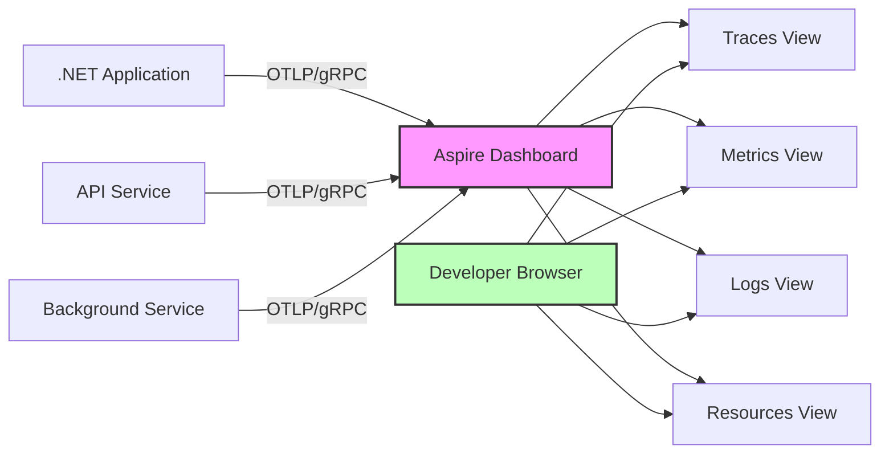

# How to Use the Aspire Dashboard for Local OpenTelemetry Development in .NET

Author: [nawazdhandala](https://www.github.com/nawazdhandala)

Tags: OpenTelemetry, .NET Aspire, Dashboard, Local Development, Debugging

Description: Discover how to use the .NET Aspire Dashboard as a powerful local development tool for visualizing OpenTelemetry traces, metrics, and logs without requiring external infrastructure.

Local development environments should enable rapid iteration and debugging, but traditional observability setups often require running multiple containers, configuring complex backends, and dealing with infrastructure that slows you down. The .NET Aspire Dashboard changes this by providing a standalone, lightweight viewer for OpenTelemetry data that runs locally and requires zero configuration.

## The Problem with Traditional Local Observability

Setting up a complete observability stack for local development typically involves:

- Running Jaeger or Zipkin in Docker for traces
- Setting up Prometheus for metrics
- Configuring Grafana for visualization
- Managing multiple ports and services
- Dealing with version compatibility issues
- Consuming significant system resources

This complexity creates friction that discourages developers from using observability during local development, exactly when debugging would benefit most from it. The Aspire Dashboard solves this by consolidating everything into a single, purpose-built tool for development.

## Understanding the Aspire Dashboard

The .NET Aspire Dashboard is a standalone application that implements the OTLP (OpenTelemetry Protocol) receiver endpoints. It provides real-time visualization of traces, metrics, and logs without requiring any backend infrastructure. While it was originally built as part of .NET Aspire for cloud-native development, the dashboard works perfectly as a general-purpose OpenTelemetry viewer for any .NET application.

Key features include:
- Real-time trace visualization with span details
- Metrics charts and histograms
- Structured log viewing with filtering
- Resource attribute inspection
- Zero configuration required
- Minimal resource footprint
- Works with any OpenTelemetry-instrumented application

## Installing and Running the Aspire Dashboard

The dashboard is distributed as a .NET tool that you can install globally:

```bash
# Install the Aspire Dashboard as a global tool
dotnet tool install -g aspire-dashboard

# Run the dashboard
aspire-dashboard

# Run on a specific port
aspire-dashboard --urls http://localhost:18888

# Enable authentication for team use
aspire-dashboard --frontend-authmode BrowserToken
```

When you run the dashboard, it starts listening for OTLP data on the standard ports:
- HTTP UI: http://localhost:18888
- OTLP/gRPC: http://localhost:4317
- OTLP/HTTP: http://localhost:4318

Alternatively, you can run it using Docker:

```bash
# Run the Aspire Dashboard in Docker
docker run -d -p 18888:18888 -p 4317:4317 -p 4318:4318 \
  --name aspire-dashboard \
  mcr.microsoft.com/dotnet/aspire-dashboard:latest
```

## Configuring Your .NET Application for the Dashboard

Set up your application to send telemetry to the local Aspire Dashboard:

```csharp
using OpenTelemetry;
using OpenTelemetry.Resources;
using OpenTelemetry.Trace;
using OpenTelemetry.Metrics;
using OpenTelemetry.Logs;

var builder = WebApplication.CreateBuilder(args);

// Configure OpenTelemetry to send to Aspire Dashboard
builder.Services.AddOpenTelemetry()
    .ConfigureResource(resource => resource
        .AddService(
            serviceName: "MyLocalApp",
            serviceVersion: "1.0.0",
            serviceInstanceId: Environment.MachineName))
    .WithTracing(tracing => tracing
        .AddAspNetCoreInstrumentation(options =>
        {
            options.RecordException = true;
            options.Filter = httpContext =>
            {
                // Don't trace dashboard requests
                return !httpContext.Request.Path.StartsWithSegments("/health");
            };
        })
        .AddHttpClientInstrumentation(options =>
        {
            options.RecordException = true;
        })
        .AddEntityFrameworkCoreInstrumentation(options =>
        {
            options.SetDbStatementForText = true;
        })
        .AddSource("MyApp.*")
        .AddOtlpExporter(options =>
        {
            // Aspire Dashboard default endpoint
            options.Endpoint = new Uri("http://localhost:4317");
            options.Protocol = OtlpExportProtocol.Grpc;
        }))
    .WithMetrics(metrics => metrics
        .AddAspNetCoreInstrumentation()
        .AddHttpClientInstrumentation()
        .AddRuntimeInstrumentation()
        .AddProcessInstrumentation()
        .AddMeter("MyApp.*")
        .AddOtlpExporter(options =>
        {
            options.Endpoint = new Uri("http://localhost:4317");
            options.Protocol = OtlpExportProtocol.Grpc;
        }));

// Configure logging to send to Aspire Dashboard
builder.Logging.AddOpenTelemetry(logging =>
{
    logging.IncludeFormattedMessage = true;
    logging.IncludeScopes = true;
    logging.AddOtlpExporter(options =>
    {
        options.Endpoint = new Uri("http://localhost:4317");
        options.Protocol = OtlpExportProtocol.Grpc;
    });
});

var app = builder.Build();
app.Run();
```

For easier configuration, use environment variables or appsettings:

```json
{
  "OpenTelemetry": {
    "ServiceName": "MyLocalApp",
    "Otlp": {
      "Endpoint": "http://localhost:4317",
      "Protocol": "Grpc"
    }
  },
  "Logging": {
    "LogLevel": {
      "Default": "Information",
      "Microsoft.AspNetCore": "Warning"
    }
  }
}
```

## Creating Rich Traces for Dashboard Visualization

Write instrumentation code that produces detailed, useful traces in the dashboard:

```csharp
using System.Diagnostics;
using System.Diagnostics.Metrics;

public class OrderService
{
    private static readonly ActivitySource ActivitySource =
        new ActivitySource("MyApp.OrderService", "1.0.0");

    private static readonly Meter Meter =
        new Meter("MyApp.OrderService", "1.0.0");

    private readonly Counter<long> _ordersCreated;
    private readonly Histogram<double> _orderProcessingDuration;
    private readonly ILogger<OrderService> _logger;

    public OrderService(ILogger<OrderService> logger)
    {
        _logger = logger;

        _ordersCreated = Meter.CreateCounter<long>(
            "orders.created",
            unit: "orders",
            description: "Total number of orders created");

        _orderProcessingDuration = Meter.CreateHistogram<double>(
            "orders.processing.duration",
            unit: "ms",
            description: "Order processing duration");
    }

    public async Task<Order> CreateOrderAsync(CreateOrderRequest request)
    {
        // Create a root span for the entire operation
        using var activity = ActivitySource.StartActivity(
            "CreateOrder",
            ActivityKind.Internal);

        var stopwatch = Stopwatch.StartNew();

        // Add rich context to the span
        activity?.SetTag("order.customer_id", request.CustomerId);
        activity?.SetTag("order.item_count", request.Items.Count);
        activity?.SetTag("order.total_amount", request.TotalAmount);

        // Add an event for the start
        activity?.AddEvent(new ActivityEvent("OrderCreationStarted",
            tags: new ActivityTagsCollection
            {
                ["timestamp"] = DateTimeOffset.UtcNow.ToString()
            }));

        try
        {
            // Validate order
            await ValidateOrderAsync(request);

            // Process payment
            var paymentResult = await ProcessPaymentAsync(request);

            // Create order in database
            var order = await SaveOrderAsync(request, paymentResult);

            // Send confirmation
            await SendConfirmationAsync(order);

            stopwatch.Stop();

            // Record successful completion
            activity?.SetTag("order.id", order.Id);
            activity?.SetTag("order.status", "completed");
            activity?.SetTag("processing_time_ms", stopwatch.ElapsedMilliseconds);

            _ordersCreated.Add(1,
                new KeyValuePair<string, object?>("status", "success"));

            _orderProcessingDuration.Record(stopwatch.ElapsedMilliseconds,
                new KeyValuePair<string, object?>("status", "success"));

            activity?.AddEvent(new ActivityEvent("OrderCreationCompleted"));
            activity?.SetStatus(ActivityStatusCode.Ok);

            _logger.LogInformation(
                "Order {OrderId} created successfully for customer {CustomerId}",
                order.Id,
                request.CustomerId);

            return order;
        }
        catch (ValidationException ex)
        {
            stopwatch.Stop();

            activity?.SetTag("error.type", "validation");
            activity?.SetTag("error.message", ex.Message);
            activity?.RecordException(ex);
            activity?.SetStatus(ActivityStatusCode.Error, "Validation failed");

            _ordersCreated.Add(1,
                new KeyValuePair<string, object?>("status", "validation_error"));

            _logger.LogWarning(ex, "Order validation failed for customer {CustomerId}",
                request.CustomerId);

            throw;
        }
        catch (PaymentException ex)
        {
            stopwatch.Stop();

            activity?.SetTag("error.type", "payment");
            activity?.SetTag("error.message", ex.Message);
            activity?.RecordException(ex);
            activity?.SetStatus(ActivityStatusCode.Error, "Payment failed");

            _ordersCreated.Add(1,
                new KeyValuePair<string, object?>("status", "payment_error"));

            _logger.LogError(ex, "Payment processing failed for customer {CustomerId}",
                request.CustomerId);

            throw;
        }
        catch (Exception ex)
        {
            stopwatch.Stop();

            activity?.SetTag("error.type", "system");
            activity?.RecordException(ex);
            activity?.SetStatus(ActivityStatusCode.Error, "System error");

            _ordersCreated.Add(1,
                new KeyValuePair<string, object?>("status", "error"));

            _logger.LogError(ex, "Order creation failed for customer {CustomerId}",
                request.CustomerId);

            throw;
        }
    }

    private async Task ValidateOrderAsync(CreateOrderRequest request)
    {
        using var activity = ActivitySource.StartActivity(
            "ValidateOrder",
            ActivityKind.Internal);

        activity?.SetTag("validation.item_count", request.Items.Count);

        // Add validation logic details
        foreach (var item in request.Items)
        {
            activity?.AddEvent(new ActivityEvent($"ValidatingItem",
                tags: new ActivityTagsCollection
                {
                    ["item.sku"] = item.Sku,
                    ["item.quantity"] = item.Quantity
                }));
        }

        // Simulate validation
        await Task.Delay(50);

        if (request.Items.Count == 0)
        {
            throw new ValidationException("Order must contain at least one item");
        }

        activity?.SetStatus(ActivityStatusCode.Ok);
    }

    private async Task<PaymentResult> ProcessPaymentAsync(CreateOrderRequest request)
    {
        using var activity = ActivitySource.StartActivity(
            "ProcessPayment",
            ActivityKind.Client);

        activity?.SetTag("payment.amount", request.TotalAmount);
        activity?.SetTag("payment.method", request.PaymentMethod);
        activity?.SetTag("payment.provider", "StripeSimulator");

        // Simulate payment processing
        await Task.Delay(200);

        var result = new PaymentResult
        {
            TransactionId = Guid.NewGuid().ToString(),
            Status = "Completed",
            Amount = request.TotalAmount
        };

        activity?.SetTag("payment.transaction_id", result.TransactionId);
        activity?.SetTag("payment.status", result.Status);
        activity?.SetStatus(ActivityStatusCode.Ok);

        return result;
    }

    private async Task<Order> SaveOrderAsync(
        CreateOrderRequest request,
        PaymentResult payment)
    {
        using var activity = ActivitySource.StartActivity(
            "SaveOrder",
            ActivityKind.Internal);

        activity?.SetTag("db.operation", "insert");
        activity?.SetTag("db.table", "Orders");

        // Simulate database operation
        await Task.Delay(100);

        var order = new Order
        {
            Id = Guid.NewGuid().ToString(),
            CustomerId = request.CustomerId,
            Items = request.Items,
            TotalAmount = request.TotalAmount,
            PaymentTransactionId = payment.TransactionId,
            Status = "Confirmed",
            CreatedAt = DateTime.UtcNow
        };

        activity?.SetTag("order.id", order.Id);
        activity?.SetStatus(ActivityStatusCode.Ok);

        return order;
    }

    private async Task SendConfirmationAsync(Order order)
    {
        using var activity = ActivitySource.StartActivity(
            "SendConfirmation",
            ActivityKind.Producer);

        activity?.SetTag("messaging.destination", "order-confirmations");
        activity?.SetTag("messaging.system", "email");
        activity?.SetTag("order.id", order.Id);

        // Simulate sending confirmation
        await Task.Delay(50);

        activity?.AddEvent(new ActivityEvent("ConfirmationSent"));
        activity?.SetStatus(ActivityStatusCode.Ok);
    }
}

public class CreateOrderRequest
{
    public string CustomerId { get; set; } = string.Empty;
    public List<OrderItem> Items { get; set; } = new();
    public decimal TotalAmount { get; set; }
    public string PaymentMethod { get; set; } = string.Empty;
}

public class Order
{
    public string Id { get; set; } = string.Empty;
    public string CustomerId { get; set; } = string.Empty;
    public List<OrderItem> Items { get; set; } = new();
    public decimal TotalAmount { get; set; }
    public string PaymentTransactionId { get; set; } = string.Empty;
    public string Status { get; set; } = string.Empty;
    public DateTime CreatedAt { get; set; }
}

public class OrderItem
{
    public string Sku { get; set; } = string.Empty;
    public int Quantity { get; set; }
}

public class PaymentResult
{
    public string TransactionId { get; set; } = string.Empty;
    public string Status { get; set; } = string.Empty;
    public decimal Amount { get; set; }
}

public class ValidationException : Exception
{
    public ValidationException(string message) : base(message) { }
}

public class PaymentException : Exception
{
    public PaymentException(string message) : base(message) { }
}
```

## Using the Dashboard During Development

The Aspire Dashboard provides several views that help during development:

**Traces View**: Shows distributed traces as waterfall charts. You can:
- Click on any span to see detailed attributes
- View the span hierarchy to understand call flow
- See timing information to identify slow operations
- Inspect exceptions and error messages
- Copy trace IDs for correlation with logs

**Metrics View**: Displays charts for collected metrics. Features include:
- Real-time metric updates
- Histogram visualization
- Filtering by metric name and attributes
- Aggregation options (sum, average, count)
- Time range selection

**Logs View**: Shows structured logs with rich filtering:
- Filter by log level, timestamp, or message
- View log attributes and context
- Correlate logs with traces via trace ID
- Search through log messages
- Export logs for further analysis

**Resources View**: Lists all services and their attributes:
- Service names and versions
- Deployment environment
- Resource attributes
- Health status

## Creating a Development Workflow

Integrate the Aspire Dashboard into your daily development workflow:

```bash
# Create a script to start your development environment
# dev-start.sh

#!/bin/bash

echo "Starting Aspire Dashboard..."
aspire-dashboard --urls http://localhost:18888 &
DASHBOARD_PID=$!

echo "Dashboard running at http://localhost:18888"
echo "OTLP endpoint: http://localhost:4317"

# Wait a moment for the dashboard to start
sleep 2

echo "Starting application..."
dotnet run --project ./src/MyApp

# Cleanup on exit
trap "kill $DASHBOARD_PID" EXIT
```

Use a development-specific configuration file:

```json
{
  "Profiles": {
    "Development": {
      "commandName": "Project",
      "environmentVariables": {
        "ASPNETCORE_ENVIRONMENT": "Development",
        "OTEL_EXPORTER_OTLP_ENDPOINT": "http://localhost:4317",
        "OTEL_SERVICE_NAME": "MyApp-Dev",
        "OTEL_TRACES_SAMPLER": "always_on"
      },
      "applicationUrl": "http://localhost:5000"
    }
  }
}
```

## Dashboard Architecture and Data Flow

Understanding how telemetry flows to the dashboard:



## Advanced Dashboard Features

**Filtering and Search**: Use the dashboard's powerful filtering capabilities to focus on specific operations:

- Filter traces by status code (OK, Error)
- Search by span name or attribute values
- Filter metrics by label values
- Search logs by message content or structured fields

**Exporting Data**: While the dashboard is ephemeral by design, you can export data:

- Copy trace IDs for sharing with teammates
- Screenshot relevant traces or metrics
- Export filtered logs for documentation

**Multiple Services**: The dashboard automatically groups telemetry by service name, making it easy to work with multiple microservices locally.

## Troubleshooting Common Issues

**No Data Appearing**: Verify that your application is sending to the correct endpoint (localhost:4317) and that the dashboard is running. Check for any exporter errors in your application logs.

**Dashboard Not Starting**: Ensure port 18888 is not already in use. You can specify a different port using the `--urls` parameter.

**High Memory Usage**: The dashboard keeps recent telemetry in memory. If you're generating large volumes of data, restart the dashboard periodically during development sessions.

**Traces Not Connected**: Verify that trace context is properly propagated between services. The dashboard will show disconnected spans if context propagation breaks.

## Comparing Dashboard to Production Backends

The Aspire Dashboard is purpose-built for development and differs from production observability platforms:

**Dashboard (Development)**:
- Zero configuration
- Ephemeral data (lost on restart)
- Lightweight and fast
- Single developer focused
- No authentication required (or simple browser token)
- Limited data retention
- No alerting or analysis features

**Production Backends**:
- Configuration and infrastructure required
- Persistent storage
- Scalable for production loads
- Team collaboration features
- Robust authentication and authorization
- Long-term data retention
- Advanced querying, alerting, and analysis

Use the dashboard during development, then deploy the same instrumentation code to production with a different exporter configuration pointing to your production observability backend.

## Best Practices

**Start the Dashboard First**: Launch the dashboard before starting your application to ensure you don't miss early telemetry during application startup.

**Use Rich Attributes**: Add meaningful attributes to your spans. The dashboard makes these easily visible and searchable.

**Create Clear Span Names**: Use descriptive span names that make traces self-documenting when viewed in the dashboard.

**Test Error Scenarios**: Use the dashboard to verify that errors are properly recorded with full context and stack traces.

**Review Metrics Regularly**: Keep the metrics view open while developing to spot performance regressions immediately.

**Use Structured Logging**: Structured logs with consistent fields are much more useful in the dashboard than plain text messages.

The .NET Aspire Dashboard transforms local development by making observability data immediately accessible without infrastructure overhead. Once you experience the tight feedback loop of seeing telemetry in real-time as you develop, you'll wonder how you ever debugged without it.
