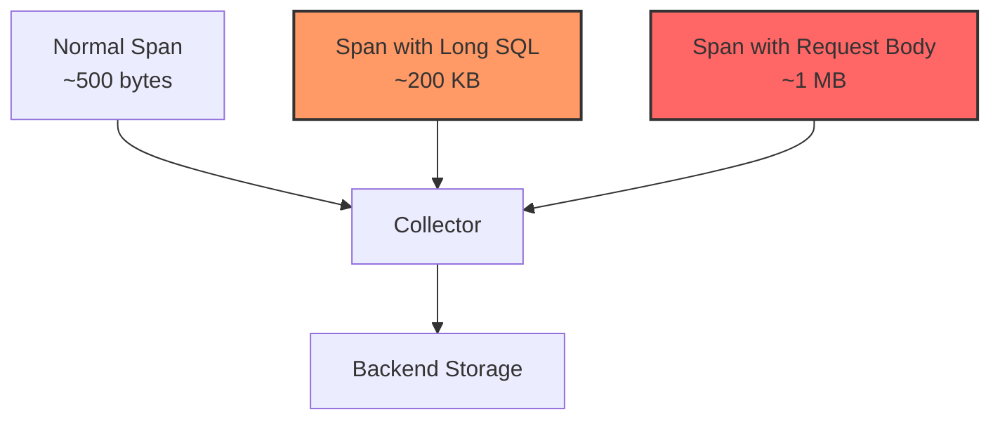
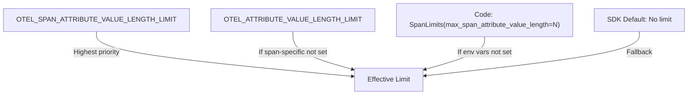

# How to Configure Attribute Value Length Limits in OpenTelemetry

Author: [nawazdhandala](https://www.github.com/nawazdhandala)

Tags: OpenTelemetry, Configuration, Attributes, SDK, Performance, Data Quality, Observability

Description: Learn how to configure attribute value length limits in OpenTelemetry SDKs to prevent oversized payloads and control telemetry data quality.

---

Attributes in OpenTelemetry carry the context that makes telemetry data useful. A span attribute might hold a database query, a URL, an error message, or a request body. The problem is that some of these values can be enormous. A SQL query might be 10,000 characters long. A serialized request body could be megabytes. Without limits, a single oversized attribute can bloat your span payloads, overwhelm your collector, and drive up storage costs. OpenTelemetry SDKs let you set attribute value length limits to truncate long strings automatically. This post explains how to configure these limits and what happens when they kick in.

## The Problem with Unbounded Attributes

Consider a service that records the SQL query as a span attribute for every database call. Most queries are short, maybe 100 to 200 characters. But occasionally, an ORM generates a query with a large IN clause containing thousands of IDs:

```sql
SELECT * FROM orders WHERE customer_id IN (
    'uuid-001', 'uuid-002', 'uuid-003', ... /* 5000 more UUIDs */
)
```

This single attribute value could be 200,000 characters. Multiply that by the number of database spans in a trace, and a single trace could weigh several megabytes. The backend ingests and stores all of that data, most of which has limited diagnostic value.



Attribute value length limits solve this by truncating string values that exceed a configured maximum. The truncation happens in the SDK before the data is exported, so it reduces memory usage in the application, bandwidth to the collector, and storage in the backend.

## Setting Limits in Python

The Python SDK exposes attribute value length limits through the `SpanLimits` class:

```python
from opentelemetry import trace
from opentelemetry.sdk.trace import TracerProvider, SpanLimits
from opentelemetry.sdk.trace.export import (
    BatchSpanProcessor,
    ConsoleSpanExporter,
)

# Configure a 256-character limit on attribute values
# Any string attribute longer than 256 characters will be truncated
span_limits = SpanLimits(
    max_span_attribute_value_length=256,
)

provider = TracerProvider(span_limits=span_limits)
provider.add_span_processor(BatchSpanProcessor(ConsoleSpanExporter()))
trace.set_tracer_provider(provider)

tracer = trace.get_tracer("db.service")
```

Now when you set a long attribute, it gets truncated automatically:

```python
# Simulate a long SQL query
long_query = "SELECT * FROM orders WHERE id IN (" + ", ".join(
    [f"'{i}'" for i in range(1000)]
) + ")"

print(f"Original query length: {len(long_query)}")
# Output: Original query length: 6893

with tracer.start_as_current_span("db.query") as span:
    # Set the query as an attribute
    # The SDK will truncate this to 256 characters
    span.set_attribute("db.statement", long_query)

    # The stored attribute is truncated
    stored_value = span.attributes.get("db.statement")
    print(f"Stored value length: {len(stored_value)}")
    # Output: Stored value length: 256
```

The truncation is silent. No warning is logged and no exception is raised. The value is simply cut to the maximum length. This is a deliberate design choice to avoid disrupting application flow for telemetry concerns.

## Setting Limits in Java

The Java SDK configures attribute length limits through the `SpanLimits` builder:

```java
import io.opentelemetry.sdk.OpenTelemetrySdk;
import io.opentelemetry.sdk.trace.SdkTracerProvider;
import io.opentelemetry.sdk.trace.SpanLimits;
import io.opentelemetry.sdk.trace.export.SimpleSpanProcessor;
import io.opentelemetry.exporter.logging.LoggingSpanExporter;

public class TracingConfig {
    public static void main(String[] args) {
        // Set the maximum length for any attribute value
        SpanLimits limits = SpanLimits.builder()
            .setMaxAttributeValueLength(256)
            .build();

        SdkTracerProvider tracerProvider = SdkTracerProvider.builder()
            .setSpanLimits(limits)
            .addSpanProcessor(SimpleSpanProcessor.create(
                LoggingSpanExporter.create()))
            .build();

        OpenTelemetrySdk sdk = OpenTelemetrySdk.builder()
            .setTracerProvider(tracerProvider)
            .build();

        var tracer = sdk.getTracer("db.service");

        // Long attribute values will be truncated to 256 characters
        var span = tracer.spanBuilder("db.query").startSpan();
        span.setAttribute("db.statement", veryLongQuery);
        span.end();
    }
}
```

The Java SDK also supports per-attribute-type limits. String attributes are the ones affected by length limits. Numeric, boolean, and array attributes are not truncated (though array attributes have their own count limit via `setMaxAttributeValueLength`).

## Setting Limits in Node.js

The Node.js SDK uses the `spanLimits` configuration on the provider:

```javascript
const { NodeTracerProvider } = require('@opentelemetry/sdk-trace-node');
const { SimpleSpanProcessor, ConsoleSpanExporter } = require('@opentelemetry/sdk-trace-base');

const provider = new NodeTracerProvider({
    spanLimits: {
        // Truncate any string attribute value longer than 256 characters
        attributeValueLengthLimit: 256,
        // Also limit the number of attributes per span
        attributeCountLimit: 128,
    },
});

provider.addSpanProcessor(new SimpleSpanProcessor(new ConsoleSpanExporter()));
provider.register();

const tracer = provider.getTracer('db.service');

// Create a span with a long attribute
const span = tracer.startSpan('db.query');
span.setAttribute('db.statement', veryLongSqlQuery);
// The value is truncated to 256 characters before storage
span.end();
```

## Using Environment Variables

All major SDKs support environment variable configuration for attribute limits. This is the preferred approach for production because it separates configuration from code:

```bash
# Set the maximum attribute value length for spans
export OTEL_SPAN_ATTRIBUTE_VALUE_LENGTH_LIMIT=256

# Set a global limit that applies to all signals (spans, logs, events)
export OTEL_ATTRIBUTE_VALUE_LENGTH_LIMIT=512

# The span-specific limit takes precedence over the global limit
# If both are set, spans use 256 and other signals use 512
```

The precedence order is: signal-specific environment variable > global environment variable > code configuration > SDK default. By default, there is no length limit (the value is unlimited).



## How Truncation Works

When the SDK truncates an attribute value, it simply cuts the string at the limit boundary. There is no smart truncation that tries to break at word boundaries or add ellipsis markers. The truncation applies only to string values. Other attribute types like integers, floats, booleans, and arrays of primitives are not affected.

For array attributes (like `string[]`), the length limit applies to each element individually:

```python
from opentelemetry import trace

tracer = trace.get_tracer("example")

with tracer.start_as_current_span("test") as span:
    # Array attribute: each element is truncated independently
    # If the limit is 10, each string is cut to 10 characters
    span.set_attribute("tags", [
        "short",                    # Kept as-is (5 chars)
        "this-is-a-longer-tag",     # Truncated to 10 chars
        "another-very-long-tag",    # Truncated to 10 chars
    ])
    # Result: ["short", "this-is-a-", "another-ve"]
```

This per-element truncation means the array itself can still be large if it has many elements. Use the `max_attributes` limit to control the number of attributes, and consider reducing array sizes at the application level if needed.

## Choosing the Right Limit

The right limit depends on your data and what you need for debugging. Here are some guidelines:

**Short limits (64 to 128 characters)**: Good for high-volume services where you need basic context but not full detail. You can see the beginning of a URL, the start of a query, or the first line of an error message.

**Medium limits (256 to 512 characters)**: A good balance for most services. Captures most URLs, short queries, error messages, and other common attributes in full. Only very long values get truncated.

**Long limits (1024 to 4096 characters)**: Useful when you genuinely need full attribute values for debugging. Full SQL queries, complete error stack traces, and request bodies up to a reasonable size.

**No limit**: Only appropriate if you have tight control over what gets set as attributes and can guarantee no runaway values. Not recommended for services that record user input or generated queries.

```python
# Example: different limits for different environments
import os

env = os.getenv("DEPLOYMENT_ENV", "production")

if env == "production":
    # Production: tight limits to control costs
    max_length = 256
elif env == "staging":
    # Staging: more detail for debugging
    max_length = 1024
else:
    # Development: no practical limit
    max_length = 8192

span_limits = SpanLimits(
    max_span_attribute_value_length=max_length,
)
```

## Limits for Events and Links

Attribute value length limits also apply to attributes on span events and span links. When you add an event with attributes, those attribute values are subject to the same truncation:

```python
from opentelemetry import trace

tracer = trace.get_tracer("example")

with tracer.start_as_current_span("operation") as span:
    # Event attributes are also subject to length limits
    span.add_event("exception", attributes={
        "exception.message": very_long_error_message,
        # This will be truncated to the configured limit
        "exception.stacktrace": very_long_stacktrace,
        # This too
    })
```

The `SpanLimits` class in Python also has `max_event_attributes` and `max_link_attributes` for controlling the number of attributes (not the value length) on events and links. The value length limit applies uniformly.

## Impact on Semantic Conventions

Some OpenTelemetry semantic conventions define attributes that commonly hold long values:

- `db.statement`: SQL queries, which can be arbitrarily long
- `http.url`: URLs with long query strings
- `exception.stacktrace`: Full stack traces
- `messaging.message.body`: Message payloads

When you set a length limit, be aware that these attributes will be truncated. For `db.statement`, losing the end of a long query means you might not see the WHERE clause or the join conditions. For `exception.stacktrace`, you might lose the root cause at the bottom of the trace.

One approach is to put the most important information first in the attribute value:

```python
def format_db_statement(query, params):
    """Format a DB statement with the important parts first."""
    # Put the query type and table name first
    # These are most useful for quick diagnosis
    # The full query follows, which may get truncated
    return f"{query}"


def format_exception(exc):
    """Format an exception with the root cause first."""
    import traceback
    # Reverse the traceback so the root cause appears first
    # If the value is truncated, you still see what failed
    tb_lines = traceback.format_exception(type(exc), exc, exc.__traceback__)
    reversed_lines = list(reversed(tb_lines))
    return "".join(reversed_lines)
```

## Monitoring the Effect of Limits

After configuring limits, verify that they are working as expected. Export a few spans and check the attribute values:

```python
from opentelemetry.sdk.trace.export import ConsoleSpanExporter

# Use ConsoleSpanExporter during development to see the actual values
# Check that long values are truncated at the expected length
# Check that short values are unaffected
```

You can also monitor the size of your exported telemetry at the collector level. If you see a significant reduction in payload size after setting limits, the limits are working. The OpenTelemetry Collector's internal metrics include `otelcol_exporter_sent_spans` and related metrics that can help you track data volume.

## Combining with Attribute Count Limits

Attribute value length limits work alongside attribute count limits. Together, they bound the total size of a span:

```python
span_limits = SpanLimits(
    # Maximum number of attributes per span
    max_attributes=64,
    # Maximum length of any string attribute value
    max_span_attribute_value_length=256,
    # Maximum number of events per span
    max_events=128,
    # Maximum number of attributes per event
    max_event_attributes=16,
    # Maximum number of links per span
    max_links=32,
    # Maximum number of attributes per link
    max_link_attributes=16,
)
```

With these limits, the worst-case span size is bounded: 64 attributes with values up to 256 characters, 128 events with 16 attributes each (also truncated at 256), and 32 links with 16 attributes each. This predictability helps with capacity planning for your collector and backend.

## Conclusion

Attribute value length limits are a straightforward but important configuration in OpenTelemetry. They prevent oversized attributes from inflating your telemetry payloads, consuming excess memory, and driving up costs. Set the `OTEL_ATTRIBUTE_VALUE_LENGTH_LIMIT` environment variable or use the `SpanLimits` class in your SDK to configure the maximum length. Start with 256 characters for production services and adjust based on your debugging needs. Combine with attribute count limits, event limits, and link limits for comprehensive control over span sizes. The truncation is silent and automatic, so your application code does not need to worry about checking string lengths before setting attributes.
