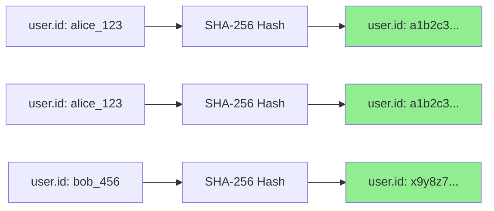
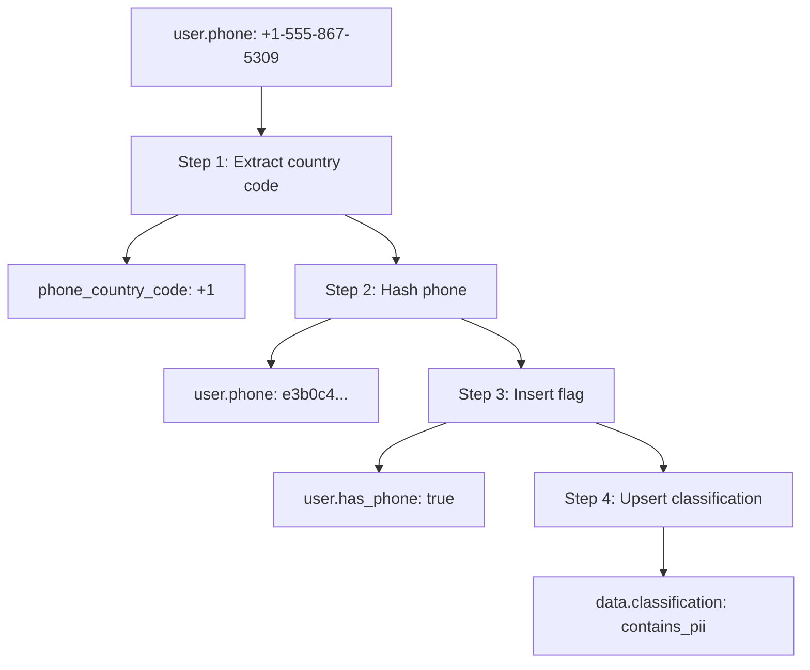
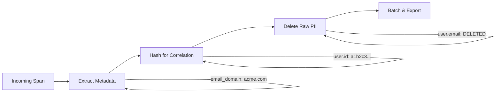

# How to Use the Attributes Processor to Hash, Delete, and Mask Sensitive Data

Author: [nawazdhandala](https://www.github.com/nawazdhandala)

Tags: OpenTelemetry, Attributes Processor, Data Privacy, Hashing, Masking, Collector

Description: Learn how to use the OpenTelemetry Collector attributes processor to hash, delete, extract, and mask sensitive data in span and log attributes with practical examples.

---

The attributes processor is one of the most versatile tools in the OpenTelemetry Collector. It lets you modify span attributes, log record attributes, and metric datapoint attributes as they flow through your pipeline. You can delete attributes, hash their values, insert new ones, extract patterns, and convert types.

For data privacy, three operations matter most: deleting attributes that should not exist in your telemetry, hashing values that need to be anonymized but still useful for correlation, and masking values to replace sensitive portions while keeping the rest readable.

This guide covers each operation with real configurations you can adapt for your own pipelines.

## The Attributes Processor Basics

The attributes processor is included in both the core and contrib distributions of the Collector. It works on all three signal types: traces, logs, and metrics. You configure it with a list of actions that execute in order.

Here is the simplest possible configuration, deleting a single attribute.

```yaml
# basic-delete.yaml
# Delete a single attribute from all spans
processors:
  attributes/basic:
    actions:
      - key: user.email    # The attribute key to target
        action: delete      # Remove it entirely from the span
```

The supported actions are: `insert`, `update`, `upsert`, `delete`, `hash`, `extract`, and `convert`. Let's go through the ones relevant to data privacy.

## Deleting Sensitive Attributes

Deletion is the most straightforward approach. If an attribute should never appear in your observability backend, delete it.

This configuration removes a set of common PII-containing attributes from traces and logs.

```yaml
# delete-pii-attributes.yaml
# Remove attributes that commonly contain personally identifiable information
processors:
  attributes/delete-pii:
    actions:
      # Direct PII attributes
      - key: user.email
        action: delete
      - key: user.phone_number
        action: delete
      - key: user.full_name
        action: delete
      - key: user.address
        action: delete
      - key: enduser.id
        action: delete

      # Network attributes that reveal user identity
      - key: http.client_ip
        action: delete
      - key: client.address
        action: delete
      - key: net.peer.ip
        action: delete
      - key: source.address
        action: delete

      # Headers that may contain auth tokens
      - key: http.request.header.authorization
        action: delete
      - key: http.request.header.cookie
        action: delete

      # Request/response bodies - often contain PII
      - key: http.request.body
        action: delete
      - key: http.response.body
        action: delete

service:
  pipelines:
    traces:
      receivers: [otlp]
      processors: [attributes/delete-pii, batch]
      exporters: [otlp]
    logs:
      receivers: [otlp]
      processors: [attributes/delete-pii, batch]
      exporters: [otlp]
```

Deletion is permanent and happens in the pipeline. Once an attribute is deleted, no downstream processor or exporter can access it. Order your processors carefully.

## Hashing Attribute Values

Sometimes you need to remove the raw value of an attribute but keep it useful for correlation. For example, you might want to see that two spans were triggered by the same user without knowing which user it was. Hashing is perfect for this.

The `hash` action replaces the attribute value with its SHA-256 hash. The original value is unrecoverable from the hash, but identical inputs always produce the same hash. This means you can still group and filter spans by hashed user ID.

This configuration hashes user identifiers so they remain useful for correlation without exposing real values.

```yaml
# hash-user-attributes.yaml
# Hash user identifiers for anonymized correlation
processors:
  attributes/hash-users:
    actions:
      # Hash user.id - keeps correlation ability, removes raw value
      - key: user.id
        action: hash

      # Hash session ID - useful for grouping requests from same session
      - key: session.id
        action: hash

      # Hash device fingerprint
      - key: device.id
        action: hash

      # Hash account identifier
      - key: account.id
        action: hash
```

Before hashing, a span might look like this:

```
user.id: "user_alice_12345"
session.id: "sess_abc-def-ghi"
http.method: "GET"
http.route: "/api/orders"
```

After hashing:

```
user.id: "a1b2c3d4e5f6...64-char-hex-string"
session.id: "f6e5d4c3b2a1...64-char-hex-string"
http.method: "GET"
http.route: "/api/orders"
```

You can still query "show me all spans from the same user" by filtering on the hashed value. You just cannot reverse it back to "alice."



One important caveat: SHA-256 hashing of low-entropy values (like sequential user IDs such as 1, 2, 3) can be reversed with a rainbow table. If your user IDs are predictable, consider prepending a salt before hashing. The attributes processor does not support salted hashing natively, so you would need to handle this at the SDK level or use the transform processor with OTTL.

## Masking with the Extract Action

The `extract` action lets you apply a regex to an attribute value and pull out specific capture groups into new attributes. While it is not a dedicated masking function, you can use it creatively to keep only the non-sensitive parts of a value.

This configuration extracts the domain from an email address, preserving useful information while discarding the personal part.

```yaml
# extract-domain-from-email.yaml
# Extract just the domain from email addresses
processors:
  attributes/extract-email-domain:
    actions:
      # First, extract the domain portion of the email into a new attribute
      - key: user.email
        pattern: "^[^@]+@(?P<email_domain>.+)$"
        action: extract

      # Then delete the original email attribute
      - key: user.email
        action: delete
```

If the incoming span has `user.email: alice@acme-corp.com`, this produces:

```
email_domain: "acme-corp.com"
# user.email is gone
```

You keep the organizational context (which company this request came from) without retaining the individual's email address.

Here is another example that masks a credit card number to show only the last four digits.

```yaml
# extract-last-four-digits.yaml
# Keep only the last four digits of a card number
processors:
  attributes/mask-card:
    actions:
      # Extract last 4 digits into a new attribute
      - key: payment.card_number
        pattern: "^.+(?P<card_last_four>[0-9]{4})$"
        action: extract

      # Delete the full card number
      - key: payment.card_number
        action: delete

      # Now we have card_last_four: "4242" instead of
      # payment.card_number: "4242424242424242"
```

## Combining Actions in Order

Actions execute sequentially in the order you list them. This is critical when you chain operations. You might want to extract information from an attribute, hash the original, and then insert a static replacement.

This configuration demonstrates a multi-step masking pipeline for a user profile attribute.

```yaml
# multi-step-masking.yaml
# Chain multiple actions for sophisticated data handling
processors:
  attributes/multi-step:
    actions:
      # Step 1: Extract the country code from a phone number
      - key: user.phone
        pattern: "^(?P<phone_country_code>\\+[0-9]{1,3})"
        action: extract

      # Step 2: Hash the phone number for correlation
      - key: user.phone
        action: hash

      # Step 3: Insert a flag indicating this span had a phone number
      - key: user.has_phone
        value: true
        action: insert

      # Step 4: Upsert (update or insert) a data classification tag
      - key: data.classification
        value: "contains_pii"
        action: upsert
```

After processing, a span with `user.phone: +1-555-867-5309` becomes:

```
user.phone: "e3b0c44298fc...hashed"
phone_country_code: "+1"
user.has_phone: true
data.classification: "contains_pii"
```



## Conditional Processing with Include/Exclude

You do not always want to process every span the same way. The attributes processor supports `include` and `exclude` filters to target specific spans based on their properties.

This configuration only hashes user IDs for spans from the payment service, where the data is more sensitive.

```yaml
# conditional-processing.yaml
# Apply different masking rules based on service name
processors:
  # Strict processing for payment service spans
  attributes/payment-strict:
    include:
      match_type: strict
      services:
        - "payment-service"
        - "billing-service"
    actions:
      - key: user.id
        action: hash
      - key: order.id
        action: hash
      - key: payment.method
        action: delete
      - key: payment.card_number
        action: delete

  # Lighter processing for other services
  attributes/general:
    exclude:
      match_type: strict
      services:
        - "payment-service"
        - "billing-service"
    actions:
      - key: user.email
        action: delete
      - key: user.phone
        action: delete

service:
  pipelines:
    traces:
      receivers: [otlp]
      # Both processors run, but each only applies to matching spans
      processors: [attributes/payment-strict, attributes/general, batch]
      exporters: [otlp]
```

You can also filter by span name, attribute values, or resource attributes using `match_type: regexp` for regex-based matching.

```yaml
# regex-filtering.yaml
# Process only spans that match a URL pattern
processors:
  attributes/api-endpoints:
    include:
      match_type: regexp
      span_names:
        - "GET /api/users/.*"
        - "POST /api/users/.*"
    actions:
      - key: url.full
        action: hash
```

## Working with Metrics

The attributes processor also works on metric datapoint attributes (labels). This is useful for removing high-cardinality PII labels from custom metrics.

This configuration removes user-level labels from metrics while keeping operational labels intact.

```yaml
# metrics-attributes.yaml
# Remove PII labels from metric datapoints
processors:
  attributes/metrics-pii:
    actions:
      - key: user_id
        action: delete
      - key: customer_email
        action: delete
      - key: client_ip
        action: delete
      - key: user_agent
        action: hash  # Hash for grouping, not raw value

service:
  pipelines:
    metrics:
      receivers: [otlp]
      processors: [attributes/metrics-pii, batch]
      exporters: [otlp]
```

Be careful when deleting metric labels. Unlike span attributes, metric labels define the metric's dimensional identity. Removing a label changes which time series the datapoint belongs to, and can cause unexpected aggregation behavior. Test in staging first.

## Complete Production Example

Here is a full Collector configuration that combines deletion, hashing, and extraction for a comprehensive data privacy pipeline.

```yaml
# production-attributes-pipeline.yaml
receivers:
  otlp:
    protocols:
      grpc:
        endpoint: "0.0.0.0:4317"
      http:
        endpoint: "0.0.0.0:4318"

processors:
  # Stage 1: Extract useful metadata before deleting PII
  attributes/extract:
    actions:
      - key: user.email
        pattern: "^[^@]+@(?P<user_email_domain>.+)$"
        action: extract
      - key: user.phone
        pattern: "^(?P<user_phone_country>\\+[0-9]{1,3})"
        action: extract

  # Stage 2: Hash attributes needed for correlation
  attributes/hash:
    actions:
      - key: user.id
        action: hash
      - key: session.id
        action: hash
      - key: device.id
        action: hash

  # Stage 3: Delete raw PII
  attributes/delete:
    actions:
      - key: user.email
        action: delete
      - key: user.phone
        action: delete
      - key: user.full_name
        action: delete
      - key: user.address
        action: delete
      - key: http.client_ip
        action: delete
      - key: client.address
        action: delete
      - key: http.request.header.authorization
        action: delete
      - key: http.request.header.cookie
        action: delete

  batch:
    send_batch_size: 8192
    timeout: 5s

  memory_limiter:
    check_interval: 1s
    limit_mib: 4096
    spike_limit_mib: 1024

exporters:
  otlp:
    endpoint: "backend.observability:4317"
    tls:
      insecure: false

service:
  pipelines:
    traces:
      receivers: [otlp]
      # Order matters: extract first, then hash, then delete, then batch
      processors: [memory_limiter, attributes/extract, attributes/hash, attributes/delete, batch]
      exporters: [otlp]
    logs:
      receivers: [otlp]
      processors: [memory_limiter, attributes/hash, attributes/delete, batch]
      exporters: [otlp]
```



## Performance Notes

The attributes processor is lightweight. Delete and hash operations add microseconds per span. The extract action is slightly more expensive because it runs regex matching, but still negligible for most workloads. Even at 50,000 spans per second, the attributes processor typically adds less than 1% CPU overhead.

If you are chaining many processors (attributes, redaction, transform), profile your pipeline with the Collector's internal metrics. Look at `otelcol_processor_batch_timeout_trigger_send` and pipeline latency to spot bottlenecks.

## Wrapping Up

The attributes processor is your Swiss Army knife for data privacy in the OpenTelemetry Collector. Use `delete` to remove attributes that should never leave your infrastructure. Use `hash` to anonymize values while preserving their usefulness for grouping and correlation. Use `extract` to keep safe portions of sensitive attributes.

Combine these actions with `include`/`exclude` filters for service-specific rules, and chain multiple processor instances for a multi-stage pipeline. The key is to process in the right order: extract useful metadata first, hash what you need for correlation, and delete the raw PII last.
