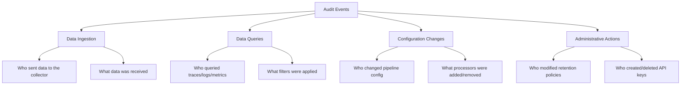
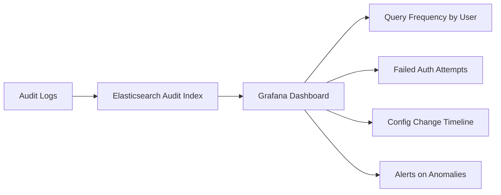

# How to Set Up Audit Logging for OpenTelemetry Telemetry Access

Author: [nawazdhandala](https://www.github.com/nawazdhandala)

Tags: OpenTelemetry, Audit Logging, Security, Compliance, Observability, Access Control

Description: A practical guide to implementing audit logging that tracks who accesses your OpenTelemetry telemetry data and what they do with it.

---

Telemetry data is not just operational noise. Traces, logs, and metrics contain information about your system's internal behavior, and often include sensitive details like user identifiers, query patterns, and error states. When regulations or internal security policies require you to know who accessed this data, when, and what they did with it, you need audit logging.

Audit logging for telemetry access means tracking every interaction with your observability data: who queried it, who exported it, who modified retention policies, and who configured the pipelines. This guide covers how to set up audit logging across the OpenTelemetry Collector, your storage backends, and the query layer.

## What to Audit

Before implementing anything, define what actions need to be tracked. A good audit logging strategy for telemetry covers four categories.



Not every environment needs all of these. Start with data queries and configuration changes, since those are the most commonly required by compliance frameworks.

## Auditing Access at the Collector Level

The OpenTelemetry Collector itself does not have built-in audit logging. But you can add it through a combination of extensions, processors, and external tooling.

### Using the Headers Forwarder for Client Identity

When collectors receive data from instrumented applications, you can require an authentication header that identifies the sender. The `headers_setter` extension and authentication extensions let you capture this information.

```yaml
# Collector config that uses the OIDC authenticator
# to identify and log which service sent telemetry data
extensions:
  oidc:
    # Verify JWT tokens from clients sending telemetry
    issuer_url: https://auth.company.com
    audience: otel-collector

receivers:
  otlp:
    protocols:
      grpc:
        endpoint: 0.0.0.0:4317
        auth:
          authenticator: oidc

processors:
  batch:
    timeout: 5s

exporters:
  otlp/backend:
    endpoint: backend:4317

service:
  extensions: [oidc]
  pipelines:
    traces:
      receivers: [otlp]
      processors: [batch]
      exporters: [otlp/backend]
```

With OIDC authentication enabled, every incoming connection must present a valid JWT. The collector validates it against the identity provider. To actually log these authentication events, you need to enable the collector's internal logging at a sufficient level.

### Logging Collector Operations

Enable structured logging on the collector to capture operational events.

```yaml
# Enable detailed logging on the collector
# This captures connection events, authentication results, and errors
service:
  telemetry:
    logs:
      level: info
      # Use JSON format for structured log ingestion
      encoding: json
      output_paths: ["stdout", "/var/log/otel/collector-audit.log"]
      # Include caller information for traceability
      initial_fields:
        component: "otel-collector"
        environment: "production"
```

These logs capture when the collector starts, when pipelines change, when connections are established, and when authentication fails. Forward them to a tamper-resistant log store.

## Auditing Queries on Storage Backends

The most important audit trail tracks who queries your telemetry data. This is where most compliance requirements focus.

### Elasticsearch / OpenSearch Audit Logging

Elasticsearch has built-in audit logging. Enable it to track all search queries against your telemetry indices.

```yaml
# elasticsearch.yml - Enable audit logging for telemetry access
# This records every search, update, and delete operation
xpack.security.audit.enabled: true
xpack.security.audit.logfile.events.include:
  - access_granted
  - access_denied
  - authentication_failed
  - connection_granted
  - connection_denied

# Filter to only audit actions on telemetry indices
xpack.security.audit.logfile.events.emit_request_body: true
xpack.security.audit.logfile.events.ignore_filters:
  telemetry_filter:
    indices: ["otel-traces-*", "otel-logs-*", "otel-metrics-*"]
    actions: ["indices:data/read/*"]
```

The audit log entries include the authenticated user, the action performed, the index accessed, and the query body. Here is what a typical entry looks like.

```json
{
  "timestamp": "2026-02-06T10:30:00.000Z",
  "node.id": "es-node-1",
  "event.action": "access_granted",
  "user.name": "sre-engineer",
  "user.realm": "ldap",
  "request.name": "SearchRequest",
  "indices": ["otel-traces-2026.02.06"],
  "action": "indices:data/read/search",
  "request.body": "{\"query\":{\"term\":{\"service.name\":\"payment-service\"}}}"
}
```

### Grafana Audit Logging

If you use Grafana to query your telemetry, enable Grafana's enterprise audit logging to track dashboard access and data source queries.

```ini
# grafana.ini - Enable audit logging for all data access
[auditing]
enabled = true
# Log to both file and Grafana's internal database
loggers = file loki

[auditing.logs.file]
path = /var/log/grafana/audit.log

# Track these specific events
[auditing.logs.filters]
actions = "datasource:query,dashboard:view,alerting:read"
```

### Jaeger Query Audit Trail

Jaeger's query service does not have native audit logging, but you can add it using a reverse proxy that logs all requests.

```yaml
# Nginx reverse proxy in front of Jaeger Query
# Logs every API request with the authenticated user identity
server {
    listen 443 ssl;
    server_name jaeger.internal.company.com;

    ssl_certificate /etc/nginx/certs/server.crt;
    ssl_certificate_key /etc/nginx/certs/server.key;

    # Log format that captures the authenticated user and request details
    log_format audit_log '{"timestamp":"$time_iso8601",'
                         '"remote_addr":"$remote_addr",'
                         '"user":"$remote_user",'
                         '"method":"$request_method",'
                         '"uri":"$request_uri",'
                         '"status":$status,'
                         '"user_agent":"$http_user_agent"}';

    access_log /var/log/nginx/jaeger-audit.log audit_log;

    location / {
        # Require authentication before proxying to Jaeger
        auth_basic "Jaeger Access";
        auth_basic_user_file /etc/nginx/.htpasswd;

        proxy_pass http://jaeger-query:16686;
        proxy_set_header X-Forwarded-User $remote_user;
    }
}
```

## Centralized Audit Log Collection

Audit logs from the collector, backends, and query layers should be aggregated into a centralized, tamper-resistant store. Ironically, you can use another OpenTelemetry Collector pipeline for this.

```yaml
# Dedicated audit log collector
# Collects audit logs from all telemetry infrastructure components
# and forwards them to a write-once storage backend
receivers:
  filelog/collector-audit:
    include:
      - /var/log/otel/collector-audit.log
    operators:
      - type: json_parser
        timestamp:
          parse_from: attributes.timestamp
          layout: "%Y-%m-%dT%H:%M:%S.%LZ"

  filelog/elasticsearch-audit:
    include:
      - /var/log/elasticsearch/audit.log
    operators:
      - type: json_parser

  filelog/nginx-audit:
    include:
      - /var/log/nginx/jaeger-audit.log
    operators:
      - type: json_parser

processors:
  # Add metadata identifying this as an audit log
  attributes:
    actions:
      - key: log.type
        value: audit
        action: upsert
      - key: compliance.framework
        value: internal-security-policy
        action: upsert

  batch:
    timeout: 1s

exporters:
  # Send to a separate, protected audit log store
  elasticsearch/audit:
    endpoints: ["https://audit-es-cluster:9200"]
    logs_index: audit-logs
    auth:
      authenticator: basicauth/audit

service:
  pipelines:
    logs:
      receivers: [filelog/collector-audit, filelog/elasticsearch-audit, filelog/nginx-audit]
      processors: [attributes, batch]
      exporters: [elasticsearch/audit]
```

## Protecting Audit Log Integrity

Audit logs are only useful if they cannot be tampered with. Follow these principles:

1. **Separate storage**: Store audit logs in a different cluster than operational telemetry. Different access controls, different administrators.

2. **Write-once policies**: Use immutable storage where possible. S3 Object Lock or Elasticsearch's append-only indices prevent deletion.

3. **Access restrictions**: Only a small number of people should have read access to audit logs. Nobody except automated systems should have write access.

```yaml
# S3 bucket policy enforcing Object Lock for audit logs
# Once written, audit logs cannot be deleted or modified
{
  "Rules": [
    {
      "ObjectLockEnabled": "Enabled",
      "DefaultRetention": {
        "Mode": "COMPLIANCE",
        "Days": 365
      }
    }
  ]
}
```

## Building an Audit Dashboard

Having audit logs is one thing. Making them useful is another. Create dashboards that surface important patterns.

Key metrics to display:

- Number of telemetry queries per user per day
- Failed authentication attempts against the collector
- Configuration changes to pipelines over time
- Access to sensitive service traces (payment, auth, PII-handling services)
- After-hours access patterns



Set up alerts for anomalous behavior. If a user who normally queries metrics suddenly starts exporting large volumes of trace data, that is worth investigating.

## Wrapping Up

Audit logging for OpenTelemetry telemetry access requires effort at multiple layers: the collector, the storage backend, and the query interface. No single component provides a complete picture. By combining collector authentication logging, backend query audit trails, and a centralized audit log pipeline, you get a comprehensive record of who accessed your telemetry data and what they did. Store those audit logs in protected, immutable storage, build dashboards to spot anomalies, and you will be well positioned for compliance audits and security investigations.
