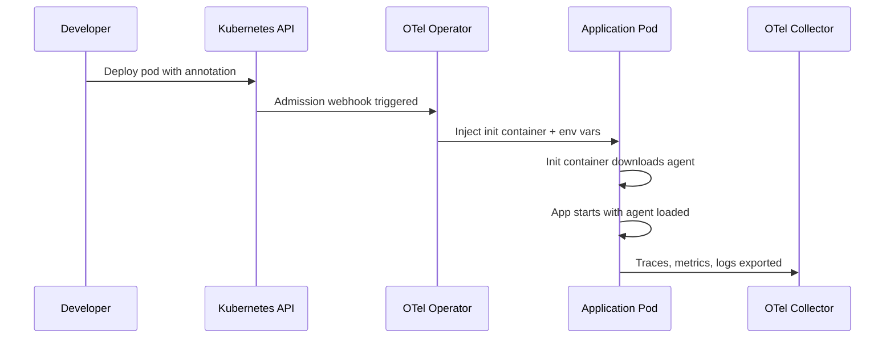

# How to Auto-Instrument Java, Python, and Node.js Apps in Kubernetes Without Code Changes

Author: [nawazdhandala](https://www.github.com/nawazdhandala)

Tags: OpenTelemetry, Kubernetes, Java, Python, Node.js, Auto-Instrumentation, Observability

Description: Learn how to automatically instrument Java, Python, and Node.js applications running in Kubernetes using the OpenTelemetry Operator without modifying a single line of application code.

---

One of the biggest barriers to adopting observability is the effort required to instrument your applications. You have to add SDKs, initialize tracers, wrap HTTP clients, annotate database calls, and so on. For teams running dozens or hundreds of microservices in Kubernetes, that kind of work doesn't scale.

The OpenTelemetry Operator for Kubernetes solves this problem. It lets you inject auto-instrumentation into Java, Python, and Node.js workloads using nothing more than a Kubernetes annotation. No code changes. No redeployment of your application images. Just a label on your pod spec, and traces start flowing.

In this guide, we'll walk through the full setup: installing the operator, creating instrumentation resources, and annotating your workloads.

## How Auto-Instrumentation Works in Kubernetes

The OpenTelemetry Operator uses a Kubernetes admission webhook to intercept pod creation. When it sees the right annotation on a pod, it injects an init container that downloads the appropriate instrumentation agent (Java JAR, Python packages, or Node.js modules) into a shared volume. It then modifies the pod's environment variables to load that agent at startup.

Here's a simplified flow of what happens:



Your application code stays completely untouched. The agent handles all the instrumentation for popular frameworks and libraries automatically.

## Prerequisites

Before you begin, make sure you have:

- A running Kubernetes cluster (1.21+)
- kubectl configured and pointing at your cluster
- Helm 3 installed
- cert-manager installed (the operator depends on it for webhook certificates)

If you don't have cert-manager yet, install it first:

```bash
# Install cert-manager, which the OTel Operator needs for TLS certificates
kubectl apply -f https://github.com/cert-manager/cert-manager/releases/download/v1.14.4/cert-manager.yaml
```

Wait for cert-manager pods to become ready before proceeding.

## Installing the OpenTelemetry Operator

The easiest way to install the operator is through its Helm chart.

```bash
# Add the OpenTelemetry Helm repository
helm repo add open-telemetry https://open-telemetry.github.io/opentelemetry-helm-charts
helm repo update

# Install the operator into the opentelemetry-operator-system namespace
helm install opentelemetry-operator open-telemetry/opentelemetry-operator \
  --namespace opentelemetry-operator-system \
  --create-namespace \
  --set admissionWebhooks.certManager.enabled=true
```

Verify the operator is running:

```bash
# Check that the operator pod is healthy
kubectl get pods -n opentelemetry-operator-system
```

You should see the operator pod in a Running state. At this point, the operator is watching for two custom resources: `OpenTelemetryCollector` and `Instrumentation`.

## Deploying an OpenTelemetry Collector

Before we instrument anything, we need a collector to receive the telemetry data. Here's a minimal collector deployment that accepts OTLP data and exports it to your backend.

```yaml
# otel-collector.yaml
# A basic collector that receives OTLP and forwards to your observability backend
apiVersion: opentelemetry.io/v1beta1
kind: OpenTelemetryCollector
metadata:
  name: otel-collector
  namespace: observability
spec:
  mode: deployment
  config:
    receivers:
      otlp:
        protocols:
          grpc:
            # Listen on the standard OTLP gRPC port
            endpoint: 0.0.0.0:4317
          http:
            # Listen on the standard OTLP HTTP port
            endpoint: 0.0.0.0:4318
    processors:
      batch:
        # Batch telemetry before exporting for better throughput
        send_batch_size: 1024
        timeout: 5s
    exporters:
      otlp:
        # Replace with your actual backend endpoint
        endpoint: "your-backend.example.com:4317"
        tls:
          insecure: false
    service:
      pipelines:
        traces:
          receivers: [otlp]
          processors: [batch]
          exporters: [otlp]
        metrics:
          receivers: [otlp]
          processors: [batch]
          exporters: [otlp]
```

Apply this configuration:

```bash
# Create the namespace and deploy the collector
kubectl create namespace observability
kubectl apply -f otel-collector.yaml
```

## Creating Instrumentation Resources

The `Instrumentation` custom resource tells the operator which languages to support and where to send telemetry. You can create one per namespace or one shared resource.

Here's an Instrumentation resource that supports all three languages:

```yaml
# instrumentation.yaml
# Defines auto-instrumentation settings for Java, Python, and Node.js
apiVersion: opentelemetry.io/v1alpha1
kind: Instrumentation
metadata:
  name: auto-instrumentation
  namespace: default
spec:
  # Where the instrumentation agent should send data
  exporter:
    endpoint: http://otel-collector-collector.observability.svc.cluster.local:4317
  propagators:
    - tracecontext
    - baggage
  sampler:
    # Sample everything in development; reduce this in production
    type: parentbased_traceidratio
    argument: "1.0"
  java:
    # Java agent image - uses the official OpenTelemetry Java agent
    image: ghcr.io/open-telemetry/opentelemetry-operator/autoinstrumentation-java:latest
    env:
      - name: OTEL_INSTRUMENTATION_JDBC_ENABLED
        value: "true"
  python:
    # Python auto-instrumentation packages
    image: ghcr.io/open-telemetry/opentelemetry-operator/autoinstrumentation-python:latest
    env:
      - name: OTEL_PYTHON_LOG_CORRELATION
        value: "true"
  nodejs:
    # Node.js auto-instrumentation modules
    image: ghcr.io/open-telemetry/opentelemetry-operator/autoinstrumentation-nodejs:latest
```

Apply it:

```bash
# Deploy the instrumentation resource
kubectl apply -f instrumentation.yaml
```

## Annotating Your Workloads

This is the simplest part. You just add one annotation to your pod template, and the operator takes care of the rest.

### Java Applications

For a Spring Boot app or any Java service, add the Java annotation:

```yaml
# java-deployment.yaml
# A standard Java deployment with the auto-instrumentation annotation
apiVersion: apps/v1
kind: Deployment
metadata:
  name: order-service
spec:
  replicas: 2
  selector:
    matchLabels:
      app: order-service
  template:
    metadata:
      labels:
        app: order-service
      annotations:
        # This single annotation triggers Java auto-instrumentation
        instrumentation.opentelemetry.io/inject-java: "true"
    spec:
      containers:
        - name: order-service
          image: myregistry/order-service:latest
          ports:
            - containerPort: 8080
```

The operator will inject the OpenTelemetry Java agent JAR and set the `JAVA_TOOL_OPTIONS` environment variable so the JVM picks it up automatically. Libraries like Spring Web, JDBC, gRPC, Kafka, and many others are instrumented out of the box.

### Python Applications

For Django, Flask, FastAPI, or any Python service:

```yaml
# python-deployment.yaml
# Python deployment with auto-instrumentation enabled
apiVersion: apps/v1
kind: Deployment
metadata:
  name: recommendation-service
spec:
  replicas: 2
  selector:
    matchLabels:
      app: recommendation-service
  template:
    metadata:
      labels:
        app: recommendation-service
      annotations:
        # Triggers Python auto-instrumentation injection
        instrumentation.opentelemetry.io/inject-python: "true"
    spec:
      containers:
        - name: recommendation-service
          image: myregistry/recommendation-service:latest
          ports:
            - containerPort: 5000
```

The operator injects the `opentelemetry-instrument` wrapper and sets environment variables so that `opentelemetry-distro` and the relevant instrumentors are loaded when your Python process starts. Django, Flask, FastAPI, requests, urllib3, psycopg2, and many other libraries get instrumented automatically.

### Node.js Applications

For Express, Fastify, NestJS, or any Node.js service:

```yaml
# nodejs-deployment.yaml
# Node.js deployment with auto-instrumentation enabled
apiVersion: apps/v1
kind: Deployment
metadata:
  name: notification-service
spec:
  replicas: 2
  selector:
    matchLabels:
      app: notification-service
  template:
    metadata:
      labels:
        app: notification-service
      annotations:
        # Triggers Node.js auto-instrumentation injection
        instrumentation.opentelemetry.io/inject-nodejs: "true"
    spec:
      containers:
        - name: notification-service
          image: myregistry/notification-service:latest
          ports:
            - containerPort: 3000
```

The operator sets the `NODE_OPTIONS` environment variable to `--require` the OpenTelemetry SDK before your app code runs. Express, HTTP, gRPC, MongoDB, MySQL, PostgreSQL, Redis, and other popular Node.js libraries get traced automatically.

## Verifying Instrumentation

After deploying your annotated workloads, verify the injection happened correctly:

```bash
# Check that the init container was injected into the pod
kubectl describe pod -l app=order-service | grep -A 5 "Init Containers"

# Check the environment variables were set
kubectl exec -it deploy/order-service -- env | grep OTEL

# Look at the collector logs to confirm data is arriving
kubectl logs -n observability deploy/otel-collector-collector --tail=50
```

If everything is working, you should see `OTEL_EXPORTER_OTLP_ENDPOINT`, `OTEL_SERVICE_NAME`, and language-specific variables like `JAVA_TOOL_OPTIONS` or `NODE_OPTIONS` set on the pod.

## Customizing Service Names and Resource Attributes

By default, the operator derives the service name from the pod's metadata. You can override this and add custom resource attributes using additional annotations:

```yaml
# Custom resource attributes via annotations
metadata:
  annotations:
    instrumentation.opentelemetry.io/inject-java: "true"
    # Override the default service name
    resource.opentelemetry.io/service-name: "order-service-v2"
    # Add custom resource attributes
    resource.opentelemetry.io/deployment.environment: "production"
    resource.opentelemetry.io/team: "backend-platform"
```

These show up as resource attributes on every span, metric, and log emitted by that workload, which makes filtering and grouping in your observability backend much easier.

## Production Considerations

A few things to keep in mind before rolling this out across your cluster:

**Sampling**: Don't sample 100% of traces in production. Set the sampler argument to something like `0.1` (10%) or use a tail-sampling processor in your collector to keep interesting traces while dropping routine ones.

**Image pinning**: Don't use `latest` tags for the instrumentation images. Pin them to specific versions so your instrumentation doesn't change unexpectedly during pod restarts.

**Resource limits**: The injected init containers and the agent running inside your app consume some memory and CPU. For Java, the agent typically adds 50-100MB of heap. For Python and Node.js, the overhead is smaller but still worth accounting for in your resource requests.

**Namespace isolation**: Create separate `Instrumentation` resources per namespace if different teams need different configurations, sampling rates, or export endpoints.

## Wrapping Up

The OpenTelemetry Operator makes it remarkably straightforward to get full distributed tracing across polyglot Kubernetes workloads. The workflow is simple: install the operator, create an Instrumentation resource, and add an annotation. That's it. No SDK integration, no code reviews for instrumentation changes, no rebuilding container images.

For teams that want to start getting value from distributed tracing today without committing to a months-long instrumentation project, auto-instrumentation is the fastest path. You can always layer on manual instrumentation later for the spans and attributes that matter most to your specific domain.
