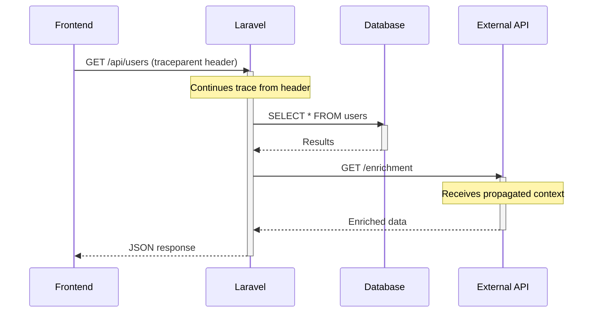

# How to Auto-Instrument a Laravel Application with opentelemetry-auto-laravel

Author: [nawazdhandala](https://www.github.com/nawazdhandala)

Tags: OpenTelemetry, PHP, Laravel, Auto-Instrumentation, Tracing

Description: Learn how to automatically instrument your Laravel application with OpenTelemetry using the opentelemetry-auto-laravel package for instant observability.

Getting observability into your Laravel application shouldn't require weeks of manual instrumentation. The `opentelemetry-auto-laravel` package provides automatic instrumentation for Laravel applications, capturing traces for HTTP requests, database queries, cache operations, and more without writing boilerplate code.

This guide walks through setting up auto-instrumentation in a Laravel application, from installation to exporting traces to an OpenTelemetry collector.

## Why Auto-Instrumentation Matters

Manual instrumentation means adding tracing code throughout your application. Every controller, service, and repository needs explicit span creation and management. This approach is time-consuming and error-prone.

Auto-instrumentation solves this by hooking into Laravel's lifecycle events and framework components. The moment a request arrives, spans are created automatically. Database queries, cache hits, HTTP client calls, and queue dispatches all generate traces without additional code.

## Prerequisites

Before starting, ensure you have:

- Laravel 9.x or higher
- PHP 8.0 or higher
- Composer installed
- An OpenTelemetry collector endpoint (local or remote)

## Installing the OpenTelemetry PHP Extension

The OpenTelemetry PHP auto-instrumentation relies on a PHP extension that hooks into the PHP runtime.

```bash
# Install the OpenTelemetry PHP extension via PECL
pecl install opentelemetry

# Enable the extension in your php.ini
echo "extension=opentelemetry.so" >> /usr/local/etc/php/php.ini
```

Verify the extension is loaded:

```bash
php -m | grep opentelemetry
```

## Installing opentelemetry-auto-laravel

Add the package to your Laravel project using Composer:

```bash
composer require open-telemetry/opentelemetry-auto-laravel
```

The package uses Laravel's auto-discovery feature, so the service provider registers automatically. For manual registration, add the provider to `config/app.php`:

```php
'providers' => [
    // Other providers...
    OpenTelemetry\Contrib\Instrumentation\Laravel\LaravelServiceProvider::class,
],
```

## Configuring the Service Provider

Publish the OpenTelemetry configuration file:

```bash
php artisan vendor:publish --tag=opentelemetry-config
```

This creates `config/opentelemetry.php`. Configure your service name and exporter settings:

```php
<?php

return [
    // Service name appears in traces to identify your application
    'service_name' => env('OTEL_SERVICE_NAME', 'laravel-app'),

    // Service version for tracking deployments
    'service_version' => env('OTEL_SERVICE_VERSION', '1.0.0'),

    // Environment (production, staging, development)
    'deployment_environment' => env('APP_ENV', 'production'),

    // OTLP exporter endpoint
    'exporter' => [
        'endpoint' => env('OTEL_EXPORTER_OTLP_ENDPOINT', 'http://localhost:4318'),
        'protocol' => env('OTEL_EXPORTER_OTLP_PROTOCOL', 'http/protobuf'),
        'headers' => env('OTEL_EXPORTER_OTLP_HEADERS', ''),
    ],

    // Sampling configuration
    'sampler' => [
        'type' => env('OTEL_TRACES_SAMPLER', 'always_on'),
        'ratio' => env('OTEL_TRACES_SAMPLER_ARG', 1.0),
    ],
];
```

Update your `.env` file with your collector details:

```env
OTEL_SERVICE_NAME=laravel-shop-api
OTEL_SERVICE_VERSION=2.1.0
OTEL_EXPORTER_OTLP_ENDPOINT=http://localhost:4318
OTEL_TRACES_SAMPLER=parentbased_traceidratio
OTEL_TRACES_SAMPLER_ARG=0.5
```

## Understanding What Gets Auto-Instrumented

The package automatically instruments several Laravel components:

**HTTP Requests**: Every incoming HTTP request generates a root span with HTTP method, route, status code, and duration.

**Database Queries**: All Eloquent queries and raw SQL statements create spans with query text, bindings, and execution time.

**Cache Operations**: Cache hits, misses, reads, and writes generate spans with keys and store information.

**HTTP Client**: Outgoing HTTP requests made via Laravel's HTTP client create spans with URLs, methods, and response codes.

**Queue Jobs**: Dispatched queue jobs create spans that connect to the parent request trace.

**Events**: Laravel event dispatching creates spans showing event propagation.

## Verifying Auto-Instrumentation Works

Start your Laravel application and make a request:

```bash
php artisan serve
```

Visit `http://localhost:8000` in your browser. The auto-instrumentation captures this request immediately.

Check your OpenTelemetry collector logs or backend. You should see traces with spans for:

- HTTP request to the route
- Any database queries executed
- Cache operations performed
- External HTTP calls made

## Trace Context Propagation

Auto-instrumentation handles trace context propagation automatically. When your Laravel app receives a request with W3C Trace Context headers, it continues the existing trace rather than starting a new one.



When your Laravel app makes outbound HTTP calls, it automatically injects trace context headers:

```php
// This HTTP call automatically propagates trace context
$response = Http::get('https://api.example.com/data');

// The external service receives traceparent and tracestate headers
// If instrumented, it continues the distributed trace
```

## Customizing Auto-Instrumentation Behavior

While auto-instrumentation works out of the box, you can customize behavior by creating a custom instrumentation class.

Create `app/Observability/CustomInstrumentation.php`:

```php
<?php

namespace App\Observability;

use OpenTelemetry\API\Trace\SpanInterface;
use OpenTelemetry\API\Trace\StatusCode;

class CustomInstrumentation
{
    /**
     * Add custom attributes to HTTP request spans
     */
    public function enrichHttpSpan(SpanInterface $span, $request): void
    {
        // Add user information if authenticated
        if (auth()->check()) {
            $span->setAttribute('user.id', auth()->id());
            $span->setAttribute('user.email', auth()->user()->email);
            $span->setAttribute('user.role', auth()->user()->role);
        }

        // Add request metadata
        $span->setAttribute('http.client_ip', $request->ip());
        $span->setAttribute('http.user_agent', $request->userAgent());

        // Add custom business context
        if ($request->header('X-Tenant-ID')) {
            $span->setAttribute('tenant.id', $request->header('X-Tenant-ID'));
        }
    }

    /**
     * Add custom attributes to database query spans
     */
    public function enrichDatabaseSpan(SpanInterface $span, $query): void
    {
        // Add query metadata
        $span->setAttribute('db.row_count', $query->count());
        $span->setAttribute('db.slow_query', $query->time > 100);

        // Mark slow queries
        if ($query->time > 1000) {
            $span->setStatus(StatusCode::ERROR, 'Slow query detected');
            $span->setAttribute('db.performance_issue', true);
        }
    }
}
```

Register this instrumentation in `app/Providers/AppServiceProvider.php`:

```php
<?php

namespace App\Providers;

use Illuminate\Support\ServiceProvider;
use App\Observability\CustomInstrumentation;
use OpenTelemetry\Contrib\Instrumentation\Laravel\Watchers;

class AppServiceProvider extends ServiceProvider
{
    public function boot()
    {
        if (config('opentelemetry.enabled')) {
            $instrumentation = new CustomInstrumentation();

            // Hook into HTTP request watcher
            Watchers\RequestWatcher::addEnricher(
                fn($span, $request) => $instrumentation->enrichHttpSpan($span, $request)
            );

            // Hook into database query watcher
            Watchers\QueryWatcher::addEnricher(
                fn($span, $query) => $instrumentation->enrichDatabaseSpan($span, $query)
            );
        }
    }
}
```

## Filtering Sensitive Data

Avoid sending sensitive data in traces. Configure filtering for database queries:

```php
// config/opentelemetry.php

return [
    // Previous configuration...

    'instrumentation' => [
        'database' => [
            'enabled' => true,
            // Sanitize query bindings containing sensitive data
            'sanitize_bindings' => true,
            // Patterns to redact from queries
            'redact_patterns' => [
                '/password\s*=\s*[\'"][^\'"]*[\'"]/i' => 'password=***',
                '/token\s*=\s*[\'"][^\'"]*[\'"]/i' => 'token=***',
                '/api_key\s*=\s*[\'"][^\'"]*[\'"]/i' => 'api_key=***',
            ],
        ],
        'http' => [
            'enabled' => true,
            // Headers to redact from HTTP spans
            'redact_headers' => ['Authorization', 'Cookie', 'X-Api-Key'],
        ],
    ],
];
```

## Performance Considerations

Auto-instrumentation adds minimal overhead, typically less than 5ms per request. However, consider these optimizations:

**Sampling**: Don't trace every request in high-traffic applications. Use ratio-based sampling:

```env
# Trace 10% of requests
OTEL_TRACES_SAMPLER=parentbased_traceidratio
OTEL_TRACES_SAMPLER_ARG=0.1
```

**Selective Instrumentation**: Disable instrumentation for components you don't need:

```php
// config/opentelemetry.php

'instrumentation' => [
    'http' => true,
    'database' => true,
    'cache' => false,  // Disable cache tracing
    'events' => false, // Disable event tracing
    'queue' => true,
],
```

**Batch Exporting**: Export traces in batches rather than individually:

```php
'batch_exporter' => [
    'enabled' => true,
    'max_queue_size' => 2048,
    'schedule_delay' => 5000, // milliseconds
    'export_timeout' => 30000, // milliseconds
    'max_export_batch_size' => 512,
],
```

## Troubleshooting Common Issues

**No traces appearing**: Verify the OpenTelemetry extension is loaded and the collector endpoint is reachable:

```bash
php -m | grep opentelemetry
curl http://localhost:4318/v1/traces
```

**Missing spans**: Check that instrumentation is enabled for the component in `config/opentelemetry.php`.

**High memory usage**: Reduce batch size or increase export frequency to prevent trace accumulation.

## Integration with OpenTelemetry Collectors

Send traces to an OpenTelemetry collector for processing and routing:

```yaml
# docker-compose.yml
version: '3.8'

services:
  otel-collector:
    image: otel/opentelemetry-collector:latest
    command: ["--config=/etc/otel-collector-config.yaml"]
    volumes:
      - ./otel-collector-config.yaml:/etc/otel-collector-config.yaml
    ports:
      - "4318:4318"  # OTLP HTTP receiver
      - "4317:4317"  # OTLP gRPC receiver
```

Configure the collector to receive and export traces:

```yaml
# otel-collector-config.yaml
receivers:
  otlp:
    protocols:
      http:
        endpoint: 0.0.0.0:4318
      grpc:
        endpoint: 0.0.0.0:4317

processors:
  batch:
    timeout: 10s
    send_batch_size: 1024

exporters:
  logging:
    loglevel: debug
  otlp:
    endpoint: your-backend:4317
    tls:
      insecure: false

service:
  pipelines:
    traces:
      receivers: [otlp]
      processors: [batch]
      exporters: [logging, otlp]
```

## Production Deployment Checklist

Before deploying to production:

1. Set appropriate service name and version
2. Configure sampling ratio based on traffic volume
3. Enable batch exporting for performance
4. Set up filtering for sensitive data
5. Configure health checks to monitor collector connectivity
6. Test trace context propagation across services
7. Monitor instrumentation overhead in production

Auto-instrumentation with `opentelemetry-auto-laravel` provides instant observability for Laravel applications. You get distributed tracing across your entire stack without manual span management, making it easier to debug performance issues and understand request flows through your system.
