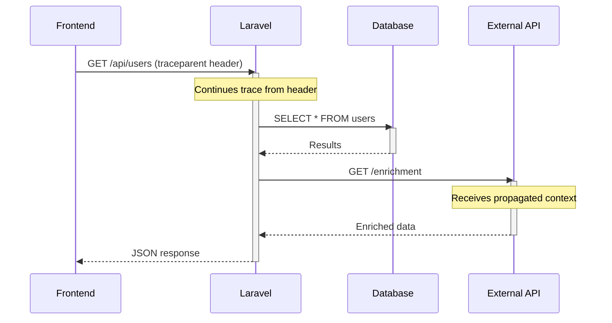

# How to Auto-Instrument a Laravel Application with opentelemetry-auto-laravel

Author: [nawazdhandala](https://www.github.com/nawazdhandala)

Tags: OpenTelemetry, PHP, Laravel, Auto-Instrumentation, Tracing

Description: Learn how to automatically instrument your Laravel application with OpenTelemetry using the opentelemetry-auto-laravel package for instant observability.

Getting observability into your Laravel application shouldn't require weeks of manual instrumentation. The `opentelemetry-auto-laravel` package provides automatic instrumentation for Laravel applications, capturing traces for HTTP requests, database queries, cache operations, and more without writing boilerplate code.

This guide walks through setting up auto-instrumentation in a Laravel application, from installation to exporting traces to an OpenTelemetry collector.

## Why Auto-Instrumentation Matters

Manual instrumentation means adding tracing code throughout your application. Every controller, service, and repository needs explicit span creation and management. This approach is time-consuming and error-prone.

Auto-instrumentation solves this by hooking into Laravel's lifecycle events and framework components. The moment a request arrives, spans are created automatically. Database queries, cache hits, HTTP client calls, and queue dispatches all generate traces without additional code.

## Prerequisites

Before starting, ensure you have:

- Laravel 9.x or higher
- PHP 8.1 or higher
- Composer installed
- An OpenTelemetry collector endpoint (local or remote)

## Installing the OpenTelemetry PHP Extension

The OpenTelemetry PHP auto-instrumentation relies on a PHP extension that hooks into the PHP runtime.

```bash
# Install the OpenTelemetry PHP extension via PECL

pecl install opentelemetry

# Enable the extension in your php.ini
echo "extension=opentelemetry.so" >> /usr/local/etc/php/php.ini
```

Verify the extension is loaded:

```bash
php -m | grep opentelemetry
```

## Installing opentelemetry-auto-laravel

Add the package to your Laravel project using Composer:

```bash
composer require \
    open-telemetry/sdk \
    open-telemetry/exporter-otlp \
    open-telemetry/opentelemetry-auto-laravel
```

The package registers its hooks through Composer's autoload files. After installing the package, make sure Composer's generated autoloader is loaded by your application, which is the default for Laravel applications.

## Configuring OpenTelemetry

Configure OpenTelemetry with environment variables. Update your `.env` file with your service and collector details:

```env
OTEL_PHP_AUTOLOAD_ENABLED=true
OTEL_SERVICE_NAME=laravel-shop-api
OTEL_RESOURCE_ATTRIBUTES=service.version=2.1.0,deployment.environment=production
OTEL_TRACES_EXPORTER=otlp
OTEL_EXPORTER_OTLP_PROTOCOL=http/protobuf
OTEL_EXPORTER_OTLP_ENDPOINT=http://localhost:4318
OTEL_PROPAGATORS=baggage,tracecontext
OTEL_TRACES_SAMPLER=parentbased_traceidratio
OTEL_TRACES_SAMPLER_ARG=0.5
```

## Understanding What Gets Auto-Instrumented

The package automatically instruments several Laravel components:

**HTTP Requests**: Every incoming HTTP request generates a server span with HTTP method, route, status code, and duration.

**Database Queries**: Laravel database query events create spans with SQL text, database attributes, and execution time.

**Cache Operations**: Cache hits, misses, writes, and forget operations are added as events on the current span.

**HTTP Client**: Outgoing HTTP requests made via Laravel's HTTP client create spans with URLs, methods, and response codes.

**Queue Jobs**: Queue publish and processing operations create messaging spans. Jobs can use the package's queue tracing contracts to choose parent, linked, or isolated trace behavior.

**Logs and Exceptions**: Laravel log events and exceptions are recorded so they can be correlated with the active trace.

## Verifying Auto-Instrumentation Works

Start your Laravel application and make a request:

```bash
php artisan serve
```

Visit `http://localhost:8000` in your browser. The auto-instrumentation captures this request immediately.

Check your OpenTelemetry collector logs or backend. You should see traces with spans for:

- HTTP request to the route
- Any database queries executed
- Cache operations performed
- External HTTP calls made

## Trace Context Propagation

Auto-instrumentation extracts incoming trace context automatically. When your Laravel app receives a request with W3C Trace Context headers, it continues the existing trace rather than starting a new one.


```mermaid
sequenceDiagram
    participant Frontend
    participant Laravel
    participant Database
    participant External API

    Frontend->>Laravel: GET /api/users (traceparent header)
    activate Laravel
    Note over Laravel: Continues trace from header

    Laravel->>Database: SELECT * FROM users
    activate Database
    Database-->>Laravel: Results
    deactivate Database

    Laravel->>External API: GET /enrichment
    activate External API
    Note over External API: Receives propagated context
    External API-->>Laravel: Enriched data
    deactivate External API

    Laravel-->>Frontend: JSON response
    deactivate Laravel
```

For outbound HTTP calls, use an instrumented client that injects context, such as a supported PSR-18 client with `open-telemetry/opentelemetry-auto-psr18`, or inject the headers explicitly before sending the request:

```php
use Illuminate\Support\Facades\Http;
use OpenTelemetry\API\Globals;
use OpenTelemetry\Context\Propagation\ArrayAccessGetterSetter;

$headers = [];
Globals::propagator()->inject($headers, ArrayAccessGetterSetter::getInstance());

$response = Http::withHeaders($headers)->get('https://api.example.com/data');

// The external service receives traceparent and, when present, tracestate headers
// If instrumented, it continues the distributed trace
```

## Customizing Auto-Instrumentation Behavior

While auto-instrumentation works out of the box, you can add custom attributes to the active span from normal Laravel code, such as middleware.

Create `app/Http/Middleware/EnrichOpenTelemetrySpan.php`:

```php
<?php

namespace App\Http\Middleware;

use Closure;
use Illuminate\Http\Request;
use OpenTelemetry\API\Trace\Span;
use Symfony\Component\HttpFoundation\Response;

class EnrichOpenTelemetrySpan
{
    /**
     * Add custom attributes to HTTP request spans
     */
    public function handle(Request $request, Closure $next): Response
    {
        $span = Span::getCurrent();

        // Add user information if authenticated
        if ($request->user()) {
            $span->setAttribute('user.id', $request->user()->getAuthIdentifier());
            $span->setAttribute('user.role', $request->user()->role ?? 'unknown');
        }

        // Add request metadata
        $span->setAttribute('client.address', $request->ip());
        $span->setAttribute('user_agent.original', $request->userAgent());

        // Add custom business context
        if ($request->header('X-Tenant-ID')) {
            $span->setAttribute('tenant.id', $request->header('X-Tenant-ID'));
        }

        return $next($request);
    }
}
```

Register this middleware with your HTTP middleware stack. In Laravel 9 and 10, add it to `app/Http/Kernel.php`:

```php
<?php

namespace App\Http;

use App\Http\Middleware\EnrichOpenTelemetrySpan;
use Illuminate\Foundation\Http\Kernel as HttpKernel;

class Kernel extends HttpKernel
{
    protected $middleware = [
        // Other middleware...
        EnrichOpenTelemetrySpan::class,
    ];
}
```

## Filtering Sensitive Data

Avoid sending sensitive data in traces. The Laravel auto-instrumentation records database statements, URLs, and selected request metadata, so review the attributes your application emits and avoid adding sensitive values in custom attributes. You can also limit attribute size and count with standard OpenTelemetry environment variables:

```env
OTEL_ATTRIBUTE_VALUE_LENGTH_LIMIT=4096
OTEL_SPAN_ATTRIBUTE_COUNT_LIMIT=128
```

## Performance Considerations

Auto-instrumentation adds runtime overhead, so measure it in your own application. Consider these optimizations:

**Sampling**: Don't trace every request in high-traffic applications. Use ratio-based sampling:

```env
# Trace 10% of requests
OTEL_TRACES_SAMPLER=parentbased_traceidratio
OTEL_TRACES_SAMPLER_ARG=0.1
```

**Selective Instrumentation**: Disable the Laravel instrumentation if you need to isolate overhead while troubleshooting:

```env
OTEL_PHP_DISABLED_INSTRUMENTATIONS=laravel
```

**Batch Exporting**: Export traces in batches rather than individually:

```env
OTEL_BSP_MAX_QUEUE_SIZE=2048
OTEL_BSP_SCHEDULE_DELAY=5000
OTEL_BSP_EXPORT_TIMEOUT=30000
OTEL_BSP_MAX_EXPORT_BATCH_SIZE=512
```

## Troubleshooting Common Issues

**No traces appearing**: Verify the OpenTelemetry extension is loaded and the collector endpoint is reachable:

```bash
php -m | grep opentelemetry
curl http://localhost:4318/v1/traces
```

**Missing spans**: Check that `OTEL_PHP_AUTOLOAD_ENABLED=true` is set, the SDK and exporter packages are installed, and `OTEL_PHP_DISABLED_INSTRUMENTATIONS` does not include `laravel`.

**High memory usage**: Reduce batch size or increase export frequency to prevent trace accumulation.

## Integration with OpenTelemetry Collectors

Send traces to an OpenTelemetry collector for processing and routing:

```yaml
# docker-compose.yml
version: '3.8'

services:
  otel-collector:
    image: otel/opentelemetry-collector:latest
    command: ["--config=/etc/otel-collector-config.yaml"]
    volumes:
      - ./otel-collector-config.yaml:/etc/otel-collector-config.yaml
    ports:
      - "4318:4318"  # OTLP HTTP receiver
      - "4317:4317"  # OTLP gRPC receiver
```

Configure the collector to receive and export traces:

```yaml
# otel-collector-config.yaml
receivers:
  otlp:
    protocols:
      http:
        endpoint: 0.0.0.0:4318
      grpc:
        endpoint: 0.0.0.0:4317

processors:
  batch:
    timeout: 10s
    send_batch_size: 1024

exporters:
  debug:
    verbosity: detailed
  otlp:
    endpoint: your-backend:4317
    tls:
      insecure: false

service:
  pipelines:
    traces:
      receivers: [otlp]
      processors: [batch]
      exporters: [debug, otlp]
```

## Production Deployment Checklist

Before deploying to production:

1. Set appropriate service name and version
2. Configure sampling ratio based on traffic volume
3. Enable batch exporting for performance
4. Set up filtering for sensitive data
5. Configure health checks to monitor collector connectivity
6. Test trace context propagation across services
7. Monitor instrumentation overhead in production

Auto-instrumentation with `opentelemetry-auto-laravel` provides instant observability for Laravel applications. You get distributed tracing across your entire stack without manual span management, making it easier to debug performance issues and understand request flows through your system.
