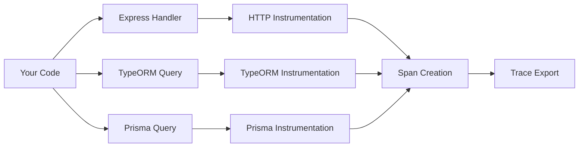

# How to Auto-Instrument NestJS with Express, TypeORM, and Prisma via OpenTelemetry

Author: [nawazdhandala](https://www.github.com/nawazdhandala)

Tags: OpenTelemetry, NestJS, Express, TypeORM, Prisma, Auto-Instrumentation

Description: Complete guide to automatically instrumenting NestJS applications with OpenTelemetry, covering Express HTTP server, TypeORM database queries, and Prisma ORM with zero code changes.

Auto-instrumentation is OpenTelemetry's killer feature. You get distributed tracing for your HTTP requests, database queries, and external API calls without modifying application code. For NestJS applications using Express, TypeORM, or Prisma, auto-instrumentation provides immediate visibility into your entire stack.

## Understanding Auto-Instrumentation

Auto-instrumentation works by monkey-patching Node.js modules at runtime. When you require or import a module like Express or TypeORM, OpenTelemetry intercepts the calls and wraps them with tracing logic. This happens transparently without changing your business logic.

The architecture looks like this:



## Installing Required Packages

Install the core OpenTelemetry SDK and auto-instrumentation packages:

```bash
npm install @opentelemetry/sdk-node \
            @opentelemetry/auto-instrumentations-node \
            @opentelemetry/instrumentation-express \
            @opentelemetry/instrumentation-http \
            @opentelemetry/instrumentation-nestjs-core \
            @opentelemetry/exporter-trace-otlp-http
```

For TypeORM auto-instrumentation:

```bash
npm install @opentelemetry/instrumentation-typeorm
```

For Prisma auto-instrumentation:

```bash
npm install @prisma/instrumentation
```

## Setting Up the Base Auto-Instrumentation

Create a centralized tracing setup that enables all auto-instrumentations:

```typescript
// src/instrumentation.ts

import { NodeSDK } from '@opentelemetry/sdk-node';
import { getNodeAutoInstrumentations } from '@opentelemetry/auto-instrumentations-node';
import { OTLPTraceExporter } from '@opentelemetry/exporter-trace-otlp-http';
import { Resource } from '@opentelemetry/resources';
import { SemanticResourceAttributes } from '@opentelemetry/semantic-conventions';

// This file must be imported before any other application code
export function setupInstrumentation() {
  const resource = new Resource({
    [SemanticResourceAttributes.SERVICE_NAME]: 'nestjs-auto-instrumented',
    [SemanticResourceAttributes.SERVICE_VERSION]: '1.0.0',
  });

  const traceExporter = new OTLPTraceExporter({
    url: process.env.OTEL_EXPORTER_OTLP_ENDPOINT || 'http://localhost:4318/v1/traces',
  });

  const sdk = new NodeSDK({
    resource,
    traceExporter,
    instrumentations: [
      getNodeAutoInstrumentations({
        // Enable all auto-instrumentations by default
        '@opentelemetry/instrumentation-fs': {
          enabled: false, // Disable filesystem tracing (too verbose)
        },
      }),
    ],
  });

  sdk.start();
  console.log('Auto-instrumentation initialized');

  // Graceful shutdown
  process.on('SIGTERM', () => {
    sdk.shutdown()
      .then(() => console.log('Tracing terminated'))
      .catch((error) => console.error('Error terminating tracing', error))
      .finally(() => process.exit(0));
  });
}
```

## Configuring Express Auto-Instrumentation

NestJS uses Express (or Fastify) under the hood. Configure Express instrumentation with custom options:

```typescript
// src/instrumentation.ts (updated)

import { NodeSDK } from '@opentelemetry/sdk-node';
import { getNodeAutoInstrumentations } from '@opentelemetry/auto-instrumentations-node';
import { ExpressInstrumentation } from '@opentelemetry/instrumentation-express';
import { HttpInstrumentation } from '@opentelemetry/instrumentation-http';

export function setupInstrumentation() {
  // ... resource and exporter setup ...

  const sdk = new NodeSDK({
    resource,
    traceExporter,
    instrumentations: [
      // HTTP instrumentation (captures outgoing HTTP requests)
      new HttpInstrumentation({
        enabled: true,
        ignoreIncomingPaths: [
          '/health',
          '/metrics',
          '/favicon.ico',
        ],
        requestHook: (span, request) => {
          // Add custom attributes to HTTP spans
          span.setAttribute('http.request.id', request.headers['x-request-id']);
        },
        responseHook: (span, response) => {
          // Add response-specific attributes
          span.setAttribute('http.response.content_length', response.headers['content-length']);
        },
      }),

      // Express instrumentation (captures Express middleware and routes)
      new ExpressInstrumentation({
        enabled: true,
        requestHook: (span, requestInfo) => {
          // Capture additional request context
          span.setAttribute('express.type', requestInfo.layerType);
        },
      }),

      // Auto-instrument other Node.js libraries
      getNodeAutoInstrumentations({
        '@opentelemetry/instrumentation-fs': {
          enabled: false,
        },
        '@opentelemetry/instrumentation-http': {
          enabled: false, // We configured it manually above
        },
        '@opentelemetry/instrumentation-express': {
          enabled: false, // We configured it manually above
        },
      }),
    ],
  });

  sdk.start();
}
```

## Adding TypeORM Auto-Instrumentation

TypeORM instrumentation captures all database queries automatically:

```typescript
// src/instrumentation.ts (updated for TypeORM)

import { TypeormInstrumentation } from '@opentelemetry/instrumentation-typeorm';

export function setupInstrumentation() {
  // ... previous setup ...

  const sdk = new NodeSDK({
    resource,
    traceExporter,
    instrumentations: [
      // ... previous instrumentations ...

      // TypeORM instrumentation
      new TypeormInstrumentation({
        enabled: true,
        // Capture query parameters (be careful with sensitive data)
        enhancedDatabaseReporting: process.env.NODE_ENV !== 'production',
        responseHook: (span, response) => {
          // Add query execution metadata
          if (response.records) {
            span.setAttribute('db.result.count', response.records.length);
          }
        },
      }),
    ],
  });

  sdk.start();
}
```

Configure your TypeORM connection in NestJS:

```typescript
// src/app.module.ts

import { Module } from '@nestjs/common';
import { TypeOrmModule } from '@nestjs/typeorm';
import { User } from './users/user.entity';

@Module({
  imports: [
    TypeOrmModule.forRoot({
      type: 'postgres',
      host: process.env.DB_HOST || 'localhost',
      port: parseInt(process.env.DB_PORT) || 5432,
      username: process.env.DB_USER || 'postgres',
      password: process.env.DB_PASSWORD || 'password',
      database: process.env.DB_NAME || 'myapp',
      entities: [User],
      synchronize: process.env.NODE_ENV !== 'production',
      logging: process.env.NODE_ENV === 'development',
    }),
  ],
})
export class AppModule {}
```

Example entity and repository that will be auto-instrumented:

```typescript
// src/users/user.entity.ts

import { Entity, Column, PrimaryGeneratedColumn } from 'typeorm';

@Entity()
export class User {
  @PrimaryGeneratedColumn()
  id: number;

  @Column()
  email: string;

  @Column()
  name: string;

  @Column({ type: 'timestamp', default: () => 'CURRENT_TIMESTAMP' })
  createdAt: Date;
}
```

```typescript
// src/users/users.service.ts

import { Injectable } from '@nestjs/common';
import { InjectRepository } from '@nestjs/typeorm';
import { Repository } from 'typeorm';
import { User } from './user.entity';

@Injectable()
export class UsersService {
  constructor(
    @InjectRepository(User)
    private usersRepository: Repository<User>,
  ) {}

  // This query will be automatically traced
  async findAll(): Promise<User[]> {
    return this.usersRepository.find();
  }

  // Complex queries are also traced automatically
  async findByEmail(email: string): Promise<User | null> {
    return this.usersRepository.findOne({ where: { email } });
  }

  // Even raw queries get instrumentation
  async getUserCount(): Promise<number> {
    const result = await this.usersRepository.query(
      'SELECT COUNT(*) as count FROM "user"'
    );
    return parseInt(result[0].count);
  }
}
```

## Adding Prisma Auto-Instrumentation

Prisma provides its own instrumentation package:

```typescript
// src/instrumentation.ts (updated for Prisma)

import { PrismaInstrumentation } from '@prisma/instrumentation';

export function setupInstrumentation() {
  // ... previous setup ...

  const sdk = new NodeSDK({
    resource,
    traceExporter,
    instrumentations: [
      // ... previous instrumentations ...

      // Prisma instrumentation
      new PrismaInstrumentation({
        middleware: true, // Enable Prisma middleware tracing
      }),
    ],
  });

  sdk.start();
}
```

Set up your Prisma client as a NestJS service:

```typescript
// src/prisma/prisma.service.ts

import { Injectable, OnModuleInit, OnModuleDestroy } from '@nestjs/common';
import { PrismaClient } from '@prisma/client';

@Injectable()
export class PrismaService extends PrismaClient implements OnModuleInit, OnModuleDestroy {
  async onModuleInit() {
    await this.$connect();
    console.log('Prisma connected');
  }

  async onModuleDestroy() {
    await this.$disconnect();
    console.log('Prisma disconnected');
  }
}
```

Example Prisma schema:

```prisma
// prisma/schema.prisma

generator client {
  provider = "prisma-client-js"
  previewFeatures = ["tracing"]
}

datasource db {
  provider = "postgresql"
  url      = env("DATABASE_URL")
}

model Post {
  id        Int      @id @default(autoincrement())
  title     String
  content   String?
  published Boolean  @default(false)
  authorId  Int
  author    User     @relation(fields: [authorId], references: [id])
  createdAt DateTime @default(now())
}

model User {
  id    Int    @id @default(autoincrement())
  email String @unique
  name  String
  posts Post[]
}
```

Service using Prisma with automatic tracing:

```typescript
// src/posts/posts.service.ts

import { Injectable } from '@nestjs/common';
import { PrismaService } from '../prisma/prisma.service';

@Injectable()
export class PostsService {
  constructor(private prisma: PrismaService) {}

  // All Prisma queries are automatically traced
  async findAll() {
    return this.prisma.post.findMany({
      include: { author: true },
    });
  }

  // Complex queries with relations are fully traced
  async findPublishedByAuthor(authorId: number) {
    return this.prisma.post.findMany({
      where: {
        authorId,
        published: true,
      },
      include: {
        author: {
          select: {
            id: true,
            name: true,
            email: true,
          },
        },
      },
      orderBy: {
        createdAt: 'desc',
      },
    });
  }

  // Transactions are traced as a single unit
  async createPostWithUser(email: string, postTitle: string) {
    return this.prisma.$transaction(async (tx) => {
      const user = await tx.user.create({
        data: { email, name: 'New User' },
      });

      const post = await tx.post.create({
        data: {
          title: postTitle,
          authorId: user.id,
        },
      });

      return { user, post };
    });
  }
}
```

## Initializing Instrumentation Before Application

The instrumentation must be loaded before any application code:

```typescript
// src/main.ts

// CRITICAL: Import instrumentation FIRST
import { setupInstrumentation } from './instrumentation';
setupInstrumentation();

// Now import NestJS and app code
import { NestFactory } from '@nestjs/core';
import { AppModule } from './app.module';

async function bootstrap() {
  const app = await NestFactory.create(AppModule);

  app.setGlobalPrefix('api');

  await app.listen(3000);
  console.log('Application is running on http://localhost:3000');
}

bootstrap();
```

## Viewing Auto-Instrumented Traces

When you make a request to your NestJS application, you'll see traces like this:

```
HTTP GET /api/users
├── express.middleware (Express)
├── nestjs.controller (NestJS Controller)
├── nestjs.service (NestJS Service)
│   └── typeorm.query (TypeORM)
│       └── SELECT * FROM "user"
└── express.response (Express)
```

For Prisma:

```
HTTP GET /api/posts
├── express.middleware
├── nestjs.controller
├── nestjs.service
│   └── prisma.query (Prisma)
│       └── findMany on Post
│           └── findMany on User (relation)
└── express.response
```

## Combining TypeORM and Prisma

You can use both ORMs in the same application with auto-instrumentation:

```typescript
// src/data/data.service.ts

import { Injectable } from '@nestjs/common';
import { InjectRepository } from '@nestjs/typeorm';
import { Repository } from 'typeorm';
import { User } from '../users/user.entity';
import { PrismaService } from '../prisma/prisma.service';

@Injectable()
export class DataService {
  constructor(
    @InjectRepository(User)
    private usersRepository: Repository<User>,
    private prisma: PrismaService,
  ) {}

  // Both queries will appear as separate spans in the trace
  async getUserStats() {
    // TypeORM query (automatically traced)
    const typeormUsers = await this.usersRepository.count();

    // Prisma query (automatically traced)
    const prismaUsers = await this.prisma.user.count();

    return {
      typeormCount: typeormUsers,
      prismaCount: prismaUsers,
    };
  }
}
```

## Fine-Tuning Auto-Instrumentation

Control which queries and operations get traced:

```typescript
// src/instrumentation.ts (advanced configuration)

import { TypeormInstrumentation } from '@opentelemetry/instrumentation-typeorm';
import { PrismaInstrumentation } from '@prisma/instrumentation';

export function setupInstrumentation() {
  const sdk = new NodeSDK({
    resource,
    traceExporter,
    instrumentations: [
      new TypeormInstrumentation({
        enabled: true,
        // Only capture slow queries in production
        enhancedDatabaseReporting: false,
        responseHook: (span, response) => {
          // Add custom logic based on query performance
          const duration = span.endTime ? span.endTime[0] - span.startTime[0] : 0;
          if (duration > 1) { // More than 1 second
            span.setAttribute('db.slow_query', true);
          }
        },
      }),

      new PrismaInstrumentation({
        middleware: true,
      }),

      new HttpInstrumentation({
        enabled: true,
        // Ignore specific endpoints
        ignoreIncomingPaths: [
          '/health',
          '/metrics',
          '/api/internal/*',
        ],
        // Don't trace outgoing requests to specific hosts
        ignoreOutgoingUrls: [
          /localhost:3000/,
          /internal-service\.local/,
        ],
      }),
    ],
  });

  sdk.start();
}
```

## Testing Auto-Instrumentation

Verify that traces are being created correctly:

```typescript
// test/tracing.e2e.spec.ts

import { Test, TestingModule } from '@nestjs/testing';
import { INestApplication } from '@nestjs/common';
import * as request from 'supertest';
import { AppModule } from '../src/app.module';
import { setupInstrumentation } from '../src/instrumentation';

describe('Auto-Instrumentation (e2e)', () => {
  let app: INestApplication;

  beforeAll(async () => {
    setupInstrumentation();

    const moduleFixture: TestingModule = await Test.createTestingModule({
      imports: [AppModule],
    }).compile();

    app = moduleFixture.createNestApplication();
    await app.init();
  });

  afterAll(async () => {
    await app.close();
  });

  it('should trace HTTP requests with database queries', async () => {
    const response = await request(app.getHttpServer())
      .get('/api/users')
      .expect(200);

    expect(response.body).toBeDefined();
    // Verify trace headers are present
    expect(response.headers['traceparent']).toBeDefined();
  });
});
```

## Common Auto-Instrumentation Issues

**Missing Spans**: Ensure instrumentation is loaded before application code. The `setupInstrumentation()` call must be the first import in main.ts.

**Duplicate Spans**: Happens when you manually instrument code that's already auto-instrumented. Disable manual instrumentation or the auto-instrumentation for that library.

**Performance Impact**: Auto-instrumentation has minimal overhead, but in extreme high-throughput scenarios, consider sampling or disabling verbose instrumentations.

**TypeORM Spans Missing**: TypeORM instrumentation requires TypeORM 0.3.0 or higher. Check your version and update if needed.

**Prisma Spans Missing**: Enable the tracing preview feature in your Prisma schema and ensure you're using @prisma/instrumentation version 5.0.0 or higher.

Auto-instrumentation gives you comprehensive observability without touching your business logic. For NestJS applications using Express, TypeORM, and Prisma, this approach provides immediate value and scales from development through production.
