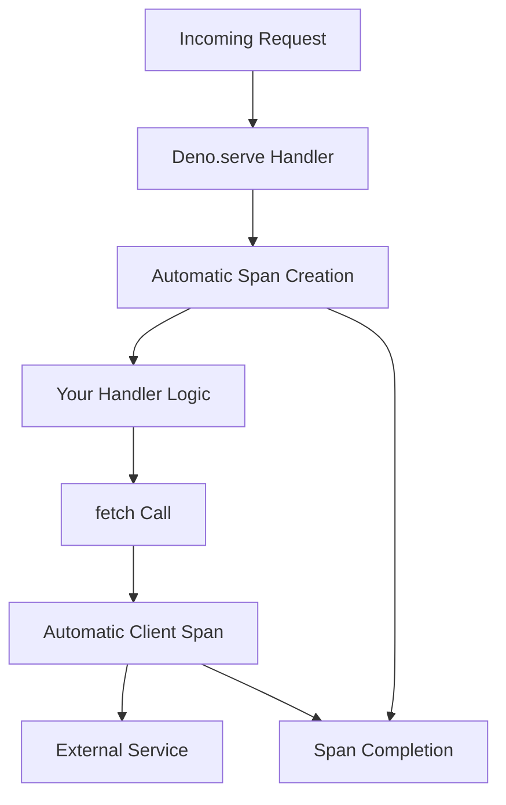

# How to Use Automatic Tracing for Deno.serve and Fetch with Zero Configuration

Author: [nawazdhandala](https://www.github.com/nawazdhandala)

Tags: OpenTelemetry, Deno, Automatic Tracing, Deno.serve, Fetch, Zero Config

Description: Learn how to implement automatic tracing for Deno.serve and fetch API calls using OpenTelemetry with zero configuration setup.

Deno's runtime provides built-in support for OpenTelemetry tracing, making it straightforward to instrument HTTP servers and outgoing fetch requests without manual span creation. This capability is particularly valuable when you need observability across distributed services but want to avoid the boilerplate code that typically comes with instrumentation.

The key difference between Deno's approach and traditional Node.js instrumentation is that Deno leverages runtime-level hooks rather than monkey-patching modules. This means cleaner integration and better performance characteristics.

## Understanding Deno's OpenTelemetry Integration

Deno 1.40 and later versions include native OpenTelemetry support through the `--unstable-otel` flag. When enabled, the runtime automatically creates spans for HTTP server requests and outgoing fetch calls without requiring you to modify application code.

The runtime integration works by intercepting specific APIs at the engine level:

- `Deno.serve()` - Creates a span for each incoming HTTP request
- `fetch()` - Creates a span for each outgoing HTTP request
- Propagates context automatically using W3C Trace Context headers



## Setting Up Automatic Tracing

First, create a basic Deno server that makes outgoing HTTP requests. This example demonstrates a service that fetches data from an external API and returns it to the client.

```typescript
// server.ts
// This handler receives requests, fetches data from an external API,
// and returns the result. All tracing happens automatically.

Deno.serve({
  port: 8000,
  handler: async (req: Request) => {
    const url = new URL(req.url);

    if (url.pathname === "/api/users") {
      // This fetch call will automatically create a client span
      const response = await fetch("https://jsonplaceholder.typicode.com/users");
      const users = await response.json();

      return new Response(JSON.stringify(users), {
        headers: { "content-type": "application/json" },
      });
    }

    if (url.pathname === "/api/posts") {
      // Multiple fetch calls create separate spans with proper parent-child relationships
      const [postsRes, commentsRes] = await Promise.all([
        fetch("https://jsonplaceholder.typicode.com/posts"),
        fetch("https://jsonplaceholder.typicode.com/comments"),
      ]);

      const posts = await postsRes.json();
      const comments = await commentsRes.json();

      return new Response(JSON.stringify({ posts, comments }), {
        headers: { "content-type": "application/json" },
      });
    }

    return new Response("Not Found", { status: 404 });
  },
});
```

To enable automatic tracing, run the server with OpenTelemetry configuration:

```bash
# Export traces to a local OTLP collector
deno run --unstable-otel \
  --allow-net \
  --allow-env \
  -E OTEL_EXPORTER_OTLP_ENDPOINT=http://localhost:4318 \
  -E OTEL_SERVICE_NAME=deno-api-server \
  server.ts
```

The `--unstable-otel` flag activates the runtime's OpenTelemetry integration. No code changes are needed in your application.

## Configuring the OTLP Exporter

Deno uses environment variables to configure OpenTelemetry behavior. Here are the essential configuration options:

```bash
# Basic configuration for OTLP HTTP exporter
export OTEL_EXPORTER_OTLP_ENDPOINT=http://localhost:4318
export OTEL_SERVICE_NAME=my-deno-service
export OTEL_TRACES_EXPORTER=otlp

# Configure sampling - useful for high-traffic services
export OTEL_TRACES_SAMPLER=parentbased_traceidratio
export OTEL_TRACES_SAMPLER_ARG=0.1  # Sample 10% of traces

# Add resource attributes for better filtering
export OTEL_RESOURCE_ATTRIBUTES=environment=production,version=1.0.0
```

Create a shell script to manage these settings:

```bash
#!/bin/bash
# run-with-tracing.sh
# Launches the Deno server with full OpenTelemetry configuration

export OTEL_EXPORTER_OTLP_ENDPOINT=${OTEL_ENDPOINT:-http://localhost:4318}
export OTEL_SERVICE_NAME=${SERVICE_NAME:-deno-service}
export OTEL_TRACES_EXPORTER=otlp
export OTEL_RESOURCE_ATTRIBUTES="environment=${ENV:-development},host=$(hostname)"

deno run \
  --unstable-otel \
  --allow-net \
  --allow-env \
  "$@"
```

## Trace Context Propagation

When your Deno service receives a request with trace context headers, the runtime automatically extracts and continues the trace. Similarly, outgoing fetch requests include propagation headers.

Here's a more complex example showing service-to-service communication:

```typescript
// proxy-service.ts
// This service acts as a proxy, demonstrating automatic context propagation
// across multiple service hops

interface BackendResponse {
  data: unknown;
  metadata: {
    timestamp: string;
    service: string;
  };
}

Deno.serve({
  port: 8001,
  handler: async (req: Request) => {
    const url = new URL(req.url);

    if (url.pathname === "/proxy/data") {
      try {
        // The trace context from the incoming request is automatically
        // propagated to this outgoing request via W3C Trace Context headers
        const backendUrl = "http://localhost:8002/backend/data";
        const response = await fetch(backendUrl, {
          headers: {
            "x-request-id": crypto.randomUUID(),
          },
        });

        if (!response.ok) {
          return new Response("Backend error", { status: 502 });
        }

        const data: BackendResponse = await response.json();

        // Add proxy metadata
        const enrichedData = {
          ...data,
          proxiedBy: "deno-proxy-service",
          proxiedAt: new Date().toISOString(),
        };

        return new Response(JSON.stringify(enrichedData), {
          headers: { "content-type": "application/json" },
        });
      } catch (error) {
        console.error("Proxy error:", error);
        return new Response("Service unavailable", { status: 503 });
      }
    }

    return new Response("Not Found", { status: 404 });
  },
});
```

## Viewing and Analyzing Traces

To see the automatic traces in action, you need an OpenTelemetry collector and a visualization tool. Here's a Docker Compose setup for local development:

```yaml
# docker-compose.yml
# Sets up Jaeger for trace collection and visualization

version: '3.8'

services:
  jaeger:
    image: jaegertracing/all-in-one:latest
    ports:
      - "16686:16686"  # Jaeger UI
      - "4318:4318"    # OTLP HTTP receiver
    environment:
      - COLLECTOR_OTLP_ENABLED=true
```

Start Jaeger with `docker-compose up -d`, then run your Deno service and make some requests:

```bash
# Start the service
./run-with-tracing.sh server.ts

# Generate some traffic
curl http://localhost:8000/api/users
curl http://localhost:8000/api/posts
```

Open Jaeger UI at `http://localhost:16686` to view the traces. You'll see spans for:

- The incoming HTTP request to `Deno.serve`
- Each outgoing `fetch` call
- Timing information for all operations
- Error status if requests failed

## Advanced Configuration Options

For production deployments, you'll want more control over trace behavior. Deno respects all standard OpenTelemetry environment variables:

```typescript
// config.ts
// Environment-based configuration for different deployment scenarios

export interface TracingConfig {
  enabled: boolean;
  endpoint: string;
  serviceName: string;
  sampleRate: number;
  attributes: Record<string, string>;
}

export function getTracingConfig(): TracingConfig {
  const env = Deno.env.get("ENVIRONMENT") || "development";

  return {
    enabled: Deno.env.get("OTEL_ENABLED") === "true",
    endpoint: Deno.env.get("OTEL_EXPORTER_OTLP_ENDPOINT") || "http://localhost:4318",
    serviceName: Deno.env.get("OTEL_SERVICE_NAME") || "deno-service",
    sampleRate: parseFloat(Deno.env.get("OTEL_TRACES_SAMPLER_ARG") || "1.0"),
    attributes: {
      environment: env,
      version: Deno.env.get("APP_VERSION") || "unknown",
      region: Deno.env.get("REGION") || "local",
    },
  };
}

// Load and validate configuration on startup
const config = getTracingConfig();
console.log("Tracing configuration:", JSON.stringify(config, null, 2));
```

## Handling Errors and Edge Cases

Automatic tracing captures errors, but you should still implement proper error handling. The trace will show failed spans when exceptions occur:

```typescript
// error-handling.ts
// Demonstrates how automatic tracing handles errors

Deno.serve({
  port: 8000,
  handler: async (req: Request) => {
    try {
      // This fetch might fail - the span will be marked as error
      const response = await fetch("https://api.example.com/might-fail", {
        signal: AbortSignal.timeout(5000), // 5 second timeout
      });

      if (!response.ok) {
        // Non-2xx responses are recorded in the span
        console.error(`HTTP ${response.status} from upstream`);
        return new Response("Upstream error", { status: response.status });
      }

      return new Response(await response.text());
    } catch (error) {
      // Exceptions are recorded in the span with error status
      console.error("Request failed:", error);

      if (error instanceof DOMException && error.name === "TimeoutError") {
        return new Response("Request timeout", { status: 504 });
      }

      return new Response("Internal error", { status: 500 });
    }
  },
});
```

## Performance Considerations

Automatic tracing adds minimal overhead, but there are some considerations for high-throughput services:

1. **Sampling**: Use trace sampling to reduce data volume. Set `OTEL_TRACES_SAMPLER=parentbased_traceidratio` and adjust the sample rate based on traffic.

2. **Batch Export**: The OTLP exporter batches spans by default. Configure batch size and timeout via environment variables:

```bash
export OTEL_BSP_SCHEDULE_DELAY=5000      # Export every 5 seconds
export OTEL_BSP_MAX_QUEUE_SIZE=2048      # Queue up to 2048 spans
export OTEL_BSP_MAX_EXPORT_BATCH_SIZE=512 # Export 512 spans per batch
```

3. **Resource Limits**: Monitor memory usage in production. The span queue can grow if the collector is unavailable.

## Integration with Existing Services

When adding Deno services to an existing traced infrastructure, ensure trace context propagation works end-to-end:

```typescript
// gateway.ts
// API gateway that propagates traces from external clients to backend services

Deno.serve({
  port: 8080,
  handler: async (req: Request) => {
    const url = new URL(req.url);

    // Extract any existing trace headers from incoming request
    // These are automatically propagated by Deno's runtime
    const headers = new Headers(req.headers);
    headers.set("x-forwarded-for", req.headers.get("x-forwarded-for") || "unknown");

    // Route to backend services
    let backendUrl: string;

    if (url.pathname.startsWith("/api/v1")) {
      backendUrl = `http://backend-v1:8001${url.pathname}`;
    } else if (url.pathname.startsWith("/api/v2")) {
      backendUrl = `http://backend-v2:8002${url.pathname}`;
    } else {
      return new Response("Not Found", { status: 404 });
    }

    // Forward request - trace context propagates automatically
    const response = await fetch(backendUrl, {
      method: req.method,
      headers: headers,
      body: req.body,
    });

    return new Response(response.body, {
      status: response.status,
      headers: response.headers,
    });
  },
});
```

Deno's zero-configuration tracing makes it simple to achieve end-to-end observability across distributed systems. The runtime handles context propagation, span lifecycle, and header management automatically, letting you focus on business logic rather than instrumentation code.

For services that need custom spans or additional attributes, you can combine automatic tracing with manual instrumentation using the OpenTelemetry SDK. The automatic traces provide a solid foundation while manual instrumentation adds business-specific context where needed.
