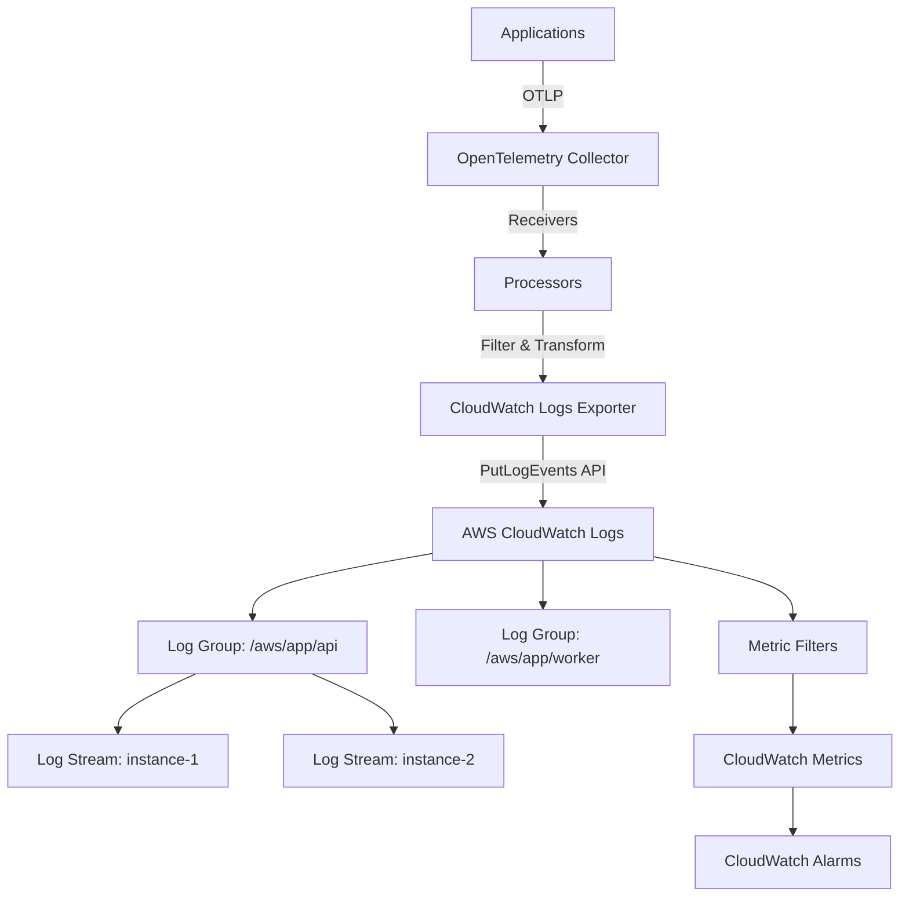

# How to Configure the AWS CloudWatch Logs Exporter in the OpenTelemetry Collector

Author: [nawazdhandala](https://www.github.com/nawazdhandala)

Tags: OpenTelemetry, Collector, Exporters, AWS, CloudWatch, Logs, Observability, Cloud

Description: Learn how to configure the AWS CloudWatch Logs exporter in OpenTelemetry Collector to centralize log management in AWS with log groups, streams, IAM permissions, and metric filters.

AWS CloudWatch Logs provides centralized log management for AWS resources and applications. The OpenTelemetry Collector's CloudWatch Logs exporter enables you to send logs collected through OpenTelemetry to CloudWatch, where you can leverage powerful querying capabilities, metric filters, alarms, and integrations with other AWS services.

## Why Use OpenTelemetry with CloudWatch Logs

Integrating OpenTelemetry with CloudWatch Logs offers significant benefits:

- **Unified collection**: Collect logs, traces, and metrics through a single OpenTelemetry pipeline
- **Advanced processing**: Filter, transform, and enrich logs before sending to CloudWatch
- **Cost optimization**: Reduce log volume through sampling and filtering before ingestion
- **Vendor neutrality**: Use OpenTelemetry instrumentation with the option to send logs to multiple destinations
- **Cross-service correlation**: Link logs with traces using trace and span IDs

## Architecture Overview

The CloudWatch Logs exporter organizes logs into hierarchical log groups and streams:



## Prerequisites

Before configuring the CloudWatch Logs exporter, ensure you have:

- OpenTelemetry Collector Contrib distribution
- AWS account with CloudWatch Logs access
- IAM credentials or role with appropriate permissions
- Network connectivity to CloudWatch Logs endpoints

## IAM Permissions

Create an IAM policy with necessary CloudWatch Logs permissions:

```json
{
  "Version": "2012-10-17",
  "Statement": [
    {
      "Effect": "Allow",
      "Action": [
        "logs:CreateLogGroup",
        "logs:CreateLogStream",
        "logs:PutLogEvents",
        "logs:DescribeLogGroups",
        "logs:DescribeLogStreams"
      ],
      "Resource": "arn:aws:logs:*:*:*"
    }
  ]
}
```

For production environments, scope the resource ARN to specific log groups:

```json
{
  "Version": "2012-10-17",
  "Statement": [
    {
      "Effect": "Allow",
      "Action": [
        "logs:CreateLogStream",
        "logs:PutLogEvents"
      ],
      "Resource": "arn:aws:logs:us-east-1:123456789012:log-group:/aws/otel/*:*"
    },
    {
      "Effect": "Allow",
      "Action": [
        "logs:CreateLogGroup"
      ],
      "Resource": "arn:aws:logs:us-east-1:123456789012:log-group:/aws/otel/*"
    }
  ]
}
```

## Basic Configuration

Here is a minimal configuration for sending logs to CloudWatch:

```yaml
# Basic CloudWatch Logs exporter configuration
exporters:
  awscloudwatchlogs:
    # AWS region
    region: us-east-1

    # Log group name
    log_group_name: /aws/otel/application

    # Log stream name (supports templating)
    log_stream_name: instance-{host.name}

receivers:
  otlp:
    protocols:
      grpc:
        endpoint: 0.0.0.0:4317

processors:
  batch:
    timeout: 10s
    send_batch_size: 100

service:
  pipelines:
    logs:
      receivers: [otlp]
      processors: [batch]
      exporters: [awscloudwatchlogs]
```

This configuration creates a log group `/aws/otel/application` and streams logs based on the hostname.

## Dynamic Log Stream Names

Use attribute values to create dynamic log stream names:

```yaml
exporters:
  awscloudwatchlogs:
    region: us-east-1
    log_group_name: /aws/otel/application

    # Template using resource attributes
    # Creates streams like: production-api-gateway-i-0123456789abcdef
    log_stream_name: "{deployment.environment}-{service.name}-{host.id}"

processors:
  # Add resource attributes
  resource:
    attributes:
      - key: deployment.environment
        value: production
        action: insert
      - key: service.name
        value: api-gateway
        action: insert
      - key: host.id
        value: ${HOSTNAME}
        action: insert

  batch:
    timeout: 10s
    send_batch_size: 100

receivers:
  otlp:
    protocols:
      grpc:
        endpoint: 0.0.0.0:4317

service:
  pipelines:
    logs:
      receivers: [otlp]
      processors: [resource, batch]
      exporters: [awscloudwatchlogs]
```

## Multiple Log Groups Configuration

Route different log types to separate log groups:

```yaml
exporters:
  # Application logs
  awscloudwatchlogs/app:
    region: us-east-1
    log_group_name: /aws/otel/application
    log_stream_name: "{service.name}"

  # Error logs
  awscloudwatchlogs/errors:
    region: us-east-1
    log_group_name: /aws/otel/errors
    log_stream_name: "{service.name}"

  # Audit logs
  awscloudwatchlogs/audit:
    region: us-east-1
    log_group_name: /aws/otel/audit
    log_stream_name: "{service.name}"

processors:
  # Route logs based on severity
  routing:
    from_attribute: severity_text
    table:
      - value: ERROR
        exporters: [awscloudwatchlogs/errors]
      - value: FATAL
        exporters: [awscloudwatchlogs/errors]
    default_exporters: [awscloudwatchlogs/app]

  # Filter for audit logs
  filter/audit:
    logs:
      log_record:
        - 'attributes["log.type"] == "audit"'

  batch:
    timeout: 10s
    send_batch_size: 100

receivers:
  otlp:
    protocols:
      grpc:
        endpoint: 0.0.0.0:4317

service:
  pipelines:
    # Regular logs
    logs:
      receivers: [otlp]
      processors: [batch, routing]
      exporters: [awscloudwatchlogs/app, awscloudwatchlogs/errors]

    # Audit logs
    logs/audit:
      receivers: [otlp]
      processors: [filter/audit, batch]
      exporters: [awscloudwatchlogs/audit]
```

## Log Format and Encoding

Configure how logs are encoded before sending to CloudWatch:

```yaml
exporters:
  awscloudwatchlogs:
    region: us-east-1
    log_group_name: /aws/otel/application
    log_stream_name: "{service.name}"

    # Encoding format (json or text)
    encoding: json

    # Embedded EMF (Embedded Metric Format) support
    emf:
      # Namespace for EMF metrics
      namespace: OtelCollector

      # Dimension keys from resource attributes
      resource_to_telemetry_conversion:
        enabled: true

      # Parse EMF from log body
      parse_json_encoded_attr_values: true

processors:
  # Transform logs to include structured data
  transform:
    log_statements:
      - context: log
        statements:
          # Add timestamp
          - set(attributes["timestamp"], Time())

          # Parse JSON body if present
          - merge_maps(attributes, ParseJSON(body), "insert") where IsMatch(body, "^\\{")

  batch:
    timeout: 10s
    send_batch_size: 100

receivers:
  otlp:
    protocols:
      grpc:
        endpoint: 0.0.0.0:4317

service:
  pipelines:
    logs:
      receivers: [otlp]
      processors: [transform, batch]
      exporters: [awscloudwatchlogs]
```

## Advanced Configuration with Retention and Tagging

Configure log retention policies and tags:

```yaml
exporters:
  awscloudwatchlogs:
    region: us-east-1
    log_group_name: /aws/otel/application
    log_stream_name: "{service.name}-{host.id}"

    # Log retention in days (0 = never expire)
    # Valid values: 1, 3, 5, 7, 14, 30, 60, 90, 120, 150, 180, 365, 400, 545, 731, 1827, 3653
    retention_in_days: 30

    # Tags for the log group
    tags:
      Environment: production
      Application: api-gateway
      ManagedBy: opentelemetry
      CostCenter: engineering

    # Encoding
    encoding: json

    # Batch settings for API efficiency
    max_events_per_batch: 10000

processors:
  batch:
    timeout: 10s
    send_batch_size: 100
    send_batch_max_size: 1000

receivers:
  otlp:
    protocols:
      grpc:
        endpoint: 0.0.0.0:4317

service:
  pipelines:
    logs:
      receivers: [otlp]
      processors: [batch]
      exporters: [awscloudwatchlogs]
```

## ECS and EKS Configuration

For containerized environments with AWS resource detection:

```yaml
processors:
  # Detect AWS resource attributes
  resourcedetection:
    detectors:
      - env
      - system
      - ecs
      - ec2
      - eks
    timeout: 5s
    override: false

  # Transform ECS attributes
  attributes:
    actions:
      # Extract ECS task ID for log stream
      - key: ecs.task.id
        from_attribute: aws.ecs.task.id
        action: upsert

      # Extract cluster name
      - key: ecs.cluster
        from_attribute: aws.ecs.cluster.name
        action: upsert

  batch:
    timeout: 10s
    send_batch_size: 100

exporters:
  awscloudwatchlogs:
    region: us-east-1

    # ECS-specific log group
    log_group_name: /aws/ecs/{ecs.cluster}

    # Log stream using ECS task ID
    log_stream_name: "{service.name}/{ecs.task.id}"

    retention_in_days: 7

    tags:
      Platform: ECS
      Environment: production

receivers:
  otlp:
    protocols:
      grpc:
        endpoint: 0.0.0.0:4317

service:
  pipelines:
    logs:
      receivers: [otlp]
      processors: [resourcedetection, attributes, batch]
      exporters: [awscloudwatchlogs]
```

## Embedded Metric Format (EMF) Configuration

Send logs with embedded CloudWatch metrics using EMF:

```yaml
exporters:
  awscloudwatchlogs:
    region: us-east-1
    log_group_name: /aws/otel/metrics
    log_stream_name: "{service.name}"

    # EMF configuration
    emf:
      # CloudWatch namespace for metrics
      namespace: CustomApp/Metrics

      # Dimension keys from resource attributes
      dimension_rollup_option: NoDimensionRollup

      # Resource attributes to convert to dimensions
      resource_to_telemetry_conversion:
        enabled: true

      # Parse JSON-encoded attribute values
      parse_json_encoded_attr_values: true

      # Metric declarations
      metric_declarations:
        - dimensions: [[service.name, operation]]
          metric_name_selectors:
            - request.duration
            - request.count

        - dimensions: [[service.name]]
          metric_name_selectors:
            - error.count

    encoding: json
    retention_in_days: 7

processors:
  # Transform to EMF format
  metricstransform:
    transforms:
      - include: request.duration
        action: update
        new_name: RequestDuration
        aggregation_type: histogram

      - include: request.count
        action: update
        new_name: RequestCount
        aggregation_type: sum

  batch:
    timeout: 10s

receivers:
  otlp:
    protocols:
      grpc:
        endpoint: 0.0.0.0:4317

service:
  pipelines:
    logs:
      receivers: [otlp]
      processors: [metricstransform, batch]
      exporters: [awscloudwatchlogs]
```

## Complete Production Configuration

A comprehensive production-ready configuration:

```yaml
extensions:
  health_check:
    endpoint: 0.0.0.0:13133

receivers:
  otlp:
    protocols:
      grpc:
        endpoint: 0.0.0.0:4317
        max_recv_msg_size_mib: 32
      http:
        endpoint: 0.0.0.0:4318

  # Collect container logs
  filelog:
    include:
      - /var/log/containers/*.log
    start_at: beginning
    operators:
      - type: json_parser
        timestamp:
          parse_from: attributes.time
          layout: '%Y-%m-%dT%H:%M:%S.%LZ'

processors:
  # Memory protection
  memory_limiter:
    check_interval: 1s
    limit_mib: 2048
    spike_limit_mib: 512

  # AWS resource detection
  resourcedetection:
    detectors:
      - env
      - system
      - ec2
      - ecs
      - eks
    timeout: 5s

  # Filter out debug logs
  filter:
    logs:
      log_record:
        - 'severity_number < SEVERITY_NUMBER_INFO'

  # Deduplicate logs
  dedup:
    interval: 1s

  # Add attributes
  resource:
    attributes:
      - key: deployment.environment
        value: production
        action: insert
      - key: log.source
        value: otel-collector
        action: insert

  # Transform logs
  transform:
    log_statements:
      - context: log
        statements:
          # Extract trace context
          - set(attributes["trace_id"], trace_id.string) where trace_id.string != nil
          - set(attributes["span_id"], span_id.string) where span_id.string != nil

          # Normalize severity
          - set(severity_text, "INFO") where severity_text == "information"
          - set(severity_text, "ERROR") where severity_text == "error"

  # Batch for efficiency
  batch:
    timeout: 5s
    send_batch_size: 100
    send_batch_max_size: 1000

exporters:
  # Application logs
  awscloudwatchlogs/app:
    region: us-east-1
    log_group_name: /aws/otel/{service.namespace}/{service.name}
    log_stream_name: "{host.name}"

    encoding: json
    retention_in_days: 30

    tags:
      Environment: production
      ManagedBy: opentelemetry

    # Queue configuration
    sending_queue:
      enabled: true
      num_consumers: 10
      queue_size: 5000

    # Retry configuration
    retry_on_failure:
      enabled: true
      initial_interval: 5s
      max_interval: 30s
      max_elapsed_time: 300s

    # Timeout
    timeout: 30s

service:
  extensions: [health_check]

  telemetry:
    logs:
      level: info
      output_paths:
        - stdout
        - /var/log/otel-collector.log

    metrics:
      level: detailed
      address: 0.0.0.0:8888

  pipelines:
    logs:
      receivers: [otlp, filelog]
      processors:
        - memory_limiter
        - resourcedetection
        - filter
        - dedup
        - resource
        - transform
        - batch
      exporters: [awscloudwatchlogs/app]
```

## VPC Endpoint Configuration

For private subnets, use CloudWatch Logs VPC endpoints:

```yaml
exporters:
  awscloudwatchlogs:
    region: us-east-1
    log_group_name: /aws/otel/application
    log_stream_name: "{service.name}"

    # Custom endpoint for VPC endpoint
    endpoint: https://vpce-1234567-abcdefg.logs.us-east-1.vpce.amazonaws.com

    # Disable endpoint resolution
    no_verify_ssl: false

receivers:
  otlp:
    protocols:
      grpc:
        endpoint: 0.0.0.0:4317

processors:
  batch:
    timeout: 10s
    send_batch_size: 100

service:
  pipelines:
    logs:
      receivers: [otlp]
      processors: [batch]
      exporters: [awscloudwatchlogs]
```

Create the CloudWatch Logs VPC endpoint:

```bash
aws ec2 create-vpc-endpoint \
  --vpc-id vpc-12345678 \
  --service-name com.amazonaws.us-east-1.logs \
  --route-table-ids rtb-12345678 \
  --subnet-ids subnet-12345678 subnet-87654321
```

## CloudWatch Logs Insights Queries

Once logs are in CloudWatch, use Logs Insights for analysis:

```
# Find error logs
fields @timestamp, log.body, severity_text
| filter severity_text = "ERROR"
| sort @timestamp desc
| limit 20

# Count logs by service
stats count() by service.name

# Find logs with specific trace ID
fields @timestamp, log.body
| filter attributes.trace_id = "abc123..."

# Calculate p95 latency from logs
fields attributes.duration
| stats percentile(attributes.duration, 95) by service.name

# Search for specific patterns
fields @timestamp, log.body
| filter log.body like /exception/
| sort @timestamp desc
```

## Metric Filters Configuration

Create metric filters from log patterns:

```bash
# Create metric filter for error count
aws logs put-metric-filter \
  --log-group-name /aws/otel/application \
  --filter-name ErrorCount \
  --filter-pattern '[time, request_id, level = ERROR*, ...]' \
  --metric-transformations \
    metricName=ErrorCount,metricNamespace=CustomApp,metricValue=1,unit=Count

# Create metric filter for response time
aws logs put-metric-filter \
  --log-group-name /aws/otel/application \
  --filter-name ResponseTime \
  --filter-pattern '[time, request_id, level, duration]' \
  --metric-transformations \
    metricName=ResponseTime,metricNamespace=CustomApp,metricValue=$duration,unit=Milliseconds
```

## Monitoring and Troubleshooting

Monitor the exporter using metrics exposed on port 8888:

- `otelcol_exporter_sent_log_records`: Successfully exported log records
- `otelcol_exporter_send_failed_log_records`: Failed exports
- `otelcol_exporter_queue_size`: Current queue size

Common issues and solutions:

**ResourceNotFoundException**: Log group doesn't exist. Enable auto-creation or create manually.

**InvalidSequenceTokenException**: Multiple collectors writing to same stream. Use unique stream names per collector instance.

**ThrottlingException**: Too many API calls. Increase batch size and timeout to reduce call frequency.

**Access Denied**: Verify IAM permissions include all required actions.

## Cost Optimization

Reduce CloudWatch Logs costs:

- **Filter before export**: Remove debug logs and health checks using the filter processor
- **Compress data**: Use EMF for metric data instead of individual log entries
- **Set retention policies**: Don't keep logs longer than necessary
- **Use S3 export**: Archive old logs to S3 for long-term storage
- **Aggregate logs**: Pre-aggregate metrics in the collector before sending

## Integration with CloudWatch Alarms

Create alarms based on metric filters:

```bash
aws cloudwatch put-metric-alarm \
  --alarm-name high-error-rate \
  --alarm-description "Alert when error rate is high" \
  --metric-name ErrorCount \
  --namespace CustomApp \
  --statistic Sum \
  --period 300 \
  --evaluation-periods 2 \
  --threshold 10 \
  --comparison-operator GreaterThanThreshold \
  --treat-missing-data notBreaching
```

## Conclusion

The AWS CloudWatch Logs exporter enables centralized log management for applications instrumented with OpenTelemetry. By processing logs through the OpenTelemetry Collector before sending to CloudWatch, you gain powerful filtering, transformation, and cost optimization capabilities while maintaining the benefits of CloudWatch's query interface, metric filters, and AWS service integrations.

The configuration patterns shown here provide a foundation for building scalable log collection infrastructure that integrates seamlessly with AWS services. Whether you're running containers on ECS, Kubernetes on EKS, or traditional EC2 instances, the CloudWatch Logs exporter offers flexible options for organizing and managing your log data.

For information about other AWS exporters, see our guides on the [AWS X-Ray exporter](https://oneuptime.com/blog/post/aws-xray-exporter-opentelemetry-collector/view) and [AWS Kinesis exporter](https://oneuptime.com/blog/post/aws-kinesis-exporter-opentelemetry-collector/view).
