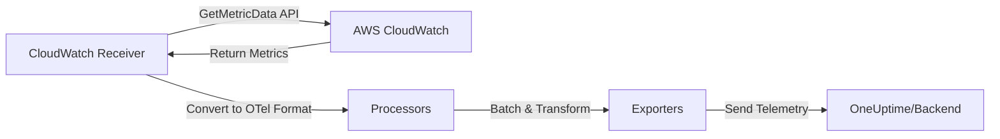

# How to Configure the AWS CloudWatch Receiver in the OpenTelemetry Collector

Author: [nawazdhandala](https://www.github.com/nawazdhandala)

Tags: OpenTelemetry, Collector, AWS, CloudWatch, Metrics, Cloud Monitoring, Observability

Description: Configure the AWS CloudWatch receiver in OpenTelemetry Collector to pull metrics from AWS CloudWatch, monitor AWS services, consolidate cloud telemetry, and export unified observability data to your backend.

AWS CloudWatch is Amazon's native monitoring and observability service for cloud resources and applications. While CloudWatch provides robust monitoring within the AWS ecosystem, many teams prefer to consolidate telemetry from multiple cloud providers and on-premises infrastructure into a single observability platform. The AWS CloudWatch receiver in the OpenTelemetry Collector enables you to pull CloudWatch metrics and forward them to any OpenTelemetry-compatible backend.

## What is the AWS CloudWatch Receiver?

The AWS CloudWatch receiver is an OpenTelemetry Collector component that integrates with AWS CloudWatch to retrieve metrics from AWS services. It acts as a bridge, pulling CloudWatch metrics via the AWS CloudWatch API and converting them to OpenTelemetry format for export to your chosen observability backend.

The receiver can collect metrics from any AWS service that publishes to CloudWatch, including:

- EC2 instance metrics (CPU, network, disk)
- RDS database metrics (connections, queries, replication lag)
- Lambda function metrics (invocations, duration, errors)
- ELB/ALB load balancer metrics (request counts, latency, errors)
- DynamoDB table metrics (read/write capacity, throttles)
- S3 bucket metrics (requests, bytes transferred)
- SQS queue metrics (message counts, age)
- Custom application metrics published to CloudWatch

Unlike CloudWatch's native interface, the receiver allows you to standardize on OpenTelemetry across all your infrastructure, reducing tool sprawl and enabling unified querying, visualization, and alerting.

## How the AWS CloudWatch Receiver Works

The receiver uses AWS SDK credentials to authenticate with CloudWatch and periodically calls the GetMetricData API to retrieve metrics. It then converts these metrics to OpenTelemetry format and sends them through the Collector pipeline:



The receiver handles AWS authentication, pagination, API rate limiting, and metric namespace discovery automatically. You configure which namespaces and dimensions to collect.

## Prerequisites

Before configuring the receiver, set up AWS credentials with CloudWatch read permissions:

### Create IAM Policy

Create an IAM policy with minimal CloudWatch read permissions:

```json
{
  "Version": "2012-10-17",
  "Statement": [
    {
      "Effect": "Allow",
      "Action": [
        "cloudwatch:GetMetricData",
        "cloudwatch:ListMetrics",
        "cloudwatch:GetMetricStatistics"
      ],
      "Resource": "*"
    },
    {
      "Effect": "Allow",
      "Action": [
        "ec2:DescribeInstances",
        "ec2:DescribeTags",
        "rds:DescribeDBInstances",
        "elasticloadbalancing:DescribeLoadBalancers",
        "lambda:ListFunctions"
      ],
      "Resource": "*"
    }
  ]
}
```

### Attach Policy to IAM User or Role

For EC2 instances, attach this policy to an IAM role and assign it to the instance. For external deployments, create an IAM user with access keys.

### Configure AWS Credentials

The receiver uses standard AWS SDK credential resolution:

```bash
# Option 1: Environment variables
export AWS_ACCESS_KEY_ID="your-access-key"
export AWS_SECRET_ACCESS_KEY="your-secret-key"
export AWS_REGION="us-east-1"

# Option 2: AWS credentials file (~/.aws/credentials)
[default]
aws_access_key_id = your-access-key
aws_secret_access_key = your-secret-key

# Option 3: IAM role (automatic on EC2)
# No configuration needed - the receiver uses instance metadata
```

## Basic Configuration

Here's a minimal configuration to start collecting EC2 instance metrics:

```yaml
# Receivers section - defines how telemetry enters the Collector
receivers:
  # AWS CloudWatch receiver for cloud metrics
  awscloudwatch:
    # AWS region to collect metrics from
    region: "us-east-1"

    # Collection interval - how often to poll CloudWatch
    collection_interval: 60s

    # Metric namespaces to collect from
    # Use AWS namespaces like AWS/EC2, AWS/RDS, AWS/Lambda
    namespaces:
      - name: "AWS/EC2"
        # Metrics to collect from this namespace
        metrics:
          - name: "CPUUtilization"
            statistic: "Average"
          - name: "NetworkIn"
            statistic: "Sum"
          - name: "NetworkOut"
            statistic: "Sum"

# Processors - transform collected metrics
processors:
  # Batch metrics to reduce network overhead
  batch:
    timeout: 30s
    send_batch_size: 100

# Exporters - define where metrics are sent
exporters:
  # Export to OneUptime via OTLP HTTP
  otlphttp:
    endpoint: https://oneuptime.com/otlp
    headers:
      x-oneuptime-token: ${ONEUPTIME_TOKEN}

# Service section - wire components into pipelines
service:
  pipelines:
    # Metrics pipeline for CloudWatch data
    metrics:
      receivers: [awscloudwatch]
      processors: [batch]
      exporters: [otlphttp]
```

This basic configuration collects EC2 CPU and network metrics from us-east-1. CloudWatch collection intervals should typically be 60s or higher due to CloudWatch's data granularity and API costs.

## Comprehensive Multi-Service Configuration

Monitor multiple AWS services with a complete configuration:

```yaml
receivers:
  awscloudwatch:
    # AWS region to collect from
    region: "us-east-1"

    # Collection interval - CloudWatch updates most metrics every 60s
    collection_interval: 60s

    # Optional: Explicitly set AWS credentials (if not using default)
    # access_key_id: ${AWS_ACCESS_KEY_ID}
    # secret_access_key: ${AWS_SECRET_ACCESS_KEY}

    # Metric namespaces and metrics to collect
    namespaces:
      # EC2 instance metrics
      - name: "AWS/EC2"
        metrics:
          - name: "CPUUtilization"
            statistic: "Average"
            unit: "Percent"
          - name: "CPUUtilization"
            statistic: "Maximum"
            unit: "Percent"
          - name: "NetworkIn"
            statistic: "Sum"
            unit: "Bytes"
          - name: "NetworkOut"
            statistic: "Sum"
            unit: "Bytes"
          - name: "DiskReadBytes"
            statistic: "Sum"
            unit: "Bytes"
          - name: "DiskWriteBytes"
            statistic: "Sum"
            unit: "Bytes"
          - name: "StatusCheckFailed"
            statistic: "Maximum"
            unit: "Count"

        # Dimensions to filter by (optional)
        dimensions:
          - name: "InstanceId"
            # Collect for specific instances
            values: ["i-1234567890abcdef0", "i-0987654321fedcba0"]

      # RDS database metrics
      - name: "AWS/RDS"
        metrics:
          - name: "CPUUtilization"
            statistic: "Average"
            unit: "Percent"
          - name: "DatabaseConnections"
            statistic: "Average"
            unit: "Count"
          - name: "FreeableMemory"
            statistic: "Average"
            unit: "Bytes"
          - name: "FreeStorageSpace"
            statistic: "Average"
            unit: "Bytes"
          - name: "ReadLatency"
            statistic: "Average"
            unit: "Seconds"
          - name: "WriteLatency"
            statistic: "Average"
            unit: "Seconds"
          - name: "ReadThroughput"
            statistic: "Average"
            unit: "Bytes/Second"
          - name: "WriteThroughput"
            statistic: "Average"
            unit: "Bytes/Second"

      # Application Load Balancer metrics
      - name: "AWS/ApplicationELB"
        metrics:
          - name: "RequestCount"
            statistic: "Sum"
            unit: "Count"
          - name: "TargetResponseTime"
            statistic: "Average"
            unit: "Seconds"
          - name: "HTTPCode_Target_2XX_Count"
            statistic: "Sum"
            unit: "Count"
          - name: "HTTPCode_Target_4XX_Count"
            statistic: "Sum"
            unit: "Count"
          - name: "HTTPCode_Target_5XX_Count"
            statistic: "Sum"
            unit: "Count"
          - name: "ActiveConnectionCount"
            statistic: "Average"
            unit: "Count"
          - name: "HealthyHostCount"
            statistic: "Average"
            unit: "Count"
          - name: "UnHealthyHostCount"
            statistic: "Average"
            unit: "Count"

      # Lambda function metrics
      - name: "AWS/Lambda"
        metrics:
          - name: "Invocations"
            statistic: "Sum"
            unit: "Count"
          - name: "Errors"
            statistic: "Sum"
            unit: "Count"
          - name: "Duration"
            statistic: "Average"
            unit: "Milliseconds"
          - name: "Throttles"
            statistic: "Sum"
            unit: "Count"
          - name: "ConcurrentExecutions"
            statistic: "Maximum"
            unit: "Count"

      # DynamoDB table metrics
      - name: "AWS/DynamoDB"
        metrics:
          - name: "ConsumedReadCapacityUnits"
            statistic: "Sum"
            unit: "Count"
          - name: "ConsumedWriteCapacityUnits"
            statistic: "Sum"
            unit: "Count"
          - name: "UserErrors"
            statistic: "Sum"
            unit: "Count"
          - name: "SystemErrors"
            statistic: "Sum"
            unit: "Count"
          - name: "ThrottledRequests"
            statistic: "Sum"
            unit: "Count"

      # SQS queue metrics
      - name: "AWS/SQS"
        metrics:
          - name: "ApproximateNumberOfMessagesVisible"
            statistic: "Average"
            unit: "Count"
          - name: "ApproximateAgeOfOldestMessage"
            statistic: "Maximum"
            unit: "Seconds"
          - name: "NumberOfMessagesSent"
            statistic: "Sum"
            unit: "Count"
          - name: "NumberOfMessagesReceived"
            statistic: "Sum"
            unit: "Count"
          - name: "NumberOfMessagesDeleted"
            statistic: "Sum"
            unit: "Count"

processors:
  # Add AWS resource attributes
  attributes:
    actions:
      - key: cloud.provider
        value: aws
        action: insert
      - key: cloud.region
        value: us-east-1
        action: insert

  # Batch for efficiency
  batch:
    timeout: 30s
    send_batch_size: 200

exporters:
  otlphttp:
    endpoint: https://oneuptime.com/otlp
    headers:
      x-oneuptime-token: ${ONEUPTIME_TOKEN}

service:
  pipelines:
    metrics:
      receivers: [awscloudwatch]
      processors: [attributes, batch]
      exporters: [otlphttp]
```

This comprehensive configuration collects metrics from EC2, RDS, ALB, Lambda, DynamoDB, and SQS, providing broad visibility into your AWS infrastructure.

## Multi-Region Monitoring

Monitor AWS resources across multiple regions by configuring multiple receiver instances:

```yaml
receivers:
  # US East 1 region
  awscloudwatch/us_east_1:
    region: "us-east-1"
    collection_interval: 60s
    namespaces:
      - name: "AWS/EC2"
        metrics:
          - name: "CPUUtilization"
            statistic: "Average"
      - name: "AWS/RDS"
        metrics:
          - name: "CPUUtilization"
            statistic: "Average"
          - name: "DatabaseConnections"
            statistic: "Average"

  # EU West 1 region
  awscloudwatch/eu_west_1:
    region: "eu-west-1"
    collection_interval: 60s
    namespaces:
      - name: "AWS/EC2"
        metrics:
          - name: "CPUUtilization"
            statistic: "Average"
      - name: "AWS/RDS"
        metrics:
          - name: "CPUUtilization"
            statistic: "Average"
          - name: "DatabaseConnections"
            statistic: "Average"

  # AP Southeast 1 region
  awscloudwatch/ap_southeast_1:
    region: "ap-southeast-1"
    collection_interval: 60s
    namespaces:
      - name: "AWS/EC2"
        metrics:
          - name: "CPUUtilization"
            statistic: "Average"
      - name: "AWS/RDS"
        metrics:
          - name: "CPUUtilization"
            statistic: "Average"
          - name: "DatabaseConnections"
            statistic: "Average"

processors:
  # Add region-specific attributes
  attributes/us_east_1:
    actions:
      - key: cloud.region
        value: us-east-1
        action: insert

  attributes/eu_west_1:
    actions:
      - key: cloud.region
        value: eu-west-1
        action: insert

  attributes/ap_southeast_1:
    actions:
      - key: cloud.region
        value: ap-southeast-1
        action: insert

  batch:
    timeout: 30s

exporters:
  otlphttp:
    endpoint: https://oneuptime.com/otlp
    headers:
      x-oneuptime-token: ${ONEUPTIME_TOKEN}

service:
  pipelines:
    metrics/us_east_1:
      receivers: [awscloudwatch/us_east_1]
      processors: [attributes/us_east_1, batch]
      exporters: [otlphttp]

    metrics/eu_west_1:
      receivers: [awscloudwatch/eu_west_1]
      processors: [attributes/eu_west_1, batch]
      exporters: [otlphttp]

    metrics/ap_southeast_1:
      receivers: [awscloudwatch/ap_southeast_1]
      processors: [attributes/ap_southeast_1, batch]
      exporters: [otlphttp]
```

This configuration monitors resources across three AWS regions and tags metrics appropriately for regional filtering and analysis.

## Filtering by Tags and Dimensions

CloudWatch metrics have dimensions (like InstanceId, DBInstanceIdentifier) that identify specific resources. Filter metrics by dimensions to reduce cardinality:

```yaml
receivers:
  awscloudwatch:
    region: "us-east-1"
    collection_interval: 60s

    namespaces:
      - name: "AWS/EC2"
        metrics:
          - name: "CPUUtilization"
            statistic: "Average"

        # Filter by dimensions - collect metrics only for specific resources
        dimensions:
          # Dimension name (e.g., InstanceId, AutoScalingGroupName)
          - name: "InstanceId"
            # Specific instance IDs to monitor
            values:
              - "i-1234567890abcdef0"
              - "i-0987654321fedcba0"

      - name: "AWS/RDS"
        metrics:
          - name: "CPUUtilization"
            statistic: "Average"
          - name: "DatabaseConnections"
            statistic: "Average"

        dimensions:
          # Monitor specific RDS instances
          - name: "DBInstanceIdentifier"
            values:
              - "production-db-1"
              - "production-db-2"

      - name: "AWS/Lambda"
        metrics:
          - name: "Invocations"
            statistic: "Sum"
          - name: "Errors"
            statistic: "Sum"
          - name: "Duration"
            statistic: "Average"

        dimensions:
          # Monitor specific Lambda functions
          - name: "FunctionName"
            values:
              - "order-processor"
              - "payment-handler"
              - "notification-sender"
```

Dimension filtering is essential for large AWS deployments to avoid collecting metrics for every single resource, which can be expensive and generate high cardinality.

## Cost Optimization

CloudWatch API calls incur costs. Optimize your configuration to minimize expenses:

```yaml
receivers:
  awscloudwatch:
    region: "us-east-1"

    # Increase collection interval to reduce API calls
    # CloudWatch standard resolution is 60s anyway
    collection_interval: 300s  # 5 minutes

    namespaces:
      - name: "AWS/EC2"
        metrics:
          # Collect only essential metrics
          - name: "CPUUtilization"
            statistic: "Average"
          - name: "StatusCheckFailed"
            statistic: "Maximum"

        # Use dimensions to limit scope
        dimensions:
          - name: "InstanceId"
            values: ["i-1234567890abcdef0"]

      - name: "AWS/RDS"
        metrics:
          # Focus on critical database metrics
          - name: "CPUUtilization"
            statistic: "Average"
          - name: "DatabaseConnections"
            statistic: "Average"
          - name: "FreeStorageSpace"
            statistic: "Average"

        dimensions:
          - name: "DBInstanceIdentifier"
            values: ["production-db-1"]

processors:
  # Filter out zero-value metrics to reduce export volume
  filter/drop_zeros:
    metrics:
      datapoint:
        - 'metric.name == "StatusCheckFailed" and value_int == 0'

  batch:
    timeout: 60s
    send_batch_size: 500

exporters:
  otlphttp:
    endpoint: https://oneuptime.com/otlp
    headers:
      x-oneuptime-token: ${ONEUPTIME_TOKEN}
    compression: gzip

service:
  pipelines:
    metrics:
      receivers: [awscloudwatch]
      processors: [filter/drop_zeros, batch]
      exporters: [otlphttp]
```

Cost optimization strategies:

1. **Increase collection intervals**: CloudWatch updates most metrics every 60s, so polling more frequently provides little value
2. **Limit metric scope**: Only collect metrics you'll actually use for dashboards or alerts
3. **Use dimension filters**: Don't collect metrics for every resource, filter by tags or IDs
4. **Batch aggressively**: Larger batches reduce network overhead and export costs
5. **Filter zero values**: Drop metrics that are always zero (like error counts when there are no errors)

## Production-Ready Configuration with Resilience

Here's a complete production configuration with error handling and optimization:

```yaml
receivers:
  awscloudwatch:
    region: "us-east-1"
    collection_interval: 300s

    # AWS credentials (optional, defaults to SDK credential chain)
    # access_key_id: ${AWS_ACCESS_KEY_ID}
    # secret_access_key: ${AWS_SECRET_ACCESS_KEY}

    # Request timeout - prevent hanging on slow AWS API responses
    timeout: 30s

    # Retry configuration for AWS API failures
    retry_on_failure:
      enabled: true
      initial_interval: 5s
      max_interval: 30s
      max_elapsed_time: 300s

    namespaces:
      - name: "AWS/EC2"
        metrics:
          - name: "CPUUtilization"
            statistic: "Average"
          - name: "NetworkIn"
            statistic: "Sum"
          - name: "NetworkOut"
            statistic: "Sum"

        dimensions:
          - name: "InstanceId"
            values: ["i-1234567890abcdef0", "i-0987654321fedcba0"]

      - name: "AWS/RDS"
        metrics:
          - name: "CPUUtilization"
            statistic: "Average"
          - name: "DatabaseConnections"
            statistic: "Average"
          - name: "FreeStorageSpace"
            statistic: "Average"

        dimensions:
          - name: "DBInstanceIdentifier"
            values: ["production-db"]

processors:
  # Add cloud resource attributes
  resourcedetection:
    detectors: [env, system, docker, ec2]
    timeout: 5s
    override: false

  # Add custom attributes
  attributes:
    actions:
      - key: cloud.provider
        value: aws
        action: insert
      - key: environment
        value: production
        action: insert

  # Filter out low-value metrics
  filter/drop_noise:
    metrics:
      datapoint:
        - 'metric.name == "StatusCheckFailed" and value_int == 0'

  # Batch for efficiency
  batch:
    timeout: 60s
    send_batch_size: 500

exporters:
  otlphttp:
    endpoint: https://oneuptime.com/otlp
    headers:
      x-oneuptime-token: ${ONEUPTIME_TOKEN}
    compression: gzip
    timeout: 30s

    # Retry failed exports
    retry_on_failure:
      enabled: true
      initial_interval: 5s
      max_interval: 30s
      max_elapsed_time: 300s

    # Buffer metrics during backend outages
    sending_queue:
      enabled: true
      num_consumers: 10
      queue_size: 5000

service:
  pipelines:
    metrics:
      receivers: [awscloudwatch]
      processors: [resourcedetection, attributes, filter/drop_noise, batch]
      exporters: [otlphttp]
```

This configuration includes timeouts, retries, buffering, and filtering to ensure reliable metric collection.

## Security Best Practices

Secure your CloudWatch monitoring:

### Use IAM Roles (Preferred)

When running the Collector on EC2, use IAM roles instead of access keys:

```yaml
receivers:
  awscloudwatch:
    region: "us-east-1"
    # No credentials needed - automatically uses EC2 instance IAM role
    collection_interval: 60s
```

### Least Privilege Permissions

Grant only necessary CloudWatch permissions:

```json
{
  "Version": "2012-10-17",
  "Statement": [
    {
      "Effect": "Allow",
      "Action": [
        "cloudwatch:GetMetricData",
        "cloudwatch:ListMetrics"
      ],
      "Resource": "*"
    }
  ]
}
```

### Use Environment Variables for Keys

If using access keys, never hardcode them:

```yaml
receivers:
  awscloudwatch:
    region: "us-east-1"
    access_key_id: ${AWS_ACCESS_KEY_ID}
    secret_access_key: ${AWS_SECRET_ACCESS_KEY}
```

### Rotate Access Keys Regularly

If using IAM user access keys, rotate them every 90 days and monitor for unauthorized usage.

## Alerting on AWS Metrics

Configure alerts for critical AWS conditions:

**EC2 High CPU**: Alert when EC2 CPU exceeds thresholds for sustained periods.

**RDS Storage Low**: Alert when RDS free storage drops below safe levels.

**Lambda Errors Increasing**: Alert on Lambda error rate spikes.

**ALB 5xx Errors**: Alert on application errors from load balancers.

**DynamoDB Throttling**: Alert when DynamoDB requests are throttled.

**SQS Message Age High**: Alert when SQS messages aren't being processed.

These CloudWatch metrics integrate seamlessly with alerting systems in your observability backend.

## Troubleshooting

### Authentication Failures

If the receiver can't authenticate with AWS:

1. Verify IAM permissions include cloudwatch:GetMetricData
2. Check AWS credentials are correctly configured
3. Test credentials with AWS CLI: `aws cloudwatch list-metrics`
4. Review IAM role trust relationships if using EC2 role
5. Check AWS region is correct

Enable debug logging:

```yaml
service:
  telemetry:
    logs:
      level: debug
```

### Missing Metrics

If expected metrics don't appear:

1. Verify the AWS service is publishing metrics to CloudWatch
2. Check namespace spelling matches AWS exactly (case-sensitive)
3. Verify dimension values are correct
4. Confirm metrics exist in CloudWatch console for the time range
5. Check collection_interval isn't too short for CloudWatch data availability

### High Costs

If CloudWatch API costs are high:

1. Increase collection_interval to 300s or higher
2. Reduce number of metrics collected
3. Use dimension filters to limit scope
4. Monitor AWS CloudWatch API usage in AWS Cost Explorer

### Rate Limiting

If AWS throttles API requests:

1. Increase collection_interval
2. Reduce number of metrics per request
3. Spread collection across multiple Collector instances
4. Contact AWS support to increase API rate limits

## Related Topics

For comprehensive cloud monitoring with OpenTelemetry:

- [How to Configure the SQL Query Receiver in OpenTelemetry Collector](https://oneuptime.com/blog/post/sql-query-receiver-opentelemetry-collector/view)
- [How to Configure the RabbitMQ Receiver in OpenTelemetry Collector](https://oneuptime.com/blog/post/rabbitmq-receiver-opentelemetry-collector/view)
- [OpenTelemetry Collector: What It Is and When You Need It](https://oneuptime.com/blog/post/2025-09-18-what-is-opentelemetry-collector-and-why-use-one/view)
- [How to collect internal metrics from OpenTelemetry Collector](https://oneuptime.com/blog/post/2025-01-22-how-to-collect-opentelemetry-collector-internal-metrics/view)

## Summary

The AWS CloudWatch receiver enables you to pull metrics from AWS CloudWatch and forward them to any OpenTelemetry-compatible observability platform. This allows you to consolidate AWS monitoring with telemetry from other cloud providers and on-premises infrastructure, standardizing on OpenTelemetry across your entire stack.

Configure the receiver with appropriate AWS credentials, select the namespaces and metrics relevant to your environment, and use dimension filtering to manage cardinality and costs. Follow security best practices by using IAM roles when possible and granting least-privilege permissions.

Monitor EC2, RDS, Lambda, ALB, DynamoDB, SQS, and any other AWS service that publishes to CloudWatch. Collect metrics across multiple regions to gain global visibility into your AWS infrastructure. Optimize collection intervals and metric scope to manage CloudWatch API costs while maintaining comprehensive observability.

Need a powerful backend for your AWS CloudWatch metrics? OneUptime provides native OpenTelemetry support with advanced correlation, visualization, and alerting capabilities, allowing you to monitor AWS alongside all your other infrastructure in a single unified platform.
