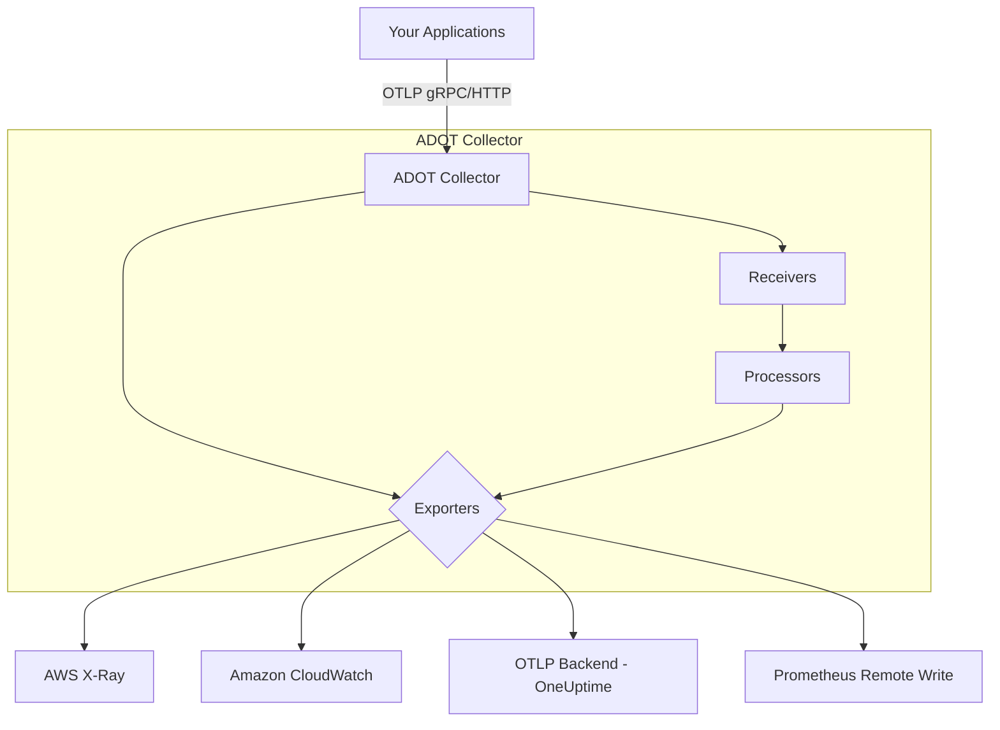
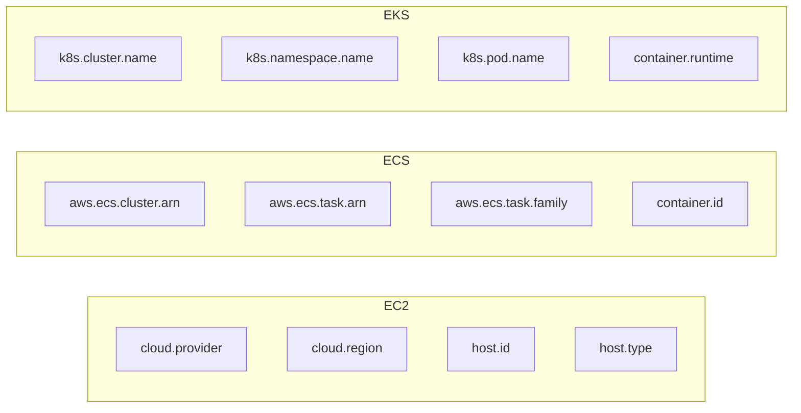

# How to Use AWS Distro for OpenTelemetry (ADOT) Collector

Author: [nawazdhandala](https://www.github.com/nawazdhandala)

Tags: OpenTelemetry, AWS, ADOT, Collector, Observability, ECS, EKS, Lambda

Description: A practical guide to deploying and configuring the AWS Distro for OpenTelemetry (ADOT) Collector for traces, metrics, and logs across AWS services.

---

AWS Distro for OpenTelemetry (ADOT) is Amazon's production-ready, supported distribution of the OpenTelemetry project. It packages the upstream OpenTelemetry Collector with AWS-specific receivers, processors, and exporters, making it easier to collect telemetry from your AWS workloads and send it to backends like AWS X-Ray, CloudWatch, or any OTLP-compatible platform such as OneUptime.

If you have been running your own OpenTelemetry Collector on AWS and juggling configuration for AWS-specific integrations, ADOT simplifies that significantly. It is tested and validated by AWS, so you get a stable collector build that plays nicely with ECS, EKS, EC2, and Lambda.

## How ADOT Fits Into the OpenTelemetry Ecosystem

ADOT is not a separate project from OpenTelemetry. It is a distribution, meaning it bundles the same core collector binary with additional AWS components pre-installed. You get all the standard OpenTelemetry receivers and exporters, plus the AWS X-Ray exporter, AWS EMF (Embedded Metric Format) exporter, and several AWS-specific receivers out of the box.



The key benefit here is that AWS handles the packaging, security patches, and compatibility testing. You do not need to build a custom collector image with contrib modules every time you want AWS-specific functionality.

## Prerequisites

Before getting started, make sure you have:

- An AWS account with appropriate IAM permissions
- AWS CLI v2 installed and configured
- Docker installed (for local testing)
- kubectl configured (if deploying to EKS)
- Basic familiarity with OpenTelemetry Collector configuration

## Installing ADOT Locally with Docker

The fastest way to try ADOT is by pulling the official Docker image. This image contains the collector binary with all AWS components pre-bundled.

```bash
# Pull the latest ADOT Collector image from the AWS ECR public gallery
docker pull public.ecr.aws/aws-observability/aws-otel-collector:latest
```

Before running the collector, you need a configuration file. Create a file called `adot-config.yaml` with a basic pipeline setup.

This configuration listens for OTLP data on the standard ports and exports traces to AWS X-Ray while also sending to a generic OTLP endpoint. The batch processor groups telemetry data to reduce the number of export calls.

```yaml
# adot-config.yaml - Basic ADOT Collector configuration
receivers:
  otlp:
    protocols:
      grpc:
        endpoint: 0.0.0.0:4317  # Standard OTLP gRPC port
      http:
        endpoint: 0.0.0.0:4318  # Standard OTLP HTTP port

processors:
  batch:
    timeout: 5s          # Flush batch every 5 seconds
    send_batch_size: 256 # Or when 256 items accumulate

  # Adds resource attributes useful for AWS environments
  resourcedetection:
    detectors: [env, ec2, ecs, eks]
    timeout: 5s

exporters:
  # Export traces to AWS X-Ray
  awsxray:
    region: us-east-1

  # Export metrics to CloudWatch via EMF
  awsemf:
    region: us-east-1
    namespace: MyApplication
    log_group_name: /aws/otel/metrics

  # Export to an OTLP-compatible backend like OneUptime
  otlphttp:
    endpoint: "https://oneuptime.com/otlp"

service:
  pipelines:
    traces:
      receivers: [otlp]
      processors: [resourcedetection, batch]
      exporters: [awsxray, otlphttp]
    metrics:
      receivers: [otlp]
      processors: [resourcedetection, batch]
      exporters: [awsemf, otlphttp]
```

Now run the collector container, mounting your config file and passing AWS credentials through environment variables.

```bash
# Run the ADOT Collector with your custom config
# AWS credentials are passed as environment variables for X-Ray and CloudWatch access
docker run --rm \
  -p 4317:4317 \
  -p 4318:4318 \
  -v $(pwd)/adot-config.yaml:/etc/otel-config.yaml \
  -e AWS_ACCESS_KEY_ID=$AWS_ACCESS_KEY_ID \
  -e AWS_SECRET_ACCESS_KEY=$AWS_SECRET_ACCESS_KEY \
  -e AWS_REGION=us-east-1 \
  public.ecr.aws/aws-observability/aws-otel-collector:latest \
  --config /etc/otel-config.yaml
```

## Deploying ADOT on Amazon ECS

For ECS deployments, AWS provides an ADOT sidecar container that runs alongside your application task. The collector runs as a sidecar in the same task definition, so your application sends telemetry to localhost.

Here is a simplified ECS task definition that runs your app container alongside the ADOT Collector sidecar.

```json
{
  "family": "my-app-with-adot",
  "networkMode": "awsvpc",
  "requiresCompatibilities": ["FARGATE"],
  "cpu": "512",
  "memory": "1024",
  "taskRoleArn": "arn:aws:iam::123456789012:role/ecsTaskRole",
  "executionRoleArn": "arn:aws:iam::123456789012:role/ecsTaskExecutionRole",
  "containerDefinitions": [
    {
      "name": "my-app",
      "image": "my-app:latest",
      "essential": true,
      "environment": [
        {
          "name": "OTEL_EXPORTER_OTLP_ENDPOINT",
          "value": "http://localhost:4317"
        },
        {
          "name": "OTEL_SERVICE_NAME",
          "value": "my-ecs-service"
        }
      ],
      "portMappings": [
        { "containerPort": 8080, "protocol": "tcp" }
      ]
    },
    {
      "name": "adot-collector",
      "image": "public.ecr.aws/aws-observability/aws-otel-collector:latest",
      "essential": true,
      "command": ["--config", "/etc/otel-config.yaml"],
      "portMappings": [
        { "containerPort": 4317, "protocol": "tcp" },
        { "containerPort": 4318, "protocol": "tcp" }
      ]
    }
  ]
}
```

Make sure your ECS task role has the required IAM permissions. At minimum, the task role needs `xray:PutTraceSegments`, `xray:PutTelemetryRecords`, and `logs:PutLogEvents` for CloudWatch.

## Deploying ADOT on Amazon EKS

For Kubernetes environments on EKS, AWS provides the ADOT Operator, which is an addon you can enable directly from the EKS console or CLI.

Enable the ADOT addon on your EKS cluster with this command.

```bash
# Enable the ADOT addon on your EKS cluster
# This installs the OpenTelemetry Operator which manages collector instances
aws eks create-addon \
  --cluster-name my-cluster \
  --addon-name adot \
  --addon-version v0.92.1-eksbuild.1
```

Once the operator is running, you can deploy collector instances using the `OpenTelemetryCollector` custom resource. The operator handles scaling, upgrades, and lifecycle management.

```yaml
# otel-collector-cr.yaml - Deploys an ADOT Collector via the operator
apiVersion: opentelemetry.io/v1alpha1
kind: OpenTelemetryCollector
metadata:
  name: adot-collector
  namespace: observability
spec:
  mode: deployment          # Can be deployment, daemonset, or sidecar
  replicas: 2               # Run two collector replicas for availability
  serviceAccount: adot-sa   # Service account with IRSA for AWS permissions
  config: |
    receivers:
      otlp:
        protocols:
          grpc:
            endpoint: 0.0.0.0:4317
          http:
            endpoint: 0.0.0.0:4318
    processors:
      batch:
        timeout: 10s
      resourcedetection:
        detectors: [env, eks]
    exporters:
      awsxray:
        region: us-east-1
      otlphttp:
        endpoint: "https://oneuptime.com/otlp"
    service:
      pipelines:
        traces:
          receivers: [otlp]
          processors: [resourcedetection, batch]
          exporters: [awsxray, otlphttp]
```

Apply the custom resource to your cluster.

```bash
# Deploy the collector instance using the operator
kubectl apply -f otel-collector-cr.yaml
```

For IAM permissions on EKS, use IAM Roles for Service Accounts (IRSA) so the collector pods can authenticate with AWS services without embedding credentials.

## Using ADOT with AWS Lambda

ADOT also supports Lambda functions through a managed Lambda layer. This is one of the simplest integration paths because AWS maintains the layer and it auto-instruments supported runtimes.

Add the ADOT layer to your Lambda function. The layer ARN varies by region and runtime.

```bash
# Add the ADOT Lambda layer to your function (Node.js example for us-east-1)
aws lambda update-function-configuration \
  --function-name my-function \
  --layers arn:aws:lambda:us-east-1:901920570463:layer:aws-otel-nodejs-amd64-ver-1-18-1:1 \
  --environment "Variables={AWS_LAMBDA_EXEC_WRAPPER=/opt/otel-handler,OTEL_SERVICE_NAME=my-lambda-function}"
```

The Lambda layer wraps your function handler, automatically capturing invocation spans, cold start metrics, and downstream call traces.

## Resource Detection for AWS

One of the most valuable features of ADOT is the resource detection processor. It automatically discovers metadata about the AWS environment your collector is running in and attaches it to all telemetry as resource attributes.

The following resource attributes are detected depending on the environment:



These attributes make it much easier to filter and group telemetry by infrastructure in your observability backend.

## Troubleshooting Common Issues

If you run into problems with ADOT, here are the most common issues and fixes.

**Collector not starting**: Check that your config YAML is valid. The ADOT Collector will log parsing errors at startup. Run with `--log-level debug` to get detailed output.

**No data in X-Ray**: Verify IAM permissions. The task role or IRSA role needs `xray:PutTraceSegments` and `xray:PutTelemetryRecords`. Also confirm the region in your exporter matches where you are looking in the X-Ray console.

**High memory usage**: If the collector is consuming too much memory, tune the batch processor. Reduce `send_batch_size` or lower the `timeout` to flush more frequently. You can also add the `memory_limiter` processor to prevent OOM kills.

```yaml
# Add memory_limiter to prevent the collector from using too much RAM
processors:
  memory_limiter:
    check_interval: 1s
    limit_mib: 400       # Hard limit at 400 MiB
    spike_limit_mib: 100 # Allow 100 MiB spikes above limit
```

## Wrapping Up

ADOT gives you a production-ready OpenTelemetry Collector with first-class AWS integration. Whether you are running on ECS, EKS, EC2, or Lambda, the collector works with your existing infrastructure and IAM model. The resource detection processor alone is worth the switch from a vanilla collector if you are operating on AWS, because it enriches every span and metric with the context you need to debug issues in a cloud environment.

Start with a simple OTLP receiver and one exporter, verify data flows end to end, and then add processors and additional exporters as your observability requirements grow.
