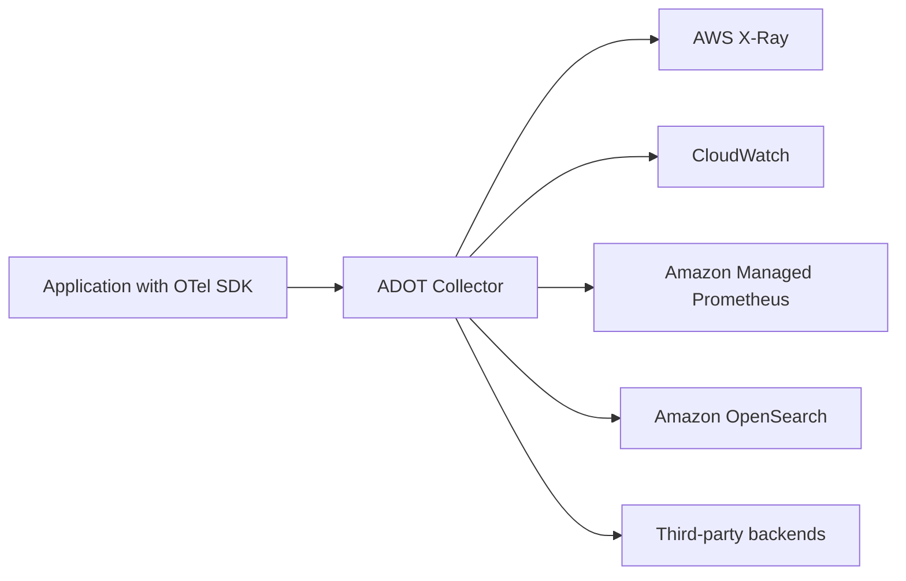
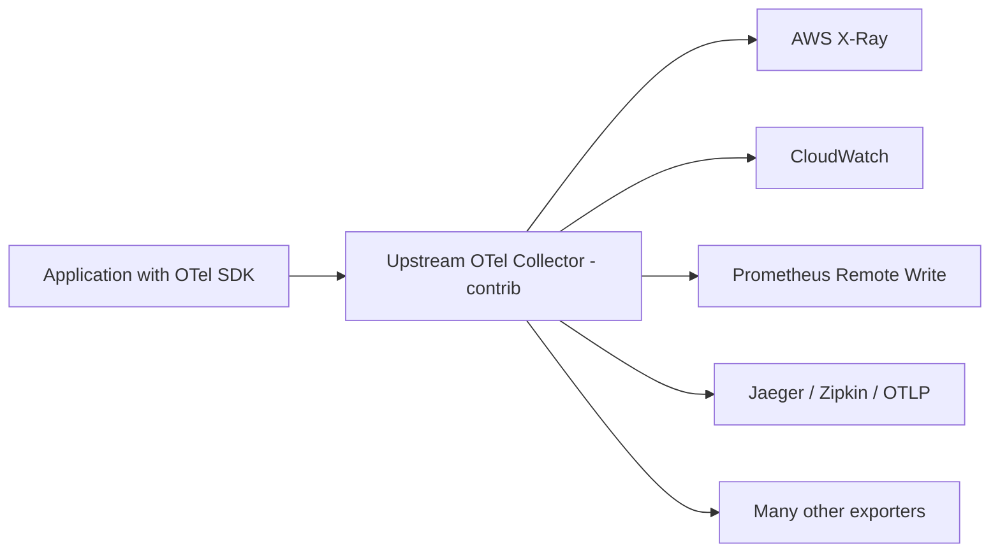
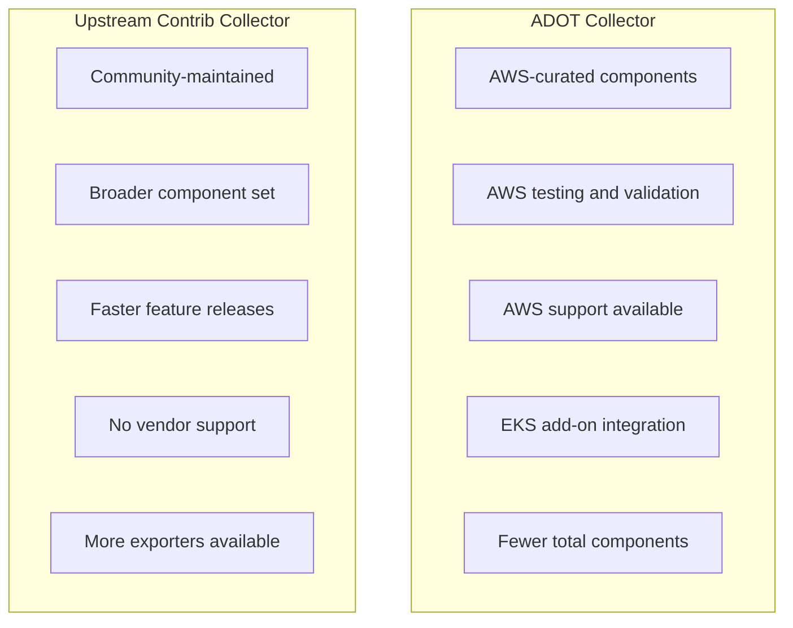

# How to Use AWS Distro for OpenTelemetry (ADOT) vs Upstream Collector

Author: [nawazdhandala](https://www.github.com/nawazdhandala)

Tags: OpenTelemetry, AWS, ADOT, Observability, Monitoring, Cloud

Description: Learn how to set up and use AWS Distro for OpenTelemetry (ADOT) and compare it with the upstream OpenTelemetry Collector for your AWS workloads.

---

AWS Distro for OpenTelemetry (ADOT) is Amazon's supported distribution of the OpenTelemetry project. It bundles specific components that work well with AWS services like CloudWatch, X-Ray, and Amazon Managed Prometheus. If you are running workloads on AWS and want a collector that plays nicely with the ecosystem out of the box, ADOT is worth considering.

But it is not the only option. The upstream OpenTelemetry Collector works on AWS too. The question is: which one should you pick, and when does it matter?

This post walks through both options with real configuration examples so you can make an informed choice.

## What is ADOT?

ADOT is a pre-packaged version of the OpenTelemetry Collector that includes AWS-specific exporters, extensions, and processors. AWS maintains it, tests it against their services, and provides support through AWS Premium Support plans.

The key components bundled in ADOT include:

- **AWS X-Ray Exporter** for sending traces to AWS X-Ray
- **AWS CloudWatch EMF Exporter** for sending metrics to CloudWatch
- **Amazon Managed Prometheus Remote Write Exporter** for Prometheus-compatible metrics
- **AWS ECS Container Metrics Receiver** for pulling ECS task metadata



## What Does the Upstream Collector Offer?

The upstream OpenTelemetry Collector is the community-maintained version. It comes in two flavors: `core` (minimal set of components) and `contrib` (includes a wide range of community-contributed exporters, receivers, and processors).

The `contrib` distribution actually includes most of the same AWS exporters that ADOT bundles. The difference is that AWS does not officially support or test the contrib build against their services.



## Installing ADOT

### Running ADOT on Amazon ECS

ADOT provides a ready-made container image. You add it as a sidecar to your ECS task definition.

Here is a task definition snippet that adds ADOT as a sidecar container alongside your application:

```json
{
  "family": "my-app-task",
  "networkMode": "awsvpc",
  "containerDefinitions": [
    {
      "name": "my-app",
      "image": "my-app:latest",
      "essential": true,
      "portMappings": [
        {
          "containerPort": 8080,
          "protocol": "tcp"
        }
      ],
      "environment": [
        {
          "name": "OTEL_EXPORTER_OTLP_ENDPOINT",
          "value": "http://localhost:4317"
        }
      ]
    },
    {
      "name": "adot-collector",
      "image": "public.ecr.aws/aws-observability/aws-otel-collector:latest",
      "essential": true,
      "command": [
        "--config=/etc/ecs/ecs-default-config.yaml"
      ],
      "portMappings": [
        {
          "containerPort": 4317,
          "protocol": "tcp"
        },
        {
          "containerPort": 4318,
          "protocol": "tcp"
        }
      ]
    }
  ],
  "requiresCompatibilities": ["FARGATE"],
  "cpu": "512",
  "memory": "1024",
  "taskRoleArn": "arn:aws:iam::123456789012:role/my-ecs-task-role",
  "executionRoleArn": "arn:aws:iam::123456789012:role/my-ecs-execution-role"
}
```

### Running ADOT on Amazon EKS

For Kubernetes on AWS, you can install ADOT using the EKS add-on. This is the simplest path.

Enable the ADOT add-on through the AWS CLI:

```bash
# Install the ADOT add-on for your EKS cluster
# This deploys the collector as a managed component
aws eks create-addon \
  --cluster-name my-cluster \
  --addon-name adot \
  --addon-version v0.92.1-eksbuild.1
```

Or deploy it via a Kubernetes DaemonSet with a custom config. First, create the configuration as a ConfigMap:

```yaml
# adot-configmap.yaml
# This ConfigMap holds the collector pipeline configuration
apiVersion: v1
kind: ConfigMap
metadata:
  name: adot-collector-config
  namespace: opentelemetry
data:
  config.yaml: |
    receivers:
      # Accept OTLP data over gRPC and HTTP
      otlp:
        protocols:
          grpc:
            endpoint: 0.0.0.0:4317
          http:
            endpoint: 0.0.0.0:4318

    processors:
      # Batch telemetry to reduce export overhead
      batch:
        timeout: 10s
        send_batch_size: 1024

      # Add EKS resource attributes like cluster name and pod info
      resourcedetection:
        detectors: [eks, env, ec2]
        timeout: 5s

    exporters:
      # Send traces to AWS X-Ray
      awsxray:
        region: us-east-1

      # Send metrics to CloudWatch using Embedded Metric Format
      awsemf:
        region: us-east-1
        namespace: MyApplication
        log_group_name: /metrics/my-app

    service:
      pipelines:
        traces:
          receivers: [otlp]
          processors: [resourcedetection, batch]
          exporters: [awsxray]
        metrics:
          receivers: [otlp]
          processors: [resourcedetection, batch]
          exporters: [awsemf]
```

Then deploy the DaemonSet that uses this config:

```yaml
# adot-daemonset.yaml
# Runs one collector instance per node
apiVersion: apps/v1
kind: DaemonSet
metadata:
  name: adot-collector
  namespace: opentelemetry
spec:
  selector:
    matchLabels:
      app: adot-collector
  template:
    metadata:
      labels:
        app: adot-collector
    spec:
      serviceAccountName: adot-collector
      containers:
        - name: collector
          image: public.ecr.aws/aws-observability/aws-otel-collector:latest
          args:
            - "--config=/conf/config.yaml"
          ports:
            - containerPort: 4317
            - containerPort: 4318
          volumeMounts:
            - name: config
              mountPath: /conf
          resources:
            requests:
              cpu: 200m
              memory: 256Mi
            limits:
              cpu: 500m
              memory: 512Mi
      volumes:
        - name: config
          configMap:
            name: adot-collector-config
```

## Equivalent Setup with Upstream Collector

You can achieve the same thing with the upstream contrib collector. The configuration is nearly identical since the AWS exporters are available in contrib.

Here is the same pipeline but using the upstream collector image:

```yaml
# upstream-collector-configmap.yaml
# Same pipeline config works with upstream contrib collector
apiVersion: v1
kind: ConfigMap
metadata:
  name: otel-collector-config
  namespace: opentelemetry
data:
  config.yaml: |
    receivers:
      otlp:
        protocols:
          grpc:
            endpoint: 0.0.0.0:4317
          http:
            endpoint: 0.0.0.0:4318

    processors:
      batch:
        timeout: 10s
        send_batch_size: 1024

      resourcedetection:
        detectors: [eks, env, ec2]
        timeout: 5s

    exporters:
      # Same AWS X-Ray exporter available in contrib
      awsxray:
        region: us-east-1

      awsemf:
        region: us-east-1
        namespace: MyApplication
        log_group_name: /metrics/my-app

    service:
      pipelines:
        traces:
          receivers: [otlp]
          processors: [resourcedetection, batch]
          exporters: [awsxray]
        metrics:
          receivers: [otlp]
          processors: [resourcedetection, batch]
          exporters: [awsemf]
```

The DaemonSet changes only in the image reference:

```yaml
# Use the upstream contrib image instead of ADOT
containers:
  - name: collector
    image: otel/opentelemetry-collector-contrib:0.96.0
    args:
      - "--config=/conf/config.yaml"
```

## Key Differences Between ADOT and Upstream

Here is a practical comparison of the two:



| Feature | ADOT | Upstream Contrib |
|---------|------|-----------------|
| AWS exporter support | Tested by AWS | Community tested |
| Release cadence | Follows AWS schedule | Monthly community releases |
| Component selection | Curated subset | Everything in contrib |
| IAM integration | First-class | Works but not officially supported |
| EKS add-on | Yes | No |
| Non-AWS exporters | Limited selection | Full contrib set |
| Vendor support | AWS Premium Support | Community only |

## When to Pick ADOT

Choose ADOT when:

- You are running exclusively on AWS and sending telemetry to AWS services
- You need vendor support from AWS
- You want the EKS managed add-on for simpler lifecycle management
- Your organization requires a supported distribution for compliance reasons

## When to Pick Upstream

Choose the upstream collector when:

- You need exporters that ADOT does not include
- You are running a multi-cloud setup and want one collector config
- You want the latest features before they land in the ADOT release cycle
- You are comfortable with community support

## Sending Data to Multiple Backends

One common pattern is sending data to both AWS services and a third-party backend. ADOT supports this, but the upstream collector gives you more flexibility because it includes more exporters.

This config sends traces to both X-Ray and an OTLP-compatible backend like OneUptime:

```yaml
receivers:
  otlp:
    protocols:
      grpc:
        endpoint: 0.0.0.0:4317

processors:
  batch:
    timeout: 5s

exporters:
  # Send to AWS X-Ray for AWS-native tracing
  awsxray:
    region: us-east-1

  # Also send to OneUptime or any OTLP backend
  otlphttp:
    endpoint: https://otlp.oneuptime.com
    headers:
      x-oneuptime-token: "your-token-here"

service:
  pipelines:
    traces:
      receivers: [otlp]
      processors: [batch]
      # Fan out to both backends
      exporters: [awsxray, otlphttp]
```

## IAM Permissions for ADOT

ADOT uses the standard AWS credential chain. On ECS and EKS, it picks up the task role or service account role automatically.

Here is a minimal IAM policy for X-Ray and CloudWatch:

```json
{
  "Version": "2012-10-17",
  "Statement": [
    {
      "Effect": "Allow",
      "Action": [
        "xray:PutTraceSegments",
        "xray:PutTelemetryRecords",
        "xray:GetSamplingRules",
        "xray:GetSamplingTargets"
      ],
      "Resource": "*"
    },
    {
      "Effect": "Allow",
      "Action": [
        "logs:PutLogEvents",
        "logs:CreateLogGroup",
        "logs:CreateLogStream",
        "logs:DescribeLogStreams"
      ],
      "Resource": "*"
    }
  ]
}
```

## Wrapping Up

ADOT and the upstream collector use the same codebase under the hood. ADOT just narrows the component set and adds AWS testing and support. If AWS is your primary cloud and you value support, ADOT is the straightforward choice. If you need more flexibility or run multi-cloud, the upstream contrib collector gives you everything ADOT has plus a lot more.

Either way, the configuration language is the same, so switching between them is mostly a matter of changing the container image.
