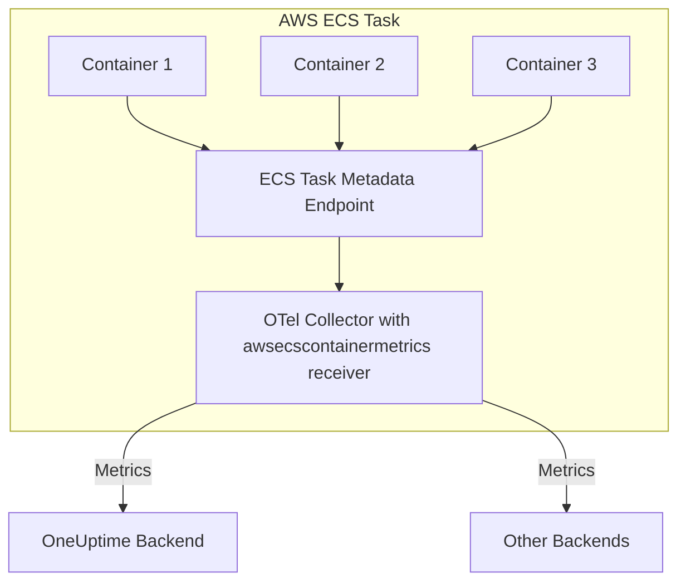

# How to Configure the AWS ECS Container Metrics Receiver in the OpenTelemetry Collector

Author: [nawazdhandala](https://www.github.com/nawazdhandala)

Tags: OpenTelemetry, Collector, AWS, ECS, Container Metrics, Observability, Docker

Description: Learn how to configure the AWS ECS Container Metrics Receiver in OpenTelemetry Collector to collect CPU, memory, network, and disk metrics from your ECS tasks with practical YAML examples and deployment patterns.

---

> Running containers on AWS ECS without proper metrics visibility is like flying blind. The AWS ECS Container Metrics Receiver gives you deep insights into your containerized workloads without installing agents on every task.

The AWS ECS Container Metrics Receiver is a specialized OpenTelemetry Collector component that pulls container-level metrics from the ECS Task Metadata endpoint. This receiver is essential for anyone running production workloads on Amazon Elastic Container Service (ECS) who needs visibility into CPU usage, memory consumption, network I/O, and disk activity.

---

## What is the AWS ECS Container Metrics Receiver?

The AWS ECS Container Metrics Receiver connects to the [ECS Task Metadata endpoint](https://docs.aws.amazon.com/AmazonECS/latest/developerguide/task-metadata-endpoint.html) that AWS automatically exposes to every running task. This endpoint provides real-time resource utilization data for all containers in the task without requiring any host-level access or privileged permissions.

Unlike traditional monitoring approaches that require agents installed on the host or sidecar containers with elevated permissions, this receiver operates entirely through the metadata API that AWS provides.

### Key Capabilities

- **CPU metrics**: Usage, throttling, and limits
- **Memory metrics**: Usage, cache, RSS, and limits
- **Network I/O**: Bytes sent/received, packets, errors
- **Disk I/O**: Read/write bytes and operations
- **Zero configuration**: Automatically discovers all containers in the task

---

## Architecture Overview

Here's how the ECS Container Metrics Receiver fits into your observability stack:



The OpenTelemetry Collector runs as a sidecar container in your ECS task definition. It periodically scrapes the metadata endpoint and transforms the raw JSON responses into OpenTelemetry metrics that can be exported to any backend supporting the OTLP protocol.

---

## Prerequisites

Before configuring this receiver, ensure you have:

1. **ECS Task running on EC2 or Fargate** - Both launch types are supported
2. **Task Metadata endpoint enabled** - This is enabled by default for tasks using platform version 1.4.0 or later
3. **OpenTelemetry Collector** - Version 0.70.0 or later with the awsecscontainermetrics receiver component
4. **IAM permissions** - No special IAM permissions are required since the endpoint is accessible within the task

---

## Basic Configuration

The following configuration shows the minimal setup needed to start collecting ECS container metrics. This receiver automatically discovers the metadata endpoint using environment variables that AWS injects into every ECS task:

```yaml
# Define the receiver to collect ECS container metrics
receivers:
  # The awsecscontainermetrics receiver connects to the ECS Task Metadata endpoint
  awsecscontainermetrics:
    # collection_interval defines how often to scrape metrics
    # Default is 20 seconds; adjust based on your needs
    collection_interval: 20s

# Configure where to send the metrics
exporters:
  # Export to OneUptime using OTLP HTTP
  otlphttp:
    endpoint: https://oneuptime.com/otlp
    headers:
      x-oneuptime-token: ${ONEUPTIME_TOKEN}

# Define the metrics pipeline
service:
  pipelines:
    metrics:
      receivers: [awsecscontainermetrics]
      exporters: [otlphttp]
```

This basic configuration will collect all available container metrics every 20 seconds and send them to OneUptime. The receiver automatically uses the `ECS_CONTAINER_METADATA_URI_V4` environment variable that AWS sets in every task to locate the metadata endpoint.

---

## Production Configuration with Processing

For production environments, you'll want to add processing, batching, and resource limits. This configuration demonstrates best practices:

```yaml
receivers:
  awsecscontainermetrics:
    collection_interval: 30s  # Scrape every 30 seconds

processors:
  # Protect the collector from memory exhaustion
  memory_limiter:
    limit_mib: 512
    spike_limit_mib: 128
    check_interval: 5s

  # Add resource attributes to identify the source
  resource:
    attributes:
      - key: cloud.provider
        value: aws
        action: insert
      - key: cloud.platform
        value: aws_ecs
        action: insert
      # ECS cluster name from environment variable
      - key: ecs.cluster.name
        value: ${ECS_CLUSTER_NAME}
        action: insert
      # Task ARN is automatically available
      - key: aws.ecs.task.arn
        from_attribute: aws.ecs.task.arn
        action: insert

  # Batch metrics to reduce network overhead
  batch:
    timeout: 10s
    send_batch_size: 1024
    send_batch_max_size: 2048

  # Filter out metrics you don't need to reduce costs
  filter/unnecessary:
    metrics:
      exclude:
        match_type: regexp
        # Example: Exclude network metrics for internal containers
        metric_names:
          - "container.network.*"
        resource_attributes:
          - key: container.name
            value: ".*sidecar.*"

exporters:
  # Primary export to OneUptime
  otlphttp/oneuptime:
    endpoint: https://oneuptime.com/otlp
    headers:
      x-oneuptime-token: ${ONEUPTIME_TOKEN}
    compression: gzip
    timeout: 30s
    retry_on_failure:
      enabled: true
      initial_interval: 5s
      max_interval: 30s
      max_elapsed_time: 300s

  # Backup export to CloudWatch for redundancy
  awsemf:
    namespace: ECSContainerMetrics
    region: us-east-1
    dimension_rollup_option: NoDimensionRollup

service:
  # Enable telemetry for the collector itself
  telemetry:
    logs:
      level: info
    metrics:
      address: :8888

  pipelines:
    metrics:
      receivers: [awsecscontainermetrics]
      processors:
        - memory_limiter
        - resource
        - filter/unnecessary
        - batch
      exporters:
        - otlphttp/oneuptime
        - awsemf
```

This production configuration includes several important elements:

- **Memory protection**: Prevents the collector from consuming too much memory
- **Resource attribution**: Tags metrics with cloud provider and platform information
- **Batching**: Groups metrics together to reduce network calls
- **Filtering**: Removes unnecessary metrics to control costs
- **Retry logic**: Handles temporary network failures gracefully
- **Multiple exporters**: Sends to both OneUptime and CloudWatch

---

## ECS Task Definition Integration

To deploy the OpenTelemetry Collector as a sidecar in your ECS task, add it to your task definition. Here's a complete example in JSON format:

```json
{
  "family": "my-app-with-otel",
  "taskRoleArn": "arn:aws:iam::123456789012:role/ecsTaskRole",
  "executionRoleArn": "arn:aws:iam::123456789012:role/ecsTaskExecutionRole",
  "networkMode": "awsvpc",
  "requiresCompatibilities": ["FARGATE"],
  "cpu": "512",
  "memory": "1024",
  "containerDefinitions": [
    {
      "name": "my-app",
      "image": "my-app:latest",
      "cpu": 256,
      "memory": 512,
      "essential": true,
      "portMappings": [
        {
          "containerPort": 8080,
          "protocol": "tcp"
        }
      ],
      "logConfiguration": {
        "logDriver": "awslogs",
        "options": {
          "awslogs-group": "/ecs/my-app",
          "awslogs-region": "us-east-1",
          "awslogs-stream-prefix": "app"
        }
      }
    },
    {
      "name": "otel-collector",
      "image": "otel/opentelemetry-collector-contrib:0.93.0",
      "cpu": 256,
      "memory": 512,
      "essential": false,
      "command": ["--config=/etc/otel-config.yaml"],
      "environment": [
        {
          "name": "ONEUPTIME_TOKEN",
          "value": "your-token-here"
        },
        {
          "name": "ECS_CLUSTER_NAME",
          "value": "production-cluster"
        }
      ],
      "secrets": [
        {
          "name": "ONEUPTIME_TOKEN",
          "valueFrom": "arn:aws:secretsmanager:us-east-1:123456789012:secret:oneuptime-token"
        }
      ],
      "logConfiguration": {
        "logDriver": "awslogs",
        "options": {
          "awslogs-group": "/ecs/otel-collector",
          "awslogs-region": "us-east-1",
          "awslogs-stream-prefix": "collector"
        }
      },
      "mountPoints": [
        {
          "sourceVolume": "otel-config",
          "containerPath": "/etc/otel-config.yaml",
          "readOnly": true
        }
      ]
    }
  ],
  "volumes": [
    {
      "name": "otel-config",
      "configMap": {
        "name": "otel-collector-config"
      }
    }
  ]
}
```

### Key Configuration Points

1. **essential: false** - The collector sidecar is not essential, so if it crashes, it won't take down your application container
2. **Secrets management** - Store your OneUptime token in AWS Secrets Manager and reference it securely
3. **Resource allocation** - Allocate sufficient CPU and memory for the collector based on your metrics volume
4. **Logging** - Configure CloudWatch logs for the collector to troubleshoot issues

---

## Available Metrics

The AWS ECS Container Metrics Receiver collects the following metric categories:

### CPU Metrics

- `container.cpu.usage.total` - Total CPU time consumed
- `container.cpu.usage.kernelmode` - CPU time in kernel mode
- `container.cpu.usage.usermode` - CPU time in user mode
- `container.cpu.throttling_data.throttled_time` - Time CPU was throttled

### Memory Metrics

- `container.memory.usage.total` - Total memory usage
- `container.memory.usage.limit` - Memory limit
- `container.memory.usage.max` - Maximum memory used
- `container.memory.cache` - Cache memory
- `container.memory.rss` - Resident set size

### Network Metrics

- `container.network.io.usage.rx_bytes` - Bytes received
- `container.network.io.usage.tx_bytes` - Bytes transmitted
- `container.network.io.usage.rx_packets` - Packets received
- `container.network.io.usage.tx_packets` - Packets transmitted
- `container.network.io.usage.rx_errors` - Receive errors
- `container.network.io.usage.tx_errors` - Transmit errors

### Storage Metrics

- `container.storage.read_bytes` - Bytes read from disk
- `container.storage.write_bytes` - Bytes written to disk
- `container.storage.read_ops` - Read operations
- `container.storage.write_ops` - Write operations

All metrics include resource attributes identifying the container name, task ARN, and container ID.

---

## Monitoring Multiple Clusters

If you run multiple ECS clusters, you'll want to ensure metrics are properly tagged for easy filtering. Use environment variables in your task definitions:

```yaml
receivers:
  awsecscontainermetrics:
    collection_interval: 30s

processors:
  resource:
    attributes:
      # Cluster name from environment variable
      - key: ecs.cluster.name
        value: ${ECS_CLUSTER_NAME}
        action: insert
      # Service name from environment variable
      - key: service.name
        value: ${SERVICE_NAME}
        action: insert
      # Environment (prod, staging, dev)
      - key: deployment.environment
        value: ${ENVIRONMENT}
        action: insert
      # Add custom tags
      - key: team
        value: ${TEAM_NAME}
        action: insert

exporters:
  otlphttp:
    endpoint: https://oneuptime.com/otlp
    headers:
      x-oneuptime-token: ${ONEUPTIME_TOKEN}

service:
  pipelines:
    metrics:
      receivers: [awsecscontainermetrics]
      processors: [resource]
      exporters: [otlphttp]
```

Set these environment variables in your task definition for each service to enable proper grouping and filtering in your observability backend.

---

## Troubleshooting Common Issues

### Receiver Not Collecting Metrics

If metrics aren't appearing, check these common issues:

1. **Metadata endpoint not available**: Verify you're running on platform version 1.4.0 or later
2. **Collection interval too high**: Try reducing the collection interval
3. **Network connectivity**: Ensure the collector can reach your export endpoint

Enable debug logging to see what's happening:

```yaml
service:
  telemetry:
    logs:
      level: debug
```

### High Memory Usage

If the collector is consuming too much memory:

1. **Increase collection interval**: Less frequent scraping reduces memory pressure
2. **Add memory limiter**: Configure the memory_limiter processor
3. **Filter unnecessary metrics**: Use the filter processor to drop metrics you don't need

### Missing Container Metrics

If some containers aren't showing metrics:

1. **Check container names**: Ensure your filters aren't excluding containers
2. **Verify task role**: Confirm the task role has no network restrictions
3. **Check collector logs**: Look for errors related to specific containers

---

## Cost Optimization Strategies

Container metrics can generate significant volume. Here are strategies to control costs:

### 1. Adjust Collection Interval

Collect metrics less frequently for non-critical workloads:

```yaml
receivers:
  awsecscontainermetrics:
    # Collect every 60 seconds instead of 20
    collection_interval: 60s
```

### 2. Filter Unnecessary Metrics

Drop metrics you don't actively use:

```yaml
processors:
  filter/cost_optimization:
    metrics:
      exclude:
        match_type: regexp
        metric_names:
          # Exclude disk I/O if not needed
          - "container.storage.*"
          # Exclude network errors if monitoring elsewhere
          - "container.network.io.usage.*_errors"
```

### 3. Aggregate Before Export

Use the metrics transform processor to aggregate or reduce cardinality:

```yaml
processors:
  metricstransform:
    transforms:
      - include: container.cpu.usage.total
        action: aggregate_labels
        label_set: [container.name, task.arn]
```

### 4. Use Sampling for High-Volume Environments

For massive ECS deployments, consider sampling:

```yaml
processors:
  probabilistic_sampler:
    # Keep 10% of metrics
    sampling_percentage: 10
```

---

## Integration with OneUptime

OneUptime provides native support for OpenTelemetry metrics from ECS containers. Once your collector is configured and sending metrics, you can create dashboards, alerts, and SLOs based on container performance.

Example alert configuration in OneUptime for high CPU usage:

- **Metric**: `container.cpu.usage.total`
- **Condition**: Value > 80% of limit
- **Duration**: For 5 minutes
- **Action**: Send notification to on-call engineer

You can also correlate container metrics with application traces and logs for complete observability. Learn more about setting up comprehensive monitoring in our related posts:

- [OpenTelemetry Collector: What It Is and When You Need It](https://oneuptime.com/blog/post/2025-09-18-what-is-opentelemetry-collector-and-why-use-one/view)
- [How to Collect OpenTelemetry Collector Internal Metrics](https://oneuptime.com/blog/post/2025-01-22-how-to-collect-opentelemetry-collector-internal-metrics/view)

---

## Best Practices

### 1. Run Collector as Sidecar

Deploy the OpenTelemetry Collector as a sidecar container in each task that needs monitoring. This ensures the collector has access to the task metadata endpoint and keeps the blast radius small.

### 2. Use Resource Attributes

Always add resource attributes to identify your metrics:

- Cluster name
- Service name
- Environment
- Team ownership

### 3. Monitor the Collector

The collector itself needs monitoring. Export its internal metrics:

```yaml
service:
  telemetry:
    metrics:
      address: :8888
      level: detailed
```

### 4. Configure Retries

Network issues happen. Configure retry logic:

```yaml
exporters:
  otlphttp:
    retry_on_failure:
      enabled: true
      initial_interval: 5s
      max_interval: 30s
      max_elapsed_time: 300s
```

### 5. Secure Your Secrets

Never hardcode tokens. Use AWS Secrets Manager or Parameter Store:

```json
"secrets": [
  {
    "name": "ONEUPTIME_TOKEN",
    "valueFrom": "arn:aws:secretsmanager:region:account:secret:name"
  }
]
```

---

## Related Resources

Understanding ECS container metrics is just one piece of the observability puzzle. Check out these related topics:

- [How to Configure the AWS S3 Receiver in OpenTelemetry Collector](https://oneuptime.com/blog/post/2026-02-06-aws-s3-receiver-opentelemetry-collector/view)
- [How to Reduce Noise in OpenTelemetry](https://oneuptime.com/blog/post/2025-08-25-how-to-reduce-noise-in-opentelemetry/view)
- [Three Pillars of Observability: Logs, Metrics, and Traces](https://oneuptime.com/blog/post/2025-08-20-three-pillars-of-observability-logs-metrics-traces/view)

---

## Conclusion

The AWS ECS Container Metrics Receiver provides critical visibility into your containerized workloads on ECS. By properly configuring this receiver in your OpenTelemetry Collector, you gain detailed insights into CPU, memory, network, and disk usage across all your containers without the overhead of installing agents on every host.

Start with the basic configuration to get metrics flowing, then iterate by adding processors, filters, and resource attributes to match your production requirements. With proper configuration and cost optimization, you'll have production-grade container observability that scales with your infrastructure.

The combination of ECS container metrics, application traces, and logs creates a complete observability picture that helps you troubleshoot issues faster, optimize resource allocation, and maintain reliable services.

---

**Ready to monitor your ECS containers?** OneUptime provides native OpenTelemetry support with built-in dashboards for ECS metrics, alerting, and correlation with traces and logs. Get started with container observability that doesn't break the bank.
