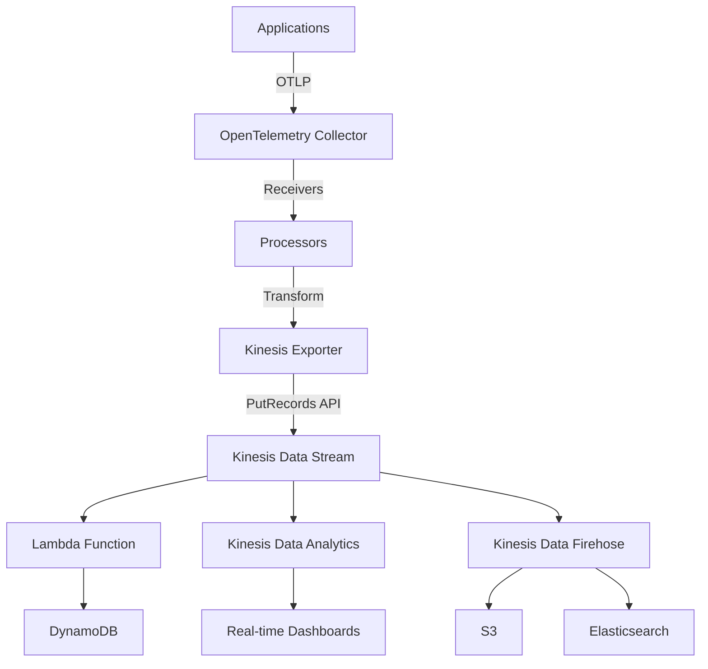

# How to Configure the AWS Kinesis Exporter in the OpenTelemetry Collector

Author: [nawazdhandala](https://www.github.com/nawazdhandala)

Tags: OpenTelemetry, Collector, Exporters, AWS, Kinesis, Streaming, Data Pipeline, Real-time

Description: Complete guide to configuring the AWS Kinesis exporter in OpenTelemetry Collector for real-time telemetry streaming with partition keys, encoding formats, and throughput optimization.

AWS Kinesis is a fully managed streaming data service that enables real-time processing of telemetry data at scale. The OpenTelemetry Collector's Kinesis exporter allows you to stream traces, metrics, and logs to Kinesis Data Streams, where they can be consumed by downstream processing applications, Lambda functions, or analytics services like Kinesis Data Analytics and Amazon Athena.

## Why Use OpenTelemetry with Kinesis

Integrating OpenTelemetry with AWS Kinesis provides unique advantages for real-time telemetry processing:

- **Real-time streaming**: Process telemetry data as it arrives with sub-second latency
- **Decoupled architecture**: Separate data collection from processing and storage
- **Scalable ingestion**: Handle millions of events per second with automatic scaling
- **Multiple consumers**: Enable multiple applications to process the same telemetry stream
- **Replay capability**: Reprocess historical data from the stream for backfilling or analysis
- **Integration ecosystem**: Connect to AWS Lambda, Kinesis Data Analytics, Firehose, and more

## Architecture Overview

The Kinesis exporter streams telemetry data to Kinesis Data Streams for real-time processing:



## Prerequisites

Before configuring the Kinesis exporter, ensure you have:

- OpenTelemetry Collector Contrib distribution
- AWS account with Kinesis access
- Kinesis Data Stream created
- IAM credentials or role with appropriate permissions
- Network connectivity to Kinesis endpoints

## IAM Permissions

Create an IAM policy with necessary Kinesis permissions:

```json
{
  "Version": "2012-10-17",
  "Statement": [
    {
      "Effect": "Allow",
      "Action": [
        "kinesis:PutRecord",
        "kinesis:PutRecords",
        "kinesis:DescribeStream",
        "kinesis:ListShards"
      ],
      "Resource": "arn:aws:kinesis:*:*:stream/otel-*"
    }
  ]
}
```

For production environments, scope permissions to specific streams:

```json
{
  "Version": "2012-10-17",
  "Statement": [
    {
      "Effect": "Allow",
      "Action": [
        "kinesis:PutRecords"
      ],
      "Resource": [
        "arn:aws:kinesis:us-east-1:123456789012:stream/otel-traces",
        "arn:aws:kinesis:us-east-1:123456789012:stream/otel-metrics",
        "arn:aws:kinesis:us-east-1:123456789012:stream/otel-logs"
      ]
    }
  ]
}
```

## Creating Kinesis Data Streams

Create separate streams for different telemetry types:

```bash
# Create stream for traces
aws kinesis create-stream \
  --stream-name otel-traces \
  --shard-count 5 \
  --region us-east-1

# Create stream for metrics
aws kinesis create-stream \
  --stream-name otel-metrics \
  --shard-count 3 \
  --region us-east-1

# Create stream for logs
aws kinesis create-stream \
  --stream-name otel-logs \
  --shard-count 4 \
  --region us-east-1
```

For production workloads, consider using on-demand mode for automatic scaling:

```bash
aws kinesis create-stream \
  --stream-name otel-traces \
  --stream-mode-details StreamMode=ON_DEMAND \
  --region us-east-1
```

## Basic Configuration

Here is a minimal configuration for sending traces to Kinesis:

```yaml
# Basic Kinesis exporter configuration
exporters:
  awskinesis:
    # AWS region
    region: us-east-1

    # Kinesis stream name
    stream_name: otel-traces

    # Encoding format (otlp_proto or otlp_json)
    encoding: otlp_proto

receivers:
  otlp:
    protocols:
      grpc:
        endpoint: 0.0.0.0:4317

processors:
  batch:
    timeout: 10s
    send_batch_size: 100

service:
  pipelines:
    traces:
      receivers: [otlp]
      processors: [batch]
      exporters: [awskinesis]
```

This configuration sends trace data to the `otel-traces` stream using Protocol Buffers encoding.

## Partition Key Configuration

Partition keys determine how data is distributed across Kinesis shards. Proper partitioning is crucial for throughput and even load distribution:

```yaml
exporters:
  awskinesis:
    region: us-east-1
    stream_name: otel-traces
    encoding: otlp_proto

    # Partition key from resource attribute
    # Routes data from same service to same shard
    partition_key: service.name

    # Alternative: Use trace ID for even distribution
    # partition_key: trace_id

receivers:
  otlp:
    protocols:
      grpc:
        endpoint: 0.0.0.0:4317

processors:
  batch:
    timeout: 10s
    send_batch_size: 100

service:
  pipelines:
    traces:
      receivers: [otlp]
      processors: [batch]
      exporters: [awskinesis]
```

Partition key strategies:

- **service.name**: Groups data by service, useful for per-service consumers
- **trace_id**: Distributes traces evenly across shards
- **host.name**: Groups data by host for per-host analysis
- **random**: Maximum distribution, prevents hot shards

## Multiple Streams Configuration

Route different telemetry types to separate Kinesis streams:

```yaml
exporters:
  # Traces stream
  awskinesis/traces:
    region: us-east-1
    stream_name: otel-traces
    encoding: otlp_proto
    partition_key: trace_id

  # Metrics stream
  awskinesis/metrics:
    region: us-east-1
    stream_name: otel-metrics
    encoding: otlp_json
    partition_key: service.name

  # Logs stream
  awskinesis/logs:
    region: us-east-1
    stream_name: otel-logs
    encoding: otlp_json
    partition_key: service.name

receivers:
  otlp:
    protocols:
      grpc:
        endpoint: 0.0.0.0:4317

processors:
  batch:
    timeout: 10s
    send_batch_size: 100

service:
  pipelines:
    traces:
      receivers: [otlp]
      processors: [batch]
      exporters: [awskinesis/traces]

    metrics:
      receivers: [otlp]
      processors: [batch]
      exporters: [awskinesis/metrics]

    logs:
      receivers: [otlp]
      processors: [batch]
      exporters: [awskinesis/logs]
```

## Advanced Configuration with Encoding Options

Configure encoding formats for optimal downstream processing:

```yaml
exporters:
  # Protocol Buffers encoding (most efficient)
  awskinesis/proto:
    region: us-east-1
    stream_name: otel-traces-proto
    encoding: otlp_proto
    partition_key: trace_id

    # Maximum record size (max 1MB)
    max_record_size: 1048576

    # Maximum records per batch (max 500)
    max_records_per_batch: 500

  # JSON encoding (more readable, easier to debug)
  awskinesis/json:
    region: us-east-1
    stream_name: otel-traces-json
    encoding: otlp_json
    partition_key: service.name

    # Compression (none, gzip, snappy)
    compression: gzip

receivers:
  otlp:
    protocols:
      grpc:
        endpoint: 0.0.0.0:4317

processors:
  batch:
    timeout: 10s
    send_batch_size: 100

service:
  pipelines:
    traces/proto:
      receivers: [otlp]
      processors: [batch]
      exporters: [awskinesis/proto]

    traces/json:
      receivers: [otlp]
      processors: [batch]
      exporters: [awskinesis/json]
```

## High-Throughput Production Configuration

Optimize for maximum throughput in production environments:

```yaml
extensions:
  health_check:
    endpoint: 0.0.0.0:13133

receivers:
  otlp:
    protocols:
      grpc:
        endpoint: 0.0.0.0:4317
        max_recv_msg_size_mib: 32
        max_concurrent_streams: 100

processors:
  # Memory protection
  memory_limiter:
    check_interval: 1s
    limit_mib: 2048
    spike_limit_mib: 512

  # AWS resource detection
  resourcedetection:
    detectors:
      - env
      - system
      - ec2
      - ecs
      - eks
    timeout: 5s

  # Add resource attributes
  resource:
    attributes:
      - key: deployment.environment
        value: production
        action: insert

  # Aggressive batching for throughput
  batch:
    timeout: 5s
    send_batch_size: 500
    send_batch_max_size: 500

exporters:
  awskinesis:
    region: us-east-1
    stream_name: otel-traces

    # Encoding
    encoding: otlp_proto

    # Partition key for even distribution
    partition_key: trace_id

    # Maximum records per PutRecords call
    max_records_per_batch: 500

    # Maximum size per record
    max_record_size: 1048576

    # Retry configuration
    retry_on_failure:
      enabled: true
      initial_interval: 100ms
      max_interval: 10s
      max_elapsed_time: 60s

    # Sending queue for buffering
    sending_queue:
      enabled: true
      num_consumers: 20
      queue_size: 10000
      storage: file_storage

    # Timeout
    timeout: 30s

extensions:
  file_storage:
    directory: /var/lib/otel/storage
    timeout: 10s

service:
  extensions: [health_check, file_storage]

  telemetry:
    logs:
      level: info
    metrics:
      level: detailed
      address: 0.0.0.0:8888

  pipelines:
    traces:
      receivers: [otlp]
      processors:
        - memory_limiter
        - resourcedetection
        - resource
        - batch
      exporters: [awskinesis]
```

## Multi-Region Configuration

Deploy collectors in multiple regions, each writing to regional Kinesis streams:

```yaml
exporters:
  # US East 1
  awskinesis/us-east-1:
    region: us-east-1
    stream_name: otel-traces-use1
    encoding: otlp_proto
    partition_key: trace_id

  # US West 2
  awskinesis/us-west-2:
    region: us-west-2
    stream_name: otel-traces-usw2
    encoding: otlp_proto
    partition_key: trace_id

  # EU West 1
  awskinesis/eu-west-1:
    region: eu-west-1
    stream_name: otel-traces-euw1
    encoding: otlp_proto
    partition_key: trace_id

processors:
  # Route based on region attribute
  routing:
    from_attribute: cloud.region
    table:
      - value: us-east-1
        exporters: [awskinesis/us-east-1]
      - value: us-west-2
        exporters: [awskinesis/us-west-2]
      - value: eu-west-1
        exporters: [awskinesis/eu-west-1]
    default_exporters: [awskinesis/us-east-1]

  batch:
    timeout: 10s
    send_batch_size: 500

receivers:
  otlp:
    protocols:
      grpc:
        endpoint: 0.0.0.0:4317

service:
  pipelines:
    traces:
      receivers: [otlp]
      processors: [batch, routing]
      exporters: [awskinesis/us-east-1, awskinesis/us-west-2, awskinesis/eu-west-1]
```

## Dynamic Stream Selection

Route telemetry to different streams based on attributes:

```yaml
exporters:
  # Production stream
  awskinesis/prod:
    region: us-east-1
    stream_name: otel-traces-prod
    encoding: otlp_proto
    partition_key: trace_id

  # Staging stream
  awskinesis/staging:
    region: us-east-1
    stream_name: otel-traces-staging
    encoding: otlp_proto
    partition_key: trace_id

  # Development stream
  awskinesis/dev:
    region: us-east-1
    stream_name: otel-traces-dev
    encoding: otlp_proto
    partition_key: trace_id

processors:
  # Route based on environment
  routing:
    from_attribute: deployment.environment
    table:
      - value: production
        exporters: [awskinesis/prod]
      - value: staging
        exporters: [awskinesis/staging]
      - value: development
        exporters: [awskinesis/dev]
    default_exporters: [awskinesis/dev]

  batch:
    timeout: 10s
    send_batch_size: 100

receivers:
  otlp:
    protocols:
      grpc:
        endpoint: 0.0.0.0:4317

service:
  pipelines:
    traces:
      receivers: [otlp]
      processors: [batch, routing]
      exporters: [awskinesis/prod, awskinesis/staging, awskinesis/dev]
```

## Integration with Kinesis Data Firehose

Create a Kinesis Data Firehose delivery stream to archive data to S3:

```bash
aws firehose create-delivery-stream \
  --delivery-stream-name otel-traces-to-s3 \
  --kinesis-stream-source-configuration \
    "KinesisStreamARN=arn:aws:kinesis:us-east-1:123456789012:stream/otel-traces,RoleARN=arn:aws:iam::123456789012:role/FirehoseRole" \
  --s3-destination-configuration \
    "RoleARN=arn:aws:iam::123456789012:role/FirehoseRole,BucketARN=arn:aws:s3:::otel-traces-archive,Prefix=traces/,CompressionFormat=GZIP,BufferingHints={SizeInMBs=5,IntervalInSeconds=300}"
```

This automatically delivers data from Kinesis to S3 for long-term storage and analysis.

## Lambda Consumer Example

Create a Lambda function to process telemetry data from Kinesis:

```python
import base64
import json
from google.protobuf.json_format import MessageToDict
from opentelemetry.proto.trace.v1.trace_pb2 import TracesData

def lambda_handler(event, context):
    for record in event['Records']:
        # Decode Kinesis record
        payload = base64.b64decode(record['kinesis']['data'])

        # Parse OTLP proto format
        traces_data = TracesData()
        traces_data.ParseFromString(payload)

        # Convert to dict for processing
        traces_dict = MessageToDict(traces_data)

        # Process traces
        for resource_span in traces_dict.get('resourceSpans', []):
            service_name = None
            for attr in resource_span.get('resource', {}).get('attributes', []):
                if attr['key'] == 'service.name':
                    service_name = attr['value']['stringValue']

            for scope_span in resource_span.get('scopeSpans', []):
                for span in scope_span.get('spans', []):
                    trace_id = span.get('traceId')
                    span_name = span.get('name')

                    # Your processing logic here
                    print(f"Service: {service_name}, Trace: {trace_id}, Span: {span_name}")

    return {
        'statusCode': 200,
        'body': json.dumps('Successfully processed records')
    }
```

Configure the Lambda function as a Kinesis consumer:

```bash
aws lambda create-event-source-mapping \
  --function-name process-otel-traces \
  --event-source-arn arn:aws:kinesis:us-east-1:123456789012:stream/otel-traces \
  --starting-position LATEST \
  --batch-size 100 \
  --maximum-batching-window-in-seconds 10
```

## Kinesis Data Analytics Integration

Create a Kinesis Data Analytics application for real-time analysis:

```sql
-- Create input stream
CREATE OR REPLACE STREAM "INPUT_STREAM" (
    trace_id VARCHAR(32),
    span_id VARCHAR(16),
    service_name VARCHAR(64),
    span_name VARCHAR(128),
    duration BIGINT,
    status_code VARCHAR(16),
    timestamp_ns BIGINT
);

-- Parse JSON records from Kinesis
CREATE OR REPLACE PUMP "STREAM_PUMP" AS
    INSERT INTO "INPUT_STREAM"
    SELECT STREAM
        JSON_VALUE(payload, '$.traceId'),
        JSON_VALUE(payload, '$.spanId'),
        JSON_VALUE(payload, '$.resourceSpans[0].resource.attributes[?(@.key=="service.name")].value.stringValue'),
        JSON_VALUE(payload, '$.resourceSpans[0].scopeSpans[0].spans[0].name'),
        CAST(JSON_VALUE(payload, '$.resourceSpans[0].scopeSpans[0].spans[0].endTimeUnixNano') AS BIGINT) -
        CAST(JSON_VALUE(payload, '$.resourceSpans[0].scopeSpans[0].spans[0].startTimeUnixNano') AS BIGINT),
        JSON_VALUE(payload, '$.resourceSpans[0].scopeSpans[0].spans[0].status.code'),
        CAST(JSON_VALUE(payload, '$.resourceSpans[0].scopeSpans[0].spans[0].startTimeUnixNano') AS BIGINT)
    FROM "SOURCE_SQL_STREAM_001";

-- Calculate real-time metrics
CREATE OR REPLACE STREAM "OUTPUT_STREAM" (
    service_name VARCHAR(64),
    avg_duration DOUBLE,
    max_duration BIGINT,
    error_count INTEGER,
    total_count INTEGER
);

CREATE OR REPLACE PUMP "METRICS_PUMP" AS
    INSERT INTO "OUTPUT_STREAM"
    SELECT STREAM
        service_name,
        AVG(duration) as avg_duration,
        MAX(duration) as max_duration,
        SUM(CASE WHEN status_code = 'ERROR' THEN 1 ELSE 0 END) as error_count,
        COUNT(*) as total_count
    FROM "INPUT_STREAM"
    GROUP BY service_name,
             STEP("INPUT_STREAM".ROWTIME BY INTERVAL '60' SECOND);
```

## Monitoring and Troubleshooting

Monitor the exporter using metrics exposed on port 8888:

- `otelcol_exporter_sent_spans`: Spans successfully sent to Kinesis
- `otelcol_exporter_send_failed_spans`: Failed exports
- `otelcol_exporter_queue_size`: Current queue size

Monitor Kinesis stream metrics in CloudWatch:

- `IncomingRecords`: Records written to stream
- `IncomingBytes`: Bytes written to stream
- `WriteProvisionedThroughputExceeded`: Throttling events
- `PutRecords.Latency`: API call latency

Common issues and solutions:

**ProvisionedThroughputExceededException**: Increase shard count or use on-demand mode

**KMS.ThrottlingException**: Request KMS throttle limit increase

**InvalidArgumentException**: Check record size is under 1MB

**Slow processing**: Increase batch size and reduce batch timeout

## Cost Optimization

Reduce Kinesis costs with these strategies:

- **Right-size shards**: Monitor throughput and adjust shard count
- **Use on-demand mode**: Pay per GB for variable workloads
- **Enable compression**: Reduce data transfer costs
- **Implement sampling**: Send only valuable telemetry
- **Set retention**: Don't retain data longer than necessary (default 24 hours)
- **Archive to S3**: Use Firehose for long-term storage at lower cost

## Conclusion

The AWS Kinesis exporter enables real-time streaming of OpenTelemetry telemetry data, unlocking powerful use cases like live dashboards, anomaly detection, and automated alerting. By decoupling data collection from processing, Kinesis provides flexibility to build sophisticated data pipelines that can evolve independently.

The configuration patterns shown here provide a foundation for building scalable real-time telemetry infrastructure on AWS. Whether you're processing data with Lambda, analyzing it with Kinesis Data Analytics, or archiving it to S3 with Firehose, the Kinesis exporter offers a robust starting point for your streaming observability architecture.

For information about other AWS exporters, check out our guides on the [AWS X-Ray exporter](https://oneuptime.com/blog/post/2026-02-06-aws-xray-exporter-opentelemetry-collector/view) and [AWS CloudWatch Logs exporter](https://oneuptime.com/blog/post/2026-02-06-aws-cloudwatch-logs-exporter-opentelemetry-collector/view).
