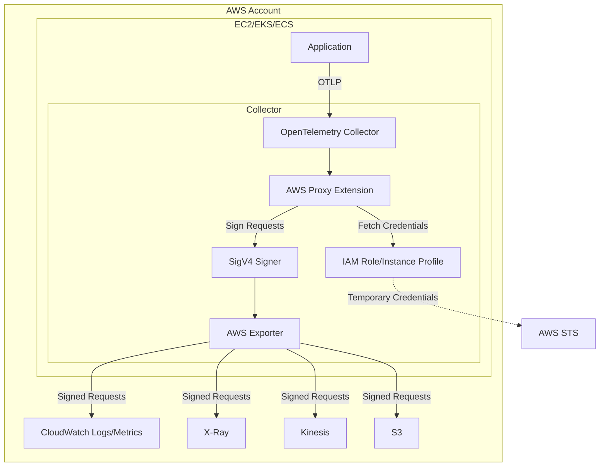

# How to Configure the AWS Proxy Extension in the OpenTelemetry Collector

Author: [nawazdhandala](https://www.github.com/nawazdhandala)

Tags: OpenTelemetry, Collector, Extensions, AWS, Authentication, IAM, SigV4

Description: Master the AWS Proxy Extension in OpenTelemetry Collector to enable AWS IAM authentication, automatic credential management, and secure telemetry export to AWS services like CloudWatch, X-Ray, and Kinesis using SigV4 signing.

---

The AWS Proxy Extension in the OpenTelemetry Collector provides seamless integration with AWS services through automatic IAM authentication, credential management, and AWS Signature Version 4 (SigV4) request signing. This extension eliminates the complexity of managing AWS credentials and enables secure, native integration with AWS observability services.

## What is the AWS Proxy Extension?

The AWS Proxy Extension is an OpenTelemetry Collector component that acts as an authentication proxy for AWS services. It automatically handles AWS credential discovery, session management, and SigV4 request signing, allowing exporters to communicate with AWS services without embedding AWS-specific authentication logic.

The extension provides:

- Automatic AWS credential discovery from multiple sources (IAM roles, environment variables, credential files)
- SigV4 request signing for API authentication
- Session token management and automatic credential rotation
- Regional endpoint configuration and routing
- Support for AWS services including CloudWatch, X-Ray, Kinesis, S3, and more
- Cross-account access through IAM role assumption
- Proxy configuration for restricted network environments

This extension is essential for running OpenTelemetry Collector in AWS environments where IAM-based authentication is required or preferred over static API keys.

## Why Use the AWS Proxy Extension?

AWS environments have unique security and operational requirements that the AWS Proxy Extension addresses:

**IAM-Based Security**: AWS best practices mandate using IAM roles rather than long-lived access keys. The extension seamlessly integrates with IAM, automatically discovering and using instance profiles, EKS service accounts, or assumed roles without manual credential management.

**Credential Rotation**: Static credentials create security risks and operational overhead. The extension automatically refreshes temporary credentials from AWS STS (Security Token Service), ensuring continuous operation without manual intervention.

**Regional Optimization**: AWS services are regional. The extension automatically routes requests to the correct regional endpoints based on configuration or instance metadata, reducing latency and ensuring compliance with data residency requirements.

**Multi-Account Access**: Enterprise AWS environments often span multiple accounts. The extension supports IAM role assumption, enabling centralized telemetry collection from workloads across different AWS accounts.

**Compliance**: Many regulatory frameworks require eliminating long-lived credentials. The extension's integration with temporary IAM credentials helps meet compliance requirements like SOC 2, PCI-DSS, and HIPAA.

## Architecture and AWS Integration

The AWS Proxy Extension integrates with AWS services and the Collector pipeline:



The extension discovers credentials from the AWS credential chain, signs outbound requests using SigV4, and automatically refreshes credentials before expiration. Exporters remain credential-agnostic, relying entirely on the extension for authentication.

## Basic Configuration for EC2 Instances

The simplest configuration uses EC2 instance profiles for automatic authentication:

```yaml
# extensions section configures AWS proxy
extensions:
  # AWS proxy extension with instance profile authentication
  awsproxy:
    # AWS region (auto-detected if not specified)
    region: us-east-1

    # Credential discovery order
    # 1. Environment variables (AWS_ACCESS_KEY_ID, AWS_SECRET_ACCESS_KEY)
    # 2. Shared credentials file (~/.aws/credentials)
    # 3. IAM instance profile
    # 4. ECS task role
    # 5. EKS service account
    credential_chain:
      - environment
      - instance_profile

    # Endpoint configuration
    endpoint:
      # Use AWS default endpoints
      use_default: true

# receivers accept telemetry
receivers:
  otlp:
    protocols:
      grpc:
        endpoint: 0.0.0.0:4317
      http:
        endpoint: 0.0.0.0:4318

# processors transform data
processors:
  batch:
    timeout: 10s
    send_batch_size: 1024

# exporters for AWS services
exporters:
  # CloudWatch Logs exporter
  awscloudwatchlogs:
    region: us-east-1
    log_group_name: /aws/otel-collector/logs
    log_stream_name: collector-stream
    # Authentication handled by awsproxy extension

  # X-Ray exporter for traces
  awsxray:
    region: us-east-1
    # Authentication handled by awsproxy extension

service:
  # Enable AWS proxy extension
  extensions: [awsproxy]

  pipelines:
    logs:
      receivers: [otlp]
      processors: [batch]
      exporters: [awscloudwatchlogs]

    traces:
      receivers: [otlp]
      processors: [batch]
      exporters: [awsxray]
```

This configuration automatically discovers credentials from the EC2 instance profile and signs all requests to CloudWatch and X-Ray. No explicit credential configuration is required.

## EKS Configuration with IRSA

For Kubernetes on EKS, use IAM Roles for Service Accounts (IRSA) for secure, pod-level authentication:

```yaml
extensions:
  awsproxy:
    region: us-east-1

    # Credential chain for EKS
    credential_chain:
      - environment            # Check for explicit credentials
      - web_identity           # IRSA web identity token
      - instance_profile       # Fallback to node instance profile

    # IRSA configuration
    assume_role:
      # Enable automatic role assumption from web identity
      enable_web_identity: true
      # Token file path (automatically set by EKS)
      web_identity_token_file: /var/run/secrets/eks.amazonaws.com/serviceaccount/token
      # Role ARN (injected via environment variable)
      role_arn: ${AWS_ROLE_ARN}
      # Session name for auditing
      role_session_name: otel-collector-${POD_NAME}

receivers:
  otlp:
    protocols:
      grpc:
        endpoint: 0.0.0.0:4317

processors:
  batch:
    timeout: 10s

exporters:
  awscloudwatchlogs:
    region: us-east-1
    log_group_name: /eks/otel-collector
    log_stream_name: ${POD_NAME}

  awsxray:
    region: us-east-1

service:
  extensions: [awsproxy]

  pipelines:
    logs:
      receivers: [otlp]
      processors: [batch]
      exporters: [awscloudwatchlogs]

    traces:
      receivers: [otlp]
      processors: [batch]
      exporters: [awsxray]
```

**Kubernetes Deployment Configuration**:

```yaml
apiVersion: v1
kind: ServiceAccount
metadata:
  name: otel-collector
  namespace: observability
  annotations:
    # Associate IAM role with service account
    eks.amazonaws.com/role-arn: arn:aws:iam::123456789012:role/OtelCollectorRole

---
apiVersion: apps/v1
kind: Deployment
metadata:
  name: otel-collector
  namespace: observability
spec:
  replicas: 3
  selector:
    matchLabels:
      app: otel-collector
  template:
    metadata:
      labels:
        app: otel-collector
    spec:
      # Use service account with IRSA
      serviceAccountName: otel-collector

      containers:
        - name: otel-collector
          image: otel/opentelemetry-collector-contrib:0.93.0

          env:
            # Pod name for log stream naming
            - name: POD_NAME
              valueFrom:
                fieldRef:
                  fieldPath: metadata.name

            # AWS region
            - name: AWS_REGION
              value: us-east-1

            # Role ARN (automatically injected by IRSA webhook)
            - name: AWS_ROLE_ARN
              value: arn:aws:iam::123456789012:role/OtelCollectorRole

            # Web identity token file (automatically mounted)
            - name: AWS_WEB_IDENTITY_TOKEN_FILE
              value: /var/run/secrets/eks.amazonaws.com/serviceaccount/token

          volumeMounts:
            - name: config
              mountPath: /etc/otel-collector

          resources:
            limits:
              memory: 2Gi
              cpu: 1000m
            requests:
              memory: 1Gi
              cpu: 500m

      volumes:
        - name: config
          configMap:
            name: otel-collector-config
```

This configuration enables secure, pod-level authentication using IRSA without storing any credentials in configuration or environment variables.

## Cross-Account Access Configuration

For enterprise environments spanning multiple AWS accounts, configure cross-account role assumption:

```yaml
extensions:
  # AWS proxy for primary account
  awsproxy/primary:
    region: us-east-1

    credential_chain:
      - environment
      - instance_profile

    # Primary account endpoints
    endpoint:
      use_default: true

  # AWS proxy for secondary account
  awsproxy/secondary:
    region: us-east-1

    credential_chain:
      - environment
      - instance_profile

    # Assume role in secondary account
    assume_role:
      # Role in secondary account
      role_arn: arn:aws:iam::987654321098:role/CrossAccountOtelRole
      # Session name for auditing
      role_session_name: otel-collector-cross-account
      # External ID for additional security
      external_id: ${CROSS_ACCOUNT_EXTERNAL_ID}
      # Session duration (max 12 hours)
      duration_seconds: 3600

receivers:
  otlp:
    protocols:
      grpc:
        endpoint: 0.0.0.0:4317

processors:
  batch:
    timeout: 10s

exporters:
  # Export to primary account CloudWatch
  awscloudwatchlogs/primary:
    region: us-east-1
    log_group_name: /primary/otel-collector
    # Uses awsproxy/primary extension

  # Export to secondary account CloudWatch
  awscloudwatchlogs/secondary:
    region: us-east-1
    log_group_name: /secondary/otel-collector
    # Uses awsproxy/secondary extension

  # Export to primary account X-Ray
  awsxray/primary:
    region: us-east-1
    # Uses awsproxy/primary extension

service:
  # Enable both AWS proxy extensions
  extensions: [awsproxy/primary, awsproxy/secondary]

  pipelines:
    # Logs to both accounts
    logs/primary:
      receivers: [otlp]
      processors: [batch]
      exporters: [awscloudwatchlogs/primary]

    logs/secondary:
      receivers: [otlp]
      processors: [batch]
      exporters: [awscloudwatchlogs/secondary]

    # Traces to primary account
    traces:
      receivers: [otlp]
      processors: [batch]
      exporters: [awsxray/primary]
```

Cross-account access enables centralized telemetry collection while maintaining account-level data isolation.

## Advanced Regional Configuration

Optimize performance with regional endpoint routing:

```yaml
extensions:
  # Regional AWS proxy for US East
  awsproxy/us_east:
    region: us-east-1

    credential_chain:
      - instance_profile

    endpoint:
      # Custom endpoints for specific services
      cloudwatch_logs:
        url: https://logs.us-east-1.amazonaws.com
      xray:
        url: https://xray.us-east-1.amazonaws.com
      kinesis:
        url: https://kinesis.us-east-1.amazonaws.com

    # Retry configuration for network resilience
    retry:
      max_attempts: 3
      initial_backoff: 1s
      max_backoff: 30s

  # Regional AWS proxy for US West
  awsproxy/us_west:
    region: us-west-2

    credential_chain:
      - instance_profile

    endpoint:
      cloudwatch_logs:
        url: https://logs.us-west-2.amazonaws.com
      xray:
        url: https://xray.us-west-2.amazonaws.com

receivers:
  otlp:
    protocols:
      grpc:
        endpoint: 0.0.0.0:4317

processors:
  batch:
    timeout: 10s

  # Route telemetry based on source region
  routing:
    from_attribute: region
    default_exporters: [awscloudwatchlogs/us_east]
    table:
      - value: us-east-1
        exporters: [awscloudwatchlogs/us_east]
      - value: us-west-2
        exporters: [awscloudwatchlogs/us_west]

exporters:
  # US East exporters
  awscloudwatchlogs/us_east:
    region: us-east-1
    log_group_name: /otel/us-east-1

  awsxray/us_east:
    region: us-east-1

  # US West exporters
  awscloudwatchlogs/us_west:
    region: us-west-2
    log_group_name: /otel/us-west-2

  awsxray/us_west:
    region: us-west-2

service:
  extensions: [awsproxy/us_east, awsproxy/us_west]

  pipelines:
    logs:
      receivers: [otlp]
      processors: [batch, routing]
      exporters: [awscloudwatchlogs/us_east, awscloudwatchlogs/us_west]

    traces:
      receivers: [otlp]
      processors: [batch]
      exporters: [awsxray/us_east, awsxray/us_west]
```

Regional routing reduces latency and ensures data residency compliance by keeping telemetry within specific AWS regions.

## Proxy and VPC Endpoint Configuration

For secure VPC environments with restricted internet access:

```yaml
extensions:
  awsproxy:
    region: us-east-1

    credential_chain:
      - instance_profile

    # HTTP proxy configuration
    proxy:
      # Proxy URL for outbound requests
      http_proxy: http://proxy.internal.company.com:8080
      https_proxy: http://proxy.internal.company.com:8080
      # Bypass proxy for VPC endpoints
      no_proxy: .amazonaws.com,.internal

    # VPC endpoint configuration
    endpoint:
      # Use VPC endpoints for private connectivity
      cloudwatch_logs:
        url: https://vpce-123abc.logs.us-east-1.vpce.amazonaws.com
      xray:
        url: https://vpce-456def.xray.us-east-1.vpce.amazonaws.com

      # Custom DNS resolver for VPC endpoints
      dns_resolver:
        servers:
          - 10.0.0.2:53
        timeout: 5s

    # TLS configuration for VPC endpoints
    tls:
      # Verify VPC endpoint certificates
      insecure_skip_verify: false
      # Custom CA bundle for internal certificates
      ca_file: /etc/ssl/certs/company-ca.pem

receivers:
  otlp:
    protocols:
      grpc:
        endpoint: 0.0.0.0:4317

processors:
  batch:
    timeout: 10s

exporters:
  awscloudwatchlogs:
    region: us-east-1
    log_group_name: /vpc/otel-collector

  awsxray:
    region: us-east-1

service:
  extensions: [awsproxy]

  pipelines:
    logs:
      receivers: [otlp]
      processors: [batch]
      exporters: [awscloudwatchlogs]

    traces:
      receivers: [otlp]
      processors: [batch]
      exporters: [awsxray]
```

This configuration enables secure, private connectivity to AWS services through VPC endpoints, eliminating internet exposure for telemetry traffic.

## Performance Optimization

### Credential Caching

Reduce authentication overhead with credential caching:

```yaml
extensions:
  awsproxy:
    region: us-east-1

    credential_chain:
      - instance_profile

    # Credential caching configuration
    cache:
      enabled: true
      # Cache credentials until 5 minutes before expiration
      refresh_before_expiry: 300s
      # Maximum cache size
      max_entries: 1000
      # Cache eviction policy
      eviction: lru

    # Parallel credential refresh
    parallel_refresh:
      enabled: true
      # Number of workers for credential refresh
      workers: 4

receivers:
  otlp:
    protocols:
      grpc:
        endpoint: 0.0.0.0:4317

processors:
  batch:
    timeout: 10s
    send_batch_size: 1024

exporters:
  awscloudwatchlogs:
    region: us-east-1
    log_group_name: /otel-collector

service:
  extensions: [awsproxy]

  pipelines:
    logs:
      receivers: [otlp]
      processors: [batch]
      exporters: [awscloudwatchlogs]
```

Credential caching eliminates redundant STS calls, reducing latency and improving throughput.

### Request Batching and Rate Limiting

Optimize API usage with batching and rate limiting:

```yaml
extensions:
  awsproxy:
    region: us-east-1

    credential_chain:
      - instance_profile

    # Rate limiting configuration
    rate_limit:
      # Maximum requests per second
      requests_per_second: 100
      # Burst capacity
      burst: 200

    # Connection pooling
    connection_pool:
      max_idle_connections: 100
      max_connections_per_host: 10
      idle_connection_timeout: 90s

receivers:
  otlp:
    protocols:
      grpc:
        endpoint: 0.0.0.0:4317

processors:
  batch:
    # Larger batches reduce API calls
    timeout: 30s
    send_batch_size: 5000

exporters:
  awscloudwatchlogs:
    region: us-east-1
    log_group_name: /otel-collector

    # CloudWatch-specific batching
    max_events_per_batch: 10000
    max_batch_size_bytes: 1048576

service:
  extensions: [awsproxy]

  pipelines:
    logs:
      receivers: [otlp]
      processors: [batch]
      exporters: [awscloudwatchlogs]
```

Rate limiting prevents API throttling while batching reduces total API calls, lowering costs and improving performance.

## Monitoring and Troubleshooting

### Enable Detailed Logging

Debug AWS authentication and signing issues:

```yaml
extensions:
  awsproxy:
    region: us-east-1

    credential_chain:
      - instance_profile

    # Logging configuration
    logging:
      level: debug
      # Log credential discovery process
      log_credential_discovery: true
      # Log SigV4 signing operations
      log_signing: true
      # Redact sensitive information
      redact_credentials: true

receivers:
  otlp:
    protocols:
      grpc:
        endpoint: 0.0.0.0:4317

processors:
  batch:
    timeout: 10s

exporters:
  # Use logging exporter for debugging
  logging:
    loglevel: debug

  awscloudwatchlogs:
    region: us-east-1
    log_group_name: /otel-collector

service:
  # Enable debug telemetry
  telemetry:
    logs:
      level: debug

  extensions: [awsproxy]

  pipelines:
    logs:
      receivers: [otlp]
      processors: [batch]
      exporters: [logging, awscloudwatchlogs]
```

Debug logs show credential discovery, role assumption, and signing operations, helping diagnose authentication failures.

### Metrics and Health Monitoring

Track AWS proxy performance with internal metrics:

```yaml
extensions:
  awsproxy:
    region: us-east-1

    credential_chain:
      - instance_profile

    # Metrics configuration
    metrics:
      enabled: true
      detailed: true

receivers:
  otlp:
    protocols:
      grpc:
        endpoint: 0.0.0.0:4317

processors:
  batch:
    timeout: 10s

exporters:
  awscloudwatchlogs:
    region: us-east-1
    log_group_name: /otel-collector

service:
  extensions: [awsproxy]

  # Configure Collector self-monitoring
  telemetry:
    metrics:
      level: detailed
      readers:
        - periodic:
            exporter:
              otlp:
                protocol: http/protobuf
                endpoint: https://oneuptime.com/otlp
                headers:
                  x-oneuptime-token: ${ONEUPTIME_TOKEN}

  pipelines:
    logs:
      receivers: [otlp]
      processors: [batch]
      exporters: [awscloudwatchlogs]
```

**Key Metrics**:

- **otelcol_awsproxy_credential_refresh_total**: Credential refresh attempts
- **otelcol_awsproxy_credential_refresh_errors**: Failed credential refreshes
- **otelcol_awsproxy_signing_duration_milliseconds**: SigV4 signing duration
- **otelcol_awsproxy_requests_total**: Total signed requests
- **otelcol_awsproxy_requests_errors**: Failed request signings

These metrics help identify authentication issues, performance bottlenecks, and credential rotation problems.

## Security Best Practices

### Principle of Least Privilege

Grant minimal IAM permissions required for telemetry export:

```json
{
  "Version": "2012-10-17",
  "Statement": [
    {
      "Sid": "CloudWatchLogsWrite",
      "Effect": "Allow",
      "Action": [
        "logs:CreateLogGroup",
        "logs:CreateLogStream",
        "logs:PutLogEvents",
        "logs:DescribeLogGroups",
        "logs:DescribeLogStreams"
      ],
      "Resource": [
        "arn:aws:logs:us-east-1:123456789012:log-group:/otel-collector/*"
      ]
    },
    {
      "Sid": "XRayWrite",
      "Effect": "Allow",
      "Action": [
        "xray:PutTraceSegments",
        "xray:PutTelemetryRecords"
      ],
      "Resource": "*"
    },
    {
      "Sid": "CloudWatchMetricsWrite",
      "Effect": "Allow",
      "Action": [
        "cloudwatch:PutMetricData"
      ],
      "Resource": "*",
      "Condition": {
        "StringEquals": {
          "cloudwatch:namespace": "OTel/Collector"
        }
      }
    }
  ]
}
```

Minimal permissions reduce blast radius if credentials are compromised.

### Audit and Monitoring

Enable CloudTrail logging for authentication audit:

```yaml
extensions:
  awsproxy:
    region: us-east-1

    credential_chain:
      - instance_profile

    # Audit configuration
    audit:
      enabled: true
      # Log all credential operations to CloudTrail
      cloudtrail:
        enabled: true
        # Custom event source
        event_source: otel-collector

      # Session tagging for attribution
      session_tags:
        - key: Application
          value: otel-collector
        - key: Environment
          value: ${ENVIRONMENT}
        - key: Team
          value: observability

receivers:
  otlp:
    protocols:
      grpc:
        endpoint: 0.0.0.0:4317

processors:
  batch:
    timeout: 10s

exporters:
  awscloudwatchlogs:
    region: us-east-1
    log_group_name: /otel-collector

service:
  extensions: [awsproxy]

  pipelines:
    logs:
      receivers: [otlp]
      processors: [batch]
      exporters: [awscloudwatchlogs]
```

Session tags and CloudTrail integration enable detailed audit trails for security analysis and compliance.

## Production Deployment Example

Complete production configuration with all best practices:

```yaml
extensions:
  awsproxy:
    region: ${AWS_REGION}

    credential_chain:
      - environment
      - web_identity
      - instance_profile

    # IRSA configuration for EKS
    assume_role:
      enable_web_identity: true
      role_arn: ${AWS_ROLE_ARN}
      role_session_name: otel-collector-${POD_NAME}
      duration_seconds: 3600

    # Credential caching
    cache:
      enabled: true
      refresh_before_expiry: 300s

    # VPC endpoint configuration
    endpoint:
      cloudwatch_logs:
        url: ${CLOUDWATCH_ENDPOINT}
      xray:
        url: ${XRAY_ENDPOINT}

    # TLS configuration
    tls:
      insecure_skip_verify: false
      ca_file: /etc/ssl/certs/ca-bundle.crt

    # Rate limiting
    rate_limit:
      requests_per_second: 100
      burst: 200

    # Connection pooling
    connection_pool:
      max_idle_connections: 100
      max_connections_per_host: 10

    # Retry configuration
    retry:
      max_attempts: 3
      initial_backoff: 1s
      max_backoff: 30s

    # Logging
    logging:
      level: info
      redact_credentials: true

    # Metrics
    metrics:
      enabled: true

receivers:
  otlp:
    protocols:
      grpc:
        endpoint: 0.0.0.0:4317
        max_concurrent_streams: 100
      http:
        endpoint: 0.0.0.0:4318

processors:
  memory_limiter:
    check_interval: 1s
    limit_mib: 2048

  batch:
    timeout: 30s
    send_batch_size: 5000

  resource:
    attributes:
      - key: aws.region
        value: ${AWS_REGION}
        action: upsert
      - key: k8s.cluster.name
        value: ${CLUSTER_NAME}
        action: upsert

exporters:
  awscloudwatchlogs:
    region: ${AWS_REGION}
    log_group_name: /eks/otel-collector
    log_stream_name: ${POD_NAME}
    max_events_per_batch: 10000

  awsxray:
    region: ${AWS_REGION}
    index_all_attributes: true

service:
  extensions: [awsproxy]

  telemetry:
    logs:
      level: info
    metrics:
      level: detailed
      readers:
        - periodic:
            exporter:
              otlp:
                protocol: http/protobuf
                endpoint: https://oneuptime.com/otlp
                headers:
                  x-oneuptime-token: ${ONEUPTIME_TOKEN}

  pipelines:
    logs:
      receivers: [otlp]
      processors: [memory_limiter, resource, batch]
      exporters: [awscloudwatchlogs]

    traces:
      receivers: [otlp]
      processors: [memory_limiter, resource, batch]
      exporters: [awsxray]
```

This production configuration includes IAM authentication, caching, VPC endpoints, rate limiting, and comprehensive monitoring.

## Related Resources

For comprehensive AWS observability with OpenTelemetry, explore these related topics:

- [OpenTelemetry Collector: What It Is, When You Need It, and When You Don't](https://oneuptime.com/blog/post/2025-09-18-what-is-opentelemetry-collector-and-why-use-one/view)
- [How to collect internal metrics from OpenTelemetry Collector](https://oneuptime.com/blog/post/2025-01-22-how-to-collect-opentelemetry-collector-internal-metrics/view)
- [Kubernetes Network Policies for Zero Trust Security](https://oneuptime.com/blog/post/2026-01-06-kubernetes-network-policies-zero-trust/view)

## Summary

The AWS Proxy Extension enables seamless integration between OpenTelemetry Collector and AWS services through automatic IAM authentication, SigV4 signing, and credential management. By eliminating manual credential handling and providing native AWS integration, the extension simplifies security, improves operational efficiency, and enables scalable telemetry export to AWS observability services.

Start with basic instance profile authentication for EC2 deployments or IRSA for EKS workloads. As requirements grow, implement cross-account access, regional optimization, and VPC endpoint integration for enhanced security and performance. Credential caching and rate limiting optimize resource usage in high-throughput environments.

Monitor AWS proxy operations through internal metrics to identify authentication issues and performance bottlenecks. Follow least privilege principles when defining IAM policies, and enable CloudTrail logging for comprehensive audit trails. The extension's flexibility enables sophisticated AWS integration patterns while maintaining security and operational simplicity.

Need a vendor-neutral observability platform that works alongside AWS services? OneUptime provides native OpenTelemetry support with seamless AWS integration, eliminating vendor lock-in while preserving native AWS authentication and security capabilities.
