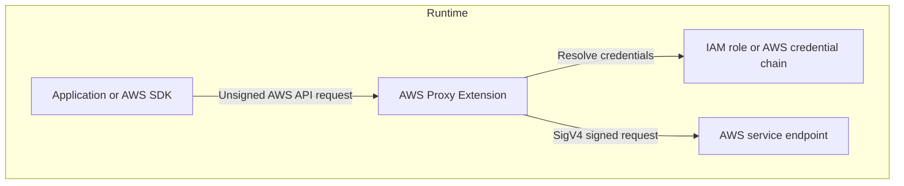

# How to Configure the AWS Proxy Extension in the OpenTelemetry Collector

Author: [nawazdhandala](https://www.github.com/nawazdhandala)

Tags: OpenTelemetry, Collector, Extension, AWS, Authentication, IAM, SigV4

Description: Master the AWS Proxy Extension in OpenTelemetry Collector to enable AWS IAM authentication, automatic credential management, and secure telemetry export to AWS services like CloudWatch, X-Ray.

---

The AWS Proxy Extension in the OpenTelemetry Collector provides a local HTTP proxy that accepts unsigned requests and forwards them to an AWS service after applying AWS Signature Version 4 (SigV4) signing. This lets applications or local SDKs send AWS API requests to the Collector without carrying AWS credentials themselves.

## What is the AWS Proxy Extension?

The AWS Proxy Extension is an OpenTelemetry Collector extension that listens on a configured TCP endpoint, signs incoming HTTP requests with SigV4, and forwards them to a configured AWS service endpoint. The proxy uses the Collector process's AWS credentials, which can come from the standard AWS credential lookup or from a configured IAM role ARN.

The extension provides:

- SigV4 request signing for forwarded AWS API requests
- AWS region configuration or region discovery from environment variables, ECS metadata, or EC2 instance metadata
- Optional IAM role assumption through `role_arn`
- Optional AWS service endpoint override through `aws_endpoint`
- Optional outbound proxy configuration through `proxy_address`
- TLS client settings for connections from the proxy to AWS

The AWS Proxy Extension is useful when an application or SDK can call a local proxy endpoint but should not receive AWS credentials directly. It is not a general-purpose authentication layer for all AWS exporters. AWS exporters such as `awscloudwatchlogs` and `awsxray` already use AWS SDK credential resolution and their own exporter-specific configuration.

## Why Use the AWS Proxy Extension?

AWS environments have unique security and operational requirements that the AWS Proxy Extension can help address:

**IAM-Based Security**: Instead of placing AWS access keys in an application, you can run the Collector with an IAM role or another supported AWS credential source and have applications send unsigned AWS API requests to the proxy.

**Credential Rotation**: When the Collector runs on temporary AWS credentials, the AWS SDK credential provider refreshes those credentials as needed. The application calling the proxy does not need to manage that process.

**Regional Configuration**: The proxy signs requests for the configured AWS region. If `region` is not set, the extension attempts to resolve it from `AWS_DEFAULT_REGION`, `AWS_REGION`, ECS metadata, or EC2 instance metadata unless `local_mode` disables metadata lookup.

**Cross-Account Access**: The proxy can assume an IAM role by setting `role_arn`. If `role_arn` is empty, it uses the standard AWS credential lookup for the Collector process.

**Compliance**: Keeping AWS credentials in the Collector process instead of distributing them to applications can help reduce long-lived credential exposure.

## Architecture and AWS Integration

The AWS Proxy Extension integrates with AWS services as a local signing proxy:


```mermaid
graph TB
    subgraph Runtime
        A[Application or AWS SDK] -->|Unsigned AWS API request| AP[AWS Proxy Extension]
        AP -->|Resolve credentials| IAM[IAM role or AWS credential chain]
        AP -->|SigV4 signed request| AWS[AWS service endpoint]
    end
```

The extension does not automatically attach itself to every exporter in the Collector pipeline. To use it, a client must send AWS API requests to the proxy's `endpoint`, and the proxy forwards those requests to the configured AWS service.

## Basic Configuration for EC2 Instances

The simplest configuration uses the EC2 instance profile attached to the Collector host:

```yaml
extensions:
  awsproxy:
    endpoint: 0.0.0.0:2000
    region: us-east-1
    service_name: xray

service:
  extensions: [awsproxy]
```

In this configuration, clients send unsigned AWS X-Ray API requests to the Collector at `http://<collector-host>:2000`. The proxy signs the requests with credentials resolved by the AWS SDK and forwards them to the regional X-Ray endpoint.

If you want the Collector itself to export telemetry directly to CloudWatch Logs or X-Ray, configure the AWS exporters directly. Those exporters use AWS credential resolution themselves:

```yaml
receivers:
  otlp:
    protocols:
      grpc:
        endpoint: 0.0.0.0:4317
      http:
        endpoint: 0.0.0.0:4318

processors:
  batch:
    timeout: 10s

exporters:
  awscloudwatchlogs:
    region: us-east-1
    log_group_name: /aws/otel-collector/logs
    log_stream_name: collector-stream

  awsxray:
    region: us-east-1

service:
  pipelines:
    logs:
      receivers: [otlp]
      processors: [batch]
      exporters: [awscloudwatchlogs]

    traces:
      receivers: [otlp]
      processors: [batch]
      exporters: [awsxray]
```

## EKS Configuration with IRSA

For Kubernetes on EKS, use IAM Roles for Service Accounts (IRSA) to provide AWS credentials to the Collector pod. The AWS Proxy Extension does not need a `credential_chain` or web identity token setting; the AWS SDK reads the IRSA environment variables and projected token file.

```yaml
extensions:
  awsproxy:
    endpoint: 0.0.0.0:2000
    region: us-east-1
    service_name: xray

service:
  extensions: [awsproxy]
```

**Kubernetes Deployment Configuration**:

```yaml
apiVersion: v1
kind: ServiceAccount
metadata:
  name: otel-collector
  namespace: observability
  annotations:
    eks.amazonaws.com/role-arn: arn:aws:iam::123456789012:role/OtelCollectorRole

---
apiVersion: apps/v1
kind: Deployment
metadata:
  name: otel-collector
  namespace: observability
spec:
  replicas: 3
  selector:
    matchLabels:
      app: otel-collector
  template:
    metadata:
      labels:
        app: otel-collector
    spec:
      serviceAccountName: otel-collector
      containers:
        - name: otel-collector
          image: otel/opentelemetry-collector-contrib:0.93.0
          args:
            - --config=/etc/otel-collector/config.yaml
          env:
            - name: AWS_REGION
              value: us-east-1
          ports:
            - name: awsproxy
              containerPort: 2000
          volumeMounts:
            - name: config
              mountPath: /etc/otel-collector
          resources:
            limits:
              memory: 2Gi
              cpu: 1000m
            requests:
              memory: 1Gi
              cpu: 500m
      volumes:
        - name: config
          configMap:
            name: otel-collector-config
```

This configuration enables pod-level authentication without storing static AWS credentials in the Collector configuration.

## Cross-Account Access Configuration

For cross-account access, set `role_arn` on the proxy. The Collector's base credentials must be allowed to call `sts:AssumeRole` for that role.

```yaml
extensions:
  awsproxy/primary:
    endpoint: 0.0.0.0:2000
    region: us-east-1
    service_name: xray

  awsproxy/secondary:
    endpoint: 0.0.0.0:2001
    region: us-east-1
    service_name: xray
    role_arn: arn:aws:iam::987654321098:role/CrossAccountOtelRole

service:
  extensions: [awsproxy/primary, awsproxy/secondary]
```

Clients that should use the primary account call port `2000`; clients that should use the secondary account call port `2001`.

## Advanced Regional Configuration

Configure one proxy instance per AWS service and region that you need to expose:

```yaml
extensions:
  awsproxy/xray_us_east:
    endpoint: 0.0.0.0:2000
    region: us-east-1
    service_name: xray

  awsproxy/xray_us_west:
    endpoint: 0.0.0.0:2001
    region: us-west-2
    service_name: xray

  awsproxy/logs_us_east:
    endpoint: 0.0.0.0:2002
    region: us-east-1
    service_name: logs
    aws_endpoint: https://logs.us-east-1.amazonaws.com

service:
  extensions: [awsproxy/xray_us_east, awsproxy/xray_us_west, awsproxy/logs_us_east]
```

Each proxy listener signs requests for its configured `service_name` and region.

## Proxy and VPC Endpoint Configuration

For restricted networks, use `proxy_address` to forward the proxy's outbound requests through an HTTP proxy. Use `aws_endpoint` when forwarding to a specific AWS endpoint, such as a VPC endpoint DNS name.

```yaml
extensions:
  awsproxy:
    endpoint: 0.0.0.0:2000
    region: us-east-1
    service_name: xray
    aws_endpoint: https://vpce-456def.xray.us-east-1.vpce.amazonaws.com
    proxy_address: http://proxy.internal.company.com:8080
    tls:
      insecure: false

service:
  extensions: [awsproxy]
```

This configuration keeps AWS credentials in the Collector while forwarding signed requests through the configured private network path.

## Performance Optimization

### Credential Caching

The AWS Proxy Extension does not expose a `cache` or `parallel_refresh` configuration block. Credential reuse and refresh behavior come from the AWS SDK credential providers used by the Collector process.

```yaml
extensions:
  awsproxy:
    endpoint: 0.0.0.0:2000
    region: us-east-1
    service_name: xray
    local_mode: false

service:
  extensions: [awsproxy]
```

Set `local_mode: true` only when you want to prevent region lookup through ECS or EC2 metadata. When `local_mode` is true, provide `region` explicitly.

### Request Batching and Rate Limiting

The AWS Proxy Extension does not expose `rate_limit` or `connection_pool` settings. If the Collector is exporting telemetry directly, use exporter-supported batching, queueing, and retry settings instead. For example, the CloudWatch Logs exporter supports the Collector `sending_queue` and `retry_on_failure` settings:

```yaml
exporters:
  awscloudwatchlogs:
    region: us-east-1
    log_group_name: /otel-collector
    log_stream_name: collector-stream
    sending_queue:
      enabled: true
      num_consumers: 10
      queue_size: 1000
    retry_on_failure:
      enabled: true
      initial_interval: 5s
      max_interval: 30s
      max_elapsed_time: 120s
```

## Monitoring and Troubleshooting

### Enable Detailed Logging

Use the Collector's own telemetry log level to debug proxy startup, credential resolution, and forwarding errors:

```yaml
extensions:
  awsproxy:
    endpoint: 0.0.0.0:2000
    region: us-east-1
    service_name: xray

service:
  telemetry:
    logs:
      level: debug
  extensions: [awsproxy]
```

The AWS Proxy Extension does not define `logging`, `log_credential_discovery`, or `log_signing` settings of its own.

### Metrics and Health Monitoring

The AWS Proxy Extension does not document component-specific metrics such as `otelcol_awsproxy_credential_refresh_total`. Use Collector telemetry for process-level monitoring, and use AWS service-side metrics and CloudTrail events to monitor API calls that reach AWS.

```yaml
extensions:
  awsproxy:
    endpoint: 0.0.0.0:2000
    region: us-east-1
    service_name: xray

service:
  telemetry:
    metrics:
      level: detailed
      readers:
        - periodic:
            exporter:
              otlp:
                protocol: http/protobuf
                endpoint: https://oneuptime.com/otlp
                headers:
                  x-oneuptime-token: ${ONEUPTIME_TOKEN}
  extensions: [awsproxy]
```

## Security Best Practices

### Principle of Least Privilege

Grant minimal IAM permissions required for the AWS APIs that clients call through the proxy. For an X-Ray proxy, that commonly includes write permissions for segments and telemetry records:

```json
{
  "Version": "2012-10-17",
  "Statement": [
    {
      "Sid": "XRayWrite",
      "Effect": "Allow",
      "Action": [
        "xray:PutTraceSegments",
        "xray:PutTelemetryRecords"
      ],
      "Resource": "*"
    }
  ]
}
```

If you configure the proxy for CloudWatch Logs, add only the CloudWatch Logs actions required by the client requests you forward.

### Audit and Monitoring

CloudTrail records supported AWS API activity after signed requests reach AWS. The AWS Proxy Extension does not expose an `audit` or `cloudtrail` configuration block; enable and configure CloudTrail in AWS.

When using `role_arn`, make sure the trust policy and permissions policy for the target role allow only the expected Collector identity to assume the role.

## Production Deployment Example

Complete production configuration with supported AWS Proxy Extension settings:

```yaml
extensions:
  awsproxy/xray:
    endpoint: 0.0.0.0:2000
    region: ${AWS_REGION}
    service_name: xray
    aws_endpoint: ${XRAY_ENDPOINT}
    role_arn: ${AWS_ROLE_ARN}
    local_mode: false
    tls:
      insecure: false

  health_check:
    endpoint: 0.0.0.0:13133

service:
  telemetry:
    logs:
      level: info
    metrics:
      level: detailed
  extensions: [awsproxy/xray, health_check]
```

For direct telemetry export from the Collector to AWS services, configure the AWS exporters separately:

```yaml
receivers:
  otlp:
    protocols:
      grpc:
        endpoint: 0.0.0.0:4317
      http:
        endpoint: 0.0.0.0:4318

processors:
  memory_limiter:
    check_interval: 1s
    limit_mib: 2048
  batch:
    timeout: 30s
    send_batch_size: 5000

exporters:
  awscloudwatchlogs:
    region: ${AWS_REGION}
    log_group_name: /eks/otel-collector
    log_stream_name: ${POD_NAME}

  awsxray:
    region: ${AWS_REGION}
    index_all_attributes: true

service:
  pipelines:
    logs:
      receivers: [otlp]
      processors: [memory_limiter, batch]
      exporters: [awscloudwatchlogs]

    traces:
      receivers: [otlp]
      processors: [memory_limiter, batch]
      exporters: [awsxray]
```

This keeps the AWS Proxy Extension use case separate from the direct AWS exporter use case.

## Related Resources

For comprehensive AWS observability with OpenTelemetry, explore these related topics:

- [OpenTelemetry Collector: What It Is, When You Need It, and When You Don't](https://oneuptime.com/blog/post/2025-09-18-what-is-opentelemetry-collector-and-why-use-one/view)
- [How to collect internal metrics from OpenTelemetry Collector](https://oneuptime.com/blog/post/2025-01-22-how-to-collect-opentelemetry-collector-internal-metrics/view)
- [Kubernetes Network Policies for Zero Trust Security](https://oneuptime.com/blog/post/2026-01-06-kubernetes-network-policies-zero-trust/view)

## Summary

The AWS Proxy Extension enables a Collector instance to act as a local SigV4 signing proxy for AWS API requests. It listens on a TCP endpoint, resolves AWS credentials for the Collector process, signs incoming requests, and forwards them to the configured AWS service endpoint.

Start with an instance profile or IRSA for the Collector process, configure `region` and `service_name`, and expose only the proxy endpoint that trusted local clients need. Use `role_arn` when the proxy must assume a different IAM role, and use `aws_endpoint` or `proxy_address` for private endpoint and network proxy requirements.

For normal OpenTelemetry pipelines that send logs or traces directly to AWS, configure the AWS exporters themselves. The AWS Proxy Extension does not replace exporter authentication configuration or provide unsupported settings such as `credential_chain`, `cache`, `rate_limit`, `metrics`, or `audit`.

Need a vendor-neutral observability platform that works alongside AWS services? OneUptime provides native OpenTelemetry support with seamless AWS integration, eliminating vendor lock-in while preserving native AWS authentication and security capabilities.
