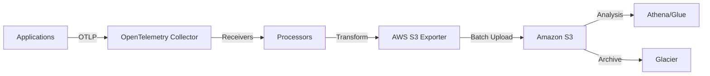

# How to Configure the AWS S3 Exporter in the OpenTelemetry Collector

Author: [nawazdhandala](https://www.github.com/nawazdhandala)

Tags: OpenTelemetry, Collector, Exporters, AWS, S3, Observability, Telemetry

Description: Learn how to configure the AWS S3 exporter in the OpenTelemetry Collector to store traces, metrics, and logs in Amazon S3 for long-term retention and analysis.

The OpenTelemetry Collector provides a powerful way to collect, process, and export telemetry data. One valuable use case is exporting telemetry data to Amazon S3 for long-term storage, compliance requirements, or batch processing. The AWS S3 exporter enables you to persist traces, metrics, and logs directly to S3 buckets.

## Understanding the AWS S3 Exporter

The AWS S3 exporter is part of the OpenTelemetry Collector Contrib distribution. It writes telemetry data to Amazon S3 buckets in various formats, making it ideal for archival, compliance, and data lake scenarios. This exporter supports all three telemetry signals: traces, metrics, and logs.

The exporter batches data and uploads it to S3 at configurable intervals, optimizing for both cost and performance. Each batch is written as a separate object in your S3 bucket, organized by timestamp and signal type.

## Architecture Overview

Here's how the AWS S3 exporter fits into your observability pipeline:



## Prerequisites

Before configuring the AWS S3 exporter, ensure you have:

- An AWS account with appropriate permissions
- An S3 bucket created for storing telemetry data
- AWS credentials configured (IAM role, access keys, or instance profile)
- OpenTelemetry Collector Contrib installed (version 0.80.0 or later)

## IAM Permissions Required

Your AWS credentials must have the following S3 permissions:

```json
{
  "Version": "2012-10-17",
  "Statement": [
    {
      "Effect": "Allow",
      "Action": [
        "s3:PutObject",
        "s3:PutObjectAcl",
        "s3:GetObject",
        "s3:ListBucket"
      ],
      "Resource": [
        "arn:aws:s3:::your-telemetry-bucket/*",
        "arn:aws:s3:::your-telemetry-bucket"
      ]
    }
  ]
}
```

## Basic Configuration

Here's a minimal configuration for the AWS S3 exporter:

```yaml
# OpenTelemetry Collector configuration for AWS S3 exporter
receivers:
  otlp:
    protocols:
      grpc:
        endpoint: 0.0.0.0:4317
      http:
        endpoint: 0.0.0.0:4318

processors:
  batch:
    # Batch data before sending to S3 to optimize costs
    timeout: 10s
    send_batch_size: 1024

exporters:
  awss3:
    # S3 bucket name for storing telemetry data
    s3_bucket: "my-telemetry-bucket"

    # AWS region where the bucket is located
    region: "us-east-1"

    # S3 key prefix for organizing data
    s3_prefix: "otel-data"

    # Data encoding format (json, proto, or otlp_json)
    encoding: "otlp_json"

    # Compression algorithm (none, gzip, or zstd)
    compression: "gzip"

service:
  pipelines:
    traces:
      receivers: [otlp]
      processors: [batch]
      exporters: [awss3]
    metrics:
      receivers: [otlp]
      processors: [batch]
      exporters: [awss3]
    logs:
      receivers: [otlp]
      processors: [batch]
      exporters: [awss3]
```

This configuration sets up three pipelines (traces, metrics, and logs) that receive OTLP data, batch it for efficiency, and export it to the specified S3 bucket.

## Advanced Configuration Options

For production environments, you'll want to customize additional parameters:

```yaml
exporters:
  awss3:
    s3_bucket: "production-telemetry-bucket"
    region: "us-west-2"
    s3_prefix: "telemetry/year={{ .Year }}/month={{ .Month }}/day={{ .Day }}"

    # Partition data by time for easier querying
    s3_partition: "minute"

    # File format for stored data
    encoding: "otlp_json"
    compression: "gzip"

    # AWS credentials configuration
    aws_auth:
      # Use IAM role (recommended for EC2/ECS)
      role_arn: "arn:aws:iam::123456789012:role/OtelCollectorRole"

      # Or use access keys (not recommended for production)
      # access_key_id: "${AWS_ACCESS_KEY_ID}"
      # secret_access_key: "${AWS_SECRET_ACCESS_KEY}"

    # S3 storage class for cost optimization
    s3_storage_class: "STANDARD_IA"

    # Server-side encryption
    s3_encryption:
      type: "aws:kms"
      kms_key_id: "arn:aws:kms:us-west-2:123456789012:key/abcd1234"

    # Batch configuration
    marshaler: "otlp_json"

    # Timeout for S3 operations
    timeout: 30s

    # Retry configuration
    retry_on_failure:
      enabled: true
      initial_interval: 5s
      max_interval: 30s
      max_elapsed_time: 300s
```

## Data Partitioning Strategies

Partitioning your data effectively is crucial for query performance and cost management. The S3 exporter supports time-based partitioning using Go template syntax:

```yaml
exporters:
  awss3:
    s3_bucket: "telemetry-data"
    # Partition by signal type, date, and hour
    s3_prefix: "{{ .SignalType }}/year={{ .Year }}/month={{ printf \"%02d\" .Month }}/day={{ printf \"%02d\" .Day }}/hour={{ printf \"%02d\" .Hour }}"
    s3_partition: "hour"
```

This creates a structure like:
```
s3://telemetry-data/
├── traces/
│   └── year=2026/
│       └── month=02/
│           └── day=06/
│               └── hour=14/
│                   └── data-123456789.json.gz
├── metrics/
│   └── year=2026/
│       └── month=02/
│           └── day=06/
└── logs/
    └── year=2026/
        └── month=02/
            └── day=06/
```

## Encoding and Compression Options

Choose the right encoding and compression for your use case:

**Encoding Options:**
- `otlp_json`: OpenTelemetry Protocol in JSON format (human-readable, good for ad-hoc analysis)
- `otlp_proto`: OpenTelemetry Protocol in Protocol Buffers format (compact, efficient)
- `json`: Standard JSON format (widely compatible)

**Compression Options:**
- `none`: No compression (fastest, largest files)
- `gzip`: Good compression ratio, widely supported
- `zstd`: Better compression than gzip, faster decompression

For most use cases, `otlp_json` with `gzip` compression provides a good balance:

```yaml
exporters:
  awss3:
    encoding: "otlp_json"
    compression: "gzip"
```

## Cost Optimization Strategies

Storing telemetry data in S3 can become expensive. Here are strategies to optimize costs:

**1. Use Appropriate Storage Classes:**

```yaml
exporters:
  awss3:
    s3_storage_class: "INTELLIGENT_TIERING"  # Automatically moves data between access tiers
```

**2. Configure Lifecycle Policies:**

Set up S3 lifecycle policies to transition older data to cheaper storage:

```json
{
  "Rules": [
    {
      "Id": "TransitionOldTelemetry",
      "Status": "Enabled",
      "Transitions": [
        {
          "Days": 30,
          "StorageClass": "STANDARD_IA"
        },
        {
          "Days": 90,
          "StorageClass": "GLACIER"
        },
        {
          "Days": 365,
          "StorageClass": "DEEP_ARCHIVE"
        }
      ]
    }
  ]
}
```

**3. Enable Batching:**

Larger batches mean fewer S3 PUT requests, reducing costs:

```yaml
processors:
  batch:
    timeout: 60s
    send_batch_size: 8192
```

## Security Best Practices

Secure your telemetry data with these practices:

**1. Enable Encryption at Rest:**

```yaml
exporters:
  awss3:
    s3_encryption:
      type: "aws:kms"
      kms_key_id: "arn:aws:kms:us-west-2:123456789012:key/your-key-id"
```

**2. Use IAM Roles Instead of Access Keys:**

```yaml
exporters:
  awss3:
    aws_auth:
      role_arn: "arn:aws:iam::123456789012:role/OtelCollectorRole"
```

**3. Enable S3 Bucket Versioning:**

Protect against accidental deletions by enabling versioning on your bucket.

**4. Configure Bucket Policies:**

Restrict access to your telemetry bucket:

```json
{
  "Version": "2012-10-17",
  "Statement": [
    {
      "Effect": "Deny",
      "Principal": "*",
      "Action": "s3:*",
      "Resource": [
        "arn:aws:s3:::telemetry-bucket/*"
      ],
      "Condition": {
        "Bool": {
          "aws:SecureTransport": "false"
        }
      }
    }
  ]
}
```

## Querying S3 Data with Amazon Athena

Once your data is in S3, you can query it using Amazon Athena:

```sql
-- Create an external table for trace data
CREATE EXTERNAL TABLE traces (
  trace_id string,
  span_id string,
  name string,
  start_time bigint,
  duration bigint,
  attributes map<string,string>
)
PARTITIONED BY (
  year int,
  month int,
  day int
)
ROW FORMAT SERDE 'org.openx.data.jsonserde.JsonSerDe'
LOCATION 's3://telemetry-bucket/traces/';

-- Add partitions
MSCK REPAIR TABLE traces;

-- Query traces
SELECT name, count(*) as span_count
FROM traces
WHERE year = 2026 AND month = 2 AND day = 6
GROUP BY name
ORDER BY span_count DESC
LIMIT 10;
```

## Troubleshooting Common Issues

**Issue: Data not appearing in S3**

Check that:
- IAM permissions are correctly configured
- The S3 bucket exists and is in the specified region
- The collector logs don't show authentication errors

**Issue: High S3 costs**

Solutions:
- Increase batch size to reduce PUT requests
- Enable compression
- Use lifecycle policies to transition old data
- Consider sampling strategies for high-volume data

**Issue: Slow queries in Athena**

Optimize by:
- Using appropriate partitioning schemes
- Compacting small files into larger ones
- Using columnar formats like Parquet (requires additional processing)

## Complete Production Example

Here's a complete configuration suitable for production use:

```yaml
receivers:
  otlp:
    protocols:
      grpc:
        endpoint: 0.0.0.0:4317
      http:
        endpoint: 0.0.0.0:4318

processors:
  # Add resource attributes for better organization
  resource:
    attributes:
    - key: deployment.environment
      value: production
      action: upsert

  # Batch for efficiency
  batch:
    timeout: 30s
    send_batch_size: 4096

  # Sample traces to reduce volume (optional)
  probabilistic_sampler:
    sampling_percentage: 10

exporters:
  awss3:
    s3_bucket: "prod-observability-data"
    region: "us-west-2"
    s3_prefix: "otel/{{ .SignalType }}/env=production/year={{ .Year }}/month={{ printf \"%02d\" .Month }}/day={{ printf \"%02d\" .Day }}"
    s3_partition: "hour"
    encoding: "otlp_json"
    compression: "gzip"
    s3_storage_class: "INTELLIGENT_TIERING"

    aws_auth:
      role_arn: "arn:aws:iam::123456789012:role/OtelCollectorS3Role"

    s3_encryption:
      type: "aws:kms"
      kms_key_id: "arn:aws:kms:us-west-2:123456789012:key/abcd1234"

    timeout: 60s
    retry_on_failure:
      enabled: true
      initial_interval: 5s
      max_interval: 30s
      max_elapsed_time: 300s

service:
  pipelines:
    traces:
      receivers: [otlp]
      processors: [resource, probabilistic_sampler, batch]
      exporters: [awss3]
    metrics:
      receivers: [otlp]
      processors: [resource, batch]
      exporters: [awss3]
    logs:
      receivers: [otlp]
      processors: [resource, batch]
      exporters: [awss3]

  telemetry:
    logs:
      level: info
    metrics:
      address: 0.0.0.0:8888
```

## Conclusion

The AWS S3 exporter provides a robust solution for long-term storage of OpenTelemetry data. By following the configuration examples and best practices in this guide, you can build a cost-effective, secure, and scalable telemetry storage solution.

For more information on OpenTelemetry exporters, check out these related articles:
- https://oneuptime.com/blog/post/2026-02-06-azure-monitor-exporter-opentelemetry-collector/view
- https://oneuptime.com/blog/post/2026-02-06-google-cloud-operations-exporter-opentelemetry-collector/view

For detailed information about the S3 exporter configuration options, refer to the official OpenTelemetry Collector documentation.
