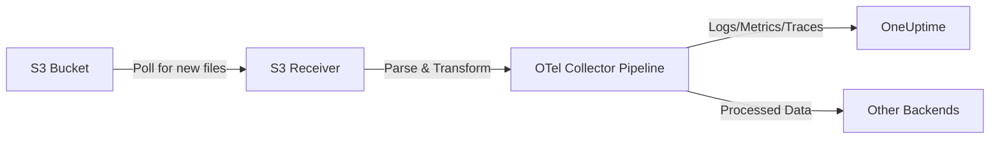

# How to Configure the AWS S3 Receiver in the OpenTelemetry Collector

Author: [nawazdhandala](https://www.github.com/nawazdhandala)

Tags: OpenTelemetry, Collector, AWS, S3, Logs, Observability, Cloud Storage

Description: Configure the AWS S3 Receiver in OpenTelemetry Collector to ingest logs and telemetry data from S3 buckets with real YAML examples, IAM policies, and production-ready patterns.

---

> Have telemetry data sitting in S3 buckets but no way to analyze it? The AWS S3 Receiver transforms cold storage into live observability data by pulling logs and metrics directly from S3 into your OpenTelemetry pipeline.

The AWS S3 Receiver is a specialized OpenTelemetry Collector component that reads telemetry data stored in Amazon S3 buckets. This receiver is particularly useful for ingesting archived logs, batch processing telemetry data, or building data pipelines that consolidate multiple data sources into a unified observability platform.

---

## What is the AWS S3 Receiver?

The AWS S3 Receiver connects to Amazon S3 to read telemetry data files (logs, traces, metrics) and feed them into the OpenTelemetry Collector pipeline. Unlike real-time receivers that accept streaming data, the S3 receiver operates on stored files, making it ideal for:

- **Historical data analysis**: Import past logs and metrics for trend analysis
- **Batch processing**: Process large volumes of telemetry data efficiently
- **Data migration**: Move telemetry from one system to another
- **Compliance and auditing**: Analyze archived logs for security investigations
- **Cost optimization**: Store telemetry in cheap S3 storage and process on-demand

### How It Works

The receiver monitors an S3 bucket for new files or processes existing files based on a prefix pattern. It downloads files, parses the content according to the configured format (JSON, CSV, text logs), and converts them into OpenTelemetry signals that flow through your collector pipeline.



---

## Prerequisites

Before configuring the S3 receiver, ensure you have:

1. **AWS Account** with S3 bucket containing telemetry data
2. **IAM Permissions** to read from the S3 bucket
3. **OpenTelemetry Collector** version 0.80.0 or later with the awss3receiver component
4. **AWS Credentials** configured (via environment variables, IAM role, or credentials file)
5. **Data format knowledge** - Understanding of how your telemetry data is structured in S3

---

## Required IAM Permissions

The OpenTelemetry Collector needs specific IAM permissions to read from S3. Create an IAM policy with these permissions:

```json
{
  "Version": "2012-10-17",
  "Statement": [
    {
      "Effect": "Allow",
      "Action": [
        "s3:GetObject",
        "s3:ListBucket"
      ],
      "Resource": [
        "arn:aws:s3:::your-telemetry-bucket",
        "arn:aws:s3:::your-telemetry-bucket/*"
      ]
    },
    {
      "Effect": "Allow",
      "Action": [
        "s3:GetBucketLocation"
      ],
      "Resource": "arn:aws:s3:::your-telemetry-bucket"
    }
  ]
}
```

Attach this policy to the IAM role used by your collector. If running on EC2 or ECS, use instance profiles. For external deployments, create an IAM user with access keys.

---

## Basic Configuration

Here's a minimal configuration to start reading logs from an S3 bucket. This example processes JSON-formatted logs stored in S3:

```yaml
# Configure the S3 receiver to read log files
receivers:
  # The awss3 receiver pulls data from S3 buckets
  awss3:
    # S3 bucket containing your telemetry data
    s3_bucket: my-telemetry-logs

    # AWS region where the bucket is located
    region: us-east-1

    # S3 key prefix to filter files (optional)
    # Only process files under this prefix
    s3_prefix: logs/application/

    # File matching pattern (glob syntax)
    # Process only JSON files
    s3_pattern: "*.json"

    # How often to check for new files
    poll_interval: 1m

    # Data format and parsing configuration
    # Specify how to parse the log files
    logs:
      # Parser type: json, regex, or raw
      parser: json

      # Time field for log timestamps
      timestamp_field: timestamp

      # Timestamp format (Go time layout)
      timestamp_format: "2006-01-02T15:04:05.000Z"

# Configure where to send the processed logs
exporters:
  # Export to OneUptime
  otlphttp:
    endpoint: https://oneuptime.com/otlp
    headers:
      x-oneuptime-token: ${ONEUPTIME_TOKEN}

# Define the logs pipeline
service:
  pipelines:
    logs:
      receivers: [awss3]
      exporters: [otlphttp]
```

This basic configuration polls the S3 bucket every minute, downloads JSON log files from the specified prefix, parses them, and sends the logs to OneUptime.

---

## Production Configuration with Processing

For production environments, add error handling, batching, and data transformation. This configuration demonstrates production best practices:

```yaml
receivers:
  awss3:
    # S3 bucket configuration
    s3_bucket: production-telemetry-logs
    region: us-west-2
    s3_prefix: logs/prod/
    s3_pattern: "*.json.gz"  # Support compressed files

    # Polling configuration
    poll_interval: 5m  # Check every 5 minutes

    # AWS credentials (optional - uses default credential chain if not specified)
    # Uncomment if using explicit credentials
    # aws_access_key_id: ${AWS_ACCESS_KEY_ID}
    # aws_secret_access_key: ${AWS_SECRET_ACCESS_KEY}

    # Maximum number of files to process per poll
    max_files_per_poll: 100

    # Delete files after successful processing
    # WARNING: Use with caution in production
    delete_on_read: false

    # Mark processed files by adding a tag instead of deleting
    mark_processed: true
    processed_tag: "otel-processed"

    # Log parsing configuration
    logs:
      parser: json
      timestamp_field: "@timestamp"
      timestamp_format: "2006-01-02T15:04:05.000Z07:00"

      # Map JSON fields to OpenTelemetry attributes
      attributes:
        # Application identifier
        - source_field: app_name
          target_attribute: service.name
        # Environment (prod, staging, dev)
        - source_field: environment
          target_attribute: deployment.environment
        # Log level
        - source_field: level
          target_attribute: log.level
        # Message body
        - source_field: message
          target_attribute: log.message

processors:
  # Protect collector from memory issues
  memory_limiter:
    limit_mib: 1024
    spike_limit_mib: 256
    check_interval: 5s

  # Add resource attributes to identify source
  resource:
    attributes:
      - key: source.type
        value: s3
        action: insert
      - key: cloud.provider
        value: aws
        action: insert
      - key: s3.bucket
        value: production-telemetry-logs
        action: insert

  # Filter out unnecessary logs to reduce costs
  filter/noise:
    logs:
      exclude:
        match_type: regexp
        # Exclude debug logs in production
        resource_attributes:
          - key: log.level
            value: "DEBUG"
        # Exclude health check logs
        body:
          - "/health"
          - "/healthz"
          - "/ping"

  # Batch logs before exporting
  batch:
    timeout: 10s
    send_batch_size: 1000
    send_batch_max_size: 2000

  # Transform log attributes if needed
  attributes/enrich:
    actions:
      # Add processing timestamp
      - key: processed_at
        value: ${TIMESTAMP}
        action: insert
      # Add collector version
      - key: otel.collector.version
        value: "0.93.0"
        action: insert

exporters:
  # Primary export to OneUptime
  otlphttp/oneuptime:
    endpoint: https://oneuptime.com/otlp
    headers:
      x-oneuptime-token: ${ONEUPTIME_TOKEN}
    compression: gzip
    timeout: 30s
    retry_on_failure:
      enabled: true
      initial_interval: 5s
      max_interval: 30s
      max_elapsed_time: 300s

  # Backup to file for debugging
  file:
    path: /var/log/otel/processed-logs.json
    rotation:
      max_megabytes: 100
      max_backups: 3

service:
  # Enable collector telemetry
  telemetry:
    logs:
      level: info
    metrics:
      address: :8888

  pipelines:
    logs:
      receivers: [awss3]
      processors:
        - memory_limiter
        - resource
        - filter/noise
        - attributes/enrich
        - batch
      exporters:
        - otlphttp/oneuptime
        - file
```

This production configuration includes:

- **Compressed file support**: Processes gzipped JSON files
- **Rate limiting**: Limits files processed per poll to prevent overload
- **Tagging processed files**: Marks files as processed without deletion
- **Attribute mapping**: Maps JSON fields to OpenTelemetry semantic conventions
- **Filtering**: Removes debug logs and health checks
- **Enrichment**: Adds metadata about processing
- **Error handling**: Retries and fallback to file export

---

## Parsing Different Log Formats

The S3 receiver supports multiple log formats. Here are common configurations:

### JSON Logs

Most modern applications export JSON logs. Configuration for structured JSON:

```yaml
receivers:
  awss3:
    s3_bucket: json-logs-bucket
    region: us-east-1
    logs:
      parser: json
      timestamp_field: timestamp
      timestamp_format: "2006-01-02T15:04:05Z"
      attributes:
        - source_field: service
          target_attribute: service.name
        - source_field: level
          target_attribute: severity_text
        - source_field: msg
          target_attribute: body
```

### Plain Text Logs

For unstructured text logs like Apache or Nginx access logs:

```yaml
receivers:
  awss3:
    s3_bucket: text-logs-bucket
    region: us-east-1
    logs:
      parser: regex
      # Regex pattern to extract fields
      regex_pattern: '^(?P<timestamp>[\d\-:T\.]+)\s+(?P<level>\w+)\s+(?P<message>.*)$'
      timestamp_field: timestamp
      timestamp_format: "2006-01-02T15:04:05.000"
      attributes:
        - source_field: level
          target_attribute: severity_text
        - source_field: message
          target_attribute: body
```

### CSV Files

For CSV-formatted telemetry data:

```yaml
receivers:
  awss3:
    s3_bucket: csv-metrics-bucket
    region: us-east-1
    metrics:
      parser: csv
      delimiter: ","
      header_row: true
      timestamp_column: 0
      timestamp_format: "2006-01-02 15:04:05"
      columns:
        - name: timestamp
          type: timestamp
        - name: metric_name
          type: string
        - name: metric_value
          type: float64
        - name: host
          type: string
```

---

## Processing S3 Event Notifications

For real-time processing, configure S3 to send event notifications when new files are uploaded. Instead of polling, the collector receives immediate notifications:

```yaml
receivers:
  awss3:
    s3_bucket: realtime-logs-bucket
    region: us-east-1

    # Enable S3 event notifications via SQS
    sqs_queue_url: https://sqs.us-east-1.amazonaws.com/123456789/telemetry-events

    # Maximum messages to receive per SQS poll
    max_messages: 10

    # Visibility timeout for SQS messages
    visibility_timeout: 300

    # Wait time for SQS long polling
    wait_time_seconds: 20

    logs:
      parser: json
      timestamp_field: timestamp
      timestamp_format: "2006-01-02T15:04:05Z"

exporters:
  otlphttp:
    endpoint: https://oneuptime.com/otlp
    headers:
      x-oneuptime-token: ${ONEUPTIME_TOKEN}

service:
  pipelines:
    logs:
      receivers: [awss3]
      exporters: [otlphttp]
```

### Setting Up S3 Event Notifications

1. Create an SQS queue for event notifications
2. Configure S3 bucket to send events to the queue:

```json
{
  "QueueConfigurations": [
    {
      "QueueArn": "arn:aws:sqs:us-east-1:123456789:telemetry-events",
      "Events": ["s3:ObjectCreated:*"],
      "Filter": {
        "Key": {
          "FilterRules": [
            {
              "Name": "prefix",
              "Value": "logs/"
            },
            {
              "Name": "suffix",
              "Value": ".json"
            }
          ]
        }
      }
    }
  ]
}
```

3. Update SQS queue policy to allow S3 notifications:

```json
{
  "Version": "2012-10-17",
  "Statement": [
    {
      "Effect": "Allow",
      "Principal": {
        "Service": "s3.amazonaws.com"
      },
      "Action": "sqs:SendMessage",
      "Resource": "arn:aws:sqs:us-east-1:123456789:telemetry-events",
      "Condition": {
        "ArnLike": {
          "aws:SourceArn": "arn:aws:s3:::realtime-logs-bucket"
        }
      }
    }
  ]
}
```

---

## Multi-Bucket Configuration

Process telemetry from multiple S3 buckets by defining multiple receivers:

```yaml
receivers:
  # Application logs from production
  awss3/prod_logs:
    s3_bucket: prod-app-logs
    region: us-east-1
    s3_prefix: logs/
    logs:
      parser: json
      timestamp_field: timestamp

  # Application logs from staging
  awss3/staging_logs:
    s3_bucket: staging-app-logs
    region: us-east-1
    s3_prefix: logs/
    logs:
      parser: json
      timestamp_field: timestamp

  # Archived metrics from data warehouse
  awss3/metrics_archive:
    s3_bucket: metrics-archive
    region: us-west-2
    s3_prefix: metrics/
    metrics:
      parser: csv

processors:
  # Tag production logs
  resource/prod:
    attributes:
      - key: deployment.environment
        value: production
        action: insert

  # Tag staging logs
  resource/staging:
    attributes:
      - key: deployment.environment
        value: staging
        action: insert

exporters:
  otlphttp:
    endpoint: https://oneuptime.com/otlp
    headers:
      x-oneuptime-token: ${ONEUPTIME_TOKEN}

service:
  pipelines:
    # Production logs pipeline
    logs/prod:
      receivers: [awss3/prod_logs]
      processors: [resource/prod]
      exporters: [otlphttp]

    # Staging logs pipeline
    logs/staging:
      receivers: [awss3/staging_logs]
      processors: [resource/staging]
      exporters: [otlphttp]

    # Metrics pipeline
    metrics:
      receivers: [awss3/metrics_archive]
      exporters: [otlphttp]
```

---

## Deployment Patterns

### Pattern 1: Scheduled Batch Processing

Run the collector on a schedule (cron job, AWS Lambda, ECS scheduled task) to process logs periodically:

```yaml
receivers:
  awss3:
    s3_bucket: batch-logs
    region: us-east-1
    # Process last 24 hours of logs
    s3_prefix: logs/${YEAR}/${MONTH}/${DAY}/
    max_files_per_poll: 1000
    # Delete after processing since this is batch mode
    delete_on_read: true
    logs:
      parser: json

exporters:
  otlphttp:
    endpoint: https://oneuptime.com/otlp
    headers:
      x-oneuptime-token: ${ONEUPTIME_TOKEN}

service:
  pipelines:
    logs:
      receivers: [awss3]
      exporters: [otlphttp]
```

Deploy as a Lambda function triggered daily:

```python
import subprocess
import os
from datetime import datetime

def lambda_handler(event, context):
    # Set date variables for S3 prefix
    today = datetime.now()
    os.environ['YEAR'] = today.strftime('%Y')
    os.environ['MONTH'] = today.strftime('%m')
    os.environ['DAY'] = today.strftime('%d')

    # Run the collector
    result = subprocess.run([
        '/opt/otelcol',
        '--config', '/opt/config.yaml'
    ], capture_output=True, text=True)

    return {
        'statusCode': 200,
        'body': f'Processed logs: {result.stdout}'
    }
```

### Pattern 2: Continuous Processing

Run the collector as a long-running service (ECS, Kubernetes, EC2) with SQS event notifications for near-real-time processing:

```yaml
receivers:
  awss3:
    s3_bucket: continuous-logs
    region: us-east-1
    sqs_queue_url: https://sqs.us-east-1.amazonaws.com/123456789/log-events
    max_messages: 10
    wait_time_seconds: 20
    logs:
      parser: json

exporters:
  otlphttp:
    endpoint: https://oneuptime.com/otlp
    headers:
      x-oneuptime-token: ${ONEUPTIME_TOKEN}

service:
  pipelines:
    logs:
      receivers: [awss3]
      exporters: [otlphttp]
```

### Pattern 3: Data Migration

One-time migration of historical data from S3 to a new observability platform:

```yaml
receivers:
  awss3:
    s3_bucket: historical-telemetry
    region: us-east-1
    # Process all historical data
    s3_prefix: archive/
    s3_pattern: "**/*.json"
    # Aggressive processing
    max_files_per_poll: 500
    poll_interval: 30s
    # Clean up after migration
    delete_on_read: true
    logs:
      parser: json

exporters:
  otlphttp/oneuptime:
    endpoint: https://oneuptime.com/otlp
    headers:
      x-oneuptime-token: ${ONEUPTIME_TOKEN}
    # Increase batch size for faster migration
    timeout: 60s

processors:
  batch:
    timeout: 30s
    send_batch_size: 5000
    send_batch_max_size: 10000

service:
  pipelines:
    logs:
      receivers: [awss3]
      processors: [batch]
      exporters: [otlphttp/oneuptime]
```

---

## Monitoring and Troubleshooting

### Enable Collector Metrics

Monitor the S3 receiver's performance by exposing internal metrics:

```yaml
service:
  telemetry:
    logs:
      level: info
    metrics:
      address: :8888
      level: detailed
```

Key metrics to monitor:

- `otelcol_receiver_accepted_log_records` - Logs successfully received
- `otelcol_receiver_refused_log_records` - Logs rejected due to errors
- `otelcol_exporter_sent_log_records` - Logs successfully exported
- `otelcol_exporter_send_failed_log_records` - Export failures

### Common Issues and Solutions

#### Issue: High Memory Usage

**Cause**: Processing large files or too many files at once

**Solution**: Reduce max_files_per_poll and add memory limiter:

```yaml
receivers:
  awss3:
    max_files_per_poll: 50  # Reduce from default

processors:
  memory_limiter:
    limit_mib: 512
    check_interval: 1s
```

#### Issue: Files Not Being Processed

**Cause**: IAM permissions, incorrect prefix, or pattern mismatch

**Solution**: Enable debug logging and verify permissions:

```yaml
service:
  telemetry:
    logs:
      level: debug
```

Check logs for errors like:
- `AccessDenied` - IAM permissions issue
- `NoSuchBucket` - Bucket name incorrect
- `NoSuchKey` - Prefix or pattern not matching files

#### Issue: Duplicate Data

**Cause**: Collector reprocessing same files

**Solution**: Enable processed file marking:

```yaml
receivers:
  awss3:
    mark_processed: true
    processed_tag: "processed-timestamp"
```

---

## Cost Optimization

S3 data transfer and API calls can add up. Optimize costs with these strategies:

### 1. Use S3 Lifecycle Policies

Automatically transition old logs to cheaper storage classes:

```json
{
  "Rules": [
    {
      "Id": "TransitionOldLogs",
      "Status": "Enabled",
      "Transitions": [
        {
          "Days": 30,
          "StorageClass": "STANDARD_IA"
        },
        {
          "Days": 90,
          "StorageClass": "GLACIER"
        }
      ]
    }
  ]
}
```

### 2. Reduce Polling Frequency

For non-urgent data, poll less frequently:

```yaml
receivers:
  awss3:
    poll_interval: 1h  # Poll once per hour instead of every minute
```

### 3. Filter Before Processing

Only download and process files you need:

```yaml
receivers:
  awss3:
    # Use specific prefix to limit files
    s3_prefix: logs/errors/
    # Only process error logs
    s3_pattern: "*error*.json"
```

### 4. Use S3 Select (Future Enhancement)

S3 Select allows filtering data before download, reducing transfer costs. While not yet supported in the receiver, watch for this feature in future releases.

---

## Integration with OneUptime

OneUptime seamlessly ingests logs from the S3 receiver. Once configured, you can:

- **Search historical logs**: Query logs imported from S3 archives
- **Create dashboards**: Visualize trends from batch-processed data
- **Set up alerts**: Alert on patterns in archived logs
- **Correlate with live data**: Combine historical S3 data with real-time telemetry

Example OneUptime query for S3-sourced logs:

```
source.type = "s3" AND log.level = "ERROR" AND s3.bucket = "production-logs"
```

---

## Related Resources

- [How to Configure AWS ECS Container Metrics Receiver](https://oneuptime.com/blog/post/2026-02-06-aws-ecs-container-metrics-receiver-opentelemetry-collector/view)
- [OpenTelemetry Collector: What It Is and When You Need It](https://oneuptime.com/blog/post/2025-09-18-what-is-opentelemetry-collector-and-why-use-one/view)
- [How to Structure Logs Properly in OpenTelemetry](https://oneuptime.com/blog/post/2025-08-28-how-to-structure-logs-properly-in-opentelemetry/view)

---

## Conclusion

The AWS S3 Receiver unlocks the value of telemetry data stored in S3 buckets. Whether you're performing historical analysis, migrating between observability platforms, or building batch processing pipelines, this receiver provides the flexibility to work with S3-based telemetry data.

Start with basic polling configuration for simple use cases, then add event-driven processing, multi-bucket support, and cost optimization as your needs grow. With proper IAM permissions, parsing configuration, and monitoring, you'll have a production-ready S3 ingestion pipeline that scales with your data volume.

The combination of cheap S3 storage with on-demand processing through OpenTelemetry provides a cost-effective approach to long-term telemetry retention and analysis.

---

**Need to process S3 telemetry data?** OneUptime provides native support for OpenTelemetry logs, metrics, and traces from any source, including S3. Start analyzing your archived telemetry today.
